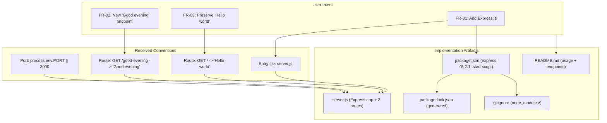

# Technical Specification

# 0. Agent Action Plan

## 0.1 Intent Clarification

### 0.1.1 Core Feature Objective

Based on the prompt, the Blitzy platform understands that the new feature requirement is to **introduce the Express.js web framework into the Node.js project and expose a second HTTP endpoint that returns the plain-text response "Good evening"**, while the project's original endpoint continues to return "Hello world". The user frames the work as adding a feature to an existing "tutorial of node js server hosting one endpoint."

The user's request is preserved verbatim below.

> **User Prompt (verbatim):**
> Do not create a github workflow files
>
> add feature to a existing product
> this is a tutorial of node js server hosting one endpoint that returns the response "Hello world". Could you add expressjs into the project and add another endpoint that return the reponse of "Good evening"?

The requirement decomposes into the following feature requirements, restated with the maximum clarity the evidence supports:

- **FR-01 — Adopt Express.js.** Introduce the `express` package as a runtime dependency and use it as the project's HTTP framework (replacing/standing in for the native `http` tutorial baseline described by the user).
- **FR-02 — Add a "Good evening" endpoint.** Register a second HTTP route whose response body is exactly `Good evening`.
- **FR-03 — Preserve the "Hello world" endpoint (implicit, backward compatibility).** The originally described endpoint returning exactly `Hello world` must remain reachable; it will be served by Express at the root route `GET /`.
- **FR-04 — Establish the missing baseline (implicit, prerequisite).** The Node.js "Hello world" server the user refers to as "existing" does **not physically exist** in the repository (see the repository-state finding below). To give the feature a host to attach to, the runnable Node/Express baseline must be created in the same change set.
- **FR-05 — Manage dependencies (implicit).** Create a `package.json` declaring `express`, generate a `package-lock.json` for reproducible installs, and install the dependency into a local (non-committed) `node_modules/`.

**Critical repository-state finding (verified).** Although the prompt describes an *existing* product, the repository "Artifact12" is in a pre-implementation, placeholder state. The only substantive tracked file is `README.md`, which contains a single H1 heading "Artifact12" [README.md:L1]. The Technical Specification corroborates the verified absence of any Node.js source or manifests — "No source code files (zero matches for `.js` ...)" and "No dependency manifests (no `package.json` ...)" [blitzy/documentation/Technical Specifications.md:§1.2.2.3] — and lists Express specifically as a backend framework that is "Not committed" [blitzy/documentation/Technical Specifications.md:§3.3.1], with all npm manifests "None present" [blitzy/documentation/Technical Specifications.md:§3.4.1]. The committed `blitzy/documentation/*` artifacts reflect a *prior* run whose requirements channel was a placeholder (the committed `Input Prompt.md` is the word "custom" repeated 28 times) [blitzy/documentation/Input Prompt.md:L1-L54]; this Agent Action Plan supersedes that placeholder interpretation with the real feature request above.

**Feature dependencies and prerequisites:**

- A Node.js runtime of **>= 18** (required by Express 5.x; Node.js 22.x LTS is recommended and is the runtime available in the build environment).
- The npm CLI to install `express` and generate the lockfile.
- Because the described baseline is absent, the "existing product" prerequisite is satisfied *within this change set* by creating the manifest and the server entry point rather than by modifying pre-existing source.

### 0.1.2 Special Instructions and Constraints

- **Explicit user directive — no GitHub workflow files.** The user states "Do not create a github workflow files." No files may be created under `.github/workflows/` (and no GitHub Actions/CI workflow definitions of any kind).
- **Backward compatibility.** The pre-existing behavior — an endpoint returning `Hello world` — must be retained after Express is introduced (FR-03).
- **Exact response strings.** The response bodies must match the user's text exactly, including casing and spacing: `Hello world` and `Good evening`.
- **Valid, real dependency version.** The `express` version must be a genuine published version, not a placeholder such as `latest` or `1.0.0`. The current stable release is **5.2.1** (npm `latest` dist-tag), which is the version this plan pins.
- **Minimal, tutorial-appropriate scope.** The project is described as a tutorial; no unrequested capabilities (authentication, databases, persistence, etc.) are to be introduced.
- **User-provided examples (preserved verbatim):** `User Example: "Hello world"` and `User Example: "Good evening"`.
- **External research requirement.** Confirming the current stable Express version and its runtime requirement was required and has been completed (see §0.2.2). The in-environment `web_search` returned no results; the version facts were obtained authoritatively from the npm registry.

### 0.1.3 Technical Interpretation

These feature requirements translate to the following technical implementation strategy:

- **To adopt Express.js (FR-01), we will create `package.json`** declaring `express` at `^5.2.1` and install it, turning the placeholder repository into a runnable npm project.
- **To establish the baseline (FR-04), we will create `server.js`** as the Express entry point and add an npm `start` script (`node server.js`).
- **To preserve "Hello world" (FR-03), we will register `GET /` in the Express app** returning the exact string `Hello world`.
- **To add the "Good evening" endpoint (FR-02), we will register `GET /good-evening`** returning the exact string `Good evening`.
- **To manage dependencies (FR-05), we will generate `package-lock.json`** during install and add a `.gitignore` that excludes `node_modules/`.

The relationship between the user's intent, the resolved ambiguities, and the resulting implementation is summarized below:



Because the user did not specify several details, the following conventions are adopted and flagged for confirmation:

| Ambiguity | Resolution Adopted | Alternatives |
|-----------|--------------------|--------------|
| New endpoint path | `GET /good-evening` (lowercase, hyphenated) | `/goodevening`, `/evening` |
| Server entry filename | `server.js` (as `main` + `start` target) | `index.js`, `app.js` |
| Module system | CommonJS (`require`) | ESM (`import`) — requires `"type": "module"` |
| Listening port | `process.env.PORT || 3000` | Any fixed port |

## 0.2 Repository Scope Discovery

### 0.2.1 Comprehensive File Analysis and Integration Points

An exhaustive inventory of the repository confirms it is documentation-led and contains no application source. The complete set of tracked files (excluding `.git`) is:

| Path | Type | Role | Action in This Feature |
|------|------|------|------------------------|
| `README.md` | Markdown | Project identity — single H1 "Artifact12" [README.md:L1] | UPDATE (add usage + endpoints) |
| `blitzy/documentation/Technical Specifications.md` | Markdown | Master Technical Specification (prior run) | REFERENCE only |
| `blitzy/documentation/Agent Action Plan.md` | Markdown | Prior preserve-state AAP (superseded) | REFERENCE only |
| `blitzy/documentation/Input Prompt.md` | Markdown | Placeholder input ("custom" ×28) [blitzy/documentation/Input Prompt.md:L1-L54] | REFERENCE only |

There are **no** `package*.json`, `*.js`/`*.mjs`/`*.cjs`/`*.ts`, `.gitignore`, `.env*`, `Dockerfile*`, or `.github/**` files present in the repository (verified by full-tree search and corroborated by [blitzy/documentation/Technical Specifications.md:§1.2.2.3]).

**Integration point discovery.** Because no application code exists yet, there are no pre-existing routers, controllers, services, models, migrations, or middleware to wire into; integration is instead *into the new project skeleton* that this feature establishes. The table below enumerates the conventional integration categories and the action for each:

| Integration Category | Existing Artifact? | Action |
|----------------------|--------------------|--------|
| HTTP server bootstrap | None [blitzy/documentation/Technical Specifications.md:§1.2.2.3] | Create `server.js` (`express()` app + `app.listen`) |
| API endpoints / router | None | Register `GET /` and `GET /good-evening` in `server.js` |
| Controllers / handlers | None | Implement inline route handlers in `server.js` |
| Middleware / interceptors | None | None required (plain-text `GET` responses; no body parsing needed) |
| Database models / migrations | None | Not applicable (out of scope) |
| Service classes / DI container | None | Not applicable (out of scope) |
| Dependency / script wiring | None | Declare `express` + `start` script in `package.json` |

Had a legacy native-`http` server file existed, its single request handler would have been refactored into the Express `GET /` route; since none exists, the route is created fresh while preserving the original `Hello world` behavior.

### 0.2.2 External Research Conducted

Research was limited to confirming an accurate, current dependency version (no speculative scope was added):

- **Current Express version and runtime requirement.** The npm registry reports `express` `latest` = **5.2.1** (and `latest-4` = 4.22.2), with package `engines` of `node: ">= 18"`. This establishes both the version to pin and the minimum Node.js runtime. The in-environment `web_search` returned no results; these facts were obtained directly from the npm registry.
- **Best practices for the integration approach.** For plain-text responses, register routes with `app.get(path, handler)` and reply with `res.send(...)`; bind to a configurable port via `process.env.PORT || 3000`; exclude `node_modules/` via `.gitignore`; and name new routes semantically.
- **Express 5 migration note.** Express 5 removed the bare `"*"` string wildcard path syntax used in Express 4 (named wildcards are now required). This does not affect the two fixed routes (`/` and `/good-evening`) planned here, but is recorded so downstream code generation avoids the deprecated pattern.

### 0.2.3 New File Requirements

The following new files will be created (purposes summarized; full execution detail in §0.4):

- `package.json` — npm manifest declaring `express ^5.2.1`, the `start` script (`node server.js`), `main`, and `engines.node ">=18"`.
- `server.js` — Express application entry point hosting both endpoints and binding the listener.
- `package-lock.json` — generated by `npm install`; pins `express` and its full transitive dependency tree for reproducible installs.
- `.gitignore` — excludes `node_modules/` (and common local artifacts such as logs and `.env`).

The single existing file requiring modification is `README.md` (documentation update). No new configuration directory, database, or test scaffolding is introduced (see Scope Boundaries, §0.5).

## 0.3 Dependency Inventory and Integration Analysis

### 0.3.1 Package Additions

The repository currently declares **zero** open-source dependencies, and no npm manifest exists [blitzy/documentation/Technical Specifications.md:§3.4.1]; Express is explicitly recorded as "Not committed" [blitzy/documentation/Technical Specifications.md:§3.3.1]. This feature introduces exactly one direct dependency:

| Package | Registry | Version | Scope | Purpose |
|---------|----------|---------|-------|---------|
| `express` | npm | `^5.2.1` | `dependencies` (runtime) | Web framework providing the routing layer for both HTTP endpoints |

- The version `5.2.1` is the npm `latest` dist-tag (a real, published release), satisfying the "no placeholder versions" constraint. Express 5.x requires Node.js `>= 18`.
- **Transitive dependencies** of Express (its internal router, body/query parsing, MIME handling, etc.) are resolved and pinned automatically into `package-lock.json` by `npm install`; they are not hand-enumerated here because the lockfile is a generated artifact.
- **No development or test dependencies** are added (the tutorial scope does not request a test framework; see §0.5.2).

### 0.3.2 Import and Reference Updates

- **Import updates.** All imports are new code; there are no pre-existing import statements to migrate (no source files exist). The entry point introduces a single import:
  - New: `const express = require('express');` (CommonJS default). An ESM alternative (`import express from 'express';`) would additionally require `"type": "module"` in `package.json`.
- **External reference updates.**
  - `README.md` — add install/run instructions and an endpoints reference (documentation only).
  - `.gitignore` — newly created to exclude `node_modules/`.
  - **No** build, CI, or `.github/**` files are touched; GitHub workflow files are explicitly excluded per the user directive.

### 0.3.3 Integration Analysis — Existing Code Touchpoints

Because the repository has no application code, there are no existing modules to modify; the "touchpoints" are the new skeleton files this feature establishes, which together form the complete wiring:

- `server.js` — the integration hub: instantiates the Express app, registers `GET /` (returns `Hello world`) and `GET /good-evening` (returns `Good evening`), and starts the listener via `app.listen(process.env.PORT || 3000)`.
- `package.json` — wires the runtime: declares the `express` dependency, the `start` script (`node server.js`), and the `main` entry.
- `README.md` — documents the runtime contract (how to install, run, and call each endpoint).

There is no dependency-injection container to register services in, no `models/__init__`-style export barrel to extend, and no migration directory to amend — all such artifacts are absent from the repository [blitzy/documentation/Technical Specifications.md:§1.2.2.3] and remain out of scope.

## 0.4 Technical Implementation

### 0.4.1 File-by-File Execution Plan

Every file below must be created or modified. Files are grouped by role; paths are repository-root-relative.

**Group 1 — Core feature files (establish baseline + feature):**

| Mode | File | Purpose |
|------|------|---------|
| CREATE | `package.json` | npm manifest: `name`, `version`, `main: server.js`, `scripts.start: "node server.js"`, `engines.node: ">=18"`, `dependencies: { "express": "^5.2.1" }` |
| CREATE | `server.js` | Express entry point: instantiate app, register both routes, bind listener |

**Group 2 — Dependency lock and hygiene:**

| Mode | File | Purpose |
|------|------|---------|
| CREATE (generated) | `package-lock.json` | Produced by `npm install`; pins `express ^5.2.1` and its transitive tree |
| CREATE | `.gitignore` | Excludes `node_modules/` (and common local artifacts) from version control |
| INSTALL ARTIFACT (not committed) | `node_modules/` | Local Express runtime produced by `npm install`; excluded via `.gitignore` |

**Group 3 — Documentation:**

| Mode | File | Purpose |
|------|------|---------|
| UPDATE | `README.md` | Add Prerequisites, Install, Run, and an Endpoints table beneath the existing "# Artifact12" heading [README.md:L1] |

### 0.4.2 Implementation Approach per File

- **`package.json` (CREATE).** Declare the project metadata and the single runtime dependency, plus the run script and engine constraint. The dependency block is:

```json
"dependencies": { "express": "^5.2.1" }
```

- **`server.js` (CREATE).** Require Express, instantiate the app, register the preserved root route and the new route, then listen. The two route registrations are the essence of the feature:

```javascript
app.get('/', (req, res) => res.send('Hello world'));
app.get('/good-evening', (req, res) => res.send('Good evening'));
```

  The listener binds to a configurable port: `app.listen(process.env.PORT || 3000)`. The exact strings `Hello world` and `Good evening` are reproduced byte-for-byte to satisfy FR-02/FR-03.
- **`package-lock.json` (CREATE, generated).** Not hand-authored; produced and maintained by `npm install` to lock the resolved dependency graph for reproducible builds.
- **`.gitignore` (CREATE).** Exclude `node_modules/` (and optionally `npm-debug.log*`, `.env`) so the dependency cache is not committed.
- **`README.md` (UPDATE).** Beneath the existing title, document the prerequisite Node.js version, `npm install`, `npm start`, and a table listing `GET /` → `Hello world` and `GET /good-evening` → `Good evening`.

No file in this plan references a Figma URL or design asset (none were provided).

### 0.4.3 User Interface Design

**Not applicable.** The feature is a backend HTTP server whose endpoints return plain-text strings (`Hello world`, `Good evening`); there is no graphical user interface, no component library, and no design system involved. Accordingly, the Design System Alignment Protocol does not apply and no "Design System Compliance" sub-section is produced. Verification is performed at the HTTP level (for example, `curl http://localhost:3000/` and `curl http://localhost:3000/good-evening`).

## 0.5 Scope Boundaries

### 0.5.1 Exhaustively In Scope

- `/package.json` — npm manifest declaring `express ^5.2.1`, the `start` script, `main`, and `engines.node ">=18"`.
- `/package-lock.json` — generated dependency lockfile.
- `/server.js` — Express application entry point hosting `GET /` (`Hello world`) and `GET /good-evening` (`Good evening`) and binding the listener.
- `/.gitignore` — excludes `node_modules/`.
- `/README.md` — documentation update (prerequisites, install, run, endpoints).
- `/node_modules/**` — local install artifact created by `npm install` (present at runtime, **not** committed; excluded by `.gitignore`).

**Requirement coverage check** — every feature requirement maps to a concrete artifact:

| Requirement | Covered By |
|-------------|------------|
| FR-01 (add Express) | `package.json`, `package-lock.json`, `node_modules/`, `server.js` (`require('express')`) |
| FR-02 ("Good evening") | `server.js` (`GET /good-evening`) |
| FR-03 ("Hello world") | `server.js` (`GET /`) |
| FR-04 (establish baseline) | `package.json`, `server.js` |
| FR-05 (dependency management) | `package.json`, `package-lock.json`, `.gitignore` |

### 0.5.2 Explicitly Out of Scope

- **GitHub workflow / CI files** — `.github/workflows/**` and any GitHub Actions or other CI workflow definitions. Excluded by the explicit user directive "Do not create a github workflow files."
- **Automated test suites and test frameworks** — `tests/**`, `*.test.js`, `*.spec.js`, and runners such as Jest/Mocha/Supertest. Not requested by the tutorial; verification is manual via `curl`. (Optional future follow-up.)
- **Persistence and auth** — databases, ORMs, migrations, authentication/authorization, and session handling.
- **Additional middleware/config** — body/JSON parsing, validation, logging frameworks, and environment configuration beyond `PORT`.
- **Containerization, IaC, deployment, and monitoring** — `Dockerfile`/compose, infrastructure-as-code, deployment descriptors, and observability tooling.
- **Additional endpoints or features** — anything beyond `GET /` and `GET /good-evening`.
- **Unrelated refactoring** — no changes to files unrelated to this feature.
- **`blitzy/documentation/**`** — the Blitzy documentation workspace (Technical Specification, prior AAP, Input Prompt) is reference-only, not application source to modify.
- **README content beyond minimal usage** — only the install/run/endpoints additions are in scope; broader documentation is not.

## 0.6 Rules for Feature Addition

The following feature-specific rules and conventions, emphasized by the user or required by the integration approach, govern this change. No user-supplied implementation rules were provided through the rules channel (it was empty); the rules below are derived from the prompt directives and Node.js/npm conventions.

- **Do not create GitHub workflow files.** No files may be added under `.github/workflows/`, and no GitHub Actions or other CI workflow definitions may be created. This is an explicit, non-negotiable user directive.
- **Preserve backward compatibility.** The original behavior must remain: `GET /` must continue to return exactly `Hello world` after Express is introduced.
- **Reproduce response strings exactly.** Endpoint bodies must match the user's text byte-for-byte, including casing and the single space: `Hello world` and `Good evening`.
- **Pin a real dependency version.** Use the genuine published Express version `^5.2.1`; never use placeholder versions such as `latest` or `1.0.0`.
- **Honor the runtime requirement.** Target Node.js `>= 18` (Express 5 requirement); Node.js 22.x LTS is recommended. Declare this via `engines` in `package.json`.
- **Follow Node.js/npm conventions.** Provide a `package.json` manifest with a `start` script, keep `package-lock.json` under version control, and exclude `node_modules/` via `.gitignore`.
- **Use Express idioms.** Register routes with `app.get(...)` and respond with `res.send(...)`; use semantic, lowercase, hyphenated route paths (e.g., `/good-evening`); avoid the Express 4 bare `"*"` wildcard syntax removed in Express 5.
- **Keep scope minimal.** Implement only the two requested endpoints and the Express integration; introduce no unrequested features, dependencies, or infrastructure.

## 0.7 Attachments

No attachments were provided with this request.

- **File attachments:** None. The `review_attachments` channel returned "No attachments found for this project" — there are no PDFs, images, documents, or other files to summarize.
- **Figma screens:** None. No Figma frames, URLs, or design metadata were supplied. There is therefore no design-to-component mapping to perform, consistent with the backend-only, no-UI nature of this feature (see §0.4.3).

