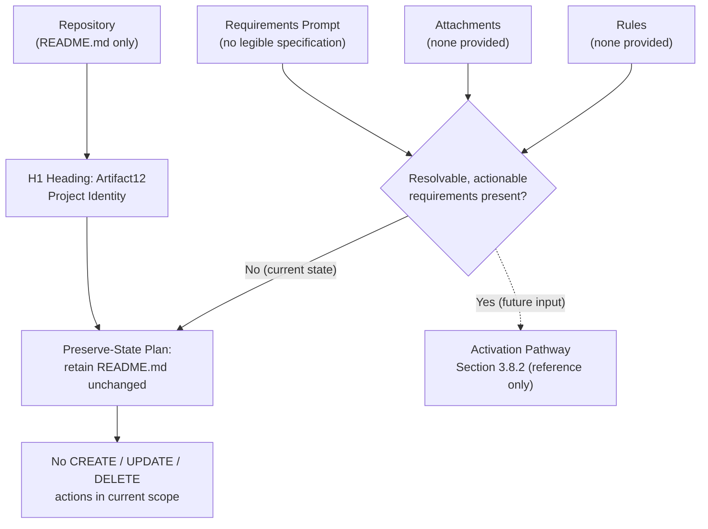

# Technical Specification

# 0. Agent Action Plan

## 0.1 Intent Clarification

### 0.1.1 Core Objective

Based on the provided inputs, the Blitzy platform understands that the **Artifact12** repository exists in a verified pre-implementation, placeholder state, and that the supplied requirements prompt did not resolve into a legible, actionable development specification. The requirements channel returned only non-substantive placeholder tokens; no attachments were provided; and no implementation rules were specified. Consequently, the single objective that can be asserted on the basis of repository evidence is the **establishment and preservation of the project's identity**, declared by the level-one heading `# Artifact12` in the project's README [README.md:L1].

The platform therefore interprets the actionable intent as a **preserve-state baseline**: maintain the repository's identity declaration without fabricating features, source code, configuration, tests, or dependencies that no input has authorized. This interpretation is consistent with the evidence-based, absence-documenting methodology applied throughout the surrounding Technical Specification.

The requirements, restated with the maximum clarity the evidence supports:

- **R-AAP-01 — Preserve project identity.** Retain the project name "Artifact12" exactly as declared in the README [README.md:L1]. This is the only positively evidenced requirement.
- **R-AAP-02 — Do not introduce unauthorized scope (implicit).** Because no specification, attachment, or rule defines features, capabilities, or technologies, the platform must not invent them. This implicit constraint follows directly from the absence of inputs and mirrors Assumption A-003 of Section 2.6.1, which holds that fabricating requirement identifiers would violate the established documentation principles.

Dependencies and prerequisites:

- A **resolvable requirements specification** is a hard prerequisite for any substantive implementation (creation or modification of source, configuration, tests, or build assets). Until such input is supplied, no development work can be derived without fabrication, and the plan necessarily remains a preserve-state baseline.

### 0.1.2 Task Categorization

- **Primary task type:** Documentation — production of an evidence-based Agent Action Plan over a placeholder repository. The substantive development categories (bug fix, configuration, performance optimization, security enhancement, tooling, build/deploy) are **not applicable** because no such work is specified by any input.
- **Secondary aspects:** None. No secondary dimensions (testing, data migration, refactoring, integration) are evidenced by the prompt, attachments, rules, or repository.
- **Scope classification:** Isolated change with **no substantive code modification**. The repository's placeholder state is preserved; the action plan introduces no cross-cutting or infrastructure changes.

### 0.1.3 Special Instructions and Constraints

- **Explicit user directives:** None. The rules channel returned an empty set, and the prompt contained no legible directives (for example, "documentation only," "do not modify existing tests," or "maintain backward compatibility").
- **Methodological requirement (derived):** Operate strictly on repository evidence and refrain from fabricating requirements, features, or technology selections. This mirrors the guardrails applied throughout the existing specification (Section 2.6.1, Assumption A-003).
- **User-provided examples:** None. No examples accompanied the prompt and no attachments were supplied; therefore there are no examples to preserve verbatim.
- **Web search requirements:** None warranted. With no implementable task, external best-practice research would be speculative and would risk introducing unauthorized scope; accordingly, no web research was conducted.

### 0.1.4 Technical Interpretation

These requirements translate into the following technical implementation strategy:

- **To preserve project identity (R-AAP-01), retain the README unchanged** [README.md:L1]. No edit is required because the identity heading is already present and correct, and no input authorizes additional README content.
- **To prevent unauthorized scope (R-AAP-02), perform no CREATE, UPDATE, or DELETE operations** on any file. The action plan deliberately contains zero source, configuration, test, or build changes.
- **To enable future work, treat the activation pathway in Section 3.8.2 as a reference only** — it describes, but does not commit to, the standard sequence (language selection, framework and manifest initialization, dependency declaration, third-party integration, persistence-layer selection, and build/CI-CD definition) that would apply once a resolvable specification is supplied.

The relationship between the supplied inputs, the verified evidence, and the resulting actions is summarized below:

## 0.2 Repository Scope Discovery

### 0.2.1 Comprehensive File Analysis

An exhaustive discovery pass was conducted across the repository — directory enumeration from the root, hidden-file inspection, full-tree traversal, and git-history review. The complete, verified inventory of tracked content is a single file:

| Path | Type | Size | Observed Purpose |
|------|------|------|------------------|
| `README.md` | Documentation (Markdown) | 12 bytes | Declares project identity via the H1 heading `# Artifact12` [README.md:L1] |

The repository's version history corroborates this state: a single commit ("Initial commit") introduced the lone file, and no subsequent history adds source, configuration, or planning artifacts. The search patterns prescribed for general tasks were each evaluated against the tree and resolved to **no matches** beyond the single documentation file:

| Search Pattern Class | Representative Globs | Files Found |
|----------------------|----------------------|-------------|
| Documentation | `**/*.md`, `docs/**/*`, `README*`, `CONTRIBUTING*`, `**/*.rst` | `README.md` only [README.md:L1] |
| Configuration | `**/*.config.*`, `**/*.json`, `**/*.yaml`, `**/*.toml`, `**/*.xml`, `.env*`, `.*rc` | None |
| Source code | `src/**/*`, `lib/**/*`, `app/**/*`, `**/*.py`, `**/*.js`, `**/*.java`, `**/*.ts` | None |
| Build / Deploy | `Dockerfile*`, `docker-compose*`, `.github/workflows/*`, `.gitlab-ci.*`, `Makefile*`, `**/*build.*` | None |
| Scripts | `scripts/**/*`, `bin/**/*`, `tools/**/*` | None |
| Tests | `tests/**/*`, `**/*test*.*`, `**/*spec*.*`, `test/**/*` | None |

Related-file discovery (files importing or depending on modified components, configuration affected by code changes, documentation requiring synchronization) yields **no candidates**, because there is no source component, configuration, or interface from which a dependency relationship could originate. There are therefore no "pending" or "to-be-discovered" files; the inventory above is complete.

### 0.2.2 Web Search Research Conducted

No web search research was conducted. With no implementable technical task derivable from the inputs, external research into best practices, framework conventions, or tooling recommendations would be speculative and would risk introducing scope that no requirement authorizes. This determination is consistent with the evidence-based methodology of the surrounding specification (Section 3.1.2). Should a resolvable specification be supplied in the future, targeted research would become applicable to the selected language, framework, and integration approach.

### 0.2.3 Existing Infrastructure Assessment

- **Current project structure and organization:** A single-level repository consisting of the root directory and one documentation file [README.md:L1]. No package, module, or service hierarchy exists.
- **Existing patterns and conventions to follow:** None. There is no source code from which to infer naming conventions, architectural patterns, or stylistic norms.
- **Build and deployment configuration:** None. No build manifests, task runners, container definitions, or CI/CD workflows are present (confirmed by Section 3.4.2 and the verified tree).
- **Testing infrastructure present:** None. No test directories, test files, or test-runner configuration exist.
- **Documentation system in use:** Plain Markdown. The repository's only documentation surface is `README.md`, rendered by standard Markdown-aware viewers; no documentation generator (such as Sphinx, MkDocs, or Docusaurus) is configured.

## 0.3 Implementation Design

### 0.3.1 Technical Approach

The technical approach is a **preserve-state baseline** dictated by the absence of any resolvable requirement:

- **Achieve identity preservation (R-AAP-01) by retaining `README.md` unchanged** [README.md:L1]. The H1 heading already declares the project name correctly; no modification advances the only evidenced objective, so none is performed.
- **Achieve scope integrity (R-AAP-02) by performing no file creation, modification, or deletion.** The rationale is that any such operation would necessarily encode an unauthorized requirement, contradicting the evidence-based methodology of the surrounding specification (Section 2.6.1, Assumption A-003).

The logical implementation flow (not a timeline) is therefore minimal and complete in a single step:

- **First and only step — Confirm and preserve the baseline:** verify that `README.md` declares the project identity [README.md:L1] and that no other artifact requires action. No subsequent integration, quality, or hardening steps apply, because there is no component to integrate, test, or harden.

For completeness, the standard sequence that *would* apply once a resolvable specification is supplied is documented as a reference in Section 3.8.2 (language selection, framework and manifest initialization, dependency declaration, third-party integration, persistence-layer selection, and build/CI-CD definition). That sequence is explicitly **not** part of the current scope.

### 0.3.2 Component Impact Analysis

- **Direct modifications required:** None. No component exists to modify, and the sole artifact (`README.md`) already satisfies the only evidenced requirement [README.md:L1].
- **Indirect impacts and dependencies:** None. There is no source, configuration, or interface whose change could ripple to dependents; there are no dependents.
- **New components introduction:** None. No requirement justifies the creation of a new module, service, configuration file, test suite, or build asset. Introducing any component would constitute fabrication.

### 0.3.3 User Interface Design

Not applicable. No user interface is specified by any input, and the repository contains no frontend code, design tokens, component library, or screen definitions. No Figma frames or other design attachments were provided. (Section 7 of this specification independently documents the absence of any user-interface surface.)

### 0.3.4 User-Provided Examples Integration

Not applicable. No examples were provided by the user — the prompt contained no legible example content, and no attachments accompanied the request. There is consequently nothing to map into an implementation.

### 0.3.5 Critical Implementation Details

All implementation-detail dimensions are not applicable under the current scope, because there is no implementation:

- **Design patterns:** None to employ; no code is produced.
- **Key algorithms or approaches:** None; no computational behavior is specified.
- **Integration strategies between components:** None; there are no components to integrate.
- **Data flow modifications:** None; no data model, store, or flow exists.
- **Error handling and edge cases:** None; there is no runtime behavior to guard.
- **Performance and security considerations:** None actionable. With no code, dependencies, endpoints, or data, there is no performance budget to meet and no attack surface to harden beyond the absence already documented in Section 6.4 and Section 6.5.

## 0.4 File Transformation Mapping

### 0.4.1 File-by-File Execution Plan

The complete file-transformation plan contains exactly one entry. No file is created, updated, or deleted, because no resolvable requirement authorizes such an action. The repository's single artifact is recorded as a `REFERENCE` (existing baseline retained unchanged):

| Target File | Transformation | Source File/Reference | Purpose/Changes |
|-------------|----------------|-----------------------|-----------------|
| `README.md` | REFERENCE | `README.md` | Existing project-identity baseline declaring `# Artifact12`; retained unchanged as the sole repository artifact [README.md:L1]. No edit is performed because the heading already satisfies the only evidenced requirement. |

This mapping is exhaustive — there are no additional files in any state of "pending" or "to be discovered." The verified single-file inventory (Section 0.2.1) bounds the plan to this one row.

### 0.4.2 New Files Detail

None. No new files are introduced. Creating any file (source, configuration, test, script, or documentation) would encode an unauthorized requirement and is therefore excluded from scope.

### 0.4.3 Files to Modify Detail

None. The only existing file, `README.md`, requires no modification — its single H1 heading already declares the project identity correctly [README.md:L1], and no input authorizes additional content, restructuring, or removal.

### 0.4.4 Configuration and Documentation Updates

- **Configuration changes:** None. No configuration files exist in the repository (confirmed in Section 0.2.1 and Section 3.4.2), and no configuration is introduced.
- **Documentation updates:** None. The `README.md` baseline is retained as-is [README.md:L1]. No cross-references require synchronization because no other documents exist.

### 0.4.5 Cross-File Dependencies

None. With a single-file repository, there are no import or reference relationships, no configuration-sync requirements, and no multi-file documentation consistency obligations to manage.

## 0.5 Scope Boundaries

### 0.5.1 Exhaustively In Scope

The in-scope surface is intentionally minimal and is bounded entirely by repository evidence:

- **Project-identity baseline (retained, not modified):**
    - `README.md` — the project-identity declaration `# Artifact12`, preserved unchanged [README.md:L1].
- **Documentation of the verified placeholder state:**
    - Production of this evidence-based Agent Action Plan, which records the repository's current state and the resulting preserve-state plan without altering any artifact.

No source-code, configuration, build/deployment, test, or script patterns fall within scope, because no input authorizes work in those categories and the repository contains no such files (Section 0.2.1).

### 0.5.2 Explicitly Out of Scope

Because no scope has been positively defined beyond project identity, the entirety of conceivable implementation is out of scope at this time. The following are explicitly excluded:

- **All source code** — any `src/**`, `lib/**`, `app/**`, or language-specific files (no requirement specifies behavior to implement).
- **All dependency manifests and dependencies** — `package.json`, `requirements.txt`, `pom.xml`, `go.mod`, and equivalents, together with the packages they would declare (confirmed absent in Section 3.4.2).
- **All configuration** — environment files, `.*rc` files, and `*.config.*`, `*.yaml`, `*.toml`, `*.json`, `*.xml` documents.
- **All tests** — unit, integration, and end-to-end suites and their runners.
- **All build, CI/CD, deployment, and containerization assets** — `Dockerfile`, `docker-compose`, `.github/workflows/**`, `Makefile`, and IaC definitions.
- **All third-party integrations and external services** — no integration is referenced (consistent with Section 1.2.1).
- **All user-interface and frontend work** — no UI is specified (consistent with Section 7).
- **The entire user-context default technology stack** — AWS, Docker, Terraform, GitHub Actions, Python, Flask, Auth0, MongoDB, Langchain, React with TypeScript, TailwindCSS, React Native, Swift, Kotlin, Objective-C, and ElectronJS. As established in Section 3.8.3, every item carries the status "Not committed in repository" and is a reserved future-direction reference only — none of it is in scope for this plan.
- **All unspecified features, performance optimizations, refactoring, and future enhancements** — by definition, since no feature is specified, none is in scope.

## 0.6 Dependency Inventory

### 0.6.1 Key Private and Public Packages

There are **zero declared dependencies**. The repository contains no dependency manifest or lock file of any ecosystem (verified in Section 3.4.2), so no registry references or version pins can be enumerated. No package table is presented because doing so would require fabricating package names and versions that no manifest declares — which the evidence-based methodology prohibits.

For reference only, the user-context default technology stack documented in Section 3.8.3 (AWS, Docker, Terraform, GitHub Actions, Python, Flask, Auth0, MongoDB, Langchain, React with TypeScript, TailwindCSS, React Native, Swift, Kotlin, Objective-C, ElectronJS) is explicitly **not committed** in the repository. It is intentionally listed without version pins here, because pinning a version would imply a selection that no artifact has made.

### 0.6.2 Dependency Updates

No dependency changes are part of this plan:

- **New dependencies to add:** None.
- **Dependencies to update:** None.
- **Dependencies to remove:** None.
- **Import/reference updates:** None. There are no source files in which imports could be added, changed, or removed, so no import-transformation rules apply.

## 0.7 Rules

No user-specified implementation rules were provided. The rules channel returned an empty set, and no methodological directives (such as "follow existing patterns in a specific file," "maintain backward compatibility," "use a specific library," or "do not modify specific components") were supplied through the prompt or attachments.

Because no rules were specified, there are no rule-mandated files to add to scope. The only operative constraint is the one implied by the absence of inputs and inherited from the surrounding specification's methodology: **do not fabricate requirements, features, or technology selections** (Section 2.6.1, Assumption A-003). This constraint is already reflected in the preserve-state plan documented in the preceding sub-sections.

## 0.8 Special Instructions

### 0.8.1 Special Execution Instructions

No special execution instructions were supplied by the user. Specifically:

- **Process-specific requirements:** None stated (no "documentation only," "skip deployment," or "no testing required" directives were legible in the inputs). The documentation-only character of this plan is a *consequence* of the absent specification, not an explicit user instruction.
- **Tools or platforms specifically mentioned or excluded:** None. No build tool, CI system, or platform was named as required or prohibited.
- **Quality or style requirements:** None specified. No coding standard, linter configuration, or style guide was provided or exists in the repository.
- **Code review or approval requirements:** None specified.
- **Deployment or rollout considerations:** None. No deployment target or rollout strategy is referenced.

### 0.8.2 Constraints and Boundaries

The operative constraints are those derived from the evidence and the surrounding specification's methodology:

- **Technical constraints:** No runtime, language, or framework is selected; therefore no implementation may presuppose one (Section 3.1.1).
- **Process constraints:** Do not fabricate scope. No file may be created, modified, or deleted absent a resolvable requirement that authorizes it (Section 2.6.1, Assumption A-003).
- **Output constraints:** The deliverable is documentation that records the verified state and the preserve-state plan; it must not assert features, dependencies, or technology selections that no artifact evidences.
- **Compatibility requirements:** None applicable — there is no prior version, public API, or integration contract to remain compatible with (Section 1.2.1).

**Flagged ambiguity for clarification:** The requirements prompt did not resolve into an actionable specification. To move beyond this preserve-state baseline, a populated requirements specification is required; once supplied, this Agent Action Plan should be revised to map the newly defined objectives to concrete CREATE/UPDATE/DELETE actions and an explicit technology selection.

## 0.9 Attachments

No attachments were provided with this request. The attachments channel returned "No attachments found for this project."

- **Document and image attachments (PDF, PNG, JPG, etc.):** None provided.
- **Figma screens (frame name and URL):** None provided. No Figma files or frame metadata accompanied the request, so no design-to-component mapping applies.

Because no attachments exist, no attachment-derived requirements, examples, or design references inform this Agent Action Plan.

