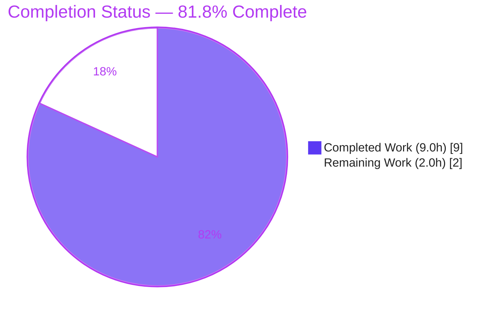
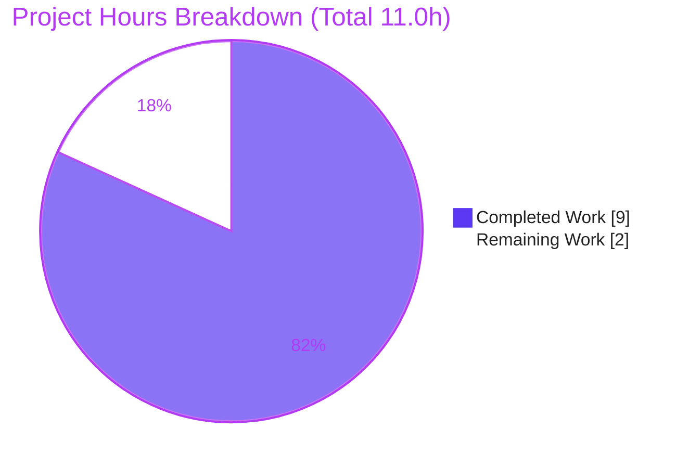
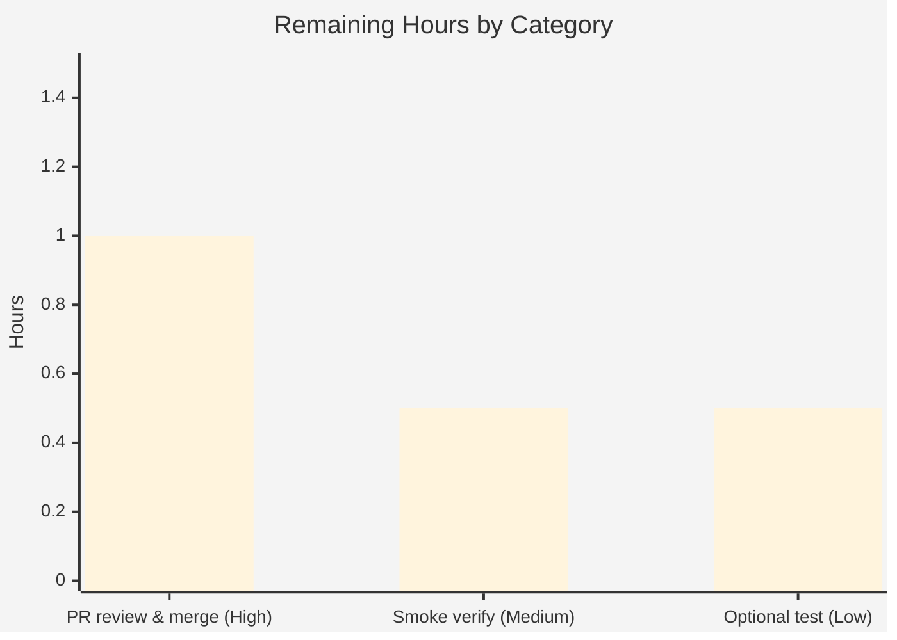

# Blitzy Project Guide — Artifact12

> **Project:** Artifact12 — Node.js + Express tutorial HTTP server
> **Branch:** `blitzy-d28ed4f5-ce33-46a5-8cb9-e7b2e409e0de` · **HEAD:** `ac4b981`
> **Runtime:** Node.js v20.20.2 · npm 11.1.0 · Express 5.2.1
> **Brand legend:** <span style="color:#5B39F3">■</span> Completed / AI Work = Dark Blue `#5B39F3` · <span style="color:#FFFFFF;background:#000">■</span> Remaining = White `#FFFFFF`

---

## 1. Executive Summary

### 1.1 Project Overview

Artifact12 is a minimal Node.js tutorial HTTP server that adopts the **Express.js** web framework and exposes two plain-text `GET` endpoints: `/` returning **"Hello world"** (preserved baseline) and `/good-evening` returning **"Good evening"** (new feature). The work converted a documentation-only placeholder repository into a runnable npm project — creating `package.json`, `server.js`, a generated `package-lock.json`, and `.gitignore`, and updating `README.md`. Target users are developers learning Express routing fundamentals; the business impact is educational/demonstrative. Technical scope is intentionally minimal — no authentication, database, or extra middleware. Express **5.2.1** is pinned and the runtime requires **Node.js ≥ 18**.

### 1.2 Completion Status



| Metric | Value |
|--------|-------|
| **Total Hours** | **11.0 h** |
| **Completed Hours (AI + Manual)** | **9.0 h** (AI 9.0 + Manual 0.0) |
| **Remaining Hours** | **2.0 h** |
| **Percent Complete** | **81.8 %** |

> **Calculation:** Completion % = Completed ÷ Total = 9.0 ÷ 11.0 = **81.8 %**. 100 % of AAP engineering scope (all 5 Feature Requirements, all 6 in-scope artifacts, all constraints) is delivered and validated; the 81.8 % reflects inclusion of path-to-production human review/merge and optional hardening in the denominator.

### 1.3 Key Accomplishments

- ✅ **FR-01** — Express.js adopted and pinned at a real published version (`express ^5.2.1`; `express@5.2.1` installed).
- ✅ **FR-02** — `GET /good-evening` returns byte-exact `Good evening` (HTTP 200, 12 bytes).
- ✅ **FR-03** — `GET /` preserves byte-exact `Hello world` (HTTP 200, 11 bytes).
- ✅ **FR-04** — Runnable baseline established (`package.json` + `server.js`); boots via `npm start`.
- ✅ **FR-05** — Dependency management complete (`package-lock.json` committed; `.gitignore` excludes `node_modules/`).
- ✅ Reproducible install: `npm ci` succeeds with **0 vulnerabilities** (67-package locked tree).
- ✅ Routing hardened — **strict & case-sensitive**; unknown routes and 7 undocumented aliases return **404**.
- ✅ **User directive honored** — **no GitHub workflow files** created (no `.github/` directory exists).
- ✅ `README.md` documents prerequisites, install, run, and both endpoints.

### 1.4 Critical Unresolved Issues

| Issue | Impact | Owner | ETA |
|-------|--------|-------|-----|
| *None* | No critical issues. All AAP requirements implemented, validated, and committed; working tree clean; zero in-scope defects. | — | — |

### 1.5 Access Issues

| System / Resource | Type of Access | Issue Description | Resolution Status | Owner |
|-------------------|----------------|-------------------|-------------------|-------|
| *None* | — | **No access issues identified.** The project builds, installs (offline via committed lockfile), and runs end-to-end with no external credentials, API keys, or network services. | N/A | — |

### 1.6 Recommended Next Steps

1. **[High]** Review the pull-request diff (5 files) and **merge** the branch to `main`.
2. **[Medium]** Run a **target-environment smoke check** on the deploy host: `npm ci` → `npm start` → `curl` both endpoints.
3. **[Low]** *(Optional)* Add a minimal **automated smoke test** for regression protection (out of AAP scope; future hardening).

---

## 2. Project Hours Breakdown

### 2.1 Completed Work Detail

| Component | Hours | Description |
|-----------|------:|-------------|
| Express adoption & dependency baseline (FR-01) | 1.5 | Confirmed current stable version (5.2.1), declared `express ^5.2.1`, `npm install` materialized `node_modules/` (66 packages) |
| npm manifest / `package.json` (FR-04, FR-05) | 1.0 | `name`, `version`, `private`, `main`, `start` script, `engines.node >=18`, `license` |
| `server.js` Express application core (FR-02, FR-03) | 2.0 | App instantiation, `GET /` → "Hello world", `GET /good-evening` → "Good evening", `PORT` config, listener |
| Routing hardening — strict & case-sensitive (commit `ac4b981`) | 1.0 | Eliminated 7 undocumented route aliases (→ 404); inline documentation |
| Dependency lockfile & VCS hygiene (FR-05) | 1.0 | Generated `package-lock.json` (lockfileVersion 3, 67 pkgs); `.gitignore` excludes `node_modules/`, logs, `.env` |
| `README.md` documentation update | 1.0 | Prerequisites, install, run, endpoints table, curl examples |
| Autonomous validation & verification | 1.5 | `npm ci` reproducibility (0 vulns), `node --check`, live HTTP byte-exact assertions, 404 + strict/case-sensitive routing, `PORT` override |
| **TOTAL COMPLETED** | **9.0** | *Matches Completed Hours in §1.2* |

### 2.2 Remaining Work Detail

| Category | Hours | Priority |
|----------|------:|----------|
| Human PR review & merge to `main` (HT-1) | 1.0 | High |
| Target-environment smoke verification (HT-2) | 0.5 | Medium |
| Optional automated smoke test — future hardening (HT-3) | 0.5 | Low |
| **TOTAL REMAINING** | **2.0** | *Matches Remaining Hours in §1.2 and the §7 pie chart* |

> **Integrity:** §2.1 (9.0 h) + §2.2 (2.0 h) = **11.0 h** = Total Project Hours in §1.2. ✓

---

## 3. Test Results

> All entries below originate from **Blitzy's autonomous validation logs** (Final Validator + this assessment's re-verification). Per **AAP §0.5.2**, automated test suites/frameworks are **out of scope**; the functional contract was verified at the HTTP level via `curl`, as the AAP prescribes.

| Test Category | Framework | Total | Passed | Failed | Coverage % | Notes |
|---------------|-----------|------:|------:|------:|:----------:|-------|
| Functional / API (endpoint contract) | `curl` + HTTP (manual per AAP) | 3 | 3 | 0 | N/A | `GET /`→"Hello world"/200; `GET /good-evening`→"Good evening"/200; byte-exact (`od -c`) |
| Negative / Routing | `curl` + HTTP | 8 | 8 | 0 | N/A | 7 undocumented aliases + 1 unknown route → **404**; strict & case-sensitive |
| Runtime configuration | `curl` + HTTP | 1 | 1 | 0 | N/A | `PORT` override honored (`PORT=4012`/`8080`) |
| Static syntax | `node --check` | 1 | 1 | 0 | N/A | `server.js` parses clean |
| Dependency / Security | `npm ci` + `npm audit` | 1 | 1 | 0 | N/A | 67-package locked tree; **0 vulnerabilities**; reproducible |
| Unit / Integration / End-to-End | — | 0 | 0 | 0 | N/A | **Out of scope by design** (AAP §0.5.2) |
| **TOTALS** | | **14** | **14** | **0** | N/A | 100 % pass rate; 0 failed, 0 skipped, 0 blocked |

---

## 4. Runtime Validation & UI Verification

**Runtime health** (Node v20.20.2 / npm 11.1.0):

- ✅ **Operational** — Server boots via both `npm start` and `node server.js`; logs `Server listening on http://localhost:3000`.
- ✅ **Operational** — `GET /` → `Hello world` (HTTP 200; 11 bytes; no trailing whitespace).
- ✅ **Operational** — `GET /good-evening` → `Good evening` (HTTP 200; 12 bytes; no trailing whitespace).
- ✅ **Operational** — Unknown routes → 404; 7 undocumented aliases (`//`, `/good-evening/`, `/Good-evening`, `/GOOD-EVENING`, `/goodevening`, `/evening`, `/good-evening/extra`) → 404 (strict + case-sensitive routing).
- ✅ **Operational** — `PORT` override honored (`PORT=8080`/`4012` → listener rebinds).
- ✅ **Operational** — `npm ci` reproducible from committed lockfile with **0 vulnerabilities**.

**API integration:** None applicable — no external services, API keys, or databases (minimal tutorial scope).

**UI verification:** ⚠ **Not applicable.** Per **AAP §0.4.3**, the feature is a backend HTTP server returning plain-text strings; there is no graphical user interface, component library, or design system. Verification is performed at the HTTP level (`curl`).

---

## 5. Compliance & Quality Review

| Requirement / Benchmark | Status | Progress | Notes |
|-------------------------|:------:|:--------:|-------|
| FR-01 — Adopt Express.js | ✅ Pass | 100% | `express ^5.2.1` declared, installed, `require`d |
| FR-02 — `GET /good-evening` → "Good evening" | ✅ Pass | 100% | Byte-exact (12 bytes), HTTP 200 |
| FR-03 — Preserve `GET /` → "Hello world" | ✅ Pass | 100% | Byte-exact (11 bytes), HTTP 200 |
| FR-04 — Establish runnable baseline | ✅ Pass | 100% | `npm start` boots `node server.js` |
| FR-05 — Dependency management | ✅ Pass | 100% | `package-lock.json` committed; `node_modules/` git-ignored |
| Directive — No GitHub workflow files | ✅ Pass | 100% | No `.github/` directory exists or was created |
| Exact response strings (byte-for-byte) | ✅ Pass | 100% | Verified via `od -c` |
| Real pinned dependency version | ✅ Pass | 100% | `5.2.1` (npm latest), not a placeholder |
| Node.js ≥ 18 runtime declared | ✅ Pass | 100% | `engines.node ">=18"` in `package.json` |
| Express idioms | ✅ Pass | 100% | `app.get` + `res.send`; semantic hyphenated path; no Express-4 `"*"` wildcard |
| Minimal scope (no auth/db/middleware) | ✅ Pass | 100% | Only the two requested routes |
| Zero-placeholder policy | ✅ Pass | 100% | No TODO/FIXME/stub/dummy code |
| Dependency security | ✅ Pass | 100% | `npm audit`: 0 vulnerabilities |

**Fixes applied during autonomous validation:** **None** — the codebase was already correct (zero in-scope defects). Prior agents committed one quality enhancement beyond the literal spec: **routing hardening** (strict & case-sensitive routing, commit `ac4b981`) to ensure only the two documented routes resolve.

**Outstanding in-scope items:** None.

---

## 6. Risk Assessment

| Risk | Category | Severity | Probability | Mitigation | Status |
|------|----------|:--------:|:-----------:|------------|--------|
| No automated regression tests (manual `curl` only) | Technical | Low | Low | Scope frozen & minimal; optional smoke test offered in §2.2 | Accepted (AAP scope) |
| Express 5.x is a recent major release | Technical | Low | Low | Version pinned in lockfile; 0 vulnerabilities | Mitigated |
| Validated on Node v20.20.2 (engines `>=18`; AAP recommends 22.x LTS) | Technical | Low | Low | Broad `>=18` compatibility; `engines` declared | Mitigated |
| No authentication (public plain-text endpoints) | Security | Low | Low (by design) | Minimal attack surface — 2 read-only `GET` routes, no user input/body parsing | Accepted (tutorial scope) |
| No hardening middleware (helmet/rate-limit) | Security | Low | Low | Out of scope; document for productionization | Accepted |
| No process manager / health check / structured logging | Operational | Low | Low | Deployment out of scope; flagged in next steps | Accepted |
| No CI pipeline (user forbids GitHub workflows) | Operational | Low | Low | Explicit user directive; manual verification used | Accepted (by directive) |
| `PORT 3000` collision on target host | Integration | Low | Low | `PORT` env override (verified) | Mitigated |
| No external services / API keys / DB | Integration | None | N/A | Nothing to misconfigure | N/A by design |

> **Overall risk posture: LOW.** No High or Medium severity risks; no blockers.

---

## 7. Visual Project Status

**Project Hours Breakdown** (hours):



**Remaining Hours by Category** (from §2.2, total 2.0 h):



| Priority | Hours | Share of Remaining |
|----------|------:|:------------------:|
| High | 1.0 | 50% |
| Medium | 0.5 | 25% |
| Low | 0.5 | 25% |
| **Total** | **2.0** | 100% |

> **Integrity:** Pie "Remaining Work" = **2** = §1.2 Remaining Hours = §2.2 sum. ✓

---

## 8. Summary & Recommendations

**Achievements.** The project is **81.8 % complete**. Every Agent Action Plan engineering deliverable is implemented, validated, and committed: Express.js was adopted (`express ^5.2.1`), the new `GET /good-evening` endpoint returns byte-exact "Good evening", and the original `GET /` continues to return byte-exact "Hello world". The repository was converted from a documentation-only placeholder into a runnable npm project (`package.json`, `server.js`, generated `package-lock.json`, `.gitignore`, updated `README.md`). Autonomous validation required **zero code fixes** and confirmed a reproducible install with **0 vulnerabilities** and correct live runtime behavior.

**Remaining gaps (2.0 h).** All remaining work is path-to-production and non-blocking: a human PR review/merge to `main` (1.0 h), a target-environment smoke check (0.5 h), and an optional automated smoke test (0.5 h) that the AAP itself flags as a future follow-up.

**Critical path to production.** Review diff → merge to `main` → smoke-verify on the deploy host. No defects, credentials, or infrastructure block this path.

**Success metrics (all met):** both endpoints return spec-exact bodies with HTTP 200; unknown/aliased routes return 404; install is reproducible with 0 vulnerabilities; the explicit "no GitHub workflows" directive is honored.

**Production readiness assessment.** **READY**, pending the human review/merge gate. The 81.8 % figure reflects the path-to-production denominator (human-in-the-loop activities), not any deficiency in the delivered code — the AAP engineering scope is 100 % complete.

| Metric | Value |
|--------|-------|
| AAP engineering scope completed | 100% (5/5 FRs, 6/6 artifacts, all constraints) |
| AAP-scoped completion (incl. path-to-production) | 81.8% |
| In-scope defects | 0 |
| Security vulnerabilities | 0 |
| Blocking issues | 0 |

---

## 9. Development Guide

> All commands below were executed and verified in the build environment (Node v20.20.2, npm 11.1.0). Run them from the repository root.

### 9.1 System Prerequisites

- **Node.js ≥ 18** (required by Express 5; **Node.js 22.x LTS recommended**). Verify with `node --version`.
- **npm** (bundled with Node.js). Verify with `npm --version`.
- **curl** (for endpoint verification).

```bash
node --version    # expect v18+ (validated on v20.20.2)
npm --version     # validated on 11.1.0
```

### 9.2 Environment Setup

No environment variables are required. The only optional variable is **`PORT`** (defaults to `3000`):

```bash
# optional — override the listening port
export PORT=8080
```

### 9.3 Dependency Installation

```bash
# Reproducible install from the committed lockfile (recommended):
npm ci
# -> installs express@5.2.1 + transitive tree; reports "found 0 vulnerabilities"

# First-time / no lockfile alternative:
npm install
```

Expected: a local `node_modules/` directory (git-ignored, not committed) and a clean dependency tree:

```bash
npm ls --depth=0
# artifact12@1.0.0
# └── express@5.2.1
```

### 9.4 (Optional) Static Check

```bash
node --check server.js   # -> no output = OK (no syntax errors)
```

### 9.5 Application Startup

```bash
npm start                # runs: node server.js
# -> Server listening on http://localhost:3000

# Custom port:
PORT=8080 npm start
# -> Server listening on http://localhost:8080
```

### 9.6 Verification Steps & Example Usage

In a second terminal:

```bash
curl http://localhost:3000/              # -> Hello world
curl http://localhost:3000/good-evening  # -> Good evening

# Status codes:
curl -s -o /dev/null -w "%{http_code}\n" http://localhost:3000/              # 200
curl -s -o /dev/null -w "%{http_code}\n" http://localhost:3000/good-evening  # 200
curl -s -o /dev/null -w "%{http_code}\n" http://localhost:3000/unknown       # 404
```

| Method | Path | Response | Status |
|--------|------|----------|:------:|
| `GET` | `/` | `Hello world` | 200 |
| `GET` | `/good-evening` | `Good evening` | 200 |
| `GET` | *(any other path)* | *(Express default)* | 404 |

### 9.7 Troubleshooting

- **`EADDRINUSE` (port already in use):** another process holds `3000` — start on a different port: `PORT=8080 npm start`.
- **Node too old:** if `node --version` is below 18, Express 5 will refuse to run — install Node 18+ (22.x LTS recommended).
- **Stopping the server:** in a foreground terminal press **Ctrl+C**. ⚠ *Gotcha:* a backgrounded `npm start &` spawns a **child** `node server.js` process; killing the `npm` parent can leave the child listening. Stop the child by exact PID — `ps -eo pid,args | grep '[s]erver.js'` then `kill <pid>` — or run `node server.js` directly in the foreground for local development.
- **Clean reinstall:** `rm -rf node_modules && npm ci`.

---

## 10. Appendices

### A. Command Reference

| Command | Purpose |
|---------|---------|
| `npm ci` | Reproducible install from `package-lock.json` (0 vulnerabilities) |
| `npm install` | First-time install / regenerate lockfile |
| `npm start` | Start the server (`node server.js`) |
| `node server.js` | Start directly (foreground; simplest to stop with Ctrl+C) |
| `node --check server.js` | Static syntax check |
| `npm ls --depth=0` | Show top-level dependency (`express@5.2.1`) |
| `npm audit` | Security audit (expect 0 vulnerabilities) |
| `curl http://localhost:3000/` | Verify "Hello world" endpoint |
| `curl http://localhost:3000/good-evening` | Verify "Good evening" endpoint |

### B. Port Reference

| Port | Service | Configurable Via | Default |
|------|---------|------------------|:-------:|
| 3000 | Express HTTP server | `process.env.PORT` | Yes (fallback `3000`) |

### C. Key File Locations

| Path | Role |
|------|------|
| `server.js` | Express application entry point — both routes + listener |
| `package.json` | npm manifest (`express ^5.2.1`, `start` script, `engines >=18`) |
| `package-lock.json` | Generated lockfile (lockfileVersion 3, 67 packages) |
| `.gitignore` | Excludes `node_modules/`, logs, `.env` |
| `README.md` | Usage documentation (prerequisites, install, run, endpoints) |
| `node_modules/` | Local install artifact (git-ignored, not committed) |
| `blitzy/documentation/` | Reference-only Blitzy artifacts (not application source) |

### D. Technology Versions

| Technology | Version | Source |
|------------|---------|--------|
| Node.js (validated) | v20.20.2 | build environment |
| Node.js (required) | ≥ 18 (22.x LTS recommended) | `package.json` `engines` |
| npm | 11.1.0 | build environment |
| Express | 5.2.1 (declared `^5.2.1`) | `package.json` / lockfile |
| Lockfile format | lockfileVersion 3 | `package-lock.json` |
| Locked package count | 67 | `package-lock.json` |

### E. Environment Variable Reference

| Variable | Required | Default | Purpose |
|----------|:--------:|:-------:|---------|
| `PORT` | No | `3000` | TCP port the HTTP server binds to (`process.env.PORT || 3000`) |

### F. Developer Tools Guide

| Tool | Usage |
|------|-------|
| `node` | Run / syntax-check the server |
| `npm` | Install dependencies, run the `start` script, audit |
| `curl` | Manual endpoint verification (per AAP §0.5.2) |
| `git` | Review the 6 feature commits (`d80b6ae`…`ac4b981`); working tree is clean |
| `od -c` | Byte-exact response body inspection |

### G. Glossary

| Term | Definition |
|------|------------|
| **AAP** | Agent Action Plan — the primary directive defining project scope and requirements |
| **FR-0x** | Feature Requirement — discrete, numbered requirement from the AAP |
| **Byte-exact** | Response body matches the spec string exactly (casing, spacing, no trailing whitespace) |
| **Strict routing** | Express setting that makes a trailing slash significant (`/good-evening/` ≠ `/good-evening`) |
| **Case-sensitive routing** | Express setting where `/GOOD-EVENING` ≠ `/good-evening` |
| **lockfileVersion 3** | npm lockfile schema (npm 7+) pinning the full dependency tree for reproducible installs |
| **Path-to-production** | Standard activities (review, merge, smoke verification) required to deploy delivered work |

---

*Generated by the Blitzy assessment agent. All numbers are cross-section consistent: Total 11.0 h = Completed 9.0 h + Remaining 2.0 h; Completion 81.8 %. Brand colors — Completed `#5B39F3`, Remaining `#FFFFFF`.*