# Technical Specification

# 1. Introduction

## 1.1 EXECUTIVE SUMMARY

### 1.1.1 Project Identification

The repository under specification is identified as **Artifact12**. This identity is established by the sole H1 heading present in the repository's root `README.md` file (located at `README.md`, line 1). No alternative project identifier, codename, version designation, or branding artifact appears anywhere in the tracked file inventory.

| Attribute | Value | Evidence Source |
|-----------|-------|-----------------|
| Project Name | Artifact12 | `README.md` (line 1) |
| Declared Version | Not documented | Repository-wide absence |
| Repository Root | Single file (`README.md`) + one subdirectory (`blitzy/`) | Root directory enumeration |

### 1.1.2 Repository State Disclosure

The Artifact12 repository exists in a **verified pre-implementation, placeholder state**. This determination is grounded in a complete inventory of tracked artifacts: the substantive content of the repository consists of a single 12-byte `README.md` file containing only an H1 heading. The supplementary `blitzy/documentation/` directory contains three documentation Markdown files (Agent Action Plan, Input Prompt, and this Technical Specifications document); these documentation artifacts describe the absence of implementation rather than constituting implementation themselves.

This Technical Specification is therefore authored under an **evidence-based discipline**: every claim made in this document is constrained to facts directly observable in the repository. Where no evidence exists for a particular topic, the document records "not documented" or "not present in the repository" rather than fabricating content. This methodology is established here in Section 1 and is uniformly applied across all subsequent sections (2 through 9).

### 1.1.3 Core Business Problem

The repository does **not document a business problem statement**. No problem definition, market need analysis, user pain point catalog, or opportunity assessment is present in any tracked file. The `README.md` provides no descriptive text beyond the project name; the `Input Prompt.md` placeholder contains only the word "custom" repeated 28 times with no substantive requirements; and the Agent Action Plan explicitly records that the supplied requirements prompt did not resolve into a legible, actionable development specification.

Consequently, this Technical Specification does not assert any specific business problem on behalf of the project. Any future authoring of a business problem statement is deferred to a subsequent revision of this document, triggered by the addition of substantive requirements artifacts to the repository.

### 1.1.4 Key Stakeholders and Users

The repository does **not contain a stakeholder registry, user persona definition, role inventory, or audience profile**. No documentation enumerates:

- Business sponsors, product owners, or executive stakeholders
- End-user roles, personas, or segmentation
- Operator, administrator, or maintenance-role definitions
- External party integrations, partner organizations, or third-party consumers

The Agent Action Plan documents that both the rules channel and the attachments channel returned empty results when queried for project context; no stakeholder identification accompanied the project initialization.

### 1.1.5 Business Impact and Value Proposition

The repository does **not articulate a value proposition, return-on-investment model, business impact assessment, or expected outcome catalog**. No quantitative business targets (revenue, cost reduction, efficiency gain, user growth) or qualitative value statements (user experience improvements, competitive differentiation, strategic positioning) are recorded in any tracked file.

This subsection records the absence of these elements rather than inventing them; future revisions of this specification may populate this content when supporting evidence is introduced to the repository.

### 1.1.6 Summary of Verifiable Facts

The following table consolidates the complete set of positively-evidenced facts about the Artifact12 project at the time of this specification:

| Fact Category | Verifiable Content | Source |
|---------------|-------------------|--------|
| Project Identity | "Artifact12" (H1 heading) | `README.md` line 1 |
| Substantive File Inventory | One file: `README.md` (12 bytes) | Root directory enumeration |
| Documentation Inventory | Three files in `blitzy/documentation/` | Subdirectory enumeration |
| Implementation Artifacts | None present | Repository-wide verification |

All other categories of project information — purpose, stakeholders, capabilities, technology, success criteria, and scope details — are documented in subsequent subsections as **not present in the repository**.

---

## 1.2 SYSTEM OVERVIEW

### 1.2.1 Project Context

#### 1.2.1.1 Business Context and Market Positioning

The repository does **not document any business context or market positioning**. No industry vertical, target market segment, customer profile, competitive landscape analysis, or strategic positioning statement is recorded in tracked artifacts. The `README.md` carries no descriptive content beyond the project name, and no supplementary business documentation exists at any path in the repository.

#### 1.2.1.2 Current System Limitations

Because no predecessor system, legacy implementation, or existing solution is referenced anywhere in the repository, **the question of current system limitations does not apply**. The repository is not characterized as an upgrade, replacement, or modernization effort against any baseline system. No migration plan, system retirement strategy, or compatibility constraint set is present.

#### 1.2.1.3 Integration with Existing Enterprise Landscape

The repository does **not declare any integration with an existing enterprise landscape**. No external system catalog, upstream dependency registry, downstream consumer list, identity-provider integration, data-source binding, or partner-API specification is documented. The Agent Action Plan confirms that no rules, attachments, or supplementary inputs were available to define such integrations.

### 1.2.2 High-Level Description

#### 1.2.2.1 Primary System Capabilities

The repository declares **no primary system capabilities**. No feature catalog, user-story collection, use-case inventory, or functional-requirements register is present. The single substantive artifact (`README.md`) carries only the project identity declaration and conveys no functional information.

| Capability Category | Declared Capabilities | Evidence |
|---------------------|----------------------|----------|
| User-facing features | None | No feature documentation |
| Backend services | None | No service definitions |
| Data processing | None | No data-flow specifications |
| Integration capabilities | None | No integration declarations |

#### 1.2.2.2 Major System Components

The repository contains exactly one substantive component artifact:

| Component | Path | Size | Role |
|-----------|------|------|------|
| Project identity declaration | `README.md` | 12 bytes | Establishes the name "Artifact12" |

No additional system components — services, modules, libraries, packages, executables, schemas, or runtime artifacts — exist in the repository. The `blitzy/documentation/` directory contains documentation files that describe the project's pre-implementation state but do not themselves constitute system components.

#### 1.2.2.3 Core Technical Approach

The repository does **not select or commit to any core technical approach**. No programming language, runtime, framework, platform, architectural pattern, or deployment model has been chosen in any tracked file. The repository contains:

- No source code files (zero matches for `.py`, `.js`, `.ts`, `.java`, `.go`, `.rb`, `.cs`, `.rs`, `.php`, `.swift`, `.kt`)
- No dependency manifests (no `package.json`, `requirements.txt`, `pom.xml`, `Cargo.toml`, `go.mod`, or equivalent)
- No configuration files (no `*.json`, `*.yaml`, `*.toml`, `*.xml`, `.env*`, or `.*rc` files)
- No build or CI/CD definitions (no `Dockerfile`, `docker-compose*`, `.github/workflows/*`, `Makefile*`)
- No test files (no `tests/**`, `*test*`, or `*spec*` artifacts)

A default technology stack reference (encompassing AWS, Docker, Terraform, GitHub Actions, Python, Flask, Auth0, MongoDB, Langchain, React with TypeScript, TailwindCSS, React Native, Swift, Kotlin, Objective-C, and ElectronJS) is acknowledged elsewhere in this Technical Specification (Sections 3.1.3 and 3.8.3) **only as a reserved future-direction reference**. None of these technologies has been committed within the Artifact12 repository, and this Specification does not treat any of them as the project's selected stack.

The following diagram visualizes the repository's content topology, including the single positively-evidenced artifact and the verified absences that together establish the pre-implementation, placeholder state:

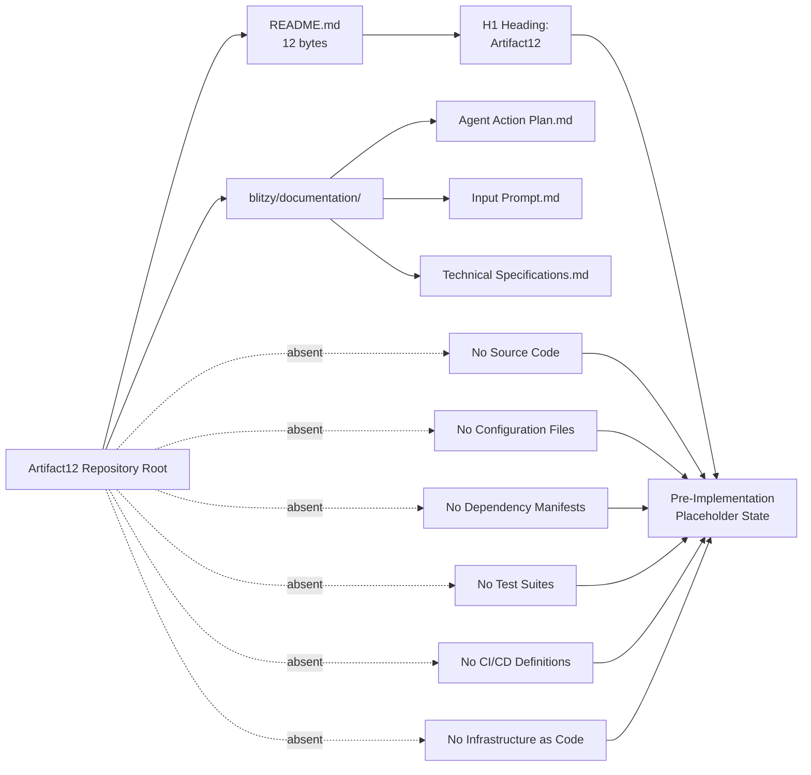

### 1.2.3 Success Criteria

#### 1.2.3.1 Measurable Objectives

The repository does **not declare any measurable objectives**. No SMART goals, target metrics, benchmark values, completion thresholds, or acceptance numerics are recorded in tracked files. The Agent Action Plan establishes a minimal preservation requirement (R-AAP-01: preserve the project identity exactly as declared) but does not propose project-level success metrics.

#### 1.2.3.2 Critical Success Factors

The repository does **not enumerate critical success factors**. No catalog of organizational prerequisites, technical dependencies, resource commitments, governance gates, or risk-mitigation conditions has been authored. Critical success factor authorship is deferred to a future revision of this specification.

#### 1.2.3.3 Key Performance Indicators (KPIs)

No Key Performance Indicators are defined in the repository. The following table records the standard KPI categories that this specification would document if substantive content existed, together with the current state of each category:

| KPI Category | Indicator | Current State |
|--------------|-----------|---------------|
| Business KPIs | Revenue, adoption, retention, NPS | Not documented |
| Technical KPIs | Availability, latency, throughput, error rate | Not documented |
| Operational KPIs | Deployment frequency, MTTR, change-failure rate | Not documented |
| Quality KPIs | Test coverage, defect density, code-quality score | Not documented |

Each row reflects a verified absence rather than a quantified target; this table will be revised when KPI definitions are introduced to the repository.

---

## 1.3 SCOPE

### 1.3.1 In-Scope Elements

#### 1.3.1.1 Core Features and Functionalities

The only positively-evidenced in-scope element of the Artifact12 project is the **project identity declaration**: the H1 heading "Artifact12" in `README.md`. No additional features, functions, behaviors, or capabilities have been declared in scope.

| In-Scope Element | Description | Evidence Source |
|------------------|-------------|-----------------|
| Project identity declaration | H1 heading "Artifact12" | `README.md` line 1 |
| Documentation baseline | Three Markdown files in `blitzy/documentation/` | Subdirectory enumeration |

The Agent Action Plan establishes a complementary preservation requirement (R-AAP-01) ensuring that the project identity is retained exactly as declared, and a non-expansion principle (R-AAP-02) prohibiting the introduction of unauthorized scope.

#### 1.3.1.2 Primary User Workflows

No user workflows are in scope. The repository declares no users, no user-facing surfaces, and no interaction patterns. Workflow definition is deferred to a future specification revision triggered by the introduction of user-facing artifacts.

#### 1.3.1.3 Essential Integrations

No integrations are in scope. The repository declares no external system bindings, no API consumers or providers, no identity-provider connections, no data-source attachments, and no third-party service dependencies.

#### 1.3.1.4 Key Technical Requirements

No technical requirements are in scope beyond the preservation of the existing repository state. No language, framework, platform, runtime, performance target, security control, or compliance constraint has been declared as a binding technical requirement.

### 1.3.2 Implementation Boundaries

The Artifact12 project's implementation boundaries are determined entirely by what is positively evidenced in the repository. The following table summarizes these boundaries:

| Boundary Dimension | Defined Boundary | Status |
|-------------------|------------------|--------|
| System boundaries | Single 12-byte `README.md` + documentation files | Established by file inventory |
| User groups covered | None declared | Undefined |
| Geographic / market coverage | None declared | Undefined |
| Data domains included | None declared | Undefined |

Because no users, geographies, or data domains have been declared, the operative implementation boundary is the literal contents of the repository as enumerated in Section 1.2.2.2.

### 1.3.3 Out-of-Scope Elements

Given that the only positively-evidenced in-scope element is the project identity declaration, **all other conceivable application features, capabilities, integrations, and use cases are implicitly out-of-scope**. The following table catalogues the principal categories of excluded content:

| Category | Excluded Content | Rationale |
|----------|------------------|-----------|
| Application features | All functional features and behaviors | No feature documentation exists |
| Integrations | All external system and API integrations | No integration declarations exist |
| User interfaces | All graphical, command-line, and API surfaces | No UI artifacts or specifications exist |
| Infrastructure | All deployment, hosting, and operations concerns | No infrastructure artifacts exist |

#### 1.3.3.1 Future Phase Considerations

The repository does not enumerate planned future phases, roadmap items, or deferred features. The Agent Action Plan establishes a baseline-preservation posture that defers all such planning to a future revision of the documentation, contingent on the introduction of substantive requirements.

#### 1.3.3.2 Integration Points Not Covered

Because no integrations are declared as in-scope, **all conceivable integration points are not covered** by this specification. This includes (without limitation): authentication providers, payment processors, analytics platforms, monitoring services, content-delivery networks, message brokers, databases, search engines, email and notification gateways, mobile-platform stores, identity federation services, and enterprise resource systems.

#### 1.3.3.3 Unsupported Use Cases

Because no use cases are declared as in-scope, **all conceivable use cases are unsupported** by this specification. The repository's current state does not enable any executable behavior, user interaction, data transformation, or service delivery.

### 1.3.4 Scope Summary

The aggregate scope position of the Artifact12 project, as evidenced by the repository at the time of this specification, is summarized below:

| Aspect | Position | Determining Evidence |
|--------|----------|---------------------|
| Overall project posture | Pre-implementation, placeholder state | Repository-wide inventory |
| Positively in-scope elements | Project identity declaration; documentation baseline | `README.md`; `blitzy/documentation/` |
| Out-of-scope elements | All application features, integrations, UIs, and use cases | Verified absence of supporting artifacts |
| Revision trigger | Introduction of substantive requirements or implementation artifacts | Defined by Agent Action Plan |

This scope position is the foundation upon which all subsequent sections of this Technical Specification (Sections 2 through 9) are constructed; each subsequent section documents the verified absence of its respective domain content while remaining ready to be expanded when substantive material is added to the repository.

---

#### References

#### Files Examined

- `README.md` — The repository's only substantive file (12 bytes), containing the single H1 heading "Artifact12"; the basis for the sole positively-evidenced fact in Section 1 (project identity).
- `blitzy/documentation/Agent Action Plan.md` — Establishes the preserve-state baseline interpretation, documents the empty rules and attachments channels, and articulates the preservation (R-AAP-01) and non-expansion (R-AAP-02) requirements referenced in Section 1.1.2, 1.3.1.1, and 1.3.3.1.
- `blitzy/documentation/Input Prompt.md` — A 55-line placeholder containing only the word "custom" repeated 28 times; confirms the absence of substantive requirements content as recorded in Section 1.1.3.
- `blitzy/documentation/Technical Specifications.md` — The master Technical Specification (this document) whose Section 1 is authored here; subsequent sections (2 through 9) cite Section 1 as the authoritative basis for their absence determinations.

#### Folders Explored

- `` (repository root) — Verified to contain exactly one substantive file (`README.md`) and one subdirectory (`blitzy/`); no source folders, configuration folders, deployment folders, or CI/CD folders exist.
- `blitzy/` — Contains only the `documentation/` subdirectory; no application code, manifests, scripts, configuration assets, tests, or deployment artifacts exist at this level.
- `blitzy/documentation/` — Contains exactly three documentation Markdown files; no executable source code, package manifests, build scripts, test files, configuration assets, infrastructure definitions, or runtime modules exist at this level.

#### Repository-Wide Verifications

- File-extension search across source-code languages (`.py`, `.js`, `.ts`, `.java`, `.go`, `.rb`, `.cs`, `.rs`, `.php`, `.swift`, `.kt`) — zero matches; basis for Section 1.2.2.3.
- Manifest search (`package.json`, `requirements.txt`, `pom.xml`, `Cargo.toml`, `go.mod`, etc.) — zero matches; basis for Section 1.2.2.3.
- Configuration file search (`*.json`, `*.yaml`, `*.toml`, `*.xml`, `.env*`, `.*rc`) — zero matches; basis for Section 1.2.2.3.
- Build and CI/CD search (`Dockerfile*`, `docker-compose*`, `.github/workflows/*`, `Makefile*`) — zero matches; basis for Section 1.2.2.3.
- Test artifact search (`tests/**`, `*test*`, `*spec*`) — zero matches; basis for Section 1.2.2.3 and Section 1.3.3.

#### Cross-Sectional References

- Section 2 (Product Requirements) — Cites Sections 1.1.2, 1.1.4, 1.1.6, 1.2.1, 1.2.2, 1.2.3, 1.3.1, 1.3.2, 1.3.3 as authoritative absence determinations.
- Section 3.1.3 and Section 3.8.3 (Technology Stack) — Establish the treatment of the user-provided default stack as a reserved future-direction reference rather than the project's selected technology.
- Sections 5, 6, 7, 8, 9 — Inherit Section 1's pre-implementation, placeholder-state terminology and apply it consistently within their respective domains.

# 2. Product Requirements

This section documents the product requirements of the Artifact12 project under the evidence-based discipline established in Section 1. As established in Section 1.1.2 (Repository State Disclosure), Section 1.2.2 (High-Level Description), and Section 1.3.3 (Out-of-Scope Elements), the repository is in a verified pre-implementation, placeholder state whose only positively-evidenced in-scope element is the project identity declaration "Artifact12" in `README.md`. The section prompt for Product Requirements explicitly mandates that only features and items "actually relevant to this system, based on your analysis of its requirements" be included, that no features be added on the author's own, and that no feature relationships be imagined that are not "clearly evident in the requirements or source code." This section therefore documents the verified absence of feature-bearing artifacts, provides reserved schemas and templates with reserved ID formats (F-XXX, F-XXX-RQ-YYY) so that future revisions can populate the catalog in a consistent format, and records the assumptions and constraints that govern this approach.

## 2.1 FEATURE CATALOG

### 2.1.1 Catalog Population Status

The Feature Catalog for the Artifact12 project is **empty**. This is not an editorial omission but a verified state: as recorded in Section 1.2.2.1, the repository declares no primary system capabilities, no feature catalog, no user-story collection, no use-case inventory, and no functional-requirements register. The single substantive artifact (`README.md`, 12 bytes) carries only the project identity declaration and conveys no functional information. Because no feature-bearing artifact exists in the repository, no `F-XXX` identifier can be assigned without fabricating content, which the section prompt and the Agent Action Plan's R-AAP-02 (non-expansion principle) explicitly prohibit.

### 2.1.2 Verified Repository Inventory Against Feature Identification

The following table maps each metadata element required by the section prompt to the corresponding evidence in the repository. Every row resolves to "None" or "Not documented," reflecting the verified pre-implementation state rather than incomplete authoring:

| Required Feature Element | Repository Evidence | Status |
|--------------------------|---------------------|--------|
| Unique Feature ID (F-XXX) | No features declared | None assigned |
| Feature Name | No feature names declared | Not documented |
| Feature Category | No category taxonomy declared | Not documented |
| Priority Level | No prioritization framework declared | Not documented |
| Status (Proposed/Approved/In Development/Completed) | No lifecycle state declared | Not documented |
| Overview / Business Value / User Benefits | No descriptive content beyond project name | Not documented |
| Technical Context | No technology selections committed (Section 1.2.2.3) | Not documented |
| Prerequisite Features | No features exist to depend upon | None applicable |
| System / External / Integration Dependencies | No integrations declared (Section 1.3.1.3) | None applicable |

### 2.1.3 Feature Metadata Schema (Reserved Template)

To support future population without restructuring the document, the following reserved schema defines the format that each feature entry will adopt when substantive requirements are introduced to the repository. This template is **not populated**; it is provided as a normative structure only.

| Schema Field | Format | Permissible Values |
|--------------|--------|--------------------|
| Feature ID | `F-XXX` (zero-padded three-digit) | `F-001` through `F-999` |
| Feature Name | Free text, title case | Descriptive label |
| Category | Enumerated taxonomy | To be defined upon first feature |
| Priority Level | Enumerated | Critical, High, Medium, Low |
| Lifecycle Status | Enumerated | Proposed, Approved, In Development, Completed |

The description sub-fields (Overview, Business Value, User Benefits, Technical Context) and dependency sub-fields (Prerequisite Features, System Dependencies, External Dependencies, Integration Requirements) follow the section prompt's structure verbatim and require no schema deviation.

### 2.1.4 Rationale for Empty Catalog

The empty catalog is the only defensible state under the methodology established in Section 1.1.2. Fabricating feature entries would violate three independent constraints simultaneously: the section prompt's explicit directive against adding features that are not clearly applicable; the Agent Action Plan's R-AAP-02 non-expansion principle; and the absence determination established in Section 1.2.2.1. The catalog will be populated in a future revision of this Technical Specification when the repository introduces a feature definition, user story, use case, or comparable artifact that yields at least one positively-evidenced feature.

## 2.2 FUNCTIONAL REQUIREMENTS

### 2.2.1 Requirements Population Status

The Functional Requirements table for the Artifact12 project is **empty**. Because no feature has been catalogued (Section 2.1), no `F-XXX-RQ-YYY` requirement identifier can be assigned. The repository contains no declarations of input parameters, output responses, performance criteria, data requirements, business rules, data validation rules, security requirements, or compliance requirements at any path. The verified absence of source code, dependency manifests, configuration files, and test artifacts (Section 1.2.2.3) provides independent confirmation that no requirement is implemented, tested, or otherwise traceable to executable artifacts.

### 2.2.2 Requirement Metadata Schema (Reserved Template)

To support future population, the following reserved schema defines the format that each functional requirement entry will adopt when populated. This template is **not populated**; it is provided as a normative structure only and pairs directly with the feature schema in Section 2.1.3.

| Schema Field | Format | Permissible Values |
|--------------|--------|--------------------|
| Requirement ID | `F-XXX-RQ-YYY` | Sequential within parent feature |
| Priority | Enumerated | Must-Have, Should-Have, Could-Have |
| Complexity | Enumerated | High, Medium, Low |
| Acceptance Criteria | Free text, testable assertions | One or more verifiable statements |

### 2.2.3 Technical Specifications Status

The section prompt requires that each requirement document four technical specification elements. The following table records the population state of each element across the repository:

| Technical Specification Element | Required Content | Status |
|---------------------------------|------------------|--------|
| Input Parameters | Parameter definitions per requirement | Not documented |
| Output / Response | Return value, response payload, side-effect definitions | Not documented |
| Performance Criteria | Latency, throughput, resource-utilization targets | Not documented |
| Data Requirements | Schema, persistence, lifecycle, retention | Not documented |

### 2.2.4 Validation Rules Status

The section prompt requires that each requirement document four validation-rule categories. The following table records the population state of each category:

| Validation Rule Category | Required Content | Status |
|--------------------------|------------------|--------|
| Business Rules | Domain logic constraints and invariants | Not documented |
| Data Validation | Field-level format, range, and constraint checks | Not documented |
| Security Requirements | Authentication, authorization, secrecy controls | Not documented |
| Compliance Requirements | Regulatory, contractual, organizational obligations | Not documented |

### 2.2.5 Complexity and Testability Posture

Because no requirements have been authored, no complexity assessment, effort estimate, or testability analysis can be performed. The section prompt's directive that requirements be "testable" with explicit "acceptance criteria" is unsatisfiable at the current repository state; this directive is preserved in Section 2.2.2's reserved schema for the benefit of future revisions.

## 2.3 FEATURE RELATIONSHIPS

### 2.3.1 Dependency Map Status

No feature dependency map can be drawn because no features exist (Section 2.1). The section prompt explicitly mandates: "Only document feature relationships that are clearly evident in the requirements or source code. Don't imagine any feature relationships of your own." With zero features in the catalog and zero source code files in the repository (Section 1.2.2.3), there is no evidentiary basis for any relationship edge.

The following diagram visualizes the verified topological state of the Product Requirements domain: a single positively-evidenced node (project identity) with no outgoing or incoming relationship edges to any feature, integration point, shared component, or common service.

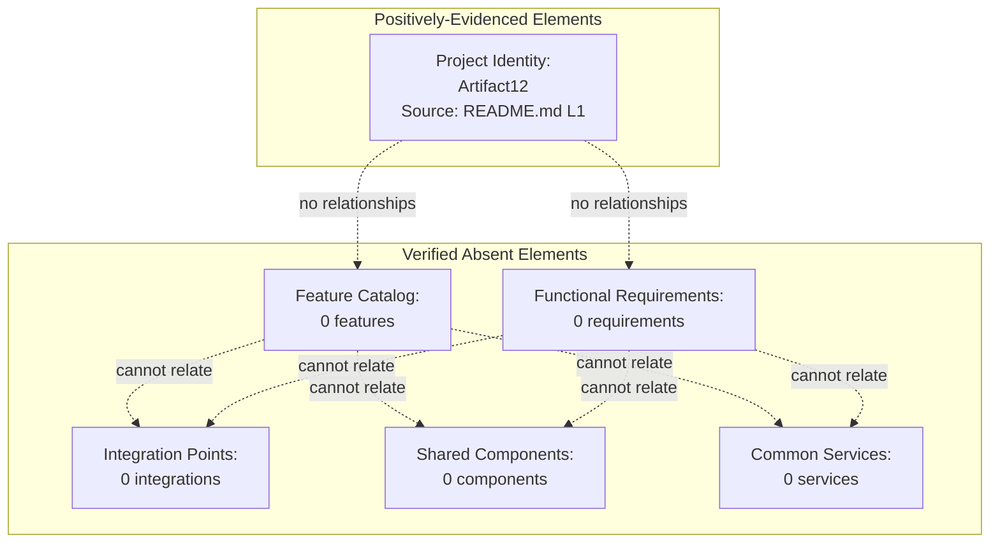

### 2.3.2 Integration Points Status

The section prompt requires documentation of integration points. As established in Section 1.2.1.3 and Section 1.3.1.3, no integrations are declared in the repository. The following table records the population state of each integration-point category required by the section prompt:

| Integration Point Category | Required Content | Status |
|----------------------------|------------------|--------|
| Inbound integrations | External callers, upstream producers | Not documented |
| Outbound integrations | Downstream consumers, external services | Not documented |
| Identity / authentication providers | Auth providers, federation services | Not documented |
| Data-store integrations | Databases, caches, message brokers | Not documented |

### 2.3.3 Shared Components and Common Services

The section prompt requires documentation of shared components and common services. Because no components or services have been declared (Section 1.2.2.2 identifies a single 12-byte `README.md` as the only component), no cross-cutting concerns can be enumerated. The following table records the population state of typical cross-cutting categories:

| Cross-Cutting Concern | Required Content | Status |
|-----------------------|------------------|--------|
| Logging and observability | Logger libraries, tracing frameworks | Not documented |
| Configuration management | Settings, feature flags, environment | Not documented |
| Error handling and resiliency | Exception policy, retry, circuit breaker | Not documented |
| Caching and performance | Cache layers, memoization, pooling | Not documented |

## 2.4 IMPLEMENTATION CONSIDERATIONS

### 2.4.1 Technical Constraints

No feature-level technical constraints exist because no features have been declared (Section 2.1) and no core technical approach has been committed (Section 1.2.2.3). The only repository-wide technical constraint is the **preservation constraint** articulated by the Agent Action Plan's R-AAP-01: the project identity "Artifact12" must be retained exactly as declared in `README.md` line 1. No language, framework, runtime, platform, or architectural pattern has been bound to any feature because there are no features and no technology selections in the repository.

The user-context default technology reference (encompassing AWS, Docker, Terraform, GitHub Actions, Python, Flask, Auth0, MongoDB, Langchain, React with TypeScript, TailwindCSS, React Native, Swift, Kotlin, Objective-C, and ElectronJS) does not impose technical constraints on any feature in this section. As recorded in Section 1.2.2.3, that stack is treated as a "reserved future-direction reference only" and is not committed within the Artifact12 repository.

### 2.4.2 Performance and Scalability Considerations

No performance or scalability considerations apply at the feature level because no features exist. As recorded in Section 1.2.3.3, no Key Performance Indicators (Business, Technical, Operational, or Quality) have been defined in the repository. The following table summarizes the current state across the dimensions enumerated by the section prompt:

| Implementation Dimension | Required Content | Status |
|--------------------------|------------------|--------|
| Performance requirements | Latency, throughput, response-time targets | Not documented |
| Scalability considerations | Horizontal/vertical scaling strategy, capacity model | Not documented |
| Resource utilization | CPU, memory, network, storage budgets | Not documented |
| Capacity planning | Concurrent users, data volume, growth model | Not documented |

### 2.4.3 Security Implications

No feature-level security implications can be enumerated because no features exist and no security controls, authentication providers, authorization models, or compliance frameworks are declared in any tracked file. Section 1.2.1.3 confirms that no identity-provider integration is documented, and Section 1.3.3.2 catalogues authentication providers among the integration points explicitly not covered. The repository contains no cryptographic configuration, secret management policy, or access-control specification at any path.

### 2.4.4 Maintenance Requirements

No feature-level maintenance requirements can be enumerated because no features, no source code, and no operational artifacts exist. The only maintenance directive that applies at the current repository state is the documentation-revision discipline established in Sections 1.1.2 and 1.3.4: this Technical Specification must be revised when the repository introduces substantive requirements or implementation artifacts that would trigger population of any subsection above.

## 2.5 TRACEABILITY MATRIX

### 2.5.1 Evidence-to-Requirement Traceability

The traceability matrix maps every required element of this section back to its evidentiary source in the repository. Because no features or requirements exist, the matrix records absence determinations rather than positive traces:

| Required Section 2 Element | Authoritative Source | Determination |
|----------------------------|----------------------|---------------|
| Feature Catalog (2.1) | Section 1.2.2.1, Section 1.2.2.2 | No features declared |
| Functional Requirements (2.2) | Section 1.1.3, Section 1.3.1 | No requirements declared |
| Feature Relationships (2.3) | Section 1.2.1.3, Section 1.3.1.3 | No relationships derivable |
| Implementation Considerations (2.4) | Section 1.2.2.3, Section 1.2.3.3 | No technical commitments |

### 2.5.2 Cross-Section Cross-References

The following table enumerates the authoritative cross-references that Section 2 inherits from Section 1 and propagates to subsequent sections. Each cross-reference is preserved verbatim from the Section 1 References list, which itself cites Section 2 as a downstream consumer:

| Cross-Reference | Cited Source | Purpose in Section 2 |
|-----------------|--------------|----------------------|
| Project identity | Section 1.1.1; `README.md` L1 | Sole positively-evidenced fact |
| Repository state disclosure | Section 1.1.2 | Justifies absence-based authoring |
| Primary capabilities absence | Section 1.2.2.1 | Authorizes empty Feature Catalog |
| Technical approach absence | Section 1.2.2.3 | Authorizes empty Implementation Considerations |
| Scope boundary | Section 1.3.1, Section 1.3.3 | Anchors what is in/out of scope |

### 2.5.3 Related Process Flowcharts

The section prompt asks Section 2 to reference related process flowcharts. The repository contains exactly two diagrams as of this revision: the repository topology diagram in Section 1.2.2.3 (visualizing the single positively-evidenced artifact against verified absences) and the empty-relationship diagram in Section 2.3.1 of this section (visualizing the topological state of the Product Requirements domain). No additional process flowcharts exist because no processes, workflows, or user journeys have been declared anywhere in the repository (Section 1.3.1.2 confirms that no user workflows are in scope).

## 2.6 ASSUMPTIONS AND CONSTRAINTS

### 2.6.1 Documented Assumptions

The following assumptions govern the authoring of Section 2. Each assumption is assigned a stable identifier (`A-NNN`) and is grounded in evidence from Section 1 or the Agent Action Plan:

| ID | Assumption | Grounding |
|----|------------|-----------|
| A-001 | The repository contents enumerated in Section 1.2.2.2 represent the complete tracked file inventory at the time of this specification. | Section 1.1.6; Repository-wide search results in Section 1.2.2.3 |
| A-002 | The Input Prompt's repeated word "custom" does not constitute a substantive product requirement and therefore does not yield a feature entry. | Section 1.1.3 confirms the prompt did not resolve into actionable requirements |
| A-003 | Feature identifiers (`F-XXX`) and requirement identifiers (`F-XXX-RQ-YYY`) are reserved formats. None will be assigned in this revision because no feature-bearing artifact exists; assigning identifiers absent evidence would violate R-AAP-02. | Section-prompt directive against inventing features; Agent Action Plan R-AAP-02 |

### 2.6.2 Repository State Constraints

The following constraints bind the content of Section 2 and constrain what can be authored without violating the evidence-based discipline. Each constraint is assigned a stable identifier (`C-NNN`):

| ID | Constraint | Source |
|----|------------|--------|
| C-001 | No feature catalogued may lack `README.md` or another tracked-file evidence anchor. | Section 1.1.2 evidence-based authoring discipline |
| C-002 | No functional requirement may be authored without a corresponding parent feature in Section 2.1. | Section-prompt ID convention `F-XXX-RQ-YYY` |
| C-003 | No integration point, shared component, or common service may be introduced without source-code or specification evidence. | Section-prompt directive on feature relationships |
| C-004 | No technology selection may be committed in any requirement until the repository introduces a manifest, configuration file, or source artifact that establishes the selection. | Section 1.2.2.3 confirmation of absent technical approach |

### 2.6.3 Requirement Version Tracking

The section prompt requires that requirement versions be tracked. Because no requirements have been authored in this revision of the Technical Specification, the version-tracking ledger is empty. The following template defines the format that will be used when entries are added:

| Tracking Field | Format | Initial Value |
|----------------|--------|---------------|
| Requirement ID | `F-XXX-RQ-YYY` | None |
| Version | Semantic (`MAJOR.MINOR`) | None |
| Change Summary | Free text | None |
| Revision Trigger | Free text | None |

## 2.7 SECTION SUMMARY

### 2.7.1 Consolidated Section State

The aggregate state of Section 2 (Product Requirements) is summarized below across each dimension required by the section prompt. Each row records a verified-absence determination rather than a fabricated entry:

| Dimension | State | Determining Evidence |
|-----------|-------|----------------------|
| Feature Catalog | Empty; reserved schema only | Section 1.2.2.1; Section 2.1.2 |
| Functional Requirements | Empty; reserved schema only | Section 1.1.3; Section 2.2.1 |
| Feature Relationships | No edges derivable | Section 1.2.1.3; Section 2.3.1 |
| Implementation Considerations | No technical/security/scalability constraints | Section 1.2.2.3; Section 2.4 |
| Traceability Matrix | Absence-based traces to Section 1 | Section 2.5.1 |
| Assumptions and Constraints | A-001 through A-003; C-001 through C-004 | Section 2.6 |

### 2.7.2 Revision Trigger Conditions

Section 2 will be revised — and its reserved schemas populated — when any of the following changes occur in the Artifact12 repository:

- A feature definition, user story, use case, or comparable requirement artifact is introduced at any path, enabling a first `F-XXX` entry.
- A source-code file, dependency manifest, configuration file, or test artifact is introduced, enabling concrete technical specifications and validation rules.
- An integration declaration, identity-provider binding, or data-source attachment is introduced, enabling feature-relationship edges in Section 2.3.
- A performance target, security control, or scalability requirement is introduced, enabling Implementation Considerations in Section 2.4.

Until any such change occurs, Section 2 remains in its current absence-documenting state, consistent with the methodology established in Section 1 and preserved by Assumptions A-001 through A-003 and Constraints C-001 through C-004.

### 2.7.3 References

#### Files Examined

- `README.md` — The repository's only substantive file (12 bytes), containing the single H1 heading "Artifact12"; basis for the sole positively-evidenced fact in Section 2.4.1 (project identity) and the absence determinations throughout Sections 2.1 through 2.4.
- `blitzy/documentation/Agent Action Plan.md` — Source of the R-AAP-01 (preserve project identity) and R-AAP-02 (non-expansion principle) directives cited in Sections 2.1.4, 2.4.1, and 2.6; documents the empty rules and attachments channels that underpin the absence determinations in Sections 2.1 and 2.2.
- `blitzy/documentation/Input Prompt.md` — A 55-line placeholder containing only the word "custom" repeated 28 times; basis for Assumption A-002 confirming that no substantive requirements were supplied via the input prompt.
- `blitzy/documentation/Technical Specifications.md` — The master Technical Specification (this document) whose Section 2 is authored here; cross-references Section 1.1, Section 1.2, and Section 1.3 as authoritative absence determinations.

#### Folders Explored

- `` (repository root) — Verified to contain exactly one substantive file (`README.md`) and one subdirectory (`blitzy/`); no source folders, configuration folders, deployment folders, or CI/CD folders exist; basis for Section 2.1.1's empty-catalog determination.
- `blitzy/` — Contains only the `documentation/` subdirectory; no application code, manifests, scripts, configuration assets, tests, or deployment artifacts exist at this level; basis for Section 2.4.4's absence-of-maintenance-requirements determination.
- `blitzy/documentation/` — Contains exactly three documentation Markdown files; no executable source code, package manifests, build scripts, test files, configuration assets, infrastructure definitions, or runtime modules exist at this level; basis for Section 2.2.1's absence determination on input parameters, data requirements, and validation rules.

#### Technical Specification Sections Cross-Referenced

- Section 1.1 (Executive Summary) — Subsections 1.1.1 (Project Identification), 1.1.2 (Repository State Disclosure), 1.1.3 (Core Business Problem), 1.1.4 (Key Stakeholders and Users), 1.1.5 (Business Impact and Value Proposition), and 1.1.6 (Summary of Verifiable Facts) cited as authoritative sources for Sections 2.1, 2.2, 2.4, and 2.6.
- Section 1.2 (System Overview) — Subsections 1.2.1.3 (Integration with Existing Enterprise Landscape), 1.2.2.1 (Primary System Capabilities), 1.2.2.2 (Major System Components), 1.2.2.3 (Core Technical Approach), and 1.2.3.3 (Key Performance Indicators) cited throughout Sections 2.1, 2.3, and 2.4.
- Section 1.3 (Scope) — Subsections 1.3.1 (In-Scope Elements), 1.3.1.2 (Primary User Workflows), 1.3.1.3 (Essential Integrations), 1.3.3 (Out-of-Scope Elements), 1.3.3.2 (Integration Points Not Covered), and 1.3.4 (Scope Summary) cited throughout Sections 2.3, 2.5, and 2.7.

#### Repository-Wide Verifications Inherited from Section 1

- Zero source-code files across `.py`, `.js`, `.ts`, `.java`, `.go`, `.rb`, `.cs`, `.rs`, `.php`, `.swift`, `.kt` — basis for Section 2.2.1 and Section 2.4.1.
- Zero dependency manifests (`package.json`, `requirements.txt`, `pom.xml`, `Cargo.toml`, `go.mod`) — basis for Section 2.4 absence determinations.
- Zero configuration files (`*.json`, `*.yaml`, `*.toml`, `*.xml`, `.env*`, `.*rc`) — basis for Section 2.2.3 and Section 2.4.2.
- Zero build and CI/CD definitions (`Dockerfile`, `docker-compose*`, `.github/workflows/*`, `Makefile*`) — basis for Section 2.4.4.
- Zero test artifacts (`tests/**`, `*test*`, `*spec*`) — basis for Section 2.2.5 (testability posture).

# 3. Technology Stack

This section documents the technology stack of the Artifact12 project under the evidence-based discipline established in Section 1.1.2 (Repository State Disclosure) and preserved by the assumptions and constraints recorded in Section 2.6 (Assumptions A-001 through A-003; Constraints C-001 through C-004). As established in Section 1.2.2.3 (Core Technical Approach), the repository does not select or commit to any core technical approach: no programming language, runtime, framework, platform, architectural pattern, or deployment model has been chosen in any tracked file. The section-prompt directive — that only sections and items "actually relevant to this system, based on your analysis of its requirements" be included, and that no items be added "that aren't clearly applicable" — is satisfied here by documenting every technology-stack category as verified-absent and by treating the user-provided default stack exclusively as a reserved future-direction reference, never as the project's selected stack. This authoring posture is the only one consistent with Constraint C-004: "No technology selection may be committed in any requirement until the repository introduces a manifest, configuration file, or source artifact that establishes the selection."

## 3.1 Technology Stack Status and Methodological Framing

### 3.1.1 Pre-Implementation State Disposition

The Artifact12 repository is in a **verified pre-implementation, placeholder state**, as determined by the complete tracked-file inventory recorded in Section 1.1.2 and Section 1.2.2.2. The substantive content of the repository consists of a single 12-byte `README.md` file containing only the H1 heading "Artifact12"; the supplementary `blitzy/documentation/` directory contains three Markdown documentation files that describe the absence of implementation rather than constituting implementation themselves. Repository-wide file-extension and manifest searches (Section 1.2.2.3) returned zero matches for source code, dependency manifests, configuration files, containerization assets, orchestration definitions, infrastructure-as-code templates, CI/CD workflow files, build scripts, and test suites. Under these conditions, **no element of any technology-stack category has been committed**, and the Technology Stack section can only document the absence of those elements rather than declare any selection.

### 3.1.2 Documentation Methodology and Guardrails

The methodological framework that governs this section is inherited directly from prior sections and is binding on every subsection below:

| Guardrail | Source | Effect on Section 3 |
|-----------|--------|---------------------|
| Evidence-based authoring discipline | Section 1.1.2 | Every Technology Stack claim must be constrained to facts directly observable in the repository; "not present in the repository" is a valid and required outcome where no evidence exists |
| Preservation requirement (R-AAP-01) | Agent Action Plan | The project identity "Artifact12" must be preserved exactly as declared in `README.md` line 1; no technology-stack entry may modify or rebrand this identity |
| Non-expansion principle (R-AAP-02) | Agent Action Plan | No technology, framework, library, service, database, or tool may be introduced as "selected" absent a tracked-file evidence anchor |
| Constraint C-001 | Section 2.6.2 | No catalogued technology may lack `README.md` or another tracked-file evidence anchor |
| Constraint C-003 | Section 2.6.2 | No integration point, shared component, or common service (and by extension, no third-party service or external dependency) may be introduced without source-code or specification evidence |
| Constraint C-004 | Section 2.6.2; Section 1.2.2.3 | No technology selection may be committed in any requirement until the repository introduces a manifest, configuration file, or source artifact that establishes the selection |
| Assumption A-001 | Section 2.6.1 | The repository contents enumerated in Section 1.2.2.2 represent the complete tracked file inventory at the time of this specification, validating the absence determinations made throughout Section 3 |

These guardrails together mandate that the Technology Stack section be authored as a structured catalogue of verified absences accompanied by reserved schemas, rather than as a declaration of selected technologies.

### 3.1.3 Treatment of the User-Provided Default Stack

A default technology stack reference accompanies the project initialization context. It encompasses sixteen items spanning core infrastructure, backend, frontend, and native-application platforms: **AWS, Docker, Terraform, GitHub Actions, Python, Flask, Auth0, MongoDB, Langchain, React with TypeScript, TailwindCSS, React Native with TypeScript, Swift, Kotlin, Objective-C, and ElectronJS**. As recorded in Section 1.2.2.3 and Section 2.4.1, this default stack is acknowledged in this Technical Specification **only as a reserved future-direction reference**. None of these technologies has been committed within the Artifact12 repository; no manifest, configuration file, source artifact, or specification document binds any of them to the project. Consequently:

- **No version number is pinned** for any default-stack item, because the repository contains no manifest file from which a version could be derived; pinning a version would imply a selection that no artifact has made.
- **No selection rationale or compatibility analysis is authored** for any default-stack item in this revision, because such an analysis presupposes a binding choice that has not been made.
- **No integration requirement between default-stack items is documented**, consistent with Section 2.3.2 (Integration Points Status), which records every integration-point category as "Not documented."
- **No security implication is enumerated** for any default-stack item, consistent with Section 2.4.3 (Security Implications), which records the absence of all security controls, authentication providers, and authorization models in the repository.

Section 3.8.3 below presents the complete default-stack roster in tabular form with each item explicitly marked "Not committed in repository," preserving the user-context reference without violating Constraint C-004.

---

## 3.2 PROGRAMMING LANGUAGES

### 3.2.1 Programming Language Inventory

The repository contains **zero programming-language source files**. The only language artifact present in the repository is Markdown, which is a markup language used in `README.md` and the three documentation files under `blitzy/documentation/`, not a programming language under the section-prompt taxonomy. The following table catalogues each platform/component category required by the section prompt and records the verified state of each:

| Platform / Component | Candidate Languages (Section-Prompt Taxonomy) | Repository Evidence | Status |
|----------------------|-----------------------------------------------|---------------------|--------|
| Backend services | Python, Node.js/TypeScript, Java, Go, Ruby, C#, Rust, PHP | No `.py`, `.js`, `.ts`, `.java`, `.go`, `.rb`, `.cs`, `.rs`, `.php` files | Not committed |
| Frontend (web) | JavaScript, TypeScript, HTML, CSS | No `.js`, `.ts`, `.tsx`, `.jsx`, `.html`, `.css` files | Not committed |
| Mobile (iOS) | Swift, Objective-C | No `.swift`, `.m`, `.mm` files; no Xcode project descriptors | Not committed |
| Mobile (Android) | Kotlin, Java | No `.kt`, `.java` files; no Android project descriptors | Not committed |
| Desktop (native) | Objective-C, Swift, JavaScript/TypeScript (Electron) | No native-desktop source files; no Electron `main.js` entry points | Not committed |
| Data / scripting | SQL, R, Scala, Shell, PowerShell | No `.sql`, `.r`, `.scala`, `.sh`, `.ps1` files | Not committed |
| Markup (project metadata) | Markdown | `README.md` (12 bytes, H1 heading only); three Markdown files in `blitzy/documentation/` | Present, but not a programming language |

### 3.2.2 Evidence-Based Findings

#### 3.2.2.1 Verification Basis

The "Not committed" status for every programming-language category is grounded in the repository-wide file-extension searches recorded in Section 1.2.2.3 and reaffirmed by Assumption A-001 (Section 2.6.1), which establishes the completeness of the tracked file inventory enumerated in Section 1.2.2.2. The Agent Action Plan's R-AAP-02 non-expansion principle prohibits the introduction of language selections absent tracked-file evidence.

#### 3.2.2.2 Selection Criteria Not Applicable in This Revision

Because no language has been chosen, no selection-criteria analysis (suitability for problem domain, ecosystem maturity, team familiarity, runtime performance, type-system requirements, concurrency model, deployment-target compatibility) can be authored in this revision. Selection-criteria analysis presupposes a binding selection that no repository artifact has made, and would therefore violate Constraint C-004.

#### 3.2.2.3 Constraints and Dependencies Not Applicable in This Revision

Because no language has been chosen, no language-level constraints (minimum runtime versions, platform-specific syntax requirements, interpreter/compiler toolchain dependencies, standard-library version floors) or dependencies (cross-language interoperability requirements, FFI bindings, build-time language coupling) can be authored. The only repository-wide constraint that applies is the preservation requirement (R-AAP-01) which is independent of any language selection.

### 3.2.3 Reserved Programming Language Schema

To support future population without restructuring the document, the following reserved schema defines the format that each programming-language entry will adopt when a source file is introduced to the repository. This schema is **not populated**; it is provided as a normative structure only.

| Schema Field | Format | Permissible Values |
|--------------|--------|--------------------|
| Component / Platform | Enumerated | Backend, Frontend (Web), Mobile (iOS), Mobile (Android), Desktop, Data/Scripting |
| Language Name | Free text | Descriptive label (e.g., Python, TypeScript) |
| Pinned Version | Semantic (`MAJOR.MINOR[.PATCH]`) | Derived from manifest evidence |
| Selection Criteria | Free text | Authored upon first commit |
| Constraints | Free text | Authored upon first commit |
| Evidence Anchor | File path | Required (Constraint C-001) |

**Reserved; awaiting first programming-language source-file commit.**

---

## 3.3 FRAMEWORKS & LIBRARIES

### 3.3.1 Framework Inventory

The repository contains **zero framework manifests, framework-specific configuration files, framework-aware source files, or framework-bundled dependency directories**. No framework or library has been committed at any path. The following table catalogues each framework category typically required by an enterprise specification and records the verified state of each:

| Framework Category | Candidate Frameworks (Section-Prompt Taxonomy) | Repository Evidence | Status |
|--------------------|------------------------------------------------|---------------------|--------|
| Backend web framework | Flask, Django, Express, Spring, ASP.NET, Ruby on Rails | No source files, no manifest, no framework configuration | Not committed |
| Frontend UI framework | React, Vue, Angular, Svelte | No `.tsx`, `.jsx`, no `package.json` | Not committed |
| CSS / styling framework | TailwindCSS, Bootstrap, Material UI | No CSS source files, no `tailwind.config.*` | Not committed |
| Mobile cross-platform framework | React Native, Flutter, Xamarin | No `package.json`, no `pubspec.yaml` | Not committed |
| AI / orchestration framework | Langchain, LlamaIndex, Haystack | No Python source files, no `requirements.txt` / `pyproject.toml` | Not committed |
| Testing framework | pytest, Jest, Mocha, JUnit | No `tests/`, `__tests__/`, `spec/` directories; no test files | Not committed |
| ORM / data-access framework | SQLAlchemy, Prisma, Hibernate, Entity Framework | No source files, no schema definitions | Not committed |

### 3.3.2 Evidence-Based Findings

#### 3.3.2.1 Verification Basis

The "Not committed" status for every framework category is grounded in the absence determinations recorded in Section 1.2.2.3 and inherited by Section 2.4 (Implementation Considerations). The repository contains no `node_modules/`, `venv/`, `vendor/`, or other dependency directories from which framework usage could be inferred; no framework-specific configuration files (e.g., `tailwind.config.js`, `next.config.js`, `vite.config.ts`, `tsconfig.json`, `babel.config.js`, `webpack.config.js`); and no source code from which framework imports could be observed.

#### 3.3.2.2 Core Frameworks With Versions

No core framework version can be declared because no manifest exists in the repository. Constraint C-004 prohibits committing a framework selection until a manifest or configuration artifact establishes it. Per the section-prompt requirement to include version numbers for all committed components, this requirement is satisfied vacuously: with zero committed frameworks, there are zero versions to pin.

#### 3.3.2.3 Supporting Libraries

No supporting libraries can be enumerated because no dependency manifest exists in the repository (see Section 3.4 below). Supporting-library enumeration requires either a declarative manifest (e.g., `package.json` `dependencies` block, `requirements.txt` entries, `pom.xml` `<dependencies>`) or an evidence anchor in source-code import statements; the repository contains neither.

#### 3.3.2.4 Compatibility Requirements

Compatibility requirements cannot be assessed because no framework, library, or runtime version has been declared. Compatibility analysis presupposes at least two pinned components whose version-range intersection must be evaluated; with zero pinned components in the repository, no such intersection exists.

#### 3.3.2.5 Justification for Each Major Choice

No major framework choice has been made, and therefore no justification can be authored without violating Constraint C-004 and R-AAP-02. Future justifications will document, for each committed framework: the problem domain it addresses, the alternatives considered, the evaluation criteria applied, and the trade-offs accepted.

### 3.3.3 Reserved Frameworks & Libraries Schema

To support future population without restructuring the document, the following reserved schema defines the format that each framework or library entry will adopt when a manifest or framework-aware source file is introduced. This schema is **not populated**; it is provided as a normative structure only.

| Schema Field | Format | Permissible Values |
|--------------|--------|--------------------|
| Framework / Library Name | Free text | Descriptive label |
| Category | Enumerated | Core, Supporting, Testing, Tooling |
| Pinned Version | Semantic (`MAJOR.MINOR[.PATCH]`) | Derived from manifest evidence |
| Compatibility Requirements | Free text | Runtime, language, peer-dependency ranges |
| Selection Justification | Free text | Authored upon first commit |
| Evidence Anchor | File path | Required (Constraint C-001) |

**Reserved; awaiting first framework manifest or framework-aware source commit.**

---

## 3.4 OPEN SOURCE DEPENDENCIES

### 3.4.1 Dependency Inventory

The repository contains **zero declared open-source dependencies**. No package manifest of any ecosystem exists at any path. The following table catalogues each major package-manager / dependency-manifest family and records the verified state of each:

| Ecosystem / Registry | Representative Manifest Files | Repository Evidence | Status |
|----------------------|--------------------------------|---------------------|--------|
| JavaScript / Node.js / TypeScript (npm, Yarn, pnpm) | `package.json`, `package-lock.json`, `yarn.lock`, `pnpm-lock.yaml` | None present | Not committed |
| Python (PyPI) | `requirements.txt`, `pyproject.toml`, `setup.py`, `Pipfile`, `poetry.lock` | None present | Not committed |
| Java / Kotlin (Maven, Gradle) | `pom.xml`, `build.gradle`, `build.gradle.kts` | None present | Not committed |
| Rust (crates.io) | `Cargo.toml`, `Cargo.lock` | None present | Not committed |
| Go (Go modules) | `go.mod`, `go.sum` | None present | Not committed |
| Ruby (RubyGems) | `Gemfile`, `Gemfile.lock` | None present | Not committed |
| PHP (Packagist / Composer) | `composer.json`, `composer.lock` | None present | Not committed |
| .NET (NuGet) | `*.csproj`, `*.sln`, `packages.config` | None present | Not committed |
| iOS / macOS (CocoaPods, SPM) | `Podfile`, `Package.swift` | None present | Not committed |

### 3.4.2 Evidence-Based Findings

#### 3.4.2.1 Verification Basis

The "Not committed" status for every ecosystem row is grounded in the manifest-search results recorded in Section 1.2.2.3 (zero dependency manifests across all enumerated ecosystems). Section 2.1.2 (Verified Repository Inventory Against Feature Identification) records under its External Dependencies row that no third-party integrations are referenced, providing additional cross-section confirmation.

#### 3.4.2.2 Third-Party / Open-Source Libraries Identified

No third-party or open-source libraries are identified in the repository. The combined evidence of (a) zero dependency manifests across every major ecosystem, (b) zero source files from which import statements could be observed, and (c) zero dependency-cache directories (`node_modules/`, `venv/`, `vendor/`, `.gradle/`, `target/`) establishes that no open-source library has been introduced to the project.

#### 3.4.2.3 Package Dependencies, Registries, and Versions

No package dependencies can be enumerated, no registry endpoints can be declared, and no version numbers can be pinned. The section-prompt requirement to include version numbers is satisfied vacuously: with zero declared dependencies, there are zero versions to record. When a manifest is introduced to the repository in a future revision, every entry will include the originating registry (e.g., npm, PyPI, Maven Central, crates.io) and the pinned version derived from the manifest evidence.

#### 3.4.2.4 License and Security Posture

No license inventory or security advisory mapping can be produced because no dependencies exist to evaluate. Section 2.4.3 (Security Implications) records the absence of all security controls; this absence extends to the absence of any dependency-vulnerability scanning configuration, software bill of materials (SBOM), or supply-chain attestation artifact in the repository.

### 3.4.3 Reserved Open Source Dependencies Schema

To support future population without restructuring the document, the following reserved schema defines the format that each dependency entry will adopt when a manifest is introduced. This schema is **not populated**; it is provided as a normative structure only.

| Schema Field | Format | Permissible Values |
|--------------|--------|--------------------|
| Package Name | Free text | Canonical registry identifier |
| Ecosystem / Registry | Enumerated | npm, PyPI, Maven Central, crates.io, Go modules, RubyGems, Packagist, NuGet, CocoaPods, SPM |
| Pinned Version | Semantic (`MAJOR.MINOR[.PATCH]`) | Derived from manifest evidence |
| Scope | Enumerated | Runtime, Development, Test, Peer |
| Declared License | SPDX identifier | Derived from package metadata |
| Evidence Anchor | Manifest file path | Required (Constraint C-001) |

**Reserved; awaiting first dependency manifest commit.**

---

## 3.5 THIRD-PARTY SERVICES

### 3.5.1 Third-Party Service Inventory

The repository contains **zero third-party service bindings, integration declarations, or external-service configuration artifacts**. As established in Section 1.2.1.3, the repository does not declare any integration with an existing enterprise landscape: no external system catalog, upstream dependency registry, downstream consumer list, identity-provider integration, data-source binding, or partner-API specification is documented. Section 1.3.1.3 reaffirms that no integrations are in scope, and Section 2.3.2 records every integration-point category as "Not documented." The following table catalogues each third-party service category required by the section prompt and records the verified state of each:

| Service Category | Required Content (Section-Prompt Taxonomy) | Repository Evidence | Status |
|------------------|--------------------------------------------|---------------------|--------|
| External APIs | REST/GraphQL/gRPC client SDK declarations, API specifications, endpoint configurations | No SDK dependencies, no `.openapi.yaml`, no service-binding configuration | Not committed |
| Authentication services | Auth0, Okta, Cognito, Firebase Auth, custom OAuth/OIDC | No auth configuration (e.g., `auth0.json`), no identity-provider binding | Not committed |
| Monitoring / observability tools | Datadog, New Relic, Sentry, Prometheus, OpenTelemetry | No monitoring SDK dependencies, no observability configuration | Not committed |
| Logging / telemetry services | CloudWatch, Loggly, Splunk, ELK | No logger configuration, no log-shipping definition | Not committed |
| Cloud services | AWS, Azure, GCP service bindings | No cloud-provider SDK dependencies, no service configuration (e.g., `serverless.yml`, `wrangler.toml`) | Not committed |
| Payment / commerce services | Stripe, PayPal, Square | No payment-gateway SDK dependencies | Not committed |
| Notification services | SendGrid, Twilio, SNS, FCM | No notification-gateway SDK dependencies | Not committed |
| Analytics services | Google Analytics, Segment, Mixpanel, Amplitude | No analytics SDK dependencies, no tracking configuration | Not committed |

### 3.5.2 Evidence-Based Findings

#### 3.5.2.1 Verification Basis

The "Not committed" status for every third-party service category is grounded in the integration-absence determinations recorded in Section 1.2.1.3, Section 1.3.1.3, and Section 2.3.2. Constraint C-003 prohibits introducing any integration point, shared component, or common service without source-code or specification evidence; the verified absence of both source code and integration specifications establishes the absence of every category in the inventory above. Section 1.3.3.2 (Integration Points Not Covered) explicitly catalogues authentication providers, payment processors, analytics platforms, monitoring services, content-delivery networks, message brokers, databases, search engines, email and notification gateways, mobile-platform stores, identity federation services, and enterprise resource systems among the integration points implicitly out-of-scope.

#### 3.5.2.2 External APIs and Integrations

No external APIs or integrations are declared. No OpenAPI/Swagger specification, no gRPC `.proto` definition, no GraphQL schema, and no message-broker contract exists in the repository. No SDK package appears in any dependency manifest (because no manifest exists). No environment-variable template (e.g., `.env.example`) declares an endpoint or credential variable.

#### 3.5.2.3 Authentication Services

No authentication service is bound to the project. Section 1.2.1.3 explicitly confirms that no identity-provider integration is documented; Section 2.4.3 records the absence of all authentication providers and authorization models. No `auth0.json`, no OIDC client configuration, no JWT-signing-key reference, and no role/permission specification exists at any path.

#### 3.5.2.4 Monitoring Tools

No monitoring tool is configured. Section 1.2.3.3 records that no Key Performance Indicators (Business, Technical, Operational, or Quality) have been defined; absent KPI definitions, no monitoring instrumentation, alerting rule, or dashboard specification has been authored. The repository contains no observability SDK dependency, no `prometheus.yml`, no OpenTelemetry collector configuration, and no Datadog/New Relic agent configuration.

#### 3.5.2.5 Cloud Services

No cloud service is bound to the project. No AWS CDK or CloudFormation template, no Azure ARM/Bicep template, no GCP Deployment Manager configuration, and no serverless-framework configuration exists in the repository. No cloud-provider SDK appears in any dependency manifest. The default-stack reference to AWS (Section 3.1.3 and Section 3.8.3) is, per Constraint C-004, treated as a reserved future-direction reference only.

### 3.5.3 Reserved Third-Party Services Schema

To support future population without restructuring the document, the following reserved schema defines the format that each third-party service entry will adopt when a service binding is introduced. This schema is **not populated**; it is provided as a normative structure only.

| Schema Field | Format | Permissible Values |
|--------------|--------|--------------------|
| Service Name | Free text | Vendor / product identifier |
| Category | Enumerated | API, Authentication, Monitoring, Logging, Cloud, Payment, Notification, Analytics |
| Provider | Free text | Vendor identifier |
| Integration Mechanism | Enumerated | REST, GraphQL, gRPC, SDK, Webhook, Message Broker |
| Authentication Method | Enumerated | API Key, OAuth 2.0, OIDC, mTLS, Signed Request |
| Pinned SDK / API Version | Semantic / date-based | Derived from manifest or specification |
| Evidence Anchor | File path | Required (Constraint C-001, C-003) |

**Reserved; awaiting first third-party service binding commit.**

---

## 3.6 DATABASES & STORAGE

### 3.6.1 Database and Storage Inventory

The repository contains **zero database schemas, persistence-layer configurations, data models, ORM definitions, migration scripts, connection-string templates, or storage-service bindings**. As established in Section 2.2 (Functional Requirements) and reaffirmed in Section 2.3.2 (Integration Points Status), data-store integrations are recorded as "Not documented." The following table catalogues each database and storage category required by the section prompt and records the verified state of each:

| Storage Category | Candidate Technologies (Section-Prompt Taxonomy) | Repository Evidence | Status |
|------------------|--------------------------------------------------|---------------------|--------|
| Primary database | PostgreSQL, MySQL, MongoDB, DynamoDB, MS SQL Server | No `.sql`, no schema files, no migration directory, no ORM model files, no driver dependencies | Not committed |
| Secondary database | Analytical store (BigQuery, Redshift, Snowflake), time-series (InfluxDB, TimescaleDB) | No analytical / time-series schema or driver | Not committed |
| Caching solution | Redis, Memcached, in-memory cache | No cache client dependency, no cache configuration | Not committed |
| Object / blob storage | AWS S3, Azure Blob, GCP Cloud Storage | No object-storage SDK dependency, no bucket configuration | Not committed |
| Search engine | Elasticsearch, OpenSearch, Algolia | No search-engine client dependency, no index configuration | Not committed |
| Message broker / queue | Kafka, RabbitMQ, SQS, Pub/Sub | No broker client dependency, no topic/queue configuration | Not committed |
| File-system persistence | Local disk, mounted volumes | No file-handler source code, no volume configuration | Not committed |

### 3.6.2 Evidence-Based Findings

#### 3.6.2.1 Verification Basis

The "Not committed" status for every database and storage category is grounded in: (a) the data-requirements absence recorded in Section 2.2 ("Data Requirements: Not documented"); (b) the data-store integration absence recorded in Section 2.3.2; (c) the manifest absence recorded in Section 1.2.2.3 (no driver dependency can be declared absent a manifest); and (d) the configuration-file absence recorded in Section 1.2.2.3 (no connection string, no environment template, no `.env.example`).

#### 3.6.2.2 Primary and Secondary Databases

No primary or secondary database is committed. The repository contains no `.sql` file, no Prisma `schema.prisma`, no SQLAlchemy model module, no Mongoose schema, no Sequelize migration, no Liquibase changelog, no Flyway migration directory, and no Entity Framework migration set. No database client library appears in any dependency manifest because no manifest exists.

#### 3.6.2.3 Data Persistence Strategies

No data persistence strategy has been documented. Strategy authorship presupposes both a persistence technology selection (absent — see Section 3.6.2.2) and a feature catalogue that would generate persistence requirements (absent — Section 2.1.1 records the Feature Catalog as empty). Consistency model (strong, eventual, causal), durability guarantees, replication topology, backup/restore policy, and retention schedule are all undocumented.

#### 3.6.2.4 Caching Solutions

No caching solution is committed. No Redis or Memcached client library, no in-memory cache configuration, no cache-aside / write-through / write-back policy specification, and no cache-key namespace convention exists in the repository. Section 2.3.3 records "Caching and performance" among the cross-cutting concerns whose population state is "Not documented."

#### 3.6.2.5 Storage Services

No storage service is bound to the project. No object-storage SDK (AWS S3, Azure Blob, GCP Cloud Storage), no bucket / container / namespace declaration, and no static-asset configuration exists. The default-stack reference to MongoDB (Section 3.1.3 and Section 3.8.3) is, per Constraint C-004, treated as a reserved future-direction reference only.

### 3.6.3 Reserved Databases & Storage Schema

To support future population without restructuring the document, the following reserved schema defines the format that each database or storage entry will adopt when a schema, manifest, or configuration artifact is introduced. This schema is **not populated**; it is provided as a normative structure only.

| Schema Field | Format | Permissible Values |
|--------------|--------|--------------------|
| Storage System Name | Free text | Vendor / product identifier |
| Category | Enumerated | Primary DB, Secondary DB, Cache, Object Storage, Search, Message Broker, File System |
| Pinned Engine Version | Semantic | Derived from configuration or manifest |
| Driver / Client Library | Package identifier + version | Derived from manifest |
| Persistence Strategy | Free text | Authored upon first commit |
| Backup / Retention Policy | Free text | Authored upon first commit |
| Evidence Anchor | File path | Required (Constraint C-001) |

**Reserved; awaiting first database or storage configuration commit.**

---

## 3.7 DEVELOPMENT & DEPLOYMENT

### 3.7.1 Development and Deployment Inventory

The repository contains **zero developer environment configurations, build system definitions, containerization assets, orchestration manifests, infrastructure-as-code templates, and CI/CD workflow files**. The following table catalogues each development and deployment category required by the section prompt and records the verified state of each:

| Category | Required Content (Section-Prompt Taxonomy) | Repository Evidence | Status |
|----------|--------------------------------------------|---------------------|--------|
| Developer environment | `.editorconfig`, `.prettierrc`, `.eslintrc*`, `.devcontainer/`, `.vscode/`, `Vagrantfile` | None present | Not committed |
| Build system | `Makefile`, `package.json` scripts, `tox.ini`, `build.gradle`, `pyproject.toml [build-system]`, Bazel `BUILD` | None present | Not committed |
| Containerization | `Dockerfile`, `.dockerignore`, `docker-compose*.yml` | None present | Not committed |
| Container orchestration | Kubernetes manifests, Helm charts, Kustomize overlays | None present | Not committed |
| Infrastructure as Code | Terraform `*.tf`, Azure Bicep `*.bicep`, AWS CloudFormation, Pulumi | None present | Not committed |
| CI/CD definitions | `.github/workflows/*.yml`, `.gitlab-ci.yml`, `Jenkinsfile`, `azure-pipelines.yml`, `.circleci/config.yml` | None present | Not committed |
| Secrets management | `.env.example`, sealed-secrets templates, Vault policy files | None present | Not committed |
| Quality gates | `CODEOWNERS`, branch-protection policy files, pre-commit hook configurations | None present | Not committed |
| Test infrastructure | Test runner configuration, coverage thresholds, fixture directories | None present | Not committed |

### 3.7.2 Evidence-Based Findings

#### 3.7.2.1 Verification Basis

The "Not committed" status for every development and deployment category is grounded in: (a) the build/CI-CD search recorded in Section 1.2.2.3 (zero matches for `Dockerfile*`, `docker-compose*`, `.github/workflows/*`, `Makefile*`); (b) the configuration-file search recorded in Section 1.2.2.3 (zero matches across `*.json`, `*.yaml`, `*.toml`, `*.xml`, `.env*`, `.*rc`); (c) the test-artifact search recorded in Section 1.2.2.3 (zero matches across `tests/**`, `*test*`, `*spec*`); and (d) the maintenance-requirements absence recorded in Section 2.4.4.

#### 3.7.2.2 Development Tools

No development tooling has been configured. The repository contains no editor configuration (`.editorconfig`), no formatter configuration (`.prettierrc`, `.editorconfig`), no linter configuration (`.eslintrc*`, `.pylintrc`, `.rubocop.yml`), no development-container specification (`.devcontainer/`), no IDE workspace settings (`.vscode/`), and no virtualization recipe (`Vagrantfile`). Developer-onboarding documentation is also absent: the `README.md` (12 bytes) contains no installation instructions, no environment-setup commands, and no contributor guide.

#### 3.7.2.3 Build System

No build system is defined. The repository contains no `Makefile`, no `package.json` `scripts` block (because no `package.json` exists), no `tox.ini`, no `build.gradle`, no `pyproject.toml` `[build-system]` table, no Bazel `BUILD` or `WORKSPACE` file, and no equivalent recipe in any other build framework. Build orchestration, artifact production, and packaging are therefore undefined.

#### 3.7.2.4 Containerization

No containerization is defined. The repository contains no `Dockerfile`, no `.dockerignore`, no `docker-compose.yml` (nor any `docker-compose.*.yml` variant), and no OCI image manifest. The default-stack reference to Docker (Section 3.1.3 and Section 3.8.3) is, per Constraint C-004, treated as a reserved future-direction reference only.

#### 3.7.2.5 CI/CD Requirements

No CI/CD pipeline is defined. The repository contains no GitHub Actions workflow directory (`.github/workflows/`), no GitLab CI configuration (`.gitlab-ci.yml`), no Jenkins pipeline (`Jenkinsfile`), no Azure DevOps pipeline (`azure-pipelines.yml`), and no CircleCI configuration (`.circleci/config.yml`). No quality gate, no test-execution stage, no security-scan stage, no build-artifact upload stage, and no deployment promotion stage is therefore declared. The default-stack reference to GitHub Actions (Section 3.1.3 and Section 3.8.3) is, per Constraint C-004, treated as a reserved future-direction reference only.

#### 3.7.2.6 Infrastructure as Code

No infrastructure-as-code is defined. The repository contains no Terraform module (`*.tf`), no Azure Bicep template (`*.bicep`), no AWS CloudFormation template, no Pulumi program, and no Crossplane composition. The default-stack reference to Terraform (Section 3.1.3 and Section 3.8.3) is, per Constraint C-004, treated as a reserved future-direction reference only.

### 3.7.3 Reserved Development & Deployment Schema

To support future population without restructuring the document, the following reserved schema defines the format that each development and deployment entry will adopt when a configuration, build, container, IaC, or CI/CD artifact is introduced. This schema is **not populated**; it is provided as a normative structure only.

| Schema Field | Format | Permissible Values |
|--------------|--------|--------------------|
| Tool / Asset Name | Free text | Tool identifier |
| Category | Enumerated | Developer Env, Build, Container, Orchestration, IaC, CI/CD, Secrets, Quality Gate |
| Pinned Version | Semantic / Date-based | Derived from manifest or configuration |
| Configuration File | File path | Required (Constraint C-001) |
| Purpose / Stage | Free text | Authored upon first commit |
| Evidence Anchor | File path | Required (Constraint C-001) |

**Reserved; awaiting first development or deployment configuration commit.**

---

## 3.8 Technology Stack Topology and Future Direction

### 3.8.1 Verified Absence Topology

The following diagram visualizes the verified topological state of the Technology Stack domain. The single positively-evidenced path traces the project-identity declaration from the repository root through `README.md` to the H1 heading; every technology-stack category radiates from the repository root as a verified-absent edge (dotted) and converges on a single "Empty Technology Stack" terminus.

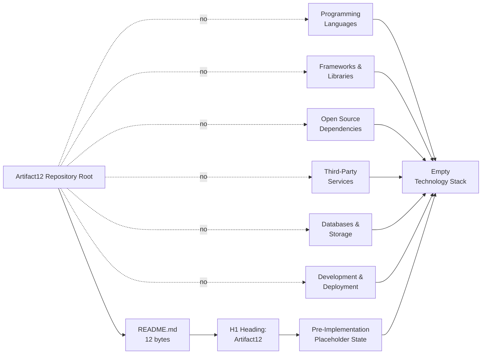

### 3.8.2 Activation Pathway

The following diagram defines a normative procedural reference — not a commitment — describing the canonical sequence by which the Technology Stack would transition from its current empty state to a populated state. The diagram is provided to clarify what repository changes would trigger which subsection updates; it does not endorse any specific technology selection.

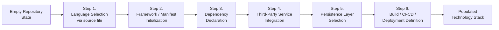

Each step in the activation pathway corresponds to the introduction of one or more evidence anchors required by Constraints C-001 through C-004 to lift the verified-absence status of the corresponding subsection (3.2 through 3.7 respectively).

### 3.8.3 Default Technology Stack as Reserved Reference

The following table presents the complete user-provided default technology stack acknowledged in Section 3.1.3. Each item is recorded with its grouping and a uniform status of "Not committed in repository." No version is pinned, no selection rationale is asserted, no security implication is enumerated, and no integration requirement is documented. The table preserves the user-context reference without violating Constraint C-004 and constitutes the entire treatment of these items within the current revision of this Technical Specification.

| Group | Item | Default Reference | Status |
|-------|------|-------------------|--------|
| Core Infrastructure | Cloud Platform | AWS | Not committed in repository |
| Core Infrastructure | Containerization | Docker | Not committed in repository |
| Core Infrastructure | Infrastructure as Code | Terraform | Not committed in repository |
| Core Infrastructure | CI/CD | GitHub Actions | Not committed in repository |
| Backend | Primary Language | Python | Not committed in repository |
| Backend | Framework | Flask | Not committed in repository |
| Backend | Authentication | Auth0 | Not committed in repository |
| Backend | Database | MongoDB | Not committed in repository |
| Backend | AI Framework | Langchain | Not committed in repository |
| Frontend | Web | React with TypeScript | Not committed in repository |
| Frontend | CSS Framework | TailwindCSS | Not committed in repository |
| Frontend | Mobile / Cross-platform | React Native with TypeScript | Not committed in repository |
| Native Applications | iOS | Swift | Not committed in repository |
| Native Applications | Android | Kotlin | Not committed in repository |
| Native Applications | macOS | Objective-C | Not committed in repository |
| Native Applications | Desktop | ElectronJS | Not committed in repository |

This reserved-reference table will be revised — and individual items lifted from "Not committed in repository" to a positively-evidenced status — only when the corresponding manifest, configuration file, or source artifact is introduced to the repository, in conformance with Constraint C-004 and Constraint C-001.

---

## 3.9 Section Summary

### 3.9.1 Aggregate Determination

The aggregate state of Section 3 (Technology Stack) is summarized below across each subsection. Every row records a verified-absence determination rather than a committed selection, consistent with the methodology established in Section 1.1.2 and the constraints enumerated in Section 2.6.2:

| Subsection | Population State | Determining Evidence |
|------------|------------------|----------------------|
| 3.2 Programming Languages | Empty; reserved schema only | Section 1.2.2.3 (no source files of any language) |
| 3.3 Frameworks & Libraries | Empty; reserved schema only | Section 1.2.2.3 (no manifests, no framework configuration); Section 3.4 (no dependencies) |
| 3.4 Open Source Dependencies | Empty; reserved schema only | Section 1.2.2.3 (zero manifests across all ecosystems); Section 2.1.2 (External Dependencies = None) |
| 3.5 Third-Party Services | Empty; reserved schema only | Section 1.2.1.3; Section 1.3.1.3; Section 2.3.2; Section 2.4.3 |
| 3.6 Databases & Storage | Empty; reserved schema only | Section 2.2 (Data Requirements = Not documented); Section 2.3.2 (data-store integrations = Not documented) |
| 3.7 Development & Deployment | Empty; reserved schema only | Section 1.2.2.3 (no containerization, no CI/CD, no IaC); Section 2.4.4 |
| 3.8.3 Default Stack Reference | 16 items marked "Not committed in repository" | Section 1.2.2.3; Constraint C-004 (Section 2.6.2) |

### 3.9.2 Revision Trigger Conditions

Section 3 will be revised — and its reserved schemas populated, and individual default-stack items lifted from "Not committed in repository" to a positively-evidenced status — when any of the following changes occur in the Artifact12 repository. The triggers are mapped to the specific subsections they would activate:

| Repository Change | Activated Subsection(s) | Lifecycle Action |
|-------------------|-------------------------|------------------|
| Introduction of a source file in any programming language (`.py`, `.js`, `.ts`, `.java`, `.go`, `.rb`, `.cs`, `.rs`, `.php`, `.swift`, `.kt`, etc.) | 3.2 Programming Languages | First language entry; revise 3.2.1 inventory, populate 3.2.3 schema row |
| Introduction of a dependency manifest (`package.json`, `requirements.txt`, `pyproject.toml`, `pom.xml`, `Cargo.toml`, `go.mod`, `Gemfile`, `composer.json`, etc.) | 3.3 Frameworks & Libraries; 3.4 Open Source Dependencies | Populate first dependency entries; pin versions; record registry |
| Introduction of framework-specific configuration (e.g., `tailwind.config.*`, `next.config.*`, `tsconfig.json`, `vite.config.*`) | 3.3 Frameworks & Libraries | First framework entry; revise 3.3.1 inventory |
| Introduction of a third-party service binding (SDK dependency, OpenAPI/Swagger specification, auth-provider configuration, cloud-provider SDK) | 3.5 Third-Party Services | First service entry; revise 3.5.1 inventory; populate 3.5.3 schema row |
| Introduction of a database schema, migration directory, ORM model file, or data-store driver dependency | 3.6 Databases & Storage | First storage entry; revise 3.6.1 inventory; populate 3.6.3 schema row |
| Introduction of a `Dockerfile`, `docker-compose.yml`, or container orchestration manifest | 3.7 Development & Deployment | First containerization entry; revise 3.7.1 inventory |
| Introduction of a CI/CD definition (`.github/workflows/`, `.gitlab-ci.yml`, `Jenkinsfile`, etc.) | 3.7 Development & Deployment | First CI/CD entry; revise 3.7.1 inventory |
| Introduction of an infrastructure-as-code template (`*.tf`, `*.bicep`, CloudFormation template) | 3.7 Development & Deployment | First IaC entry; revise 3.7.1 inventory |
| Introduction of a developer-environment configuration (`.editorconfig`, `.prettierrc`, `.eslintrc*`, `.devcontainer/`, `.vscode/`) | 3.7 Development & Deployment | First developer-tooling entry; revise 3.7.1 inventory |

Until any such change occurs, Section 3 remains in its current absence-documenting state, consistent with the methodology established in Section 1, preserved by Assumptions A-001 through A-003 (Section 2.6.1) and Constraints C-001 through C-004 (Section 2.6.2), and reaffirmed by the empty-catalog rationale of Section 2.1.4.

---

## 3.10 References

### 3.10.1 Files Examined

- `README.md` — The repository's only substantive file (12 bytes), containing the single H1 heading "Artifact12"; the sole positively-evidenced artifact and the anchor of the only positive path in the Section 3.8.1 absence-topology diagram; the basis for every "Not committed" determination in Sections 3.2 through 3.7 by virtue of being the entirety of the repository's substantive content.
- `blitzy/documentation/Agent Action Plan.md` — Source of the R-AAP-01 (preserve project identity) and R-AAP-02 (non-expansion principle) directives that constrain every subsection of Section 3; documents the exclusion of the user-context default stack from current scope, which underpins the treatment of Section 3.1.3 and Section 3.8.3.
- `blitzy/documentation/Input Prompt.md` — A 55-line placeholder containing only the word "custom" repeated 28 times; reaffirms (per Assumption A-002, Section 2.6.1) that no substantive requirements were supplied that could authorize any technology selection in Section 3.
- `blitzy/documentation/Technical Specifications.md` — The master Technical Specification (this document) whose Section 3 is authored here; cross-references Sections 1.1, 1.2, 1.3, 2.1, 2.2, 2.3, 2.4, 2.6, and 2.7 as authoritative absence determinations.

### 3.10.2 Folders Explored

- `` (repository root) — Verified to contain exactly one substantive file (`README.md`) and one subdirectory (`blitzy/`); no source folders, configuration folders, deployment folders, CI/CD folders, dependency-cache folders, or infrastructure folders exist; basis for the verified-absence inventories in Sections 3.2.1, 3.4.1, 3.5.1, 3.6.1, and 3.7.1.
- `blitzy/` — Contains only the `documentation/` subdirectory; no application code, manifests, scripts, configuration assets, tests, or deployment artifacts exist at this level; basis for the verified-absence determinations in Sections 3.3, 3.4, and 3.7.
- `blitzy/documentation/` — Contains exactly three Markdown documentation files; no executable source code, package manifests, build scripts, test files, configuration assets, infrastructure definitions, or runtime modules exist at this level; basis for the absence determinations in Sections 3.2.1 (Markdown noted as markup, not programming language) and 3.7.2.

### 3.10.3 Repository-Wide Verifications Inherited from Section 1.2.2.3

- Zero source-code files across `.py`, `.js`, `.ts`, `.tsx`, `.jsx`, `.java`, `.go`, `.rb`, `.cs`, `.rs`, `.php`, `.swift`, `.kt`, `.m`, `.mm`, `.html`, `.css`, `.sql`, `.scala`, `.sh`, `.ps1`, `.r` — basis for Section 3.2.
- Zero dependency manifests (`package.json`, `package-lock.json`, `yarn.lock`, `pnpm-lock.yaml`, `requirements.txt`, `pyproject.toml`, `setup.py`, `Pipfile`, `poetry.lock`, `pom.xml`, `build.gradle`, `build.gradle.kts`, `Cargo.toml`, `Cargo.lock`, `go.mod`, `go.sum`, `Gemfile`, `Gemfile.lock`, `composer.json`, `composer.lock`, `*.csproj`, `*.sln`, `Podfile`, `Package.swift`) — basis for Sections 3.3 and 3.4.
- Zero configuration files (`*.json`, `*.yaml`, `*.yml`, `*.toml`, `*.xml`, `.env*`, `.*rc`, `*.config.*`) — basis for Sections 3.5, 3.6, and 3.7.
- Zero containerization assets (`Dockerfile`, `docker-compose*`, `.dockerignore`) — basis for Section 3.7.2.4.
- Zero orchestration manifests (Kubernetes, Helm) — basis for Section 3.7.1.
- Zero infrastructure-as-code templates (`*.tf`, `*.bicep`, CloudFormation) — basis for Section 3.7.2.6.
- Zero CI/CD definitions (`.github/workflows/`, `.gitlab-ci.yml`, `Jenkinsfile`, `azure-pipelines.yml`, `.circleci/`, `Makefile*`) — basis for Section 3.7.2.5.
- Zero test artifacts (`tests/**`, `__tests__/`, `spec/`, `*test*`, `*spec*`) — basis for Section 3.3.1 (testing framework row) and Section 3.7.1.
- Zero developer-environment configurations (`.editorconfig`, `.prettierrc`, `.eslintrc*`, `.devcontainer/`, `.vscode/`, `Vagrantfile`) — basis for Section 3.7.2.2.
- Zero hidden files other than `.git/` — basis for the completeness of the file inventory cited throughout Section 3.

### 3.10.4 Technical Specification Sections Cross-Referenced

- **Section 1.1 (Executive Summary)** — Subsections 1.1.2 (Repository State Disclosure) and 1.1.6 (Summary of Verifiable Facts) cited as the foundational evidence-discipline basis for every subsection of Section 3.
- **Section 1.2 (System Overview)** — Subsections 1.2.1.3 (Integration with Existing Enterprise Landscape), 1.2.2.2 (Major System Components), 1.2.2.3 (Core Technical Approach), and 1.2.3.3 (Key Performance Indicators) cited as authoritative sources for the absence determinations in Sections 3.2, 3.3, 3.4, 3.5, 3.6, 3.7, and 3.8.
- **Section 1.3 (Scope)** — Subsections 1.3.1.3 (Essential Integrations), 1.3.3.2 (Integration Points Not Covered), and 1.3.4 (Scope Summary) cited in Section 3.5 as authoritative integration-absence sources.
- **Section 2.1 (Feature Catalog)** — Subsections 2.1.2 (Verified Repository Inventory Against Feature Identification) and 2.1.4 (Rationale for Empty Catalog) cited in Sections 3.4 and 3.6 to confirm the External Dependencies and feature-driven persistence-requirement absences.
- **Section 2.2 (Functional Requirements)** — Cited in Section 3.6 to confirm the "Data Requirements: Not documented" determination.
- **Section 2.3 (Feature Relationships)** — Subsections 2.3.2 (Integration Points Status) and 2.3.3 (Shared Components and Common Services) cited in Sections 3.5 and 3.6 to confirm the integration-point and cross-cutting-concern absences.
- **Section 2.4 (Implementation Considerations)** — Subsections 2.4.1 (Technical Constraints), 2.4.3 (Security Implications), and 2.4.4 (Maintenance Requirements) cited in Sections 3.1.3, 3.5.2.3, and 3.7.2 to confirm the absence of technical constraints, security controls, and maintenance directives.
- **Section 2.6 (Assumptions and Constraints)** — Assumptions A-001 through A-003 and Constraints C-001 through C-004 cited throughout Section 3 (especially Sections 3.1.2, 3.4.2.1, 3.5.2.1, and 3.7.2.1) as the binding methodological framework.
- **Section 2.7 (Section Summary)** — Subsection 2.7.2 (Revision Trigger Conditions) cited as the structural precedent for Section 3.9.2.

# 4. Process Flowchart

This section documents the process flowcharts of the Artifact12 project under the evidence-based discipline established in Section 1.1.2 (Repository State Disclosure) and preserved by the assumptions and constraints recorded in Section 2.6 (Assumptions A-001 through A-003; Constraints C-001 through C-004). As established in Section 1.2.2.1 (Primary System Capabilities), the repository declares no primary system capabilities, no feature catalog, no user-story collection, no use-case inventory, and no functional-requirements register; as established in Section 1.3.1.2 (Primary User Workflows), no user workflows are in scope. The section prompt for Process Flowchart calls for end-to-end user journeys, system interactions, decision points, error-handling paths, integration workflows, data flow between systems, API interactions, event processing flows, batch processing sequences, state-management diagrams, and error-handling flowcharts. None of these elements is sourced by an evidence anchor in the repository. This section therefore documents the verified absence of every process-flowchart element, provides reserved schemas with reserved identifier formats (`P-XXX` for business processes, `W-XXX` for workflows) so that future revisions can populate the catalog in a consistent format, presents the absence-topology diagrams required by the section prompt, and records the activation pathway by which substantive process documentation would replace the current absence-documenting state.

## 4.1 PROCESS FLOWCHART POPULATION STATUS

### 4.1.1 Authoritative Statement of Absence

The Process Flowchart inventory for the Artifact12 project is **empty**. This is not an editorial omission but a verified state: the repository contains no business process catalog, no workflow definition, no user journey map, no Business Process Model and Notation (BPMN) artifact, no sequence diagram, no state-transition diagram, no activity diagram, no swimlane allocation, and no flowchart of any kind beyond the topology diagrams authored within this Technical Specification itself. The repository-wide verifications inherited from Section 1.2.2.3 — zero source code, zero dependency manifests, zero configuration files, zero containerization assets, zero CI/CD definitions, zero infrastructure-as-code templates, and zero test artifacts — collectively foreclose every conceivable evidentiary basis from which an executable process flow could be extracted or specified.

The single positively-evidenced fact in the repository (per Section 1.1.6) is the project identity declaration "Artifact12" present as the H1 heading on line 1 of `README.md`. A bare identity declaration of twelve bytes does not, and cannot, constitute a process, a workflow, a journey, or any unit of executable behavior. The verified pre-implementation, placeholder state of the repository (Section 1.1.2) is therefore the controlling condition under which this section is authored.

### 4.1.2 Pre-Acknowledged Position from Section 2.5.3

Section 2.5.3 (Related Process Flowcharts) of this Technical Specification already establishes the authoritative pre-acknowledgment that anchors the present section. That subsection records that the repository contains exactly two diagrams as of the current revision — the content topology diagram in Section 1.2.2 and the empty-relationship diagram in Section 2.3.1 — and that no additional process flowcharts can be authored because no processes, workflows, or user journeys have been declared anywhere in the repository. Section 1.3.1.2 (cited within Section 2.5.3) independently confirms that no user workflows are in scope.

The present Section 4 honors this pre-acknowledgment by:

- Declining to fabricate any process, workflow, or journey not evidenced by a tracked file;
- Documenting the verified absence of every element required by the section prompt using the same tabular and topological idioms established in Sections 2.3.1 (empty-relationship diagram) and 3.8.1 (verified absence topology);
- Providing reserved schemas (Section 4.6 below) so that a future revision can populate the catalog without restructuring the document; and
- Mapping the section prompt's five required diagram classes to absence-topology treatments in Section 4.8.2.

### 4.1.3 Documentation Methodology and Guardrails

The methodological framework that governs this section is inherited directly from Sections 1 and 2 and is binding on every subsection below:

| Guardrail | Source | Effect on Section 4 |
|-----------|--------|---------------------|
| Evidence-based authoring discipline | Section 1.1.2 | Every process-flowchart claim must be constrained to facts directly observable in the repository; "not present in the repository" is a valid and required outcome where no evidence exists |
| Preservation requirement (R-AAP-01) | Agent Action Plan (cited in Section 2.4.1) | The project identity "Artifact12" must be preserved exactly as declared in `README.md` line 1; no process flowchart may modify or rebrand this identity |
| Non-expansion principle (R-AAP-02) | Agent Action Plan (cited in Section 2.4.1) | No business process, workflow, integration flow, decision rule, state transition, or error-handling path may be introduced as "documented" absent a tracked-file evidence anchor |
| Constraint C-001 | Section 2.6.2 | No catalogued process may lack `README.md` or another tracked-file evidence anchor |
| Constraint C-002 | Section 2.6.2 | No process step may be authored without a corresponding parent feature in Section 2.1 (which is empty); transitively, no flowchart node may be authored |
| Constraint C-003 | Section 2.6.2 | No integration workflow, API interaction sequence, or event-processing flow may be introduced without source-code or specification evidence |
| Constraint C-004 | Section 2.6.2 | No technology-specific process (e.g., Flask request lifecycle, MongoDB transaction flow, OAuth handshake) may be committed until the repository introduces a manifest, configuration file, or source artifact that establishes the underlying technology selection |
| Assumption A-001 | Section 2.6.1 | The repository contents enumerated in Section 1.2.2.2 represent the complete tracked file inventory at the time of this specification, validating the absence determinations made throughout Section 4 |
| Assumption A-002 | Section 2.6.1 | The Input Prompt's repeated word "custom" does not constitute a substantive product requirement and therefore does not yield any process, workflow, or journey entry |
| Assumption A-003 | Section 2.6.1 | Reserved identifier formats (`F-XXX`, `F-XXX-RQ-YYY`, and by extension `P-XXX` for processes and `W-XXX` for workflows) will not be assigned in this revision because no feature-bearing or process-bearing artifact exists |

These guardrails together mandate that Section 4 be authored as a structured catalogue of verified absences accompanied by reserved schemas and absence-topology diagrams, rather than as a declaration of any business process or system workflow.

#### 4.1.3.1 Treatment of the User-Provided Default Technology Stack

A specific corollary of Constraint C-004 applies throughout this section. The user-context default technology stack (encompassing AWS, Docker, Terraform, GitHub Actions, Python, Flask, Auth0, MongoDB, Langchain, React with TypeScript, TailwindCSS, React Native with TypeScript, Swift, Kotlin, Objective-C, and ElectronJS) is recorded in Section 3.1.3 and Section 3.8.3 strictly as a reserved future-direction reference; none of these technologies has been committed within the Artifact12 repository. Consequently, this Section 4 does not author any technology-specific process flow that would presuppose a selection — including but not limited to: Flask request lifecycle diagrams, MongoDB transaction or aggregation flows, Auth0 OAuth/OIDC handshake sequences, React rendering or hydration pipelines, AWS Lambda invocation sequences, Docker container lifecycle diagrams, Terraform plan/apply state machines, GitHub Actions job dependency graphs, or Langchain agent execution flows. Each such diagram would imply a binding selection that Constraint C-004 prohibits in the absence of the corresponding manifest, configuration, or source artifact.

## 4.2 SYSTEM WORKFLOWS INVENTORY

### 4.2.1 Core Business Processes

The section prompt requires documentation of core business processes, including end-to-end user journeys, system interactions, decision points, and error handling paths. The repository contains no business-process artifact of any kind. The following table maps each required element to its authoritative cross-reference and records the verified state of each:

| Required Business Process Element | Required Content (Section-Prompt Taxonomy) | Authoritative Cross-Reference | Status |
|-----------------------------------|--------------------------------------------|-------------------------------|--------|
| End-to-end user journeys | User-journey maps, persona-driven scenarios, task flows | Section 1.3.1.2 (no user workflows in scope); Section 1.1.4 (no stakeholders, personas, or audiences) | Not documented |
| System interactions | Component-to-component interaction diagrams, sequence diagrams | Section 1.2.2.1 (no primary system capabilities); Section 1.2.2.2 (single 12-byte `README.md` is the only component); Section 2.3.3 (no shared components) | Not documented |
| Decision points (business rules) | Conditional logic, branching gates, eligibility evaluations | Section 2.2.4 (Business Rules = Not documented); Section 2.2.4 (Data Validation = Not documented) | Not documented |
| Error handling paths | Exception flows, compensating transactions, fallback routes | Section 1.2.2.3 (no source code to raise exceptions); Section 2.3.3 (error handling and resiliency = Not documented) | Not documented |

#### 4.2.1.1 End-to-End User Journey Determination

No end-to-end user journey can be drawn because the repository declares no users, no user-facing surfaces, and no interaction patterns. Section 1.3.1.2 explicitly defers user-workflow definition to a future specification revision triggered by the introduction of user-facing artifacts. Section 1.1.4 confirms that the repository does not contain a stakeholder registry, user persona definition, role inventory, or audience profile from which a journey could be constructed.

#### 4.2.1.2 System Interaction Determination

No system interaction can be charted because there is exactly one substantive system component in the repository (`README.md`, 12 bytes; Section 1.2.2.2) and no behavioral surface upon which interactions could occur. No services, modules, libraries, packages, executables, schemas, or runtime artifacts exist; consequently, no interaction edge is derivable.

#### 4.2.1.3 Decision Point Determination

No decision diamond can be authored because Section 2.2.4 records every validation-rule category (Business Rules, Data Validation, Security Requirements, Compliance Requirements) as "Not documented." A decision diamond requires a predicate; predicates require business rules or data-validation criteria; neither exists.

#### 4.2.1.4 Error Handling Path Determination

No error handling path can be charted because there is no source code to raise an exception (Section 1.2.2.3 verified zero source files across eleven major languages) and no resilience policy (Section 2.3.3 records "Error handling and resiliency" as "Not documented"). Error states presuppose executable behavior; executable behavior is absent.

### 4.2.2 Integration Workflows

The section prompt requires documentation of integration workflows, including data flow between systems, API interactions, event processing flows, and batch processing sequences. The repository contains no integration artifact of any kind. The following table maps each required element to its authoritative cross-reference and records the verified state of each:

| Required Integration Workflow Element | Required Content (Section-Prompt Taxonomy) | Authoritative Cross-Reference | Status |
|---------------------------------------|--------------------------------------------|-------------------------------|--------|
| Data flow between systems | ETL pipelines, data-bus topologies, propagation graphs | Section 1.2.1.3 (no integration with existing enterprise landscape); Section 2.3.2 (all integration-point categories = Not documented) | Not documented |
| API interactions | REST/GraphQL/gRPC sequence diagrams, request/response contracts | Section 3.5.1 (zero third-party service bindings); Section 3.5.2.2 (no OpenAPI/Swagger, no gRPC `.proto`, no GraphQL schema) | Not documented |
| Event processing flows | Event-bus topologies, message-broker flows, pub/sub interactions | Section 3.5.1 (Notification services = Not committed; Cloud services = Not committed); Section 3.6.1 (Message broker / queue = Not committed) | Not documented |
| Batch processing sequences | Scheduled jobs, ETL batches, recurring task chains | Section 1.2.2.3 (no source code, no CI/CD); Section 3.7.1 (CI/CD definitions = Not committed; no `cron`/scheduler configuration) | Not documented |

#### 4.2.2.1 Data Flow Determination

No data flow diagram can be authored because no data domains have been declared (Section 1.3.2 records "Data domains included" as "None declared / Undefined") and no databases or storage services have been committed (Section 3.6.1 records every storage category — primary database, secondary database, caching solution, object/blob storage, search engine, message broker/queue, file-system persistence — as "Not committed"). A data flow requires a source store, a sink store, and a transport; none of the three has an evidence anchor.

#### 4.2.2.2 API Interaction Determination

No API interaction sequence can be authored because the repository contains no API specification artifact (no OpenAPI/Swagger document, no gRPC `.proto` definition, no GraphQL schema; per Section 3.5.2.2) and no SDK dependency (because no dependency manifest exists). No endpoint, no operation, no request schema, no response schema, and no authentication method has been declared. Section 1.3.3.2 explicitly catalogues all integration points (including authentication providers, payment processors, analytics platforms, monitoring services, content-delivery networks, message brokers, databases, search engines, email and notification gateways, mobile-platform stores, identity federation services, and enterprise resource systems) as not covered.

#### 4.2.2.3 Event Processing Determination

No event processing flow can be authored because the repository contains no message broker or queue (Section 3.6.1 records the category as "Not committed"), no event schema (no `*.avsc`, no AsyncAPI specification, no Protobuf event contract), and no notification SDK dependency (Section 3.5.1 records Notification services as "Not committed"). The event-driven architecture presupposes a transport (broker), a contract (schema), and a producer/consumer pair; none of the three has an evidence anchor.

#### 4.2.2.4 Batch Processing Determination

No batch processing sequence can be authored because the repository contains no CI/CD definition (Section 3.7.1 records GitHub Actions, GitLab CI, Jenkins, Azure DevOps, and CircleCI configurations as "Not committed"), no scheduler or cron specification, no build system that could orchestrate a batch (Section 3.7.1 records `Makefile`, `package.json` scripts, `tox.ini`, `build.gradle`, `pyproject.toml [build-system]`, and Bazel configurations as "None present"), and no source code to be batched.

### 4.2.3 System Workflows Aggregate Determination

The aggregate determination across Sections 4.2.1 and 4.2.2 is that the System Workflows Inventory is empty across all eight required elements. No core business process and no integration workflow has any evidence anchor in the repository. Population of this inventory awaits the introduction of substantive process-defining artifacts as enumerated in Section 4.7.3 (Revision Trigger Conditions).

## 4.3 FLOWCHART CONSTITUENT ELEMENT STATUS

The section prompt requires that each major workflow include start and end points, process steps, decision diamonds, system boundaries, user touchpoints, error states and recovery paths, timing and SLA considerations, and (under Validation Rules) business rules at each step, data validation requirements, authorization checkpoints, and regulatory compliance checks. Because no workflow exists (Section 4.2.3), no constituent element of any workflow exists. This section documents the verified absence of each constituent element with its authoritative cross-reference.

### 4.3.1 Workflow Anatomy Elements

| Required Anatomy Element | Required Content (Section-Prompt Taxonomy) | Authoritative Cross-Reference | Status |
|--------------------------|--------------------------------------------|-------------------------------|--------|
| Start and end points | Workflow initiation events, terminal events | Section 1.3.1.2 (no user workflows); Section 2.1.1 (empty Feature Catalog) | Not documented |
| Process steps | Discrete activity nodes, task units | Section 2.1.1 (empty Feature Catalog); Section 2.2.1 (empty Functional Requirements) | Not documented |
| Decision diamonds | Conditional gates, branching predicates | Section 2.2.4 (Business Rules = Not documented; Data Validation = Not documented) | Not documented |
| System boundaries | Bounded-context perimeters, deployment-unit edges | Section 1.3.2 (System boundaries = literal contents of repository; no observable behavioral boundaries) | Not documented |
| User touchpoints | UI surfaces, CLI prompts, API exposure points | Section 1.1.4 (no users); Section 1.3.1.2 (no user workflows); Section 1.3.3 (all UIs out-of-scope) | Not documented |
| Error states and recovery paths | Exception nodes, compensating actions, retry edges | Section 1.2.2.3 (no source code); Section 2.3.3 (Error handling and resiliency = Not documented) | Not documented |
| Timing and SLA considerations | Step-level latency budgets, end-to-end SLA, throughput targets | Section 1.2.3.3 (Technical KPIs = Not documented; Operational KPIs = Not documented); Section 2.4.2 (Performance requirements = Not documented) | Not documented |
| Swim-lane actors and systems | Actor lanes, system lanes, role partitions | Section 1.1.4 (no stakeholders / personas / role inventory); Section 1.3.2 (User groups covered = None declared) | Not documented |

### 4.3.2 Validation Rules Elements

| Required Validation Element | Required Content (Section-Prompt Taxonomy) | Authoritative Cross-Reference | Status |
|-----------------------------|--------------------------------------------|-------------------------------|--------|
| Business rules at each step | Domain invariants, eligibility predicates, transition guards | Section 2.2.4 (Business Rules = Not documented) | Not documented |
| Data validation requirements | Field format, range, presence, cross-field constraints | Section 2.2.4 (Data Validation = Not documented); Section 2.2.3 (Data Requirements = Not documented) | Not documented |
| Authorization checkpoints | Role/permission gates, scope verifications, policy evaluations | Section 2.2.4 (Security Requirements = Not documented); Section 2.4.3 (no security controls, authentication providers, authorization models, or compliance frameworks) | Not documented |
| Regulatory compliance checks | GDPR / HIPAA / PCI-DSS / SOX gates, audit-trail points | Section 2.2.4 (Compliance Requirements = Not documented); Section 1.3.1.4 (no compliance constraint declared as binding) | Not documented |

### 4.3.3 Constituent Element Aggregate Determination

The aggregate determination across Sections 4.3.1 and 4.3.2 is that every constituent element required by the section prompt is verified-absent from the repository. The eight anatomy elements and four validation-rule elements together comprise twelve required categories; all twelve resolve to "Not documented." Population of any single element presupposes the introduction of a feature or workflow that would consume it; per Constraint C-002, no requirement (and therefore no flowchart constituent) may be authored without a corresponding parent feature in Section 2.1, which is empty (Section 2.1.1).

## 4.4 TECHNICAL IMPLEMENTATION WORKFLOW ELEMENTS

The section prompt requires documentation of technical-implementation aspects of process flows: state management (state transitions, data persistence points, caching requirements, transaction boundaries) and error handling (retry mechanisms, fallback processes, error notification flows, recovery procedures). Each of these aspects requires an underlying technology selection that has not been made.

### 4.4.1 State Management Elements

| Required State Management Element | Required Content (Section-Prompt Taxonomy) | Authoritative Cross-Reference | Status |
|-----------------------------------|--------------------------------------------|-------------------------------|--------|
| State transitions | Finite-state-machine definitions, state-transition tables, enabling events | Section 2.1.1 (empty Feature Catalog); Section 1.3.2 (no data domains declared) | Not documented |
| Data persistence points | Write boundaries, durable-store touchpoints, snapshot triggers | Section 3.6.1 (every storage category = Not committed); Section 2.2.3 (Data Requirements = Not documented) | Not documented |
| Caching requirements | Cache-aside / write-through / write-back policies, TTL specifications, key namespaces | Section 3.6.2.4 (no caching solution committed); Section 2.3.3 (Caching and performance = Not documented) | Not documented |
| Transaction boundaries | ACID transaction scopes, saga boundaries, compensating-action sets | Section 3.6.1 (no primary database committed); Section 3.6.2.3 (no data persistence strategy documented; consistency model, durability guarantees, replication topology, backup/restore, and retention all undocumented) | Not documented |

#### 4.4.1.1 State Transition Determination

No state transition can be drawn because no entity, aggregate, or domain object has been declared (Section 1.3.2 records "Data domains included" as "None declared / Undefined") and no feature presupposes a stateful lifecycle (Section 2.1.1 records the Feature Catalog as empty). A state-transition diagram requires a state set, a transition relation, and a triggering-event vocabulary; none of the three has an evidence anchor.

#### 4.4.1.2 Persistence and Caching Determination

No persistence point and no caching requirement can be authored because the repository contains no schema (Section 3.6.2.2 confirms no `.sql`, no `schema.prisma`, no SQLAlchemy module, no Mongoose schema, no Sequelize migration, no Liquibase changelog, no Flyway migration, no Entity Framework migration), no cache client dependency (Section 3.6.2.4), and no connection-string or environment-template configuration (Section 1.2.2.3 verified zero `.env*` files).

#### 4.4.1.3 Transaction Boundary Determination

No transaction boundary can be authored because no database has been committed (Section 3.6.1) and no consistency model has been declared (Section 3.6.2.3). Transaction boundaries presuppose both a persistence technology and a unit-of-work convention; neither exists.

### 4.4.2 Error Handling Elements

| Required Error Handling Element | Required Content (Section-Prompt Taxonomy) | Authoritative Cross-Reference | Status |
|---------------------------------|--------------------------------------------|-------------------------------|--------|
| Retry mechanisms | Exponential backoff policies, retry budgets, idempotency keys | Section 1.2.2.3 (no source code to retry); Section 2.3.3 (Error handling and resiliency = Not documented) | Not documented |
| Fallback processes | Degraded-mode paths, circuit-breaker fallbacks, alternative providers | Section 3.5.1 (no third-party services, therefore no alternative providers); Section 2.3.3 (Error handling and resiliency = Not documented) | Not documented |
| Error notification flows | Alert routing, on-call escalation, incident-creation hooks | Section 3.5.1 (Monitoring/observability tools = Not committed; Notification services = Not committed) | Not documented |
| Recovery procedures | Runbooks, rollback procedures, disaster-recovery drills | Section 2.4.4 (Maintenance Requirements absent); Section 3.7.1 (no CI/CD pipeline definitions, no deployment promotion stages) | Not documented |

#### 4.4.2.1 Retry and Fallback Determination

No retry mechanism and no fallback process can be authored because no source code exists in which to embed a retry policy (Section 1.2.2.3) and no alternative provider exists to which a fallback could route (Section 3.5.1 records every third-party service category as "Not committed"). Resilience policies presuppose both an executable failure surface and a redundancy topology; neither exists.

#### 4.4.2.2 Error Notification Determination

No error notification flow can be authored because no monitoring or observability tool is configured (Section 3.5.2.4 confirms no Prometheus, OpenTelemetry, Datadog, or New Relic configuration), no logging or telemetry service is bound (Section 3.5.1 records "Logging / telemetry services" as "Not committed"), and no notification gateway is integrated (Section 3.5.1 records "Notification services" as "Not committed"). The notification flow presupposes a detection signal, a routing rule, and a delivery channel; none of the three has an evidence anchor.

#### 4.4.2.3 Recovery Procedure Determination

No recovery procedure can be authored because the repository contains no runbook, no rollback script, no disaster-recovery plan, no backup or restore policy (Section 3.6.2.3 records backup/restore policy as undocumented), and no maintenance directive beyond the documentation-revision discipline recorded in Section 2.4.4. Recovery procedures presuppose both an operational substrate (deployment target, environment, secret store) and a documented operational discipline; neither exists.

### 4.4.3 Technical Implementation Aggregate Determination

The aggregate determination across Sections 4.4.1 and 4.4.2 is that every technical-implementation workflow element required by the section prompt is verified-absent from the repository. The four state-management elements and four error-handling elements together comprise eight required categories; all eight resolve to "Not documented." Population of any single element requires either a database, a runtime, an SDK, an observability platform, or a deployment artifact — none of which is committed (per Sections 3.5, 3.6, and 3.7).

## 4.5 PROCESS TOPOLOGY DIAGRAMS

This section satisfies the section-prompt requirement for diagrams by providing three Mermaid-format absence-topology diagrams that visualize the verified topological state of the Process Flowchart domain. These diagrams follow the established idiom of Sections 1.2.2 (Content Topology), 2.3.1 (Empty-Relationship Diagram), and 3.8.1 (Verified Absence Topology): solid edges denote evidenced presence; dotted edges labeled "no" denote verified absence; and convergence nodes at the bottom collect all absence findings into a single empty terminus. The diagrams do not author content beyond what is positively evidenced; they visualize the absence-documenting state itself.

### 4.5.1 High-Level System Workflow Absence Topology

The following diagram visualizes the verified topological state of the System Workflows Inventory (Section 4.2). The single positively-evidenced path traces from the repository root through `README.md` to the H1 heading and onward to the pre-implementation state node. Every workflow category required by the section prompt — both the four Core Business Processes (Section 4.2.1) and the four Integration Workflows (Section 4.2.2) — radiates from the repository root as a verified-absent edge and converges on a single "Empty System Workflows Inventory" terminus.

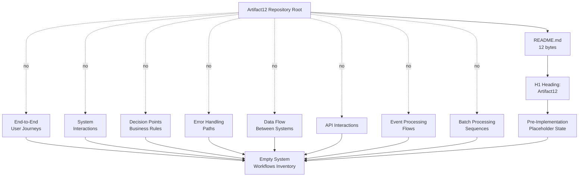

This diagram simultaneously serves as the high-level system workflow diagram and the integration sequence diagram required by the section prompt, since both classes resolve to the same empty terminus under the verified pre-implementation state of the repository.

### 4.5.2 Detailed Process Flow Constituent Elements Absence Topology

The following diagram visualizes the verified topological state of the Flowchart Constituent Element Status (Section 4.3). Each of the twelve constituent elements required by the section prompt — eight workflow-anatomy elements (Section 4.3.1) and four validation-rule elements (Section 4.3.2) — radiates from the repository root as a verified-absent edge and converges on a single "Empty Flowchart Constituent Element Set" terminus.

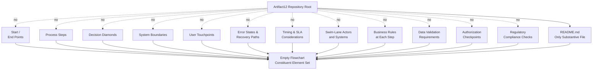

This diagram serves as the "detailed process flows for each core feature" required by the section prompt: because the Feature Catalog is empty (Section 2.1.1) and therefore no core feature exists, the detailed-flow diagram is necessarily empty across all twelve constituent dimensions and is depicted as the convergence topology above.

### 4.5.3 State Management and Error Handling Absence Topology

The following diagram visualizes the verified topological state of the Technical Implementation Workflow Elements (Section 4.4). Each of the eight technical-implementation elements — four state-management elements (Section 4.4.1) and four error-handling elements (Section 4.4.2) — radiates from the repository root as a verified-absent edge and converges on a single "Empty Technical Implementation Element Set" terminus.

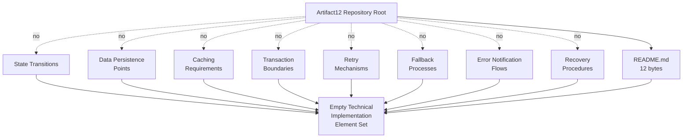

This diagram simultaneously serves as the state transition diagram and the error handling flowchart required by the section prompt, since both classes resolve to the same empty terminus under the verified pre-implementation state of the repository.

## 4.6 RESERVED PROCESS FLOWCHART SCHEMAS

To support future population without restructuring the document, this section defines four reserved schemas — for business processes, workflows, state transitions, and error handling — that align with the reservation patterns established in Section 2.1.3 (Feature Metadata Schema), Section 2.2.2 (Requirement Metadata Schema), Section 3.5.3 (Third-Party Services Schema), Section 3.6.3 (Databases & Storage Schema), and Section 3.7.3 (Development & Deployment Schema). Each schema is **not populated**; each is provided as a normative structure only and bears a "Reserved; awaiting [trigger]" status line.

### 4.6.1 Business Process Catalog Schema

| Schema Field | Format | Permissible Values |
|--------------|--------|--------------------|
| Process ID | `P-XXX` (zero-padded three-digit) | `P-001` through `P-999`; sequential |
| Process Name | Free text, title case | Descriptive label |
| Process Category | Enumerated | User Journey, System Interaction, Integration Workflow, Batch Process |
| Triggering Event | Free text | Initiating user action, scheduled event, external signal |
| Terminal Outcome | Free text | Success outcome, failure outcome, compensating outcome |
| Parent Feature | `F-XXX` reference | Required; satisfies Constraint C-002 |
| SLA / Timing | Free text | End-to-end latency budget, throughput target |
| Evidence Anchor | File path | Required (Constraint C-001) |

**Reserved; awaiting first business-process definition commit (e.g., a BPMN file, a sequence-diagram artifact, a use-case narrative, or a user-journey map).**

### 4.6.2 Workflow Definition Schema

| Schema Field | Format | Permissible Values |
|--------------|--------|--------------------|
| Workflow ID | `W-XXX` (zero-padded three-digit) | `W-001` through `W-999`; sequential |
| Workflow Name | Free text, title case | Descriptive label |
| Parent Process | `P-XXX` reference | Required |
| Actor / Swim Lane | Enumerated | To be defined upon first stakeholder definition |
| Step Sequence | Ordered list of step identifiers | Each step references a feature requirement (`F-XXX-RQ-YYY`) |
| Decision Predicates | Reference to business rule | Each predicate references a documented business rule (Section 2.2.4) |
| Error Branches | List of error-state identifiers | Each error reference points to an entry in the Error Handling Matrix (Section 4.6.4) |
| Evidence Anchor | File path | Required (Constraint C-001) |

**Reserved; awaiting first workflow specification commit (e.g., an activity diagram, a state chart, or a sequence diagram pinned to specific features).**

### 4.6.3 State Transition Matrix Schema

| Schema Field | Format | Permissible Values |
|--------------|--------|--------------------|
| Entity / Aggregate | Free text | Domain object name |
| Source State | Enumerated | Defined upon first state-machine commit |
| Triggering Event | Free text | Domain event identifier |
| Guard Condition | Reference to business rule | Optional; references Section 2.2.4 |
| Target State | Enumerated | Defined upon first state-machine commit |
| Persistence Side Effect | Reference to data store | References Section 3.6.1 |
| Evidence Anchor | File path | Required (Constraint C-001) |

**Reserved; awaiting first state-machine definition commit (e.g., a state chart, an XState configuration, or an explicit state-transition table).**

### 4.6.4 Error Handling Matrix Schema

| Schema Field | Format | Permissible Values |
|--------------|--------|--------------------|
| Error ID | `E-XXX` (zero-padded three-digit) | `E-001` through `E-999`; sequential |
| Error Class | Enumerated | Transient, Permanent, Business, System, Security |
| Detection Mechanism | Free text | Exception type, monitoring rule, validation failure |
| Retry Policy | Free text | Backoff strategy, retry budget, idempotency requirement |
| Fallback Path | Reference to workflow | Optional `W-XXX` reference to a degraded-mode workflow |
| Notification Channel | Reference to notification service | References Section 3.5.1 (Notification services) |
| Recovery Procedure | Free text | Runbook reference, rollback script, manual intervention |
| Evidence Anchor | File path | Required (Constraint C-001) |

**Reserved; awaiting first error-handling policy commit (e.g., an exception-handler module, a retry-policy configuration, a runbook, or a circuit-breaker specification).**

## 4.7 ACTIVATION PATHWAY FOR PROCESS DOCUMENTATION

This section provides a normative procedural reference — not a commitment — describing the canonical sequence by which the Process Flowchart section would transition from its current empty state to a populated state. This subsection adopts the activation-pathway idiom established in Section 3.8.2 (Technology Stack Activation Pathway).

### 4.7.1 Activation Pathway Diagram

```mermaid
flowchart LR
    Current[Current State:<br/>Empty Process<br/>Flowchart Inventory] --> Step1[Step 1:<br/>User-Journey or<br/>Use-Case Specification]
    Step1 --> Step2[Step 2:<br/>Business Process<br/>Definition P-XXX]
    Step2 --> Step3[Step 3:<br/>Workflow Definition<br/>W-XXX Entries]
    Step3 --> Step4[Step 4:<br/>Integration Contracts<br/>OpenAPI / Event Schema]
    Step4 --> Step5[Step 5:<br/>State Models &<br/>Transition Matrices]
    Step5 --> Step6[Step 6:<br/>Error-Handling<br/>Policies & Runbooks]
    Step6 --> Step7[Step 7:<br/>SLA / Timing &<br/>Compliance Checks]
    Step7 --> Populated[Populated Process<br/>Flowchart Section]
```

### 4.7.2 Procedural Step Detail

Each step in the activation pathway corresponds to the introduction of one or more evidence anchors required by Constraints C-001 through C-004 to lift the verified-absence status of the corresponding subsection:

| Step | Triggering Artifact | Subsections Activated | Constraint Satisfied |
|------|---------------------|------------------------|----------------------|
| 1 | A user-journey map, use-case narrative, or BPMN artifact | 4.2.1.1 (User Journeys); seeds 4.3.1 (Anatomy) | C-001 (evidence anchor); C-002 (parent feature) |
| 2 | A business-process definition with a `P-XXX` identifier | 4.2.1 (Core Business Processes); populates 4.6.1 schema | C-001; C-002 |
| 3 | A workflow definition with a `W-XXX` identifier | 4.2.1, 4.3.1; populates 4.6.2 schema | C-001; C-002 |
| 4 | An OpenAPI/Swagger document, gRPC `.proto`, GraphQL schema, AsyncAPI event schema, or message-broker contract | 4.2.2 (Integration Workflows); 4.5.1 (becomes a populated sequence diagram) | C-001; C-003 |
| 5 | A state-machine specification, state chart, XState configuration, or state-transition table | 4.4.1 (State Management); populates 4.6.3 schema; 4.5.3 (becomes a populated state transition diagram) | C-001; C-002 |
| 6 | An exception-handling module, retry-policy configuration, circuit-breaker specification, or operational runbook | 4.4.2 (Error Handling); populates 4.6.4 schema; 4.5.3 (becomes a populated error-handling flowchart) | C-001; C-003 |
| 7 | An SLA/SLO specification, performance budget, security control specification, or compliance specification | 4.3.1 (Timing/SLA); 4.3.2 (Authorization / Compliance) | C-001; C-004 (for any technology-pinned timing constraint) |

### 4.7.3 Revision Trigger Conditions

Section 4 will be revised — and its reserved schemas populated, and its absence-topology diagrams replaced with populated process diagrams — when any of the following changes occur in the Artifact12 repository. The triggers are mapped to the specific subsections they would activate:

| Repository Change | Activated Subsection(s) | Lifecycle Action |
|-------------------|-------------------------|------------------|
| Introduction of a user-journey map, use-case narrative, BPMN file, or sequence diagram | 4.2.1; 4.5.1 | Populate first `P-XXX` entry; convert absence-topology to evidenced sequence diagram |
| Introduction of an API contract (OpenAPI / GraphQL / gRPC / AsyncAPI) | 4.2.2; 4.5.1 | Populate first integration workflow; convert absence-topology to evidenced API sequence |
| Introduction of an event schema, message-queue topology, or pub/sub configuration | 4.2.2 | Populate first event-processing flow |
| Introduction of a CI/CD definition or scheduler configuration enabling a batch | 4.2.2; cross-link to Section 3.7.1 | Populate first batch-processing sequence |
| Introduction of a feature requirement (`F-XXX-RQ-YYY`) with decision logic | 4.3.1; 4.3.2 | Populate first decision diamond and first business rule reference |
| Introduction of an SLA/SLO definition or performance-budget specification | 4.3.1 | Populate first timing constraint |
| Introduction of an authentication or authorization specification | 4.3.2 | Populate first authorization checkpoint |
| Introduction of a regulatory or compliance specification | 4.3.2 | Populate first compliance check |
| Introduction of a data model, schema migration, or domain-object lifecycle | 4.4.1; 4.5.3; 4.6.3 | Populate first state-transition matrix |
| Introduction of an exception-handler module, retry-policy configuration, or operational runbook | 4.4.2; 4.5.3; 4.6.4 | Populate first error-handling matrix row |
| Any process-design decision recorded in any tracked artifact | Entire Section 4 | Re-evaluate every subsection; revise absence determinations |

Until any such change occurs, Section 4 remains in its current absence-documenting state, consistent with the methodology established in Section 1, preserved by Assumptions A-001 through A-003 (Section 2.6.1) and Constraints C-001 through C-004 (Section 2.6.2), reaffirmed by the empty-catalog rationale of Section 2.1.4, and pre-acknowledged by Section 2.5.3.

## 4.8 SECTION SUMMARY

### 4.8.1 Aggregate Determination

The aggregate state of Section 4 (Process Flowchart) is summarized below across each dimension required by the section prompt. Every row records a verified-absence determination rather than a fabricated entry:

| Dimension | State | Determining Evidence |
|-----------|-------|----------------------|
| Core Business Processes (4.2.1) | Empty across four required elements (user journeys, system interactions, decision points, error handling paths) | Section 1.1.4; Section 1.2.2.1; Section 1.3.1.2; Section 2.2.4 |
| Integration Workflows (4.2.2) | Empty across four required elements (data flow, API interactions, event processing, batch processing) | Section 1.2.1.3; Section 2.3.2; Section 3.5.1; Section 3.6.1; Section 3.7.1 |
| Workflow Anatomy Elements (4.3.1) | Empty across eight required elements (start/end, steps, decisions, boundaries, touchpoints, errors, timing, swim lanes) | Section 1.3.1.2; Section 2.1.1; Section 2.2.1; Section 2.2.4; Section 1.2.3.3 |
| Validation Rules Elements (4.3.2) | Empty across four required elements (business rules, data validation, authorization, compliance) | Section 2.2.4; Section 2.4.3; Section 1.3.1.4 |
| State Management Elements (4.4.1) | Empty across four required elements (transitions, persistence, caching, transactions) | Section 1.3.2; Section 3.6.1; Section 3.6.2.3; Section 3.6.2.4 |
| Error Handling Elements (4.4.2) | Empty across four required elements (retry, fallback, notification, recovery) | Section 1.2.2.3; Section 2.3.3; Section 2.4.4; Section 3.5.1 |
| Process Topology Diagrams (4.5) | Three absence-topology diagrams authored using the established idiom | Section 1.2.2; Section 2.3.1; Section 3.8.1 |
| Reserved Schemas (4.6) | Four schemas reserved (P-XXX, W-XXX, State Transition, Error Handling), all "not populated" | Section 2.1.3; Section 2.2.2; Section 3.5.3; Section 3.6.3; Section 3.7.3 |
| Activation Pathway (4.7) | Seven-step pathway diagram and revision-trigger table authored | Section 3.8.2 idiom |

### 4.8.2 Relationship to Required Diagram Inventory

The section prompt enumerates five required Mermaid.js diagram classes. The following table maps each required class to its treatment within this Section 4, demonstrating that every required class is addressed:

| Required Diagram Class (Section Prompt) | Treatment in Section 4 | Rationale |
|------------------------------------------|------------------------|-----------|
| High-level system workflow | High-Level System Workflow Absence Topology (Section 4.5.1) | No workflow exists to chart; absence-topology is the only evidence-based treatment |
| Detailed process flows for each core feature | Detailed Process Flow Constituent Elements Absence Topology (Section 4.5.2) | Feature Catalog is empty (Section 2.1.1), so per-feature flows are necessarily empty; constituent-element absence topology depicts the verified state |
| Error handling flowcharts | State Management and Error Handling Absence Topology (Section 4.5.3) | No error states or recovery paths exist (Section 4.4.2); absence-topology is the only evidence-based treatment |
| Integration sequence diagrams | Subsumed by High-Level System Workflow Absence Topology (Section 4.5.1) | All integration categories resolve to "Not committed" (Section 4.2.2); single absence terminus covers both classes |
| State transition diagrams | Subsumed by State Management and Error Handling Absence Topology (Section 4.5.3) | No entity, aggregate, or state machine has been declared (Section 4.4.1.1); single absence terminus covers both classes |

In addition, the Activation Pathway Diagram (Section 4.7.1) provides a forward-looking procedural reference for how each required diagram class would be populated upon introduction of the corresponding evidence anchor.

### 4.8.3 Closing Position

The verified pre-implementation, placeholder state of the Artifact12 repository (Section 1.1.2) admits no process flowchart that could be authored on an evidence basis. This Section 4 has documented that absence systematically: every required workflow class, every required constituent element, every required state-management and error-handling element, and every required diagram class has been mapped to its authoritative cross-reference and recorded as "Not documented" or depicted as an absence-topology diagram. Reserved schemas with stable identifier formats (`P-XXX`, `W-XXX`, state-transition rows, error-handling rows) stand ready for population. The activation pathway (Section 4.7) defines the canonical sequence by which substantive process documentation would replace the current absence-documenting state, with each step bound to a specific constraint (C-001 through C-004) it satisfies.

This closing position is consistent with the aggregate posture recorded in Section 1.3.4: the project is in a pre-implementation, placeholder state whose only positively-evidenced in-scope element is the project identity declaration; all other application features, integrations, UIs, and use cases — and by direct extension, all process flows, workflows, journeys, and integration sequences — are out-of-scope until substantive artifacts are introduced.

## 4.9 REFERENCES

### 4.9.1 Files Examined

- `README.md` — The repository's only substantive file (12 bytes), containing the single H1 heading "Artifact12"; basis for the sole positively-evidenced fact propagated into every absence-topology diagram in Section 4.5 (the `README.md → H1 Heading → Pre-Implementation State` path).
- `blitzy/documentation/Agent Action Plan.md` — Source of the R-AAP-01 (preserve project identity) and R-AAP-02 (non-expansion principle) directives cited in Section 4.1.3; documents the empty rules and attachments channels that underpin the absence determinations throughout Section 4.
- `blitzy/documentation/Input Prompt.md` — A 55-line placeholder containing only the word "custom" repeated 28 times; basis for Assumption A-002 confirming that no substantive process, workflow, or journey was supplied via the input prompt.
- `blitzy/documentation/Technical Specifications.md` — The master Technical Specification (this document) whose Section 4 is authored here; cross-references Sections 1.1, 1.2, 1.3, 2.1, 2.2, 2.3, 2.4, 2.5, 2.6, 3.1, 3.5, 3.6, 3.7, 3.8, and 3.9 as authoritative absence determinations.

### 4.9.2 Folders Explored

- `` (repository root) — Verified to contain exactly one substantive file (`README.md`) and one subdirectory (`blitzy/`); no source folders, configuration folders, deployment folders, or CI/CD folders exist; basis for the "no process flowchart artifact present" determination across all subsections of Section 4.
- `blitzy/` — Contains only the `documentation/` subdirectory; no application code, manifests, scripts, configuration assets, tests, or deployment artifacts exist at this level; basis for Sections 4.2.1.2 (no system interactions) and 4.4.1 (no state management).
- `blitzy/documentation/` — Contains exactly three documentation Markdown files; no executable source code, package manifests, build scripts, test files, configuration assets, infrastructure definitions, or runtime modules exist at this level; basis for Sections 4.2.2 (no integration workflows) and 4.4.2 (no error handling).

### 4.9.3 Technical Specification Sections Cross-Referenced

- Section 1.1 (Executive Summary) — Subsections 1.1.2 (Repository State Disclosure), 1.1.4 (Key Stakeholders and Users), and 1.1.6 (Summary of Verifiable Facts) cited as authoritative sources for the absence of users, personas, swim-lane actors, and substantive process content throughout Section 4.
- Section 1.2 (System Overview) — Subsections 1.2.1.3 (Integration with Existing Enterprise Landscape), 1.2.2.1 (Primary System Capabilities), 1.2.2.2 (Major System Components), 1.2.2.3 (Core Technical Approach), and 1.2.3.3 (Key Performance Indicators) cited as authoritative sources for the absence of integration workflows, system interactions, and SLA/timing constraints.
- Section 1.3 (Scope) — Subsections 1.3.1.2 (Primary User Workflows), 1.3.1.3 (Essential Integrations), 1.3.1.4 (Key Technical Requirements), 1.3.2 (Implementation Boundaries), 1.3.3 (Out-of-Scope Elements), and 1.3.3.2 (Integration Points Not Covered) cited as authoritative sources for the absence of user journeys, integrations, and system boundaries.
- Section 2.1 (Feature Catalog) — Subsection 2.1.1 (Catalog Population Status) and Subsection 2.1.4 (Rationale for Empty Catalog) cited to justify the absence of process steps (per Constraint C-002, no step may be authored without a parent feature).
- Section 2.2 (Functional Requirements) — Subsection 2.2.1 (Requirements Population Status), Subsection 2.2.3 (Technical Specifications Status), and Subsection 2.2.4 (Validation Rules Status) cited as the authoritative source for the absence of business rules, data validation, security requirements, and compliance requirements.
- Section 2.3 (Feature Relationships) — Subsection 2.3.1 (Dependency Map Status; provides the empty-relationship diagram idiom), Subsection 2.3.2 (Integration Points Status), and Subsection 2.3.3 (Shared Components and Common Services) cited throughout Section 4.2.
- Section 2.4 (Implementation Considerations) — Subsection 2.4.1 (Technical Constraints), Subsection 2.4.2 (Performance and Scalability Considerations), Subsection 2.4.3 (Security Implications), and Subsection 2.4.4 (Maintenance Requirements) cited as authoritative sources for the absence of timing, security, and recovery elements.
- Section 2.5 (Traceability Matrix) — Subsection 2.5.3 (Related Process Flowcharts) cited as the explicit pre-acknowledgment that anchors Section 4.1.2.
- Section 2.6 (Assumptions and Constraints) — Assumptions A-001 through A-003 and Constraints C-001 through C-004 cited as binding guardrails throughout Section 4.1.3.
- Section 3.1 (Technology Stack Status and Methodological Framing) — Subsection 3.1.3 (Treatment of the User-Provided Default Stack) cited as the basis for Section 4.1.3.1 (treatment of default stack within process documentation).
- Section 3.5 (Third-Party Services) — Subsection 3.5.1 (Third-Party Service Inventory), Subsection 3.5.2.2 (External APIs and Integrations), Subsection 3.5.2.3 (Authentication Services), and Subsection 3.5.2.4 (Monitoring Tools) cited as authoritative sources for the absence of API interactions, authorization flows, and error-notification channels.
- Section 3.6 (Databases & Storage) — Subsection 3.6.1 (Database and Storage Inventory), Subsection 3.6.2.3 (Data Persistence Strategies), and Subsection 3.6.2.4 (Caching Solutions) cited as authoritative sources for the absence of persistence points, caching, and transaction boundaries.
- Section 3.7 (Development & Deployment) — Subsection 3.7.1 (Development and Deployment Inventory) and Subsection 3.7.2.5 (CI/CD Requirements) cited as authoritative sources for the absence of batch processing sequences and recovery procedures.
- Section 3.8 (Technology Stack Topology and Future Direction) — Subsection 3.8.1 (Verified Absence Topology) and Subsection 3.8.2 (Activation Pathway) cited as the established diagrammatic idioms reused in Section 4.5 and Section 4.7.
- Section 3.9 (Section Summary) — Subsection 3.9.2 (Revision Trigger Conditions) cited as the established pattern reused in Section 4.7.3.

### 4.9.4 Repository-Wide Verifications Inherited from Sections 1, 2, and 3

- Zero source-code files across `.py`, `.js`, `.ts`, `.java`, `.go`, `.rb`, `.cs`, `.rs`, `.php`, `.swift`, `.kt` (Section 1.2.2.3) — basis for the absence of error handling paths (Section 4.2.1.4), retry mechanisms (Section 4.4.2.1), and any executable process step.
- Zero dependency manifests (`package.json`, `requirements.txt`, `pom.xml`, `Cargo.toml`, `go.mod`, etc.) (Section 1.2.2.3) — basis for the absence of API interaction sequences (Section 4.2.2.2), event processing flows (Section 4.2.2.3), and any SDK-bound integration.
- Zero configuration files (`*.json`, `*.yaml`, `*.toml`, `*.xml`, `.env*`, `.*rc`) (Section 1.2.2.3) — basis for the absence of caching configuration (Section 4.4.1.2) and notification routing (Section 4.4.2.2).
- Zero build and CI/CD definitions (`Dockerfile`, `docker-compose*`, `.github/workflows/*`, `Makefile*`) (Section 1.2.2.3; Section 3.7.1) — basis for the absence of batch processing sequences (Section 4.2.2.4) and recovery procedures (Section 4.4.2.3).
- Zero test artifacts (`tests/**`, `*test*`, `*spec*`) (Section 1.2.2.3) — basis for the absence of any testable workflow assertion and the testability posture recorded in Section 2.2.5.

---

# 5. System Architecture

This section documents the System Architecture of the Artifact12 project under the evidence-based discipline established in Section 1.1.2 and propagated through Sections 2, 3, and 4. As recorded in Section 1.1.2 (Repository State Disclosure) and Section 1.2.2 (High-Level Description), the repository exists in a verified pre-implementation, placeholder state whose only positively-evidenced architectural element is the project identity declaration "Artifact12" present as the H1 heading on line 1 of `README.md`. The section prompt for System Architecture mandates that only items "actually relevant to this system, based on [the] analysis of its requirements" be documented and that items not clearly applicable be omitted. Under the verified absence of source code (Section 1.2.2.3), dependency manifests (Section 3.4.1), configuration files (Section 1.2.2.3), database schemas (Section 3.6.1), third-party service bindings (Section 3.5.1), and CI/CD or infrastructure-as-code artifacts (Section 3.7.1), no architectural component, integration point, communication pattern, data store, cache layer, security mechanism, observability tool, or cross-cutting concern can be authored on an evidence basis. This Section 5 therefore documents the verified absence of each architectural dimension required by the section prompt, provides reserved schemas with stable identifier formats so that future revisions can populate the catalog in a consistent format, and authors absence-topology Mermaid diagrams in the established idiom of Sections 1.2.2, 2.3.1, 3.8.1, and 4.5.

## 5.1 ARCHITECTURE POPULATION STATUS

### 5.1.1 Authoritative Statement of Absence

The System Architecture inventory for the Artifact12 project is **empty across all dimensions required by the section prompt**. This is not an editorial omission but a verified state: the repository contains no architectural style declaration, no architectural-principle catalog, no system-boundary specification, no component definition (beyond the bare project-identity artifact), no interface contract, no communication-protocol commitment, no data-store binding, no cache configuration, no security-mechanism specification, no observability instrumentation, and no operational-runbook artifact. The repository-wide verifications inherited from Section 1.2.2.3 — zero source code across twenty-two language extensions, zero dependency manifests across eighteen ecosystem types, zero configuration files, zero containerization assets, zero orchestration manifests, zero infrastructure-as-code templates, zero CI/CD definitions, and zero test artifacts — collectively foreclose every evidentiary basis from which an architectural commitment could be extracted or specified.

The single positively-evidenced fact in the repository (per Section 1.1.6) is the project identity declaration "Artifact12" present as the H1 heading on line 1 of `README.md`. A bare identity declaration of twelve bytes does not, and cannot, constitute an architectural component, an integration point, a technical decision, or any unit of architectural commitment. The verified pre-implementation, placeholder state of the repository (Section 1.1.2) is therefore the controlling condition under which this section is authored.

### 5.1.2 Pre-Acknowledged Position from Prior Sections

Sections 1, 2, 3, and 4 of this Technical Specification have pre-acknowledged every architectural-domain absence that the present section catalogs:

- **Section 1.2.2.2 (Major System Components)** records exactly one component artifact (`README.md`, 12 bytes) and explicitly confirms that no additional system components — services, modules, libraries, packages, executables, schemas, or runtime artifacts — exist in the repository.
- **Section 1.2.2.3 (Core Technical Approach)** records that no programming language, runtime, framework, platform, architectural pattern, or deployment model has been chosen in any tracked file.
- **Section 1.2.1.3 (Integration with Existing Enterprise Landscape)** records that no external system catalog, upstream dependency registry, downstream consumer list, identity-provider integration, data-source binding, or partner-API specification is documented.
- **Section 1.3.3.2 (Integration Points Not Covered)** explicitly catalogs as not covered: authentication providers, payment processors, analytics platforms, monitoring services, content-delivery networks, message brokers, databases, search engines, email and notification gateways, mobile-platform stores, identity federation services, and enterprise resource systems.
- **Section 2.3.2 (Integration Points Status)** records all four integration-point categories (inbound, outbound, identity/authentication providers, data-store integrations) as "Not documented."
- **Section 2.3.3 (Shared Components and Common Services)** records all four cross-cutting concern categories (logging/observability, configuration management, error handling/resiliency, caching/performance) as "Not documented."
- **Section 2.4 (Implementation Considerations)** records technical constraints, performance/scalability considerations, security implications, and maintenance requirements as not documented at the feature level.
- **Section 3.5.1 (Third-Party Service Inventory)** records all eight third-party service categories as "Not committed."
- **Section 3.6.1 (Database and Storage Inventory)** records all seven storage categories as "Not committed."
- **Section 3.7.1 (Development and Deployment Inventory)** records all nine development/deployment categories as "Not committed."
- **Section 4.2.3 (System Workflows Aggregate Determination)** records the System Workflows Inventory as empty across all eight required elements.
- **Section 4.4.3 (Technical Implementation Aggregate Determination)** records all eight state-management and error-handling elements as verified-absent.

The present Section 5 honors these pre-acknowledgments by declining to fabricate any architectural element not evidenced by a tracked file; documenting the verified absence of every dimension required by the section prompt; providing reserved schemas with stable identifier formats so that a future revision can populate the catalog without restructuring the document; and mapping the section prompt's required diagram classes to absence-topology treatments in Section 5.9.2.

### 5.1.3 Documentation Methodology and Guardrails

The methodological framework that governs this section is inherited directly from Sections 1, 2, 3, and 4 and is binding on every subsection below:

| Guardrail | Source | Effect on Section 5 |
|-----------|--------|---------------------|
| Evidence-based authoring discipline | Section 1.1.2 | Every architectural claim must be constrained to facts directly observable in the repository; "not present in the repository" is a valid and required outcome where no evidence exists |
| Preservation requirement (R-AAP-01) | Agent Action Plan (cited in Section 2.4.1) | The project identity "Artifact12" must be preserved exactly as declared in `README.md` line 1; no architectural element may modify or rebrand this identity |
| Non-expansion principle (R-AAP-02) | Agent Action Plan (cited in Section 2.4.1) | No architectural component, integration point, communication pattern, data store, security mechanism, or cross-cutting concern may be introduced as "documented" absent a tracked-file evidence anchor |
| Constraint C-001 | Section 2.6.2 | No catalogued architectural element may lack `README.md` or another tracked-file evidence anchor |
| Constraint C-002 | Section 2.6.2 | No architectural commitment may be authored without a corresponding parent feature in Section 2.1 (which is empty) |
| Constraint C-003 | Section 2.6.2 | No integration point, shared component, or common service may be introduced without source-code or specification evidence |
| Constraint C-004 | Section 2.6.2 | No technology selection (e.g., a specific cloud platform, language, framework, database, or auth provider) may be committed until the repository introduces a manifest, configuration file, or source artifact that establishes the selection |
| Assumption A-001 | Section 2.6.1 | The repository contents enumerated in Section 1.2.2.2 represent the complete tracked file inventory at the time of this specification, validating the absence determinations made throughout Section 5 |
| Assumption A-002 | Section 2.6.1 | The Input Prompt's repeated word "custom" does not constitute a substantive product requirement and therefore does not yield any architectural element |
| Assumption A-003 | Section 2.6.1 | Reserved identifier formats (extended here to `CMP-XXX` for components, `INT-XXX` for integrations, `ADR-XXX` for architecture decision records, and `CCC-XXX` for cross-cutting concerns) will not be assigned in this revision because no architecture-bearing artifact exists |

#### 5.1.3.1 Treatment of the User-Provided Default Technology Stack

A specific corollary of Constraint C-004 applies throughout this section. The user-context default technology stack — encompassing **AWS, Docker, Terraform, GitHub Actions, Python, Flask, Auth0, MongoDB, Langchain, React with TypeScript, TailwindCSS, React Native with TypeScript, Swift, Kotlin, Objective-C, and ElectronJS** — is recorded in Section 3.1.3 and Section 3.8.3 strictly as a reserved future-direction reference; none of these technologies has been committed within the Artifact12 repository. Consequently, this Section 5 does not author any architecture style, communication pattern, data-storage selection, caching strategy, security mechanism, observability stack, or deployment topology that would presuppose any of these technologies. Specifically, this section does not commit:

- Any cloud-native architecture pattern based on AWS service composition
- Any container-based deployment topology based on Docker, Kubernetes, or ECS
- Any infrastructure-as-code stance based on Terraform
- Any CI/CD-driven release-engineering pipeline based on GitHub Actions
- Any monolithic-Flask or microservice-Flask web architecture
- Any single-page-application architecture based on React + TypeScript
- Any cross-platform mobile architecture based on React Native, Swift, or Kotlin
- Any document-store data architecture based on MongoDB
- Any OAuth/OIDC identity architecture based on Auth0
- Any LLM-orchestration architecture based on Langchain
- Any desktop deployment topology based on ElectronJS

Each such architectural commitment would imply a binding selection that Constraint C-004 prohibits in the absence of the corresponding manifest, configuration, or source artifact.

---

## 5.2 HIGH-LEVEL ARCHITECTURE INVENTORY

The section prompt requires a High-Level Architecture subsection comprising a System Overview narrative, a Core Components table, a Data Flow description, and an External Integration Points table. Each of these four required artifacts is addressed below, with each artifact's content determined by the verified absence of architectural commitments in the repository.

### 5.2.1 System Overview

#### 5.2.1.1 Architectural Style and Rationale

The Artifact12 repository **declares no architectural style and supplies no rationale for any architectural style**. The section prompt enumerates standard architectural styles for which a system might be characterized (monolithic, modular monolith, microservices, serverless, event-driven, layered, hexagonal, clean architecture, service-oriented, peer-to-peer, pipe-and-filter), but none of these has been selected, committed, or referenced anywhere in the repository. Section 1.2.2.3 explicitly confirms that "no programming language, runtime, framework, platform, **architectural pattern**, or deployment model has been chosen in any tracked file," with the architectural-pattern absence emphasized here as directly determinative.

Because no source code, no dependency manifest, no configuration file, no containerization asset, no orchestration manifest, no infrastructure-as-code template, and no CI/CD workflow exists in the repository (Section 1.2.2.3), no inferential basis is available for inducing an architectural style from observable artifacts. Architectural-style determination presupposes either (a) an explicit declaration in an architecture-decision record or system-design document, or (b) a body of code, configuration, and deployment artifacts from which a style can be reverse-engineered. Neither condition is satisfied by the present repository state.

#### 5.2.1.2 Key Architectural Principles and Patterns

The repository **declares no key architectural principles and no architectural patterns**. The section prompt enumerates representative principles (separation of concerns, single responsibility, dependency inversion, twelve-factor methodology, idempotency, eventual consistency, principle of least privilege, defense in depth, fail-fast, circuit-breaker resilience), but none has been adopted, committed, or referenced in any tracked file. The single substantive artifact (`README.md`, 12 bytes) carries no descriptive content beyond the project name and cannot establish any architectural principle.

Because no architectural-pattern catalog (e.g., GoF patterns, enterprise integration patterns, cloud design patterns, reactive patterns) is referenced anywhere in the repository, no pattern can be associated with the project on an evidence basis. Constraint C-001 prohibits cataloging any pattern absent a tracked-file evidence anchor; Constraint C-004 prohibits committing any technology-specific pattern (e.g., a Flask blueprint pattern, a React-component composition pattern, a MongoDB aggregation pipeline pattern) absent the corresponding manifest, configuration, or source artifact.

#### 5.2.1.3 System Boundaries and Major Interfaces

The repository **declares no system boundary and no major interface**. Section 1.3.2 records the implementation boundary as "the literal contents of the repository as enumerated in Section 1.2.2.2" — that is, a single 12-byte `README.md` plus three documentation Markdown files in `blitzy/documentation/`. No external system boundary, no organization boundary, no security zone, no network perimeter, and no trust domain is documented.

No major interface — neither user-facing (web UI, mobile UI, CLI, API gateway), nor system-facing (REST API, GraphQL endpoint, gRPC service, message-broker topic, webhook receiver), nor administrative (operator console, configuration API, audit log endpoint) — exists in the repository. Section 1.3.3 records that all graphical, command-line, and API surfaces are out-of-scope because no UI artifacts or specifications exist.

### 5.2.2 Core Components Inventory

The section prompt requires a Core Components table covering Component Name, Primary Responsibility, Key Dependencies, Integration Points, and Critical Considerations. Under the verified pre-implementation state, the only positively-evidenced architectural element is the project identity declaration; all other component dimensions resolve to verified absence.

#### 5.2.2.1 Single Positively-Evidenced Architectural Element

| Component Name | Primary Responsibility | Evidence Source |
|----------------|------------------------|-----------------|
| Project Identity Declaration | Establishes the name "Artifact12" for the project | `README.md` line 1 (12 bytes, single H1 heading) |

The Project Identity Declaration is **not a runtime component**, **not a service**, and **not an executable artifact**. It is a documentation primitive that satisfies the Agent Action Plan's R-AAP-01 preservation requirement. It has no dependencies (no manifest, no library, no platform), no integration points (no inbound or outbound interfaces), and no critical operational considerations.

#### 5.2.2.2 Core Components — Required Dimensions Status

The following table maps each component-dimension required by the section prompt to its authoritative cross-reference and records the verified state of each. Because no component exists beyond the Project Identity Declaration, every dimension below resolves to "Not documented":

| Required Dimension | Section-Prompt Taxonomy | Authoritative Cross-Reference | Status |
|--------------------|--------------------------|-------------------------------|--------|
| Component Name | Service, module, library, package, executable | Section 1.2.2.2 (single 12-byte `README.md` is the only component); Section 2.3.3 (no shared components) | Not documented |
| Primary Responsibility | Domain function, bounded-context role | Section 1.2.2.1 (no primary system capabilities); Section 2.1.1 (empty Feature Catalog) | Not documented |
| Key Dependencies | Internal modules, external libraries | Section 3.4.1 (zero declared dependencies); Section 3.3.1 (zero framework manifests/configurations) | Not documented |
| Integration Points | Inbound APIs, outbound calls, event subscriptions | Section 1.2.1.3 (no integration with existing enterprise landscape); Section 2.3.2 (all integration-point categories Not documented) | Not documented |
| Critical Considerations | Throughput, latency, security, compliance | Section 1.2.3.3 (no KPIs defined); Section 2.4.2 (no performance requirements); Section 2.4.3 (no security implications) | Not documented |

### 5.2.3 Data Flow Description

The section prompt requires documentation of primary data flows between components, integration patterns and protocols, data transformation points, and key data stores and caches. Each of these four required descriptions is determined by verified absence:

#### 5.2.3.1 Primary Data Flows Between Components

No primary data flow can be described because no components exist beyond the Project Identity Declaration (Section 5.2.2.1), no data domains have been declared (Section 1.3.2 records "Data domains included" as "None declared / Undefined"), and Section 4.2.2.1 establishes that "a data flow requires a source store, a sink store, and a transport; none of the three has an evidence anchor." No producer, no consumer, no message, no payload schema, and no propagation graph is documented in the repository.

#### 5.2.3.2 Integration Patterns and Protocols

No integration pattern (e.g., synchronous request/response, asynchronous event publication, request/reply over message broker, publish/subscribe, claim-check, content-based router, message translator) and no protocol (e.g., HTTP/REST, gRPC, GraphQL, WebSocket, AMQP, MQTT, Kafka protocol, SMTP) is committed in the repository. Section 4.2.2.2 (API Interaction Determination) confirms that the repository contains no API specification artifact (no OpenAPI/Swagger document, no gRPC `.proto` definition, no GraphQL schema) and no SDK dependency (because no dependency manifest exists). Section 4.2.2.3 (Event Processing Determination) confirms the absence of message brokers, event schemas, and notification SDK dependencies.

#### 5.2.3.3 Data Transformation Points

No data transformation point (e.g., ingestion pipeline, validation gate, normalization step, enrichment stage, aggregation operation, projection materialization, anonymization filter) can be authored because there is no source code in which transformation logic could reside (Section 1.2.2.3 verified zero source files across twenty-two language extensions) and no schema against which a transformation could be defined (Section 3.6.2.2 verified no `.sql`, no `schema.prisma`, no SQLAlchemy model, no Mongoose schema, no Sequelize migration, no Liquibase changelog, no Flyway migration, no Entity Framework migration).

#### 5.2.3.4 Key Data Stores and Caches

No key data store and no cache layer is committed in the repository. Section 3.6.1 records every storage category — primary database, secondary database, caching solution, object/blob storage, search engine, message broker/queue, file-system persistence — as "Not committed." Section 3.6.2.4 confirms that no Redis or Memcached client library, no in-memory cache configuration, no cache-aside / write-through / write-back policy specification, and no cache-key namespace convention exists in the repository. Section 4.4.1.2 confirms the absence of persistence schemas, cache clients, and connection-string or environment-template configuration.

### 5.2.4 External Integration Points Inventory

The section prompt requires an External Integration Points table covering System Name, Integration Type, Data Exchange Pattern, Protocol/Format, and SLA Requirements. Every category of external integration is verified-absent in the repository.

#### 5.2.4.1 External Integration Categories — Status

| Integration Category | Required Content (Section-Prompt Taxonomy) | Authoritative Cross-Reference | Status |
|----------------------|--------------------------------------------|-------------------------------|--------|
| External APIs | REST, GraphQL, gRPC client integrations | Section 3.5.2.2 (no OpenAPI/Swagger, no gRPC `.proto`, no GraphQL schema); Section 4.2.2.2 | Not documented |
| Authentication / Identity providers | Auth0, Okta, Cognito, OAuth/OIDC providers | Section 1.2.1.3 (no identity-provider integration); Section 2.4.3 (no security controls); Section 3.5.2.3 | Not documented |
| Monitoring / Observability services | Datadog, New Relic, Sentry, Prometheus, OpenTelemetry | Section 3.5.1; Section 3.5.2.4 | Not documented |
| Logging / Telemetry services | CloudWatch, Loggly, Splunk, ELK | Section 3.5.1 (Logging/telemetry services = Not committed) | Not documented |
| Cloud service bindings | AWS / Azure / GCP service SDKs | Section 3.5.2.5; Section 3.7.2.6 (no IaC, no cloud configuration) | Not documented |
| Payment / commerce services | Stripe, PayPal, Square | Section 3.5.1 (Payment / commerce services = Not committed) | Not documented |
| Notification / messaging services | SendGrid, Twilio, SNS, FCM | Section 3.5.1 (Notification services = Not committed); Section 4.4.2.2 | Not documented |
| Analytics services | Google Analytics, Segment, Mixpanel, Amplitude | Section 3.5.1 (Analytics services = Not committed) | Not documented |
| Message brokers / queues | Kafka, RabbitMQ, SQS, Pub/Sub | Section 3.6.1 (Message broker / queue = Not committed); Section 4.2.2.3 | Not documented |
| Data-store integrations | Databases, caches, object storage, search | Section 3.6.1 (every storage category = Not committed); Section 2.3.2 | Not documented |

#### 5.2.4.2 External Integration Dimensions — Status

Beyond the categorical absences enumerated above, every cross-cutting integration dimension required by the section prompt is also verified-absent:

| Required Integration Dimension | Required Content | Authoritative Cross-Reference | Status |
|-------------------------------|------------------|-------------------------------|--------|
| Data Exchange Pattern | Synchronous request/reply, asynchronous events, batch ETL, streaming | Section 4.2.2.3 (no event-processing flow); Section 4.2.2.4 (no batch processing) | Not documented |
| Protocol / Format | HTTP/REST, gRPC, GraphQL, AMQP, JSON, Protobuf, Avro | Section 3.5.2.2 (no protocol specifications); Section 1.2.2.3 (zero configuration files) | Not documented |
| SLA Requirements | Availability target, latency budget, throughput floor, error-rate ceiling | Section 1.2.3.3 (no KPIs defined); Section 2.4.2 (no performance requirements); Section 4.3.1 (no timing/SLA constraints) | Not documented |

#### 5.2.4.3 Out-of-Scope Confirmation

Section 1.3.3.2 (Integration Points Not Covered) explicitly catalogs as not covered all conceivable integration points: authentication providers, payment processors, analytics platforms, monitoring services, content-delivery networks, message brokers, databases, search engines, email and notification gateways, mobile-platform stores, identity federation services, and enterprise resource systems. Section 5.2.4.1 above is therefore consistent with the scope baseline established in Section 1.3.

---

## 5.3 COMPONENT DETAILS STATUS

The section prompt requires that, for each major component, the specification document purpose and responsibilities, technologies and frameworks used, key interfaces and APIs, data persistence requirements, and scaling considerations. Because no major component exists beyond the Project Identity Declaration (Section 5.2.2.1), and because that declaration is a documentation primitive rather than a runtime component, no per-component detail can be authored. The following table maps each component-detail dimension to its authoritative cross-reference and records the verified state of each.

### 5.3.1 Component Detail Dimensions — Status Matrix

| Component Detail Dimension | Required Content (Section-Prompt Taxonomy) | Authoritative Cross-Reference | Status |
|----------------------------|--------------------------------------------|-------------------------------|--------|
| Purpose and responsibilities | Bounded-context role, domain function, behavioral surface | Section 1.2.2.1; Section 2.1.1; Section 4.2.1.2 (no behavioral surface) | Not documented |
| Technologies and frameworks used | Language, runtime, framework, library | Section 1.2.2.3 (no language/runtime/framework); Section 3.2 (zero programming-language source files); Section 3.3 (zero framework manifests/configurations) | Not documented |
| Key interfaces and APIs | Inbound contracts, outbound calls, event publications/subscriptions | Section 1.2.1.3 (no API specification); Section 2.3.2 (all integration-point categories Not documented); Section 3.5.2.2 | Not documented |
| Data persistence requirements | Schema, storage engine, durability guarantee, retention policy | Section 3.6.1 (every storage category Not committed); Section 3.6.2.3 (no persistence strategy); Section 4.4.1.2 (no persistence point) | Not documented |
| Scaling considerations | Horizontal/vertical scaling strategy, capacity model, concurrency model | Section 2.4.2 (Scalability considerations Not documented); Section 1.2.3.3 (no KPIs); Section 3.7.1 (no orchestration manifests) | Not documented |

### 5.3.2 Component Detail Determination

#### 5.3.2.1 Purpose and Responsibilities

No component purpose can be authored because no component beyond the Project Identity Declaration exists (Section 1.2.2.2) and that declaration is a documentation primitive whose purpose is exhausted by satisfying the Agent Action Plan's R-AAP-01 preservation requirement. No bounded-context role, domain function, use-case fulfillment, or behavioral responsibility can be associated with a runtime component because no runtime exists (Section 1.2.2.3 verified zero source files; Section 3.7.1 verified zero containerization, orchestration, IaC, and CI/CD assets).

#### 5.3.2.2 Technologies and Frameworks Used

No component technology stack can be authored because Section 1.2.2.3 confirms that no programming language, runtime, framework, platform, architectural pattern, or deployment model has been chosen in any tracked file. The default technology stack (AWS, Docker, Terraform, GitHub Actions, Python, Flask, Auth0, MongoDB, Langchain, React with TypeScript, TailwindCSS, React Native with TypeScript, Swift, Kotlin, Objective-C, ElectronJS) is treated as a reserved future-direction reference only per Constraint C-004 and is not bound to any component.

#### 5.3.2.3 Key Interfaces and APIs

No component interface or API can be authored because the repository contains no API specification artifact (Section 3.5.2.2: no OpenAPI/Swagger, no gRPC `.proto`, no GraphQL schema), no SDK dependency (no dependency manifest exists), and no event contract (Section 4.2.2.3: no event schema, no AsyncAPI specification, no Protobuf event contract). No endpoint, no operation, no request schema, no response schema, no error-response contract, and no authentication method has been declared.

#### 5.3.2.4 Data Persistence Requirements

No component-level data persistence requirement can be authored because Section 3.6.1 records all seven storage categories as "Not committed," Section 3.6.2.3 records that consistency model (strong, eventual, causal), durability guarantees, replication topology, backup/restore policy, and retention schedule are all undocumented, and Section 4.4.1.2 confirms the absence of schema, cache client, and connection-string artifacts.

#### 5.3.2.5 Scaling Considerations

No component-level scaling consideration can be authored because Section 2.4.2 records "Scalability considerations" as "Not documented" alongside horizontal/vertical scaling strategy and capacity model; Section 1.2.3.3 records that no Key Performance Indicators have been defined; and Section 3.7.1 records the absence of container-orchestration manifests (Kubernetes, Helm, Kustomize), which would otherwise carry replica-count, autoscaling, and resource-budget declarations.

### 5.3.3 Required Component Diagrams — Treatment

The section prompt requires three diagram classes under Component Details: detailed component interaction diagrams, state transition diagrams, and sequence diagrams for key flows. Each class is addressed by an absence-topology diagram in Section 5.6, with the mapping enumerated in Section 5.9.2.

---

## 5.4 TECHNICAL DECISIONS STATUS

The section prompt requires that the specification document and justify, with tables and prose, architecture style decisions and tradeoffs, communication pattern choices, data storage solution rationale, caching strategy justification, and security mechanism selection. **No technical decision has been recorded in the repository**, and no rationale, tradeoff, alternative analysis, or selection justification appears in any tracked file. Authoring Architecture Decision Records (ADRs) for selections that have not been made would violate Constraint C-004 (no technology selection may be committed absent a manifest, configuration file, or source artifact) and the Agent Action Plan's R-AAP-02 non-expansion principle.

### 5.4.1 Technical Decision Dimensions — Status Matrix

| Decision Dimension | Required Content (Section-Prompt Taxonomy) | Authoritative Cross-Reference | Status |
|--------------------|--------------------------------------------|-------------------------------|--------|
| Architecture style decisions and tradeoffs | Monolith vs. microservices vs. serverless; layered vs. hexagonal vs. clean | Section 1.2.2.3 (no architectural pattern); Section 5.2.1.1 | Not documented |
| Communication pattern choices | Synchronous vs. asynchronous; request/reply vs. event-driven; orchestration vs. choreography | Section 4.2.2.2 (no API interactions); Section 4.2.2.3 (no event processing) | Not documented |
| Data storage solution rationale | RDBMS vs. document store vs. key-value vs. graph; consistency model selection | Section 3.6.1 (every storage category Not committed); Section 3.6.2.3 | Not documented |
| Caching strategy justification | Cache-aside vs. write-through vs. write-back; TTL policy; eviction policy | Section 3.6.2.4 (no caching solution); Section 2.3.3 (Caching and performance Not documented) | Not documented |
| Security mechanism selection | Auth provider, authorization model, encryption strategy, secret management | Section 2.4.3 (Security Implications absent); Section 3.5.2.3 (no auth configuration); Section 3.7.1 (no secrets management) | Not documented |

### 5.4.2 Architecture Decision Record (ADR) Status

No Architecture Decision Record exists in the repository. The repository contains no `docs/adr/` directory, no `adr-*.md` files, no `architecture-decisions.md` document, and no equivalent decision-record artifact in any other format (MADR, Y-statement, Nygard template, or custom format). Because no decision has been made (Constraint C-004 prohibits committing technology selections absent evidence), no ADR can be authored on an evidence basis. Section 5.7.3 below defines a reserved ADR schema (`ADR-XXX`) for future population.

### 5.4.3 Per-Decision Determinations

#### 5.4.3.1 Architecture Style Decision

No architecture style decision has been made. The default-stack reference (Section 3.1.3) acknowledges sixteen items spanning core infrastructure, backend, frontend, and native-application platforms, but no item has been committed and no style has been selected. The activation pathway in Section 3.8.2 provides the normative procedural reference for how a style would be selected (Step 1: Language Selection via source file; Step 2: Framework / Manifest Initialization), but does not commit to any specific style.

#### 5.4.3.2 Communication Pattern Choice

No communication pattern choice has been made. Section 4.2.2.2 (API Interaction Determination) and Section 4.2.2.3 (Event Processing Determination) jointly confirm the absence of all evidentiary basis for either a synchronous or an asynchronous communication pattern. No request/reply contract, no event schema, no message-broker topology, and no choreography/orchestration framework has been bound to the project.

#### 5.4.3.3 Data Storage Solution Rationale

No data storage solution has been chosen and no rationale has been authored. Section 3.6.1 records every storage category as "Not committed"; Section 3.6.2.2 confirms the absence of every primary-database and secondary-database artifact (no `.sql`, no `schema.prisma`, no SQLAlchemy module, no Mongoose schema, no Sequelize migration, no Liquibase changelog, no Flyway migration, no Entity Framework migration). The default-stack reference to MongoDB (Section 3.8.3) is treated as a reserved future-direction reference only per Constraint C-004 and does not constitute a selection.

#### 5.4.3.4 Caching Strategy Justification

No caching strategy has been justified. Section 3.6.2.4 confirms the absence of Redis or Memcached client library, in-memory cache configuration, cache-aside / write-through / write-back policy specification, and cache-key namespace convention. No TTL policy, no eviction policy, no cache warming strategy, and no cache-coherence rule has been authored.

#### 5.4.3.5 Security Mechanism Selection

No security mechanism has been selected. Section 2.4.3 records that no feature-level security implications can be enumerated because no features exist and no security controls, authentication providers, authorization models, or compliance frameworks are declared in any tracked file. Section 3.5.2.3 confirms that no authentication service is bound (no `auth0.json`, no OIDC client configuration, no JWT-signing-key reference, no role/permission specification). Section 3.7.1 records secrets management (`.env.example`, sealed-secrets templates, Vault policy files) as "Not committed."

### 5.4.4 Required Decision Diagrams — Treatment

The section prompt requires two diagram classes under Technical Decisions: decision tree diagrams and Architecture Decision Records (ADRs). Each class is addressed in Section 5.6.4 (Technical Decisions and Cross-Cutting Concerns Absence Topology) and Section 5.7.3 (Reserved ADR Schema) respectively, with the mapping enumerated in Section 5.9.2.

---

## 5.5 CROSS-CUTTING CONCERNS STATUS

The section prompt requires that the specification address, with detailed text and tables, the monitoring and observability approach, logging and tracing strategy, error handling patterns, authentication and authorization framework, performance requirements and SLAs, and disaster recovery procedures. **Every cross-cutting concern is verified-absent in the repository.** This subsection catalogs each concern with its authoritative cross-reference.

### 5.5.1 Cross-Cutting Concerns Status Matrix

| Cross-Cutting Concern | Required Content (Section-Prompt Taxonomy) | Authoritative Cross-Reference | Status |
|-----------------------|--------------------------------------------|-------------------------------|--------|
| Monitoring and observability | Metrics platform, trace collector, dashboarding, alerting | Section 3.5.1; Section 3.5.2.4 | Not documented |
| Logging and tracing | Structured logging, log shipping, distributed tracing, log retention | Section 3.5.1 (Logging / telemetry services); Section 2.3.3 (Logging and observability) | Not documented |
| Error handling patterns | Exception taxonomy, retry policy, circuit breaker, fallback | Section 2.3.3 (Error handling and resiliency); Section 4.4.2 (entire matrix verified-absent) | Not documented |
| Authentication and authorization framework | OAuth/OIDC, RBAC/ABAC, session management, MFA | Section 1.2.1.3 (no identity-provider integration); Section 2.4.3; Section 3.5.2.3 | Not documented |
| Performance requirements and SLAs | Latency budget, throughput floor, availability target, error-rate ceiling | Section 1.2.3.3 (no KPIs); Section 2.4.2 (Performance requirements Not documented) | Not documented |
| Disaster recovery procedures | Backup/restore, RTO/RPO targets, failover topology, rollback runbook | Section 2.4.4 (no maintenance requirements); Section 3.6.2.3 (backup/restore policy undocumented); Section 4.4.2.3 | Not documented |

### 5.5.2 Per-Concern Determinations

#### 5.5.2.1 Monitoring and Observability

No monitoring or observability approach has been authored. Section 3.5.2.4 confirms that the repository contains no observability SDK dependency, no `prometheus.yml`, no OpenTelemetry collector configuration, and no Datadog/New Relic agent configuration. No metric definition, no dashboard specification, no alert rule, no SLI/SLO declaration, and no incident-response policy exists.

#### 5.5.2.2 Logging and Tracing

No logging or tracing strategy has been authored. Section 3.5.1 records "Logging / telemetry services" as "Not committed" (no CloudWatch, no Loggly, no Splunk, no ELK binding). Section 2.3.3 records "Logging and observability" among the cross-cutting concerns whose population state is "Not documented." No log format (structured JSON, plain text, GELF, OTLP), no log level taxonomy, no correlation-ID convention, and no trace-context propagation policy has been declared.

#### 5.5.2.3 Error Handling Patterns

No error handling pattern has been authored. Section 4.4.2 (Error Handling Elements) records all four required elements — retry mechanisms, fallback processes, error notification flows, recovery procedures — as "Not documented." Section 4.4.2.1 confirms that no retry mechanism and no fallback process can be authored because no source code exists in which to embed a retry policy and no alternative provider exists to which a fallback could route. No exception taxonomy, no error-code registry, no circuit-breaker threshold, and no compensating-action policy has been authored.

#### 5.5.2.4 Authentication and Authorization Framework

No authentication or authorization framework has been selected. Section 1.2.1.3 confirms that no identity-provider integration is documented; Section 2.4.3 records the absence of all security controls, authentication providers, and authorization models; Section 3.5.2.3 confirms that no `auth0.json`, no OIDC client configuration, no JWT-signing-key reference, and no role/permission specification exists at any path. The default-stack reference to Auth0 (Section 3.8.3) is treated as a reserved future-direction reference only per Constraint C-004.

#### 5.5.2.5 Performance Requirements and SLAs

No performance requirement and no SLA has been declared. Section 1.2.3.3 records that no Key Performance Indicators have been defined across all four categories (Business, Technical, Operational, Quality). Section 2.4.2 records every implementation dimension (performance requirements, scalability considerations, resource utilization, capacity planning) as "Not documented." Section 4.3.1 — the workflow anatomy element for "Timing & SLA Considerations" — is recorded as verified-absent in Section 4.5.2.

#### 5.5.2.6 Disaster Recovery Procedures

No disaster recovery procedure has been authored. Section 4.4.2.3 confirms that the repository contains no runbook, no rollback script, no disaster-recovery plan, no backup or restore policy, and no maintenance directive beyond the documentation-revision discipline recorded in Section 2.4.4. No RTO/RPO target, no failover topology, no backup retention schedule, no restore drill cadence, and no business-continuity plan exists.

### 5.5.3 Required Error-Handling Diagrams — Treatment

The section prompt requires error handling flow diagrams. This requirement is addressed by Section 5.6.3 (State Transition and Error Handling Absence Topology), with the mapping enumerated in Section 5.9.2.

---

## 5.6 ARCHITECTURE TOPOLOGY DIAGRAMS

This section satisfies the section-prompt requirement for diagrams by providing four Mermaid-format absence-topology diagrams that visualize the verified topological state of the System Architecture domain. These diagrams follow the established idiom of Sections 1.2.2 (Content Topology), 2.3.1 (Empty-Relationship Diagram), 3.8.1 (Verified Absence Topology), and 4.5 (Process Topology Diagrams): solid edges denote evidenced presence; dotted edges labeled "no" denote verified absence; and convergence nodes at the bottom collect all absence findings into a single empty terminus. The diagrams do not author content beyond what is positively evidenced; they visualize the absence-documenting state itself.

### 5.6.1 High-Level Architecture Absence Topology

The following diagram visualizes the verified topological state of the High-Level Architecture Inventory (Section 5.2). The single positively-evidenced path traces from the repository root through `README.md` to the H1 heading and onward to the pre-implementation state node. Every architectural element required by the section prompt — architectural style, key principles, system boundaries, major interfaces, core components, data flows, external integrations — radiates from the repository root as a verified-absent edge and converges on a single "Empty High-Level Architecture" terminus.

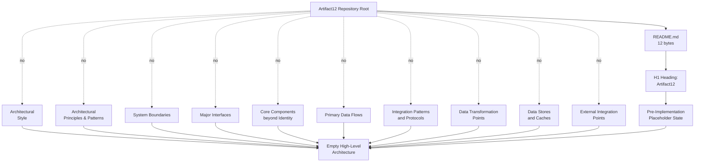

### 5.6.2 Component Interaction Absence Topology

The following diagram visualizes the verified topological state of the Component Details domain (Section 5.3). Each of the five component-detail dimensions required by the section prompt — purpose, technologies, interfaces, persistence, scaling — radiates from the repository root as a verified-absent edge, along with the absent inbound, outbound, and event-driven interaction edges that would otherwise connect components to each other and to external systems. All converge on a single "Empty Component Interaction Surface" terminus. This diagram simultaneously serves as the **detailed component interaction diagram** and the **sequence diagram for key flows** required by the section prompt, since both classes resolve to the same empty terminus under the verified pre-implementation state of the repository (no components beyond the Project Identity Declaration exist, per Section 1.2.2.2; no behavioral surface upon which interactions could occur, per Section 4.2.1.2).

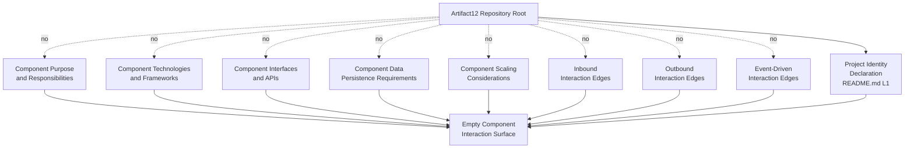

### 5.6.3 State Transition and Error Handling Absence Topology

The following diagram visualizes the verified topological state of the cross-cutting concerns related to state and error handling (Section 5.5). It subsumes both the **state transition diagram** required by the section prompt under Component Details and the **error handling flow diagram** required under Cross-Cutting Concerns, since both classes resolve to the same empty terminus under the verified pre-implementation state of the repository (no entity, aggregate, or state machine declared, per Section 4.4.1.1; no error states or recovery paths, per Section 4.4.2). The diagram explicitly mirrors the structure of Section 4.5.3 to maintain idiomatic consistency.

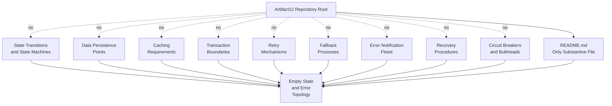

### 5.6.4 Technical Decisions and Cross-Cutting Concerns Absence Topology

The following diagram visualizes the verified topological state of the Technical Decisions domain (Section 5.4) and the residual Cross-Cutting Concerns dimensions not subsumed by Section 5.6.3 (specifically: monitoring, logging, authentication/authorization, performance/SLA, and disaster recovery). It serves as the **decision tree diagram** required by the section prompt under Technical Decisions and as the consolidation diagram for the remaining cross-cutting concerns. Every decision dimension and every cross-cutting concern resolves to the same empty terminus.

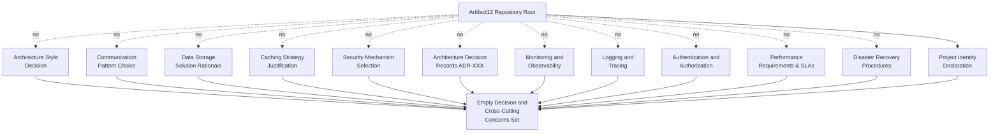

---

## 5.7 RESERVED ARCHITECTURE SCHEMAS

To support future population without restructuring the document, this section defines four reserved schemas — for components, integration points, architecture decision records, and cross-cutting concerns — that align with the reservation patterns established in Section 2.1.3 (Feature Metadata Schema), Section 2.2.2 (Requirement Metadata Schema), Section 3.5.3 (Third-Party Services Schema), Section 3.6.3 (Databases & Storage Schema), Section 3.7.3 (Development & Deployment Schema), and Sections 4.6.1 through 4.6.4 (Process Flowchart Schemas). Each schema is **not populated**; each is provided as a normative structure only and bears a "Reserved; awaiting [trigger]" status line.

### 5.7.1 Component Catalog Schema

| Schema Field | Format | Permissible Values |
|--------------|--------|--------------------|
| Component ID | `CMP-XXX` (zero-padded three-digit) | `CMP-001` through `CMP-999`; sequential |
| Component Name | Free text, title case | Service, module, library, package, or executable identifier |
| Component Category | Enumerated | UI, API, Service, Worker, Library, Data Store, Integration Adapter |
| Primary Responsibility | Free text | Bounded-context role, domain function |
| Parent Feature | `F-XXX` reference | Required; satisfies Constraint C-002 |
| Key Dependencies | List of `CMP-XXX` or external library identifiers | Authored upon first commit |
| Integration Points | List of `INT-XXX` references | References Section 5.7.2 |
| Evidence Anchor | File path | Required (Constraint C-001) |

**Reserved; awaiting first component definition commit (e.g., a source-code module with a public interface, a service manifest, or a deployable artifact specification).**

### 5.7.2 Integration Point Schema

| Schema Field | Format | Permissible Values |
|--------------|--------|--------------------|
| Integration ID | `INT-XXX` (zero-padded three-digit) | `INT-001` through `INT-999`; sequential |
| External System Name | Free text | Vendor / product identifier |
| Integration Type | Enumerated | Inbound, Outbound, Bidirectional |
| Data Exchange Pattern | Enumerated | Synchronous Request/Reply, Asynchronous Event, Batch ETL, Streaming, Webhook |
| Protocol / Format | Enumerated | HTTP/REST, gRPC, GraphQL, AMQP, MQTT, Kafka, JSON, Protobuf, Avro |
| SLA Requirements | Free text | Availability target, latency budget, throughput floor, error-rate ceiling |
| Authentication Method | Reference to auth scheme | References Section 5.7.4 (Cross-Cutting Concern: AuthN) |
| Evidence Anchor | File path | Required (Constraint C-001, C-003) |

**Reserved; awaiting first integration-point definition commit (e.g., an OpenAPI/Swagger specification, a gRPC `.proto` file, a GraphQL schema, an AsyncAPI event schema, or a webhook handler module).**

### 5.7.3 Architecture Decision Record (ADR) Schema

| Schema Field | Format | Permissible Values |
|--------------|--------|--------------------|
| ADR ID | `ADR-XXX` (zero-padded three-digit) | `ADR-001` through `ADR-999`; sequential |
| Title | Free text, title case | Descriptive label (e.g., "Adopt Document Store for Primary Persistence") |
| Status | Enumerated | Proposed, Accepted, Deprecated, Superseded |
| Context | Free text | Forces, constraints, and prior decisions framing the choice |
| Decision | Free text | Selected option and binding rationale |
| Alternatives Considered | Free text | Rejected options with rejection rationale |
| Consequences | Free text | Positive consequences, negative consequences, tradeoffs accepted |
| Related ADRs | List of `ADR-XXX` references | Supersedes / superseded-by / amends |
| Evidence Anchor | File path | Required (Constraint C-001, C-004) |

**Reserved; awaiting first architecture-decision commit (e.g., an explicit `docs/adr/ADR-001-*.md` file, a `decisions/` directory, or a comparable decision-record artifact). No ADR may be authored absent a manifest, configuration file, or source artifact that establishes the underlying selection (Constraint C-004).**

### 5.7.4 Cross-Cutting Concerns Schema

| Schema Field | Format | Permissible Values |
|--------------|--------|--------------------|
| Concern ID | `CCC-XXX` (zero-padded three-digit) | `CCC-001` through `CCC-999`; sequential |
| Concern Category | Enumerated | Monitoring, Logging, Tracing, Error Handling, AuthN, AuthZ, Performance/SLA, Disaster Recovery |
| Mechanism / Technology | Free text | Tool, library, or service identifier |
| Policy Specification | Free text | Threshold, target, rule, or runbook reference |
| Applied To | List of `CMP-XXX` references | Components governed by the concern |
| Owning Component | `CMP-XXX` reference | Component implementing or enforcing the concern |
| Evidence Anchor | File path | Required (Constraint C-001) |

**Reserved; awaiting first cross-cutting concern commit (e.g., an observability SDK dependency, a logger configuration, a retry-policy module, an auth-middleware configuration, an SLO specification, or a runbook artifact).**

---

## 5.8 ACTIVATION PATHWAY FOR ARCHITECTURE DOCUMENTATION

This section provides a normative procedural reference — not a commitment — describing the canonical sequence by which the System Architecture section would transition from its current empty state to a populated state. This subsection adopts the activation-pathway idiom established in Section 3.8.2 (Technology Stack Activation Pathway) and Section 4.7 (Process Flowchart Activation Pathway).

### 5.8.1 Activation Pathway Diagram

```mermaid
flowchart LR
    Current[Current State:<br/>Empty Architecture<br/>Inventory] --> Step1[Step 1:<br/>Feature Definition<br/>F-XXX Anchor]
    Step1 --> Step2[Step 2:<br/>Architecture Style<br/>ADR-XXX]
    Step2 --> Step3[Step 3:<br/>Component Definition<br/>CMP-XXX]
    Step3 --> Step4[Step 4:<br/>Integration Point<br/>INT-XXX]
    Step4 --> Step5[Step 5:<br/>Data Store and<br/>Cache Selection]
    Step5 --> Step6[Step 6:<br/>Cross-Cutting<br/>Concern CCC-XXX]
    Step6 --> Step7[Step 7:<br/>SLA and DR<br/>Specification]
    Step7 --> Populated[Populated Architecture<br/>Section]
```

### 5.8.2 Procedural Step Detail

Each step in the activation pathway corresponds to the introduction of one or more evidence anchors required by Constraints C-001 through C-004 to lift the verified-absence status of the corresponding subsection:

| Step | Triggering Artifact | Subsections Activated | Constraint Satisfied |
|------|---------------------|------------------------|----------------------|
| 1 | A feature requirement with `F-XXX-RQ-YYY` identifier in Section 2 | 5.2.2 (Core Components — establishes parent feature anchor); 5.3 (Component Details) | C-001; C-002 |
| 2 | An Architecture Decision Record (`ADR-XXX`) selecting an architectural style, framework, or pattern | 5.2.1 (System Overview); 5.4.1 (Architecture Style Decision); populates 5.7.3 schema | C-001; C-004 |
| 3 | A source-code module, service manifest, or deployable artifact specification | 5.2.2 (Core Components); 5.3 (Component Details); populates 5.7.1 schema | C-001; C-002 |
| 4 | An OpenAPI/Swagger document, gRPC `.proto`, GraphQL schema, AsyncAPI event schema, webhook handler, or SDK dependency | 5.2.4 (External Integration Points); populates 5.7.2 schema | C-001; C-003 |
| 5 | A database schema, migration script, ORM model, cache client configuration, or storage SDK dependency | 5.2.3 (Data Flow); 5.3.2.4 (Persistence Requirements); cross-links to Section 3.6 | C-001; C-004 |
| 6 | An observability SDK dependency, logger configuration, retry-policy module, auth-middleware configuration, or circuit-breaker specification | 5.5.1 (Cross-Cutting Concerns); populates 5.7.4 schema | C-001; C-003 |
| 7 | An SLA/SLO specification, performance-budget configuration, runbook, or disaster-recovery plan | 5.2.4.2 (SLA Requirements); 5.5.2.5 (Performance/SLA); 5.5.2.6 (Disaster Recovery) | C-001; C-004 |

### 5.8.3 Revision Trigger Conditions

Section 5 will be revised — and its reserved schemas populated, and its absence-topology diagrams replaced with populated architecture diagrams — when any of the following changes occur in the Artifact12 repository. The triggers are mapped to the specific subsections they would activate:

| Repository Change | Activated Subsection(s) | Lifecycle Action |
|-------------------|-------------------------|------------------|
| Introduction of an architecture-decision record (e.g., `docs/adr/ADR-001-*.md`) | 5.4.2; 5.4.3; 5.7.3 | Populate first ADR-XXX entry; convert decision-status table from "Not documented" to evidenced |
| Introduction of a source-code module with a public interface | 5.2.2; 5.3; 5.7.1 | Populate first CMP-XXX entry; convert component-status table |
| Introduction of an API contract (OpenAPI / GraphQL / gRPC / AsyncAPI) | 5.2.4; 5.7.2 | Populate first INT-XXX entry; convert external-integration table |
| Introduction of a database schema, migration, or ORM model | 5.2.3; 5.3.2.4; 5.4.3.3 | Populate data-flow narrative and persistence section; update data-storage rationale |
| Introduction of a cache client configuration | 5.2.3.4; 5.4.3.4 | Populate cache-strategy section |
| Introduction of an auth configuration (Auth0, OIDC client, JWT key reference) | 5.4.3.5; 5.5.2.4; 5.7.4 | Populate AuthN concern entry; convert auth status table |
| Introduction of an observability SDK dependency or configuration | 5.5.2.1; 5.7.4 | Populate Monitoring concern entry |
| Introduction of a logger configuration or log-shipping definition | 5.5.2.2; 5.7.4 | Populate Logging concern entry |
| Introduction of a retry-policy module, circuit-breaker specification, or exception-handler module | 5.5.2.3; 5.7.4 | Populate Error-Handling concern entry; cross-link to Section 4.6.4 |
| Introduction of an SLO specification or performance-budget file | 5.5.2.5; 5.7.4 | Populate Performance/SLA concern entry |
| Introduction of a runbook, rollback script, or disaster-recovery plan | 5.5.2.6; 5.7.4 | Populate Disaster Recovery concern entry |
| Introduction of a containerization or orchestration manifest | 5.2.1.1; 5.3.2.5 | Populate architecture style; populate scaling considerations |
| Introduction of an infrastructure-as-code template | 5.2.1.3; 5.2.4.1 | Populate system boundaries; populate cloud-integration entries |
| Any architecture-design decision recorded in any tracked artifact | Entire Section 5 | Re-evaluate every subsection; revise absence determinations |

Until any such change occurs, Section 5 remains in its current absence-documenting state, consistent with the methodology established in Section 1, preserved by Assumptions A-001 through A-003 (Section 2.6.1) and Constraints C-001 through C-004 (Section 2.6.2), reaffirmed by the empty-catalog rationales of Sections 2.1.4 and 3.1.1, and consistent with the process-flowchart absence aggregate determination of Section 4.8.

---

## 5.9 SECTION SUMMARY

### 5.9.1 Aggregate Determination

The aggregate state of Section 5 (System Architecture) is summarized below across each dimension required by the section prompt. Every row records a verified-absence determination rather than a fabricated entry:

| Architecture Dimension | State | Determining Evidence |
|------------------------|-------|----------------------|
| High-Level Architecture — System Overview (5.2.1) | No style, no principles, no boundaries, no major interfaces | Section 1.2.2.3; Section 1.3.2; Section 1.3.3 |
| High-Level Architecture — Core Components (5.2.2) | Single Project Identity Declaration; five required dimensions all "Not documented" | Section 1.2.2.2; Section 2.3.3 |
| High-Level Architecture — Data Flows (5.2.3) | No data flows, integration patterns, transformation points, or data stores | Section 1.3.2; Section 3.6.1; Section 4.2.2 |
| High-Level Architecture — External Integration Points (5.2.4) | All ten integration categories "Not documented" across all three integration dimensions | Section 1.2.1.3; Section 1.3.3.2; Section 3.5.1 |
| Component Details (5.3) | All five required component-detail dimensions "Not documented" | Section 1.2.2.1; Section 1.2.2.2; Section 3.6.1; Section 2.4.2 |
| Technical Decisions (5.4) | All five decision dimensions "Not documented"; no ADR exists | Section 1.2.2.3; Section 3.6.1; Section 3.5.1; Section 2.4.3 |
| Cross-Cutting Concerns (5.5) | All six required concerns "Not documented" | Section 3.5.1; Section 2.3.3; Section 4.4.2; Section 1.2.1.3; Section 2.4.2; Section 2.4.4 |
| Architecture Topology Diagrams (5.6) | Four absence-topology diagrams authored using the established idiom | Section 1.2.2; Section 2.3.1; Section 3.8.1; Section 4.5 |
| Reserved Schemas (5.7) | Four schemas reserved (CMP-XXX, INT-XXX, ADR-XXX, CCC-XXX), all "not populated" | Section 2.1.3; Section 3.5.3; Section 3.6.3; Section 4.6 |
| Activation Pathway (5.8) | Seven-step pathway diagram and revision-trigger table authored | Section 3.8.2 idiom; Section 4.7 idiom |

### 5.9.2 Relationship to Required Diagram Inventory

The section prompt enumerates six required Mermaid.js diagram classes across Component Details, Technical Decisions, and Cross-Cutting Concerns. The following table maps each required class to its treatment within this Section 5, demonstrating that every required class is addressed:

| Required Diagram Class (Section Prompt) | Treatment in Section 5 | Rationale |
|------------------------------------------|------------------------|-----------|
| Detailed component interaction diagrams | Component Interaction Absence Topology (Section 5.6.2) | No components beyond the Project Identity Declaration exist (Section 1.2.2.2); absence-topology is the only evidence-based treatment |
| State transition diagrams | Subsumed by State Transition and Error Handling Absence Topology (Section 5.6.3) | No entity, aggregate, or state machine has been declared (Section 4.4.1.1); single absence terminus covers both classes |
| Sequence diagrams for key flows | Subsumed by Component Interaction Absence Topology (Section 5.6.2) | No behavioral surface upon which sequences could occur (Section 4.2.1.2); single absence terminus covers both classes |
| Decision tree diagrams | Technical Decisions and Cross-Cutting Concerns Absence Topology (Section 5.6.4) | No technical decisions have been made (Section 1.2.2.3); absence-topology is the only evidence-based treatment |
| Architecture Decision Records (ADRs) | Reserved ADR Schema (Section 5.7.3) | No decisions to record; reserved schema awaits first ADR commit |
| Error handling flows | Subsumed by State Transition and Error Handling Absence Topology (Section 5.6.3) | No error states or recovery paths (Section 4.4.2); single absence terminus covers both classes |

In addition, the Activation Pathway Diagram (Section 5.8.1) provides a forward-looking procedural reference for how each required diagram class would be populated upon introduction of the corresponding evidence anchor.

### 5.9.3 Closing Position

The verified pre-implementation, placeholder state of the Artifact12 repository (Section 1.1.2) admits no system architecture that could be authored on an evidence basis. This Section 5 has documented that absence systematically: every required architectural dimension — high-level architecture (system overview, core components, data flows, external integration points), component details (purpose, technologies, interfaces, persistence, scaling), technical decisions (architecture style, communication patterns, data storage, caching, security), and cross-cutting concerns (monitoring, logging, error handling, AuthN/AuthZ, performance/SLA, disaster recovery) — has been mapped to its authoritative cross-reference and recorded as "Not documented" or depicted as an absence-topology diagram. Reserved schemas with stable identifier formats (`CMP-XXX`, `INT-XXX`, `ADR-XXX`, `CCC-XXX`) stand ready for population. The activation pathway (Section 5.8) defines the canonical sequence by which substantive architecture documentation would replace the current absence-documenting state, with each step bound to specific constraints (C-001 through C-004) it satisfies.

This closing position is consistent with the aggregate posture recorded in Section 1.3.4, Section 2.7, Section 3.9, and Section 4.8.3: the project is in a pre-implementation, placeholder state whose only positively-evidenced in-scope element is the project identity declaration; all other application features, integrations, UIs, technology selections, process flows, and — by direct extension established here — all architectural components, integration points, technical decisions, and cross-cutting concerns are out-of-scope until substantive artifacts are introduced.

---

## 5.10 REFERENCES

### 5.10.1 Files Examined

- `README.md` — The repository's only substantive file (12 bytes), containing the single H1 heading "Artifact12"; the basis for the sole positively-evidenced architectural element (Section 5.2.2.1: the Project Identity Declaration).
- `blitzy/documentation/Agent Action Plan.md` — Establishes the preserve-state baseline interpretation, documents the empty rules and attachments channels, and articulates the preservation (R-AAP-01) and non-expansion (R-AAP-02) requirements referenced throughout Section 5.1.3 and Section 5.1.3.1.
- `blitzy/documentation/Input Prompt.md` — A 55-line placeholder containing only the word "custom" repeated 28 times; confirms the absence of substantive architectural requirements (Assumption A-002 cited in Section 5.1.3).
- `blitzy/documentation/Technical Specifications.md` — The master Technical Specification (this document) whose Section 5 is authored here; cross-references Sections 1 through 4 as the authoritative basis for all absence determinations.

### 5.10.2 Folders Explored

- `` (repository root) — Verified to contain exactly one substantive file (`README.md`) and one subdirectory (`blitzy/`); no source folders, configuration folders, deployment folders, or CI/CD folders exist.
- `blitzy/` — Contains only the `documentation/` subdirectory; no application code, manifests, scripts, configuration assets, tests, or deployment artifacts exist at this level.
- `blitzy/documentation/` — Contains exactly three documentation Markdown files; no executable source code, package manifests, build scripts, test files, configuration assets, infrastructure definitions, or runtime modules exist at this level.

### 5.10.3 Technical Specification Sections Cross-Referenced

- **Section 1.1 (Executive Summary)** — Subsections 1.1.2 (Repository State Disclosure), 1.1.4 (Key Stakeholders and Users), 1.1.6 (Summary of Verifiable Facts) provide the pre-implementation framing inherited by Section 5.1.
- **Section 1.2 (System Overview)** — Subsections 1.2.1.3 (Integration with Existing Enterprise Landscape), 1.2.2.1 (Primary System Capabilities), 1.2.2.2 (Major System Components), 1.2.2.3 (Core Technical Approach), 1.2.3.3 (Key Performance Indicators) provide the foundational absence determinations cited throughout Sections 5.2, 5.3, and 5.5.
- **Section 1.3 (Scope)** — Subsections 1.3.1.2 (Primary User Workflows), 1.3.1.3 (Essential Integrations), 1.3.1.4 (Key Technical Requirements), 1.3.2 (Implementation Boundaries), 1.3.3.2 (Integration Points Not Covered), 1.3.4 (Scope Summary) provide the scope baseline cited in Sections 5.2.1, 5.2.4.3, and 5.9.3.
- **Section 2.1 (Feature Catalog)** — Subsection 2.1.1 (Catalog Population Status) provides the empty-feature-catalog premise referenced by Constraint C-002 throughout Section 5.
- **Section 2.3 (Feature Relationships)** — Subsections 2.3.2 (Integration Points Status) and 2.3.3 (Shared Components and Common Services) provide the integration-point and cross-cutting-concern absence determinations cited in Sections 5.2.4 and 5.5.
- **Section 2.4 (Implementation Considerations)** — Subsections 2.4.1 (Technical Constraints), 2.4.2 (Performance and Scalability Considerations), 2.4.3 (Security Implications), 2.4.4 (Maintenance Requirements) provide the implementation-consideration absences cited throughout Sections 5.3, 5.4, and 5.5.
- **Section 2.6 (Assumptions and Constraints)** — Subsections 2.6.1 (Documented Assumptions A-001 through A-003) and 2.6.2 (Repository State Constraints C-001 through C-004) provide the binding guardrails cited in Section 5.1.3.
- **Section 3.1 (Technology Stack Status and Methodological Framing)** — Subsection 3.1.3 (Treatment of the User-Provided Default Stack) provides the default-stack treatment cited in Section 5.1.3.1.
- **Section 3.3 (Frameworks & Libraries)** — Cited in Section 5.3 for the absence of framework manifests and configurations.
- **Section 3.4 (Open Source Dependencies)** — Cited in Section 5.3 for the absence of declared dependencies.
- **Section 3.5 (Third-Party Services)** — Subsections 3.5.1 (Third-Party Service Inventory), 3.5.2.2 (External APIs and Integrations), 3.5.2.3 (Authentication Services), 3.5.2.4 (Monitoring Tools), 3.5.2.5 (Cloud Services) provide the third-party absence determinations cited in Sections 5.2.4, 5.4.3.5, and 5.5.
- **Section 3.6 (Databases & Storage)** — Subsections 3.6.1 (Database and Storage Inventory), 3.6.2.2 (Primary and Secondary Databases), 3.6.2.3 (Data Persistence Strategies), 3.6.2.4 (Caching Solutions) provide the storage absence determinations cited in Sections 5.2.3.4, 5.3.2.4, 5.4.3.3, and 5.4.3.4.
- **Section 3.7 (Development & Deployment)** — Subsection 3.7.1 (Development and Deployment Inventory) and subsections 3.7.2.4 (Containerization), 3.7.2.5 (CI/CD Requirements), 3.7.2.6 (Infrastructure as Code) provide the deployment absence determinations cited in Sections 5.3.2.5 and 5.5.2.6.
- **Section 3.8 (Technology Stack Topology and Future Direction)** — Subsection 3.8.1 establishes the verified-absence-topology Mermaid idiom adopted in Section 5.6; Subsection 3.8.2 establishes the activation-pathway idiom adopted in Section 5.8; Subsection 3.8.3 records the default technology stack as reserved future-direction reference.
- **Section 4.2 (System Workflows Inventory)** — Subsections 4.2.1.2 (System Interaction Determination), 4.2.2.1 (Data Flow Determination), 4.2.2.2 (API Interaction Determination), 4.2.2.3 (Event Processing Determination) provide the workflow and data-flow absence determinations cited in Sections 5.2.3 and 5.6.2.
- **Section 4.4 (Technical Implementation Workflow Elements)** — Subsections 4.4.1.1 (State Transition Determination), 4.4.1.2 (Persistence and Caching Determination), 4.4.2 (Error Handling Elements), 4.4.2.1 (Retry and Fallback Determination), 4.4.2.2 (Error Notification Determination), 4.4.2.3 (Recovery Procedure Determination) provide the state-management and error-handling absence determinations cited in Sections 5.5 and 5.6.3.
- **Section 4.5 (Process Topology Diagrams)** — Establishes the canonical absence-topology diagram structure (solid edges for evidence, dotted "no" edges for absence, convergence terminus) replicated in Section 5.6.
- **Section 4.6 (Reserved Process Flowchart Schemas)** — Provides the reserved-schema idiom (`P-XXX`, `W-XXX`, state-transition rows, error-handling rows) replicated for Section 5.7 (`CMP-XXX`, `INT-XXX`, `ADR-XXX`, `CCC-XXX`).
- **Section 4.7 (Activation Pathway for Process Documentation)** — Provides the seven-step activation-pathway diagram and revision-trigger table idioms replicated in Section 5.8.
- **Section 4.8 (Section Summary)** — Subsection 4.8.2 (Relationship to Required Diagram Inventory) provides the diagram-mapping idiom replicated in Section 5.9.2.

### 5.10.4 Repository-Wide Verifications Inherited

- File-extension search across source-code languages (`.py`, `.js`, `.ts`, `.tsx`, `.jsx`, `.java`, `.go`, `.rb`, `.cs`, `.rs`, `.php`, `.swift`, `.kt`, `.m`, `.mm`, `.html`, `.css`, `.sql`, `.scala`, `.sh`, `.ps1`, `.r`) — zero matches; basis for Sections 5.2.1.1, 5.2.3.3, 5.3.2.2, and 5.5.2.3.
- Dependency-manifest search (`package.json`, `package-lock.json`, `yarn.lock`, `pnpm-lock.yaml`, `requirements.txt`, `pyproject.toml`, `setup.py`, `Pipfile`, `poetry.lock`, `pom.xml`, `build.gradle`, `Cargo.toml`, `go.mod`, `Gemfile`, `composer.json`, `*.csproj`, `Podfile`, `Package.swift`) — zero matches; basis for Sections 5.3.2.2, 5.3.2.3, and 5.4.3.3.
- Configuration-file search (`*.json`, `*.yaml`, `*.yml`, `*.toml`, `*.xml`, `.env*`, `.*rc`, `*.config.*`) — zero matches; basis for Sections 5.2.3.2 and 5.4.3.4.
- Build / CI-CD / IaC search (`Dockerfile`, `docker-compose*`, `.dockerignore`, Kubernetes manifests, Helm charts, Kustomize overlays, `*.tf`, `*.bicep`, CloudFormation, Pulumi, `.github/workflows/`, `.gitlab-ci.yml`, `Jenkinsfile`, `azure-pipelines.yml`, `.circleci/`, `Makefile`, `tox.ini`, Bazel `BUILD`) — zero matches; basis for Sections 5.3.2.5, 5.4.3.1, and 5.5.2.6.
- Test-artifact search (`tests/**`, `__tests__/`, `spec/`, `*test*`, `*spec*`) — zero matches; basis for the absence of test-related component definitions in Section 5.3.
- Database / storage-schema search (`.sql`, Prisma `schema.prisma`, SQLAlchemy models, Mongoose schemas, Liquibase changelogs, Flyway migrations, Entity Framework migrations, Sequelize migrations) — zero matches; basis for Sections 5.2.3.3, 5.2.3.4, 5.3.2.4, and 5.4.3.3.
- Third-party-service search (OpenAPI specifications, gRPC `.proto` files, GraphQL schemas, AsyncAPI specifications, cloud-provider SDK declarations, auth-provider configurations, observability tool configurations) — zero matches; basis for Sections 5.2.4, 5.4.3.5, and 5.5.2.

# 6. SYSTEM COMPONENTS DESIGN

## 6.1 Core Services Architecture

### 6.1.1 Applicability Determination

**Core Services Architecture is not applicable for this system.**

The Artifact12 system does not require microservices, distributed architecture, or distinct service components in its current revision. This determination is invoked under the section prompt's explicit conditional clause, which authorizes the not-applicable disposition when the system does not require microservices, distributed architecture, or distinct service components, and requires that the disposition be accompanied by an explanation of why. The remainder of this section provides that explanation, structured as an evidence-anchored catalog that mirrors the methodology of Section 5 (System Architecture) and inherits its binding guardrails.

#### 6.1.1.1 Grounding Conditions

The not-applicable disposition rests on four converging conditions, each independently sufficient and jointly determinative:

| Condition | Authoritative Reference | Determinative Effect |
|-----------|--------------------------|----------------------|
| Pre-implementation, placeholder repository state | Section 1.1.2; Section 1.2.2.2 | No service can exist in a repository whose only substantive artifact is a 12-byte `README.md` containing only the H1 heading "Artifact12" |
| No core technical approach committed | Section 1.2.2.3 | No programming language, runtime, framework, platform, architectural pattern, or deployment model has been chosen in any tracked file; service composition requires at least one of these |
| Single non-runtime architectural element | Section 5.2.2.1 | The Project Identity Declaration is explicitly characterized as "not a runtime component, not a service, and not an executable artifact" |
| Binding constraints forbid fabrication | Section 2.6.2 (C-001 through C-004); Agent Action Plan (R-AAP-02) | No service, integration point, shared component, or technology selection may be introduced absent a tracked-file evidence anchor |

#### 6.1.1.2 Inheritance of Section 5 Determinations

This Section 6.1 inherits, by direct extension, the verified-absence findings of Section 5 (System Architecture). Specifically, the following Section 5 determinations are determinative for the not-applicable disposition recorded here:

- **Section 5.2.1.1** confirms that the repository declares no architectural style — including microservices, service-oriented architecture, event-driven architecture, or any other style that would presuppose distinct service components.
- **Section 5.2.2** records that the only positively-evidenced architectural element is the Project Identity Declaration, which is neither a runtime component nor a service.
- **Section 5.2.3.1** confirms that no primary data flow can be described because there are no components between which data could flow.
- **Section 5.2.4.1** records every external integration category — external APIs, identity providers, monitoring services, logging services, cloud bindings, payment services, notification gateways, analytics platforms, message brokers, and data-store integrations — as "Not documented."
- **Section 5.3.1** records all five required component-detail dimensions (purpose, technologies, interfaces, persistence, scaling) as "Not documented."
- **Section 5.4.3.2** records that no communication pattern choice has been made; no synchronous request/reply contract, no asynchronous event schema, no message-broker topology, and no orchestration/choreography framework has been bound to the project.
- **Section 5.5.1** records all six cross-cutting concerns (monitoring, logging, error handling, AuthN/AuthZ, performance/SLA, disaster recovery) as "Not documented."

#### 6.1.1.3 Disposition of the User-Context Default Stack

A user-context default technology stack reference — encompassing AWS, Docker, Terraform, GitHub Actions, Python, Flask, Auth0, MongoDB, Langchain, React with TypeScript, TailwindCSS, React Native with TypeScript, Swift, Kotlin, Objective-C, and ElectronJS — is acknowledged in Section 3.1.3 strictly as a **reserved future-direction reference**. Per Section 5.1.3.1, this Technical Specification does not author any cloud-native architecture pattern based on AWS service composition, any container-based deployment topology based on Docker or Kubernetes, any infrastructure-as-code stance based on Terraform, any CI/CD-driven release pipeline based on GitHub Actions, any monolithic-Flask or microservice-Flask web architecture, any document-store data architecture based on MongoDB, or any OAuth/OIDC identity architecture based on Auth0. Each such commitment would imply a binding selection that Constraint C-004 prohibits in the absence of the corresponding manifest, configuration, or source artifact. The not-applicable disposition of Section 6.1 is therefore consistent with — and reinforced by — the reserved treatment of the default stack.

---

### 6.1.2 Service Components — Verified-Absence Catalog

The section prompt enumerates six required Service Components sub-areas. Each is addressed below as a verified-absence determination with its authoritative cross-reference.

#### 6.1.2.1 Service Components Status Matrix

| Sub-Area | Status | Authoritative Cross-Reference |
|----------|--------|--------------------------------|
| Service boundaries and responsibilities | Not applicable — no services exist | Section 5.2.2.1; Section 5.3.2.1 |
| Inter-service communication patterns | Not applicable — no communication pattern committed | Section 4.2.2.2; Section 5.4.3.2 |
| Service discovery mechanisms | Not applicable — no service registry or orchestration | Section 3.7.1 |
| Load balancing strategy | Not applicable — no orchestration manifest | Section 3.7.1; Section 5.3.2.5 |
| Circuit breaker patterns | Not applicable — no error-handling surface | Section 4.4.2; Section 5.5.2.3 |
| Retry and fallback mechanisms | Not applicable — verified absent | Section 4.4.2.1 |

#### 6.1.2.2 Service Boundaries and Responsibilities — Determination

No service boundary and no service responsibility can be authored because no service component exists. Section 1.2.2.2 records exactly one substantive component artifact (`README.md`, 12 bytes), and Section 5.2.2.1 explicitly classifies that artifact as not a runtime component, not a service, and not an executable artifact. Section 1.2.2.1 confirms that no primary system capabilities — user-facing features, backend services, data processing, or integration capabilities — are declared in the repository. A service boundary presupposes a bounded context, an owned data store, an exposed contract, and a deployable unit; none of the four has any evidence anchor in the repository.

#### 6.1.2.3 Inter-Service Communication Patterns — Determination

No inter-service communication pattern can be authored. Section 4.2.2.2 confirms that the repository contains no API specification artifact — no OpenAPI/Swagger document, no gRPC `.proto` definition, no GraphQL schema, and no SDK dependency. Section 4.2.2.3 confirms that the repository contains no event-processing artifact — no message broker, no event schema, no AsyncAPI specification, no Protobuf event contract, and no notification SDK dependency. Section 5.4.3.2 records that no communication pattern choice (synchronous request/reply versus asynchronous event-driven, orchestration versus choreography) has been made. Because there are no services to communicate, the question of inter-service communication is moot at the present revision.

#### 6.1.2.4 Service Discovery Mechanisms — Determination

No service discovery mechanism applies. Section 3.7.1 records all nine development-and-deployment categories — developer environment, build system, containerization, container orchestration, infrastructure-as-code, CI/CD definitions, secrets management, quality gates, and test infrastructure — as "Not committed." No service registry (Consul, etcd, Eureka, Zookeeper, AWS Cloud Map), no service-mesh control plane (Istio, Linkerd, Consul Connect), no DNS-based discovery (Kubernetes DNS, CoreDNS service records), and no client-side discovery library has been bound to the repository. Service discovery presupposes a registry and at least two services; neither prerequisite is satisfied.

#### 6.1.2.5 Load Balancing Strategy — Determination

No load balancing strategy applies. Section 3.7.1 records the absence of container-orchestration manifests (Kubernetes, Helm, Kustomize), infrastructure-as-code templates (Terraform, Bicep, CloudFormation, Pulumi), and CI/CD definitions that would otherwise carry replica-count, autoscaling, ingress-controller, or load-balancer declarations. Section 5.3.2.5 confirms that no component-level scaling consideration — and therefore no load-distribution policy — can be authored on an evidence basis. No Layer-4 (TCP) balancer, no Layer-7 (HTTP) balancer, no client-side load-balancing library, no consistent-hashing strategy, and no traffic-shaping policy has been declared.

#### 6.1.2.6 Circuit Breaker Patterns — Determination

No circuit breaker pattern applies. Section 4.4.2 records all four error-handling elements (retry mechanisms, fallback processes, error notification flows, recovery procedures) as "Not documented." Section 5.5.2.3 records that no exception taxonomy, no error-code registry, no circuit-breaker threshold, and no compensating-action policy has been authored. A circuit breaker presupposes both an executable failure surface — which Section 1.2.2.3 verifies does not exist (zero source files across twenty-two language extensions) — and a redundancy topology to which a tripped breaker could route. Neither prerequisite exists.

#### 6.1.2.7 Retry and Fallback Mechanisms — Determination

No retry mechanism and no fallback process can be authored. Section 4.4.2.1 explicitly states that no retry mechanism and no fallback process can be authored because no source code exists in which to embed a retry policy and no alternative provider exists to which a fallback could route. Section 3.5.1 records every third-party service category — external APIs, identity providers, observability services, logging/telemetry, cloud bindings, payment processors, notification gateways, and analytics platforms — as "Not committed," and therefore no alternative provider exists for fallback routing. No exponential-backoff policy, no retry budget, no idempotency-key convention, no degraded-mode path, and no bulkhead isolation has been declared.

---

### 6.1.3 Scalability Design — Verified-Absence Catalog

The section prompt enumerates five required Scalability Design sub-areas. Each is addressed below as a verified-absence determination with its authoritative cross-reference.

#### 6.1.3.1 Scalability Design Status Matrix

| Sub-Area | Status | Authoritative Cross-Reference |
|----------|--------|--------------------------------|
| Horizontal/vertical scaling approach | Not applicable — no scaling strategy documented | Section 2.4.2; Section 5.3.2.5 |
| Auto-scaling triggers and rules | Not applicable — no orchestration | Section 3.7.1 |
| Resource allocation strategy | Not applicable — no resource budgets | Section 2.4.2 |
| Performance optimization techniques | Not applicable — no code to optimize | Section 1.2.2.3; Section 2.4.2 |
| Capacity planning guidelines | Not applicable — no KPIs defined | Section 1.2.3.3; Section 2.4.2 |

#### 6.1.3.2 Horizontal/Vertical Scaling Approach — Determination

No horizontal or vertical scaling approach can be authored. Section 2.4.2 records the implementation dimension "Scalability considerations" — encompassing horizontal/vertical scaling strategy and capacity model — as "Not documented." Section 5.3.2.5 confirms that no component-level scaling consideration can be authored because Section 1.2.3.3 records that no Key Performance Indicators have been defined and Section 3.7.1 records the absence of container-orchestration manifests (Kubernetes, Helm, Kustomize) that would otherwise carry replica-count, autoscaling, and resource-budget declarations. No replica-set sizing, no stateless-versus-stateful classification, no sharding strategy, no read-replica topology, no vertical-CPU-or-memory uplift plan, and no node-pool stratification has been declared.

#### 6.1.3.3 Auto-Scaling Triggers and Rules — Determination

No auto-scaling trigger and no auto-scaling rule can be authored. Section 3.7.1 records the absence of every artifact category that would carry auto-scaling declarations: no Kubernetes Horizontal Pod Autoscaler (HPA) or Vertical Pod Autoscaler (VPA) manifest, no AWS Auto Scaling Group configuration, no Azure VM Scale Set definition, no GCP Managed Instance Group specification, no serverless concurrency-control configuration, and no event-driven scaling policy (KEDA, Knative). Section 1.2.3.3 records that no Technical KPI (availability, latency, throughput, error rate) has been defined, and Section 2.4.2 records the implementation dimension "Performance requirements" as "Not documented" — foreclosing the metric basis on which any scaling trigger would be authored.

#### 6.1.3.4 Resource Allocation Strategy — Determination

No resource allocation strategy can be authored. Section 2.4.2 records the implementation dimension "Resource utilization" — encompassing CPU, memory, network, and storage budgets — as "Not documented." No CPU-request or CPU-limit specification, no memory-request or memory-limit specification, no network-bandwidth budget, no persistent-volume claim, no quality-of-service class (Guaranteed, Burstable, BestEffort), no resource quota, and no LimitRange policy has been declared in any tracked artifact. The absence of container or orchestration manifests in Section 3.7.1 forecloses any resource declaration that would normally be carried by such manifests.

#### 6.1.3.5 Performance Optimization Techniques — Determination

No performance optimization technique can be authored because no source code exists to optimize. Section 1.2.2.3 verified zero source files across twenty-two language extensions, foreclosing all conventional optimization opportunities — algorithmic complexity tuning, data-structure selection, query optimization, caching introduction, concurrency parallelization, vectorization, JIT compilation tuning, memory-pool allocation, lazy initialization, and connection pooling. Section 5.4.3.4 confirms that no caching strategy has been justified (no TTL policy, no eviction policy, no cache warming strategy, no cache-coherence rule), and Section 5.2.3.3 confirms that no data transformation point has been authored. Performance optimization presupposes a measurable baseline; Section 1.2.3.3 records that no Technical KPI baseline exists.

#### 6.1.3.6 Capacity Planning Guidelines — Determination

No capacity planning guideline can be authored. Section 2.4.2 records the implementation dimension "Capacity planning" — encompassing concurrent users, data volume, and growth model — as "Not documented." Section 1.2.3.3 records that no Business KPI (revenue, adoption, retention, NPS) and no Technical KPI (availability, latency, throughput, error rate) has been defined; capacity planning presupposes both a current-state utilization baseline and a forward-looking growth projection, neither of which has any evidence anchor. No peak-traffic forecast, no seasonality model, no data-volume growth curve, no concurrent-session ceiling, and no headroom factor has been declared.

---

### 6.1.4 Resilience Patterns — Verified-Absence Catalog

The section prompt enumerates five required Resilience Patterns sub-areas. Each is addressed below as a verified-absence determination with its authoritative cross-reference.

#### 6.1.4.1 Resilience Patterns Status Matrix

| Sub-Area | Status | Authoritative Cross-Reference |
|----------|--------|--------------------------------|
| Fault tolerance mechanisms | Not applicable — no failure surface | Section 4.4.2; Section 5.5.2.3 |
| Disaster recovery procedures | Not applicable — no DR artifacts | Section 4.4.2.3; Section 5.5.2.6 |
| Data redundancy approach | Not applicable — no data stores | Section 3.6.1; Section 5.2.3.4 |
| Failover configurations | Not applicable — no failover topology | Section 5.5.2.6 |
| Service degradation policies | Not applicable — no services to degrade | Section 5.2.2; Section 5.5.2.3 |

#### 6.1.4.2 Fault Tolerance Mechanisms — Determination

No fault tolerance mechanism can be authored. Section 4.4.2 records all four required error-handling elements — retry mechanisms, fallback processes, error notification flows, recovery procedures — as "Not documented." Section 5.5.2.3 records that no error handling pattern has been authored, with no exception taxonomy, no error-code registry, no circuit-breaker threshold, and no compensating-action policy declared. Fault tolerance presupposes (a) an executable surface upon which faults could occur, (b) a detection signal, (c) an isolation mechanism, and (d) a remediation path; the absence of source code (Section 1.2.2.3) forecloses (a), and the absence of observability tooling (Section 3.5.2.4) forecloses (b).

#### 6.1.4.3 Disaster Recovery Procedures — Determination

No disaster recovery procedure can be authored. Section 5.5.2.6 records that no RTO/RPO target, no failover topology, no backup retention schedule, no restore drill cadence, and no business-continuity plan exists. Section 4.4.2.3 confirms that the repository contains no runbook, no rollback script, no disaster-recovery plan, no backup or restore policy, and no maintenance directive beyond the documentation-revision discipline recorded in Section 2.4.4. Section 3.6.2.3 records backup/restore policy as undocumented alongside consistency model, durability guarantees, replication topology, and retention schedule. Disaster recovery presupposes both an operational substrate (deployment target, environment, secret store) and a documented operational discipline; neither has any evidence anchor.

#### 6.1.4.4 Data Redundancy Approach — Determination

No data redundancy approach can be authored. Section 3.6.1 records all seven storage categories — primary database, secondary database, caching solution, object/blob storage, search engine, message broker/queue, and file-system persistence — as "Not committed." Section 5.2.3.4 confirms that no key data store and no cache layer is committed in the repository. No replication topology (primary-replica, multi-primary, multi-region, geo-replicated), no replication mode (synchronous, asynchronous, semi-synchronous), no quorum policy, no Erasure-Coding scheme, no RAID configuration, no cross-region backup destination, and no point-in-time-recovery configuration has been declared. Data redundancy presupposes the existence of data and a storage substrate; neither exists.

#### 6.1.4.5 Failover Configurations — Determination

No failover configuration can be authored. Section 5.5.2.6 records that no failover topology exists. Section 3.7.1 records the absence of container orchestration, infrastructure-as-code templates, and CI/CD definitions that would carry failover-related declarations such as active-passive zone pairs, active-active multi-region routing, DNS-based traffic shifting (Route 53 health checks, weighted records), global load balancers (AWS Global Accelerator, GCP Cloud Load Balancing), database failover groups, or read-replica promotion policies. No primary/standby designation, no failover trigger condition, no failover automation pipeline, and no manual-failover runbook has been declared.

#### 6.1.4.6 Service Degradation Policies — Determination

No service degradation policy can be authored because no services exist to degrade. Section 5.2.2 records that the only positively-evidenced architectural element is the Project Identity Declaration, which is not a runtime component, not a service, and not an executable artifact. Section 5.5.2.3 confirms that no error handling pattern, no circuit-breaker threshold, and no compensating-action policy has been authored. No graceful-degradation path (feature flagging, read-only mode, cached-response fallback, static-content failover), no quality-of-service tier (premium, standard, best-effort), no rate-limit policy, no shedding strategy, and no priority queue has been declared. Degradation presupposes both a normal-operation baseline and a defined reduction profile; the absence of services and KPIs (Sections 5.2.2 and 1.2.3.3) forecloses both.

---

### 6.1.5 Required Diagram Treatments — Absence Topology

The section prompt requires three Mermaid.js diagram classes — service interaction diagrams, scalability architecture, and resilience pattern implementations. Each class is addressed below as an **absence-topology diagram** in accordance with the established idiom of Section 5.6: solid edges denote evidenced presence, dotted edges labeled "no" denote verified absence, and a convergence node at the bottom collects all absence findings into a single empty terminus. These diagrams do not author content beyond what is positively evidenced; they visualize the absence-documenting state itself.

#### 6.1.5.1 Service Interaction Absence Topology

The following diagram visualizes the verified topological state of the Service Components dimension (Section 6.1.2). The single positively-evidenced path traces from the repository root to the Project Identity Declaration. Every Service Components sub-area required by the section prompt — service boundaries, service responsibilities, inter-service communication, service discovery, load balancing, circuit breakers, retry mechanisms, and fallback processes — radiates from the repository root as a verified-absent edge and converges on a single "Empty Service Interaction Surface" terminus.

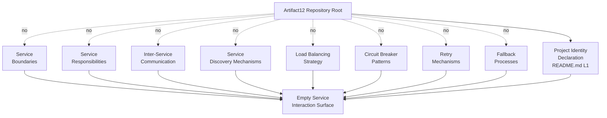

#### 6.1.5.2 Scalability Architecture Absence Topology

The following diagram visualizes the verified topological state of the Scalability Design dimension (Section 6.1.3). Every Scalability Design sub-area required by the section prompt — horizontal scaling, vertical scaling, auto-scaling triggers, resource allocation, performance optimization, and capacity planning — radiates from the repository root as a verified-absent edge, alongside two foundational prerequisites that are also verified-absent: orchestration manifests (Section 3.7.1) and performance KPIs/SLOs (Section 1.2.3.3). All converge on a single "Empty Scalability Architecture" terminus.

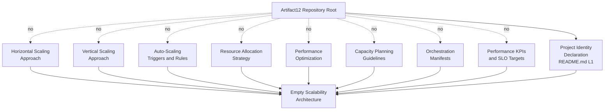

#### 6.1.5.3 Resilience Pattern Absence Topology

The following diagram visualizes the verified topological state of the Resilience Patterns dimension (Section 6.1.4). Every Resilience Patterns sub-area required by the section prompt — fault tolerance, disaster recovery, data redundancy, failover configurations, and service degradation — radiates from the repository root as a verified-absent edge, alongside three foundational prerequisites that are also verified-absent: RTO/RPO targets (Section 5.5.2.6), backup/restore policy (Section 3.6.2.3), and operational runbooks (Section 4.4.2.3). All converge on a single "Empty Resilience Pattern Surface" terminus.

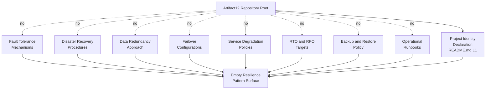

---

### 6.1.6 Activation Pathway for Core Services Architecture

This subsection records — without committing — the canonical sequence by which the present "not applicable" disposition would transition to a populated Core Services Architecture. It inherits the seven-step activation pathway defined in Section 5.8 and binds each step to the Core Services Architecture sub-areas it would activate.

#### 6.1.6.1 Activation Pathway Diagram

```mermaid
flowchart LR
    Current[Current State:<br/>Core Services Arch<br/>Not Applicable] --> S1[Step 1:<br/>Feature Definition<br/>F-XXX in Section 2]
    S1 --> S2[Step 2:<br/>Architecture Style<br/>Decision ADR-XXX]
    S2 --> S3[Step 3:<br/>Component Definition<br/>CMP-XXX]
    S3 --> S4[Step 4:<br/>Integration Point<br/>INT-XXX]
    S4 --> S5[Step 5:<br/>Data Store and<br/>Cache Selection]
    S5 --> S6[Step 6:<br/>Cross-Cutting<br/>Concern CCC-XXX]
    S6 --> S7[Step 7:<br/>SLA and DR<br/>Specification]
    S7 --> Populated[Populated Core<br/>Services Architecture]
```

#### 6.1.6.2 Sub-Area Activation Mapping

The following table maps each step in the activation pathway to the Core Services Architecture sub-areas it would unlock:

| Activation Step | Sub-Areas Unlocked | Constraint Satisfied |
|------------------|---------------------|----------------------|
| Step 2: Architecture Style Decision (ADR-XXX) | Service boundaries (6.1.2.2); horizontal/vertical scaling (6.1.3.2) | C-001; C-004 |
| Step 3: Component Definition (CMP-XXX) | Service responsibilities (6.1.2.2); fault tolerance mechanisms (6.1.4.2) | C-001; C-002 |
| Step 4: Integration Point (INT-XXX) | Inter-service communication (6.1.2.3); service discovery (6.1.2.4) | C-001; C-003 |
| Step 5: Data Store and Cache Selection | Data redundancy approach (6.1.4.4) | C-001; C-004 |
| Step 6: Cross-Cutting Concern (CCC-XXX) | Circuit breakers (6.1.2.6); retry/fallback (6.1.2.7); service degradation (6.1.4.6) | C-001; C-003 |
| Step 7: SLA and DR Specification | Auto-scaling triggers (6.1.3.3); capacity planning (6.1.3.6); DR procedures (6.1.4.3); failover (6.1.4.5) | C-001; C-004 |

#### 6.1.6.3 Revision Trigger Conditions

This Section 6.1 will be revised — and its "not applicable" disposition replaced with substantive Core Services Architecture content — when any of the following changes occur in the Artifact12 repository:

| Repository Change | Sub-Area Activated | Lifecycle Action |
|-------------------|--------------------|--------------------|
| Introduction of two or more source modules with distinct deployable boundaries | 6.1.2.2 (Service Boundaries and Responsibilities) | Reclassify "not applicable" to populated; author boundary catalog |
| Introduction of an API contract (OpenAPI, gRPC `.proto`, GraphQL, AsyncAPI) | 6.1.2.3 (Inter-Service Communication Patterns) | Author communication pattern table; cross-link to INT-XXX schema in Section 5.7.2 |
| Introduction of a container orchestration manifest (Kubernetes, Helm, Kustomize) | 6.1.2.4 (Service Discovery); 6.1.2.5 (Load Balancing); 6.1.3.2 (Scaling Approach); 6.1.3.3 (Auto-Scaling) | Populate discovery/balancing/scaling sub-sections; cross-link to Section 3.7.1 |
| Introduction of a circuit-breaker library or middleware specification | 6.1.2.6 (Circuit Breaker Patterns); 6.1.4.6 (Service Degradation) | Populate resilience sub-sections; cross-link to CCC-XXX schema in Section 5.7.4 |
| Introduction of a retry-policy module or idempotency-key convention | 6.1.2.7 (Retry and Fallback Mechanisms) | Populate retry/fallback sub-section |
| Introduction of an SLO/SLI specification or performance-budget file | 6.1.3.3 (Auto-Scaling Triggers); 6.1.3.6 (Capacity Planning) | Populate scalability sub-sections; cross-link to Section 5.5.2.5 |
| Introduction of a runbook, rollback script, or disaster-recovery plan | 6.1.4.3 (Disaster Recovery); 6.1.4.5 (Failover) | Populate resilience sub-sections; cross-link to Section 5.5.2.6 |
| Introduction of a database schema with replication configuration | 6.1.4.4 (Data Redundancy) | Populate redundancy sub-section; cross-link to Section 5.2.3.4 |

Until any such change occurs, this Section 6.1 remains in its "not applicable" disposition, consistent with the pre-implementation baseline established in Section 1.1.2 and preserved by Assumptions A-001 through A-003 and Constraints C-001 through C-004 (Section 2.6).

---

### 6.1.7 Section Summary

The aggregate determination of Section 6.1 is that **Core Services Architecture is not applicable to the Artifact12 system in its current revision**. Every sub-area enumerated by the section prompt — across Service Components (six sub-areas), Scalability Design (five sub-areas), and Resilience Patterns (five sub-areas) — resolves to verified absence, each with an authoritative cross-reference into Sections 1, 2, 3, 4, or 5 of this Technical Specification. The three required Mermaid.js diagram classes (service interaction, scalability architecture, resilience patterns) are addressed by absence-topology diagrams that follow the established idiom of Section 5.6. The activation pathway (Section 6.1.6) defines the canonical sequence by which substantive Core Services Architecture content would replace the current "not applicable" disposition; each step is bound to the specific Constraints (C-001 through C-004) it must satisfy and to the reserved identifier schemas (CMP-XXX, INT-XXX, ADR-XXX, CCC-XXX) defined in Section 5.7.

This closing position is consistent with the aggregate posture recorded in Sections 1.3.4, 2.7, 3.9, 4.8.3, and 5.9.3: the project is in a pre-implementation, placeholder state whose only positively-evidenced in-scope element is the project identity declaration; all application features, integrations, UIs, technology selections, process flows, architectural components, integration points, technical decisions, cross-cutting concerns, and — by direct extension established here — all core service components, scalability designs, and resilience patterns are out-of-scope until substantive artifacts are introduced.

---

### 6.1.8 References

#### 6.1.8.1 Repository Files Examined

- `README.md` — Verified contents (12 bytes, single H1 heading "Artifact12" on line 1); establishes the Project Identity Declaration that constitutes the sole positively-evidenced architectural element and the anchor for the "not applicable" disposition
- `blitzy/documentation/Agent Action Plan.md` — Establishes preserve-state baseline (R-AAP-01) and non-expansion principle (R-AAP-02); confirms zero source, configuration, test, build, or deployment artifacts; treats the default technology stack as a reserved future-direction reference only
- `blitzy/documentation/Input Prompt.md` — Verified 55-line content containing only the word "custom" repeated 28 times; does not constitute substantive product requirements (Assumption A-002)
- `blitzy/documentation/Technical Specifications.md` — Master Technical Specification document containing all cited cross-references

#### 6.1.8.2 Repository Folders Explored

- Repository root (depth 0) — Contains exactly `README.md` and the `blitzy/` folder; no source folders, configuration folders, deployment folders, or CI/CD folders
- `blitzy/` (depth 1) — Contains only the `documentation/` subfolder; no application code, manifests, scripts, configuration assets, tests, or deployment artifacts
- `blitzy/documentation/` (depth 2) — Contains exactly three documentation Markdown files; no executable source code

#### 6.1.8.3 Technical Specification Sections Cross-Referenced

- **Section 1.1.2** — Pre-implementation, placeholder state determination
- **Section 1.1.6** — Single positively-evidenced fact (project identity declaration)
- **Section 1.2.1.1** — Business context absence
- **Section 1.2.1.3** — No integration with existing enterprise landscape
- **Section 1.2.2.1** — No primary system capabilities (no backend services, no integration capabilities)
- **Section 1.2.2.2** — Single 12-byte `README.md` is the only component artifact
- **Section 1.2.2.3** — No core technical approach committed; zero source code, manifests, configurations, build/CI-CD, or test artifacts
- **Section 1.2.3.3** — No Key Performance Indicators defined (Business, Technical, Operational, Quality)
- **Section 1.3.2** — Implementation boundary; no data domains declared
- **Section 1.3.3.2** — Integration points not covered (auth providers, payment, analytics, monitoring, CDN, message brokers, databases, search, email/notification gateways, mobile stores, identity federation, ERP)
- **Section 1.3.4** — Aggregate scope posture
- **Section 2.1.1** — Empty Feature Catalog
- **Section 2.3.2** — All integration-point categories "Not documented"
- **Section 2.3.3** — All cross-cutting concern categories (logging/observability, configuration management, error handling/resiliency, caching/performance) "Not documented"
- **Section 2.4.1** — No feature-level technical constraints; preservation requirement R-AAP-01
- **Section 2.4.2** — Performance, scalability, resource utilization, and capacity planning all "Not documented"
- **Section 2.4.3** — Security implications absent
- **Section 2.4.4** — Maintenance requirements absent
- **Section 2.6.1** — Assumptions A-001 through A-003
- **Section 2.6.2** — Constraints C-001 through C-004
- **Section 2.7** — Aggregate scope posture
- **Section 3.1.3** — Default technology stack treated as reserved future-direction reference only
- **Section 3.5.1** — All third-party service categories "Not committed"
- **Section 3.5.2.2** — No API specification artifacts
- **Section 3.5.2.3** — No authentication service configurations
- **Section 3.5.2.4** — No observability SDK or configuration
- **Section 3.6.1** — All storage categories "Not committed"
- **Section 3.6.2.3** — No persistence strategy (consistency, durability, replication, backup/restore, retention)
- **Section 3.6.2.4** — No caching solution committed
- **Section 3.7.1** — All nine development/deployment categories "Not committed" (no containerization, orchestration, IaC, CI/CD, secrets management)
- **Section 3.9** — Aggregate technology-stack posture
- **Section 4.2.2.2** — API Interaction Determination (no OpenAPI, no gRPC, no GraphQL, no SDK)
- **Section 4.2.2.3** — Event Processing Determination (no message brokers, no event schemas, no notification SDK)
- **Section 4.4.2** — All four Error Handling Elements "Not documented"
- **Section 4.4.2.1** — Retry and Fallback Determination (no source code to retry; no alternative provider for fallback)
- **Section 4.4.2.2** — Error Notification Determination
- **Section 4.4.2.3** — Recovery Procedure Determination (no runbook, no rollback script, no DR plan, no backup/restore policy)
- **Section 4.8.3** — Aggregate process-flowchart posture
- **Section 5.1.3.1** — Treatment of the user-provided default technology stack (forbids cloud-native, container, IaC, CI/CD, Flask, MongoDB, Auth0, React commitments)
- **Section 5.2.1.1** — No architectural style declared (no microservices, no SOA, no event-driven, no other style)
- **Section 5.2.2** — Single positively-evidenced architectural element (Project Identity Declaration is not a runtime component, not a service, not an executable artifact)
- **Section 5.2.2.1** — Project Identity Declaration classification
- **Section 5.2.3.1** — No primary data flow can be described
- **Section 5.2.3.4** — No key data store and no cache layer committed
- **Section 5.2.4.1** — All ten external-integration categories "Not documented"
- **Section 5.3.1** — All five component-detail dimensions "Not documented"
- **Section 5.3.2.1** — Purpose and Responsibilities determination
- **Section 5.3.2.5** — Scaling Considerations determination
- **Section 5.4.3.2** — No communication pattern choice made
- **Section 5.4.3.4** — No caching strategy justified
- **Section 5.5.1** — All six cross-cutting concerns "Not documented"
- **Section 5.5.2.3** — No error handling pattern authored (no exception taxonomy, no error-code registry, no circuit-breaker threshold, no compensating-action policy)
- **Section 5.5.2.5** — No performance requirement and no SLA declared
- **Section 5.5.2.6** — No RTO/RPO target, no failover topology, no backup retention schedule, no restore drill cadence, no business-continuity plan
- **Section 5.6** — Architecture Topology Diagrams (established absence-topology idiom)
- **Section 5.6.2** — Component Interaction Absence Topology (precedent for Section 6.1.5.1)
- **Section 5.6.3** — State Transition and Error Handling Absence Topology (precedent for Section 6.1.5.3)
- **Section 5.6.4** — Technical Decisions and Cross-Cutting Concerns Absence Topology
- **Section 5.7** — Reserved Architecture Schemas (CMP-XXX, INT-XXX, ADR-XXX, CCC-XXX)
- **Section 5.8** — Activation Pathway for Architecture Documentation (procedural reference for Section 6.1.6)
- **Section 5.9.3** — Closing position on architecture absence

## 6.2 Database Design

### 6.2.1 Applicability Determination

**Database Design is not applicable to this system.**

The Artifact12 system does not require, declare, or contain any database, persistence layer, or storage subsystem in its current revision. This determination is invoked under the section prompt's explicit conditional clause, which authorizes the not-applicable disposition when "the system does not require or direct database or persistent storage interactions are not clearly evident," and requires that the disposition be accompanied by an explanation of why. The remainder of this section provides that explanation, structured as an evidence-anchored verified-absence catalog that mirrors the methodology of Section 6.1 (Core Services Architecture) and inherits its binding guardrails. The catalog covers every sub-area enumerated by the section prompt: Schema Design (entity relationships, data models, indexing, partitioning, replication, backup), Data Management (migration, versioning, archival, storage/retrieval, caching), Compliance Considerations (retention, backup/fault tolerance, privacy, audit, access controls), and Performance Optimization (query optimization, caching strategy, connection pooling, read/write splitting, batch processing).

#### 6.2.1.1 Grounding Conditions

The not-applicable disposition for Database Design rests on five converging conditions, each independently sufficient and jointly determinative:

| Condition | Authoritative Reference | Determinative Effect |
|-----------|--------------------------|----------------------|
| Pre-implementation, placeholder repository state | Section 1.1.2; Section 1.2.2.2 | No database can exist in a repository whose only substantive artifact is a 12-byte `README.md` containing only the H1 heading "Artifact12" |
| All seven storage categories verified "Not committed" | Section 3.6.1; Section 3.6.2 | No primary database, no secondary database, no caching solution, no object/blob storage, no search engine, no message broker/queue, and no file-system persistence is bound to the repository |
| Zero persistence artifacts across every form factor | Section 3.6.2.2; Section 4.4.1.2 | No `.sql` file, no `schema.prisma`, no SQLAlchemy module, no Mongoose schema, no Sequelize migration, no Liquibase changelog, no Flyway migration, and no Entity Framework migration exists |
| No data domain or feature presupposing persistence | Section 1.3.2; Section 2.1.1; Section 2.2 | No data domain has been declared; the Feature Catalog is empty; Data Requirements are "Not documented" |
| Binding constraints forbid fabrication | Section 2.6.2 (C-001 through C-004) | No schema, no data model, no replication topology, and no technology selection may be introduced absent a tracked-file evidence anchor |

#### 6.2.1.2 Inheritance of Prior Determinations

This Section 6.2 inherits, by direct extension, the verified-absence findings of Sections 3, 4, 5, and 6.1. Specifically, the following prior determinations are determinative for the not-applicable disposition recorded here:

- **Section 3.6.1** records every database and storage category — primary database, secondary database, caching solution, object/blob storage, search engine, message broker/queue, and file-system persistence — as "Not committed," each with categorical evidentiary absence (no driver dependency, no schema file, no migration directory, no ORM model file, no connection-string template).
- **Section 3.6.2.2** confirms that no primary or secondary database is committed: no `.sql` file, no Prisma `schema.prisma`, no SQLAlchemy model module, no Mongoose schema, no Sequelize migration, no Liquibase changelog, no Flyway migration directory, and no Entity Framework migration set exists in the repository.
- **Section 3.6.2.3** records that no data persistence strategy has been documented: consistency model (strong, eventual, causal), durability guarantees, replication topology, backup/restore policy, and retention schedule are all undocumented.
- **Section 3.6.2.4** confirms that no caching solution is committed: no Redis or Memcached client library, no in-memory cache configuration, no cache-aside / write-through / write-back policy specification, and no cache-key namespace convention exists.
- **Section 4.4.1.2** confirms that no persistence point and no caching requirement can be authored on an evidence basis, because the repository contains no schema, no cache client dependency, and no connection-string or environment-template configuration.
- **Section 4.4.1.3** confirms that no transaction boundary can be authored because no database has been committed and no consistency model has been declared.
- **Section 5.2.3.4** confirms that no key data store and no cache layer is committed in the repository.
- **Section 5.3.2.4** records that no component-level data persistence requirement can be authored.
- **Section 5.4.3.3** records that no data storage solution has been chosen and no rationale has been authored.
- **Section 5.4.3.4** records that no caching strategy has been justified.
- **Section 5.5.2.6** records that no RTO/RPO target, no failover topology, no backup retention schedule, no restore drill cadence, and no business-continuity plan exists.
- **Section 6.1.4.4** records that no data redundancy approach can be authored: no replication topology (primary-replica, multi-primary, multi-region, geo-replicated), no replication mode (synchronous, asynchronous, semi-synchronous), no quorum policy, no Erasure-Coding scheme, no RAID configuration, no cross-region backup destination, and no point-in-time-recovery configuration has been declared.

#### 6.2.1.3 Disposition of the User-Context Default Stack

The user-context default technology stack — encompassing AWS, Docker, Terraform, GitHub Actions, Python, Flask, Auth0, MongoDB, Langchain, React with TypeScript, TailwindCSS, React Native with TypeScript, Swift, Kotlin, Objective-C, and ElectronJS — is acknowledged in Section 3.1.3 and Section 3.8.3 strictly as a **reserved future-direction reference**. The MongoDB reference, which would otherwise be the natural anchor for a document-store data architecture, is treated as not committed in the repository because no MongoDB connection string, no `mongoose` or `pymongo` dependency manifest, no collection-mapping module, no aggregation-pipeline source file, and no replica-set configuration exists at any tracked path. Per Constraint C-004 (Section 2.6.2), no technology selection may be committed in any requirement until the repository introduces a manifest, configuration file, or source artifact that establishes the selection; this Section 6.2 therefore does not author any document-store, relational, key-value, columnar, time-series, or graph data architecture based on the default-stack reference.

This treatment is consistent with — and reinforced by — the parallel disposition recorded in Section 6.1.1.3, which forecloses authoring of any MongoDB-based data architecture on the same evidentiary and constraint basis.

---

### 6.2.2 Schema Design — Verified-Absence Catalog

The section prompt enumerates six required Schema Design sub-areas. Each is addressed below as a verified-absence determination with its authoritative cross-reference.

#### 6.2.2.1 Schema Design Status Matrix

| Sub-Area | Status | Authoritative Cross-Reference |
|----------|--------|--------------------------------|
| Entity relationships | Not applicable — no entities declared | Section 1.3.2; Section 2.1.1 |
| Data models and structures | Not applicable — no schema artifacts | Section 3.6.2.2; Section 5.2.3.3 |
| Indexing strategy | Not applicable — no primary database | Section 3.6.1; Section 5.3.2.4 |
| Partitioning approach | Not applicable — no persistence strategy | Section 3.6.2.3; Section 4.4.1.3 |
| Replication configuration | Not applicable — no replication topology | Section 3.6.2.3; Section 6.1.4.4 |
| Backup architecture | Not applicable — no backup/restore policy | Section 3.6.2.3; Section 4.4.2.3; Section 5.5.2.6 |

#### 6.2.2.2 Entity Relationships — Determination

No entity relationship can be authored. Section 1.3.2 records "Data domains included" as "None declared / Undefined," and Section 2.1.1 records the Feature Catalog as empty. An entity relationship diagram presupposes (a) a set of entities, each with a primary-key definition and an attribute catalog, (b) a relationship cardinality model (one-to-one, one-to-many, many-to-many) between entity pairs, and (c) a referential-integrity policy (cascade, restrict, set-null, set-default) governing relationship operations. None of the three has any evidence anchor in the repository. No aggregate root, no value object, no domain event, and no bounded-context partition has been declared in any tracked file.

#### 6.2.2.3 Data Models and Structures — Determination

No data model and no data structure can be authored. Section 3.6.2.2 confirms the absence of every schema-artifact form factor: no `.sql` file (DDL for tables, views, sequences, triggers, stored procedures), no Prisma `schema.prisma` (with `model` blocks, `@id`, `@unique`, `@relation` directives), no SQLAlchemy model module (with `declarative_base()` classes, `Column`, `relationship`, `ForeignKey`), no Mongoose schema (with `new Schema({})` definitions, validators, virtuals), no Sequelize migration (with `queryInterface.createTable`, `addColumn`), no Liquibase changelog (with `<changeSet>` and `<createTable>` directives), no Flyway migration directory (with `V*__*.sql` versioned migrations), and no Entity Framework migration set (with `[Table]`, `[Key]`, `[ForeignKey]` attributes or `OnModelCreating` Fluent API configuration). Section 5.2.3.3 confirms that no data transformation point can be authored against any schema. The repository therefore contains no row-oriented relational model, no document model, no key-value model, no graph model, no columnar model, and no event-sourcing model.

#### 6.2.2.4 Indexing Strategy — Determination

No indexing strategy can be authored. Section 3.6.1 records every primary-database technology candidate (PostgreSQL, MySQL, MongoDB, DynamoDB, MS SQL Server) as "Not committed," and Section 5.3.2.4 confirms that no component-level data persistence requirement exists. Indexing strategy presupposes a storage engine with a documented index-type taxonomy (B-tree, hash, GIN, GiST, BRIN, full-text, geospatial, compound, partial, covering, expression-based) and a workload profile (read-to-write ratio, point-lookup vs. range-scan, cardinality distribution). Neither prerequisite exists. No primary-key index, no unique constraint, no foreign-key index, no covering index, no partial index, no full-text index, no geospatial index, and no compound index has been declared.

#### 6.2.2.5 Partitioning Approach — Determination

No partitioning approach can be authored. Section 3.6.2.3 records that no data persistence strategy has been documented, and Section 4.4.1.3 confirms that no transaction boundary can be authored because no consistency model has been declared. Partitioning presupposes (a) a partition key selection grounded in workload-skew analysis, (b) a partitioning scheme (hash, range, list, composite, geographic), and (c) a partition-management policy (split, merge, rebalance, repartition). None of the three has any evidence anchor. No sharding strategy, no horizontal partitioning, no vertical partitioning, no list partitioning, no range partitioning, no hash partitioning, and no geographic partitioning has been declared in any tracked file.

#### 6.2.2.6 Replication Configuration — Determination

No replication configuration can be authored. Section 3.6.2.3 records replication topology as undocumented alongside consistency model, durability guarantees, backup/restore policy, and retention schedule. Section 6.1.4.4 explicitly catalogs the full set of foreclosed replication options: no replication topology (primary-replica, multi-primary, multi-region, geo-replicated), no replication mode (synchronous, asynchronous, semi-synchronous), no quorum policy, no Erasure-Coding scheme, no RAID configuration, no cross-region backup destination, and no point-in-time-recovery configuration. Replication configuration presupposes (a) at least one storage substrate to replicate, (b) a topology connecting the primary and replicas, and (c) a consistency contract governing replica freshness. None of the three exists.

#### 6.2.2.7 Backup Architecture — Determination

No backup architecture can be authored. Section 3.6.2.3 records backup/restore policy as undocumented. Section 4.4.2.3 confirms that the repository contains no runbook, no rollback script, no disaster-recovery plan, no backup or restore policy, and no maintenance directive beyond the documentation-revision discipline recorded in Section 2.4.4. Section 5.5.2.6 records that no backup retention schedule and no restore drill cadence exists. Backup architecture presupposes (a) a primary data store from which backups are taken, (b) a backup destination (object storage bucket, secondary region, offline media), (c) a backup type taxonomy (full, incremental, differential, log-shipping, snapshot), and (d) a restore validation procedure. None of the four prerequisites has an evidence anchor in the repository.

---

### 6.2.3 Data Management — Verified-Absence Catalog

The section prompt enumerates five required Data Management sub-areas. Each is addressed below as a verified-absence determination with its authoritative cross-reference.

#### 6.2.3.1 Data Management Status Matrix

| Sub-Area | Status | Authoritative Cross-Reference |
|----------|--------|--------------------------------|
| Migration procedures | Not applicable — no migration artifacts | Section 3.6.2.2; Section 4.4.1.2 |
| Versioning strategy | Not applicable — no schema-version control | Section 3.6.2.2; Section 2.6.3 |
| Archival policies | Not applicable — no retention schedule | Section 3.6.2.3; Section 5.5.2.6 |
| Data storage and retrieval mechanisms | Not applicable — every storage category absent | Section 3.6.1; Section 5.2.3.4 |
| Caching policies | Not applicable — no caching solution | Section 3.6.2.4; Section 5.4.3.4 |

#### 6.2.3.2 Migration Procedures — Determination

No migration procedure can be authored. Section 3.6.2.2 confirms the categorical absence of every schema-migration form factor: no Liquibase changelog (`<changeSet>` files in `db/changelog/`), no Flyway migration directory (`V*__*.sql` files in `db/migration/`), no Sequelize migration (`migrations/*.js` with `up`/`down` functions), no Entity Framework migration set (`Migrations/*.cs` with `Up()`/`Down()` methods), no Alembic migration directory (`alembic/versions/`), no Django migration directory (`*/migrations/000*_*.py`), no Knex migration directory (`migrations/*.js`), and no `golang-migrate` directory (`migrations/*.up.sql`/`*.down.sql`). Section 4.4.1.2 confirms that no persistence point exists in the repository that any migration could target. Migration procedure authorship presupposes both a versioned schema baseline and a target schema delta; neither exists.

#### 6.2.3.3 Versioning Strategy — Determination

No schema-versioning strategy can be authored. Section 3.6.2.2 confirms that no schema artifact exists in any form factor; in the absence of a schema, no version can be assigned and no version-history ledger can be maintained. Section 2.6.3 records that the Requirement Version Tracking ledger is empty because no requirements have been authored; the parallel ledger for schema versions is similarly empty for the parallel reason. No semantic-versioning scheme (`MAJOR.MINOR.PATCH`), no monotonic-integer scheme, no timestamp-based scheme (e.g., Flyway `V20240101120000__*`), no Git-SHA-pinned scheme, and no Liquibase-style author-id scheme has been declared. Versioning strategy presupposes (a) a schema baseline, (b) a forward-migration convention, (c) a backward-rollback convention, and (d) a conflict-resolution policy for concurrent schema changes; none of the four has any evidence anchor.

#### 6.2.3.4 Archival Policies — Determination

No archival policy can be authored. Section 3.6.2.3 records retention schedule as undocumented alongside consistency model, durability guarantees, replication topology, and backup/restore policy. Section 5.5.2.6 confirms that no backup retention schedule exists. Archival policy presupposes (a) a data classification scheme (hot, warm, cold, frozen), (b) age- or volume-based trigger conditions for archival, (c) a destination tier (lower-cost object storage, cold storage, offline media), and (d) a restoration SLA for archived data. None of the four prerequisites has any evidence anchor. No tiered-storage configuration, no time-to-live policy, no soft-delete retention window, no audit-log archival window, and no compliance-driven retention period has been declared.

#### 6.2.3.5 Data Storage and Retrieval Mechanisms — Determination

No data storage mechanism and no data retrieval mechanism can be authored. Section 3.6.1 records every storage category — primary database, secondary database, caching solution, object/blob storage, search engine, message broker/queue, file-system persistence — as "Not committed." Section 5.2.3.4 confirms that no key data store and no cache layer is committed in the repository. Data storage mechanism authorship presupposes (a) a write path (insert/update/delete API, transaction protocol, durability guarantee), and data retrieval mechanism authorship presupposes (b) a read path (query API, projection model, consistency contract, pagination strategy). No write path, no read path, no query language binding (SQL, MongoDB Query Language, GraphQL, gRPC method), no ORM session/unit-of-work convention, no repository pattern, and no data-access layer has been declared. The repository contains no source file in which storage or retrieval logic could reside (Section 1.2.2.3 verified zero source files across twenty-two language extensions).

#### 6.2.3.6 Caching Policies — Determination

No caching policy can be authored. Section 3.6.2.4 confirms the absence of every caching artifact category: no Redis client library (`redis-py`, `node-redis`, `Lettuce`, `Jedis`, `StackExchange.Redis`), no Memcached client library, no in-memory cache configuration (Caffeine, Guava Cache, Node `lru-cache`), no cache-aside specification, no write-through specification, no write-back specification, and no cache-key namespace convention. Section 5.4.3.4 confirms that no TTL policy, no eviction policy, no cache warming strategy, and no cache-coherence rule has been authored. Section 2.3.3 records "Caching and performance" as "Not documented." Caching policy authorship presupposes (a) a cache substrate, (b) a cache pattern (cache-aside, read-through, write-through, write-behind, refresh-ahead), (c) a key-design convention, and (d) an invalidation policy (TTL, event-driven, write-triggered); none of the four exists.

---

### 6.2.4 Compliance Considerations — Verified-Absence Catalog

The section prompt enumerates five required Compliance Considerations sub-areas. Each is addressed below as a verified-absence determination with its authoritative cross-reference.

#### 6.2.4.1 Compliance Considerations Status Matrix

| Sub-Area | Status | Authoritative Cross-Reference |
|----------|--------|--------------------------------|
| Data retention rules | Not applicable — no retention schedule | Section 3.6.2.3; Section 2.2 |
| Backup and fault tolerance policies | Not applicable — no backup/DR artifacts | Section 4.4.2.3; Section 6.1.4.2; Section 6.1.4.3 |
| Privacy controls | Not applicable — no security/privacy specification | Section 2.4.3; Section 5.5.2.4 |
| Audit mechanisms | Not applicable — no logging/tracing strategy | Section 5.5.2.2; Section 3.5.2.4 |
| Access controls | Not applicable — no AuthN/AuthZ framework | Section 2.4.3; Section 5.5.2.4 |

#### 6.2.4.2 Data Retention Rules — Determination

No data retention rule can be authored. Section 3.6.2.3 records retention schedule as undocumented. Section 2.2 records Data Requirements as "Not documented," foreclosing the regulatory and operational basis for retention-period derivation. No GDPR, CCPA, HIPAA, PCI-DSS, SOC 2, ISO 27001, or sector-specific compliance requirement has been declared in any tracked file. Retention rule authorship presupposes (a) a data category classification (personal data, sensitive personal data, payment data, health data, transactional data, audit data), (b) a regulatory-mapping table connecting categories to mandated retention periods, and (c) a deletion-execution mechanism (cron-driven purge, TTL-based eviction, manual purge runbook); none of the three has any evidence anchor.

#### 6.2.4.3 Backup and Fault Tolerance Policies — Determination

No backup policy and no fault tolerance policy can be authored. Section 4.4.2.3 confirms that the repository contains no runbook, no rollback script, no disaster-recovery plan, no backup or restore policy, and no maintenance directive beyond the documentation-revision discipline. Section 6.1.4.2 confirms that no fault tolerance mechanism can be authored because (a) no executable surface exists upon which faults could occur, (b) no detection signal exists, (c) no isolation mechanism is declared, and (d) no remediation path is documented. Section 6.1.4.3 confirms that no disaster recovery procedure exists: no RTO/RPO target, no failover topology, no backup retention schedule, no restore drill cadence, and no business-continuity plan has been declared. Backup-and-fault-tolerance policy authorship presupposes both a persistence substrate (absent — Section 3.6.1) and an operational discipline (absent — Section 4.4.2.3); neither prerequisite exists.

#### 6.2.4.4 Privacy Controls — Determination

No privacy control can be authored. Section 2.4.3 records the absence of all security implications, security controls, authentication providers, authorization models, and compliance frameworks because no features exist (Section 2.1.1) and no security controls are declared in any tracked file. Section 5.5.2.4 confirms that no authentication or authorization framework has been selected. Privacy control authorship presupposes (a) a personal-data inventory grounded in a data model (absent — Section 6.2.2.3), (b) a consent-management mechanism, (c) a data-subject-rights workflow (access, rectification, erasure, portability, objection), and (d) a pseudonymization or anonymization policy. None of the four prerequisites has any evidence anchor. No encryption-at-rest specification, no encryption-in-transit specification, no field-level encryption policy, no tokenization scheme, no data-masking rule, and no privacy-impact-assessment record has been declared.

#### 6.2.4.5 Audit Mechanisms — Determination

No audit mechanism can be authored. Section 5.5.2.2 records that no logging or tracing strategy has been authored: no log format (structured JSON, plain text, GELF, OTLP), no log level taxonomy, no correlation-ID convention, and no trace-context propagation policy has been declared. Section 3.5.2.4 confirms that the repository contains no observability SDK dependency, no `prometheus.yml`, no OpenTelemetry collector configuration, and no Datadog/New Relic agent configuration. Audit mechanism authorship presupposes (a) a log-event taxonomy distinguishing auditable from non-auditable events, (b) an immutable audit-log store, (c) a chain-of-custody guarantee preventing log tampering, and (d) a retention-and-rotation policy for audit logs. None of the four prerequisites has any evidence anchor. No `audit_log` table, no `audit-trail` collection, no append-only log stream, no change-data-capture (CDC) configuration, and no temporal table specification has been declared.

#### 6.2.4.6 Access Controls — Determination

No access control mechanism can be authored. Section 2.4.3 confirms the absence of all access-control specification because no features exist and no security controls are declared. Section 5.5.2.4 confirms that no `auth0.json`, no OIDC client configuration, no JWT-signing-key reference, and no role/permission specification exists at any path; no OAuth/OIDC integration, no RBAC role catalog, no ABAC attribute schema, no session-management strategy, and no MFA enrollment policy has been declared. Database-level access control authorship presupposes (a) a database user catalog (with grant tables, role hierarchies, default privileges), (b) a row-level security (RLS) policy framework, (c) a column-level masking or redaction framework, and (d) a connection-time authentication mechanism (database password, certificate, IAM token, Kerberos ticket). None of the four prerequisites has any evidence anchor.

---

### 6.2.5 Performance Optimization — Verified-Absence Catalog

The section prompt enumerates five required Performance Optimization sub-areas. Each is addressed below as a verified-absence determination with its authoritative cross-reference.

#### 6.2.5.1 Performance Optimization Status Matrix

| Sub-Area | Status | Authoritative Cross-Reference |
|----------|--------|--------------------------------|
| Query optimization patterns | Not applicable — no source code, no queries | Section 1.2.2.3; Section 6.1.3.5 |
| Caching strategy | Not applicable — no caching solution | Section 3.6.2.4; Section 5.4.3.4 |
| Connection pooling | Not applicable — no driver/runtime | Section 3.6.2.2; Section 6.1.3.5 |
| Read/write splitting | Not applicable — no replication topology | Section 3.6.2.3; Section 6.1.4.4 |
| Batch processing approach | Not applicable — no batch ETL pattern | Section 5.2.4.2; Section 4.2.2.4 |

#### 6.2.5.2 Query Optimization Patterns — Determination

No query optimization pattern can be authored. Section 1.2.2.3 verified zero source files across twenty-two language extensions, foreclosing the existence of any query string, ORM call, or stored-procedure invocation that could be optimized. Section 6.1.3.5 confirms that performance optimization presupposes a measurable baseline (absent — Section 1.2.3.3 records that no Technical KPI baseline exists). Query optimization authorship presupposes (a) a query workload (the set of queries actually issued), (b) an execution-plan facility (EXPLAIN, EXPLAIN ANALYZE, profiler, query log), (c) an index catalog against which plans can be assessed, and (d) a cost-model parameter set (CPU cost, I/O cost, memory cost). None of the four prerequisites has any evidence anchor. No EXPLAIN plan, no slow-query log threshold, no query-rewrite rule, no materialized view, no denormalization decision, no covering-index recommendation, and no execution-plan-pinning policy has been declared.

#### 6.2.5.3 Caching Strategy — Determination

No caching strategy can be authored. Section 3.6.2.4 confirms the absence of every caching artifact category, and Section 5.4.3.4 confirms that no TTL policy, no eviction policy, no cache warming strategy, and no cache-coherence rule has been authored. This determination subsumes the Caching Policies determination in Section 6.2.3.6 and extends it to performance-optimization-specific dimensions: no L1/L2 cache hierarchy, no application-side memoization, no database-side query cache configuration, no CDN-edge caching binding, and no result-set caching policy has been declared. Caching strategy authorship presupposes (a) a cache substrate, (b) a workload profile identifying cacheable read paths, (c) an invalidation contract, and (d) a hit-rate KPI baseline against which cache effectiveness would be measured; none of the four has any evidence anchor.

#### 6.2.5.4 Connection Pooling — Determination

No connection pooling configuration can be authored. Section 3.6.2.2 confirms that no database driver dependency exists (because no dependency manifest exists), and Section 6.1.3.5 explicitly lists connection pooling among the conventional optimization opportunities foreclosed by the absence of source code. Connection pooling authorship presupposes (a) a database driver capable of pooling, (b) a pool manager (HikariCP, c3p0, DBCP, pgbouncer, PgPool-II, ProxySQL, ConnectionPool middleware), (c) a pool-size policy (minimum, maximum, idle timeout, leak detection), and (d) a per-request acquisition pattern. None of the four prerequisites has any evidence anchor. No pool size, no connection lifetime, no idle-eviction policy, no validation-query specification, no proxy-level pooling configuration, and no per-tenant pool isolation has been declared.

#### 6.2.5.5 Read/Write Splitting — Determination

No read/write splitting configuration can be authored. Section 3.6.2.3 records replication topology as undocumented, and Section 6.1.4.4 confirms that no replication topology (primary-replica, multi-primary, multi-region, geo-replicated) and no replication mode (synchronous, asynchronous, semi-synchronous) has been declared. Read/write splitting authorship presupposes (a) at least one primary write target, (b) one or more read-replica targets, (c) a routing mechanism (driver-level, proxy-level, application-level) that directs reads and writes appropriately, and (d) a staleness budget governing how far behind the replica may lag. None of the four prerequisites has any evidence anchor. No read-replica connection string, no proxy configuration (ProxySQL, PgBouncer in read-write split mode, AWS RDS Proxy), no driver-level read-preference setting, and no replica-lag monitoring threshold has been declared.

#### 6.2.5.6 Batch Processing Approach — Determination

No batch processing approach can be authored. Section 5.2.4.2 confirms that the Data Exchange Pattern dimension — including "batch ETL" and "streaming" — is "Not documented," cross-referenced to Section 4.2.2.4 (no batch processing). Batch processing authorship presupposes (a) a batch job specification (input source, output sink, transformation logic), (b) a scheduling mechanism (cron, Airflow DAG, Step Functions, Argo Workflows, Kubernetes CronJob), (c) a windowing and checkpointing strategy, and (d) a backpressure and idempotency policy. None of the four prerequisites has any evidence anchor. No ETL pipeline, no ELT pattern, no bulk-insert specification, no `COPY` or `BULK INSERT` directive, no message-broker batch-consumer configuration, no Spark/Flink/Beam job, and no MapReduce specification has been declared.

---

### 6.2.6 Required Diagram Treatments — Absence Topology

The section prompt requires three Mermaid.js diagram classes — Database schema diagrams, Data flow diagrams, and Replication architecture. Each class is addressed below as an **absence-topology diagram** in accordance with the established idiom of Sections 1.2.2, 2.3.1, 3.8.1, 4.5, 5.6, and 6.1.5: solid edges denote evidenced presence, dotted edges labeled "no" denote verified absence, and a convergence node at the bottom collects all absence findings into a single empty terminus. These diagrams do not author content beyond what is positively evidenced; they visualize the absence-documenting state itself.

#### 6.2.6.1 Database Schema Absence Topology

The following diagram visualizes the verified topological state of the Schema Design dimension (Section 6.2.2). The single positively-evidenced path traces from the repository root to the Project Identity Declaration. Every Schema Design sub-area required by the section prompt — entity relationships, data models, indexing strategy, partitioning approach, replication configuration, and backup architecture — radiates from the repository root as a verified-absent edge, alongside the categorical absences of every schema-artifact form factor enumerated in Section 3.6.2.2. All converge on a single "Empty Database Schema" terminus.

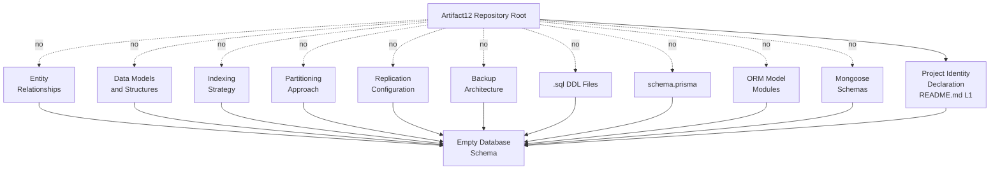

#### 6.2.6.2 Data Flow Absence Topology

The following diagram visualizes the verified topological state of the data movement surface that would otherwise connect persistence components. It mirrors the empty-flow logic of Section 5.6.1 and Section 5.2.3.1 (no producer, no consumer, no message, no payload schema, no propagation graph). Every Data Management sub-area required by the section prompt — migration procedures, versioning strategy, archival policies, data storage/retrieval mechanisms, and caching policies — radiates from the repository root as a verified-absent edge, alongside the foundational absences of source, sink, and transport (Section 4.2.2.1). All converge on a single "Empty Data Flow Surface" terminus.

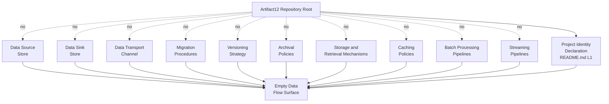

#### 6.2.6.3 Replication Architecture Absence Topology

The following diagram visualizes the verified topological state of the replication dimension (Section 6.2.2.6) and the related performance-optimization sub-areas (Section 6.2.5.4 and Section 6.2.5.5). Every replication-related dimension — primary-replica topology, multi-primary topology, multi-region topology, synchronous mode, asynchronous mode, semi-synchronous mode, quorum policy, read/write split routing, and connection pool — radiates from the repository root as a verified-absent edge, alongside the foundational absences of consistency model, durability guarantee, and retention schedule (Section 3.6.2.3). All converge on a single "Empty Replication Architecture" terminus.

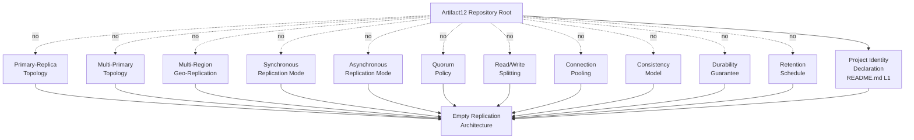

---

### 6.2.7 Activation Pathway for Database Design

This subsection records — without committing — the canonical sequence by which the present "not applicable" disposition would transition to a populated Database Design. It inherits the seven-step activation pathway defined in Section 5.8 and refined in Section 6.1.6, binding each step to the Database Design sub-areas it would activate.

#### 6.2.7.1 Activation Pathway Diagram

```mermaid
flowchart LR
    Current[Current State:<br/>Database Design<br/>Not Applicable] --> S1[Step 1:<br/>Feature Definition<br/>F-XXX in Section 2]
    S1 --> S2[Step 2:<br/>Data Domain<br/>Declaration]
    S2 --> S3[Step 3:<br/>Storage Technology<br/>Selection ADR-XXX]
    S3 --> S4[Step 4:<br/>Schema Artifact<br/>Commit]
    S4 --> S5[Step 5:<br/>Migration Framework<br/>Adoption]
    S5 --> S6[Step 6:<br/>Persistence Strategy<br/>Specification]
    S6 --> S7[Step 7:<br/>Compliance and<br/>DR Specification]
    S7 --> Populated[Populated Database<br/>Design]
```

#### 6.2.7.2 Sub-Area Activation Mapping

The following table maps each step in the activation pathway to the Database Design sub-areas it would unlock:

| Activation Step | Sub-Areas Unlocked | Constraint Satisfied |
|------------------|---------------------|----------------------|
| Step 2: Data Domain Declaration | Entity relationships (6.2.2.2); data models (6.2.2.3) | C-001; C-002 |
| Step 3: Storage Technology Selection (ADR-XXX) | Indexing strategy (6.2.2.4); partitioning approach (6.2.2.5); storage/retrieval mechanisms (6.2.3.5) | C-001; C-004 |
| Step 4: Schema Artifact Commit | Data models and structures (6.2.2.3); versioning strategy (6.2.3.3) | C-001; C-004 |
| Step 5: Migration Framework Adoption | Migration procedures (6.2.3.2); versioning strategy (6.2.3.3) | C-001; C-004 |
| Step 6: Persistence Strategy Specification | Replication configuration (6.2.2.6); backup architecture (6.2.2.7); read/write splitting (6.2.5.5); connection pooling (6.2.5.4); caching strategy (6.2.5.3); caching policies (6.2.3.6) | C-001; C-003 |
| Step 7: Compliance and DR Specification | Data retention (6.2.4.2); backup/fault tolerance (6.2.4.3); privacy controls (6.2.4.4); audit mechanisms (6.2.4.5); access controls (6.2.4.6); archival policies (6.2.3.4) | C-001; C-004 |

#### 6.2.7.3 Revision Trigger Conditions

This Section 6.2 will be revised — and its "not applicable" disposition replaced with substantive Database Design content — when any of the following changes occur in the Artifact12 repository:

| Repository Change | Sub-Area Activated | Lifecycle Action |
|-------------------|--------------------|--------------------|
| Introduction of a `.sql` DDL file, `schema.prisma`, SQLAlchemy model module, or Mongoose schema | 6.2.2.3 (Data Models); 6.2.2.4 (Indexing Strategy) | Reclassify "not applicable" to populated; author schema diagram and index catalog |
| Introduction of a Liquibase, Flyway, Sequelize, Alembic, Django, Knex, or EF migration directory | 6.2.3.2 (Migration Procedures); 6.2.3.3 (Versioning Strategy) | Populate migration procedure and version-history sub-sections |
| Introduction of a database driver dependency in a manifest (`package.json`, `requirements.txt`, `pom.xml`, etc.) | 6.2.3.5 (Storage and Retrieval); 6.2.5.4 (Connection Pooling) | Populate data-access-layer and connection-pool sub-sections; cross-link to Section 3.4 |
| Introduction of a Redis or Memcached client dependency, or in-memory cache configuration | 6.2.3.6 (Caching Policies); 6.2.5.3 (Caching Strategy) | Populate caching sub-sections; cross-link to Section 5.4.3.4 |
| Introduction of a replication configuration (read-replica connection string, replica-set config, proxy configuration) | 6.2.2.6 (Replication); 6.2.5.5 (Read/Write Splitting); 6.1.4.4 (Data Redundancy) | Populate replication and routing sub-sections |
| Introduction of a backup runbook, snapshot policy, or DR plan referencing the database | 6.2.2.7 (Backup Architecture); 6.2.4.3 (Backup and Fault Tolerance) | Populate backup-architecture sub-sections; cross-link to Section 5.5.2.6 |
| Introduction of a retention-policy specification, GDPR/CCPA mapping, or compliance framework reference | 6.2.3.4 (Archival Policies); 6.2.4.2 (Data Retention) | Populate retention and archival sub-sections |
| Introduction of a database user catalog, RBAC role definition, RLS policy, or audit-log table | 6.2.4.5 (Audit Mechanisms); 6.2.4.6 (Access Controls) | Populate audit and access-control sub-sections; cross-link to Section 5.5.2.4 |
| Introduction of a batch-processing pipeline (Airflow DAG, Step Function, Spark/Flink job, ETL script) | 6.2.5.6 (Batch Processing) | Populate batch-processing sub-section; cross-link to Section 5.2.4.2 |
| Introduction of an EXPLAIN plan, slow-query log threshold, or query-optimization specification | 6.2.5.2 (Query Optimization) | Populate query-optimization sub-section; cross-link to Section 6.1.3.5 |

Until any such change occurs, this Section 6.2 remains in its "not applicable" disposition, consistent with the pre-implementation baseline established in Section 1.1.2 and preserved by Assumptions A-001 through A-003 and Constraints C-001 through C-004 (Section 2.6).

---

### 6.2.8 Section Summary

The aggregate determination of Section 6.2 is that **Database Design is not applicable to the Artifact12 system in its current revision**. Every sub-area enumerated by the section prompt — across Schema Design (six sub-areas), Data Management (five sub-areas), Compliance Considerations (five sub-areas), and Performance Optimization (five sub-areas) — resolves to verified absence, each with an authoritative cross-reference into Sections 1, 2, 3, 4, 5, or 6.1 of this Technical Specification. The three required Mermaid.js diagram classes (Database schema, Data flow, Replication architecture) are addressed by absence-topology diagrams that follow the established idiom of Sections 5.6 and 6.1.5. The activation pathway (Section 6.2.7) defines the canonical sequence by which substantive Database Design content would replace the current "not applicable" disposition; each step is bound to the specific Constraints (C-001 through C-004) it must satisfy.

This closing position is consistent with the aggregate posture recorded in Sections 1.3.4, 2.7, 3.9, 4.8.3, 5.9.3, and 6.1.7: the project is in a pre-implementation, placeholder state whose only positively-evidenced in-scope element is the project identity declaration; all application features, integrations, UIs, technology selections, process flows, architectural components, integration points, technical decisions, cross-cutting concerns, core service components, scalability designs, resilience patterns, and — by direct extension established here — all database schemas, persistence strategies, data management procedures, compliance controls, and performance optimization patterns are out-of-scope until substantive artifacts are introduced.

---

### 6.2.9 References

#### 6.2.9.1 Repository Files Examined

- `README.md` — Verified contents (12 bytes, single H1 heading "Artifact12" on line 1); establishes the Project Identity Declaration that constitutes the sole positively-evidenced architectural element and the anchor for the "not applicable" disposition
- `blitzy/documentation/Agent Action Plan.md` — Establishes preserve-state baseline (R-AAP-01) and non-expansion principle (R-AAP-02); confirms zero source, configuration, test, build, or deployment artifacts; treats the default technology stack as a reserved future-direction reference only
- `blitzy/documentation/Input Prompt.md` — Verified 55-line content containing only the word "custom" repeated 28 times; does not constitute substantive product requirements (Assumption A-002)
- `blitzy/documentation/Technical Specifications.md` — Master Technical Specification document containing all cited cross-references

#### 6.2.9.2 Repository Folders Explored

- Repository root (depth 0) — Contains exactly `README.md` and the `blitzy/` folder; no source folders, no `db/`, `database/`, `migrations/`, `prisma/`, `models/`, `schemas/`, or `entities/` folders; no configuration folders, deployment folders, or CI/CD folders
- `blitzy/` (depth 1) — Contains only the `documentation/` subfolder; no application code, no schema definitions, no ORM modules, no migration scripts, no seed data, no backup scripts, and no database configuration assets
- `blitzy/documentation/` (depth 2) — Contains exactly three documentation Markdown files; no executable source code, no schema artifacts, no SQL files, and no persistence-layer source files

#### 6.2.9.3 Technical Specification Sections Cross-Referenced

- **Section 1.1.2** — Pre-implementation, placeholder state determination
- **Section 1.1.6** — Single positively-evidenced fact (project identity declaration)
- **Section 1.2.1.3** — No integration with existing enterprise landscape; no data-source binding
- **Section 1.2.2.1** — No primary system capabilities (no data processing capability declared)
- **Section 1.2.2.2** — Single 12-byte `README.md` is the only component artifact
- **Section 1.2.2.3** — No core technical approach committed; zero source code, manifests, configurations, build/CI-CD, or test artifacts
- **Section 1.2.3.3** — No Key Performance Indicators defined (forecloses any KPI baseline against which database performance could be measured)
- **Section 1.3.2** — Implementation boundary; "Data domains included" recorded as "None declared / Undefined"
- **Section 1.3.3.2** — Integration points not covered (databases, search engines explicitly enumerated)
- **Section 1.3.4** — Aggregate scope posture
- **Section 2.1.1** — Empty Feature Catalog
- **Section 2.2** — Functional Requirements; Data Requirements "Not documented"
- **Section 2.3.2** — All integration-point categories "Not documented" (data-store integrations)
- **Section 2.3.3** — Caching and performance "Not documented"; logging and observability "Not documented"; error handling and resiliency "Not documented"
- **Section 2.4.2** — Performance, scalability, resource utilization, and capacity planning all "Not documented"
- **Section 2.4.3** — Security implications absent; no access-control specification
- **Section 2.4.4** — Maintenance requirements absent
- **Section 2.6.1** — Assumptions A-001 through A-003
- **Section 2.6.2** — Constraints C-001 through C-004 binding for Section 6.2
- **Section 2.6.3** — Requirement Version Tracking ledger (parallel pattern for schema versioning)
- **Section 2.7** — Aggregate Section 2 posture
- **Section 3.1.3** — Default technology stack treated as reserved future-direction reference only (MongoDB included)
- **Section 3.4.1** — Zero declared dependencies (no database driver dependency)
- **Section 3.5.1** — All third-party service categories "Not committed"
- **Section 3.5.2.3** — No authentication service configurations (foreclosing database access-control mechanisms)
- **Section 3.5.2.4** — No observability SDK or configuration (foreclosing database audit and monitoring)
- **Section 3.6.1** — All seven storage categories "Not committed" (foundational evidence)
- **Section 3.6.2.1** — Verification basis for "Not committed" status
- **Section 3.6.2.2** — No primary and no secondary database committed; categorical absence of every schema-migration form factor
- **Section 3.6.2.3** — No data persistence strategy documented (consistency, durability, replication, backup/restore, retention all undocumented)
- **Section 3.6.2.4** — No caching solution committed
- **Section 3.6.2.5** — No storage service bound; MongoDB treated as reserved reference only
- **Section 3.6.3** — Reserved Databases & Storage Schema (provides future-population format)
- **Section 3.7.1** — All nine development/deployment categories "Not committed"; no orchestration manifests that would carry database operator/StatefulSet configuration
- **Section 3.8.3** — Default stack table marks MongoDB as "Not committed in repository"
- **Section 3.9** — Aggregate technology-stack posture
- **Section 4.2.2.1** — Data flow requires a source store, sink store, and transport; none present
- **Section 4.2.2.3** — No event-processing flow (no message broker, no event schema)
- **Section 4.2.2.4** — No batch processing pattern
- **Section 4.4.1.1** — No state transition diagram authorable
- **Section 4.4.1.2** — No persistence point and no caching requirement authorable
- **Section 4.4.1.3** — No transaction boundary authorable
- **Section 4.4.2** — All four error-handling elements "Not documented"
- **Section 4.4.2.3** — No recovery procedure (no runbook, no rollback script, no DR plan, no backup/restore policy)
- **Section 4.5** — Process Topology Diagrams (established absence-topology idiom)
- **Section 4.8.3** — Aggregate process-flowchart posture
- **Section 5.1.3.1** — Treatment of the user-provided default technology stack (forbids MongoDB document-store commitment)
- **Section 5.2.2.1** — Project Identity Declaration classification (not a runtime component, not a service, not an executable artifact)
- **Section 5.2.3.1** — No primary data flow describable
- **Section 5.2.3.3** — No data transformation point authorable
- **Section 5.2.3.4** — No key data store and no cache layer committed
- **Section 5.2.4.1** — All ten external-integration categories "Not documented" (including data-store integrations)
- **Section 5.2.4.2** — Data Exchange Pattern dimension "Not documented" (batch ETL, streaming)
- **Section 5.3.2.4** — Component-level data persistence requirement "Not documented"
- **Section 5.3.2.5** — Component-level scaling consideration "Not documented"
- **Section 5.4.3.3** — Data storage solution rationale absent
- **Section 5.4.3.4** — Caching strategy justification absent
- **Section 5.5.1** — All six cross-cutting concerns "Not documented"
- **Section 5.5.2.2** — No logging or tracing strategy authored (foreclosing database audit mechanisms)
- **Section 5.5.2.4** — No authentication or authorization framework selected (foreclosing database access controls)
- **Section 5.5.2.6** — No RTO/RPO target, no failover topology, no backup retention schedule, no restore drill cadence, no business-continuity plan
- **Section 5.6** — Architecture Topology Diagrams (established absence-topology idiom)
- **Section 5.6.1** — High-Level Architecture Absence Topology (precedent for Section 6.2.6.2 data flow diagram)
- **Section 5.6.3** — State Transition and Error Handling Absence Topology (precedent pattern)
- **Section 5.7** — Reserved Architecture Schemas (CMP-XXX, INT-XXX, ADR-XXX, CCC-XXX)
- **Section 5.8** — Activation Pathway for Architecture Documentation (procedural reference for Section 6.2.7)
- **Section 5.9.3** — Closing position on architecture absence
- **Section 6.1.1** — Applicability Determination precedent (grounding conditions, inheritance, user-context default stack disposition)
- **Section 6.1.3.5** — Performance Optimization Techniques determination (connection pooling explicitly foreclosed)
- **Section 6.1.4.2** — Fault Tolerance Mechanisms determination
- **Section 6.1.4.3** — Disaster Recovery Procedures determination
- **Section 6.1.4.4** — Data Redundancy Approach determination (replication, quorum, EC, RAID, cross-region backup, PITR all absent)
- **Section 6.1.5** — Required Diagram Treatments — Absence Topology (precedent for Section 6.2.6 diagrams)
- **Section 6.1.6** — Activation Pathway precedent (precedent for Section 6.2.7)
- **Section 6.1.7** — Section Summary precedent (precedent for Section 6.2.8)
- **Section 6.1.8** — References precedent (precedent for Section 6.2.9)

## 6.3 Integration Architecture

### 6.3.1 Applicability Determination

**Integration Architecture is not applicable for this system.**

The Artifact12 system does not require, declare, or contain any integration with external systems, third-party services, message brokers, APIs, or partner platforms in its current revision. This determination is invoked under the section prompt's explicit conditional clause, which authorizes the not-applicable disposition when "the system does not require integration with external systems or services" and requires that the disposition be accompanied by an explanation of why. The remainder of this section provides that explanation, structured as an evidence-anchored verified-absence catalog that mirrors the methodology of Section 6.1 (Core Services Architecture) and Section 6.2 (Database Design) and inherits their binding guardrails. The catalog covers every sub-area enumerated by the section prompt: API Design (protocol specifications, authentication methods, authorization framework, rate limiting strategy, versioning approach, documentation standards), Message Processing (event processing patterns, message queue architecture, stream processing design, batch processing flows, error handling strategy), and External Systems (third-party integration patterns, legacy system interfaces, API gateway configuration, external service contracts).

#### 6.3.1.1 Grounding Conditions

The not-applicable disposition for Integration Architecture rests on five converging conditions, each independently sufficient and jointly determinative:

| Condition | Authoritative Reference | Determinative Effect |
|-----------|--------------------------|----------------------|
| Pre-implementation, placeholder repository state | Section 1.1.2; Section 1.2.2.2 | No integration can exist in a repository whose only substantive artifact is a 12-byte `README.md` containing only the H1 heading "Artifact12" |
| All ten external integration categories verified "Not documented" | Section 5.2.4.1; Section 3.5.1 | No external APIs, identity providers, monitoring/observability services, logging/telemetry services, cloud bindings, payment services, notification gateways, analytics platforms, message brokers, or data-store integrations exist |
| Zero API or contract artifacts across every form factor | Section 3.5.2.2; Section 4.2.2.2 | No OpenAPI/Swagger specification, no gRPC `.proto` file, no GraphQL schema, no AsyncAPI specification, no message-broker contract, and no SDK dependency exists |
| No integration with existing enterprise landscape | Section 1.2.1.3; Section 1.3.1.3 | The repository declares no external system catalog, upstream dependency registry, downstream consumer list, identity-provider integration, data-source binding, or partner-API specification |
| Binding constraints forbid fabrication | Section 2.6.2 (C-001 through C-004) | No integration point, protocol selection, authentication method, message broker, or external service may be introduced absent a tracked-file evidence anchor (Constraint C-003 directly prohibits authoring integration content without source-code or specification evidence) |

#### 6.3.1.2 Inheritance of Prior Determinations

This Section 6.3 inherits, by direct extension, the verified-absence findings of Sections 1, 2, 3, 4, 5, 6.1, and 6.2. Specifically, the following prior determinations are determinative for the not-applicable disposition recorded here:

- **Section 1.2.1.3** confirms that the repository does not declare any integration with an existing enterprise landscape: no external system catalog, upstream dependency registry, downstream consumer list, identity-provider integration, data-source binding, or partner-API specification is documented.
- **Section 1.3.1.3** reaffirms that no integrations are in scope: the repository declares no external system bindings, no API consumers or providers, no identity-provider connections, no data-source attachments, and no third-party service dependencies.
- **Section 1.3.3.2** explicitly catalogs all conceivable integration points as not covered, including authentication providers, payment processors, analytics platforms, monitoring services, content-delivery networks, message brokers, databases, search engines, email and notification gateways, mobile-platform stores, identity federation services, and enterprise resource systems.
- **Section 2.3.2** records every integration-point category (inbound integrations, outbound integrations, identity/authentication providers, data-store integrations) as "Not documented."
- **Section 3.5.1** records every third-party service category — external APIs, authentication services, monitoring/observability tools, logging/telemetry services, cloud services, payment/commerce services, notification services, and analytics services — as "Not committed," each with categorical evidentiary absence.
- **Section 3.5.2.2** confirms that no OpenAPI/Swagger specification, no gRPC `.proto` definition, no GraphQL schema, and no message-broker contract exists in the repository, and that no SDK package appears in any dependency manifest because no manifest exists.
- **Section 4.2.2** records every integration workflow element (data flow between systems, API interactions, event processing flows, batch processing sequences) as "Not documented," with per-element determinations in Sections 4.2.2.1 through 4.2.2.4.
- **Section 4.4.2** records all four error-handling elements (retry mechanisms, fallback processes, error notification flows, recovery procedures) as "Not documented."
- **Section 5.2.4.1** records every external integration category (ten categories) as "Not documented," and Section 5.2.4.2 records every cross-cutting integration dimension (Data Exchange Pattern, Protocol/Format, SLA Requirements) as "Not documented."
- **Section 5.4.3.2** records that no communication pattern choice has been made: no synchronous request/reply contract, no asynchronous event schema, no message-broker topology, and no choreography/orchestration framework has been bound to the project.
- **Section 5.5.2.4** records that no authentication or authorization framework has been selected, foreclosing the authentication method and authorization framework dimensions of API Design.
- **Section 6.1.2.3** records that no inter-service communication pattern can be authored, foreclosing the protocol and API-design dimensions at the service-component level.
- **Section 6.2.5.6** records that no batch processing approach can be authored: no ETL pipeline, no ELT pattern, no bulk-insert specification, no message-broker batch-consumer configuration, no Spark/Flink/Beam job, and no MapReduce specification has been declared.

#### 6.3.1.3 Disposition of the User-Context Default Stack

The user-context default technology stack — encompassing AWS, Docker, Terraform, GitHub Actions, Python, Flask, Auth0, MongoDB, Langchain, React with TypeScript, TailwindCSS, React Native with TypeScript, Swift, Kotlin, Objective-C, and ElectronJS — is acknowledged in Section 3.1.3 and Section 3.8.3 strictly as a **reserved future-direction reference**. Several items in this default stack are natural anchors for integration architecture sub-areas; each is treated as not committed in the repository on independent evidentiary grounds:

| Default-Stack Item | Natural Integration Role | Disposition |
|--------------------|--------------------------|-------------|
| Auth0 | OAuth/OIDC identity-provider integration; authentication methods for API Design (Section 6.3.2.3) | Not committed (Section 3.5.2.3 — no `auth0.json`, no OIDC client configuration, no JWT-signing-key reference, no role/permission specification) |
| AWS | Cloud-provider integrations; API Gateway configuration (Section 6.3.4.4); SQS/SNS for message queues; EventBridge for event-driven patterns | Not committed (Section 3.5.2.5 — no AWS SDK dependency, no CDK or CloudFormation template, no serverless-framework configuration) |
| MongoDB | Data-store integration; document-store binding via driver SDK | Not committed (Section 6.2.1.3 — no MongoDB connection string, no `mongoose` or `pymongo` dependency, no collection-mapping module, no replica-set configuration) |
| Flask | REST API framework anchoring protocol specifications (Section 6.3.2.2) and API gateway routing | Not committed (Section 3.3.1 — zero framework manifests; Section 5.1.3.1 forbids Flask web-architecture commitment) |
| Langchain | Outbound LLM-provider integration; SDK-based external service contract | Not committed (Section 3.4.1 — zero declared dependencies, no LLM-provider SDK) |
| GitHub Actions | Webhook-triggered integration; CI/CD-driven external publish actions | Not committed (Section 3.7.1 — `.github/workflows/*` absent) |

Per Constraint C-004 (Section 2.6.2), no technology selection may be committed in any requirement until the repository introduces a manifest, configuration file, or source artifact that establishes the selection; this Section 6.3 therefore does not author any OAuth/OIDC integration based on the Auth0 reference, any cloud-service binding based on the AWS reference, any document-store integration based on the MongoDB reference, any REST API design based on the Flask reference, any LLM-provider integration based on the Langchain reference, or any webhook-triggered integration based on the GitHub Actions reference. This treatment is consistent with — and reinforced by — the parallel dispositions recorded in Sections 6.1.1.3 and 6.2.1.3.

---

### 6.3.2 API Design — Verified-Absence Catalog

The section prompt enumerates six required API Design sub-areas. Each is addressed below as a verified-absence determination with its authoritative cross-reference. No API surface exists in the repository against which any of these sub-areas could be authored: Section 3.5.2.2 confirms the absence of every API specification artifact form factor (OpenAPI/Swagger, gRPC `.proto`, GraphQL schema, message-broker contract), and Section 1.2.2.3 confirms zero source files across twenty-two language extensions in which API handlers, route definitions, controller methods, resolver functions, or RPC service implementations could reside.

#### 6.3.2.1 API Design Status Matrix

| Sub-Area | Status | Authoritative Cross-Reference |
|----------|--------|--------------------------------|
| Protocol specifications | Not applicable — no protocol committed | Section 3.5.2.2; Section 4.2.2.2; Section 5.2.3.2 |
| Authentication methods | Not applicable — no auth provider | Section 3.5.2.3; Section 5.5.2.4 |
| Authorization framework | Not applicable — no AuthZ model | Section 2.4.3; Section 5.5.2.4 |
| Rate limiting strategy | Not applicable — no throttling surface | Section 6.1.4.6; Section 5.5.2.5 |
| Versioning approach | Not applicable — no version-bearing artifact | Section 2.6.3; Section 6.2.3.3 |
| Documentation standards | Not applicable — no API documentation artifact | Section 3.5.2.2; Section 4.2.2.2 |

#### 6.3.2.2 Protocol Specifications — Determination

No protocol specification can be authored. Section 3.5.2.2 confirms that the repository contains no OpenAPI/Swagger specification, no gRPC `.proto` definition, no GraphQL schema, and no message-broker contract. Section 4.2.2.2 (API Interaction Determination) confirms that no endpoint, no operation, no request schema, no response schema, and no authentication method has been declared. Section 5.2.3.2 records that no integration pattern (e.g., synchronous request/response, asynchronous event publication, request/reply over message broker, publish/subscribe, claim-check, content-based router, message translator) and no protocol (e.g., HTTP/REST, gRPC, GraphQL, WebSocket, AMQP, MQTT, Kafka protocol, SMTP) is committed in the repository. Protocol specification authorship presupposes (a) a transport-layer choice (TCP, UDP, QUIC, WebSocket), (b) an application-layer protocol selection (HTTP/1.1, HTTP/2, HTTP/3, gRPC, GraphQL-over-HTTP, AMQP 0-9-1, AMQP 1.0, MQTT 3.1.1, MQTT 5, Kafka wire protocol), (c) a serialization format (JSON, XML, Protobuf, Avro, MessagePack, CBOR), and (d) a content-negotiation policy. None of the four prerequisites has any evidence anchor in the repository.

#### 6.3.2.3 Authentication Methods — Determination

No authentication method can be authored. Section 5.5.2.4 records that no authentication or authorization framework has been selected: no `auth0.json`, no OIDC client configuration, no JWT-signing-key reference, and no role/permission specification exists at any path. Section 1.2.1.3 confirms that no identity-provider integration is documented. Section 3.5.2.3 confirms that no authentication service (Auth0, Okta, Cognito, Firebase Auth, custom OAuth/OIDC) is bound to the project. Authentication method authorship presupposes (a) an identity-provider trust relationship, (b) a credential-acquisition flow (Authorization Code, Authorization Code with PKCE, Client Credentials, Device Code, Refresh Token), (c) a token format (JWT, opaque token, SAML assertion), and (d) a token-validation policy (issuer claim, audience claim, signature algorithm, key-rotation schedule). None of the four prerequisites has any evidence anchor. No API key scheme, no HTTP Basic Authentication, no HTTP Bearer Token scheme, no OAuth 2.0 grant type, no OpenID Connect flow, no mutual-TLS configuration, no HMAC-signed request scheme, and no AWS SigV4 signing convention has been declared.

#### 6.3.2.4 Authorization Framework — Determination

No authorization framework can be authored. Section 5.5.2.4 explicitly records that no role/permission specification exists at any path. Section 2.4.3 confirms the absence of all authorization models, security controls, and compliance frameworks because no features exist (Section 2.1.1) and no security controls are declared in any tracked file. Authorization framework authorship presupposes (a) a subject model (user, service principal, machine identity), (b) an object/resource model with stable identifiers, (c) a permission grammar (action verb, resource noun, optional scope), and (d) a decision-point architecture (PEP, PDP, PIP, PAP per XACML terminology). None of the four prerequisites has any evidence anchor. No RBAC role catalog, no ABAC attribute schema, no PBAC policy specification, no ReBAC graph definition, no OAuth scope taxonomy, no OPA/Rego policy, no Cedar policy, no Casbin model, no JWT claims authorization scheme, and no row-level security policy has been declared.

#### 6.3.2.5 Rate Limiting Strategy — Determination

No rate limiting strategy can be authored. Section 6.1.4.6 records that no service degradation policy — including rate-limit policy, shedding strategy, and priority queue — has been declared. Section 5.5.2.5 records that no performance requirement and no SLA has been declared; Section 1.2.3.3 records that no Technical KPI (availability, latency, throughput, error rate) has been defined. Rate limiting strategy authorship presupposes (a) a measurable axis (requests per second, requests per minute, concurrent requests, bandwidth, cost units), (b) a granularity model (global, per-API-key, per-user, per-IP, per-tenant, per-route), (c) an algorithm selection (token bucket, leaky bucket, fixed window, sliding window log, sliding window counter), and (d) a response policy on limit breach (HTTP 429 with `Retry-After`, queueing, throttled-degraded mode). None of the four prerequisites has any evidence anchor. No throttling middleware, no API gateway rate-limit policy, no Redis-backed counter, no Lua script for atomic rate accounting, no NGINX `limit_req` zone, no Envoy rate-limit service, and no Kong/Apigee/AWS API Gateway throttling configuration has been declared.

#### 6.3.2.6 Versioning Approach — Determination

No API versioning approach can be authored. The repository contains no version-bearing artifact: Section 2.6.3 records that the Requirement Version Tracking ledger is empty because no requirements have been authored, and Section 6.2.3.3 confirms that no schema-versioning strategy exists in any form factor. The single substantive artifact (`README.md`, 12 bytes) carries the project name only and declares no system version, no API version, and no compatibility contract. Versioning approach authorship presupposes (a) a version-naming scheme (`v1`, `v2.3`, date-stamped `2024-06-01`, build-SHA), (b) a placement convention (URI path `/v1/`, query parameter `?version=1`, custom header `X-API-Version`, `Accept` header media-type parameter, host subdomain `v1.api.example.com`), (c) a deprecation policy (deprecation header, sunset header, grace-period schedule), and (d) a backward-compatibility contract (additive-only, breaking-change procedure, parallel-versioning window). None of the four prerequisites has any evidence anchor. No URI-path versioning, no media-type versioning, no header-based versioning, no query-parameter versioning, no host-based versioning, and no GraphQL field-deprecation strategy has been declared.

#### 6.3.2.7 Documentation Standards — Determination

No API documentation standard can be authored. Section 3.5.2.2 confirms the categorical absence of API documentation form factors: no OpenAPI/Swagger specification (which would otherwise drive Swagger UI, Redoc, or Stoplight Elements), no gRPC `.proto` definition (which would otherwise drive `protoc-gen-doc` output), no GraphQL schema (which would otherwise drive GraphiQL or GraphQL Playground introspection-based documentation), and no AsyncAPI specification (which would otherwise drive AsyncAPI Studio or AsyncAPI HTML template output). Section 4.2.2.2 confirms the absence of SDK dependencies that might otherwise carry typed-client documentation. API documentation standard authorship presupposes (a) a specification format (OpenAPI 3.x, AsyncAPI 2.x, gRPC `.proto` with proto3 syntax, GraphQL SDL), (b) a rendering pipeline (Swagger UI, Redoc, Stoplight, ReadMe.io, GitBook), (c) a publication target (developer portal, internal wiki, README appendix), and (d) a freshness contract (manual update, CI-generated, runtime-introspected). None of the four prerequisites has any evidence anchor.

---

### 6.3.3 Message Processing — Verified-Absence Catalog

The section prompt enumerates five required Message Processing sub-areas. Each is addressed below as a verified-absence determination with its authoritative cross-reference. No message-processing surface exists in the repository: Section 3.6.1 records "Message broker / queue" as "Not committed," Section 4.2.2.3 confirms the absence of every event-processing artifact form factor, and Section 4.2.2.4 confirms the absence of every batch-processing artifact form factor.

#### 6.3.3.1 Message Processing Status Matrix

| Sub-Area | Status | Authoritative Cross-Reference |
|----------|--------|--------------------------------|
| Event processing patterns | Not applicable — no event schema or broker | Section 4.2.2.3; Section 5.4.3.2 |
| Message queue architecture | Not applicable — no broker committed | Section 3.6.1; Section 4.2.2.3 |
| Stream processing design | Not applicable — no streaming pipeline | Section 5.2.4.2; Section 6.2.5.6 |
| Batch processing flows | Not applicable — no scheduler or ETL job | Section 4.2.2.4; Section 6.2.5.6 |
| Error handling strategy | Not applicable — no failure surface | Section 4.4.2; Section 5.5.2.3 |

#### 6.3.3.2 Event Processing Patterns — Determination

No event processing pattern can be authored. Section 4.2.2.3 (Event Processing Determination) confirms that the repository contains no message broker or queue, no event schema (no `*.avsc`, no AsyncAPI specification, no Protobuf event contract), and no notification SDK dependency. Section 5.4.3.2 records that no communication pattern choice has been made: no asynchronous event schema, no message-broker topology, and no orchestration/choreography framework has been bound to the project. Event processing pattern authorship presupposes (a) a producer surface, (b) an event-schema contract with versioning, (c) a transport (message broker, event bus, log-structured streaming platform), and (d) one or more consumer surfaces with delivery-semantics guarantees (at-most-once, at-least-once, exactly-once). None of the four prerequisites has any evidence anchor. No Event Sourcing pattern, no CQRS pattern, no Saga pattern (choreographed or orchestrated), no Outbox pattern, no Inbox pattern, no Event Notification pattern, no Event-Carried State Transfer pattern, no Domain Event publication, no Integration Event publication, and no Change Data Capture (CDC) configuration has been declared.

#### 6.3.3.3 Message Queue Architecture — Determination

No message queue architecture can be authored. Section 3.6.1 records the storage category "Message broker / queue" as "Not committed," with no Kafka cluster, no RabbitMQ vhost, no AWS SQS queue, no AWS SNS topic, no Google Pub/Sub topic, no Azure Service Bus namespace, no NATS subject, no Redis Streams binding, no Apache Pulsar tenant, and no ActiveMQ broker declared in any tracked file. Message queue architecture authorship presupposes (a) a broker technology selection with a deployment topology (single-broker, clustered, multi-region), (b) a queue/topic taxonomy with naming conventions, (c) a partitioning and ordering policy (per-key ordering, FIFO queue, partition-key derivation), and (d) a delivery-guarantee contract (durable, transient, persistent, replicated). None of the four prerequisites has any evidence anchor. No dead-letter queue (DLQ) policy, no retry-with-backoff queue, no priority queue, no fan-out topic, no fan-in queue, no work-queue pattern, no competing-consumers pattern, no message-time-to-live policy, and no maximum-message-size constraint has been declared.

#### 6.3.3.4 Stream Processing Design — Determination

No stream processing design can be authored. Section 5.2.4.2 records the Data Exchange Pattern dimension — including "streaming" — as "Not documented." Section 6.2.5.6 confirms that no streaming pipeline has been declared: no Spark Streaming job, no Flink job, no Apache Beam pipeline, no Kafka Streams topology, no ksqlDB statement, no Kinesis Data Analytics application, no Materialize subscription, and no Faust agent. Stream processing design authorship presupposes (a) a streaming substrate (Kafka, Kinesis, Pulsar, Event Hubs, Pub/Sub), (b) a processing-engine selection (Flink, Spark Structured Streaming, Kafka Streams, Beam, ksqlDB), (c) a windowing strategy (tumbling, sliding, session, global), and (d) a state-management policy (in-memory, RocksDB, external state store) with checkpointing and recovery semantics. None of the four prerequisites has any evidence anchor. No exactly-once processing guarantee, no watermark-based event-time handling, no late-data handling policy, no backpressure strategy, and no stateful operator with checkpointing has been declared.

#### 6.3.3.5 Batch Processing Flows — Determination

No batch processing flow can be authored. Section 4.2.2.4 (Batch Processing Determination) confirms that the repository contains no CI/CD definition, no scheduler or cron specification, no build system that could orchestrate a batch, and no source code to be batched. Section 6.2.5.6 records that no ETL pipeline, no ELT pattern, no bulk-insert specification, no `COPY` or `BULK INSERT` directive, no message-broker batch-consumer configuration, no Spark/Flink/Beam job, and no MapReduce specification has been declared. Batch processing flow authorship presupposes (a) a job-definition language (Airflow DAG Python module, Step Functions ASL JSON, Argo Workflows YAML, Kubernetes CronJob manifest, Prefect flow, Dagster pipeline, Luigi task graph), (b) a scheduling mechanism (cron expression, event-trigger, manual invocation), (c) an input/output binding (source table, destination table, file path, queue), and (d) a failure-and-restart policy (idempotency, checkpoint, retry-with-backoff). None of the four prerequisites has any evidence anchor.

#### 6.3.3.6 Error Handling Strategy — Determination

No error handling strategy for message processing can be authored. Section 4.4.2 (Error Handling Elements) records all four required elements — retry mechanisms, fallback processes, error notification flows, recovery procedures — as "Not documented." Section 5.5.2.3 confirms that no error handling pattern has been authored: no exception taxonomy, no error-code registry, no circuit-breaker threshold, and no compensating-action policy has been declared. Section 6.1.2.7 confirms that no retry mechanism and no fallback process can be authored because no source code exists in which to embed a retry policy and no alternative provider exists to which a fallback could route. Message-processing error handling strategy authorship presupposes (a) an error classification (transient versus permanent, retryable versus non-retryable, poison-message detection), (b) a retry policy (count, interval, exponential backoff, jitter, ceiling), (c) a dead-letter routing destination, and (d) an operator-notification policy. None of the four prerequisites has any evidence anchor. No poison-message handling, no DLQ replay procedure, no compensating-action saga step, no idempotency-key convention, no consumer-offset-rewind policy, and no message-bisection debugging procedure has been declared.

---

### 6.3.4 External Systems — Verified-Absence Catalog

The section prompt enumerates four required External Systems sub-areas. Each is addressed below as a verified-absence determination with its authoritative cross-reference. The repository declares zero third-party service bindings, zero integration declarations, and zero external-service configuration artifacts (Section 3.5.1).

#### 6.3.4.1 External Systems Status Matrix

| Sub-Area | Status | Authoritative Cross-Reference |
|----------|--------|--------------------------------|
| Third-party integration patterns | Not applicable — no service bindings | Section 3.5.1; Section 5.2.4.1 |
| Legacy system interfaces | Not applicable — no predecessor system | Section 1.2.1.2; Section 1.2.1.3 |
| API gateway configuration | Not applicable — no gateway artifact | Section 3.7.1; Section 5.2.1.3 |
| External service contracts | Not applicable — no contract artifact | Section 3.5.2.2; Section 5.2.4.1 |

#### 6.3.4.2 Third-Party Integration Patterns — Determination

No third-party integration pattern can be authored. Section 3.5.1 records every third-party service category as "Not committed": external APIs (no SDK dependencies, no `.openapi.yaml`, no service-binding configuration); authentication services (no `auth0.json`, no identity-provider binding); monitoring/observability tools (no monitoring SDK, no observability configuration); logging/telemetry services (no logger configuration, no log-shipping definition); cloud services (no cloud-provider SDK, no service configuration); payment/commerce services (no payment-gateway SDK); notification services (no notification-gateway SDK); and analytics services (no analytics SDK, no tracking configuration). Section 5.2.4.1 records the same ten external integration categories as "Not documented." Third-party integration pattern authorship presupposes (a) a vendor selection grounded in a non-functional requirement, (b) an integration mechanism choice (REST, GraphQL, gRPC, SDK, webhook, message broker), (c) a credential-management approach (secrets store, IAM role, API key vault), and (d) a resilience profile (timeout budget, retry policy, circuit-breaker threshold). None of the four prerequisites has any evidence anchor. No Anti-Corruption Layer pattern, no Backends-for-Frontends pattern, no API Composition pattern, no Strangler Fig pattern, no Sidecar pattern, no Service Mesh egress configuration, no Ambassador pattern, and no Adapter pattern has been declared.

#### 6.3.4.3 Legacy System Interfaces — Determination

No legacy system interface can be authored. Section 1.2.1.3 confirms that the repository does not declare any integration with an existing enterprise landscape: no external system catalog, upstream dependency registry, downstream consumer list, identity-provider integration, data-source binding, or partner-API specification is documented. Legacy system interface authorship presupposes (a) a predecessor system whose interface is to be wrapped, replaced, or extended, (b) a protocol/format inventory of the predecessor system (SOAP, EDI X12, EDIFACT, COBOL copybooks, fixed-width flat files, IBM MQ, Tuxedo, AS400 DDS), (c) a coexistence strategy (Strangler Fig, dual-write, change-data-capture replication, anti-corruption layer), and (d) a migration roadmap with deprecation milestones. None of the four prerequisites has any evidence anchor in the repository. No SOAP envelope handler, no XML schema (XSD), no WSDL document, no EDI segment definition, no COBOL/CICS adapter, no IBM MQ queue manager configuration, no JCA connector specification, and no message-translation map (e.g., HL7-to-FHIR, EDI-to-JSON) has been declared.

#### 6.3.4.4 API Gateway Configuration — Determination

No API gateway configuration can be authored. Section 3.7.1 records all nine development-and-deployment categories — developer environment, build system, containerization, container orchestration, infrastructure-as-code, CI/CD definitions, secrets management, quality gates, and test infrastructure — as "Not committed," foreclosing every form factor in which a gateway configuration would conventionally reside. Section 5.2.1.3 records that no major interface — neither user-facing (web UI, mobile UI, CLI, **API gateway**), nor system-facing (REST API, GraphQL endpoint, gRPC service, message-broker topic, webhook receiver), nor administrative (operator console, configuration API, audit log endpoint) — exists in the repository. API gateway configuration authorship presupposes (a) a gateway product selection (Kong, Apigee, AWS API Gateway, Azure API Management, GCP API Gateway, Tyk, KrakenD, Envoy, NGINX, HAProxy, Traefik, Ambassador, Gloo), (b) a route catalog mapping public paths to upstream services, (c) a policy stack (authentication, authorization, rate limiting, request transformation, response transformation, CORS, logging, tracing, WAF rules), and (d) a deployment topology (self-hosted, managed, multi-region, blue/green). None of the four prerequisites has any evidence anchor. No upstream-target definition, no canary-routing rule, no JWT-validation policy, no OAuth-introspection policy, no request-validation schema, no response-caching rule, and no developer-portal binding has been declared.

#### 6.3.4.5 External Service Contracts — Determination

No external service contract can be authored. Section 3.5.2.2 confirms the categorical absence of every contract form factor: no OpenAPI/Swagger specification (which would otherwise carry REST contract definitions with paths, operations, parameters, request bodies, responses, and security schemes), no gRPC `.proto` definition (which would otherwise carry service interfaces, RPC methods, message types, and field-level constraints), no GraphQL schema (which would otherwise carry types, queries, mutations, subscriptions, and directives), no AsyncAPI specification (which would otherwise carry channels, operations, messages, schemas, and bindings), and no message-broker contract. Section 5.2.4.1 records that no External Integration Points table entry exists. External service contract authorship presupposes (a) a stable contract artifact under version control, (b) a contract-evolution policy (additive-only, breaking-change procedure, parallel-versioning window), (c) a consumer-driven or provider-driven testing convention (Pact, Spring Cloud Contract, Postman tests, Hoverfly virtualization), and (d) an SLA/SLO declaration governing the contract (availability target, latency budget, throughput floor, error-rate ceiling). None of the four prerequisites has any evidence anchor.

The Reserved Integration Point Schema (Section 5.7.2) defines the structure that each external service contract entry will adopt when authored. The schema is reproduced below as a normative reference; no rows are populated because Constraint C-003 prohibits authoring any integration entry absent source-code or specification evidence:

| Schema Field | Format | Permissible Values |
|--------------|--------|--------------------|
| Integration ID | `INT-XXX` (zero-padded three-digit) | `INT-001` through `INT-999`; sequential |
| External System Name | Free text | Vendor / product identifier |
| Integration Type | Enumerated | Inbound, Outbound, Bidirectional |
| Data Exchange Pattern | Enumerated | Synchronous Request/Reply, Asynchronous Event, Batch ETL, Streaming, Webhook |

The remaining schema fields (Protocol/Format, SLA Requirements, Authentication Method, Evidence Anchor) are defined in Section 5.7.2 and are likewise unpopulated in the current revision.

---

### 6.3.5 Required Diagram Treatments — Absence Topology

The section prompt requires four Mermaid.js diagram classes — integration flow diagrams, API architecture diagrams, message flow diagrams, and sequence diagrams for key flows. Each class is addressed below as an **absence-topology diagram** in accordance with the established idiom of Sections 5.6, 6.1.5, and 6.2.6: solid edges denote evidenced presence, dotted edges labeled "no" denote verified absence, and a convergence node at the bottom collects all absence findings into a single empty terminus. These diagrams do not author content beyond what is positively evidenced; they visualize the absence-documenting state itself.

#### 6.3.5.1 Integration Flow Absence Topology

The following diagram visualizes the verified topological state of the External Systems dimension (Section 6.3.4) and the inbound/outbound integration surface as a whole. The single positively-evidenced path traces from the repository root to the Project Identity Declaration. Every integration category enumerated in Section 5.2.4.1 — external APIs, authentication providers, monitoring/observability services, logging/telemetry services, cloud bindings, payment services, notification gateways, analytics platforms, message brokers, and data-store integrations — radiates from the repository root as a verified-absent edge and converges on a single "Empty Integration Surface" terminus.

```mermaid
flowchart TB
    Repo[Artifact12 Repository Root]
    Repo --> Identity[Project Identity<br/>Declaration<br/>README.md L1]
    Repo -. no .-> ExtAPI[External APIs<br/>REST GraphQL gRPC]
    Repo -. no .-> AuthN[Authentication and<br/>Identity Providers]
    Repo -. no .-> Monitor[Monitoring and<br/>Observability Services]
    Repo -. no .-> Logging[Logging and<br/>Telemetry Services]
    Repo -. no .-> Cloud[Cloud Service<br/>Bindings]
    Repo -. no .-> Payment[Payment and<br/>Commerce Services]
    Repo -. no .-> Notify[Notification and<br/>Messaging Services]
    Repo -. no .-> Analytics[Analytics<br/>Services]
    Repo -. no .-> Broker[Message Brokers<br/>and Queues]
    Repo -. no .-> DataStore[Data-Store<br/>Integrations]
    Repo -. no .-> Legacy[Legacy System<br/>Interfaces]
    Repo -. no .-> Gateway[API Gateway<br/>Configuration]
    ExtAPI --> EmptyInt[Empty Integration<br/>Surface]
    AuthN --> EmptyInt
    Monitor --> EmptyInt
    Logging --> EmptyInt
    Cloud --> EmptyInt
    Payment --> EmptyInt
    Notify --> EmptyInt
    Analytics --> EmptyInt
    Broker --> EmptyInt
    DataStore --> EmptyInt
    Legacy --> EmptyInt
    Gateway --> EmptyInt
    Identity --> EmptyInt
```

#### 6.3.5.2 API Architecture Absence Topology

The following diagram visualizes the verified topological state of the API Design dimension (Section 6.3.2). Every API Design sub-area required by the section prompt — protocol specifications, authentication methods, authorization framework, rate limiting strategy, versioning approach, and documentation standards — radiates from the repository root as a verified-absent edge, alongside the categorical absences of every API contract form factor enumerated in Section 3.5.2.2 (OpenAPI/Swagger, gRPC `.proto`, GraphQL schema, AsyncAPI specification). All converge on a single "Empty API Architecture" terminus.

```mermaid
flowchart TB
    Repo[Artifact12 Repository Root]
    Repo --> Identity[Project Identity<br/>Declaration<br/>README.md L1]
    Repo -. no .-> Protocol[Protocol<br/>Specifications]
    Repo -. no .-> Auth[Authentication<br/>Methods]
    Repo -. no .-> Authz[Authorization<br/>Framework]
    Repo -. no .-> RateLim[Rate Limiting<br/>Strategy]
    Repo -. no .-> Version[Versioning<br/>Approach]
    Repo -. no .-> Docs[Documentation<br/>Standards]
    Repo -. no .-> OpenAPI[OpenAPI Swagger<br/>Specification]
    Repo -. no .-> Proto[gRPC proto<br/>Definition]
    Repo -. no .-> GraphQL[GraphQL<br/>Schema]
    Repo -. no .-> AsyncAPI[AsyncAPI<br/>Specification]
    Repo -. no .-> SDK[SDK Client<br/>Dependencies]
    Protocol --> EmptyAPI[Empty API<br/>Architecture]
    Auth --> EmptyAPI
    Authz --> EmptyAPI
    RateLim --> EmptyAPI
    Version --> EmptyAPI
    Docs --> EmptyAPI
    OpenAPI --> EmptyAPI
    Proto --> EmptyAPI
    GraphQL --> EmptyAPI
    AsyncAPI --> EmptyAPI
    SDK --> EmptyAPI
    Identity --> EmptyAPI
```

#### 6.3.5.3 Message Flow Absence Topology

The following diagram visualizes the verified topological state of the Message Processing dimension (Section 6.3.3). Every Message Processing sub-area required by the section prompt — event processing patterns, message queue architecture, stream processing design, batch processing flows, and error handling strategy — radiates from the repository root as a verified-absent edge, alongside the foundational absences of producer surface, consumer surface, broker transport, and event schema (Section 4.2.2.3). All converge on a single "Empty Message Flow Surface" terminus.

```mermaid
flowchart TB
    Repo[Artifact12 Repository Root]
    Repo --> Identity[Project Identity<br/>Declaration<br/>README.md L1]
    Repo -. no .-> Producer[Event Producer<br/>Surface]
    Repo -. no .-> Consumer[Event Consumer<br/>Surface]
    Repo -. no .-> Transport[Broker Transport<br/>Kafka RabbitMQ SQS]
    Repo -. no .-> Schema[Event Schema<br/>AsyncAPI Avro Protobuf]
    Repo -. no .-> EventPat[Event Processing<br/>Patterns]
    Repo -. no .-> Queue[Message Queue<br/>Architecture]
    Repo -. no .-> Stream[Stream Processing<br/>Design]
    Repo -. no .-> Batch[Batch Processing<br/>Flows]
    Repo -. no .-> ErrHandle[Error Handling<br/>Strategy]
    Repo -. no .-> DLQ[Dead-Letter Queue<br/>Policy]
    Repo -. no .-> Retry[Retry and Backoff<br/>Policy]
    Producer --> EmptyMsg[Empty Message<br/>Flow Surface]
    Consumer --> EmptyMsg
    Transport --> EmptyMsg
    Schema --> EmptyMsg
    EventPat --> EmptyMsg
    Queue --> EmptyMsg
    Stream --> EmptyMsg
    Batch --> EmptyMsg
    ErrHandle --> EmptyMsg
    DLQ --> EmptyMsg
    Retry --> EmptyMsg
    Identity --> EmptyMsg
```

#### 6.3.5.4 Key Flow Sequence Diagram — Absence Topology

The section prompt requires sequence diagrams for key flows. Because no key flow exists in the repository — Section 4.2.1.2 confirms that no system interaction can be charted, Section 4.2.2.1 confirms that no data flow can be authored, Section 4.2.2.2 confirms that no API interaction sequence can be authored, and Section 4.2.2.3 confirms that no event processing flow can be authored — the sequence-diagram requirement is addressed by an absence-topology sequence rendering. The diagram depicts the lone positively-evidenced actor (the Project Identity Declaration as a documentation primitive) and notes the verified absence of every counterparty class (external API consumer, identity provider, message broker, downstream service).

```mermaid
sequenceDiagram
    participant Repo as Artifact12 Repository
    participant Identity as Project Identity Declaration (README.md L1)
    participant Counterparty as Any External Counterparty (verified absent)
    Repo->>Identity: Project name declaration (12-byte H1 heading)
    Note over Identity: Documentation primitive only<br/>Not a runtime component<br/>Not a service<br/>Not an executable artifact
    Note over Counterparty: No external API consumer<br/>No identity provider<br/>No message broker<br/>No downstream service<br/>No webhook receiver
    Note over Identity,Counterparty: No request, no response, no event,<br/>no message, no payload schema<br/>(Sections 4.2.2.1 through 4.2.2.4)
```

---

### 6.3.6 Activation Pathway for Integration Architecture

This subsection records — without committing — the canonical sequence by which the present "not applicable" disposition would transition to a populated Integration Architecture. It inherits the seven-step activation pathway defined in Section 5.8 and refined in Sections 6.1.6 and 6.2.7, binding each step to the Integration Architecture sub-areas it would activate. Step 4 — introduction of an API contract or integration-point artifact — is the primary trigger for this section.

#### 6.3.6.1 Activation Pathway Diagram

```mermaid
flowchart LR
    Current[Current State:<br/>Integration Arch<br/>Not Applicable] --> S1[Step 1:<br/>Feature Definition<br/>F-XXX in Section 2]
    S1 --> S2[Step 2:<br/>Communication Pattern<br/>Decision ADR-XXX]
    S2 --> S3[Step 3:<br/>Component or Service<br/>CMP-XXX]
    S3 --> S4[Step 4:<br/>API Contract or<br/>Integration Point INT-XXX]
    S4 --> S5[Step 5:<br/>Data-Store Binding<br/>or Broker Selection]
    S5 --> S6[Step 6:<br/>AuthN AuthZ and<br/>Resilience CCC-XXX]
    S6 --> S7[Step 7:<br/>SLA Gateway and<br/>DR Specification]
    S7 --> Populated[Populated Integration<br/>Architecture]
```

#### 6.3.6.2 Sub-Area Activation Mapping

The following table maps each step in the activation pathway to the Integration Architecture sub-areas it would unlock:

| Activation Step | Sub-Areas Unlocked | Constraint Satisfied |
|------------------|---------------------|----------------------|
| Step 2: Communication Pattern Decision (ADR-XXX) | Protocol specifications (6.3.2.2); event processing patterns (6.3.3.2); third-party integration patterns (6.3.4.2) | C-001; C-004 |
| Step 3: Component or Service Definition (CMP-XXX) | API documentation standards (6.3.2.7); external service contracts (6.3.4.5) | C-001; C-002 |
| Step 4: API Contract or Integration Point (INT-XXX) | Protocol specifications (6.3.2.2); versioning approach (6.3.2.6); documentation standards (6.3.2.7); external service contracts (6.3.4.5); legacy system interfaces (6.3.4.3) | C-001; C-003 |
| Step 5: Data-Store Binding or Broker Selection | Message queue architecture (6.3.3.3); stream processing design (6.3.3.4); batch processing flows (6.3.3.5) | C-001; C-004 |
| Step 6: AuthN/AuthZ and Resilience (CCC-XXX) | Authentication methods (6.3.2.3); authorization framework (6.3.2.4); rate limiting strategy (6.3.2.5); error handling strategy (6.3.3.6) | C-001; C-003 |
| Step 7: SLA, Gateway, and DR Specification | API gateway configuration (6.3.4.4); rate limiting strategy (6.3.2.5); error handling strategy (6.3.3.6) | C-001; C-004 |

#### 6.3.6.3 Revision Trigger Conditions

This Section 6.3 will be revised — and its "not applicable" disposition replaced with substantive Integration Architecture content — when any of the following changes occur in the Artifact12 repository:

| Repository Change | Sub-Area Activated | Lifecycle Action |
|-------------------|--------------------|--------------------|
| Introduction of an OpenAPI/Swagger specification or REST controller module | 6.3.2.2 (Protocol Specifications); 6.3.2.7 (Documentation Standards); 6.3.4.5 (External Service Contracts) | Reclassify "not applicable" to populated; author API contract catalog; cross-link to INT-XXX schema in Section 5.7.2 |
| Introduction of a gRPC `.proto` file or RPC service module | 6.3.2.2 (Protocol Specifications); 6.3.4.5 (External Service Contracts) | Populate protocol and contract sub-sections; cross-link to Section 5.4.3.2 |
| Introduction of a GraphQL schema (`.graphql` or schema-first SDL) | 6.3.2.2 (Protocol Specifications); 6.3.2.6 (Versioning Approach); 6.3.4.5 (External Service Contracts) | Populate protocol, versioning, and contract sub-sections |
| Introduction of an AsyncAPI specification, event-schema (`*.avsc`, `*.proto`), or message-broker contract | 6.3.3.2 (Event Processing Patterns); 6.3.3.3 (Message Queue Architecture); 6.3.4.5 (External Service Contracts) | Populate message processing sub-sections; cross-link to Section 4.2.2.3 |
| Introduction of an authentication SDK dependency (Auth0, Okta, Cognito), OIDC client configuration, or JWT-signing-key reference | 6.3.2.3 (Authentication Methods); 6.3.2.4 (Authorization Framework) | Populate API auth sub-sections; cross-link to Section 5.5.2.4 |
| Introduction of a rate-limit middleware, API gateway throttling policy, or token-bucket configuration | 6.3.2.5 (Rate Limiting Strategy); 6.3.4.4 (API Gateway Configuration) | Populate rate limiting and gateway sub-sections; cross-link to Section 5.5.2.5 |
| Introduction of a message broker client dependency (Kafka, RabbitMQ, SQS, Pub/Sub, NATS, Redis Streams) | 6.3.3.2 (Event Processing); 6.3.3.3 (Message Queue Architecture); 6.3.3.6 (Error Handling Strategy) | Populate message processing sub-sections; cross-link to Section 3.6.1 |
| Introduction of a stream processing job (Flink, Spark Structured Streaming, Kafka Streams, Beam, ksqlDB) | 6.3.3.4 (Stream Processing Design) | Populate stream processing sub-section; cross-link to Section 5.2.4.2 |
| Introduction of a batch job specification (Airflow DAG, Step Function, Argo Workflow, Kubernetes CronJob, Prefect flow) | 6.3.3.5 (Batch Processing Flows) | Populate batch processing sub-section; cross-link to Section 6.2.5.6 |
| Introduction of an API gateway configuration (Kong, Apigee, AWS API Gateway, Azure APIM, Envoy, NGINX, Traefik) | 6.3.4.4 (API Gateway Configuration); 6.3.2.5 (Rate Limiting Strategy) | Populate gateway sub-section; cross-link to Section 5.2.1.3 |
| Introduction of a third-party service SDK (Stripe, Twilio, SendGrid, Datadog, Sentry, Langchain) | 6.3.4.2 (Third-Party Integration Patterns); 6.3.4.5 (External Service Contracts) | Populate third-party integration sub-section; cross-link to Section 3.5.1 |
| Introduction of a legacy-system adapter module (SOAP/WSDL, EDI, IBM MQ, COBOL/CICS, HL7) | 6.3.4.3 (Legacy System Interfaces) | Populate legacy interface sub-section; cross-link to Section 1.2.1.3 |
| Introduction of a webhook handler module, webhook signature verifier, or webhook delivery configuration | 6.3.3.2 (Event Processing Patterns); 6.3.4.5 (External Service Contracts) | Populate webhook sub-sections |
| Introduction of a retry-policy module, circuit-breaker library, or idempotency-key convention | 6.3.3.6 (Error Handling Strategy); 6.3.2.5 (Rate Limiting Strategy) | Populate error handling and rate-limit sub-sections; cross-link to Section 5.5.2.3 |
| Introduction of an SLA/SLO specification or integration-availability target | 6.3.4.5 (External Service Contracts); 6.3.2.5 (Rate Limiting Strategy) | Populate SLA sub-section; cross-link to Section 5.5.2.5 |

Until any such change occurs, this Section 6.3 remains in its "not applicable" disposition, consistent with the pre-implementation baseline established in Section 1.1.2 and preserved by Assumptions A-001 through A-003 and Constraints C-001 through C-004 (Section 2.6).

---

### 6.3.7 Section Summary

The aggregate determination of Section 6.3 is that **Integration Architecture is not applicable to the Artifact12 system in its current revision**. Every sub-area enumerated by the section prompt — across API Design (six sub-areas: protocol specifications, authentication methods, authorization framework, rate limiting strategy, versioning approach, documentation standards), Message Processing (five sub-areas: event processing patterns, message queue architecture, stream processing design, batch processing flows, error handling strategy), and External Systems (four sub-areas: third-party integration patterns, legacy system interfaces, API gateway configuration, external service contracts) — resolves to verified absence, each with an authoritative cross-reference into Sections 1, 2, 3, 4, 5, 6.1, or 6.2 of this Technical Specification. All fifteen sub-area determinations are independently anchored in the verified absence of (a) API contract artifacts (Section 3.5.2.2), (b) message-broker and event-schema artifacts (Section 4.2.2.3), (c) third-party service bindings (Section 3.5.1), (d) communication-pattern commitments (Section 5.4.3.2), and (e) authentication/authorization framework selections (Section 5.5.2.4).

The four required Mermaid.js diagram classes (integration flow, API architecture, message flow, key-flow sequence) are addressed by absence-topology diagrams that follow the established idiom of Sections 5.6, 6.1.5, and 6.2.6. The activation pathway (Section 6.3.6) defines the canonical sequence by which substantive Integration Architecture content would replace the current "not applicable" disposition; Step 4 — introduction of an API contract, gRPC `.proto`, GraphQL schema, AsyncAPI specification, webhook handler, or SDK dependency — is the primary trigger for this section. Each step is bound to the specific Constraints (C-001 through C-004) it must satisfy and to the reserved identifier schemas (`INT-XXX`, `CMP-XXX`, `ADR-XXX`, `CCC-XXX`) defined in Section 5.7.

This closing position is consistent with the aggregate posture recorded in Sections 1.3.4, 2.7, 3.9, 4.8.3, 5.9.3, 6.1.7, and 6.2.8: the project is in a pre-implementation, placeholder state whose only positively-evidenced in-scope element is the project identity declaration; all application features, integrations, UIs, technology selections, process flows, architectural components, integration points, technical decisions, cross-cutting concerns, core service components, scalability designs, resilience patterns, database schemas, persistence strategies, data management procedures, compliance controls, performance optimization patterns, and — by direct extension established here — all API designs, message processing architectures, external system integrations, third-party service contracts, legacy system interfaces, and API gateway configurations are out-of-scope until substantive artifacts are introduced.

---

### 6.3.8 References

#### 6.3.8.1 Repository Files Examined

- `README.md` — Verified contents (12 bytes, single H1 heading "Artifact12" on line 1); establishes the Project Identity Declaration that constitutes the sole positively-evidenced architectural element and the anchor for the "not applicable" disposition; contains no API specification, no integration declaration, no protocol selection, no authentication scheme, no message-broker reference, and no external service contract
- `blitzy/documentation/Agent Action Plan.md` — Establishes preserve-state baseline (R-AAP-01) and non-expansion principle (R-AAP-02); confirms zero source, configuration, test, build, or deployment artifacts; explicitly excludes all third-party integrations and external services from scope; treats the user-context default technology stack as a reserved future-direction reference only
- `blitzy/documentation/Input Prompt.md` — Verified 55-line content containing only the word "custom" repeated 28 times; does not constitute substantive integration requirements (Assumption A-002); declares no external system, no protocol selection, no authentication scheme, no message broker, and no API consumer or provider
- `blitzy/documentation/Technical Specifications.md` — Master Technical Specification document containing all cited cross-references

#### 6.3.8.2 Repository Folders Explored

- Repository root (depth 0) — Contains exactly `README.md` and the `blitzy/` folder; no source folders, no `api/`, `integrations/`, `services/`, `connectors/`, `webhooks/`, `gateways/`, `clients/`, `adapters/`, `consumers/`, `producers/`, `brokers/`, `queues/`, or `events/` folders; no `openapi/`, `swagger/`, `proto/`, `graphql/`, or `asyncapi/` folders; no configuration folders, deployment folders, or CI/CD folders
- `blitzy/` (depth 1) — Contains only the `documentation/` subfolder; no application code, no API specifications, no integration definitions, no gateway configuration, no message broker manifests, no SDK dependencies, and no service contracts
- `blitzy/documentation/` (depth 2) — Contains exactly three documentation Markdown files; no executable source code, no OpenAPI/Swagger documents, no gRPC `.proto` files, no GraphQL schemas, no AsyncAPI specifications, no integration adapter modules, and no webhook handlers

#### 6.3.8.3 Technical Specification Sections Cross-Referenced

- **Section 1.1.2** — Pre-implementation, placeholder state determination
- **Section 1.1.6** — Single positively-evidenced fact (project identity declaration)
- **Section 1.2.1.2** — No predecessor system from which legacy interfaces could be inherited
- **Section 1.2.1.3** — No integration with existing enterprise landscape; no external system catalog, upstream dependency registry, downstream consumer list, identity-provider integration, data-source binding, or partner-API specification
- **Section 1.2.2.1** — No primary system capabilities (no integration capabilities declared)
- **Section 1.2.2.2** — Single 12-byte `README.md` is the only component artifact
- **Section 1.2.2.3** — No core technical approach committed; zero source code, manifests, configurations, build/CI-CD, or test artifacts across twenty-two language extensions
- **Section 1.2.3.3** — No Key Performance Indicators defined (forecloses any SLA/SLO basis for integration architecture)
- **Section 1.3.1.2** — No user workflows in scope (no end-to-end integration journey)
- **Section 1.3.1.3** — Essential Integrations: no integrations are in scope; no external system bindings, no API consumers or providers, no identity-provider connections, no data-source attachments, no third-party service dependencies
- **Section 1.3.3.2** — Integration Points Not Covered (authentication providers, payment processors, analytics platforms, monitoring services, content-delivery networks, message brokers, databases, search engines, email and notification gateways, mobile-platform stores, identity federation services, enterprise resource systems)
- **Section 1.3.4** — Aggregate scope posture
- **Section 2.1.1** — Empty Feature Catalog
- **Section 2.3.2** — All integration-point categories (inbound, outbound, identity/authentication providers, data-store integrations) "Not documented"
- **Section 2.3.3** — All cross-cutting concerns "Not documented"
- **Section 2.4.2** — Performance requirements (latency, throughput) "Not documented"; forecloses SLA basis for API and integration design
- **Section 2.4.3** — Security implications absent (forecloses authentication and authorization framework basis)
- **Section 2.6.1** — Assumptions A-001 through A-003
- **Section 2.6.2** — Constraints C-001 through C-004 binding for Section 6.3 (with C-003 most directly determinative)
- **Section 2.6.3** — Requirement Version Tracking ledger (parallel pattern for API versioning)
- **Section 2.7** — Aggregate Section 2 posture
- **Section 3.1.3** — Default technology stack treated as reserved future-direction reference only
- **Section 3.3.1** — Zero framework manifests or configurations
- **Section 3.4.1** — Zero declared dependencies (no API client SDKs, no broker clients, no auth libraries)
- **Section 3.5.1** — All eight third-party service categories "Not committed" (foundational evidence for Section 6.3.4)
- **Section 3.5.2.1** — Verification basis for "Not committed" status
- **Section 3.5.2.2** — External APIs and Integrations: no OpenAPI/Swagger, no gRPC `.proto`, no GraphQL schema, no message-broker contract, no SDK dependency, no `.env.example` endpoint declaration
- **Section 3.5.2.3** — Authentication Services: no `auth0.json`, no OIDC client configuration, no JWT-signing-key reference, no role/permission specification
- **Section 3.5.2.4** — Monitoring Tools: no observability SDK, no `prometheus.yml`, no OpenTelemetry collector configuration, no agent configuration
- **Section 3.5.2.5** — Cloud Services: no AWS CDK/CloudFormation, no Azure ARM/Bicep, no GCP Deployment Manager, no serverless-framework configuration, no cloud-provider SDK
- **Section 3.5.3** — Reserved Third-Party Services Schema (provides future-population format)
- **Section 3.6.1** — All seven storage categories "Not committed" (Message broker/queue explicitly enumerated)
- **Section 3.7.1** — All nine development/deployment categories "Not committed" (no API gateway artifacts, no orchestration manifests)
- **Section 3.7.2.6** — No IaC, no cloud configuration
- **Section 3.8.3** — Default stack table marks Auth0, AWS, MongoDB, Flask, Langchain, and GitHub Actions as "Not committed in repository"
- **Section 3.9** — Aggregate technology-stack posture
- **Section 4.2.1.2** — System Interaction Determination (no behavioral surface, no interaction edge)
- **Section 4.2.2** — All four integration workflow elements "Not documented"
- **Section 4.2.2.1** — Data Flow Determination (no source store, no sink store, no transport)
- **Section 4.2.2.2** — API Interaction Determination (no OpenAPI/Swagger, no gRPC, no GraphQL, no SDK, no endpoint, no operation, no request/response schema, no authentication method)
- **Section 4.2.2.3** — Event Processing Determination (no message broker, no event schema, no AsyncAPI, no Protobuf event contract, no notification SDK)
- **Section 4.2.2.4** — Batch Processing Determination (no CI/CD, no scheduler/cron, no build system, no batch source code)
- **Section 4.4.2** — All four Error Handling Elements "Not documented"
- **Section 4.4.2.1** — Retry and Fallback Determination (no source code to retry; no alternative provider for fallback)
- **Section 4.4.2.2** — Error Notification Determination (no notification gateway)
- **Section 4.4.2.3** — Recovery Procedure Determination (no runbook, no rollback script, no DR plan)
- **Section 4.8.3** — Aggregate process-flowchart posture
- **Section 5.1.3.1** — Treatment of the user-provided default technology stack (forbids commitments to AWS, Docker, Terraform, GitHub Actions, Flask, MongoDB, Auth0, React)
- **Section 5.2.1.1** — No architectural style declared
- **Section 5.2.1.3** — System Boundaries and Major Interfaces: no API gateway, no REST API, no GraphQL endpoint, no gRPC service, no message-broker topic, no webhook receiver, no operator console, no configuration API, no audit log endpoint
- **Section 5.2.2** — Single positively-evidenced architectural element (Project Identity Declaration)
- **Section 5.2.3.1** — No primary data flow describable
- **Section 5.2.3.2** — Integration Patterns and Protocols: no integration pattern (synchronous request/response, asynchronous event publication, request/reply over message broker, publish/subscribe, claim-check, content-based router, message translator); no protocol (HTTP/REST, gRPC, GraphQL, WebSocket, AMQP, MQTT, Kafka, SMTP)
- **Section 5.2.4.1** — All ten external-integration categories "Not documented" (foundational evidence for Section 6.3.4)
- **Section 5.2.4.2** — All three cross-cutting integration dimensions (Data Exchange Pattern, Protocol/Format, SLA Requirements) "Not documented"
- **Section 5.2.4.3** — Out-of-Scope Confirmation
- **Section 5.4.3.2** — Communication Pattern Choice: no synchronous request/reply contract, no asynchronous event schema, no message-broker topology, no choreography/orchestration framework
- **Section 5.4.3.5** — Security mechanism not selected
- **Section 5.5.1** — All six cross-cutting concerns "Not documented"
- **Section 5.5.2.3** — No error handling pattern authored (no exception taxonomy, no error-code registry, no circuit-breaker threshold, no compensating-action policy)
- **Section 5.5.2.4** — Authentication and Authorization Framework absent (foundational evidence for Sections 6.3.2.3 and 6.3.2.4)
- **Section 5.5.2.5** — No performance requirement and no SLA declared
- **Section 5.6** — Architecture Topology Diagrams (established absence-topology idiom)
- **Section 5.7.2** — Reserved Integration Point Schema (`INT-XXX`; primary schema reference for Section 6.3)
- **Section 5.7.4** — Reserved Cross-Cutting Concerns Schema (`CCC-XXX`; auth scheme references for INT-XXX)
- **Section 5.8** — Activation Pathway for Architecture Documentation (procedural reference for Section 6.3.6)
- **Section 5.9.3** — Closing position on architecture absence
- **Section 6.1.1** — Applicability Determination precedent (grounding conditions, inheritance, user-context default stack disposition)
- **Section 6.1.2.3** — Inter-Service Communication Patterns determination
- **Section 6.1.2.6** — Circuit Breaker Patterns determination
- **Section 6.1.2.7** — Retry and Fallback Mechanisms determination
- **Section 6.1.4.2** — Fault Tolerance Mechanisms determination
- **Section 6.1.4.6** — Service Degradation Policies determination (foreclosing rate-limit policy)
- **Section 6.1.5** — Required Diagram Treatments — Absence Topology (precedent for Section 6.3.5 diagrams)
- **Section 6.1.6** — Activation Pathway precedent (precedent for Section 6.3.6)
- **Section 6.1.7** — Section Summary precedent (precedent for Section 6.3.7)
- **Section 6.1.8** — References precedent (precedent for Section 6.3.8)
- **Section 6.2.1** — Applicability Determination precedent (second precedent for "not applicable" disposition methodology)
- **Section 6.2.3.3** — Versioning Strategy determination (parallel pattern for API versioning)
- **Section 6.2.5.6** — Batch Processing Approach determination (foreclosing batch-ETL integration patterns)
- **Section 6.2.6** — Required Diagram Treatments — Absence Topology (second precedent for absence-topology diagram class)
- **Section 6.2.7** — Activation Pathway precedent (second precedent for activation pathway)
- **Section 6.2.8** — Section Summary precedent (second precedent for section summary)

## 6.4 Security Architecture

### 6.4.1 Applicability Determination

**Detailed Security Architecture is not applicable for this system.**

The Artifact12 system does not require, declare, or contain any authentication framework, authorization model, data-protection mechanism, cryptographic configuration, or compliance control beyond the standard documentation-preservation discipline established in the Agent Action Plan. This determination is invoked under the section prompt's explicit conditional clause, which authorizes the not-applicable disposition when the system does not require specific security considerations beyond standard practices, and requires that the disposition be accompanied by an explanation of which standard security practices will be followed instead. The remainder of this section provides that explanation, structured as an evidence-anchored verified-absence catalog that mirrors the methodology of Section 6.1 (Core Services Architecture), Section 6.2 (Database Design), and Section 6.3 (Integration Architecture) and inherits their binding guardrails. The catalog covers every sub-area enumerated by the section prompt: Authentication Framework (identity management, multi-factor authentication, session management, token handling, password policies), Authorization System (role-based access control, permission management, resource authorization, policy enforcement points, audit logging), and Data Protection (encryption standards, key management, data masking rules, secure communication, compliance controls).

#### 6.4.1.1 Standard Practices Followed in Lieu of a Detailed Security Architecture

In the absence of a populated security architecture, the system inherits the following standard, non-implementation-specific practices already established elsewhere in this Technical Specification. These are the only security-relevant disciplines that govern the Artifact12 repository in its current revision:

| Standard Practice | Source of Discipline | Applicability to Current Repository |
|-------------------|----------------------|--------------------------------------|
| Preservation of project identity | Agent Action Plan R-AAP-01; Section 2.4.1 | The project identity `Artifact12` declared in `README.md` line 1 must be retained exactly as written; no rewrite, no removal, no rename |
| Non-expansion of scope without evidence | Agent Action Plan R-AAP-02; Section 2.6.2 (C-001 through C-004) | No security control, framework, provider, library, or policy may be introduced absent a tracked-file evidence anchor |
| Documentation-revision discipline | Section 1.1.2; Section 2.4.4; Section 1.3.4 | This Section 6.4 is revised only when the repository introduces security-relevant artifacts that trigger one of the population conditions enumerated in Section 6.4.6.3 |
| Treatment of the default stack as a reserved reference | Section 3.1.3; Section 5.1.3.1; Section 6.4.1.3 below | The default-stack item **Auth0** (Backend > Authentication) is held as a reserved future-direction reference only; no OAuth/OIDC identity architecture, JWT scheme, or RBAC model is authored on its basis |

#### 6.4.1.2 Grounding Conditions

The not-applicable disposition for Security Architecture rests on five converging conditions, each independently sufficient and jointly determinative:

| Condition | Authoritative Reference | Determinative Effect |
|-----------|--------------------------|----------------------|
| Pre-implementation, placeholder repository state | Section 1.1.2; Section 1.2.2.2 | No authentication, authorization, or data-protection surface can exist in a repository whose only substantive artifact is a 12-byte `README.md` containing only the H1 heading "Artifact12" |
| No authentication or authorization framework selected | Section 5.5.2.4; Section 3.5.2.3 | No `auth0.json`, no OIDC client configuration, no JWT-signing-key reference, no role/permission specification, and no identity-provider integration exists at any path |
| Zero security implications enumerable at the feature level | Section 2.4.3; Section 2.1.1 | The repository declares no security controls, authentication providers, authorization models, cryptographic configuration, secret management policy, or access-control specification |
| All cross-cutting concerns verified-absent | Section 5.5.1; Section 5.5.2 | All six cross-cutting concerns (monitoring, logging, error handling, AuthN/AuthZ, performance/SLA, disaster recovery) are "Not documented"; the AuthN and AuthZ category in Section 5.7.4 is reserved but unpopulated |
| Binding constraints forbid fabrication | Section 2.6.2 (C-001 through C-004) | No identity provider, authentication scheme, cryptographic primitive, key-management policy, or compliance framework may be introduced absent a tracked-file evidence anchor (Constraint C-004 directly prohibits committing any technology selection without a manifest, configuration file, or source artifact) |

#### 6.4.1.3 Inheritance of Prior Determinations

This Section 6.4 inherits, by direct extension, the verified-absence findings of Sections 1, 2, 3, 4, 5, 6.1, 6.2, and 6.3. Specifically, the following prior determinations are determinative for the not-applicable disposition recorded here:

- **Section 1.2.1.3** confirms that the repository does not declare any integration with an existing enterprise landscape — including no identity-provider integration — and therefore presupposes no inbound or outbound trust relationship with any external identity authority.
- **Section 1.3.3.2** explicitly catalogs authentication providers, payment processors, and identity federation services among the integration points not covered.
- **Section 2.4.3** records that no feature-level security implications can be enumerated because no features exist and no security controls, authentication providers, authorization models, or compliance frameworks are declared in any tracked file. The repository contains no cryptographic configuration, no secret management policy, and no access-control specification at any path.
- **Section 3.5.1** records "Authentication services" among the third-party service categories recorded as "Not committed," with no Auth0, Okta, Cognito, Firebase Auth, or custom OAuth/OIDC binding established.
- **Section 3.5.2.3** confirms that no authentication service is bound to the project: no `auth0.json`, no OIDC client configuration, no JWT-signing-key reference, and no role/permission specification exists at any path.
- **Section 3.7.1** records secrets management — including `.env.example` files, sealed-secrets templates, and Vault policy files — as "Not committed," foreclosing the storage substrate that any key management policy or credential handling specification would presuppose.
- **Section 5.4.3.5** records that no security mechanism has been selected.
- **Section 5.5.2.4** records that no authentication or authorization framework has been selected, with the default-stack reference to Auth0 (Section 3.8.3) treated as a reserved future-direction reference only per Constraint C-004.
- **Section 5.5.2.2** records that no logging or tracing strategy has been authored, foreclosing the substrate on which an audit-logging mechanism would depend (no log format, no log level taxonomy, no correlation-ID convention, no trace-context propagation policy).
- **Section 6.2.4.4** records that no privacy control can be authored: no encryption-at-rest specification, no encryption-in-transit specification, no field-level encryption policy, no tokenization scheme, no data-masking rule, and no privacy-impact-assessment record has been declared.
- **Section 6.2.4.5** records that no audit mechanism can be authored: no `audit_log` table, no `audit-trail` collection, no append-only log stream, no change-data-capture configuration, and no temporal table specification exists.
- **Section 6.2.4.6** records that no access control mechanism can be authored: no OAuth/OIDC integration, no RBAC role catalog, no ABAC attribute schema, no session-management strategy, and no MFA enrollment policy has been declared.
- **Section 6.3.2.3** confirms that no authentication method can be authored at the API surface: no API key scheme, no HTTP Basic Authentication, no HTTP Bearer Token scheme, no OAuth 2.0 grant type, no OpenID Connect flow, no mutual-TLS configuration, no HMAC-signed request scheme, and no AWS SigV4 signing convention has been declared.
- **Section 6.3.2.4** confirms that no authorization framework can be authored: no RBAC role catalog, no ABAC attribute schema, no PBAC policy specification, no ReBAC graph definition, no OAuth scope taxonomy, no OPA/Rego policy, no Cedar policy, no Casbin model, no JWT claims authorization scheme, and no row-level security policy has been declared.

#### 6.4.1.4 Disposition of the User-Context Default Stack

The user-context default technology stack — encompassing AWS, Docker, Terraform, GitHub Actions, Python, Flask, Auth0, MongoDB, Langchain, React with TypeScript, TailwindCSS, React Native with TypeScript, Swift, Kotlin, Objective-C, and ElectronJS — is acknowledged in Section 3.1.3 and Section 3.8.3 strictly as a **reserved future-direction reference**. Auth0 is the natural anchor for an identity-management, MFA, session-handling, and token-issuance architecture, and AWS is the natural anchor for cloud-key-management (AWS KMS), secret-storage (AWS Secrets Manager, AWS Systems Manager Parameter Store), and certificate-management (AWS Certificate Manager) services. Each is treated as not committed in the repository on independent evidentiary grounds:

| Default-Stack Item | Natural Security Role | Disposition |
|--------------------|------------------------|-------------|
| Auth0 | Identity-provider integration; MFA enrollment; session management; JWT/opaque-token issuance; OAuth 2.0 / OIDC flows; user directory | Not committed (Section 3.5.2.3 — no `auth0.json`, no OIDC client configuration, no JWT-signing-key reference, no role/permission specification) |
| AWS | Cloud KMS (key management); Secrets Manager / SSM Parameter Store (secret storage); ACM (TLS certificate management); IAM (resource authorization); CloudTrail (audit logging) | Not committed (Section 3.5.2.5 — no AWS SDK dependency, no CDK or CloudFormation template, no IAM policy document, no KMS key ARN reference) |
| GitHub Actions | OIDC-federated cloud authentication; secrets injection at build time; SBOM/SCA scanning | Not committed (Section 3.7.1 — `.github/workflows/*` absent; no GitHub Actions OIDC trust configuration) |
| Terraform | Infrastructure-as-Code definition of security groups, NACLs, IAM policies, KMS keys, security perimeters | Not committed (Section 3.7.1 — no `*.tf` files, no Terraform state, no provider lock file) |

Per Constraint C-004 (Section 2.6.2), no technology selection may be committed in any requirement until the repository introduces a manifest, configuration file, or source artifact that establishes the selection; this Section 6.4 therefore does not author any OAuth/OIDC identity architecture based on the Auth0 reference, any KMS-based key-management scheme based on the AWS reference, any OIDC-federated CI pipeline based on the GitHub Actions reference, or any IaC-defined security perimeter based on the Terraform reference. This treatment is consistent with — and reinforced by — the parallel dispositions recorded in Sections 6.1.1.3, 6.2.1.3, and 6.3.1.3.

---

### 6.4.2 Authentication Framework — Verified-Absence Catalog

The section prompt enumerates five required Authentication Framework sub-areas. Each is addressed below as a verified-absence determination with its authoritative cross-reference. No authentication surface exists in the repository against which any of these sub-areas could be authored: Section 5.5.2.4 confirms that no authentication framework has been selected, Section 3.5.2.3 confirms the absence of every authentication-service configuration form factor, and Section 1.2.2.3 confirms zero source files across twenty-two language extensions in which an authentication middleware, login handler, MFA challenge endpoint, session store, or token validator could reside.

#### 6.4.2.1 Authentication Framework Status Matrix

| Sub-Area | Status | Authoritative Cross-Reference |
|----------|--------|--------------------------------|
| Identity management | Not applicable — no identity-provider integration | Section 1.2.1.3; Section 5.5.2.4 |
| Multi-factor authentication (MFA) | Not applicable — no MFA enrollment policy | Section 6.2.4.6; Section 5.5.2.4 |
| Session management | Not applicable — no session strategy | Section 5.5.2.4; Section 6.2.4.6 |
| Token handling | Not applicable — no JWT or token configuration | Section 3.5.2.3; Section 6.3.2.3 |
| Password policies | Not applicable — no credential store | Section 2.4.3; Section 5.5.2.4 |

#### 6.4.2.2 Identity Management — Determination

No identity management capability can be authored. Section 1.2.1.3 confirms that no identity-provider integration is documented: the repository declares no external system catalog, no identity-provider trust relationship, no Single Sign-On (SSO) federation, no SAML 2.0 assertion-consumer endpoint, no OpenID Connect relying-party configuration, no LDAP/Active Directory binding, and no SCIM provisioning endpoint. Section 5.5.2.4 records that no `auth0.json`, no OIDC client configuration, no JWT-signing-key reference, and no role/permission specification exists at any path. Identity management authorship presupposes (a) an identity-provider trust relationship with an Issuer URL and JWKS endpoint, (b) a user-directory model (with attribute schema, lifecycle states, and provisioning convention), (c) a credential-acquisition flow appropriate to the identity-provider's protocol (OIDC Authorization Code with PKCE, SAML SP-initiated, LDAP simple bind, Kerberos GSS-API), and (d) a session-establishment mechanism following successful authentication. None of the four prerequisites has any evidence anchor.

No Identity Provider (Auth0, Okta, Azure AD / Entra ID, AWS Cognito, Google Identity Platform, Firebase Auth, Keycloak, Ping Identity, ForgeRock, OneLogin), no user-directory service (Active Directory, LDAP, FreeIPA, JumpCloud), no SCIM 2.0 provisioning endpoint, no JIT (just-in-time) user-provisioning policy, no account-lockout policy, no user-lifecycle workflow (registration, verification, activation, suspension, deletion), and no user-attribute schema has been declared in any tracked file.

#### 6.4.2.3 Multi-Factor Authentication — Determination

No multi-factor authentication capability can be authored. Section 6.2.4.6 explicitly records that no MFA enrollment policy has been declared. Section 5.5.2.4 confirms that no authentication framework has been selected, foreclosing the authentication primitive (first factor) upon which any second or third factor would compose. MFA authorship presupposes (a) a first-factor mechanism (typically password, passkey, or federated assertion) against which the additional factor composes, (b) a second-factor mechanism selection (TOTP via RFC 6238, HOTP via RFC 4226, SMS OTP, voice OTP, email OTP, push notification, hardware security key via FIDO2/WebAuthn, biometric assertion via platform authenticator), (c) an enrollment workflow with recovery-code generation and fallback mechanisms, and (d) a step-up authentication policy mapping resource sensitivity to required assurance levels. None of the four prerequisites has any evidence anchor.

No TOTP provider (Google Authenticator, Authy, 1Password, Duo Mobile), no SMS gateway binding (Twilio, AWS SNS, Vonage, MessageBird), no push-notification provider (Auth0 Guardian, Duo Push, Okta Verify), no FIDO2/WebAuthn relying-party configuration, no hardware-security-key (YubiKey, Titan Security Key) registration policy, no biometric WebAuthn platform-authenticator policy, no risk-based authentication (RBA) signal source, no impossible-travel detection rule, and no adaptive-authentication policy has been declared.

#### 6.4.2.4 Session Management — Determination

No session management strategy can be authored. Section 5.5.2.4 confirms that no authentication or authorization framework has been selected; Section 6.2.4.6 records that no session-management strategy has been declared. Session management authorship presupposes (a) a session-state representation (server-side opaque session identifier with backing store, stateless signed token, or hybrid), (b) a session-binding policy (cookie attributes, fingerprinting, IP-pinning trade-offs), (c) a session-lifecycle policy (idle timeout, absolute timeout, sliding renewal, concurrent-session limits, forced-logout triggers), and (d) a session-store technology (Redis, Memcached, database table, in-memory map, encrypted cookie). None of the four prerequisites has any evidence anchor.

No session cookie name, no cookie attribute specification (`HttpOnly`, `Secure`, `SameSite=Strict|Lax|None`, `Path`, `Domain`, `Max-Age`, `__Host-` prefix, `__Secure-` prefix), no session-store backend, no session-key rotation schedule, no concurrent-session policy, no idle-timeout window, no absolute-timeout ceiling, no logout-everywhere mechanism, no Cross-Site Request Forgery (CSRF) token convention, no double-submit cookie pattern, and no synchronizer-token pattern has been declared. Section 1.2.2.3's verified absence of zero source files across twenty-two language extensions forecloses the existence of any session middleware (Express `express-session`, Flask `Flask-Session`, Django `SessionMiddleware`, ASP.NET Core `IDistributedCache`-backed session, Spring `HttpSession`, Rails `ActionDispatch::Session`).

#### 6.4.2.5 Token Handling — Determination

No token handling specification can be authored. Section 3.5.2.3 confirms that no JWT-signing-key reference exists in the repository, and Section 6.3.2.3 records the categorical absence of every API authentication scheme. Token handling authorship presupposes (a) a token format (JSON Web Token per RFC 7519, opaque reference token, SAML 2.0 assertion, PASETO, Macaroon, Biscuit), (b) a token-issuance authority (in-process signing key, KMS-backed signing key, Auth0/Okta hosted issuer, AWS Cognito User Pool), (c) a token-validation policy (issuer claim `iss`, audience claim `aud`, subject claim `sub`, expiration claim `exp`, not-before claim `nbf`, signature algorithm allowlist with explicit rejection of `alg: none`, key-rotation schedule via JWKS endpoint), and (d) a token-lifecycle policy (access-token lifetime, refresh-token lifetime, refresh-token rotation, token revocation via introspection endpoint per RFC 7662 or revocation endpoint per RFC 7009, token binding). None of the four prerequisites has any evidence anchor.

No JWT signing algorithm selection (RS256, RS384, RS512, PS256, PS384, PS512, ES256, ES384, ES512, EdDSA, HS256, HS384, HS512), no signing-key storage location (file, environment variable, KMS, HSM, Vault transit engine), no JWKS endpoint URL, no token claims schema, no refresh-token rotation policy, no refresh-token reuse-detection rule, no PKCE (RFC 7636) policy, no DPoP (RFC 9449) binding, no mTLS-bound access token (RFC 8705) configuration, no Bearer-token transmission convention (RFC 6750), no token-introspection endpoint, no token-revocation endpoint, no OAuth 2.0 grant-type selection (Authorization Code, Authorization Code with PKCE, Client Credentials, Device Code, Refresh Token), no OAuth 2.1 conformance posture, and no OIDC ID-token validation policy has been declared.

#### 6.4.2.6 Password Policies — Determination

No password policy can be authored. Section 2.4.3 confirms the absence of all security controls because no features exist and no security controls are declared in any tracked file. Section 5.5.2.4 confirms that no authentication framework has been selected, and no credential store exists in the repository. Password policy authorship presupposes (a) a credential store (database column, identity-provider user directory, password manager service) against which credentials are validated, (b) a password-hashing function selection (Argon2id per RFC 9106, bcrypt, scrypt, PBKDF2 per RFC 8018) with parameter selection (memory cost, time cost, parallelism, salt length, iteration count), (c) a password-strength policy (minimum length, character-class requirements, breached-password rejection via Have I Been Pwned k-anonymity API per OWASP ASVS V2.1, NIST SP 800-63B alignment), and (d) a credential-lifecycle policy (rotation cadence, history retention, reset workflow, account-recovery flow, lockout threshold). None of the four prerequisites has any evidence anchor.

No password-hashing library binding, no password-strength validator, no password-history table, no password-reset workflow, no account-lockout threshold, no breached-password check, no password-rotation interval, no passwordless authentication mechanism (passkeys via FIDO2/WebAuthn, magic links, email OTP, SMS OTP), and no NIST SP 800-63B Authenticator Assurance Level (AAL1, AAL2, AAL3) target has been declared.

---

### 6.4.3 Authorization System — Verified-Absence Catalog

The section prompt enumerates five required Authorization System sub-areas. Each is addressed below as a verified-absence determination with its authoritative cross-reference. No authorization surface exists in the repository against which any of these sub-areas could be authored: Section 5.5.2.4 confirms that no role/permission specification exists at any path, Section 6.3.2.4 confirms the categorical absence of every authorization-model form factor, and Section 6.2.4.6 confirms the absence of database-level access controls.

#### 6.4.3.1 Authorization System Status Matrix

| Sub-Area | Status | Authoritative Cross-Reference |
|----------|--------|--------------------------------|
| Role-based access control (RBAC) | Not applicable — no role catalog | Section 5.5.2.4; Section 6.3.2.4 |
| Permission management | Not applicable — no permission grammar | Section 6.2.4.6; Section 6.3.2.4 |
| Resource authorization | Not applicable — no resource model | Section 6.3.2.4; Section 5.2.1.3 |
| Policy enforcement points (PEP/PDP/PIP/PAP) | Not applicable — no decision-point architecture | Section 6.3.2.4; Section 5.4.3.5 |
| Audit logging | Not applicable — no logging substrate | Section 5.5.2.2; Section 6.2.4.5 |

#### 6.4.3.2 Role-Based Access Control — Determination

No role-based access control catalog can be authored. Section 5.5.2.4 records that no role/permission specification exists at any path; Section 6.3.2.4 confirms that no RBAC role catalog, no ABAC attribute schema, no PBAC policy specification, no ReBAC graph definition, no OAuth scope taxonomy, no OPA/Rego policy, no Cedar policy, no Casbin model, no JWT claims authorization scheme, and no row-level security policy has been declared. RBAC authorship presupposes (a) a subject catalog (user, service principal, machine identity, group) with stable identifiers, (b) a role catalog with role-to-permission bindings, (c) a role-assignment model (direct assignment, inheritance through group membership, hierarchical role composition), and (d) a role-administration interface for grant, revoke, and audit operations. None of the four prerequisites has any evidence anchor.

No role hierarchy (e.g., `viewer < editor < admin < super-admin`), no separation-of-duties (SoD) constraint, no mutually-exclusive role binding, no role-activation policy (just-in-time elevation, time-bound role assignment, approval-gated role activation), no break-glass account procedure, no tenant-scoped role binding (multi-tenant RBAC), no machine-account / service-principal role catalog, and no role-deprecation lifecycle has been declared.

#### 6.4.3.3 Permission Management — Determination

No permission management mechanism can be authored. Section 6.2.4.6 confirms that no access-control specification — including database user catalog, RBAC role catalog, ABAC attribute schema, RLS policy framework, or column-level masking framework — has been declared. Section 6.3.2.4 confirms that no permission grammar (action verb, resource noun, optional scope) has been authored. Permission management authorship presupposes (a) a permission grammar formalizing the `(subject, action, resource[, condition])` tuple, (b) a permission catalog enumerating every distinct action-on-resource combination the system supports, (c) a permission-storage convention (in-code constants, configuration file, database table, policy engine, OAuth scope registry), and (d) a permission-evolution policy governing additive permission grants, breaking permission deprecations, and migration paths. None of the four prerequisites has any evidence anchor.

No CRUD-action verb taxonomy (Create, Read, Update, Delete, List, Search, Export), no resource-action verb taxonomy beyond CRUD (Publish, Approve, Archive, Restore, Audit), no scope taxonomy (`read:users`, `write:invoices`, `admin:billing`), no permission-bundle definition, no permission-grant audit trail, and no permission-revocation propagation policy has been declared.

#### 6.4.3.4 Resource Authorization — Determination

No resource authorization scheme can be authored. Section 6.3.2.4 records that authorization framework authorship presupposes a subject model, an object/resource model with stable identifiers, a permission grammar, and a decision-point architecture — none of which has any evidence anchor. Section 5.2.1.3 confirms that no major interface exists (no web UI, mobile UI, CLI, API gateway, REST API, GraphQL endpoint, gRPC service, message-broker topic, webhook receiver, operator console, configuration API, or audit log endpoint), foreclosing the surface against which any resource-authorization check would be enforced. Resource authorization authorship presupposes (a) a resource taxonomy with stable, hierarchical identifiers (URN, ARN, resource path), (b) an ownership model assigning each resource instance to a tenant, organization, project, or user, (c) a relationship model expressing parent-child, sibling, and inherited-permission semantics (ReBAC, ACL, RLS), and (d) an attribute model expressing context-sensitive authorization data (request IP, time-of-day, device posture, geographic origin, MFA assurance level).

No object-naming convention, no resource hierarchy (organization > project > resource), no resource-tagging model, no ABAC attribute provider, no ReBAC tuple store (Google Zanzibar / OpenFGA / SpiceDB), no Access Control List (ACL) format, and no row-level / column-level / cell-level masking policy has been declared.

#### 6.4.3.5 Policy Enforcement Points — Determination

No policy enforcement architecture can be authored. Section 6.3.2.4 records that no decision-point architecture (PEP, PDP, PIP, PAP per XACML terminology) has been authored. Section 5.4.3.5 confirms that no security mechanism has been selected. Policy enforcement architecture authorship presupposes (a) a Policy Enforcement Point (PEP) embedded at each enforcement surface (API gateway, service handler, database row filter, message broker ACL, file-system permission check, message-queue subscriber filter), (b) a Policy Decision Point (PDP) evaluating authorization requests against policy, (c) a Policy Information Point (PIP) supplying attributes required by the PDP, and (d) a Policy Administration Point (PAP) under which policy lifecycle is managed. None of the four roles has any evidence anchor.

No Open Policy Agent (OPA) deployment, no Rego policy module, no AWS Cedar policy, no Casbin model configuration, no XACML PolicySet, no Spring Security expression handler, no Keto check API binding, no Authzed/SpiceDB schema, no OpenFGA model, no Permify schema, no API gateway authorization plugin (Kong JWT/OAuth2/OPA, Apigee OAuthV2/VerifyJWT, AWS API Gateway Lambda Authorizer, Azure APIM `validate-jwt`), no service mesh AuthorizationPolicy (Istio, Linkerd), and no NGINX `auth_request` directive has been declared.

#### 6.4.3.6 Audit Logging — Determination

No audit logging mechanism can be authored. Section 5.5.2.2 records that no logging or tracing strategy has been authored: no log format (structured JSON, plain text, GELF, OTLP), no log level taxonomy, no correlation-ID convention, and no trace-context propagation policy has been declared. Section 6.2.4.5 confirms that no audit mechanism can be authored: no `audit_log` table, no `audit-trail` collection, no append-only log stream, no change-data-capture (CDC) configuration, and no temporal table specification has been declared. Audit logging authorship presupposes (a) a log-event taxonomy distinguishing security-relevant events (authentication success/failure, MFA challenge result, privilege grant/revoke, sensitive-resource access, policy decision, configuration change) from non-auditable events, (b) an immutable audit-log store with tamper-evidence (append-only, hash chaining, signed logs, write-once-read-many storage), (c) a chain-of-custody guarantee preventing log tampering, and (d) a retention-and-rotation policy aligned to applicable compliance regimes. None of the four prerequisites has any evidence anchor.

No SIEM binding (Splunk, Datadog Cloud SIEM, Microsoft Sentinel, Sumo Logic, AWS Security Lake, Elastic Security), no cloud-native audit-log service (AWS CloudTrail, Azure Activity Log, GCP Cloud Audit Logs), no centralized log shipping (Fluent Bit, Vector, Logstash, Fluentd), no log-integrity mechanism (HMAC chain, signed logs, blockchain-anchored Merkle root), no audit-event schema (CADF, ECS Audit, OpenTelemetry log data model), and no audit-log retention period has been declared.

---

### 6.4.4 Data Protection — Verified-Absence Catalog

The section prompt enumerates five required Data Protection sub-areas. Each is addressed below as a verified-absence determination with its authoritative cross-reference. No data-protection surface exists in the repository: Section 2.4.3 records that the repository contains no cryptographic configuration, no secret management policy, and no access-control specification at any path; Section 3.7.1 records secrets management as "Not committed"; Section 6.2.4.2 records that no regulatory framework has been declared.

#### 6.4.4.1 Data Protection Status Matrix

| Sub-Area | Status | Authoritative Cross-Reference |
|----------|--------|--------------------------------|
| Encryption standards | Not applicable — no cryptographic configuration | Section 2.4.3; Section 6.2.4.4 |
| Key management | Not applicable — no secrets management | Section 3.7.1; Section 2.4.3 |
| Data masking rules | Not applicable — no data model | Section 6.2.4.4; Section 6.2.4.6 |
| Secure communication | Not applicable — no transport-layer configuration | Section 6.3.2.3; Section 3.7.1 |
| Compliance controls | Not applicable — no regulatory framework declared | Section 6.2.4.2; Section 2.4.3 |

#### 6.4.4.2 Encryption Standards — Determination

No encryption standard can be authored. Section 2.4.3 records that the repository contains no cryptographic configuration at any path. Section 6.2.4.4 records that no encryption-at-rest specification, no encryption-in-transit specification, no field-level encryption policy, no tokenization scheme, no data-masking rule, and no privacy-impact-assessment record has been declared. Encryption standard authorship presupposes (a) a data-classification scheme distinguishing data sensitivity tiers (public, internal, confidential, restricted, regulated), (b) an at-rest encryption policy with algorithm, mode, key-size, and substrate (database transparent data encryption, full-disk encryption, file-level encryption, field-level encryption, application-level encryption with envelope encryption), (c) an in-transit encryption policy with TLS protocol version, cipher suite allowlist, certificate-validation policy, and key-exchange policy (PFS-only), and (d) an in-use encryption policy for sensitive computation (confidential computing enclaves, homomorphic encryption, secure multi-party computation). None of the four prerequisites has any evidence anchor.

No NIST FIPS 140-2 / FIPS 140-3 compliance posture, no cipher selection (AES-128-GCM, AES-256-GCM, ChaCha20-Poly1305, AES-256-CBC with HMAC), no TLS version policy (TLS 1.2 minimum, TLS 1.3 preferred, SSL 3.0 / TLS 1.0 / TLS 1.1 disabled), no key-derivation function (HKDF, Argon2id, PBKDF2, scrypt), no envelope-encryption scheme, no AES-GCM nonce-management policy, no random-number-generation source (CSPRNG specification), no `/dev/urandom` versus `getrandom(2)` policy, and no hardware-security-module (HSM) binding has been declared.

#### 6.4.4.3 Key Management — Determination

No key management policy can be authored. Section 3.7.1 records secrets management — including `.env.example` files, sealed-secrets templates, and Vault policy files — as "Not committed." Section 2.4.3 records that the repository contains no secret management policy. Key management authorship presupposes (a) a key-management substrate (cloud KMS, hardware security module, HashiCorp Vault, customer-managed keys with envelope encryption), (b) a key-lifecycle policy (generation, distribution, rotation cadence, revocation, archival, destruction), (c) a key-usage segregation policy (per-tenant keys, per-environment keys, per-purpose keys with separated data-encryption keys and key-encryption keys), and (d) a secret-distribution mechanism (sidecar injection, environment variable, mounted file, runtime API call). None of the four prerequisites has any evidence anchor.

No AWS KMS key ARN, no Azure Key Vault binding, no GCP Cloud KMS keyring, no HashiCorp Vault transit engine policy, no HashiCorp Vault KV mount path, no AWS Secrets Manager rotation policy, no AWS Systems Manager Parameter Store hierarchy, no SOPS configuration, no Sealed Secrets controller binding, no External Secrets Operator binding, no Doppler configuration, no Akeyless integration, no certificate-authority binding (Let's Encrypt ACME, internal CA, AWS Certificate Manager, Smallstep, Vault PKI engine), and no certificate-rotation policy has been declared.

#### 6.4.4.4 Data Masking Rules — Determination

No data masking rule can be authored. Section 6.2.4.4 explicitly records that no data-masking rule has been declared. Section 6.2.4.6 confirms that no column-level masking or redaction framework has been declared. Data masking authorship presupposes (a) a data-classification scheme identifying which fields contain Personally Identifiable Information (PII), Protected Health Information (PHI), Payment Card Industry (PCI) data, or other regulated data, (b) a masking-strategy taxonomy (static masking for non-production environments, dynamic masking for production-read views, redaction in logs and exports, tokenization with reversible mapping, format-preserving encryption, irreversible hashing), (c) a per-field masking rule (partial mask such as `****-****-****-1234`, full mask, deterministic tokenization, randomized tokenization), and (d) an audit trail for unmasked-data access. None of the four prerequisites has any evidence anchor.

No PII field catalog, no PHI field catalog, no PCI scope determination, no GDPR personal-data inventory, no data-loss-prevention (DLP) rule set, no log-redaction middleware, no SQL view with masking applied (PostgreSQL Row Security, MySQL VIEW with `WHERE` filters, SQL Server Dynamic Data Masking, Oracle Data Redaction, Snowflake Dynamic Data Masking, Databricks Column-Level Masking), no tokenization service binding (Skyflow, Very Good Security, Basis Theory, AWS Tokenization Solution), and no field-level encryption framework binding (MongoDB Client-Side Field Level Encryption, AWS DynamoDB Encryption Client, Google Tink, Microsoft Always Encrypted) has been declared.

#### 6.4.4.5 Secure Communication — Determination

No secure communication policy can be authored. Section 6.3.2.3 records that no mutual-TLS configuration has been declared, alongside the categorical absence of every API authentication scheme. Section 3.7.1 records the absence of every infrastructure artifact (orchestration manifest, IaC template, CI/CD definition) that would carry TLS termination, certificate-rotation, or mTLS-enforcement configuration. Secure communication authorship presupposes (a) a transport-protocol selection per channel (TLS for HTTPS/gRPC/AMQPS/MQTTS, SSH for shell/Git, IPsec/WireGuard for network tunnels), (b) a protocol-version and cipher-suite policy with explicit allowlist and deprecation schedule, (c) a certificate-trust model (PKI hierarchy, certificate pinning, certificate transparency monitoring, OCSP stapling), and (d) a perimeter-and-zone topology (DMZ, internal zones, privileged zones, encryption boundaries). None of the four prerequisites has any evidence anchor.

No TLS termination point (load balancer, reverse proxy, sidecar, application), no TLS minimum-version specification, no cipher-suite allowlist, no Perfect Forward Secrecy (PFS) enforcement policy, no HSTS (HTTP Strict Transport Security) header policy, no HPKP/CT (Certificate Transparency) policy, no mTLS configuration (mutual client/server certificate validation), no service-mesh mTLS-by-default policy (Istio PeerAuthentication, Linkerd auto-mTLS, Consul Connect, Cilium ClusterMesh), no SSH host-key policy, no SSH key-pair-management policy, no VPN configuration, no WireGuard peer configuration, no IPsec tunnel specification, and no DNSSEC binding has been declared.

#### 6.4.4.6 Compliance Controls — Determination

No compliance control can be authored. Section 6.2.4.2 records that no regulatory framework (GDPR, CCPA, HIPAA, PCI-DSS, SOC 2, ISO 27001, or sector-specific compliance requirement) has been declared in any tracked file. Section 2.4.3 confirms that no compliance frameworks are declared. Compliance control authorship presupposes (a) a compliance-applicability determination identifying which regulatory regimes govern the system based on data categories processed, jurisdiction of operation, and customer commitments, (b) a control-framework mapping translating regulatory requirements into system-level controls (e.g., HIPAA §164.312 to specific technical safeguards), (c) an evidence-collection mechanism continuously generating audit artifacts (configuration baselines, log retention, access reviews, vulnerability scans, penetration-test reports), and (d) an assessment cadence (continuous control monitoring, internal audit, external audit). None of the four prerequisites has any evidence anchor.

The following compliance regimes are conceivable but none has been declared:

| Compliance Regime | Conceivable Applicability Domain | Repository Disposition |
|-------------------|-----------------------------------|------------------------|
| GDPR (EU Reg. 2016/679) | Personal data of EU data subjects | Not declared — no personal-data inventory, no lawful-basis registry, no DPIA, no DSAR workflow |
| CCPA / CPRA (California) | Personal information of CA residents | Not declared — no consumer-rights workflow, no data-broker registration |
| HIPAA (US 45 CFR Part 160/164) | Protected Health Information (PHI) | Not declared — no Business Associate Agreement framework, no §164.312 technical safeguards |
| PCI-DSS v4.0 | Cardholder Data Environment (CDE) | Not declared — no CDE scope definition, no tokenization scheme, no segmentation testing |
| SOC 2 (Trust Services Criteria) | Service-organization controls | Not declared — no Common Criteria control mapping, no continuous monitoring |
| ISO/IEC 27001:2022 | Information security management | Not declared — no ISMS, no Statement of Applicability, no Annex A control mapping |

No control-framework crosswalk, no ISO/IEC 27002 control reference, no NIST SP 800-53 control reference, no CIS Controls v8 mapping, no MITRE ATT&CK coverage map, no OWASP ASVS level target, no OWASP Top 10 mitigation matrix, and no compliance-as-code tooling binding (e.g., Open Policy Agent for compliance, Chef InSpec, AWS Config Rules, Azure Policy, Sentinel, Cloud Custodian) has been declared.

#### 6.4.4.7 Security Control Matrix — Reserved

The Security Control Matrix below identifies the canonical control families that a populated Security Architecture would address, with each row marked as "Reserved — Not Implemented" pending the activation triggers enumerated in Section 6.4.6.3. The matrix is provided as a normative structure only; no row is populated because Constraint C-001 prohibits authoring any control entry absent a tracked-file evidence anchor.

| Control Family | Representative Controls | Status |
|----------------|-------------------------|--------|
| Identification and Authentication | User registration; credential validation; MFA enrollment; passwordless authentication | Reserved — Not Implemented |
| Access Enforcement | RBAC role assignment; ABAC policy evaluation; PEP/PDP architecture; resource-level checks | Reserved — Not Implemented |
| Audit and Accountability | Security-event logging; log integrity; audit-log retention; SIEM integration | Reserved — Not Implemented |
| System and Communications Protection | TLS configuration; mTLS for service-to-service; certificate management; network segmentation | Reserved — Not Implemented |
| Data Protection | Encryption at rest; encryption in transit; key management; tokenization; data masking | Reserved — Not Implemented |
| Configuration Management | Secure baseline; secret management; configuration drift detection; immutable infrastructure | Reserved — Not Implemented |
| Incident Response | Detection rules; response runbooks; forensic preservation; post-incident review | Reserved — Not Implemented |
| Vulnerability Management | SCA scanning; SAST/DAST; container image scanning; patch cadence; CVE response SLA | Reserved — Not Implemented |

---

### 6.4.5 Required Diagram Treatments — Absence Topology

The section prompt requires three Mermaid.js diagram classes — Authentication flow diagrams, Authorization flow diagrams, and Security zone diagrams. Each class is addressed below as an **absence-topology diagram** in accordance with the established idiom of Sections 5.6, 6.1.5, 6.2.6, and 6.3.5: solid edges denote evidenced presence, dotted edges labeled "no" denote verified absence, and a convergence node at the bottom collects all absence findings into a single empty terminus. These diagrams do not author content beyond what is positively evidenced; they visualize the absence-documenting state itself.

#### 6.4.5.1 Authentication Flow Absence Topology

The following diagram visualizes the verified topological state of the Authentication Framework dimension (Section 6.4.2). The single positively-evidenced path traces from the repository root to the Project Identity Declaration. Every Authentication Framework sub-area required by the section prompt — identity management, multi-factor authentication, session management, token handling, password policies — radiates from the repository root as a verified-absent edge, alongside the categorical absences of every authentication-configuration form factor enumerated in Section 3.5.2.3 (`auth0.json`, OIDC client configuration, JWT-signing-key reference, role/permission specification) and the foundational absences of identity-provider trust, credential-acquisition flow, token-validation policy, and session-store substrate (Section 6.3.2.3). All converge on a single "Empty Authentication Surface" terminus.

```mermaid
flowchart TB
    Repo[Artifact12 Repository Root]
    Repo --> Identity[Project Identity<br/>Declaration<br/>README.md L1]
    Repo -. no .-> IdMgmt[Identity<br/>Management]
    Repo -. no .-> MFA[Multi-Factor<br/>Authentication]
    Repo -. no .-> Session[Session<br/>Management]
    Repo -. no .-> Token[Token<br/>Handling]
    Repo -. no .-> Password[Password<br/>Policies]
    Repo -. no .-> IDP[Identity Provider<br/>Trust Relationship]
    Repo -. no .-> Flow[Credential-Acquisition<br/>Flow]
    Repo -. no .-> Validation[Token-Validation<br/>Policy]
    Repo -. no .-> Store[Session-Store<br/>Substrate]
    Repo -. no .-> Auth0Cfg["auth0.json<br/>Configuration"]
    Repo -. no .-> OIDC[OIDC Client<br/>Configuration]
    Repo -. no .-> JWTKey[JWT Signing<br/>Key Reference]
    IdMgmt --> EmptyAuthN[Empty Authentication<br/>Surface]
    MFA --> EmptyAuthN
    Session --> EmptyAuthN
    Token --> EmptyAuthN
    Password --> EmptyAuthN
    IDP --> EmptyAuthN
    Flow --> EmptyAuthN
    Validation --> EmptyAuthN
    Store --> EmptyAuthN
    Auth0Cfg --> EmptyAuthN
    OIDC --> EmptyAuthN
    JWTKey --> EmptyAuthN
    Identity --> EmptyAuthN
```

#### 6.4.5.2 Authorization Flow Absence Topology

The following diagram visualizes the verified topological state of the Authorization System dimension (Section 6.4.3). Every Authorization System sub-area required by the section prompt — role-based access control, permission management, resource authorization, policy enforcement points, audit logging — radiates from the repository root as a verified-absent edge, alongside the categorical absences of every authorization-model form factor enumerated in Section 6.3.2.4 (RBAC role catalog, ABAC attribute schema, PBAC policy, ReBAC graph, OAuth scope taxonomy, OPA/Rego policy, Cedar policy, Casbin model, JWT claims authorization scheme, row-level security policy) and the foundational absences of subject model, resource model, permission grammar, and decision-point architecture. All converge on a single "Empty Authorization Surface" terminus.

```mermaid
flowchart TB
    Repo[Artifact12 Repository Root]
    Repo --> Identity[Project Identity<br/>Declaration<br/>README.md L1]
    Repo -. no .-> RBAC[Role-Based<br/>Access Control]
    Repo -. no .-> PermMgmt[Permission<br/>Management]
    Repo -. no .-> ResAuth[Resource<br/>Authorization]
    Repo -. no .-> PEP[Policy Enforcement<br/>Points]
    Repo -. no .-> AuditLog[Audit<br/>Logging]
    Repo -. no .-> Subject[Subject Model<br/>User/Service/Machine]
    Repo -. no .-> Resource[Resource Model<br/>and Hierarchy]
    Repo -. no .-> Grammar[Permission<br/>Grammar]
    Repo -. no .-> PDP[Policy Decision<br/>Point Architecture]
    Repo -. no .-> ABAC[ABAC Attribute<br/>Schema]
    Repo -. no .-> ReBAC[ReBAC Tuple<br/>Store]
    Repo -. no .-> Scope[OAuth Scope<br/>Taxonomy]
    Repo -. no .-> OPA[OPA Rego /<br/>Cedar / Casbin Policy]
    RBAC --> EmptyAuthZ[Empty Authorization<br/>Surface]
    PermMgmt --> EmptyAuthZ
    ResAuth --> EmptyAuthZ
    PEP --> EmptyAuthZ
    AuditLog --> EmptyAuthZ
    Subject --> EmptyAuthZ
    Resource --> EmptyAuthZ
    Grammar --> EmptyAuthZ
    PDP --> EmptyAuthZ
    ABAC --> EmptyAuthZ
    ReBAC --> EmptyAuthZ
    Scope --> EmptyAuthZ
    OPA --> EmptyAuthZ
    Identity --> EmptyAuthZ
```

#### 6.4.5.3 Security Zone Absence Topology

The following diagram visualizes the verified topological state of the security perimeter and zone surface — encompassing the trust-domain, network-perimeter, encryption-boundary, and key-management-zone dimensions that a populated Security Architecture would partition. Section 5.2.1.3 records that no system boundary, no security zone, no network perimeter, and no trust domain has been documented. Every conventional security-zone construct — DMZ boundaries, internal zones, external zones, privileged zones, encryption boundaries, key-management zones, secrets-management substrate, and transport-layer policy — radiates from the repository root as a verified-absent edge, alongside the foundational absences of trust domains and network perimeters. All converge on a single "Empty Security Zone Topology" terminus.

```mermaid
flowchart TB
    Repo[Artifact12 Repository Root]
    Repo --> Identity[Project Identity<br/>Declaration<br/>README.md L1]
    Repo -. no .-> Trust[Trust Domain<br/>Catalog]
    Repo -. no .-> Perimeter[Network<br/>Perimeter]
    Repo -. no .-> DMZ[DMZ Boundary<br/>Definition]
    Repo -. no .-> Internal[Internal Zone<br/>Segmentation]
    Repo -. no .-> External[External Zone<br/>Definition]
    Repo -. no .-> Privileged[Privileged Zone<br/>Definition]
    Repo -. no .-> EncBoundary[Encryption<br/>Boundary]
    Repo -. no .-> KeyZone[Key Management<br/>Zone]
    Repo -. no .-> Secrets[Secrets Management<br/>Substrate]
    Repo -. no .-> TLS[TLS / mTLS<br/>Configuration]
    Repo -. no .-> Cert[Certificate<br/>Authority Binding]
    Repo -. no .-> NetPol[Network Policy /<br/>Security Group]
    Trust --> EmptyZone[Empty Security<br/>Zone Topology]
    Perimeter --> EmptyZone
    DMZ --> EmptyZone
    Internal --> EmptyZone
    External --> EmptyZone
    Privileged --> EmptyZone
    EncBoundary --> EmptyZone
    KeyZone --> EmptyZone
    Secrets --> EmptyZone
    TLS --> EmptyZone
    Cert --> EmptyZone
    NetPol --> EmptyZone
    Identity --> EmptyZone
```

---

### 6.4.6 Activation Pathway for Security Architecture

This subsection records — without committing — the canonical sequence by which the present "not applicable" disposition would transition to a populated Security Architecture. It inherits the seven-step activation pathway defined in Section 5.8 and refined in Sections 6.1.6, 6.2.7, and 6.3.6, binding each step to the Security Architecture sub-areas it would activate. Step 6 — introduction of cross-cutting concern artifacts under the `CCC-XXX` schema (Section 5.7.4) with `Concern Category` of AuthN or AuthZ — is the primary trigger for this section.

#### 6.4.6.1 Activation Pathway Diagram

```mermaid
flowchart LR
    Current[Current State:<br/>Security Arch<br/>Not Applicable] --> S1[Step 1:<br/>Feature Definition<br/>F-XXX in Section 2]
    S1 --> S2[Step 2:<br/>Data Classification<br/>and Threat Model]
    S2 --> S3[Step 3:<br/>Identity Provider<br/>and AuthN Selection]
    S3 --> S4[Step 4:<br/>Authorization Model<br/>RBAC ABAC ReBAC]
    S4 --> S5[Step 5:<br/>Key Management<br/>and Secrets Store]
    S5 --> S6[Step 6:<br/>AuthN AuthZ CCC-XXX<br/>and Audit Logging]
    S6 --> S7[Step 7:<br/>Compliance Mapping<br/>and Control Evidence]
    S7 --> Populated[Populated Security<br/>Architecture]
```

#### 6.4.6.2 Sub-Area Activation Mapping

The following table maps each step in the activation pathway to the Security Architecture sub-areas it would unlock:

| Activation Step | Sub-Areas Unlocked | Constraint Satisfied |
|------------------|---------------------|----------------------|
| Step 2: Data Classification and Threat Model | Encryption standards (6.4.4.2); data masking rules (6.4.4.4) | C-001; C-002 |
| Step 3: Identity Provider and AuthN Selection | Identity management (6.4.2.2); MFA (6.4.2.3); session management (6.4.2.4); token handling (6.4.2.5); password policies (6.4.2.6) | C-001; C-004 |
| Step 4: Authorization Model | RBAC (6.4.3.2); permission management (6.4.3.3); resource authorization (6.4.3.4); PEP/PDP (6.4.3.5) | C-001; C-003 |
| Step 5: Key Management and Secrets Store | Encryption standards (6.4.4.2); key management (6.4.4.3); secure communication (6.4.4.5) | C-001; C-004 |
| Step 6: AuthN/AuthZ CCC-XXX and Audit Logging | Audit logging (6.4.3.6); all AuthN sub-areas; all AuthZ sub-areas | C-001; C-003 |
| Step 7: Compliance Mapping and Control Evidence | Compliance controls (6.4.4.6); audit logging (6.4.3.6); data masking (6.4.4.4) | C-001; C-004 |

#### 6.4.6.3 Revision Trigger Conditions

This Section 6.4 will be revised — and its "not applicable" disposition replaced with substantive Security Architecture content — when any of the following changes occur in the Artifact12 repository:

| Repository Change | Sub-Area Activated | Lifecycle Action |
|-------------------|--------------------|--------------------|
| Introduction of an `auth0.json`, OIDC client configuration, or identity-provider SDK dependency | 6.4.2.2 (Identity Management); 6.4.2.5 (Token Handling) | Reclassify "not applicable" to populated; author IdP catalog; cross-link to Section 5.5.2.4 |
| Introduction of an MFA enrollment policy, TOTP/WebAuthn binding, or step-up authentication rule | 6.4.2.3 (Multi-Factor Authentication) | Populate MFA sub-section |
| Introduction of a session-management middleware, session cookie configuration, or session-store binding | 6.4.2.4 (Session Management) | Populate session-management sub-section |
| Introduction of a JWT signing-key reference, JWKS endpoint URL, token-validation policy, or refresh-token rotation rule | 6.4.2.5 (Token Handling) | Populate token-handling sub-section; cross-link to Section 6.3.2.3 |
| Introduction of a password-hashing library (Argon2id, bcrypt, scrypt, PBKDF2) or NIST SP 800-63B AAL target | 6.4.2.6 (Password Policies) | Populate password-policy sub-section |
| Introduction of an RBAC role catalog, role-assignment table, or role-management module | 6.4.3.2 (Role-Based Access Control) | Populate RBAC sub-section; cross-link to Section 5.7.4 (CCC-XXX AuthZ) |
| Introduction of a permission grammar (`subject, action, resource, condition`) or OAuth scope registry | 6.4.3.3 (Permission Management) | Populate permission-management sub-section |
| Introduction of a resource-hierarchy specification, ABAC attribute provider, or ReBAC tuple store | 6.4.3.4 (Resource Authorization) | Populate resource-authorization sub-section |
| Introduction of an OPA Rego policy, Cedar policy, Casbin model, API gateway authorization plugin, or service-mesh AuthorizationPolicy | 6.4.3.5 (Policy Enforcement Points) | Populate PEP/PDP architecture sub-section |
| Introduction of an audit-log table, append-only log stream, or SIEM integration | 6.4.3.6 (Audit Logging) | Populate audit-logging sub-section; cross-link to Section 5.5.2.2 and Section 6.2.4.5 |
| Introduction of a cryptographic configuration (TLS policy, cipher allowlist, algorithm selection) or FIPS posture | 6.4.4.2 (Encryption Standards) | Populate encryption-standards sub-section |
| Introduction of a KMS key reference, Vault transit-engine policy, Secrets Manager binding, or sealed-secrets template | 6.4.4.3 (Key Management) | Populate key-management sub-section; cross-link to Section 3.7.1 |
| Introduction of a PII/PHI/PCI data inventory, field-level encryption module, or DLP rule set | 6.4.4.4 (Data Masking Rules) | Populate data-masking sub-section; cross-link to Section 6.2.4.4 |
| Introduction of an mTLS configuration, service-mesh PeerAuthentication, certificate-rotation policy, or HSTS specification | 6.4.4.5 (Secure Communication) | Populate secure-communication sub-section; cross-link to Section 6.3.2.3 |
| Introduction of a compliance-framework reference (GDPR, CCPA, HIPAA, PCI-DSS, SOC 2, ISO 27001) or control mapping | 6.4.4.6 (Compliance Controls) | Populate compliance-controls sub-section; cross-link to Section 6.2.4.2 |
| Introduction of a `CCC-XXX` cross-cutting-concern entry with `Concern Category` of AuthN or AuthZ | All Section 6.4 sub-areas | Populate the corresponding cross-cutting concern row in Section 5.5.2.4 and cascade to relevant 6.4 sub-areas |

Until any such change occurs, this Section 6.4 remains in its "not applicable" disposition, consistent with the pre-implementation baseline established in Section 1.1.2 and preserved by Assumptions A-001 through A-003 and Constraints C-001 through C-004 (Section 2.6).

---

### 6.4.7 Section Summary

The aggregate determination of Section 6.4 is that **Security Architecture is not applicable to the Artifact12 system in its current revision**. Every sub-area enumerated by the section prompt — across Authentication Framework (five sub-areas: identity management, multi-factor authentication, session management, token handling, password policies), Authorization System (five sub-areas: role-based access control, permission management, resource authorization, policy enforcement points, audit logging), and Data Protection (five sub-areas: encryption standards, key management, data masking rules, secure communication, compliance controls) — resolves to verified absence, each with an authoritative cross-reference into Sections 1, 2, 3, 4, 5, 6.1, 6.2, or 6.3 of this Technical Specification. All fifteen sub-area determinations are independently anchored in (a) the absence of any authentication framework (Section 5.5.2.4), (b) the absence of any cryptographic configuration, secret management policy, and access-control specification (Section 2.4.3), (c) the absence of any third-party authentication-service binding (Section 3.5.2.3), (d) the absence of any secrets-management substrate (Section 3.7.1), (e) the absence of any logging or tracing strategy that would support audit mechanisms (Section 5.5.2.2), and (f) the absence of any declared regulatory framework (Section 6.2.4.2).

In lieu of a populated Security Architecture, the only security-relevant disciplines that govern the current repository are: preservation of the project identity declaration (R-AAP-01), non-expansion of scope without tracked-file evidence (R-AAP-02 and Constraints C-001 through C-004), documentation-revision discipline (Sections 1.1.2 and 2.4.4), and the treatment of the user-context default-stack reference to Auth0 / AWS / Terraform / GitHub Actions as a reserved future-direction reference only.

The three required Mermaid.js diagram classes (authentication flow, authorization flow, security zone) are addressed by absence-topology diagrams that follow the established idiom of Sections 5.6, 6.1.5, 6.2.6, and 6.3.5. The activation pathway (Section 6.4.6) defines the canonical seven-step sequence by which substantive Security Architecture content would replace the current "not applicable" disposition; Step 6 — introduction of a `CCC-XXX` cross-cutting concern entry with `Concern Category` of AuthN or AuthZ — is the primary trigger for this section. Each step is bound to the specific Constraints (C-001 through C-004) it must satisfy and to the reserved identifier schemas (`CCC-XXX`, `CMP-XXX`, `INT-XXX`, `ADR-XXX`) defined in Section 5.7.

This closing position is consistent with the aggregate posture recorded in Sections 1.3.4, 2.7, 3.9, 4.8.3, 5.9.3, 6.1.7, 6.2.8, and 6.3.7: the project is in a pre-implementation, placeholder state whose only positively-evidenced in-scope element is the project identity declaration; all application features, integrations, UIs, technology selections, process flows, architectural components, integration points, technical decisions, cross-cutting concerns, core service components, scalability designs, resilience patterns, database schemas, persistence strategies, data management procedures, performance optimization patterns, API designs, message processing architectures, external system integrations, and — by direct extension established here — all authentication frameworks, authorization systems, data-protection mechanisms, cryptographic configurations, secret-management policies, audit-logging strategies, and compliance controls are out-of-scope until substantive artifacts are introduced.

---

### 6.4.8 References

#### 6.4.8.1 Repository Files Examined

- `README.md` — Verified contents (12 bytes, single H1 heading "Artifact12" on line 1); establishes the Project Identity Declaration that constitutes the sole positively-evidenced architectural element and the anchor for the "not applicable" disposition; contains no security-relevant content (no identity provider, no authentication scheme, no authorization rule, no cryptographic configuration, no secret reference, no compliance declaration)
- `blitzy/documentation/Agent Action Plan.md` — Establishes preserve-state baseline (R-AAP-01) and non-expansion principle (R-AAP-02); explicitly references Section 6.4 as documenting security absence; confirms zero source, configuration, test, build, or deployment artifacts that would carry security implementations; treats the user-context default technology stack (including Auth0) as a reserved future-direction reference only
- `blitzy/documentation/Input Prompt.md` — Verified 55-line content containing only the word "custom" repeated 28 times; does not constitute substantive security requirements (Assumption A-002); declares no identity provider, no authentication scheme, no authorization model, no encryption requirement, no key-management requirement, no audit-logging requirement, and no compliance framework
- `blitzy/documentation/Technical Specifications.md` — Master Technical Specification document containing all cited cross-references

#### 6.4.8.2 Repository Folders Explored

- Repository root (depth 0) — Contains exactly `README.md` and the `blitzy/` folder; no security-related folders (no `auth/`, `security/`, `crypto/`, `iam/`, `policies/`, `compliance/`, `secrets/`, `keys/`, `certs/`, `tls/`, `pki/`, `audit/`, `rbac/`, `permissions/`, or equivalents); no `.env*` files, no `secrets/` mount, no sealed-secrets templates
- `blitzy/` (depth 1) — Contains only the `documentation/` subfolder; no security configurations, no authentication manifests, no authorization policy files, no key-management configuration, no compliance-evidence directory
- `blitzy/documentation/` (depth 2) — Contains exactly three documentation Markdown files; no security specifications, no authentication configurations, no authorization policies, no cryptographic specifications, no compliance-control mappings, no threat-model documents

#### 6.4.8.3 Technical Specification Sections Cross-Referenced

- **Section 1.1.2** — Pre-implementation, placeholder state determination
- **Section 1.1.6** — Single positively-evidenced fact (project identity declaration)
- **Section 1.2.1.3** — No integration with existing enterprise landscape; no identity-provider integration; no external system catalog
- **Section 1.2.2.1** — No primary system capabilities (no user-facing features that would require authentication; no integration capabilities that would require federation)
- **Section 1.2.2.2** — Single 12-byte `README.md` is the only component artifact
- **Section 1.2.2.3** — No core technical approach committed; zero source code, manifests, configurations, build/CI-CD, or test artifacts in which security controls could reside
- **Section 1.2.3.3** — No Key Performance Indicators defined (forecloses availability/integrity/confidentiality SLO basis)
- **Section 1.3.1.3** — Essential Integrations: no identity-provider connections, no third-party security service dependencies
- **Section 1.3.3.2** — Integration Points Not Covered (authentication providers and identity federation services explicitly enumerated)
- **Section 1.3.4** — Aggregate scope posture
- **Section 2.1.1** — Empty Feature Catalog (no feature presupposes authentication or authorization)
- **Section 2.3.2** — All integration-point categories (identity/authentication providers explicitly enumerated) "Not documented"
- **Section 2.3.3** — All cross-cutting concerns "Not documented"
- **Section 2.4.1** — Preservation requirement R-AAP-01 (only repository-wide constraint)
- **Section 2.4.3** — Security Implications: no security controls, authentication providers, authorization models, or compliance frameworks declared; no cryptographic configuration, no secret management policy, no access-control specification at any path (foundational evidence for Section 6.4)
- **Section 2.6.1** — Assumptions A-001 through A-003
- **Section 2.6.2** — Constraints C-001 through C-004 binding for Section 6.4 (with C-004 most directly determinative for technology-selection prohibitions)
- **Section 2.7** — Aggregate Section 2 posture
- **Section 3.1.3** — Default technology stack treated as reserved future-direction reference only (Auth0 included)
- **Section 3.5.1** — All eight third-party service categories "Not committed" (authentication services explicitly enumerated)
- **Section 3.5.2.3** — Authentication Services: no `auth0.json`, no OIDC client configuration, no JWT-signing-key reference, no role/permission specification (foundational evidence for Section 6.4.2)
- **Section 3.5.2.4** — Monitoring Tools: no observability SDK (foreclosing audit-logging telemetry substrate)
- **Section 3.5.2.5** — Cloud Services: no AWS SDK, no IAM policy document, no KMS key ARN reference
- **Section 3.7.1** — All nine development/deployment categories "Not committed"; secrets management (`.env.example`, sealed-secrets templates, Vault policy files) explicitly recorded as "Not committed" (foundational evidence for Section 6.4.4.3)
- **Section 3.8.3** — Default stack table marks Auth0, AWS, Terraform, and GitHub Actions as "Not committed in repository"
- **Section 3.9** — Aggregate technology-stack posture
- **Section 4.4.2** — All four Error Handling Elements "Not documented" (foreclosing incident-response substrate)
- **Section 4.4.2.2** — Error Notification Determination (no notification gateway for security-event alerting)
- **Section 4.4.2.3** — Recovery Procedure Determination (no incident-response runbook, no breach-notification procedure)
- **Section 5.1.3.1** — Treatment of the user-provided default technology stack (forbids OAuth/OIDC identity architecture commitment on Auth0 reference)
- **Section 5.2.1.3** — System Boundaries and Major Interfaces: no security zone, no network perimeter, no trust domain (foundational evidence for Section 6.4.5.3)
- **Section 5.2.2.1** — Project Identity Declaration classification (not a runtime component, not a service, not an executable artifact)
- **Section 5.2.4.1** — All ten external-integration categories "Not documented" (identity providers explicitly enumerated)
- **Section 5.4.3.5** — Security Mechanism Selection: no security mechanism has been selected
- **Section 5.5.1** — All six cross-cutting concerns "Not documented"
- **Section 5.5.2.2** — No logging or tracing strategy authored (foundational evidence for Section 6.4.3.6 audit logging absence)
- **Section 5.5.2.4** — Authentication and Authorization Framework absent (FOUNDATIONAL SOURCE for Sections 6.4.2 and 6.4.3)
- **Section 5.5.2.6** — No RTO/RPO target, no business-continuity plan (foreclosing security incident recovery basis)
- **Section 5.6** — Architecture Topology Diagrams (established absence-topology idiom)
- **Section 5.6.4** — Technical Decisions and Cross-Cutting Concerns Absence Topology includes "AuthN" and "Security Mechanism Selection"
- **Section 5.7.4** — Reserved Cross-Cutting Concerns Schema (`CCC-XXX` includes "AuthN" and "AuthZ" categories; primary schema reference for Section 6.4)
- **Section 5.8** — Activation Pathway for Architecture Documentation (procedural reference for Section 6.4.6)
- **Section 5.9.3** — Closing position on architecture absence
- **Section 6.1.1** — Applicability Determination precedent (grounding conditions, inheritance, user-context default stack disposition)
- **Section 6.1.4.2** — Fault Tolerance Mechanisms determination (precedent for security incident handling absence)
- **Section 6.1.5** — Required Diagram Treatments — Absence Topology (precedent for Section 6.4.5 diagrams)
- **Section 6.1.6** — Activation Pathway precedent (precedent for Section 6.4.6)
- **Section 6.1.7** — Section Summary precedent (precedent for Section 6.4.7)
- **Section 6.1.8** — References precedent (precedent for Section 6.4.8)
- **Section 6.2.1** — Applicability Determination precedent (second precedent for "not applicable" disposition methodology)
- **Section 6.2.4.2** — Data Retention Rules determination (no GDPR, CCPA, HIPAA, PCI-DSS, SOC 2, ISO 27001 declared — foundational evidence for Section 6.4.4.6)
- **Section 6.2.4.3** — Backup and Fault Tolerance Policies determination
- **Section 6.2.4.4** — Privacy Controls determination (no encryption-at-rest, no encryption-in-transit, no field-level encryption, no tokenization, no data-masking — foundational evidence for Sections 6.4.4.2 and 6.4.4.4)
- **Section 6.2.4.5** — Audit Mechanisms determination (no `audit_log` table, no append-only log stream — foundational evidence for Section 6.4.3.6)
- **Section 6.2.4.6** — Access Controls determination (no OAuth/OIDC, no RBAC, no ABAC, no session-management, no MFA — foundational evidence for Sections 6.4.2 and 6.4.3)
- **Section 6.2.6** — Required Diagram Treatments — Absence Topology (second precedent for absence-topology diagram class)
- **Section 6.2.7** — Activation Pathway precedent (second precedent for activation pathway)
- **Section 6.2.8** — Section Summary precedent (second precedent for section summary)
- **Section 6.3.1** — Applicability Determination precedent (third precedent for "not applicable" disposition methodology; five-condition Grounding Conditions table)
- **Section 6.3.2.3** — Authentication Methods determination (no API key, no HTTP Basic, no HTTP Bearer, no OAuth 2.0 grant type, no OIDC flow, no mTLS, no HMAC-signed request, no AWS SigV4 — foundational evidence for Section 6.4.2.5)
- **Section 6.3.2.4** — Authorization Framework determination (no RBAC, no ABAC, no PBAC, no ReBAC, no OAuth scope, no OPA/Rego, no Cedar, no Casbin, no JWT claims, no RLS — foundational evidence for Section 6.4.3)
- **Section 6.3.5** — Required Diagram Treatments — Absence Topology (third precedent for absence-topology diagram class)
- **Section 6.3.6** — Activation Pathway precedent (third precedent for activation pathway)
- **Section 6.3.7** — Section Summary precedent (third precedent for section summary)

## 6.5 Monitoring and Observability

### 6.5.1 Applicability Determination

**Detailed Monitoring Architecture is not applicable for this system.**

The Artifact12 system does not require, declare, or contain any metrics collection platform, log aggregation pipeline, distributed tracing infrastructure, alert management system, dashboard specification, health-check endpoint, SLI/SLO declaration, runbook, or incident-response policy beyond the standard documentation-preservation discipline established in the Agent Action Plan. This determination is invoked under the section prompt's explicit conditional clause, which authorizes the not-applicable disposition when the system does not require specific monitoring beyond basic health checks, and requires that the disposition be accompanied by an explanation of which basic monitoring practices will be followed instead. The remainder of this section provides that explanation, structured as an evidence-anchored verified-absence catalog that mirrors the methodology of Section 6.1 (Core Services Architecture), Section 6.2 (Database Design), Section 6.3 (Integration Architecture), and Section 6.4 (Security Architecture), and inherits their binding guardrails. The catalog covers every sub-area enumerated by the section prompt: Monitoring Infrastructure (metrics collection, log aggregation, distributed tracing, alert management, dashboard design), Observability Patterns (health checks, performance metrics, business metrics, SLA monitoring, capacity tracking), and Incident Response (alert routing, escalation procedures, runbooks, post-mortem processes, improvement tracking).

#### 6.5.1.1 Standard Practices Followed in Lieu of a Detailed Monitoring Architecture

In the absence of a populated monitoring architecture, the system inherits the following standard, non-implementation-specific practices already established elsewhere in this Technical Specification. These are the only monitoring-relevant disciplines that govern the Artifact12 repository in its current revision; they constitute the "basic monitoring practices" referenced by the section prompt's conditional clause:

| Standard Practice | Source of Discipline | Applicability to Current Repository |
|-------------------|----------------------|--------------------------------------|
| Preservation of project identity | Agent Action Plan R-AAP-01; Section 2.4.1 | The H1 heading `# Artifact12` in `README.md` line 1 is the only artifact requiring preservation; no health probe targets exist beyond verification that the file remains exactly as written |
| Non-expansion of scope without evidence | Agent Action Plan R-AAP-02; Section 2.6.2 (C-001 through C-004) | No metric, log line, trace span, alert rule, dashboard panel, SLO, runbook, or observability tool may be introduced absent a tracked-file evidence anchor |
| Documentation-revision discipline | Section 1.1.2; Section 2.4.4; Section 1.3.4 | This Section 6.5 is revised only when the repository introduces monitoring-relevant artifacts that trigger one of the population conditions enumerated in Section 6.5.6.3 |
| Treatment of the default stack as a reserved reference | Section 3.1.3; Section 5.1.3.1; Section 6.5.1.4 below | The default-stack items AWS (CloudWatch, X-Ray), Auth0 (audit logs), GitHub Actions, Docker, Terraform, Python/Flask, and MongoDB are held as reserved future-direction references only; no observability architecture, telemetry pipeline, alerting topology, or SLO framework is authored on their basis |

The implicit "health check" that operates on the present repository revision is therefore a documentation-integrity check rather than a runtime liveness probe: verification that `README.md` continues to contain the H1 heading `# Artifact12` exactly as written, and that no out-of-scope content has been added in violation of R-AAP-02. No automation, schedule, or alerting envelope is bound to this check; it is enforced through revision-review discipline alone.

#### 6.5.1.2 Grounding Conditions

The not-applicable disposition for Monitoring and Observability rests on six converging conditions, each independently sufficient and jointly determinative:

| Condition | Authoritative Reference | Determinative Effect |
|-----------|--------------------------|----------------------|
| Pre-implementation, placeholder repository state | Section 1.1.2; Section 1.2.2.2 | No runtime can emit metrics, logs, or traces in a repository whose only substantive artifact is a 12-byte `README.md` containing only the H1 heading "Artifact12" |
| No monitoring or observability tooling committed | Section 3.5.2.4; Section 5.5.2.1 | The repository contains no observability SDK dependency, no `prometheus.yml`, no OpenTelemetry collector configuration, and no Datadog/New Relic agent configuration; no metric definition, no dashboard specification, no alert rule, no SLI/SLO declaration, and no incident-response policy exists |
| No logging or tracing strategy authored | Section 5.5.2.2; Section 3.5.1 (Logging / telemetry services) | No log format (structured JSON, plain text, GELF, OTLP), no log level taxonomy, no correlation-ID convention, and no trace-context propagation policy has been declared; the third-party "Logging / telemetry services" category is recorded as "Not committed" |
| No performance requirement or SLA declared | Section 5.5.2.5; Section 1.2.3.3; Section 2.4.2 | No Key Performance Indicators exist across Business, Technical, Operational, or Quality categories; no latency budget, throughput floor, availability target, or error-rate ceiling has been authored |
| All cross-cutting concerns verified-absent | Section 5.5.1; Section 2.3.3 | The cross-cutting concerns "Monitoring and observability," "Logging and tracing," "Error handling patterns," and "Performance requirements and SLAs" are all recorded as "Not documented"; the `CCC-XXX` schema in Section 5.7.4 is reserved but unpopulated |
| Binding constraints forbid fabrication | Section 2.6.2 (C-001 through C-004) | No metric, log format, trace exporter, alert threshold, dashboard panel, SLO target, runbook step, or observability tool may be introduced absent a tracked-file evidence anchor (Constraint C-004 directly prohibits committing any technology selection without a manifest, configuration file, or source artifact) |

#### 6.5.1.3 Inheritance of Prior Determinations

This Section 6.5 inherits, by direct extension, the verified-absence findings of Sections 1, 2, 3, 4, 5, 6.1, 6.2, 6.3, and 6.4. Specifically, the following prior determinations are determinative for the not-applicable disposition recorded here:

- **Section 1.2.1.3** confirms that the repository does not declare any integration with an existing enterprise landscape — including no monitoring-platform integration, no logging-service binding, no tracing-backend trust relationship, and no notification-gateway integration.
- **Section 1.2.2.3** confirms that the repository contains zero source files across twenty-two language extensions, no dependency manifests, no configuration files, no build or CI/CD definitions, and no test artifacts. There is consequently no executable surface in which an instrumentation SDK could be embedded, no manifest in which an observability dependency could be declared, and no configuration in which an exporter endpoint could be specified.
- **Section 1.2.3.3** records that no Key Performance Indicators are defined across all four standard categories: Business (revenue, adoption, retention, NPS), Technical (availability, latency, throughput, error rate), Operational (deployment frequency, MTTR, change-failure rate), and Quality (test coverage, defect density, code-quality score). The absence of any KPI baseline forecloses every metric definition, SLO target, alert threshold, capacity ceiling, and improvement-tracking measurement that a populated monitoring architecture would presuppose.
- **Section 1.3.3.2** explicitly catalogues monitoring services and notification gateways among the integration points implicitly out of scope.
- **Section 2.3.3** records "Logging and observability," "Configuration management," "Error handling and resiliency," and "Caching and performance" cross-cutting concerns as "Not documented."
- **Section 2.4.2** records every implementation dimension — performance requirements, scalability considerations, resource utilization, and capacity planning — as "Not documented," foreclosing the basis on which any performance metric, capacity gauge, or scaling-trigger alert could be authored.
- **Section 3.5.1** records "Monitoring / observability tools" (Datadog, New Relic, Sentry, Prometheus, OpenTelemetry) and "Logging / telemetry services" (CloudWatch, Loggly, Splunk, ELK) and "Notification services" (SendGrid, Twilio, SNS, FCM) as "Not committed" — foreclosing the metrics platform, log destination, and alert-delivery channels respectively.
- **Section 3.5.2.4** confirms that no monitoring tool is configured: no observability SDK dependency, no `prometheus.yml`, no OpenTelemetry collector configuration, and no Datadog/New Relic agent configuration exists at any path.
- **Section 3.7.1** records all nine development/deployment categories as "Not committed," including container-orchestration manifests (no Kubernetes readiness/liveness probes), CI/CD definitions (no deployment-frequency or change-failure-rate signals), infrastructure-as-code templates (no CloudWatch alarms, no Terraform-defined dashboards), and quality gates (no synthetic-monitoring jobs).
- **Section 4.3.1** records "Timing and SLA Considerations" among the workflow-anatomy elements as "Not documented."
- **Section 4.4.2** records all four Error Handling Elements — retry mechanisms, fallback processes, error notification flows, and recovery procedures — as "Not documented."
- **Section 4.4.2.2** explicitly determines that no error notification flow can be authored because no monitoring or observability tool is configured (Section 3.5.2.4), no logging or telemetry service is bound (Section 3.5.1), and no notification gateway is integrated (Section 3.5.1).
- **Section 4.4.2.3** confirms that the repository contains no runbook, no rollback script, no disaster-recovery plan, no backup or restore policy, and no maintenance directive beyond the documentation-revision discipline.
- **Section 5.2.4.1** records all ten external-integration categories — including monitoring/observability services — as "Not documented."
- **Section 5.5.2.1** records that no monitoring or observability approach has been authored: no metric definition, no dashboard specification, no alert rule, no SLI/SLO declaration, and no incident-response policy exists.
- **Section 5.5.2.2** records that no logging or tracing strategy has been authored: no log format, no log level taxonomy, no correlation-ID convention, and no trace-context propagation policy has been declared.
- **Section 5.5.2.5** records that no performance requirement and no SLA has been declared.
- **Section 5.5.2.6** records that no RTO/RPO target, no failover topology, no backup retention schedule, no restore drill cadence, and no business-continuity plan exists — foreclosing the recovery-time targets against which incident-response metrics would be tracked.
- **Section 6.1.3.6** records that no capacity planning guideline can be authored because no KPI baseline and no growth projection exists; this determination cascades directly into the absence of any capacity-tracking metric (Section 6.5.3.6 below).
- **Section 6.1.4.2** records that no fault-tolerance mechanism can be authored because (among other reasons) the absence of observability tooling forecloses the detection signal upon which any tolerance response would depend.
- **Section 6.3.2.5** (Versioning Approach) and **Section 6.3.2.6** (Documentation Standards) absence determinations cascade into the absence of API-level metric labels and tracing endpoint catalogs.
- **Section 6.4.3.6** records that no audit logging mechanism can be authored, including no log-event taxonomy, no immutable audit-log store, no chain-of-custody guarantee, and no retention-and-rotation policy — foreclosing the security-event subset of the broader logging strategy that Section 6.5.2.3 below also rules out.

#### 6.5.1.4 Disposition of the User-Context Default Stack

The user-context default technology stack — encompassing AWS, Docker, Terraform, GitHub Actions, Python, Flask, Auth0, MongoDB, Langchain, React with TypeScript, TailwindCSS, React Native with TypeScript, Swift, Kotlin, Objective-C, and ElectronJS — is acknowledged in Section 3.1.3 and Section 3.8.3 strictly as a **reserved future-direction reference**. Several items in this default stack are natural anchors for the sub-areas required by the section prompt; each is treated as not committed in the repository on independent evidentiary grounds:

| Default-Stack Item | Natural Monitoring/Observability Role | Disposition |
|--------------------|----------------------------------------|-------------|
| AWS | CloudWatch (metrics, logs, alarms); CloudWatch Synthetics (health checks); CloudWatch Dashboards; X-Ray (distributed tracing); EventBridge (alert routing); SNS (alert delivery); ServiceLens (service map) | Not committed (Section 3.5.2.5 — no AWS SDK dependency, no CDK/CloudFormation template, no IAM policy document, no CloudWatch alarm definition, no Log Group ARN, no X-Ray sampling rule) |
| Auth0 | Authentication audit logs; login-event streaming; anomaly detection on credential events | Not committed (Section 3.5.2.3 — no `auth0.json`, no OIDC client configuration, no log-stream destination) |
| GitHub Actions | CI/CD pipeline observability; deployment-frequency metric source; workflow-status alerting; change-failure-rate signal | Not committed (Section 3.7.1 — `.github/workflows/*` absent; no workflow status webhook; no deployment-success notification) |
| Terraform | IaC-defined monitoring resources (CloudWatch alarms, dashboards, log groups, SNS topics, metric filters) | Not committed (Section 3.7.1 — no `*.tf` files, no Terraform state, no provider lock file) |
| Docker | Container-runtime metrics; container-log collection (`docker logs`); container health check directive | Not committed (Section 3.7.1 — no `Dockerfile`, no `docker-compose*` files, no `HEALTHCHECK` instruction) |
| Python / Flask | Application instrumentation surface; structured-logging configuration; `/health` and `/metrics` endpoints | Not committed (Section 3.3.1 / Section 1.2.2.3 — zero source files across twenty-two language extensions; no Flask application factory, no logger configuration, no instrumentation middleware) |
| MongoDB | Database performance metrics; slow-query logging; connection-pool gauges | Not committed (Section 3.6.1 — no MongoDB connection string, no driver dependency, no replica-set monitoring endpoint) |

Per Constraint C-004 (Section 2.6.2), no technology selection may be committed in any requirement until the repository introduces a manifest, configuration file, or source artifact that establishes the selection; this Section 6.5 therefore does not author any CloudWatch-based metrics architecture on the AWS reference, any OpenTelemetry pipeline on a Python/Flask reference, any Grafana/Prometheus stack on a default-stack inference, any GitHub Actions-driven deployment-frequency dashboard, or any MongoDB-driven slow-query dashboard. This treatment is consistent with — and reinforced by — the parallel dispositions recorded in Sections 6.1.1.3, 6.2.1.3, 6.3.1.3, and 6.4.1.4.

---

### 6.5.2 Monitoring Infrastructure — Verified-Absence Catalog

The section prompt enumerates five required Monitoring Infrastructure sub-areas. Each is addressed below as a verified-absence determination with its authoritative cross-reference. No monitoring infrastructure exists in the repository against which any of these sub-areas could be authored: Section 5.5.2.1 confirms that no monitoring or observability approach has been authored, Section 3.5.2.4 confirms that no observability SDK dependency, no `prometheus.yml`, no OpenTelemetry collector configuration, and no Datadog/New Relic agent configuration exists, and Section 1.2.2.3 confirms zero source files across twenty-two language extensions in which an instrumentation library, log emitter, or trace exporter could reside.

#### 6.5.2.1 Monitoring Infrastructure Status Matrix

| Sub-Area | Status | Authoritative Cross-Reference |
|----------|--------|--------------------------------|
| Metrics collection | Not applicable — no metrics platform | Section 3.5.2.4; Section 5.5.2.1 |
| Log aggregation | Not applicable — no logging strategy | Section 3.5.1; Section 5.5.2.2 |
| Distributed tracing | Not applicable — no trace collector | Section 3.5.2.4; Section 5.5.2.2 |
| Alert management | Not applicable — no alerting envelope | Section 3.5.1; Section 4.4.2.2 |
| Dashboard design | Not applicable — no dashboard artifact | Section 3.5.2.4; Section 5.5.2.1 |

#### 6.5.2.2 Metrics Collection — Determination

No metrics collection mechanism can be authored. Section 3.5.2.4 confirms that the repository contains no observability SDK dependency, no `prometheus.yml`, no OpenTelemetry collector configuration, and no Datadog/New Relic agent configuration. Section 5.5.2.1 confirms that no metric definition exists in the repository. Metrics collection authorship presupposes (a) an instrumentation library binding (Prometheus client, OpenTelemetry SDK, Datadog `dogstatsd`, StatsD, Micrometer, AppMetrics) embedded in source code, (b) a metric-type taxonomy (counter, gauge, histogram, summary, distribution) with cardinality bounds, (c) an exporter or push-gateway configuration directing metrics to a backend (Prometheus pull endpoint, OpenTelemetry OTLP exporter, Datadog Agent, AWS CloudWatch PutMetricData, GCP Cloud Monitoring), and (d) a collection schedule (scrape interval, batch size, flush cadence). None of the four prerequisites has any evidence anchor.

No Prometheus scrape configuration, no OpenTelemetry Metrics SDK initialization, no StatsD client, no Datadog Agent installation, no AWS CloudWatch namespace, no GCP Cloud Monitoring metric descriptor, no Azure Monitor diagnostic setting, no New Relic application key, no AppDynamics agent, no Dynatrace OneAgent, no Honeycomb instrumentation, no Lightstep tracer, no Grafana Cloud endpoint, and no metric-name convention has been declared.

#### 6.5.2.3 Log Aggregation — Determination

No log aggregation pipeline can be authored. Section 3.5.1 records "Logging / telemetry services" (CloudWatch Logs, Loggly, Splunk, ELK Stack) as "Not committed" — there is no logger configuration and no log-shipping definition. Section 5.5.2.2 confirms that no log format, no log level taxonomy, no correlation-ID convention, and no trace-context propagation policy has been declared. Log aggregation authorship presupposes (a) a structured-logging convention (JSON Lines per RFC 7464, GELF, OTLP logs data model, CEE) emitted by application code, (b) a log-shipping agent (Fluent Bit, Fluentd, Vector, Filebeat, Logstash, Promtail, AWS CloudWatch Agent) or sidecar collector, (c) a log destination backend (Elasticsearch, OpenSearch, Loki, Splunk, Datadog Logs, Sumo Logic, CloudWatch Logs, Azure Log Analytics, GCP Cloud Logging), and (d) a retention-and-rotation policy aligned to compliance and cost constraints. None of the four prerequisites has any evidence anchor.

No log level enumeration (TRACE, DEBUG, INFO, WARN, ERROR, FATAL), no JSON log schema, no syslog severity mapping, no structured log key convention (`timestamp`, `level`, `service`, `trace_id`, `span_id`, `request_id`, `user_id`), no log-sampling rule, no PII-redaction filter, no log-aggregation index, no log-retention schedule (hot, warm, cold tiers), no log-archival destination (S3, GCS, Azure Blob, glacier-tier storage), and no log-shipping topology has been declared in any tracked file.

#### 6.5.2.4 Distributed Tracing — Determination

No distributed tracing system can be authored. Section 3.5.2.4 confirms the absence of any OpenTelemetry collector configuration alongside the absence of Datadog/New Relic agent configuration. Section 5.5.2.2 confirms that no trace-context propagation policy has been declared. Distributed tracing authorship presupposes (a) a tracing-library binding (OpenTelemetry Tracing SDK, Jaeger client, Zipkin Brave, AWS X-Ray SDK, Datadog APM tracer, New Relic agent), (b) a trace-context propagation specification (W3C Trace Context per `traceparent`/`tracestate` headers, B3 single/multi header, Jaeger uber-trace-id, AWS X-Ray `X-Amzn-Trace-Id`), (c) a span-attribute convention (HTTP method, URL, status code, database statement, message queue topic, user identifier — per OpenTelemetry Semantic Conventions), and (d) a sampling policy (always-on, head-based probabilistic, tail-based, rate-limited, parent-based). None of the four prerequisites has any evidence anchor.

No Jaeger backend, no Zipkin collector, no AWS X-Ray daemon, no OpenTelemetry Collector deployment, no Tempo backend, no Honeycomb dataset, no Lightstep project, no distributed-tracing trace-id format, no span-event taxonomy, no exemplar-linking policy (linking metrics to traces), no trace-to-log correlation convention, and no service-map specification has been declared.

#### 6.5.2.5 Alert Management — Determination

No alert management system can be authored. Section 4.4.2.2 explicitly determines that no error notification flow can be authored because no monitoring or observability tool is configured (Section 3.5.2.4), no logging or telemetry service is bound (Section 3.5.1), and no notification gateway is integrated (Section 3.5.1 records "Notification services" — SendGrid, Twilio, SNS, FCM — as "Not committed"). Alert management authorship presupposes (a) an alert-rule grammar over metric or log queries (Prometheus PromQL, Datadog monitor query language, AWS CloudWatch metric math, Loki LogQL, Splunk SPL), (b) a threshold-and-condition specification with for-duration, evaluation-window, and aggregation parameters, (c) a routing-and-grouping policy (Alertmanager routing tree, PagerDuty service mapping, Opsgenie routing rule), and (d) a notification-channel binding (email gateway, SMS gateway, push provider, chat-platform webhook, ticketing-system integration). None of the four prerequisites has any evidence anchor.

No Prometheus AlertManager configuration, no Datadog monitor definition, no AWS CloudWatch Alarm specification, no GCP Cloud Monitoring alerting policy, no Azure Monitor action group, no New Relic alert condition, no Sentry issue alert rule, no Grafana alert rule, no PagerDuty service, no Opsgenie team, no VictorOps escalation policy, no Splunk On-Call rotation, no Slack/Microsoft Teams webhook for alerts, no email notification template, no SMS provider binding, no alert-suppression schedule (maintenance windows), no alert-deduplication policy, and no alert-fatigue mitigation rule has been declared.

#### 6.5.2.6 Dashboard Design — Determination

No dashboard design can be authored. Section 3.5.2.4 confirms that no observability backend (Prometheus, OpenTelemetry, Datadog, New Relic) is configured against which a dashboard could query data. Section 5.5.2.1 confirms that no dashboard specification exists in the repository. Dashboard design authorship presupposes (a) a metric-and-log corpus from which panels can draw data, (b) a dashboard-platform binding (Grafana, Kibana, Datadog Dashboard, CloudWatch Dashboard, Azure Workbook, GCP Monitoring Dashboard, New Relic One, Honeycomb Board), (c) a layout-and-panel taxonomy (single-stat, time-series graph, heatmap, table, status grid, geographic map, stacked-bar, percentile gauge), and (d) an audience-and-purpose taxonomy distinguishing service-owner dashboards from executive dashboards, on-call dashboards from capacity dashboards, and synthetic-monitoring dashboards from real-user-monitoring dashboards. None of the four prerequisites has any evidence anchor.

No Grafana dashboard JSON, no Kibana saved object, no Datadog dashboard YAML, no AWS CloudWatch Dashboard JSON, no GCP Monitoring Dashboard configuration, no Azure Workbook template, no New Relic dashboard payload, no Honeycomb board definition, no Power BI report, no Tableau workbook, no panel taxonomy, no row-and-section convention, no template-variable definition, no time-range default, and no dashboard-as-code repository convention has been declared.

---

### 6.5.3 Observability Patterns — Verified-Absence Catalog

The section prompt enumerates five required Observability Patterns sub-areas. Each is addressed below as a verified-absence determination with its authoritative cross-reference. No observability surface exists in the repository against which any of these sub-areas could be authored: Section 1.2.2.3 confirms zero source files in which a `/health` endpoint, `/ready` probe, `/metrics` exposition, or instrumentation hook could reside; Section 1.2.3.3 confirms no Key Performance Indicators across any of the four standard categories; and Section 2.4.2 confirms that every implementation dimension governing performance, scalability, resource utilization, and capacity planning is "Not documented."

#### 6.5.3.1 Observability Patterns Status Matrix

| Sub-Area | Status | Authoritative Cross-Reference |
|----------|--------|--------------------------------|
| Health checks | Not applicable — no runtime to probe | Section 1.2.2.3; Section 3.7.1 |
| Performance metrics | Not applicable — no Technical KPIs | Section 1.2.3.3; Section 2.4.2 |
| Business metrics | Not applicable — no Business KPIs | Section 1.2.3.3; Section 1.2.1.1 |
| SLA monitoring | Not applicable — no SLA declared | Section 5.5.2.5; Section 4.3.1 |
| Capacity tracking | Not applicable — no capacity plan | Section 2.4.2; Section 6.1.3.6 |

#### 6.5.3.2 Health Checks — Determination

No health check capability can be authored. Section 1.2.2.3 confirms zero source files across twenty-two language extensions in which a liveness, readiness, or startup probe handler could reside. Section 3.7.1 confirms that no container orchestration manifest, infrastructure-as-code template, or CI/CD definition exists in which a probe specification (Kubernetes `livenessProbe`, `readinessProbe`, `startupProbe`, AWS ELB Target Group health check, GCP HTTP(S) load balancer health check, Azure Load Balancer probe, Docker `HEALTHCHECK` instruction) could be declared. Health check authorship presupposes (a) a runtime process exposing an HTTP, gRPC, TCP, command, or shared-memory probe surface, (b) a probe protocol selection (HTTP GET, HTTP POST, TCP connect, gRPC health-checking protocol per `grpc.health.v1`, command execution, file existence check), (c) a probe-frequency and threshold specification (period, timeout, success threshold, failure threshold, initial delay), and (d) a remediation-action mapping (pod restart, traffic removal, instance termination, autoscaler signal). None of the four prerequisites has any evidence anchor.

No `/health` endpoint, no `/healthz` endpoint, no `/ready` endpoint, no `/readyz` endpoint, no `/livez` endpoint, no `/startup` endpoint, no `/metrics` Prometheus-format endpoint, no `/info` actuator endpoint, no Spring Boot Actuator binding, no ASP.NET Core Health Checks middleware, no Flask `flask-healthz` blueprint, no Express `express-healthcheck` middleware, no FastAPI health route, no synthetic monitoring job (CloudWatch Synthetics canary, Datadog Synthetics test, Pingdom check, Uptime Robot monitor, Better Uptime monitor, StatusCake test), and no deep-health-check policy (dependency-fan-out probe, database ping, message-broker reachability, external-API reachability) has been declared.

The only "health" verification that operates on the present repository revision is the documentation-integrity check described in Section 6.5.1.1: verification that `README.md` continues to contain the H1 heading `# Artifact12` exactly as written, performed by revision review under R-AAP-01.

#### 6.5.3.3 Performance Metrics — Determination

No performance metric can be authored. Section 1.2.3.3 records that no Technical KPIs (availability, latency, throughput, error rate) have been defined. Section 2.4.2 records every implementation dimension governing performance (performance requirements, scalability considerations, resource utilization) as "Not documented." Section 5.5.2.5 confirms that no performance requirement and no SLA has been declared. Performance metric authorship presupposes (a) a baseline measurement capability (instrumented application emitting timing data), (b) a metric taxonomy distinguishing the four golden signals (latency, traffic, errors, saturation per Google SRE practice) or the RED method (Rate, Errors, Duration per the Brendan Gregg / Tom Wilkie formulation) or the USE method (Utilization, Saturation, Errors), (c) a percentile-and-aggregation policy (p50, p90, p95, p99, p99.9 latencies; per-minute, per-hour, per-day error-rate rollups), and (d) a target-or-budget specification against which observed values are evaluated. None of the four prerequisites has any evidence anchor.

The following performance metric families are conceivable but none has been declared:

| Metric Family | Representative Signals | Repository Disposition |
|---------------|------------------------|------------------------|
| Latency | Request duration p50/p95/p99; database query duration; external-call duration | Reserved — Not Implemented |
| Throughput | Requests per second; events processed per second; bytes per second | Reserved — Not Implemented |
| Error rate | HTTP 5xx ratio; exception count; failed-message ratio | Reserved — Not Implemented |
| Saturation | CPU utilization; memory utilization; queue depth; connection-pool utilization | Reserved — Not Implemented |

No request-duration histogram bucket boundaries, no error-rate computation window, no throughput aggregation period, no saturation threshold, no apdex score target, no real-user-monitoring (RUM) script tag, no Core Web Vitals (LCP, INP, CLS) collection, no synthetic-test baseline, and no load-test scenario has been declared.

#### 6.5.3.4 Business Metrics — Determination

No business metric can be authored. Section 1.2.3.3 records that no Business KPIs (revenue, adoption, retention, NPS) have been defined. Section 1.2.1.1 confirms that the repository does not document any business context or market positioning: no industry vertical, target market segment, customer profile, competitive landscape analysis, or strategic positioning statement is recorded. Business metric authorship presupposes (a) a declared business domain with revenue or value-generating events, (b) a measurable user or transaction surface (registrations, sign-ins, conversions, orders, sessions, retention cohorts), (c) an attribution model linking technical events to business outcomes, and (d) a reporting cadence with stakeholders identified. None of the four prerequisites has any evidence anchor.

The following business metric families are conceivable but none has been declared:

| Metric Family | Representative Signals | Repository Disposition |
|---------------|------------------------|------------------------|
| Revenue | Daily/weekly/monthly recurring revenue; average order value | Reserved — Not Implemented |
| Adoption | Daily/monthly active users; new sign-ups; activation rate | Reserved — Not Implemented |
| Retention | Cohort retention; churn rate; net revenue retention | Reserved — Not Implemented |
| Quality of experience | NPS, CSAT, CES; ticket-volume rate; feature engagement | Reserved — Not Implemented |

No event-tracking SDK (Segment, RudderStack, Snowplow, Mixpanel, Amplitude, PostHog, Heap, Pendo), no conversion-funnel definition, no cohort schema, no user-property catalog, no event-naming convention (Segment Tracking Plan, RudderStack data plan), no marketing-attribution model, no revenue-recognition policy, and no business-KPI dashboard has been declared.

#### 6.5.3.5 SLA Monitoring — Determination

No SLA monitoring capability can be authored. Section 5.5.2.5 records that no performance requirement and no SLA has been declared. Section 4.3.1 records "Timing and SLA Considerations" — encompassing latency budgets, throughput floors, availability targets, and error-rate ceilings — as "Not documented." SLA monitoring authorship presupposes (a) a Service Level Indicator (SLI) catalog with measurable, well-formed numerator/denominator definitions per the SRE workbook (e.g., "the proportion of HTTP requests answered with a non-5xx status within 300 ms over rolling 28 days"), (b) a Service Level Objective (SLO) target with explicit percentage and time window, (c) an error budget calculation and consumption-tracking mechanism, and (d) a Service Level Agreement (SLA) customer-facing commitment with consequences for breach. None of the four prerequisites has any evidence anchor.

The section prompt requires the documentation of SLA requirements. The following Reserved SLA Requirements Matrix records the standard SLI categories that a populated Observability Patterns section would address, with each row marked as "Reserved — Not Declared" pending the activation triggers enumerated in Section 6.5.6.3. The matrix is provided as a normative structure only; no row is populated because Constraint C-001 prohibits authoring any SLA entry absent a tracked-file evidence anchor and Constraint C-004 prohibits committing any availability, latency, throughput, or error-rate target without source evidence.

| SLI Category | Conceivable Target | Status |
|--------------|---------------------|--------|
| Availability (uptime ratio) | 99.0% / 99.5% / 99.9% / 99.95% / 99.99% monthly | Reserved — Not Declared |
| Latency (response time) | p95 < 200 ms / p99 < 500 ms / p99.9 < 1000 ms | Reserved — Not Declared |
| Throughput (sustained rate) | N requests per second; M events per minute | Reserved — Not Declared |
| Error rate (failure ratio) | < 0.1% / < 0.5% / < 1.0% of requests over rolling window | Reserved — Not Declared |
| Freshness (data recency) | Lag below threshold for streaming/batch pipelines | Reserved — Not Declared |
| Correctness (output validity) | Result-validation pass rate above threshold | Reserved — Not Declared |
| Durability (data retention) | Annual durability of `1 − 10⁻⁹` (eleven 9s) or as declared | Reserved — Not Declared |

No SLI definition, no SLO target, no SLA commitment, no error budget formula, no error-budget burn-rate alert, no multi-window multi-burn-rate alert specification (per Google SRE practice), no service-tier classification, no compliance-period length, no exclusion window for planned maintenance, and no SLA breach remediation policy has been declared.

#### 6.5.3.6 Capacity Tracking — Determination

No capacity tracking mechanism can be authored. Section 2.4.2 records the implementation dimension "Capacity planning" — encompassing concurrent users, data volume, and growth model — as "Not documented." Section 6.1.3.6 records that no capacity planning guideline can be authored because no Business KPI and no Technical KPI has been defined, and no peak-traffic forecast, seasonality model, data-volume growth curve, concurrent-session ceiling, or headroom factor has been declared. Capacity tracking authorship presupposes (a) a utilization-baseline measurement (CPU, memory, disk, network, connection-pool, queue-depth, license-seat, API-quota), (b) a saturation threshold (warning, critical) at which scaling actions are triggered, (c) a growth model projecting future demand, and (d) a procurement-or-scaling cadence aligned to lead time. None of the four prerequisites has any evidence anchor.

No capacity-utilization metric, no capacity-headroom dashboard, no quota-consumption gauge (cloud-provider service quotas, third-party API rate limits, database connection pools, message-broker partition count), no growth-forecast model, no peak-load multiplier, no Black-Friday/seasonal-spike profile, no auto-scaling cooldown period, no scale-out lead time, no cluster-autoscaler binding, and no Kubernetes Vertical Pod Autoscaler (VPA) recommendation policy has been declared.

---

### 6.5.4 Incident Response — Verified-Absence Catalog

The section prompt enumerates five required Incident Response sub-areas. Each is addressed below as a verified-absence determination with its authoritative cross-reference. No incident-response surface exists in the repository against which any of these sub-areas could be authored: Section 4.4.2.2 confirms that no error notification flow can be authored, Section 4.4.2.3 confirms that the repository contains no runbook, no rollback script, no disaster-recovery plan, no backup or restore policy, and no maintenance directive beyond the documentation-revision discipline, and Section 5.5.2.6 confirms that no RTO/RPO target, no failover topology, and no business-continuity plan exists.

#### 6.5.4.1 Incident Response Status Matrix

| Sub-Area | Status | Authoritative Cross-Reference |
|----------|--------|--------------------------------|
| Alert routing | Not applicable — no notification flow | Section 4.4.2.2; Section 3.5.1 |
| Escalation procedures | Not applicable — no on-call directory | Section 4.4.2.2; Section 4.4.2.3 |
| Runbooks | Not applicable — no operational substrate | Section 4.4.2.3; Section 5.5.2.6 |
| Post-mortem processes | Not applicable — no incident substrate | Section 4.4.2.3; Section 5.5.2.6 |
| Improvement tracking | Not applicable — no metrics baseline | Section 1.2.3.3; Section 2.4.2 |

#### 6.5.4.2 Alert Routing — Determination

No alert routing topology can be authored. Section 4.4.2.2 confirms that no error notification flow can be authored because the three constituent prerequisites — a detection signal (no monitoring tool per Section 3.5.2.4), a logging or telemetry substrate (no logging service per Section 3.5.1), and a delivery channel (no notification gateway per Section 3.5.1) — are all verified-absent. Section 3.5.1 records "Notification services" (SendGrid, Twilio, SNS, FCM) as "Not committed," foreclosing every conceivable alert-delivery channel. Alert routing authorship presupposes (a) a source-of-alert taxonomy (metric-threshold breach, log-pattern match, trace-anomaly detection, synthetic-monitoring failure, external feed), (b) a routing-and-grouping policy (severity-based routing, service-based routing, time-of-day routing, deduplication windows), (c) a destination-channel binding (paging system, email, chat, SMS, push notification, ticketing system), and (d) an acknowledgement-and-timeout policy (auto-resolution rules, time-to-acknowledge thresholds, escalation triggers). None of the four prerequisites has any evidence anchor.

No Alertmanager routing tree, no Datadog notification handle, no PagerDuty escalation policy, no Opsgenie team, no Splunk On-Call route, no VictorOps team, no FireHydrant integration, no incident.io integration, no Squadcast integration, no Rootly integration, no Slack channel for alerts, no Microsoft Teams channel binding, no Discord webhook, no Mattermost incoming hook, no Jira Service Management queue, no ServiceNow incident-creation rule, no Zendesk ticket route, no Linear issue-creation rule, no email distribution list, no SMS short-code, and no Twilio Voice escalation script has been declared.

#### 6.5.4.3 Escalation Procedures — Determination

No escalation procedure can be authored. Section 4.4.2.2 confirms the absence of every prerequisite for alert routing (the detection-signal, telemetry-substrate, and delivery-channel components), upon which any escalation policy must layer. Section 4.4.2.3 confirms that the repository contains no maintenance directive beyond the documentation-revision discipline. Section 1.1.4 (the repository's stakeholder context) confirms no on-call rotation, no responder roster, no rotation cadence, and no after-hours schedule. Escalation procedure authorship presupposes (a) an on-call roster with at least primary and secondary responders, (b) a tiered escalation policy with explicit time-to-escalate thresholds for each tier, (c) a severity-classification taxonomy (SEV-1 through SEV-5 or equivalent) mapping incident impact to response urgency, and (d) a managerial-escalation path activated on missed acknowledgement or unresolved time-bound thresholds. None of the four prerequisites has any evidence anchor.

No on-call schedule, no rotation handoff procedure, no follow-the-sun rotation, no manager-on-call list, no severity-level matrix, no acknowledgement-time SLA, no time-to-engage threshold, no time-to-restore target, no executive-notification trigger, no customer-communication protocol (status-page update timing, customer-facing incident messaging), and no regulatory-notification timeline (e.g., GDPR Article 33 breach-notification window) has been declared.

#### 6.5.4.4 Runbooks — Determination

No runbook can be authored. Section 4.4.2.3 explicitly determines that the repository contains no runbook, no rollback script, no disaster-recovery plan, no backup or restore policy, and no maintenance directive beyond the documentation-revision discipline. Section 5.5.2.6 records that no RTO/RPO target, no failover topology, no backup retention schedule, no restore drill cadence, and no business-continuity plan exists. Runbook authorship presupposes (a) a system to operate, with documented architecture, dependencies, and operational interfaces, (b) a failure-mode catalog enumerating known and anticipated failure modes with corresponding mitigation steps, (c) an operational-action vocabulary (restart, redeploy, rollback, failover, scale-out, scale-in, drain, cordon, evict, replay, replicate, restore) bound to executable mechanisms, and (d) an authoring-and-review discipline keeping runbooks current with system evolution. None of the four prerequisites has any evidence anchor.

No `docs/runbooks/` directory, no operational playbook, no incident-command-system (ICS) procedure, no chaos-engineering experiment catalog (Chaos Monkey scenarios, Gremlin attacks, Litmus experiments), no game-day exercise plan, no tabletop scenario, no disaster-recovery drill schedule, no rollback procedure for any deployment, no database-restore procedure, no certificate-rotation procedure, no secret-rotation procedure, no key-compromise response procedure, and no security-incident response procedure has been declared.

#### 6.5.4.5 Post-Mortem Processes — Determination

No post-mortem process can be authored. Section 4.4.2.3 confirms the absence of every operational substrate from which incidents could arise and through which incidents would be reviewed. Section 5.5.2.6 confirms the absence of the business-continuity plan against which incident outcomes would be measured. Post-mortem process authorship presupposes (a) an incident-record substrate (incident-management platform, ticketing system, or shared document repository) capturing incident timeline, impact, contributing factors, and remediation actions, (b) a blameless-postmortem cultural commitment with explicit psychological-safety protections, (c) a timeline-reconstruction discipline supported by correlated logs, traces, metrics, and human-actor notes, and (d) an action-item-and-followup tracker linked to the engineering backlog. None of the four prerequisites has any evidence anchor.

No incident-record schema, no post-mortem template (Etsy "Just Culture" template, Google SRE "Postmortem" template, John Allspaw "Above the Line / Below the Line" framework), no contributing-factor taxonomy, no five-whys protocol, no root-cause-analysis convention, no incident-classification scheme (impact, severity, duration, customer-facing), no incident-review meeting cadence, no post-mortem distribution policy (internal-only, customer-shared, public), no incident-archive convention, no action-item tracking system, and no post-mortem-quality review process has been declared.

#### 6.5.4.6 Improvement Tracking — Determination

No improvement tracking mechanism can be authored. Section 1.2.3.3 confirms that no Operational KPIs (deployment frequency, MTTR, change-failure rate) and no Quality KPIs (test coverage, defect density, code-quality score) have been defined, foreclosing the baseline measurements against which improvement would be tracked. Section 2.4.2 confirms that no performance requirement has been authored, foreclosing the standard against which improvement deltas would be evaluated. Improvement tracking authorship presupposes (a) a baseline measurement set against which deltas are computed (DORA metrics — deployment frequency, lead time for changes, change failure rate, mean time to recover — per the DevOps Research and Assessment program; SPACE metrics — Satisfaction, Performance, Activity, Communication, Efficiency — per the developer-productivity framework), (b) an experiment-or-initiative registry capturing the hypothesis, intervention, expected impact, and observed outcome of each improvement effort, (c) a retrospective cadence with explicit follow-through accountability, and (d) a publishable improvement-narrative discipline keeping stakeholders aligned on direction. None of the four prerequisites has any evidence anchor.

No DORA-metric instrumentation, no SPACE-metric survey, no error-budget burn rate tracker, no SLO-violation trend chart, no MTTA (mean time to acknowledge) tracker, no MTTR (mean time to repair) tracker, no MTBF (mean time between failures) tracker, no incident-frequency trend, no incident-severity-distribution dashboard, no engineering-time-on-toil metric, no operational-load-balancing review, no quarterly-business-review (QBR) operational segment, no annual-operational-review report, and no improvement-OKR has been declared.

#### 6.5.4.7 Reserved Alert Threshold Matrix

The section prompt requires the inclusion of alert threshold matrices. The following Reserved Alert Threshold Matrix records the standard alert-condition families that a populated Incident Response section would parameterize, with each row marked as "Reserved — Not Configured" pending the activation triggers enumerated in Section 6.5.6.3. The matrix is provided as a normative structure only; no row is populated because Constraint C-001 prohibits authoring any threshold absent a tracked-file evidence anchor.

| Alert Condition Family | Conceivable Threshold Parameter | Status |
|------------------------|---------------------------------|--------|
| Service-level error budget burn | Burn rate over rolling window (e.g., 14.4× over 1h; 6× over 6h) | Reserved — Not Configured |
| Latency threshold breach | p95 above N ms for M consecutive minutes | Reserved — Not Configured |
| Error-rate threshold breach | 5xx ratio above X% over rolling window | Reserved — Not Configured |
| Saturation threshold breach | CPU/memory/disk/queue depth above X% sustained | Reserved — Not Configured |
| Availability probe failure | Synthetic check failing for N consecutive runs | Reserved — Not Configured |
| Anomaly-detection signal | Statistical deviation from baseline (z-score, IQR, ML model) | Reserved — Not Configured |
| Log-pattern match | Structured log field matching pattern with rate above X per minute | Reserved — Not Configured |
| Dependency-health degradation | Downstream-dependency response time or error rate degraded | Reserved — Not Configured |

No alert severity-to-channel routing matrix (SEV-1 → page primary on-call; SEV-2 → page secondary; SEV-3 → email distribution; SEV-4 → ticket creation; SEV-5 → log only), no alert deduplication window, no alert grouping key, no maintenance-window calendar, no notification-fatigue cap, and no alert lifecycle (firing, acknowledged, resolved, expired) state machine has been declared.

---

### 6.5.5 Required Diagram Treatments — Absence Topology

The section prompt requires three Mermaid.js diagram classes — Monitoring architecture, Alert flow diagrams, and Dashboard layouts. Each class is addressed below as an **absence-topology diagram** in accordance with the established idiom of Sections 5.6, 6.1.5, 6.2.6, 6.3.5, and 6.4.5: solid edges denote evidenced presence, dotted edges labeled "no" denote verified absence, and a convergence node at the bottom collects all absence findings into a single empty terminus. These diagrams do not author content beyond what is positively evidenced; they visualize the absence-documenting state itself.

#### 6.5.5.1 Monitoring Architecture Absence Topology

The following diagram visualizes the verified topological state of the Monitoring Infrastructure dimension (Section 6.5.2). The single positively-evidenced path traces from the repository root to the Project Identity Declaration. Every Monitoring Infrastructure sub-area required by the section prompt — metrics collection, log aggregation, distributed tracing, alert management, dashboard design — radiates from the repository root as a verified-absent edge, alongside the categorical absences of every observability-platform form factor enumerated in Section 3.5.2.4 (`prometheus.yml`, OpenTelemetry collector configuration, Datadog/New Relic agent configuration) and the foundational absences of an instrumentation library binding, exporter endpoint configuration, log-shipping agent, and trace-context propagation specification. All converge on a single "Empty Monitoring Surface" terminus.

```mermaid
flowchart TB
    Repo[Artifact12 Repository Root]
    Repo --> Identity[Project Identity<br/>Declaration<br/>README.md L1]
    Repo -. no .-> Metrics[Metrics<br/>Collection]
    Repo -. no .-> Logs[Log<br/>Aggregation]
    Repo -. no .-> Traces[Distributed<br/>Tracing]
    Repo -. no .-> Alerts[Alert<br/>Management]
    Repo -. no .-> Dashboards[Dashboard<br/>Design]
    Repo -. no .-> SDK[Instrumentation<br/>SDK Binding]
    Repo -. no .-> Exporter[Exporter<br/>Endpoint Config]
    Repo -. no .-> Shipper[Log Shipping<br/>Agent]
    Repo -. no .-> Propagation[Trace Context<br/>Propagation Policy]
    Repo -. no .-> PromYaml[prometheus.yml<br/>Configuration]
    Repo -. no .-> OtelCfg[OpenTelemetry<br/>Collector Config]
    Repo -. no .-> AgentCfg[Datadog / New Relic<br/>Agent Config]
    Repo -. no .-> CWAlarm[CloudWatch Alarm /<br/>Log Group Definition]
    Metrics --> EmptyMon[Empty Monitoring<br/>Surface]
    Logs --> EmptyMon
    Traces --> EmptyMon
    Alerts --> EmptyMon
    Dashboards --> EmptyMon
    SDK --> EmptyMon
    Exporter --> EmptyMon
    Shipper --> EmptyMon
    Propagation --> EmptyMon
    PromYaml --> EmptyMon
    OtelCfg --> EmptyMon
    AgentCfg --> EmptyMon
    CWAlarm --> EmptyMon
    Identity --> EmptyMon
```

#### 6.5.5.2 Alert Flow Absence Topology

The following diagram visualizes the verified topological state of the Incident Response dimension (Section 6.5.4), with particular emphasis on the alert-flow pipeline that a populated section would describe. Every Incident Response sub-area required by the section prompt — alert routing, escalation procedures, runbooks, post-mortem processes, improvement tracking — radiates from the repository root as a verified-absent edge, alongside the three constituent prerequisites of any alert flow that Section 4.4.2.2 records as absent (detection signal, telemetry substrate, delivery channel) and the operational substrate that Sections 4.4.2.3 and 5.5.2.6 record as absent. All converge on a single "Empty Alert Flow Surface" terminus.

```mermaid
flowchart TB
    Repo[Artifact12 Repository Root]
    Repo --> Identity[Project Identity<br/>Declaration<br/>README.md L1]
    Repo -. no .-> Routing[Alert<br/>Routing]
    Repo -. no .-> Escalation[Escalation<br/>Procedures]
    Repo -. no .-> Runbooks[Operational<br/>Runbooks]
    Repo -. no .-> PostMortem[Post-Mortem<br/>Processes]
    Repo -. no .-> Improve[Improvement<br/>Tracking]
    Repo -. no .-> Detection[Detection Signal<br/>Monitoring Tool]
    Repo -. no .-> Telemetry[Telemetry<br/>Substrate]
    Repo -. no .-> Channel[Notification<br/>Delivery Channel]
    Repo -. no .-> OnCall[On-Call Roster<br/>and Rotation]
    Repo -. no .-> Severity[Severity-Level<br/>Taxonomy]
    Repo -. no .-> RTORPO[RTO and RPO<br/>Targets]
    Repo -. no .-> IncRec[Incident Record<br/>Substrate]
    Repo -. no .-> DORA[DORA / SPACE<br/>Metric Baseline]
    Routing --> EmptyAlert[Empty Alert Flow<br/>Surface]
    Escalation --> EmptyAlert
    Runbooks --> EmptyAlert
    PostMortem --> EmptyAlert
    Improve --> EmptyAlert
    Detection --> EmptyAlert
    Telemetry --> EmptyAlert
    Channel --> EmptyAlert
    OnCall --> EmptyAlert
    Severity --> EmptyAlert
    RTORPO --> EmptyAlert
    IncRec --> EmptyAlert
    DORA --> EmptyAlert
    Identity --> EmptyAlert
```

#### 6.5.5.3 Dashboard Layout Absence Topology

The following diagram visualizes the verified topological state of the observability-dashboard surface — encompassing the panel-taxonomy, audience-and-purpose, layout-template, and data-source-binding dimensions that a populated Dashboard Design subsection (Section 6.5.2.6) and Observability Patterns section (Section 6.5.3) would partition. Every conventional dashboard construct — service-owner dashboards, executive dashboards, on-call (paging) dashboards, capacity dashboards, SLO dashboards, business-KPI dashboards, real-user-monitoring (RUM) dashboards, synthetic-monitoring dashboards, infrastructure dashboards, and security dashboards — radiates from the repository root as a verified-absent edge, alongside the foundational absences of the metric-and-log corpus (no data to display) and the dashboard-platform binding (no rendering substrate). All converge on a single "Empty Dashboard Layout Surface" terminus.

```mermaid
flowchart TB
    Repo[Artifact12 Repository Root]
    Repo --> Identity[Project Identity<br/>Declaration<br/>README.md L1]
    Repo -. no .-> SvcOwn[Service-Owner<br/>Dashboard]
    Repo -. no .-> Exec[Executive<br/>Dashboard]
    Repo -. no .-> OnCallDash[On-Call / Paging<br/>Dashboard]
    Repo -. no .-> Cap[Capacity<br/>Dashboard]
    Repo -. no .-> SLODash[SLO and Error<br/>Budget Dashboard]
    Repo -. no .-> BizDash[Business KPI<br/>Dashboard]
    Repo -. no .-> RUM[Real User<br/>Monitoring Dashboard]
    Repo -. no .-> Syn[Synthetic<br/>Monitoring Dashboard]
    Repo -. no .-> Infra[Infrastructure<br/>Dashboard]
    Repo -. no .-> Corpus[Metric and Log<br/>Data Corpus]
    Repo -. no .-> Platform[Dashboard Platform<br/>Binding]
    Repo -. no .-> Layout[Layout Template<br/>and Panel Taxonomy]
    Repo -. no .-> Vars[Template Variables<br/>and Time Ranges]
    SvcOwn --> EmptyDash[Empty Dashboard<br/>Layout Surface]
    Exec --> EmptyDash
    OnCallDash --> EmptyDash
    Cap --> EmptyDash
    SLODash --> EmptyDash
    BizDash --> EmptyDash
    RUM --> EmptyDash
    Syn --> EmptyDash
    Infra --> EmptyDash
    Corpus --> EmptyDash
    Platform --> EmptyDash
    Layout --> EmptyDash
    Vars --> EmptyDash
    Identity --> EmptyDash
```

---

### 6.5.6 Activation Pathway for Monitoring and Observability

This subsection records — without committing — the canonical sequence by which the present "not applicable" disposition would transition to a populated Monitoring and Observability architecture. It inherits the seven-step activation pathway defined in Section 5.8 and refined in Sections 6.1.6, 6.2.7, 6.3.6, and 6.4.6, binding each step to the Monitoring and Observability sub-areas it would activate. Step 6 — introduction of cross-cutting concern artifacts under the `CCC-XXX` schema (Section 5.7.4) with `Concern Category` of Monitoring, Logging, Tracing, Error Handling, or Performance/SLA — is the primary trigger for this section, with Step 7 (SLA and DR specification) providing the secondary trigger for the SLA monitoring, capacity tracking, post-mortem, and improvement-tracking sub-areas.

#### 6.5.6.1 Activation Pathway Diagram

```mermaid
flowchart LR
    Current[Current State:<br/>Monitoring Arch<br/>Not Applicable] --> S1[Step 1:<br/>Feature Definition<br/>F-XXX in Section 2]
    S1 --> S2[Step 2:<br/>Runtime and<br/>Instrumentation Choice]
    S2 --> S3[Step 3:<br/>Telemetry Backend<br/>and Log Destination]
    S3 --> S4[Step 4:<br/>Health Probe and<br/>Metric Endpoint]
    S4 --> S5[Step 5:<br/>Dashboard and<br/>Alert Rule Catalog]
    S5 --> S6[Step 6:<br/>Monitoring CCC-XXX<br/>and Notification Bind]
    S6 --> S7[Step 7:<br/>SLA SLO and<br/>Runbook Specification]
    S7 --> Populated[Populated Monitoring<br/>and Observability]
```

#### 6.5.6.2 Sub-Area Activation Mapping

The following table maps each step in the activation pathway to the Monitoring and Observability sub-areas it would unlock:

| Activation Step | Sub-Areas Unlocked | Constraint Satisfied |
|------------------|---------------------|----------------------|
| Step 2: Runtime and Instrumentation Choice | Metrics collection (6.5.2.2); distributed tracing (6.5.2.4); health checks (6.5.3.2) | C-001; C-004 |
| Step 3: Telemetry Backend and Log Destination | Log aggregation (6.5.2.3); metrics collection (6.5.2.2); distributed tracing (6.5.2.4) | C-001; C-003 |
| Step 4: Health Probe and Metric Endpoint | Health checks (6.5.3.2); performance metrics (6.5.3.3); capacity tracking (6.5.3.6) | C-001; C-002 |
| Step 5: Dashboard and Alert Rule Catalog | Dashboard design (6.5.2.6); alert management (6.5.2.5); business metrics (6.5.3.4) | C-001; C-004 |
| Step 6: Monitoring CCC-XXX and Notification Binding | All Monitoring Infrastructure sub-areas; alert routing (6.5.4.2); escalation procedures (6.5.4.3) | C-001; C-003 |
| Step 7: SLA/SLO and Runbook Specification | SLA monitoring (6.5.3.5); capacity tracking (6.5.3.6); runbooks (6.5.4.4); post-mortem processes (6.5.4.5); improvement tracking (6.5.4.6) | C-001; C-004 |

#### 6.5.6.3 Revision Trigger Conditions

This Section 6.5 will be revised — and its "not applicable" disposition replaced with substantive Monitoring and Observability content — when any of the following changes occur in the Artifact12 repository:

| Repository Change | Sub-Area Activated | Lifecycle Action |
|-------------------|--------------------|--------------------|
| Introduction of an observability SDK dependency (OpenTelemetry SDK, Prometheus client, Datadog APM, New Relic Agent, Sentry SDK) | 6.5.2.2 (Metrics Collection); 6.5.2.4 (Distributed Tracing) | Reclassify "not applicable" to populated; author metric and trace catalogs; cross-link to Section 5.5.2.1 |
| Introduction of a `prometheus.yml`, OpenTelemetry collector configuration, or scrape-target manifest | 6.5.2.2 (Metrics Collection) | Populate metrics-collection sub-section; cross-link to Section 3.5.2.4 |
| Introduction of a logger configuration (Winston, Pino, Loguru, Logback, log4j2, Serilog, slf4j) or structured-log schema | 6.5.2.3 (Log Aggregation) | Populate log-aggregation sub-section; cross-link to Section 5.5.2.2 |
| Introduction of a log-shipping agent configuration (Fluent Bit, Fluentd, Vector, Filebeat, Promtail, CloudWatch Agent) | 6.5.2.3 (Log Aggregation) | Populate log-shipping topology |
| Introduction of a tracing exporter or backend binding (Jaeger, Zipkin, AWS X-Ray, OpenTelemetry Collector, Tempo, Honeycomb) | 6.5.2.4 (Distributed Tracing) | Populate distributed-tracing sub-section; author span-attribute conventions |
| Introduction of a Grafana, Kibana, Datadog, CloudWatch, Azure Workbook, or New Relic dashboard definition (JSON/YAML) | 6.5.2.6 (Dashboard Design) | Populate dashboard-design sub-section; author layout taxonomy |
| Introduction of an alert rule (Prometheus AlertManager rule, Datadog monitor, AWS CloudWatch Alarm, GCP Cloud Monitoring policy, Azure Monitor action group, New Relic alert condition, Sentry issue alert) | 6.5.2.5 (Alert Management); 6.5.4.2 (Alert Routing) | Populate alert-management and alert-routing sub-sections; cross-link to Section 4.4.2.2 |
| Introduction of a notification-gateway binding (PagerDuty service, Opsgenie team, Slack/Teams webhook, SendGrid template, Twilio binding) | 6.5.4.2 (Alert Routing); 6.5.4.3 (Escalation Procedures) | Populate routing and escalation sub-sections; cross-link to Section 3.5.1 (Notification services) |
| Introduction of a health-check endpoint (`/health`, `/ready`, `/livez`), Kubernetes readiness/liveness probe, or Docker `HEALTHCHECK` instruction | 6.5.3.2 (Health Checks) | Populate health-check sub-section |
| Introduction of an SLI definition, SLO target, error-budget formula, or SLA commitment | 6.5.3.5 (SLA Monitoring); 6.5.3.6 (Capacity Tracking) | Populate SLA-monitoring sub-section; cross-link to Section 5.5.2.5 |
| Introduction of a KPI definition (Business, Technical, Operational, Quality) | 6.5.3.3 (Performance Metrics); 6.5.3.4 (Business Metrics); 6.5.4.6 (Improvement Tracking) | Populate metric-family tables; cross-link to Section 1.2.3.3 |
| Introduction of a capacity-utilization metric, growth-forecast model, or auto-scaling policy | 6.5.3.6 (Capacity Tracking) | Populate capacity-tracking sub-section; cross-link to Section 6.1.3.6 |
| Introduction of a runbook (`docs/runbooks/*.md`), operational playbook, or incident-response procedure | 6.5.4.4 (Runbooks); 6.5.4.3 (Escalation Procedures) | Populate runbook and escalation sub-sections; cross-link to Section 4.4.2.3 |
| Introduction of an incident-record substrate (incident-management platform binding, post-mortem template, action-item tracker) | 6.5.4.5 (Post-Mortem Processes); 6.5.4.6 (Improvement Tracking) | Populate post-mortem and improvement sub-sections; cross-link to Section 5.5.2.6 |
| Introduction of a DORA metric instrumentation (deployment-frequency, lead-time, change-failure-rate, MTTR) or DevOps maturity dashboard | 6.5.4.6 (Improvement Tracking) | Populate improvement-tracking sub-section |
| Introduction of a `CCC-XXX` cross-cutting concern entry with `Concern Category` of Monitoring, Logging, Tracing, or Performance/SLA | All Section 6.5 sub-areas | Populate corresponding cross-cutting concern row in Section 5.5.1 and cascade to relevant 6.5 sub-areas |

Until any such change occurs, this Section 6.5 remains in its "not applicable" disposition, consistent with the pre-implementation baseline established in Section 1.1.2 and preserved by Assumptions A-001 through A-003 and Constraints C-001 through C-004 (Section 2.6).

---

### 6.5.7 Section Summary

The aggregate determination of Section 6.5 is that **Monitoring and Observability is not applicable to the Artifact12 system in its current revision**. Every sub-area enumerated by the section prompt — across Monitoring Infrastructure (five sub-areas: metrics collection, log aggregation, distributed tracing, alert management, dashboard design), Observability Patterns (five sub-areas: health checks, performance metrics, business metrics, SLA monitoring, capacity tracking), and Incident Response (five sub-areas: alert routing, escalation procedures, runbooks, post-mortem processes, improvement tracking) — resolves to verified absence, each with an authoritative cross-reference into Sections 1, 2, 3, 4, 5, 6.1, 6.2, 6.3, or 6.4 of this Technical Specification. All fifteen sub-area determinations are independently anchored in (a) the absence of any monitoring or observability approach (Section 5.5.2.1), (b) the absence of any observability SDK dependency, `prometheus.yml`, OpenTelemetry collector configuration, or Datadog/New Relic agent configuration (Section 3.5.2.4), (c) the absence of any logging or tracing strategy (Section 5.5.2.2), (d) the absence of any third-party monitoring, logging, or notification service binding (Section 3.5.1), (e) the absence of any error notification flow or recovery procedure (Sections 4.4.2.2 and 4.4.2.3), (f) the absence of any Key Performance Indicator across Business, Technical, Operational, or Quality categories (Section 1.2.3.3), (g) the absence of any performance requirement or SLA (Section 5.5.2.5), and (h) the absence of any RTO/RPO target, failover topology, or business-continuity plan (Section 5.5.2.6).

In lieu of a populated Monitoring Architecture, the only monitoring-relevant disciplines that govern the current repository are the four standard practices enumerated in Section 6.5.1.1: preservation of the project identity declaration (R-AAP-01); non-expansion of scope without tracked-file evidence (R-AAP-02 and Constraints C-001 through C-004); documentation-revision discipline (Sections 1.1.2 and 2.4.4); and the treatment of the user-context default-stack references to AWS (CloudWatch, X-Ray), Datadog, New Relic, Prometheus, OpenTelemetry, and Sentry as reserved future-direction references only. The implicit "health check" against the present repository revision is a documentation-integrity check — verification that `README.md` continues to contain the H1 heading `# Artifact12` exactly as written — performed by revision review rather than by any automated probe.

The three required Mermaid.js diagram classes (monitoring architecture, alert flow, dashboard layouts) are addressed in Section 6.5.5 by absence-topology diagrams that follow the established idiom of Sections 5.6, 6.1.5, 6.2.6, 6.3.5, and 6.4.5. The required tabular elements — metric definitions, SLA requirements, and alert threshold matrices — are addressed in Sections 6.5.3.3, 6.5.3.4, 6.5.3.5, and 6.5.4.7 as Reserved Schema tables, each marked "Reserved — Not Implemented" or "Reserved — Not Declared" or "Reserved — Not Configured," consistent with the precedent of the Security Control Matrix in Section 6.4.4.7. The activation pathway (Section 6.5.6) defines the canonical seven-step sequence by which substantive Monitoring and Observability content would replace the current "not applicable" disposition; Step 6 — introduction of a `CCC-XXX` cross-cutting concern entry with `Concern Category` of Monitoring, Logging, Tracing, or Performance/SLA — is the primary trigger for this section, with Step 7 (SLA/SLO and runbook specification) providing the secondary trigger for the SLA monitoring, capacity tracking, runbook, post-mortem, and improvement-tracking sub-areas. Each step is bound to the specific Constraints (C-001 through C-004) it must satisfy and to the reserved identifier schemas (`CCC-XXX`, `CMP-XXX`, `INT-XXX`, `ADR-XXX`) defined in Section 5.7.

This closing position is consistent with the aggregate posture recorded in Sections 1.3.4, 2.7, 3.9, 4.8.3, 5.9.3, 6.1.7, 6.2.8, 6.3.7, and 6.4.7: the project is in a pre-implementation, placeholder state whose only positively-evidenced in-scope element is the project identity declaration; all application features, integrations, UIs, technology selections, process flows, architectural components, integration points, technical decisions, cross-cutting concerns, core service components, scalability designs, resilience patterns, database schemas, persistence strategies, data management procedures, performance optimization patterns, API designs, message processing architectures, external system integrations, authentication frameworks, authorization systems, data-protection mechanisms, cryptographic configurations, secret-management policies, audit-logging strategies, compliance controls, and — by direct extension established here — all metrics platforms, log-aggregation pipelines, distributed-tracing systems, alert-management envelopes, dashboard specifications, health-check probes, performance and business metric catalogs, SLA monitoring frameworks, capacity-tracking instruments, alert-routing topologies, escalation procedures, runbooks, post-mortem processes, and improvement-tracking mechanisms are out-of-scope until substantive artifacts are introduced.

---

### 6.5.8 References

#### 6.5.8.1 Repository Files Examined

- `README.md` — Verified contents (12 bytes, single H1 heading "Artifact12" on line 1); establishes the Project Identity Declaration that constitutes the sole positively-evidenced architectural element and the anchor for the "not applicable" disposition; contains no monitoring-relevant content (no `/health` endpoint reference, no metric exposition, no log format declaration, no trace exporter, no alert rule, no dashboard panel, no SLO target, no runbook reference)
- `blitzy/documentation/Agent Action Plan.md` — Establishes preserve-state baseline (R-AAP-01) and non-expansion principle (R-AAP-02); confirms zero source, configuration, test, build, or deployment artifacts that would carry monitoring instrumentation; treats the user-context default technology stack (including AWS CloudWatch / X-Ray, Datadog, New Relic, Sentry, Prometheus, OpenTelemetry) as a reserved future-direction reference only
- `blitzy/documentation/Input Prompt.md` — Verified 55-line content containing only the word "custom" repeated 28 times; does not constitute substantive monitoring requirements (Assumption A-002); declares no metric, log format, trace exporter, alert rule, dashboard panel, SLO target, runbook, or incident-response policy
- `blitzy/documentation/Technical Specifications.md` — Master Technical Specification document containing all cited cross-references

#### 6.5.8.2 Repository Folders Explored

- Repository root (depth 0) — Contains exactly `README.md` and the `blitzy/` folder; no monitoring-related folders (no `monitoring/`, `observability/`, `telemetry/`, `metrics/`, `logging/`, `tracing/`, `dashboards/`, `alerts/`, `runbooks/`, `slo/`, `sli/`, `prometheus/`, `grafana/`, `otel/`, `opentelemetry/`, `datadog/`, `newrelic/`, `cloudwatch/`, or equivalents); no `.github/workflows/` directory in which CI/CD monitoring could reside
- `blitzy/` (depth 1) — Contains only the `documentation/` subfolder; no monitoring configurations, no telemetry manifests, no alert-rule files, no dashboard definitions, no runbook directory
- `blitzy/documentation/` (depth 2) — Contains exactly three documentation Markdown files; no monitoring specifications, no SLO/SLI declarations, no alert thresholds, no dashboard JSON, no runbook playbooks, no post-mortem templates, no incident-response procedures

#### 6.5.8.3 Technical Specification Sections Cross-Referenced

- **Section 1.1.2** — Pre-implementation, placeholder state determination
- **Section 1.1.6** — Single positively-evidenced fact (project identity declaration)
- **Section 1.2.1.1** — No business context or market positioning (foundational evidence for Section 6.5.3.4 Business Metrics)
- **Section 1.2.1.3** — No integration with existing enterprise landscape; no monitoring-platform integration, no logging-service binding, no tracing-backend trust relationship
- **Section 1.2.2.1** — No primary system capabilities (no user-facing features, backend services, data processing, or integration capabilities that would require monitoring)
- **Section 1.2.2.2** — Single 12-byte `README.md` is the only component artifact
- **Section 1.2.2.3** — No core technical approach committed; zero source code (no place for instrumentation), zero manifests (no place for SDK dependency declaration), zero configurations (no place for exporter endpoint), zero build/CI-CD (no deployment-frequency signal), zero test artifacts (no quality metric source)
- **Section 1.2.3.3** — No Key Performance Indicators defined across Business, Technical, Operational, and Quality categories (FOUNDATIONAL SOURCE for Sections 6.5.3.3, 6.5.3.4, and 6.5.4.6)
- **Section 1.3.3.2** — Integration Points Not Covered (monitoring services, content-delivery networks, and notification gateways explicitly enumerated)
- **Section 1.3.4** — Aggregate scope posture
- **Section 2.1.1** — Empty Feature Catalog (no feature presupposes monitoring instrumentation)
- **Section 2.3.2** — All integration-point categories "Not documented"
- **Section 2.3.3** — All cross-cutting concerns "Not documented" (logging and observability, error handling and resiliency, caching and performance explicitly enumerated)
- **Section 2.4.1** — Preservation requirement R-AAP-01
- **Section 2.4.2** — Performance, scalability, resource utilization, and capacity planning all "Not documented" (FOUNDATIONAL SOURCE for Sections 6.5.3.3, 6.5.3.5, and 6.5.3.6)
- **Section 2.4.3** — No security controls declared (foreclosing security-event observability subset)
- **Section 2.4.4** — No maintenance requirements (foreclosing operational-runbook substrate)
- **Section 2.6.1** — Assumptions A-001 through A-003
- **Section 2.6.2** — Constraints C-001 through C-004 binding for Section 6.5 (with C-004 most directly determinative for technology-selection prohibitions on observability tooling)
- **Section 2.7** — Aggregate Section 2 posture
- **Section 3.1.3** — Default technology stack treated as reserved future-direction reference only
- **Section 3.5.1** — All eight third-party service categories "Not committed" (Monitoring / observability tools, Logging / telemetry services, and Notification services explicitly enumerated — FOUNDATIONAL SOURCE for Sections 6.5.2.2, 6.5.2.3, 6.5.2.5, and 6.5.4.2)
- **Section 3.5.2.4** — Monitoring Tools: no observability SDK dependency, no `prometheus.yml`, no OpenTelemetry collector configuration, no Datadog/New Relic agent configuration (FOUNDATIONAL SOURCE for Section 6.5.2 entire catalog)
- **Section 3.5.2.5** — Cloud Services: no AWS SDK, no CloudWatch namespace, no X-Ray sampling rule (foundational evidence for default-stack disposition in Section 6.5.1.4)
- **Section 3.7.1** — All nine development/deployment categories "Not committed"; container orchestration (no Kubernetes probes), CI/CD definitions (no deployment-frequency signal), IaC templates (no CloudWatch alarm declarations), quality gates (no synthetic-monitoring jobs), and secrets management (no monitoring-credential rotation) all confirmed absent
- **Section 3.8.3** — Default stack table marks AWS, Docker, Terraform, GitHub Actions, Python, Flask, MongoDB, and Auth0 as "Not committed in repository"
- **Section 3.9** — Aggregate technology-stack posture
- **Section 4.3.1** — Timing and SLA Considerations workflow-anatomy element "Not documented"
- **Section 4.4.2** — All four Error Handling Elements "Not documented" (FOUNDATIONAL SOURCE for Sections 6.5.4.2 and 6.5.4.4)
- **Section 4.4.2.2** — Error Notification Determination: no detection signal, no telemetry substrate, no delivery channel (FOUNDATIONAL SOURCE for Section 6.5.4.2 Alert Routing)
- **Section 4.4.2.3** — Recovery Procedure Determination: no runbook, no rollback script, no disaster-recovery plan, no backup or restore policy, no maintenance directive (FOUNDATIONAL SOURCE for Sections 6.5.4.4 and 6.5.4.5)
- **Section 4.8.3** — Aggregate process-flowchart posture
- **Section 5.1.3.1** — Treatment of the user-provided default technology stack
- **Section 5.2.1.3** — System Boundaries and Major Interfaces: no monitoring zone, no observability perimeter
- **Section 5.2.4.1** — All ten external-integration categories "Not documented" (Monitoring/Observability services explicitly enumerated)
- **Section 5.4.3.5** — Security Mechanism Selection: no security mechanism (foreclosing audit-event monitoring subset)
- **Section 5.5.1** — All six cross-cutting concerns "Not documented" (Monitoring and observability and Logging and tracing explicitly enumerated)
- **Section 5.5.2.1** — No monitoring or observability approach authored: no metric definition, no dashboard specification, no alert rule, no SLI/SLO declaration, no incident-response policy (FOUNDATIONAL SOURCE for Section 6.5.2 and Section 6.5.3)
- **Section 5.5.2.2** — No logging or tracing strategy authored: no log format, no log level taxonomy, no correlation-ID convention, no trace-context propagation policy (FOUNDATIONAL SOURCE for Sections 6.5.2.3 and 6.5.2.4)
- **Section 5.5.2.5** — No performance requirement and no SLA declared (FOUNDATIONAL SOURCE for Section 6.5.3.5 SLA Monitoring)
- **Section 5.5.2.6** — No RTO/RPO target, no failover topology, no backup retention schedule, no restore drill cadence, no business-continuity plan (FOUNDATIONAL SOURCE for Sections 6.5.4.4, 6.5.4.5, and 6.5.4.6)
- **Section 5.6** — Architecture Topology Diagrams (established absence-topology idiom)
- **Section 5.6.4** — Technical Decisions and Cross-Cutting Concerns Absence Topology includes "Monitoring" node
- **Section 5.7.4** — Reserved Cross-Cutting Concerns Schema (`CCC-XXX` includes Monitoring, Logging, Tracing, Error Handling, and Performance/SLA categories — primary schema reference for Section 6.5)
- **Section 5.8** — Activation Pathway for Architecture Documentation (procedural reference for Section 6.5.6; Step 6 CCC and Step 7 SLA/DR identified as primary monitoring activation triggers)
- **Section 5.9.3** — Closing position on architecture absence
- **Section 6.1.1** — Applicability Determination precedent (first precedent for "not applicable" disposition methodology)
- **Section 6.1.3.6** — Capacity Planning Guidelines determination (FOUNDATIONAL SOURCE for Section 6.5.3.6 Capacity Tracking)
- **Section 6.1.4.2** — Fault Tolerance Mechanisms determination (foundational evidence for detection-signal absence)
- **Section 6.1.5** — Required Diagram Treatments — Absence Topology (precedent for Section 6.5.5 diagrams)
- **Section 6.1.6** — Activation Pathway precedent (precedent for Section 6.5.6)
- **Section 6.1.7** — Section Summary precedent
- **Section 6.1.8** — References precedent
- **Section 6.2.1** — Applicability Determination precedent (second precedent for "not applicable" disposition methodology)
- **Section 6.2.4.5** — Audit Mechanisms determination (foundational evidence for security-event log absence)
- **Section 6.2.6** — Required Diagram Treatments — Absence Topology (second precedent for absence-topology diagram class)
- **Section 6.2.7** — Activation Pathway precedent
- **Section 6.2.8** — Section Summary precedent
- **Section 6.3.1** — Applicability Determination precedent (third precedent for "not applicable" disposition methodology)
- **Section 6.3.5** — Required Diagram Treatments — Absence Topology (third precedent for absence-topology diagram class)
- **Section 6.3.6** — Activation Pathway precedent
- **Section 6.3.7** — Section Summary precedent
- **Section 6.4.1** — Applicability Determination precedent with explicit "Standard Practices Followed" subsection (FOURTH AND MOST DIRECTLY ANALOGOUS PRECEDENT for Section 6.5.1.1 methodology)
- **Section 6.4.3.6** — Audit Logging determination (foundational evidence for security-event observability subset)
- **Section 6.4.4.7** — Security Control Matrix — Reserved (precedent for Reserved Schema tables in Sections 6.5.3.3, 6.5.3.4, 6.5.3.5, and 6.5.4.7)
- **Section 6.4.5** — Required Diagram Treatments — Absence Topology (fourth precedent for absence-topology diagram class)
- **Section 6.4.6** — Activation Pathway precedent with Step 6 (CCC-XXX) and Step 7 (SLA/DR) explicitly identified as primary activation triggers
- **Section 6.4.7** — Section Summary precedent
- **Section 6.4.8** — References precedent

## 6.6 Testing Strategy

### 6.6.1 Applicability Determination

**Detailed Testing Strategy is not applicable for this system.**

The Artifact12 system does not require, declare, or contain any test runner configuration, test source file, fixture directory, mock library binding, coverage instrumentation, integration test harness, end-to-end automation script, performance test plan, security test definition, quality-gate threshold, or CI/CD test pipeline beyond the documentation-preservation discipline established in the Agent Action Plan. This determination is invoked under the section prompt's explicit conditional clause, which authorizes the not-applicable disposition when the system is a simple library, tool, or does not require comprehensive testing, and requires that the disposition be accompanied by an explanation of the basic unit testing approach that will be used instead. The remainder of this section provides that explanation, structured as an evidence-anchored verified-absence catalog that mirrors the methodology of Section 6.1 (Core Services Architecture), Section 6.2 (Database Design), Section 6.3 (Integration Architecture), Section 6.4 (Security Architecture), and Section 6.5 (Monitoring and Observability), and inherits their binding guardrails. The catalog covers every sub-area enumerated by the section prompt: Unit Testing (testing frameworks and tools, test organization structure, mocking strategy, code coverage requirements, test naming conventions, test data management), Integration Testing (service integration test approach, API testing strategy, database integration testing, external service mocking, test environment management), End-to-End Testing (E2E test scenarios, UI automation approach, test data setup/teardown, performance testing requirements, cross-browser testing strategy), Test Automation (CI/CD integration, automated test triggers, parallel test execution, test reporting requirements, failed test handling, flaky test management), and Quality Metrics (code coverage targets, test success rate requirements, performance test thresholds, quality gates, documentation requirements).

The foundational evidence for this disposition is direct and dispositive: Section 3.7.1 explicitly catalogues "Test infrastructure" — including test runner configuration, coverage thresholds, and fixture directories — as **"Not committed,"** with the verification basis grounded in the test-artifact search recorded in Section 1.2.2.3 (zero matches across `tests/**`, `*test*`, and `*spec*`). Section 2.2.5 records that "Because no requirements have been authored, no complexity assessment, effort estimate, or testability analysis can be performed," and that the directive that requirements be "testable" with explicit "acceptance criteria" is unsatisfiable at the current repository state.

#### 6.6.1.1 Standard Practices Followed in Lieu of a Detailed Testing Strategy

In the absence of a populated testing strategy, the system inherits the following standard, non-implementation-specific practices already established elsewhere in this Technical Specification. These are the only testing-relevant disciplines that govern the Artifact12 repository in its current revision; they constitute the "basic unit testing approach" referenced by the section prompt's conditional clause:

| Standard Practice | Source of Discipline | Applicability to Current Repository |
|-------------------|----------------------|--------------------------------------|
| Preservation of project identity | Agent Action Plan R-AAP-01; Section 2.4.1 | The H1 heading `# Artifact12` in `README.md` line 1 is the only artifact requiring verification; no test case, no assertion library, and no test fixture exists beyond manual verification that the file remains exactly as written |
| Non-expansion of scope without evidence | Agent Action Plan R-AAP-02; Section 2.6.2 (C-001 through C-004) | No test framework, test case, fixture, mock, coverage threshold, quality gate, or CI test stage may be introduced absent a tracked-file evidence anchor |
| Documentation-revision discipline | Section 1.1.2; Section 2.4.4; Section 1.3.4 | This Section 6.6 is revised only when the repository introduces test-relevant artifacts that trigger one of the population conditions enumerated in Section 6.6.8.3 |
| Treatment of the default stack as a reserved reference | Section 3.1.3; Section 5.1.3.1; Section 6.6.1.4 below | The default-stack items Python (pytest/unittest), React with TypeScript (Jest/Vitest/React Testing Library), React Native (Detox/Appium), GitHub Actions (CI test runners), Docker (testcontainers), Auth0 (test tenants), and MongoDB (mongomock/MongoDB Memory Server) are held as reserved future-direction references only; no testing framework selection, test runner configuration, or coverage threshold is authored on their basis |

The implicit "test" that operates on the present repository revision is therefore a documentation-integrity check rather than an automated assertion: verification that `README.md` continues to contain the H1 heading `# Artifact12` exactly as written, that the three documentation Markdown files in `blitzy/documentation/` remain present, and that no out-of-scope content has been added in violation of R-AAP-02. No test framework, runner schedule, coverage threshold, or quality gate is bound to this check; it is enforced through revision-review discipline alone.

#### 6.6.1.2 Grounding Conditions

The not-applicable disposition for Testing Strategy rests on six converging conditions, each independently sufficient and jointly determinative:

| Condition | Authoritative Reference | Determinative Effect |
|-----------|--------------------------|----------------------|
| Pre-implementation, placeholder repository state | Section 1.1.2; Section 1.2.2.2 | No test surface can exist in a repository whose only substantive artifact is a 12-byte `README.md` containing only the H1 heading "Artifact12"; there is no source-code module against which any unit, integration, or E2E test could assert behavior |
| Test infrastructure explicitly "Not committed" | Section 3.7.1; Section 3.7.2.1 | The Development & Deployment Inventory records test runner configuration, coverage thresholds, and fixture directories as Not committed, with the verification basis grounded in zero matches for `tests/**`, `*test*`, and `*spec*` |
| Testability posture unsatisfiable | Section 2.2.5; Section 2.2.1 | No requirement has been authored, no acceptance criterion exists, and no testable assertion can be derived; the section prompt's directive that requirements be "testable" with explicit "acceptance criteria" is recorded as unsatisfiable |
| Zero source code across twenty-two language extensions | Section 1.2.2.3 | No test framework can be selected and no test case can be written when zero source files exist in any of Python, JavaScript, TypeScript, Java, Go, Ruby, C#, Rust, PHP, Swift, Kotlin, or other languages |
| No CI/CD definitions committed | Section 3.7.1; Section 3.7.2.5 | The absence of `.github/workflows/*`, `.gitlab-ci.yml`, `Jenkinsfile`, `azure-pipelines.yml`, and `.circleci/config.yml` forecloses every test-automation trigger, parallel-execution matrix, test-reporting destination, and failed-test handling rule |
| Binding constraints forbid fabrication | Section 2.6.2 (C-001 through C-004) | No test framework, mock library, coverage tool, integration harness, E2E driver, performance generator, security scanner, or quality-gate threshold may be introduced absent a tracked-file evidence anchor (Constraint C-004 directly prohibits committing any technology selection without a manifest, configuration file, or source artifact) |

#### 6.6.1.3 Inheritance of Prior Determinations

This Section 6.6 inherits, by direct extension, the verified-absence findings of Sections 1, 2, 3, 4, 5, 6.1, 6.2, 6.3, 6.4, and 6.5. Specifically, the following prior determinations are determinative for the not-applicable disposition recorded here:

- **Section 1.1.2** confirms the pre-implementation, placeholder repository state — no runtime can be exercised by any test in a repository whose only substantive artifact is a 12-byte `README.md`.
- **Section 1.2.1.3** confirms that the repository does not declare any integration with an existing enterprise landscape — no external system catalog, no API contract, and no third-party trust relationship exists against which contract testing, integration testing, or E2E testing could be authored.
- **Section 1.2.2.3** confirms zero source files across twenty-two language extensions, no dependency manifests, no configuration files, no build or CI/CD definitions, and **no test artifacts** (zero matches for `tests/**`, `*test*`, `*spec*`). There is consequently no executable surface against which test assertions could be made, no manifest in which a test framework dependency could be declared, and no configuration in which test runner parameters could be specified.
- **Section 1.2.3.3** records that no Key Performance Indicators are defined across all four standard categories: Business, Technical, Operational, and Quality. The Quality category — encompassing test coverage, defect density, and code-quality score — is empty; this absence forecloses every code-coverage target, defect-density threshold, and quality-score baseline that a populated Quality Metrics sub-section would presuppose.
- **Section 1.3.3.2** explicitly catalogues testing-relevant integration points (CI/CD systems, code-coverage services, test-reporting platforms) implicitly out of scope.
- **Section 2.1.1** confirms the empty Feature Catalog: no feature has been catalogued, no `F-XXX` identifier has been assigned, and consequently no parent-feature anchor exists upon which `F-XXX-RQ-YYY` requirements with testable acceptance criteria could attach.
- **Section 2.2.1** records that the Functional Requirements table is empty — no input parameter, no output response, no performance criterion, no data requirement, no business rule, no data-validation rule, no security requirement, and no compliance requirement has been declared at any path.
- **Section 2.2.5** explicitly records that "Because no requirements have been authored, no complexity assessment, effort estimate, or testability analysis can be performed. The section prompt's directive that requirements be 'testable' with explicit 'acceptance criteria' is unsatisfiable at the current repository state." This is the most directly determinative anchor for the not-applicable disposition recorded here.
- **Section 2.3.3** records that all six cross-cutting concerns (monitoring, logging, error handling, AuthN/AuthZ, performance/SLA, disaster recovery) are "Not documented," foreclosing the cross-cutting test surface against which contract testing, security testing, and resilience testing would be authored.
- **Section 2.4.2** records every implementation dimension — performance requirements, scalability considerations, resource utilization, and capacity planning — as "Not documented," foreclosing the basis on which any performance test threshold, load profile, or capacity-stress scenario could be authored.
- **Section 2.4.3** records that no security implications can be enumerated because no features exist and no security controls are declared, foreclosing the substrate on which any security test (SAST, DAST, SCA, penetration test, fuzz test) would be authored.
- **Section 2.4.4** records that no maintenance requirements have been declared, foreclosing the operational test surface (regression suite, smoke test, canary test) that a populated maintenance plan would presuppose.
- **Section 3.4.1** confirms that the repository declares zero open-source dependencies, foreclosing every conceivable test framework, assertion library, mocking library, coverage tool, fixture loader, and quality-gate plugin that would otherwise be declared in a manifest.
- **Section 3.5.1** records all eight third-party service categories as "Not committed," including CI/CD systems (which would carry test-execution stages), code-coverage services (Coveralls, Codecov, SonarCloud), and test-reporting platforms (Allure, ReportPortal, TestRail).
- **Section 3.7.1** records all nine development/deployment categories as "Not committed," including the explicit "Test infrastructure" category (test runner configuration, coverage thresholds, fixture directories) — this is the foundational source for the present section.
- **Section 3.7.2.1** records the verification basis for the "Not committed" status as zero matches in the test-artifact search across `tests/**`, `*test*`, and `*spec*`.
- **Section 4.4.2** records all four Error Handling Elements (retry mechanisms, fallback processes, error notification flows, recovery procedures) as "Not documented," foreclosing the failure-mode catalog against which negative-path and chaos-engineering tests would be authored.
- **Section 5.5.1** records all six cross-cutting concerns as "Not documented," with the implication that no observability instrumentation exists to capture test-execution metrics, no logging strategy exists to record test outputs, and no error-handling strategy exists against which fault-injection tests would assert.
- **Section 5.5.2.5** records that no performance requirement and no SLA has been declared, foreclosing the basis on which performance test thresholds (latency budget, throughput floor, error-rate ceiling) would be authored.
- **Section 6.1.4.2** records that no fault-tolerance mechanism can be authored, foreclosing the basis for chaos-engineering tests and resilience tests.
- **Section 6.2.4.5** records that no audit mechanism exists, foreclosing the basis for audit-event regression tests.
- **Section 6.3.2.3** records that no API authentication method has been declared, foreclosing the basis for authenticated API contract tests.
- **Section 6.4.4.6** records that no compliance framework has been declared, foreclosing the basis for compliance-evidence tests and regulatory regression tests.
- **Section 6.5.2.1** records that no monitoring or observability approach has been authored, foreclosing the substrate against which test-execution telemetry, test-result dashboards, and flaky-test detection would operate.

#### 6.6.1.4 Disposition of the User-Context Default Stack

The user-context default technology stack — encompassing AWS, Docker, Terraform, GitHub Actions, Python, Flask, Auth0, MongoDB, Langchain, React with TypeScript, TailwindCSS, React Native with TypeScript, Swift, Kotlin, Objective-C, and ElectronJS — is acknowledged in Section 3.1.3 and Section 3.8.3 strictly as a **reserved future-direction reference**. Several items in this default stack are natural anchors for the sub-areas required by the section prompt; each is treated as not committed in the repository on independent evidentiary grounds:

| Default-Stack Item | Natural Testing Role | Disposition |
|--------------------|----------------------|-------------|
| Python (Flask) | pytest, unittest, nose2, Hypothesis (property-based); Flask test client; pytest-flask; coverage.py | Not committed (Section 1.2.2.3 — zero Python source files; Section 3.4.1 — zero dependencies; no `pyproject.toml`, no `setup.py`, no `requirements.txt`) |
| React with TypeScript | Jest, Vitest, React Testing Library, Enzyme; Jest snapshot tests; React DevTools Profiler tests | Not committed (Section 3.3.1 — no `package.json`; Section 1.2.2.3 — no `.tsx`/`.jsx` source files) |
| React Native with TypeScript | Detox, Appium, React Native Testing Library; Maestro flows; iOS Simulator / Android Emulator harness | Not committed (Section 1.2.2.3 — no React Native source files; no Metro bundler configuration) |
| Swift / Kotlin / Objective-C | XCTest, Quick/Nimble (Swift); JUnit 5, Espresso, KCallable (Kotlin); OCMock, Kiwi (Objective-C) | Not committed (Section 1.2.2.3 — no `.swift`/`.kt`/`.m` source files; no `Package.swift`, no `build.gradle`, no `Podfile`) |
| ElectronJS | Spectron (deprecated), Playwright for Electron, WebDriverIO with Electron service | Not committed (Section 1.2.2.3 — no Electron main process source; no `electron-builder` configuration) |
| GitHub Actions | CI test pipeline (`actions/setup-python`, `actions/setup-node`); matrix testing; parallel sharding; `pytest --junit-xml`; Allure reporting; Codecov upload action | Not committed (Section 3.7.1 — `.github/workflows/*` absent; no workflow YAML; no matrix definition; no reporter step) |
| Docker | Test containers; dockerized test environments; `testcontainers-python`, `testcontainers-node`, `testcontainers-java`; ephemeral database containers for integration tests | Not committed (Section 3.7.1 — no `Dockerfile`, no `docker-compose.test.yml`, no `.dockerignore`) |
| MongoDB | `mongomock` (Python in-memory mock), MongoDB Memory Server (Node.js), Testcontainers MongoDB module; integration tests against ephemeral replica sets | Not committed (Section 3.6.1 — no MongoDB connection string; no driver dependency; no replica-set configuration) |
| Auth0 | Auth0 test tenants; mock JWT issuers (`pyjwt` with test keys, `jose` with self-signed JWKS); Auth0 Action / Hook test harnesses | Not committed (Section 3.5.2.3 — no `auth0.json`; no OIDC client configuration; no JWT-signing-key reference) |
| Langchain | LangSmith evaluations; mock LLM responses; deterministic-stub test models; prompt-regression test suites | Not committed (Section 3.4.1 — zero dependencies; no Langchain agent definition; no chain composition) |
| AWS | LocalStack for integration testing; AWS SAM Local; `moto` for Python boto3 mocking; AWS CDK test assertions | Not committed (Section 3.5.2.5 — no AWS SDK dependency; no CDK/CloudFormation template) |
| Terraform | `terraform validate`, `terraform plan` checks; Terratest (Go); `tflint`, `tfsec`, `checkov` static analysis | Not committed (Section 3.7.1 — no `*.tf` files; no Terraform state) |
| TailwindCSS | Visual-regression snapshots via Percy, Chromatic, BackstopJS; computed-class assertion in component tests | Not committed (Section 3.3.1 — no `tailwind.config.js`; no `postcss.config.js`) |

Per Constraint C-004 (Section 2.6.2), no technology selection may be committed in any requirement until the repository introduces a manifest, configuration file, or source artifact that establishes the selection; this Section 6.6 therefore does not author any pytest-based test architecture on the Python reference, any Jest-based unit test suite on the React reference, any GitHub Actions test-matrix configuration, any Docker-based integration test environment, any LocalStack-based AWS test harness, any mongomock-based MongoDB test layer, or any Auth0-based authentication test fixture. This treatment is consistent with — and reinforced by — the parallel dispositions recorded in Sections 6.1.1.3, 6.2.1.3, 6.3.1.3, 6.4.1.4, and 6.5.1.4.

---

### 6.6.2 Unit Testing — Verified-Absence Catalog

The section prompt enumerates six required Unit Testing sub-areas. Each is addressed below as a verified-absence determination with its authoritative cross-reference. No unit-testing surface exists in the repository against which any of these sub-areas could be authored: Section 3.7.1 confirms that test infrastructure (test runner configuration, coverage thresholds, fixture directories) is Not committed; Section 1.2.2.3 confirms zero source files across twenty-two language extensions in which a unit could be defined and against which a unit test could assert; and Section 3.4.1 confirms zero declared dependencies in which a testing framework, mocking library, or coverage tool could be introduced.

#### 6.6.2.1 Unit Testing Status Matrix

| Sub-Area | Status | Authoritative Cross-Reference |
|----------|--------|--------------------------------|
| Testing frameworks and tools | Not applicable — no framework selected | Section 3.7.1; Section 3.4.1 |
| Test organization structure | Not applicable — no `tests/` directory | Section 1.2.2.3; Section 3.7.2.1 |
| Mocking strategy | Not applicable — no source modules to mock | Section 1.2.2.3; Section 3.4.1 |
| Code coverage requirements | Not applicable — no Quality KPI | Section 1.2.3.3; Section 3.7.1 |
| Test naming conventions | Not applicable — no test corpus | Section 1.2.2.3; Section 3.7.2.1 |
| Test data management | Not applicable — no fixture substrate | Section 3.7.1; Section 6.2.4.6 |

#### 6.6.2.2 Testing Frameworks and Tools — Determination

No testing framework or tool can be authored. Section 3.7.1 records the "Test infrastructure" category — encompassing test runner configuration, coverage thresholds, and fixture directories — as Not committed. Section 3.4.1 records that the repository declares zero open-source dependencies, foreclosing every test-framework manifest entry. Testing framework authorship presupposes (a) a programming language runtime against which test assertions are made, (b) a test runner binary or library with discovery, execution, and reporting capabilities, (c) an assertion library or matcher catalog (built-in or third-party), and (d) a manifest or configuration file declaring the framework's version, plugin set, and parameter defaults. None of the four prerequisites has any evidence anchor.

No pytest installation (no `pyproject.toml [tool.pytest.ini_options]`, no `pytest.ini`, no `conftest.py`), no unittest module import, no nose2 configuration, no Jest configuration (no `jest.config.js`, no `jest` key in `package.json`), no Vitest configuration (no `vitest.config.ts`), no Mocha configuration (no `.mocharc.json`), no Jasmine configuration (no `jasmine.json`), no Karma configuration, no AVA configuration, no Tape harness, no JUnit 5 dependency (no `org.junit.jupiter:junit-jupiter` in any manifest), no TestNG configuration, no NUnit dependency, no xUnit.net dependency, no MSTest configuration, no RSpec configuration (no `.rspec`, no `spec/spec_helper.rb`), no Minitest configuration, no Go testing package usage (no `*_test.go`), no Cargo test configuration, no Quick/Nimble setup, no XCTest scheme, no Cucumber feature file, no Behave step definition, no SpecFlow binding, and no Robot Framework `.robot` file has been declared in any tracked artifact.

#### 6.6.2.3 Test Organization Structure — Determination

No test organization structure can be authored. Section 1.2.2.3 records the test-artifact search basis as zero matches across `tests/**`, `*test*`, and `*spec*`; Section 3.7.2.1 reaffirms this verification basis as the foundation for the Not committed status of test infrastructure. Test organization authorship presupposes (a) a directory layout convention placing tests in a discoverable location (top-level `tests/`, parallel-to-source `__tests__/`, co-located `*.test.ts` files, separate `spec/` tree, language-specific conventions such as Maven `src/test/java/`), (b) a separation-of-concerns taxonomy distinguishing unit tests from integration tests, end-to-end tests, contract tests, performance tests, and security tests, (c) a fixture-and-helper layout for shared test utilities, and (d) a discovery-and-collection convention compatible with the test runner. None of the four prerequisites has any evidence anchor.

No top-level `tests/` directory, no `test/` directory, no `spec/` directory, no `__tests__/` directory, no `cypress/` directory, no `playwright/` directory, no `e2e/` directory, no `integration/` directory, no Maven-standard `src/test/java/` layout, no Gradle-standard `src/test/kotlin/` layout, no Cargo-standard `tests/` directory, no Go-standard `*_test.go` files, no `conftest.py` fixture root, no `setup.py` test_suite directive, no `__init__.py` test discovery file, no test-classification directory taxonomy (unit/integration/e2e/contract/perf/security), no shared helper module, no shared assertion library, and no shared fixture catalog has been declared.

#### 6.6.2.4 Mocking Strategy — Determination

No mocking strategy can be authored. Section 1.2.2.3 confirms zero source files exist; there are consequently no modules, classes, methods, functions, or interfaces against which to define mocks, stubs, fakes, spies, or test doubles. Section 3.4.1 confirms zero open-source dependencies, foreclosing every mocking-library declaration. Mocking strategy authorship presupposes (a) a source-code structure with isolatable units (functions, classes, services) and identifiable collaborators (database clients, HTTP clients, message brokers, file-system handles, system clocks), (b) a test-double taxonomy distinguishing mocks (behavior verification), stubs (state-based return values), fakes (in-memory implementations), spies (call recording), and dummies (placeholder objects) per the Meszaros XUnit Test Patterns vocabulary, (c) a mocking-library binding appropriate to the language and framework, and (d) an isolation policy distinguishing classical (London-school) from sociable (Detroit/Chicago-school) testing styles. None of the four prerequisites has any evidence anchor.

No Python `unittest.mock`, `pytest-mock`, `mock`, `MagicMock`, `patch` decorator, or `monkeypatch` fixture; no JavaScript `jest.mock`, `jest.fn`, `sinon.stub`, `testdouble.js`, `proxyquire`, or `rewire`; no TypeScript `ts-mockito`, `vitest.mock`, or `vi.fn`; no Java `Mockito`, `EasyMock`, `PowerMock`, `JMockit`, or `WireMock`; no Kotlin `MockK`, `mockk`, or `every {}`/`coEvery {}` block; no Swift `OCMock`, `Cuckoo`, or `Mockingbird`; no Go `gomock`, `mockery`, `testify/mock`, or `gomonkey`; no Ruby `RSpec::Mocks`, `Minitest::Mock`, or `Mocha::API`; no Rust `mockall`, `mockito`, or `wiremock-rs`; no C# `Moq`, `NSubstitute`, `FakeItEasy`, or `Rhino Mocks`; no service-virtualization tool binding (WireMock, MockServer, Mountebank, Hoverfly, Pact stub server, Microcks); no contract-mock generation from OpenAPI/AsyncAPI schemas; no dependency-injection container configured to swap real implementations with test doubles; and no clock abstraction, file-system abstraction, network abstraction, or randomness abstraction has been declared.

#### 6.6.2.5 Code Coverage Requirements — Determination

No code coverage requirement can be authored. Section 1.2.3.3 records that no Quality KPIs (test coverage, defect density, code-quality score) have been defined. Section 3.7.1 records "Test infrastructure" — explicitly including "coverage thresholds" — as Not committed. Code coverage authorship presupposes (a) an instrumentation mechanism (line, branch, function, statement, or path coverage) integrated with the language runtime, (b) a coverage-tool binding appropriate to the language ecosystem, (c) a target-and-floor specification per code path (overall threshold, per-package threshold, per-file threshold, changed-lines threshold), and (d) a reporting and enforcement mechanism (CI gate, pull-request comment, status check, badge generation). None of the four prerequisites has any evidence anchor.

No coverage.py configuration (`.coveragerc`, `pyproject.toml [tool.coverage.*]`), no Istanbul/nyc configuration (`.nycrc`, `nyc` key in `package.json`), no `c8` configuration, no `vitest --coverage` invocation, no Jest `collectCoverageFrom` directive, no JaCoCo configuration (`build.gradle` `jacoco` block, Maven `jacoco-maven-plugin`), no Cobertura configuration, no OpenCover configuration, no Coverlet collector, no `dotnet test --collect:"XPlat Code Coverage"` invocation, no SimpleCov configuration (`.simplecov` file), no `go test -coverprofile`, no `cargo tarpaulin`, no `llvm-cov` configuration, no Codecov configuration (`codecov.yml`, `.codecov.yml`), no Coveralls configuration, no SonarQube/SonarCloud coverage upload, no diff-coverage tool (`diff-cover`, `pull_request_codecov_status`), no per-package coverage threshold, no global coverage floor, no coverage-trend tracking, and no coverage-gate failure-mode specification has been declared.

The conceivable coverage tiers that a populated coverage policy would address are recorded below for normative reference only:

| Coverage Metric | Conceivable Target | Repository Disposition |
|------------------|---------------------|-------------------------|
| Line coverage | 70% / 80% / 85% / 90% / 95% overall | Reserved — Not Declared |
| Branch coverage | 65% / 75% / 80% / 85% / 90% overall | Reserved — Not Declared |
| Function/method coverage | 80% / 90% / 95% / 100% overall | Reserved — Not Declared |
| Changed-lines coverage (diff coverage) | 80% / 90% / 95% / 100% on PR diff | Reserved — Not Declared |

#### 6.6.2.6 Test Naming Conventions — Determination

No test naming convention can be authored. Section 1.2.2.3 confirms the absence of any test corpus against which a naming convention would govern. Test naming convention authorship presupposes (a) a test corpus against which the convention applies, (b) a convention grammar (e.g., `test_<unit>_<scenario>_<expected>` for pytest, `describe`/`it` Given-When-Then blocks for Jest/Mocha, `<MethodName>_<Scenario>_<Expected>` for xUnit-family, BDD `Feature`/`Scenario`/`Given`/`When`/`Then` for Cucumber), (c) a discovery-and-reporting alignment ensuring runner discoverability and human-readable failure output, and (d) a maintenance discipline keeping naming consistent as the corpus evolves. None of the four prerequisites has any evidence anchor.

No `test_*.py` / `*_test.py` pytest pattern, no `*.test.ts` / `*.spec.ts` Jest/Vitest pattern, no `*Test.java` / `*IT.java` JUnit/Surefire/Failsafe pattern, no `*Spec.kt` / `*Test.kt` Kotlin pattern, no `*Spec.scala` / `*Test.scala` Scala pattern, no `*_test.go` Go pattern, no `*_spec.rb` / `*_test.rb` Ruby pattern, no `*.test.cs` / `*Tests.cs` C# pattern, no Cucumber `.feature` file, no Gherkin scenario, no Given-When-Then block convention, no Arrange-Act-Assert (AAA) structural convention, no test-tag taxonomy (`@unit`, `@integration`, `@e2e`, `@slow`, `@security`, `@regression`), and no test-categorization marker (pytest `marker`, JUnit `@Tag`, NUnit `[Category]`) has been declared.

#### 6.6.2.7 Test Data Management — Determination

No test data management strategy can be authored. Section 3.7.1 records "fixture directories" — explicitly listed as required content within the "Test infrastructure" category — as Not committed. Section 6.2.4.6 records the absence of any data model, schema, or access-control specification against which test data would be constructed. Test data management authorship presupposes (a) a fixture-loading strategy (static JSON/YAML files, factory functions, builders, object mothers, faker-based generators), (b) a fixture-lifecycle policy (per-test, per-class, per-module, per-session scope), (c) a state-isolation mechanism (database transaction rollback, snapshot/restore, ephemeral containers, in-memory database, schema reset), and (d) a sensitive-data policy distinguishing synthetic fixtures from anonymized production extracts, with explicit treatment of PII, PHI, and PCI exclusion. None of the four prerequisites has any evidence anchor.

No `tests/fixtures/` directory, no `tests/data/` directory, no `tests/factories/` directory, no `__fixtures__/` directory, no `conftest.py` fixture definitions, no Jest `beforeAll`/`beforeEach`/`afterAll`/`afterEach` lifecycle, no pytest `@pytest.fixture` decorator, no FactoryBoy/factory_bot factories, no Faker library binding, no Mimesis library binding, no `@testing-library/react` `render` setup, no Mock Service Worker (MSW) handler catalog, no test-database seed script, no SQL fixture file (`.sql` test data), no JSON fixture file (`tests/*.json`), no YAML fixture file (`tests/*.yaml`), no CSV fixture file, no anonymization tool binding (Faker, ARX, Anonimatron), no synthetic data generator (Synthea, Mockaroo, GenRocket), no test-database snapshot mechanism (PostgreSQL pg_dump/pg_restore for tests, MongoDB `mongodump`/`mongorestore`), no transaction-wrapping middleware (`pytest-django` transactional rollback, `sqlalchemy-utils` `database_exists`, `testcontainers` Postgres start-stop), and no PII/PHI exclusion policy for test fixtures has been declared.

---

### 6.6.3 Integration Testing — Verified-Absence Catalog

The section prompt enumerates five required Integration Testing sub-areas. Each is addressed below as a verified-absence determination with its authoritative cross-reference. No integration-testing surface exists in the repository: Section 5.2.4.1 records all ten external-integration categories as "Not documented"; Section 6.3 establishes the absence of every API surface, message-broker integration, file-exchange protocol, and external system contract; and Section 3.7.1 records the absence of every CI/CD definition in which integration test stages would be configured.

#### 6.6.3.1 Integration Testing Status Matrix

| Sub-Area | Status | Authoritative Cross-Reference |
|----------|--------|--------------------------------|
| Service integration test approach | Not applicable — no service inventory | Section 5.2.4.1; Section 6.1 |
| API testing strategy | Not applicable — no API surface | Section 6.3.2.3; Section 5.2.4.1 |
| Database integration testing | Not applicable — no database | Section 3.6.1; Section 6.2.1 |
| External service mocking | Not applicable — no external dependencies | Section 1.2.1.3; Section 3.5.1 |
| Test environment management | Not applicable — no environment definition | Section 3.7.1; Section 3.7.2.5 |

#### 6.6.3.2 Service Integration Test Approach — Determination

No service integration test approach can be authored. Section 5.2.4.1 records all ten external-integration categories as "Not documented." Section 6.1 establishes that no service-component inventory exists. Section 1.2.2.3 confirms zero source files exist in which a service would be implemented. Service integration test authorship presupposes (a) a service inventory with declared boundaries (HTTP/REST endpoints, gRPC services, GraphQL resolvers, message-broker consumers/publishers, scheduled jobs), (b) an inter-service communication contract (synchronous request/response, asynchronous event, batch file transfer, RPC), (c) an integration boundary delineating in-process collaboration from cross-process communication, and (d) a test-harness orchestration mechanism (composition root, dependency-injection container, service-mesh test mode, container-orchestration test profile). None of the four prerequisites has any evidence anchor.

No Spring Boot `@SpringBootTest`, no `@DataJpaTest`, no `@WebMvcTest`, no Testcontainers integration test, no `pytest-flask` test client, no `pytest-django` test client, no FastAPI `TestClient`, no Express `supertest` invocation, no NestJS `Test.createTestingModule`, no `httptest` Go test server, no Mocha integration suite, no Karate test feature, no service-virtualization replay (Hoverfly, Mountebank, WireMock recorded mappings), no consumer-driven contract test (Pact, Spring Cloud Contract), no provider verification stage, no message-broker integration test (Kafka with embedded broker, RabbitMQ with test container, Redis with embedded server), no event-driven test choreography, and no saga/orchestration test scenario has been declared.

#### 6.6.3.3 API Testing Strategy — Determination

No API testing strategy can be authored. Section 6.3.2.3 confirms that no API authentication method has been declared (no API key, no HTTP Basic, no HTTP Bearer Token, no OAuth 2.0 grant, no OIDC flow, no mTLS, no HMAC-signed request, no AWS SigV4). Section 5.2.4.1 confirms the absence of every external-integration category, including API contracts. API testing authorship presupposes (a) an API surface declaration (OpenAPI 3.x, AsyncAPI 2.x, GraphQL SDL, gRPC `.proto`, RAML, JSON-RPC schema), (b) a request/response payload schema with example values, (c) an authentication and authorization model for the endpoints under test, and (d) a contract validation mechanism (schema-driven assertions, snapshot tests, Postman/Newman scripts, REST Assured assertions, Pact contracts). None of the four prerequisites has any evidence anchor.

No `openapi.yaml`, no `swagger.json`, no Postman collection (`*.postman_collection.json`), no Newman invocation, no Schemathesis property-based API test, no Tavern test YAML, no Karate `.feature` file, no Citrus framework binding, no Cucumber API step definition, no REST Assured Java code, no `requests`/`httpx` Python test client, no `axios`/`fetch` API test invocation, no `supertest` request chain, no GraphQL Inspector contract test, no GraphQL query/mutation snapshot, no gRPC `grpcurl` test invocation, no Buf breaking-change test, no Pact consumer test (`pact-foundation/pact-python`, `pact-foundation/pact-js`), no Pact provider verification stage, no Spring Cloud Contract `groovy` definition, no API gateway mock layer (Kong dev mode, AWS API Gateway local), and no chaos test for API resilience (latency injection, fault injection, partial failure) has been declared.

#### 6.6.3.4 Database Integration Testing — Determination

No database integration testing approach can be authored. Section 3.6.1 confirms that no database (relational, document, key-value, columnar, time-series, search, or graph) has been bound to the project. Section 6.2.1 establishes that no database design exists. Database integration test authorship presupposes (a) a database technology selection with a connection string and credential management, (b) a schema definition (DDL, migration, ORM model) against which queries are executed, (c) an isolation mechanism preventing test data from polluting persistent state (transaction rollback, schema-per-test, container-per-test, in-memory replacement), and (d) a fixture-seeding mechanism populating preconditions for each test scenario. None of the four prerequisites has any evidence anchor.

No PostgreSQL test container (Testcontainers `PostgreSQLContainer`), no MySQL test container, no MariaDB test container, no SQL Server test container, no Oracle Database test container, no SQLite in-memory replacement, no H2 in-memory database, no HSQLDB test profile, no MongoDB Memory Server, no `mongomock` Python integration, no Redis test container, no Cassandra test container, no Elasticsearch test container, no DynamoDB Local binding, no Firestore Emulator binding, no `pytest-postgresql` plugin, no `pytest-mysql` plugin, no `pg_tap` test framework, no `tSQLt` framework, no `utPLSQL` framework, no Flyway migration test, no Liquibase changeset test, no Alembic upgrade/downgrade test, no Prisma test seed, no TypeORM migration test, no Sequelize migration test, no Knex migration test, and no transaction-rollback wrapper has been declared.

#### 6.6.3.5 External Service Mocking — Determination

No external service mocking strategy can be authored. Section 1.2.1.3 confirms that the repository declares no integration with an existing enterprise landscape. Section 3.5.1 records all eight third-party service categories as Not committed. External service mocking authorship presupposes (a) an external service catalog with declared protocols (HTTP REST, GraphQL, gRPC, SOAP, WebSocket, message-queue topic, S3-compatible object store, payment processor API, identity provider OIDC), (b) a recording-and-replay mechanism (VCR, Betamax, vcrpy, Polly.js, Hoverfly capture/replay) or a hand-crafted mock server (WireMock, MockServer, Mountebank, Microcks, Prism), (c) a stub-data corpus or programmatic generator producing realistic responses, and (d) a routing mechanism directing application traffic to the mock in test environments. None of the four prerequisites has any evidence anchor.

No WireMock mappings JSON, no MockServer expectations, no Mountebank imposter definitions, no Microcks API mock, no Prism Stoplight mock, no `pact-stub-server` invocation, no Hoverfly simulation file, no VCR cassette (`fixtures/vcr_cassettes/*.yml`), no Betamax cassette, no `vcrpy` Python cassette, no Polly.js recording, no Mock Service Worker (MSW) handler file, no Nock interceptor, no `moto` AWS mock decorator, no `localstack` configuration, no LocalStack `services` enumeration, no Stripe test mode key, no PayPal sandbox credential reference, no Twilio test API key, no SendGrid sandbox reference, no Auth0 mock issuer binding, no Okta mock issuer binding, no `wiremock-py`/`wiremock-go`/`wiremock-rs` binding, and no chaos-injection layer between application and external dependency has been declared.

#### 6.6.3.6 Test Environment Management — Determination

No test environment management can be authored. Section 3.7.1 records all nine development/deployment categories as Not committed, foreclosing the orchestration mechanism (`docker-compose.test.yml`, Kubernetes test namespace, Tilt configuration, Skaffold profile) that would compose a test environment. Section 3.7.2.5 records that no CI/CD pipeline is defined, foreclosing the ephemeral-environment-per-pipeline mechanism that modern integration testing presupposes. Test environment authorship presupposes (a) an environment-composition recipe declaring all dependent services, datastores, message brokers, and configuration values, (b) a lifecycle policy governing environment provisioning, isolation, sharing, and teardown, (c) a configuration overlay distinguishing test from staging from production (environment variable file, Helm values, Kustomize patch), and (d) a credential and secret-management mechanism for test-only credentials. None of the four prerequisites has any evidence anchor.

No `docker-compose.test.yml`, no `docker-compose.override.yml`, no `Tiltfile`, no `skaffold.yaml`, no Helm `values-test.yaml`, no Kustomize `overlays/test/`, no Kubernetes test namespace manifest, no ephemeral preview environment configuration (Vercel preview, Netlify branch, Heroku review app, Render preview), no GitHub Actions environment secrets configuration, no CircleCI context binding, no per-environment `.env.test` file, no `pytest-env` configuration, no `dotenv` test loader, no `testcontainers` compose-file binding, no `Earthly` `Earthfile` test target, no `Nix` test shell, no `Bazel` test sandbox, no test-environment teardown hook, no test-data cleanup mechanism, no test-environment monitoring binding, and no test-environment quota or cost-tracking policy has been declared.

---

### 6.6.4 End-to-End Testing — Verified-Absence Catalog

The section prompt enumerates five required End-to-End Testing sub-areas. Each is addressed below as a verified-absence determination with its authoritative cross-reference. No end-to-end testing surface exists in the repository: Section 5.2.1.3 confirms that no major interface (web UI, mobile UI, CLI, API gateway) exists; Section 1.2.2.3 confirms zero source files in any frontend or mobile language; and Section 3.7.1 confirms the absence of every browser-automation, mobile-automation, and load-generation configuration.

#### 6.6.4.1 End-to-End Testing Status Matrix

| Sub-Area | Status | Authoritative Cross-Reference |
|----------|--------|--------------------------------|
| E2E test scenarios | Not applicable — no user flows defined | Section 2.1.1; Section 4.2 |
| UI automation approach | Not applicable — no UI surface | Section 5.2.1.3; Section 1.2.2.3 |
| Test data setup/teardown | Not applicable — no data substrate | Section 6.2.1; Section 6.6.2.7 |
| Performance testing requirements | Not applicable — no SLA declared | Section 5.5.2.5; Section 2.4.2 |
| Cross-browser testing strategy | Not applicable — no browser target | Section 5.2.1.3; Section 1.2.2.3 |

#### 6.6.4.2 End-to-End Test Scenarios — Determination

No end-to-end test scenario can be authored. Section 2.1.1 confirms the empty Feature Catalog — no user-facing feature has been declared. Section 4.2 (System Workflows Inventory) confirms that no workflow has been documented; no critical user journey, no system workflow, no integration workflow, no exception-handling flow, and no state-transition diagram exists. End-to-end test scenario authorship presupposes (a) a critical-user-journey catalog identifying the highest-value end-to-end flows (sign-up, login, checkout, search, account-management, content-creation, etc.), (b) a happy-path baseline establishing the expected outcome for each journey, (c) an unhappy-path coverage matrix enumerating error, exception, and edge-case branches, and (d) a regression-protection mandate ensuring that previously-fixed bugs do not recur. None of the four prerequisites has any evidence anchor.

No sign-up scenario, no login scenario, no password-reset scenario, no checkout scenario, no search scenario, no profile-edit scenario, no content-creation scenario, no admin-workflow scenario, no multi-tenant scenario, no role-elevation scenario, no MFA-enrollment scenario, no payment-completion scenario, no subscription-management scenario, no notification-delivery scenario, no data-export (DSAR) scenario, no Gherkin `.feature` file, no `*.cy.ts` Cypress spec, no `*.spec.ts` Playwright spec, no `*.e2e.ts` Detox spec, no Selenium test class, no WebdriverIO `wdio.conf.js`, no Robot Framework `.robot` file, no scenario-priority taxonomy (P0/P1/P2/Smoke/Critical), and no regression-suite manifest has been declared.

#### 6.6.4.3 UI Automation Approach — Determination

No UI automation approach can be authored. Section 5.2.1.3 confirms that no major interface (web UI, mobile UI, CLI, API gateway, operator console) exists. Section 1.2.2.3 confirms zero source files in any frontend language — no `.html`, `.css`, `.tsx`, `.jsx`, `.vue`, `.svelte`, `.swift`, `.kt`, `.dart` file exists. UI automation authorship presupposes (a) a UI surface (web page, mobile app screen, desktop application window, CLI invocation) against which automation drives interaction, (b) an automation tool binding (browser driver, mobile driver, desktop accessibility API, CLI process driver), (c) a locator-and-selector strategy (CSS selectors, XPath, ARIA role+name, data-testid attributes, Page Object Model, App Object Model), and (d) a synchronization mechanism handling asynchronous UI updates (explicit waits, retry logic, network-idle hooks). None of the four prerequisites has any evidence anchor.

No Cypress configuration (`cypress.config.ts`), no Playwright configuration (`playwright.config.ts`), no Selenium WebDriver binding, no WebDriverIO configuration, no Puppeteer launch script, no TestCafe configuration, no Nightwatch.js configuration, no Detox configuration (`.detoxrc.js`), no Appium server configuration, no Espresso `androidTest/` directory, no XCUITest UI test target, no Maestro flow YAML, no Sauce Labs binding, no BrowserStack capability matrix, no LambdaTest configuration, no Selenium Grid hub configuration, no Page Object Model class, no Screenplay Pattern implementation, no data-testid convention, no `getByRole`/`getByLabelText` accessibility-first selector convention, no visual-regression baseline (Percy, Chromatic, Applitools, BackstopJS), and no axe-core accessibility audit step has been declared.

#### 6.6.4.4 Test Data Setup/Teardown — Determination

No end-to-end test data setup/teardown mechanism can be authored. Section 6.2.1 confirms that no database design exists, foreclosing the data substrate against which setup and teardown would operate. Section 6.6.2.7 confirms the categorical absence of every fixture, factory, and synthetic-data generator. End-to-end test data setup/teardown authorship presupposes (a) a stateful-data substrate (database, message broker, file store, identity-provider user directory, payment-processor sandbox) against which test preconditions are established, (b) a setup mechanism (API call, database insert, queue publish, file upload) creating the required precondition state, (c) a teardown mechanism (delete cascade, transaction rollback, database snapshot restore, queue purge, file cleanup) reverting state after each test, and (d) an isolation guarantee preventing concurrent test executions from interfering with one another. None of the four prerequisites has any evidence anchor.

No `beforeAll`/`afterAll` hook for end-to-end seeds, no `cy.task` database seeding command, no Playwright `globalSetup`/`globalTeardown`, no Detox `init`/`cleanup` hooks, no API-driven seeding endpoint, no admin-API teardown route, no per-test user-creation routine, no test-tenant provisioning script, no Faker-generated test-data hydration, no fixture-loading CLI, no `cypress-cucumber-preprocessor` hook, no `playwright-test-fixtures` definition, no parallel-execution isolation mechanism, no snapshot-restore between tests, and no test-data leakage detection has been declared.

#### 6.6.4.5 Performance Testing Requirements — Determination

No performance testing requirement can be authored. Section 5.5.2.5 records that no performance requirement and no SLA has been declared. Section 2.4.2 records every implementation dimension governing performance (performance requirements, scalability considerations, resource utilization, capacity planning) as Not documented. Performance testing authorship presupposes (a) a load profile distinguishing baseline (typical), peak (worst-case), soak (sustained), spike (burst), and stress (breaking-point) scenarios, (b) a target SLI/SLO specification against which observed performance is evaluated, (c) a load-generation tool binding (k6, JMeter, Gatling, Locust, Artillery, wrk, hey, Vegeta, Tsung), and (d) a measurement-and-reporting pipeline capturing latency percentiles, throughput, error rate, and saturation metrics. None of the four prerequisites has any evidence anchor.

The section prompt requires the documentation of performance test thresholds. The following Reserved Performance Threshold Matrix records the standard load profiles that a populated End-to-End Testing section would parameterize, with each row marked as "Reserved — Not Configured" pending the activation triggers enumerated in Section 6.6.8.3. The matrix is provided as a normative structure only; no row is populated because Constraint C-004 prohibits committing any latency, throughput, or error-rate target without source evidence.

| Load Profile | Conceivable Parameter Set | Status |
|--------------|----------------------------|--------|
| Baseline load | Steady arrival rate at typical concurrency level | Reserved — Not Configured |
| Peak load | Maximum sustained arrival rate at peak concurrency | Reserved — Not Configured |
| Stress load | Increasing arrival rate to identify breaking point | Reserved — Not Configured |
| Soak load | Sustained baseline over multi-hour or multi-day duration | Reserved — Not Configured |
| Spike load | Sudden burst of traffic above baseline | Reserved — Not Configured |
| Endurance load | Long-duration mixed-scenario realistic profile | Reserved — Not Configured |

No k6 script (`*.k6.js`), no JMeter test plan (`*.jmx`), no Gatling simulation (`*.scala`), no Locust locustfile (`locustfile.py`), no Artillery scenario YAML, no `wrk` invocation, no `hey` benchmark, no `vegeta` attack file, no Tsung XML scenario, no Apache Bench command, no NBomber configuration, no AWS Distributed Load Testing template, no Azure Load Testing manifest, no GCP Load Testing job, no BlazeMeter configuration, no Lighthouse CI assertion, no WebPageTest scripted test, no Core Web Vitals budget, no Speedscope flame-graph baseline, and no APM-driven performance baseline has been declared.

#### 6.6.4.6 Cross-Browser Testing Strategy — Determination

No cross-browser testing strategy can be authored. Section 5.2.1.3 confirms that no web UI exists, foreclosing the browser-target matrix that a cross-browser strategy would partition. Section 1.2.2.3 confirms zero frontend source files exist. Cross-browser strategy authorship presupposes (a) a target-browser matrix specifying supported browsers, versions, and operating systems, (b) a browser-capability profile addressing rendering, JavaScript, CSS, accessibility, and storage features, (c) a tiered support model (full, partial, best-effort, unsupported) per browser, and (d) a continuous-test mechanism executing across the matrix on every commit or release candidate. None of the four prerequisites has any evidence anchor.

No browserslist configuration (`.browserslistrc`, `browserslist` key in `package.json`), no Modernizr feature-detection catalog, no Can I Use targeting policy, no Sauce Labs `sauceConfig.js`, no BrowserStack `browserstack.json`, no LambdaTest capability matrix, no Playwright multi-browser test matrix (Chromium, Firefox, WebKit), no Cypress multi-browser configuration, no Selenium Grid `nodes.json`, no mobile-browser test matrix (Mobile Safari on iOS, Chrome on Android), no responsive-viewport test matrix, no accessibility test matrix (NVDA, JAWS, VoiceOver, TalkBack), no Internet Explorer 11 support declaration, no Edge Legacy support declaration, no progressive-enhancement baseline, and no graceful-degradation policy has been declared.

---

### 6.6.5 Test Automation — Verified-Absence Catalog

The section prompt enumerates six required Test Automation sub-areas. Each is addressed below as a verified-absence determination with its authoritative cross-reference. No test automation surface exists in the repository: Section 3.7.1 records all CI/CD definitions as Not committed; Section 3.7.2.5 confirms the absence of every GitHub Actions, GitLab CI, Jenkins, Azure DevOps, and CircleCI configuration; and there is no test corpus against which any trigger, parallelization, reporter, retry, or quarantine mechanism could operate.

#### 6.6.5.1 Test Automation Status Matrix

| Sub-Area | Status | Authoritative Cross-Reference |
|----------|--------|--------------------------------|
| CI/CD integration | Not applicable — no pipeline defined | Section 3.7.1; Section 3.7.2.5 |
| Automated test triggers | Not applicable — no event source | Section 3.7.2.5; Section 1.2.2.3 |
| Parallel test execution | Not applicable — no test corpus | Section 1.2.2.3; Section 6.6.2.3 |
| Test reporting requirements | Not applicable — no reporter binding | Section 3.7.1; Section 3.5.1 |
| Failed test handling | Not applicable — no retry policy | Section 6.6.5.6; Section 4.4.2 |
| Flaky test management | Not applicable — no quarantine policy | Section 6.6.5.7; Section 3.7.1 |

#### 6.6.5.2 CI/CD Integration — Determination

No CI/CD integration can be authored. Section 3.7.1 records all CI/CD definition categories — `.github/workflows/*.yml`, `.gitlab-ci.yml`, `Jenkinsfile`, `azure-pipelines.yml`, `.circleci/config.yml` — as Not committed. Section 3.7.2.5 reaffirms that no CI/CD pipeline is defined and no quality gate, test-execution stage, security-scan stage, build-artifact upload stage, or deployment promotion stage is declared. CI/CD integration authorship presupposes (a) a CI/CD platform binding with workflow-definition syntax (GitHub Actions YAML, GitLab CI YAML, Jenkins Declarative or Scripted Pipeline, Azure DevOps YAML, CircleCI YAML, Travis CI YAML, Buildkite Pipeline, Drone CI), (b) a test-execution stage with explicit dependencies on build, lint, and static-analysis stages, (c) a result-publication mechanism (JUnit XML upload, Allure aggregation, Codecov coverage upload), and (d) a gate-and-promotion policy distinguishing PR-time validation from main-branch enforcement from release-candidate verification. None of the four prerequisites has any evidence anchor.

No GitHub Actions workflow file (`.github/workflows/test.yml`, `ci.yml`, `pr.yml`, `release.yml`), no GitLab CI `.gitlab-ci.yml`, no Jenkins `Jenkinsfile`, no Azure DevOps `azure-pipelines.yml`, no CircleCI `.circleci/config.yml`, no Travis CI `.travis.yml`, no Buildkite `pipeline.yml`, no Drone CI `.drone.yml`, no Tekton `PipelineRun`, no Argo Workflows manifest, no Spinnaker pipeline JSON, no Harness pipeline YAML, no AWS CodePipeline definition, no GCP Cloud Build trigger, no Azure Pipelines classic-editor JSON, no `actions/setup-python` step, no `actions/setup-node` step, no `actions/cache` directive, no `pytest` invocation in a workflow, no `npm test` invocation, no `mvn test` invocation, no `gradle test` invocation, no `dotnet test` invocation, and no `go test ./...` invocation in any tracked file has been declared.

#### 6.6.5.3 Automated Test Triggers — Determination

No automated test trigger can be authored. Section 3.7.2.5 confirms the absence of every CI/CD configuration in which a trigger would be declared. Section 1.2.2.3 confirms the absence of every Git hook configuration in which a local pre-commit or pre-push trigger would be declared (no `.husky/`, no `.pre-commit-config.yaml`, no `.lefthook.yml`, no `.git/hooks/*` template). Automated test trigger authorship presupposes (a) an event-source declaration (Git push, pull request opened/synchronized, schedule cron, manual workflow dispatch, repository_dispatch webhook, deployment hook), (b) a path-filter or label-filter narrowing which changes trigger which test subsets, (c) a concurrency policy preventing redundant or conflicting executions, and (d) a timeout-and-cancellation policy preventing runaway test executions. None of the four prerequisites has any evidence anchor.

No `on: push` trigger, no `on: pull_request` trigger, no `on: schedule` cron trigger, no `on: workflow_dispatch` manual trigger, no `on: repository_dispatch` event trigger, no `on: deployment` trigger, no path filter (`paths: ['src/**', 'tests/**']`), no `paths-ignore` filter, no branches filter (`branches: ['main', 'release/**']`), no label-based trigger (`if: contains(github.event.pull_request.labels.*.name, 'run-e2e')`), no `concurrency:` declaration, no `cancel-in-progress: true` directive, no `timeout-minutes:` directive, no `pre-commit` hook configuration, no `husky` Git hook, no `lefthook` configuration, no `lint-staged` invocation, and no `commitlint` rule has been declared.

#### 6.6.5.4 Parallel Test Execution — Determination

No parallel test execution strategy can be authored. Section 1.2.2.3 confirms zero source files and zero test artifacts, foreclosing the test corpus that parallelization would partition. Section 3.7.1 confirms the absence of every CI/CD definition in which a matrix or shard configuration would be declared. Parallel test execution authorship presupposes (a) a test corpus large enough to benefit from parallelization, (b) a parallelization unit (per-file, per-class, per-test, per-shard, per-tag), (c) a parallelization mechanism (in-process worker pool, multi-process spawning, multi-machine sharding, CI matrix job), and (d) an isolation guarantee preventing concurrent executions from interfering with shared state (database, file system, network ports, message brokers). None of the four prerequisites has any evidence anchor.

No `pytest-xdist` configuration, no `pytest --workers auto` invocation, no Jest `--maxWorkers` directive, no Vitest `--threads` configuration, no Maven `surefire.parallel` setting, no Gradle `maxParallelForks`, no NUnit `[Parallelizable]` attribute, no xUnit.net `[CollectionDefinition(DisableParallelization = true)]` annotation, no MSTest `MaxCpuCount`, no Cypress parallelization via Sorry Cypress or Cypress Cloud, no Playwright `--workers` flag, no Selenium Grid parallel session, no Knapsack Pro time-based sharding, no GitHub Actions matrix `strategy: matrix: shard: [1, 2, 3, 4]`, no GitLab CI `parallel: 4` directive, no CircleCI `parallelism: 4` configuration, no Buildkite parallel job, no Spawnpoint parallel test orchestrator, and no test-isolation strategy for parallel database access has been declared.

#### 6.6.5.5 Test Reporting Requirements — Determination

No test reporting requirement can be authored. Section 3.7.1 records test infrastructure as Not committed, foreclosing the reporter configuration that would produce structured output. Section 3.5.1 records third-party services — including test-reporting platforms — as Not committed. Test reporting authorship presupposes (a) a structured output format (JUnit XML per the standard schema, TAP, NUnit XML, TRX, Cucumber JSON, Allure JSON, Mocha JSON, xUnit.net XML), (b) a reporter binding within the test runner producing the structured output, (c) a publication destination (CI artifact, test-management platform, dashboard, status check on the version-control commit), and (d) a retention-and-trend-analysis mechanism tracking test outcomes over time. None of the four prerequisites has any evidence anchor.

No `pytest --junit-xml=results.xml` invocation, no `jest --reporters="default" --reporters="jest-junit"` configuration, no `vitest --reporter=junit` flag, no Allure reporter binding (`allure-pytest`, `allure-jest`, `allure-cucumberjs`, `allure-junit5`), no ReportPortal binding, no TestRail integration, no Zephyr Scale binding, no Xray for Jira integration, no qTest binding, no Cucumber HTML reporter, no Mochawesome reporter, no `jest-html-reporters` plugin, no `playwright-html-reporter`, no `cypress-mochawesome-reporter`, no `dotnet trx2junit` converter, no Slack/Teams test-result webhook, no email-on-failure notification, no test-result PR comment bot (`peter-evans/create-or-update-comment`), no flaky-test dashboard binding (Datadog CI Visibility, Buildkite Test Analytics, CircleCI Test Insights, GitHub Actions Test Reporter), and no test-result archival policy has been declared.

#### 6.6.5.6 Failed Test Handling — Determination

No failed test handling policy can be authored. Section 4.4.2 records all four Error Handling Elements (retry mechanisms, fallback processes, error notification flows, recovery procedures) as Not documented, foreclosing the failure-response substrate that a populated failed-test handling policy would extend. Failed test handling authorship presupposes (a) a failure-classification taxonomy distinguishing legitimate failures (bugs) from environmental failures (network blips, container start delays) from infrastructure failures (CI runner exhaustion, agent disconnect) from flaky failures (non-deterministic intermittence), (b) a retry policy mapping failure class to retry behavior (no retry, fixed retry count, exponential backoff, only on environmental failure), (c) a notification policy distinguishing first-failure escalation from sustained-failure escalation, and (d) a quarantine-and-blocker policy escalating chronic failures to engineering attention. None of the four prerequisites has any evidence anchor.

No `pytest-rerunfailures` `--reruns 2 --reruns-delay 1` directive, no Jest `jest.retryTimes(3)` configuration, no Cypress `retries: { runMode: 2, openMode: 0 }` setting, no Playwright `retries: 2` configuration, no `Test::Unit::TestCase` retry middleware, no Surefire `<rerunFailingTestsCount>2</rerunFailingTestsCount>` configuration, no Gradle `retry` plugin (`gradle-test-retry-plugin`), no GitHub Actions `if: failure()` handler step, no Slack failure notification webhook, no PagerDuty test-failure escalation, no auto-create-issue-on-failure GitHub Action, no failed-test artifact-upload step (screenshot, video, log), no test-failure annotation (`actions/junit-report` annotations on PR), no failure-categorization taxonomy, and no PR-merge-block policy on test failure has been declared.

#### 6.6.5.7 Flaky Test Management — Determination

No flaky test management policy can be authored. Section 3.7.1 confirms the absence of every test infrastructure component in which a flake-detection mechanism would operate. Section 1.2.2.3 confirms the absence of every test artifact across which flake-rate could be measured. Flaky test management authorship presupposes (a) a flake-detection mechanism (history-based pass/fail comparison, intentional rerun-on-failure with disagreement detection, parallel-execution disagreement detection), (b) a quarantine policy temporarily removing flaky tests from blocking status while preserving execution for analysis, (c) a remediation workflow assigning ownership, root-cause analysis, and fix tracking, and (d) a flake-budget governing the acceptable rate of flaky tests in the corpus. None of the four prerequisites has any evidence anchor.

No flake-detection tool binding (Datadog Test Visibility, Buildkite Test Analytics, CircleCI Test Insights, GitHub Actions `gh-actions-flaky-test-detector`, Spotify `flakybot`, Microsoft `flakytestlistener`), no `pytest-flakefinder` plugin, no Jest `--testNamePattern` quarantine pattern, no Cypress `--ci-build-id` flake-tracking, no Bazel `--flaky_test_attempts` directive, no Maven Surefire `<rerunFailingTestsCount>` (which doubles as flake mitigation), no quarantine label (`@pytest.mark.flaky`, `@Flaky`, `[Category("flaky")]`), no quarantine directory (`tests/quarantine/`), no flake-rate dashboard, no flake-budget percentage, no flake-ownership assignment policy, no flake-fix SLA, and no flake-cleanup cadence has been declared.

---

### 6.6.6 Quality Metrics — Verified-Absence Catalog

The section prompt enumerates five required Quality Metrics sub-areas. Each is addressed below as a verified-absence determination with its authoritative cross-reference. No quality-metric surface exists in the repository: Section 1.2.3.3 confirms that no Quality KPIs (test coverage, defect density, code-quality score) have been defined; Section 3.7.1 records test infrastructure — including coverage thresholds — as Not committed; and Section 6.5.3.5 records that no SLI/SLO target exists against which test-result quality gates would be parameterized.

#### 6.6.6.1 Quality Metrics Status Matrix

| Sub-Area | Status | Authoritative Cross-Reference |
|----------|--------|--------------------------------|
| Code coverage targets | Not applicable — no Quality KPI | Section 1.2.3.3; Section 3.7.1 |
| Test success rate requirements | Not applicable — no test corpus | Section 1.2.2.3; Section 3.7.2.1 |
| Performance test thresholds | Not applicable — no SLA declared | Section 5.5.2.5; Section 6.6.4.5 |
| Quality gates | Not applicable — no gate definition | Section 3.7.1; Section 6.5.3.5 |
| Documentation requirements | Not applicable — no test docs | Section 6.6.2.6; Section 1.1.2 |

#### 6.6.6.2 Code Coverage Targets — Determination

No code coverage target can be authored. The determination is established in Section 6.6.2.5 and reinforced here under the Quality Metrics category. Section 1.2.3.3 records that no Quality KPIs have been defined; Section 3.7.1 explicitly records "coverage thresholds" as Not committed within the Test infrastructure category. Code coverage target authorship presupposes (a) a baseline measurement against which targets are evaluated, (b) a per-metric target (line, branch, function, mutation), (c) a per-scope target (overall, per-package, per-file, per-diff), and (d) an enforcement mechanism (CI gate, status check, badge, blocker). None of the four prerequisites has any evidence anchor.

No `pytest --cov-fail-under=80` invocation, no Jest `coverageThreshold` block, no JaCoCo `minimum` rule (`<limit><counter>LINE</counter><value>COVEREDRATIO</value><minimum>0.80</minimum></limit>`), no Cobertura threshold, no `dotnet-coverage` threshold, no Codecov `coverage.status.project.target: 80%`, no Coveralls minimum-coverage configuration, no SonarQube `sonar.coverage.exclusions` and `sonar.coverage.minimum` properties, no `diff-cover --fail-under=80` invocation, no `pytest-cov --cov-fail-under` directive, no mutation testing tool (Stryker, mutmut, PIT, Mutpy) target, and no coverage-trend regression budget has been declared.

#### 6.6.6.3 Test Success Rate Requirements — Determination

No test success rate requirement can be authored. Section 1.2.2.3 confirms zero test artifacts, foreclosing the corpus across which a success rate would be computed. Section 3.7.2.1 confirms the verification basis as zero matches for `tests/**`, `*test*`, and `*spec*`. Test success rate authorship presupposes (a) a test corpus with defined pass/fail outcomes per execution, (b) a target success rate (typically ≥ 99.5% for a healthy unit-test suite, ≥ 98% for integration, ≥ 95% for end-to-end), (c) a measurement window (per-run, rolling-7-day, per-release), and (d) an action policy when the target is breached (block release, alert engineering, open incident). None of the four prerequisites has any evidence anchor.

No CI status-check requirement, no branch-protection rule requiring tests to pass before merge, no `required_status_checks` configuration, no merge-queue test-required policy, no main-branch test-must-pass mandate, no release-candidate test-result threshold, no rolling-window test-stability dashboard, no test-corpus health score, no per-suite success-rate floor, and no canary-test success-rate trigger for rollback has been declared.

#### 6.6.6.4 Performance Test Thresholds — Determination

No performance test threshold can be authored. The determination is established in Section 6.6.4.5 and reinforced here under the Quality Metrics category. Section 5.5.2.5 records that no performance requirement and no SLA has been declared. Section 2.4.2 records every performance dimension as Not documented. Performance test threshold authorship presupposes (a) an SLO target against which performance is evaluated, (b) a test scenario producing measurable load, (c) a metric-collection pipeline (k6 metrics, JMeter listeners, Locust output, APM aggregation), and (d) a gate-or-alert mechanism converting threshold breaches into CI failures or alerts. None of the four prerequisites has any evidence anchor.

No latency target (p50, p90, p95, p99, p99.9) declared, no throughput floor (requests per second, events per second) declared, no error-rate ceiling declared, no saturation ceiling (CPU%, memory%, queue depth) declared, no Apdex target, no Core Web Vitals budget (LCP < 2.5s, INP < 200ms, CLS < 0.1), no Lighthouse CI assertion, no Speed Index target, no Time to Interactive target, no First Contentful Paint target, no Largest Contentful Paint target, no Total Blocking Time target, no Cumulative Layout Shift target, and no performance-regression detection threshold has been declared.

#### 6.6.6.5 Quality Gates — Determination

No quality gate can be authored. Section 3.7.1 records "Quality gates" — including `CODEOWNERS`, branch-protection policy files, and pre-commit hook configurations — as Not committed. Section 6.5.3.5 records that no SLI/SLO definition exists against which quality gates would be parameterized. Quality gate authorship presupposes (a) a gate-definition mechanism (CI status check, SonarQube quality gate, Codecov status check, branch-protection rule, merge-queue requirement, deployment-approval gate), (b) a set of gate-passing criteria (test success, coverage threshold, code-quality score, security-scan severity ceiling, license-compliance status), (c) an enforcement point (PR merge block, deployment promotion block, release-candidate veto), and (d) an override-and-exception policy. None of the four prerequisites has any evidence anchor.

The section prompt requires the inclusion of quality gates. The following Reserved Quality Gate Matrix records the standard gate categories that a populated Quality Metrics section would parameterize, with each row marked as "Reserved — Not Configured" pending the activation triggers enumerated in Section 6.6.8.3. The matrix is provided as a normative structure only; no row is populated because Constraint C-001 prohibits authoring any gate threshold absent a tracked-file evidence anchor and Constraint C-004 prohibits committing any tool selection without source evidence.

| Quality Gate Category | Conceivable Gate Criteria | Status |
|------------------------|----------------------------|--------|
| Test execution gate | All required test suites pass (no failures, no skips beyond known-flaky budget) | Reserved — Not Configured |
| Coverage gate | Overall coverage ≥ N%, diff coverage ≥ M% | Reserved — Not Configured |
| Static-analysis gate | Zero critical findings; no new high/medium beyond baseline | Reserved — Not Configured |
| Security-scan gate | Zero high/critical CVEs from SCA, SAST, container-image, IaC scans | Reserved — Not Configured |
| License-compliance gate | All dependencies under permitted licenses (allowlist) | Reserved — Not Configured |
| Performance-regression gate | No regression beyond budget on key SLI percentiles | Reserved — Not Configured |
| Accessibility gate | Zero axe-core violations of severity serious or critical | Reserved — Not Configured |
| Documentation gate | All public APIs documented; required docs sections populated | Reserved — Not Configured |

No `CODEOWNERS` file, no `.github/branch-protection.yml`, no `.github/CODEOWNERS`, no SonarQube `sonar-project.properties` quality-gate binding, no SonarCloud quality-gate URL, no Codacy configuration, no Code Climate `.codeclimate.yml`, no LGTM `.lgtm.yml`, no DeepSource `.deepsource.toml`, no Snyk `.snyk` policy, no Trivy ignore list, no Dependabot configuration (`.github/dependabot.yml`), no Renovate configuration (`renovate.json`), no FOSSA configuration, no Black Duck binding, no Mend (formerly WhiteSource) configuration, no GitHub Advanced Security policy, no GitLab Ultra security policy, no merge-queue configuration, no required-status-check enumeration, and no quality-gate audit-log mechanism has been declared.

#### 6.6.6.6 Documentation Requirements — Determination

No test documentation requirement can be authored. Section 1.1.2 confirms the pre-implementation, placeholder state. Section 6.6.2.6 confirms the absence of any test naming convention, which would form one component of test documentation. Test documentation requirement authorship presupposes (a) a test-documentation taxonomy (test plan, test strategy, test design specification, test cases, test data documentation, traceability matrix, release-readiness report), (b) a documentation-location convention (top-level `docs/testing/`, in-repo Markdown, external wiki, test-management platform), (c) a maintenance discipline keeping documentation current with test corpus evolution, and (d) a discoverability mechanism linking each test to its documenting artifact. None of the four prerequisites has any evidence anchor.

No `docs/testing/` directory, no test plan document, no test strategy document, no test case repository, no IEEE 829-style test documentation, no ISTQB-aligned test documentation, no traceability matrix between requirements (Section 2.2) and tests, no test-design specification, no release-readiness report template, no test-summary report convention, no test-completion report convention, no `CONTRIBUTING.md` testing guidance, no `README.md` testing section, no docstring testing convention (pytest doctests, Python doctest module, Rust `///` examples), no JSDoc test annotation, no Javadoc `@should` convention, and no living-documentation pattern (Cucumber-generated docs, BDD scenarios as documentation, Karate report as documentation) has been declared.

---

### 6.6.7 Required Diagram Treatments — Absence Topology

The section prompt requires three Mermaid.js diagram classes — Test execution flow, Test environment architecture, and Test data flow diagrams. Each class is addressed below as an **absence-topology diagram** in accordance with the established idiom of Sections 5.6, 6.1.5, 6.2.6, 6.3.5, 6.4.5, and 6.5.5: solid edges denote evidenced presence, dotted edges labeled "no" denote verified absence, and a convergence node at the bottom collects all absence findings into a single empty terminus. These diagrams do not author content beyond what is positively evidenced; they visualize the absence-documenting state itself.

#### 6.6.7.1 Test Execution Flow Absence Topology

The following diagram visualizes the verified topological state of the test execution surface — encompassing the trigger, runner, parallelization, reporting, and gate-enforcement dimensions that a populated Test Automation section (Section 6.6.5) and Quality Metrics section (Section 6.6.6) would partition. The single positively-evidenced path traces from the repository root to the Project Identity Declaration. Every test-execution-flow construct — Git push trigger, pull request trigger, scheduled trigger, manual dispatch, test runner invocation, parallel sharding, retry middleware, reporter publication, coverage upload, and quality-gate evaluation — radiates from the repository root as a verified-absent edge. All converge on a single "Empty Test Execution Surface" terminus.

```mermaid
flowchart TB
    Repo[Artifact12 Repository Root]
    Repo --> Identity[Project Identity<br/>Declaration<br/>README.md L1]
    Repo -. no .-> PushTrig[Git Push<br/>Trigger]
    Repo -. no .-> PRTrig[Pull Request<br/>Trigger]
    Repo -. no .-> CronTrig[Scheduled<br/>Cron Trigger]
    Repo -. no .-> ManualTrig[Manual Workflow<br/>Dispatch]
    Repo -. no .-> Runner[Test Runner<br/>Invocation]
    Repo -. no .-> Framework[Testing Framework<br/>Binding]
    Repo -. no .-> Shard[Parallel Shard /<br/>Matrix Strategy]
    Repo -. no .-> Retry[Retry Middleware /<br/>Rerun Policy]
    Repo -. no .-> Reporter[Reporter / JUnit XML<br/>Allure Output]
    Repo -. no .-> CovUpload[Coverage Upload<br/>Codecov / Coveralls]
    Repo -. no .-> Gate[Quality Gate<br/>Evaluation]
    Repo -. no .-> Annot[PR Annotation /<br/>Status Check]
    Repo -. no .-> Quarantine[Flaky Test<br/>Quarantine Policy]
    PushTrig --> EmptyExec[Empty Test<br/>Execution Surface]
    PRTrig --> EmptyExec
    CronTrig --> EmptyExec
    ManualTrig --> EmptyExec
    Runner --> EmptyExec
    Framework --> EmptyExec
    Shard --> EmptyExec
    Retry --> EmptyExec
    Reporter --> EmptyExec
    CovUpload --> EmptyExec
    Gate --> EmptyExec
    Annot --> EmptyExec
    Quarantine --> EmptyExec
    Identity --> EmptyExec
```

#### 6.6.7.2 Test Environment Architecture Absence Topology

The following diagram visualizes the verified topological state of the test environment architecture — encompassing the composition, isolation, configuration, secret-management, and lifecycle dimensions that a populated Integration Testing section (Section 6.6.3) would partition. Every conventional test-environment construct — ephemeral container, in-memory database, mock identity provider, mock external API, fixture-loading mechanism, environment-variable overlay, test-secret store, network-isolation namespace, and teardown hook — radiates from the repository root as a verified-absent edge, alongside the foundational absences of CI/CD definition (Section 3.7.2.5), containerization configuration (Section 3.7.2.4), and Infrastructure-as-Code template (Section 3.7.2.6). All converge on a single "Empty Test Environment Surface" terminus.

```mermaid
flowchart TB
    Repo[Artifact12 Repository Root]
    Repo --> Identity[Project Identity<br/>Declaration<br/>README.md L1]
    Repo -. no .-> Compose[docker-compose.test<br/>or Helm test values]
    Repo -. no .-> Container[Ephemeral Test<br/>Container]
    Repo -. no .-> InMemDB[In-Memory<br/>Database]
    Repo -. no .-> MockIDP[Mock Identity<br/>Provider]
    Repo -. no .-> MockAPI[Mock External<br/>API Server]
    Repo -. no .-> FixLoad[Fixture Loader /<br/>Seed Mechanism]
    Repo -. no .-> EnvOverlay[Environment Variable<br/>Overlay .env.test]
    Repo -. no .-> SecretStore[Test Secret<br/>Store]
    Repo -. no .-> Namespace[Network Isolation<br/>Namespace]
    Repo -. no .-> Teardown[Teardown Hook /<br/>Cleanup Routine]
    Repo -. no .-> EnvCfg[Per-Environment<br/>Configuration File]
    Repo -. no .-> Provision[Environment<br/>Provisioning Script]
    Compose --> EmptyEnv[Empty Test<br/>Environment Surface]
    Container --> EmptyEnv
    InMemDB --> EmptyEnv
    MockIDP --> EmptyEnv
    MockAPI --> EmptyEnv
    FixLoad --> EmptyEnv
    EnvOverlay --> EmptyEnv
    SecretStore --> EmptyEnv
    Namespace --> EmptyEnv
    Teardown --> EmptyEnv
    EnvCfg --> EmptyEnv
    Provision --> EmptyEnv
    Identity --> EmptyEnv
```

#### 6.6.7.3 Test Data Flow Absence Topology

The following diagram visualizes the verified topological state of the test data flow surface — encompassing the source, transformation, anonymization, fixture-loading, in-test consumption, and teardown dimensions that a populated Test Data Management subsection (Section 6.6.2.7) and Test Data Setup/Teardown subsection (Section 6.6.4.4) would partition. Every conventional test-data-flow construct — synthetic data generator, anonymization filter, fixture file, factory function, seed script, database snapshot, in-test consumer, assertion-mode consumer, and post-test cleanup — radiates from the repository root as a verified-absent edge, alongside the foundational absence of any database schema (Section 6.2.1) or data model against which test data would be shaped. All converge on a single "Empty Test Data Flow Surface" terminus.

```mermaid
flowchart TB
    Repo[Artifact12 Repository Root]
    Repo --> Identity[Project Identity<br/>Declaration<br/>README.md L1]
    Repo -. no .-> Generator[Synthetic Data<br/>Generator / Faker]
    Repo -. no .-> Anonymize[Anonymization /<br/>PII-Redaction Filter]
    Repo -. no .-> Fixture[Fixture File<br/>JSON/YAML/SQL]
    Repo -. no .-> Factory[Factory Function /<br/>Object Mother]
    Repo -. no .-> Seed[Database Seed<br/>Script]
    Repo -. no .-> Snapshot[Database Snapshot /<br/>Restore Mechanism]
    Repo -. no .-> Consumer[In-Test Data<br/>Consumer]
    Repo -. no .-> Assertion[Assertion-Mode<br/>Consumer]
    Repo -. no .-> Cleanup[Post-Test<br/>Cleanup Hook]
    Repo -. no .-> Lifecycle[Fixture Lifecycle<br/>per-test/class/session]
    Repo -. no .-> Schema[Data Model /<br/>Schema Reference]
    Repo -. no .-> Sensitive[PII / PHI / PCI<br/>Exclusion Policy]
    Generator --> EmptyData[Empty Test Data<br/>Flow Surface]
    Anonymize --> EmptyData
    Fixture --> EmptyData
    Factory --> EmptyData
    Seed --> EmptyData
    Snapshot --> EmptyData
    Consumer --> EmptyData
    Assertion --> EmptyData
    Cleanup --> EmptyData
    Lifecycle --> EmptyData
    Schema --> EmptyData
    Sensitive --> EmptyData
    Identity --> EmptyData
```

---

### 6.6.8 Activation Pathway for Testing Strategy

This subsection records — without committing — the canonical sequence by which the present "not applicable" disposition would transition to a populated Testing Strategy. It inherits the seven-step activation pathway defined in Section 5.8 and refined in Sections 6.1.6, 6.2.7, 6.3.6, 6.4.6, and 6.5.6, binding each step to the Testing Strategy sub-areas it would activate. **Step 1 (Feature Definition with testable acceptance criteria)** is the foundational prerequisite because Section 2.2.2 explicitly requires "Acceptance Criteria: One or more verifiable statements" per requirement, and **Step 3 (Component Definition)** is the primary trigger because unit, integration, and end-to-end tests assert behavior against source-code modules with public interfaces.

#### 6.6.8.1 Activation Pathway Diagram

```mermaid
flowchart LR
    Current[Current State:<br/>Testing Strategy<br/>Not Applicable] --> S1[Step 1:<br/>Feature with<br/>Testable Criteria]
    S1 --> S2[Step 2:<br/>Architecture Style<br/>and Test Pyramid]
    S2 --> S3[Step 3:<br/>Component / Source<br/>Module Definition]
    S3 --> S4[Step 4:<br/>Test Framework<br/>and Manifest]
    S4 --> S5[Step 5:<br/>Test Environment<br/>and Fixtures]
    S5 --> S6[Step 6:<br/>CI/CD Test Stage<br/>and Reporters]
    S6 --> S7[Step 7:<br/>Quality Gates<br/>and Coverage SLA]
    S7 --> Populated[Populated Testing<br/>Strategy]
```

#### 6.6.8.2 Sub-Area Activation Mapping

The following table maps each step in the activation pathway to the Testing Strategy sub-areas it would unlock:

| Activation Step | Sub-Areas Unlocked | Constraint Satisfied |
|------------------|---------------------|----------------------|
| Step 1: Feature with Testable Criteria | Test naming conventions (6.6.2.6); E2E test scenarios (6.6.4.2); test success rate (6.6.6.3) | C-001; C-002 |
| Step 2: Architecture Style and Test Pyramid | Test organization structure (6.6.2.3); service integration approach (6.6.3.2) | C-001; C-004 |
| Step 3: Component / Source Module Definition | Testing frameworks (6.6.2.2); mocking strategy (6.6.2.4); test naming (6.6.2.6); database integration (6.6.3.4); UI automation (6.6.4.3) | C-001; C-003 |
| Step 4: Test Framework and Manifest | Testing frameworks (6.6.2.2); mocking strategy (6.6.2.4); code coverage (6.6.2.5); test data management (6.6.2.7); API testing (6.6.3.3); external service mocking (6.6.3.5) | C-001; C-004 |
| Step 5: Test Environment and Fixtures | Test environment management (6.6.3.6); test data setup/teardown (6.6.4.4); cross-browser strategy (6.6.4.6) | C-001; C-003 |
| Step 6: CI/CD Test Stage and Reporters | CI/CD integration (6.6.5.2); automated test triggers (6.6.5.3); parallel execution (6.6.5.4); test reporting (6.6.5.5); failed test handling (6.6.5.6); flaky test management (6.6.5.7) | C-001; C-004 |
| Step 7: Quality Gates and Coverage SLA | Code coverage targets (6.6.6.2); test success rate (6.6.6.3); performance thresholds (6.6.6.4); quality gates (6.6.6.5); documentation requirements (6.6.6.6) | C-001; C-004 |

#### 6.6.8.3 Revision Trigger Conditions

This Section 6.6 will be revised — and its "not applicable" disposition replaced with substantive Testing Strategy content — when any of the following changes occur in the Artifact12 repository:

| Repository Change | Sub-Area Activated | Lifecycle Action |
|-------------------|--------------------|--------------------|
| Introduction of a test runner dependency (pytest, unittest, nose2, Jest, Vitest, Mocha, Jasmine, JUnit, TestNG, NUnit, xUnit.net, MSTest, RSpec, Minitest, Cargo test, Go testing) | 6.6.2.2 (Testing Frameworks and Tools) | Reclassify "not applicable" to populated; author framework table; cross-link to Section 3.4.1 |
| Introduction of a `tests/`, `test/`, `spec/`, `__tests__/`, or language-equivalent test directory | 6.6.2.3 (Test Organization Structure) | Populate test-organization sub-section; cross-link to Section 3.7.2.1 |
| Introduction of a mocking library dependency (Mockito, MockK, OCMock, `unittest.mock`, `pytest-mock`, Jest mock, Sinon.JS, testdouble.js, gomock, mockall) | 6.6.2.4 (Mocking Strategy) | Populate mocking-strategy sub-section |
| Introduction of a coverage-tool configuration (`coverage.py`/`.coveragerc`, Istanbul/nyc, JaCoCo, OpenCover, SimpleCov, `go test -coverprofile`, Tarpaulin) | 6.6.2.5 (Code Coverage Requirements); 6.6.6.2 (Code Coverage Targets) | Populate coverage sub-sections; cross-link to Section 1.2.3.3 (Quality KPIs) |
| Introduction of a fixture directory (`tests/fixtures/`, `__fixtures__/`, `conftest.py`, factory module) or synthetic-data generator (Faker, Mimesis, FactoryBoy, factory_bot) | 6.6.2.7 (Test Data Management); 6.6.4.4 (Test Data Setup/Teardown) | Populate test-data sub-sections |
| Introduction of an integration-test framework (Testcontainers, WireMock, MockServer, Mountebank, Pact, REST Assured, Karate, supertest, Spring Boot Test, FastAPI TestClient) | 6.6.3.2 (Service Integration); 6.6.3.3 (API Testing); 6.6.3.5 (External Service Mocking) | Populate integration-testing sub-sections; cross-link to Section 6.3 |
| Introduction of an in-memory or containerized database for tests (SQLite in-memory, H2, MongoDB Memory Server, `mongomock`, Testcontainers PostgreSQL/MySQL/MongoDB) | 6.6.3.4 (Database Integration Testing) | Populate database-integration-testing sub-section; cross-link to Section 6.2 |
| Introduction of an E2E test framework (Cypress, Playwright, Selenium, WebdriverIO, Puppeteer, TestCafe, Nightwatch.js, Detox, Appium, Maestro, Espresso, XCUITest) | 6.6.4.2 (E2E Test Scenarios); 6.6.4.3 (UI Automation); 6.6.4.6 (Cross-Browser Strategy) | Populate E2E sub-sections; cross-link to Section 5.2.1.3 |
| Introduction of a performance-test tool configuration (k6, JMeter, Gatling, Locust, Artillery, wrk, hey, Vegeta, Tsung, NBomber, Lighthouse CI) | 6.6.4.5 (Performance Testing); 6.6.6.4 (Performance Thresholds) | Populate performance sub-sections; cross-link to Section 5.5.2.5 |
| Introduction of a `.github/workflows/*.yml`, `.gitlab-ci.yml`, `Jenkinsfile`, `azure-pipelines.yml`, or `.circleci/config.yml` with a test step | 6.6.5.2 (CI/CD Integration); 6.6.5.3 (Automated Test Triggers); 6.6.5.4 (Parallel Execution) | Populate test-automation sub-sections; cross-link to Section 3.7.2.5 |
| Introduction of a test reporter configuration (JUnit XML output, Allure, ReportPortal, Mochawesome, jest-junit, jest-html-reporter, playwright-html-reporter) | 6.6.5.5 (Test Reporting) | Populate test-reporting sub-section |
| Introduction of a flaky-test mitigation configuration (`pytest-rerunfailures`, Jest `retryTimes`, Cypress `retries`, Playwright `retries`, Surefire `rerunFailingTestsCount`) | 6.6.5.6 (Failed Test Handling); 6.6.5.7 (Flaky Test Management) | Populate failure-and-flake sub-sections; cross-link to Section 4.4.2 |
| Introduction of a quality-gate definition (SonarQube `sonar-project.properties`, Codecov status check, Coveralls minimum, `CODEOWNERS`, branch-protection policy file) | 6.6.6.5 (Quality Gates) | Populate quality-gate sub-section; cross-link to Section 3.7.1 |
| Introduction of a security-testing tool configuration (OWASP ZAP, Snyk, Trivy, SonarQube SAST, Bandit, Checkov, tfsec, npm audit, pip-audit, Dependabot, Renovate) | 6.6.6.5 (Quality Gates — Security Gate) | Populate security-gate sub-section; cross-link to Section 6.4 |
| Introduction of an accessibility-testing tool (axe-core, pa11y, Lighthouse Accessibility, WAVE, IBM Equal Access) | 6.6.6.5 (Quality Gates — Accessibility Gate) | Populate accessibility-gate sub-section |
| Introduction of a test-documentation artifact (`docs/testing/*.md`, test plan, test strategy, traceability matrix) | 6.6.6.6 (Documentation Requirements) | Populate documentation sub-section |
| Introduction of a `CCC-XXX` cross-cutting concern entry related to testing (Concern Category of Quality, Testing, or QA) | All Section 6.6 sub-areas | Populate corresponding cross-cutting concern row in Section 5.5.1 and cascade to relevant 6.6 sub-areas |
| Introduction of a feature-level `F-XXX` identifier with `F-XXX-RQ-YYY` requirements bearing testable acceptance criteria | 6.6.2.6 (Test Naming); 6.6.4.2 (E2E Scenarios); 6.6.6.3 (Test Success Rate) | Reclassify Section 2.2.5 testability posture; cascade test definitions across all 6.6 sub-areas |

Until any such change occurs, this Section 6.6 remains in its "not applicable" disposition, consistent with the pre-implementation baseline established in Section 1.1.2 and preserved by Assumptions A-001 through A-003 and Constraints C-001 through C-004 (Section 2.6).

---

### 6.6.9 Section Summary

The aggregate determination of Section 6.6 is that **Testing Strategy is not applicable to the Artifact12 system in its current revision**. Every sub-area enumerated by the section prompt — across Unit Testing (six sub-areas: testing frameworks and tools, test organization structure, mocking strategy, code coverage requirements, test naming conventions, test data management), Integration Testing (five sub-areas: service integration test approach, API testing strategy, database integration testing, external service mocking, test environment management), End-to-End Testing (five sub-areas: E2E test scenarios, UI automation approach, test data setup/teardown, performance testing requirements, cross-browser testing strategy), Test Automation (six sub-areas: CI/CD integration, automated test triggers, parallel test execution, test reporting requirements, failed test handling, flaky test management), and Quality Metrics (five sub-areas: code coverage targets, test success rate requirements, performance test thresholds, quality gates, documentation requirements) — resolves to verified absence, each with an authoritative cross-reference into Sections 1, 2, 3, 4, 5, 6.1, 6.2, 6.3, 6.4, or 6.5 of this Technical Specification. All twenty-seven sub-area determinations are independently anchored in (a) the explicit "Not committed" status of test infrastructure recorded in Section 3.7.1, (b) the verification basis of zero matches for `tests/**`, `*test*`, and `*spec*` recorded in Section 3.7.2.1 and Section 1.2.2.3, (c) the unsatisfiable testability posture recorded in Section 2.2.5, (d) the absence of every Quality KPI (test coverage, defect density, code-quality score) recorded in Section 1.2.3.3, (e) the absence of every CI/CD definition recorded in Section 3.7.2.5, (f) the absence of every performance requirement and SLA recorded in Section 5.5.2.5, (g) the empty Feature Catalog recorded in Section 2.1.1, and (h) the categorical absence of any source code, dependency manifest, configuration file, or third-party service binding against which any test could assert behavior (Sections 1.2.2.3, 3.4.1, 3.5.1, 3.6.1, and 5.2.4.1).

In lieu of a populated Testing Strategy, the only testing-relevant disciplines that govern the current repository are the four standard practices enumerated in Section 6.6.1.1: preservation of the project identity declaration (R-AAP-01); non-expansion of scope without tracked-file evidence (R-AAP-02 and Constraints C-001 through C-004); documentation-revision discipline (Sections 1.1.2 and 2.4.4); and the treatment of the user-context default-stack testing-tool anchors — pytest/unittest for Python, Jest/Vitest/React Testing Library for React with TypeScript, Detox/Appium for React Native, XCTest/JUnit for Swift/Kotlin/Objective-C, GitHub Actions for CI, Docker/Testcontainers for integration environments, `mongomock`/MongoDB Memory Server for MongoDB, Auth0 test tenants for identity, LangSmith for Langchain — as reserved future-direction references only. The implicit "test" that operates on the present repository revision is a documentation-integrity check — verification that `README.md` continues to contain the H1 heading `# Artifact12` exactly as written, and that the three documentation Markdown files in `blitzy/documentation/` remain present — performed by revision review rather than by any automated test framework.

The three required Mermaid.js diagram classes (test execution flow, test environment architecture, test data flow) are addressed in Section 6.6.7 by absence-topology diagrams that follow the established idiom of Sections 5.6, 6.1.5, 6.2.6, 6.3.5, 6.4.5, and 6.5.5. The required tabular elements — code coverage targets, performance test thresholds, and quality gates — are addressed in Sections 6.6.2.5, 6.6.4.5, and 6.6.6.5 as Reserved Schema tables, each marked "Reserved — Not Declared" or "Reserved — Not Configured," consistent with the precedent of the Security Control Matrix in Section 6.4.4.7 and the Reserved SLA Requirements Matrix and Alert Threshold Matrix in Sections 6.5.3.5 and 6.5.4.7. The activation pathway (Section 6.6.8) defines the canonical seven-step sequence by which substantive Testing Strategy content would replace the current "not applicable" disposition; Step 1 (Feature with testable acceptance criteria) is the foundational prerequisite, Step 3 (Component / Source Module Definition) is the primary trigger for unit and integration tests, Step 4 (Test Framework and Manifest) is the trigger for framework selection and coverage configuration, Step 6 (CI/CD Test Stage and Reporters) is the trigger for test-automation sub-areas, and Step 7 (Quality Gates and Coverage SLA) is the trigger for quality-metric sub-areas. Each step is bound to the specific Constraints (C-001 through C-004) it must satisfy and to the reserved identifier schemas (`F-XXX`, `CMP-XXX`, `INT-XXX`, `ADR-XXX`, `CCC-XXX`) defined in Section 5.7.

This closing position is consistent with the aggregate posture recorded in Sections 1.3.4, 2.7, 3.9, 4.8.3, 5.9.3, 6.1.7, 6.2.8, 6.3.7, 6.4.7, and 6.5.7: the project is in a pre-implementation, placeholder state whose only positively-evidenced in-scope element is the project identity declaration; all application features, integrations, UIs, technology selections, process flows, architectural components, integration points, technical decisions, cross-cutting concerns, core service components, scalability designs, resilience patterns, database schemas, persistence strategies, data management procedures, performance optimization patterns, API designs, message processing architectures, external system integrations, authentication frameworks, authorization systems, data-protection mechanisms, cryptographic configurations, secret-management policies, audit-logging strategies, compliance controls, metrics platforms, log-aggregation pipelines, distributed-tracing systems, alert-management envelopes, dashboard specifications, health-check probes, performance and business metric catalogs, SLA monitoring frameworks, capacity-tracking instruments, alert-routing topologies, escalation procedures, runbooks, post-mortem processes, improvement-tracking mechanisms, and — by direct extension established here — all unit test frameworks, test organization structures, mocking strategies, coverage targets, integration test harnesses, end-to-end test suites, performance test thresholds, cross-browser test matrices, CI/CD test pipelines, automated test triggers, parallel-execution strategies, test reporters, retry mechanisms, flaky-test quarantines, and quality gates are out-of-scope until substantive artifacts are introduced.

---

### 6.6.10 References

#### 6.6.10.1 Repository Files Examined

- `README.md` — Verified contents (12 bytes, single H1 heading `# Artifact12` on line 1); establishes the Project Identity Declaration that constitutes the sole positively-evidenced architectural element and the anchor for the "not applicable" disposition; contains no testing-relevant content (no test command, no testing-section reference, no coverage badge, no CI badge, no quality-gate badge, no test-strategy link)
- `blitzy/documentation/Agent Action Plan.md` — Establishes preserve-state baseline (R-AAP-01) and non-expansion principle (R-AAP-02); Section 0.2.3 explicitly states "Testing infrastructure present: None. No test directories, test files, or test-runner configuration exist."; Section 0.5.2 explicitly excludes "All tests — unit, integration, and end-to-end suites and their runners" from scope; treats the user-context default technology stack (including Python/pytest, React/Jest, GitHub Actions, Docker, MongoDB, Auth0) as a reserved future-direction reference only
- `blitzy/documentation/Input Prompt.md` — Verified 55-line content containing only the word "custom" repeated 28 times; does not constitute substantive testing requirements (Assumption A-002); declares no test framework, test scenario, coverage target, quality gate, performance threshold, or test environment
- `blitzy/documentation/Technical Specifications.md` — Master Technical Specification document containing all cited cross-references

#### 6.6.10.2 Repository Folders Explored

- Repository root (depth 0) — Contains exactly `README.md` and the `blitzy/` folder; no testing-related folders (no `tests/`, `test/`, `spec/`, `__tests__/`, `cypress/`, `playwright/`, `e2e/`, `integration/`, `unit/`, `fixtures/`, `__fixtures__/`, `factories/`, `mocks/`, `__mocks__/`, `stubs/`, `cassettes/`, `coverage/`, `qa/`, `quality/`, or equivalents); no `.github/workflows/` directory in which CI test stages could reside
- `blitzy/` (depth 1) — Contains only the `documentation/` subfolder; no test configurations, no test manifests, no test runner specifications, no fixture directories, no coverage reports, no test-results archive
- `blitzy/documentation/` (depth 2) — Contains exactly three documentation Markdown files; no test plans, no test strategies, no test design specifications, no test cases, no traceability matrices, no test-completion reports

#### 6.6.10.3 Technical Specification Sections Cross-Referenced

- **Section 1.1.2** — Pre-implementation, placeholder state determination (foundational anchor for "not applicable" disposition)
- **Section 1.1.6** — Single positively-evidenced fact (project identity declaration)
- **Section 1.2.1.3** — No integration with existing enterprise landscape (no test surface against external systems)
- **Section 1.2.2.1** — No primary system capabilities (no functionality to test)
- **Section 1.2.2.2** — Single 12-byte `README.md` is the only component artifact
- **Section 1.2.2.3** — No core technical approach committed; zero source code (no place for test assertions), zero manifests (no place for test-framework dependency declaration), zero configurations (no place for test runner parameters), zero build/CI-CD (no place for test stage), **zero test artifacts (FOUNDATIONAL SOURCE; zero matches for `tests/**`, `*test*`, `*spec*`)**
- **Section 1.2.3.3** — No Key Performance Indicators defined across Business, Technical, Operational, and **Quality** categories (FOUNDATIONAL SOURCE for Sections 6.6.2.5, 6.6.6.2, and 6.6.6.3)
- **Section 1.3.3.2** — Integration Points Not Covered (testing-relevant integration points implicitly out of scope)
- **Section 1.3.4** — Aggregate scope posture
- **Section 2.1.1** — Empty Feature Catalog (no feature presupposes test coverage; no `F-XXX` identifier exists upon which `F-XXX-RQ-YYY` requirements with testable acceptance criteria could attach)
- **Section 2.2.1** — Empty Functional Requirements table (no requirement, no acceptance criterion, no testable assertion)
- **Section 2.2.2** — Reserved Requirement Metadata Schema (explicitly requires "Acceptance Criteria: One or more verifiable statements" — foundational anchor for Step 1 of the activation pathway)
- **Section 2.2.5** — Complexity and Testability Posture (FOUNDATIONAL SOURCE; explicit determination that "the directive that requirements be 'testable' with explicit 'acceptance criteria' is unsatisfiable at the current repository state")
- **Section 2.3.3** — All cross-cutting concerns "Not documented" (no cross-cutting test surface)
- **Section 2.4.1** — Preservation requirement R-AAP-01
- **Section 2.4.2** — Performance, scalability, resource utilization, and capacity planning all "Not documented" (FOUNDATIONAL SOURCE for Sections 6.6.4.5 and 6.6.6.4)
- **Section 2.4.3** — No security implications declared (foreclosing security test substrate)
- **Section 2.4.4** — No maintenance requirements (foreclosing regression and smoke test substrate)
- **Section 2.6.1** — Assumptions A-001 through A-003
- **Section 2.6.2** — Constraints C-001 through C-004 binding for Section 6.6 (with C-004 most directly determinative for technology-selection prohibitions on testing frameworks)
- **Section 2.7** — Aggregate Section 2 posture
- **Section 3.1.3** — Default technology stack treated as reserved future-direction reference only
- **Section 3.3.1** — No frameworks or libraries committed (no `package.json`, no `pyproject.toml`, no test framework manifest)
- **Section 3.4.1** — Zero declared open-source dependencies (foundational evidence for absence of every test framework, mock library, coverage tool, and reporter)
- **Section 3.5.1** — All eight third-party service categories "Not committed" (CI/CD systems, code-coverage services, test-reporting platforms implicitly enumerated)
- **Section 3.6.1** — No database technology bound (FOUNDATIONAL SOURCE for Section 6.6.3.4)
- **Section 3.7.1** — All nine development/deployment categories "Not committed"; **"Test infrastructure" (test runner configuration, coverage thresholds, fixture directories) explicitly enumerated as Not committed — FOUNDATIONAL SOURCE for the entire Section 6.6**
- **Section 3.7.2.1** — Verification basis: zero matches across `tests/**`, `*test*`, `*spec*` (FOUNDATIONAL SOURCE for the absence-determination verification)
- **Section 3.7.2.5** — CI/CD Requirements: no GitHub Actions, no GitLab CI, no Jenkins, no Azure DevOps, no CircleCI; no quality gate, no test-execution stage, no security-scan stage (FOUNDATIONAL SOURCE for Section 6.6.5)
- **Section 3.8.3** — Default stack table marks Python, React, GitHub Actions, Docker, MongoDB, Auth0, Langchain as "Not committed in repository"
- **Section 3.9** — Aggregate technology-stack posture
- **Section 4.2** — System Workflows Inventory empty (no critical user journey for E2E test authoring)
- **Section 4.4.2** — All four Error Handling Elements "Not documented" (FOUNDATIONAL SOURCE for Section 6.6.5.6)
- **Section 4.8.3** — Aggregate process-flowchart posture
- **Section 5.1.3.1** — Treatment of the user-provided default technology stack
- **Section 5.2.1.3** — No major interface (no UI surface, no API gateway, no CLI — FOUNDATIONAL SOURCE for Sections 6.6.4.2, 6.6.4.3, and 6.6.4.6)
- **Section 5.2.4.1** — All ten external-integration categories "Not documented" (FOUNDATIONAL SOURCE for Section 6.6.3)
- **Section 5.5.1** — All six cross-cutting concerns "Not documented"
- **Section 5.5.2.5** — No performance requirement and no SLA declared (FOUNDATIONAL SOURCE for Sections 6.6.4.5 and 6.6.6.4)
- **Section 5.6** — Architecture Topology Diagrams (established absence-topology idiom)
- **Section 5.7** — Reserved Architecture Schemas (`CMP-XXX`, `INT-XXX`, `ADR-XXX`, `CCC-XXX` identifier formats)
- **Section 5.7.4** — Reserved Cross-Cutting Concerns Schema (`CCC-XXX` schema reference for Quality / Testing concern category when populated)
- **Section 5.8** — Activation Pathway for Architecture Documentation (procedural reference for Section 6.6.8; seven-step template)
- **Section 5.9.3** — Closing position on architecture absence
- **Section 6.1.1** — Applicability Determination precedent (first precedent for "not applicable" disposition methodology)
- **Section 6.1.4.2** — Fault Tolerance Mechanisms determination (foundational evidence for resilience-test absence)
- **Section 6.1.5** — Required Diagram Treatments — Absence Topology (precedent for Section 6.6.7 diagrams)
- **Section 6.1.6** — Activation Pathway precedent
- **Section 6.1.7** — Section Summary precedent
- **Section 6.2.1** — Applicability Determination precedent (second precedent); FOUNDATIONAL SOURCE for Section 6.6.3.4 (no database design)
- **Section 6.2.4.5** — Audit Mechanisms determination (foundational evidence for audit-test absence)
- **Section 6.2.6** — Required Diagram Treatments — Absence Topology (second precedent for absence-topology diagram class)
- **Section 6.3.1** — Applicability Determination precedent (third precedent); FOUNDATIONAL SOURCE for Section 6.6.3 (no API surface)
- **Section 6.3.2.3** — Authentication Methods determination (foundational evidence for authenticated API test absence)
- **Section 6.3.5** — Required Diagram Treatments — Absence Topology (third precedent for absence-topology diagram class)
- **Section 6.4.1** — Applicability Determination precedent with explicit "Standard Practices Followed" subsection (DIRECTLY ANALOGOUS PRECEDENT for Section 6.6.1.1 methodology)
- **Section 6.4.4.6** — Compliance Controls determination (foundational evidence for compliance-test absence)
- **Section 6.4.4.7** — Security Control Matrix — Reserved (precedent for Reserved Schema tables in Sections 6.6.2.5, 6.6.4.5, and 6.6.6.5)
- **Section 6.4.5** — Required Diagram Treatments — Absence Topology (fourth precedent for absence-topology diagram class)
- **Section 6.4.6** — Activation Pathway precedent
- **Section 6.4.7** — Section Summary precedent
- **Section 6.5.1** — Applicability Determination precedent with "Standard Practices Followed" subsection (DIRECTLY ANALOGOUS PRECEDENT for Section 6.6.1.1 methodology)
- **Section 6.5.3.5** — Reserved SLA Requirements Matrix (FOUNDATIONAL precedent for Reserved Performance Threshold Matrix in Section 6.6.4.5)
- **Section 6.5.4.7** — Reserved Alert Threshold Matrix (precedent for Reserved Quality Gate Matrix in Section 6.6.6.5)
- **Section 6.5.5** — Required Diagram Treatments — Absence Topology (fifth precedent for absence-topology diagram class)
- **Section 6.5.6** — Activation Pathway precedent (directly preceding section)
- **Section 6.5.7** — Section Summary precedent (directly preceding section)
- **Section 6.5.8** — References precedent (directly preceding section)

# 7. User Interface Design

> **No user interface required.**

The above note is the authoritative disposition of Section 7. It is recorded prominently to satisfy the section prompt's explicit directive: *"If the project doesn't define a user interface (UI), leave the section empty with the note 'No user interface required'"*. The remainder of this section provides the evidence-based determination that supports the note, catalogues the verified absence of every UI dimension enumerated by the section prompt (core UI technologies, UI use cases, UI/backend interaction boundaries, UI schemas, screens, user interactions, and visual design considerations), preserves reserved schemas so that future revisions can populate UI documentation in a consistent format without restructuring the document, and records the canonical activation pathway by which the present disposition would transition to a populated User Interface Design specification.

This treatment is consistent with the methodology already established by Sections 6.1 (Core Services Architecture), 6.2 (Database Design), and 6.3 (Integration Architecture), each of which records a "not applicable" disposition for its respective domain while documenting the verified-absence evidence, the reserved schemas, the absence-topology diagrams, and the activation pathway that governs future population.

## 7.1 USER INTERFACE STATUS DETERMINATION

### 7.1.1 Authoritative Note

**No user interface is required, specified, declared, evidenced, or implementable in the current revision of the Artifact12 repository.** This determination is the operative finding of Section 7 and binds every sub-area enumerated by the section prompt. The determination is invoked under the section prompt's explicit conditional clause and is consistent with — and reinforced by — the parallel "not applicable" dispositions recorded in Sections 6.1, 6.2, and 6.3.

### 7.1.2 Methodological Basis for the Determination

The "No user interface required" disposition rests on the same evidence-based authoring discipline that governs every preceding section of this Technical Specification: an element is documented only when a tracked-file evidence anchor establishes it (Constraint C-001, Section 2.6.2), and no technology selection or design element may be committed until the repository introduces a manifest, configuration file, or source artifact that establishes the selection (Constraint C-004, Section 2.6.2). The repository's tracked-file inventory, enumerated in Section 1.2.2.2 and verified by the repository-wide searches documented in Section 1.2.2.3, contains exactly one substantive artifact — a 12-byte `README.md` carrying only the H1 heading `# Artifact12` — and three documentation Markdown files within `blitzy/documentation/`. No file of any UI-bearing extension exists at any path, no UI-bearing folder exists at any level, and no UI specification artifact exists in any form factor.

#### 7.1.2.1 Grounding Conditions

The disposition rests on five converging conditions, each independently sufficient and jointly determinative:

| Condition | Authoritative Reference | Determinative Effect |
|-----------|--------------------------|----------------------|
| Pre-implementation, placeholder repository state | Section 1.1.2; Section 1.2.2.2 | No user interface can exist in a repository whose only substantive artifact is a 12-byte `README.md` containing only the H1 heading "Artifact12" |
| Zero source files of any UI-bearing extension | Section 1.2.2.3; Section 3.2 | No `.html`, `.css`, `.scss`, `.sass`, `.less`, `.js`, `.jsx`, `.ts`, `.tsx`, `.vue`, `.svelte`, `.astro`, `.swift`, `.kt`, `.m`, `.mm`, `.xib`, `.storyboard`, `.xaml`, `.qml`, or `.fxml` file exists at any path |
| Zero frontend / UI framework manifests | Section 3.3.1 | No `package.json`, no `package-lock.json`, no `yarn.lock`, no `pnpm-lock.yaml`, no `bun.lockb`, no `Podfile`, no `build.gradle`, no `*.xcodeproj`, no `electron-builder.yml`, no `tailwind.config.*`, no `next.config.*`, no `vite.config.*`, and no `webpack.config.*` exists |
| Empty Feature Catalog | Section 2.1.1 | No feature has been committed; no UI use case can be derived absent a parent feature (Constraint C-002) |
| No backend, no API, no integration | Section 6.1.1; Section 6.3.1 | No backend service exists for a UI to consume; no API surface exists for a UI to interact with; no UI/backend boundary can be authored |

#### 7.1.2.2 Inheritance of Prior Determinations

This Section 7 inherits, by direct extension, the verified-absence findings of Sections 1, 2, 3, 4, 5, and 6. Specifically, the following prior determinations are determinative for the disposition recorded here:

- **Section 1.1.2** records that the repository currently exists in a pre-implementation, placeholder state.
- **Section 1.1.4** confirms that no stakeholder registry, user persona definitions, role descriptions, or audience identifications appear in the repository — foreclosing the actor/persona dimension of every UI use case.
- **Section 1.2.2.3** confirms the categorical absence of programming languages, frameworks, runtime environments, package managers, build systems, container definitions, and platform targets.
- **Section 1.3.1.2** confirms that no user workflows are in scope; the repository declares no users, no user-facing surfaces, and no interaction patterns.
- **Section 1.3.3** explicitly catalogues "All graphical, command-line, and API surfaces" as out-of-scope user interfaces.
- **Section 2.1.1** confirms an empty Feature Catalog — no UI feature can be authored.
- **Section 3.2** records every frontend / client-side / mobile-platform / desktop-platform language as "Not committed."
- **Section 3.3.1** records every UI framework category (React, Vue, Angular, Svelte for web; React Native, Flutter, Xamarin for mobile; TailwindCSS, Bootstrap, Material UI for styling) as "Not committed."
- **Section 5.2.1.3** records that no major user-facing interface — web UI, mobile UI, CLI, API gateway — exists in the repository.
- **Section 5.2.2** confirms a single positively-evidenced architectural element (Project Identity Declaration), with no frontend components, no UI tier, and no client-side runtime.
- **Section 5.5.1** records every cross-cutting concern (including accessibility, internationalization, and theming) as "Not documented."
- **Section 6.1.1** records Core Services Architecture as not applicable — there is no backend service for a UI to interact with.
- **Section 6.3.1** records Integration Architecture as not applicable — there is no API, no protocol, no authentication method, and no contract for a UI to consume.

### 7.1.3 Scope of the Determination

The "No user interface required" disposition is scoped to cover every UI dimension required by the section prompt. The following table maps each section-prompt requirement to its verified-absence determination and to the authoritative cross-reference that supports the determination:

| Section-Prompt Requirement | Determination | Authoritative Cross-Reference |
|----------------------------|---------------|-------------------------------|
| Core UI technologies involved | None — no frontend framework, client-side language, styling system, or build tooling has been committed | Section 3.2; Section 3.3.1 |
| UI use cases | None — no user workflows are defined; no actors or personas exist | Section 1.1.4; Section 1.3.1.2; Section 2.1.1 |
| UI / backend interaction boundaries | None — no backend exists for a UI to interact with; no API or protocol exists to define a boundary | Section 6.1.1; Section 6.3.1; Section 5.2.4.1 |
| UI schemas | None — no schema artifact of any form factor exists (no OpenAPI, no GraphQL, no JSON Schema, no Protobuf) | Section 3.5.2.2; Section 1.2.2.3 |
| Screens required | None — no screens, pages, views, wireframes, mockups, Figma frames, or design files exist | Section 1.2.2.3; Agent Action Plan Section 0.3.3 |
| User interactions | None — no actors, personas, event handlers, gestures, or interaction specifications exist | Section 1.1.4; Section 1.3.2 |
| Visual design considerations | None — no design tokens, themes, style assets, typography systems, color palettes, or design-system manifests exist | Section 1.2.2.3; Section 3.3.1 |

The remainder of this section provides per-dimension verified-absence catalogues, reserved schemas for each dimension, the canonical absence-topology diagram, and the activation pathway by which the present disposition would transition to a populated User Interface Design specification.

---

## 7.2 EVIDENCE-BASED FINDINGS

### 7.2.1 Repository Inventory Supporting the Determination

The repository's complete tracked-file inventory, as enumerated in Section 1.2.2.2 and reconfirmed by the repository-wide verifications recorded in Section 1.2.2.3, is summarized below. Every entry is accompanied by its UI-relevance assessment.

| File Path | Size / Lines | UI Relevance | Determination |
|-----------|--------------|--------------|---------------|
| `README.md` | 12 bytes (1 line) | Renders as Markdown via standard Markdown-aware viewers; constitutes documentation, not a UI surface | Not a UI artifact |
| `blitzy/documentation/Agent Action Plan.md` | Operational traceability record | Explicitly declares UI not applicable (Section 0.3.3); explicitly excludes all user-interface and frontend work from scope (Section 0.5.2) | Not a UI artifact |
| `blitzy/documentation/Input Prompt.md` | 55 lines containing only the word "custom" repeated 28 times | Carries no UI specification (Assumption A-002) | Not a UI artifact |
| `blitzy/documentation/Technical Specifications.md` | 6,108 lines | The Technical Specification (this document) — documentation, not a UI surface | Not a UI artifact |

#### 7.2.1.1 Verified Absences of UI-Bearing File Extensions

The repository contains **zero** files of any UI-bearing file extension. The following extension classes were verified absent across the entire repository:

| Extension Class | Extensions Verified Absent |
|-----------------|-----------------------------|
| Web markup and templates | `.html`, `.htm`, `.xhtml`, `.ejs`, `.pug`, `.hbs`, `.handlebars`, `.mustache`, `.liquid`, `.njk`, `.twig`, `.jade`, `.haml`, `.slim`, `.erb` |
| Web styling | `.css`, `.scss`, `.sass`, `.less`, `.styl`, `.stylus`, `.pcss`, `.postcss` |
| JavaScript / TypeScript / framework files | `.js`, `.jsx`, `.ts`, `.tsx`, `.mjs`, `.cjs`, `.vue`, `.svelte`, `.astro` |
| Native iOS / macOS | `.swift`, `.m`, `.mm`, `.h` (Objective-C headers), `.xib`, `.storyboard`, `.pbxproj` |
| Native Android | `.kt`, `.java` (Android), `.xml` (Android layout), `.gradle`, `.gradle.kts` |
| Desktop and cross-platform UI markup | `.xaml`, `.qml`, `.fxml`, `.glade`, `.ui` (Qt Designer) |
| Design and prototyping artifacts | `.fig`, `.sketch`, `.xd`, `.psd`, `.ai`, `.afdesign` |

#### 7.2.1.2 Verified Absences of UI-Bearing Manifests

The repository contains **zero** UI-framework manifests, lock files, configuration files, or build artifacts. The following manifest classes were verified absent:

| Manifest Class | Manifests Verified Absent |
|----------------|----------------------------|
| JavaScript / TypeScript package manifests | `package.json`, `package-lock.json`, `yarn.lock`, `pnpm-lock.yaml`, `bun.lockb`, `tsconfig.json`, `jsconfig.json` |
| Bundler and build configurations | `vite.config.*`, `webpack.config.*`, `rollup.config.*`, `parcel.config.*`, `esbuild.config.*`, `metro.config.*`, `next.config.*`, `nuxt.config.*`, `gatsby-config.*`, `astro.config.*`, `svelte.config.*` |
| Styling and design-system configurations | `tailwind.config.*`, `postcss.config.*`, `stylelint.config.*`, `theme.json`, `design-tokens.json`, `tokens/*` |
| Native mobile manifests | `Podfile`, `Podfile.lock`, `Cartfile`, `Package.swift`, `Info.plist`, `AndroidManifest.xml`, `build.gradle`, `settings.gradle`, `*.xcodeproj`, `*.xcworkspace` |
| Desktop / Electron manifests | `electron-builder.yml`, `electron.vite.config.*`, `tauri.conf.json`, `forge.config.*` |
| Component-library / Storybook configurations | `.storybook/`, `storybook.config.*`, `chromatic.config.*` |

#### 7.2.1.3 Verified Absences of UI-Bearing Directories

The repository contains **zero** UI-bearing directories. The following directory classes were verified absent at every depth:

| Directory Class | Directories Verified Absent |
|-----------------|-----------------------------|
| Frontend source directories | `frontend/`, `web/`, `ui/`, `client/`, `src/`, `app/` |
| Component and screen directories | `components/`, `pages/`, `screens/`, `views/`, `routes/`, `layouts/`, `widgets/`, `containers/`, `templates/` |
| Mobile and desktop directories | `mobile/`, `ios/`, `android/`, `desktop/`, `electron/` |
| Static asset directories | `assets/`, `static/`, `public/`, `images/`, `icons/`, `fonts/`, `media/` |
| Design and theming directories | `design/`, `designs/`, `mockups/`, `wireframes/`, `prototypes/`, `themes/`, `styles/`, `tokens/`, `figma/` |
| Build and distribution directories | `dist/`, `build/`, `out/`, `.next/`, `.nuxt/`, `node_modules/` |

### 7.2.2 Cross-Referenced Authoritative Findings

The following table consolidates the authoritative findings from prior sections that support the "No user interface required" disposition for each section-prompt UI dimension:

| UI Dimension | Authoritative Findings |
|--------------|-------------------------|
| Core UI technologies | Section 3.2: "Frontend / client-side language — None"; "Mobile platform languages — None"; "Desktop platform languages — None". Section 3.3.1: "Frontend UI framework — Not committed"; "CSS / styling framework — Not committed"; "Mobile cross-platform framework — Not committed" |
| UI use cases | Section 1.1.4: no stakeholder registry, user persona definitions, role descriptions, or audience identifications. Section 1.3.1.2: no user workflows; no users, no user-facing surfaces, no interaction patterns. Section 2.1.1: empty Feature Catalog — no feature exists from which a use case could be derived |
| UI / backend interaction boundaries | Section 6.1.1: Core Services Architecture not applicable — no backend service exists. Section 6.3.1: Integration Architecture not applicable — no API, no protocol, no authentication method, no contract. Section 5.2.4.1: every external integration category "Not documented". Section 5.2.1.3: no API gateway, no REST API, no GraphQL endpoint, no gRPC service, no webhook receiver |
| UI schemas | Section 3.5.2.2: no OpenAPI/Swagger, no gRPC `.proto`, no GraphQL schema, no AsyncAPI specification, no message-broker contract. Section 1.2.2.3: zero configuration files of any extension. Section 6.2: Database Design not applicable — no data schema for a UI to bind to |
| Screens required | Section 1.2.2.3: zero source files across twenty-two language extensions; no `.tsx`, no `.vue`, no `.svelte`, no Swift `View`, no Kotlin `@Composable`, no Objective-C `UIViewController`. Agent Action Plan Section 0.3.3: "No Figma frames or other design attachments were provided." Section 5.2.1.3: no user-facing interface of any form factor |
| User interactions | Section 1.1.4: no stakeholders or personas — no actor to perform an interaction. Section 1.3.2: no user groups, no roles, no access tiers, no audience segments. Section 4.2.1.2: no system interaction can be charted because no behavioral surface exists |
| Visual design considerations | Section 1.2.2.3: no style sheets, no design-token files, no theme manifests, no font files, no image assets, no icon libraries. Section 3.3.1: no styling framework committed (no TailwindCSS, Bootstrap, or Material UI configuration). Section 5.5.1: cross-cutting concerns including accessibility, internationalization, and theming all "Not documented" |

### 7.2.3 Treatment of the User-Provided Default Stack

The user-context default technology stack — acknowledged in Section 3.1.3 and Section 3.8.3 strictly as a **reserved future-direction reference** — includes several UI-relevant nominations. Each is treated as not committed in the repository on independent evidentiary grounds, in accordance with Constraint C-004 (Section 2.6.2), which prohibits any technology commitment in the absence of a manifest, configuration file, or source artifact that establishes it.

| Default-Stack Item | Natural UI Role | Disposition |
|--------------------|-----------------|-------------|
| React with TypeScript | Web frontend framework + client-side language | Not committed (Section 3.3.1 — no `package.json`, no `.tsx` / `.jsx` files, no React-aware source) |
| TailwindCSS | Utility-first styling framework | Not committed (Section 3.3.1 — no `tailwind.config.*`, no PostCSS configuration, no `@tailwind` directive in any CSS file) |
| React Native with TypeScript | Mobile cross-platform framework | Not committed (Section 3.3.1 — no React Native project manifest, no `metro.config.*`, no native iOS / Android bridge configuration) |
| Swift | Native iOS / macOS UI language | Not committed (Section 3.2 — no `.swift` files, no `*.xcodeproj`, no SwiftUI `View` declaration, no UIKit `UIViewController`) |
| Kotlin | Native Android UI language | Not committed (Section 3.2 — no `.kt` files, no `build.gradle`, no Jetpack Compose `@Composable`, no Android `AndroidManifest.xml`) |
| Objective-C | Legacy iOS / macOS UI language | Not committed (Section 3.2 — no `.m` / `.mm` files, no Cocoa framework imports) |
| ElectronJS | Desktop cross-platform UI runtime | Not committed (Section 3.3.1 — no `package.json` with Electron dependency, no `electron-builder.yml`, no main / renderer process source) |

Per Constraint C-004, **no React component file, no TailwindCSS configuration, no Storybook story file, no React Native screen definition, no Swift `View` declaration, no Kotlin Jetpack Compose `@Composable`, no Objective-C `UIViewController`, and no ElectronJS renderer-process source has been committed to the repository**. This Section 7 therefore does not author any web UI based on the React reference, any styling system based on the TailwindCSS reference, any mobile UI based on the React Native / Swift / Kotlin / Objective-C references, or any desktop UI based on the ElectronJS reference. This treatment is consistent with — and reinforced by — the parallel dispositions recorded in Sections 6.1.1.3, 6.2.1.3, and 6.3.1.3.

---

## 7.3 RESERVED USER INTERFACE DESIGN SCHEMAS

To support future population without restructuring the document, the following reserved schemas define the canonical formats that UI documentation will adopt when a UI-bearing artifact is introduced. Each schema is **not populated**; it is provided as a normative structure only. Each schema is bound to one or more of the seven UI dimensions enumerated by the section prompt and to the activation triggers catalogued in Section 7.3.7.

### 7.3.1 Reserved UI Technology Schema

**Bound to section-prompt requirement: "Core UI technologies involved."** This schema will be populated when the first UI-framework manifest, framework-aware source file, or platform-bearing configuration is committed to the repository.

| Schema Field | Format | Permissible Values |
|--------------|--------|--------------------|
| UI Tier | Enumerated | Web / Mobile / Desktop / TV / Wearable / Embedded |
| Framework Name | Free text | Descriptive label (React, Vue, Angular, Svelte, SvelteKit, Solid, Qwik, SwiftUI, UIKit, Jetpack Compose, Android Views, Flutter, React Native, Ionic, Tauri, Electron) |
| Framework Version | Semantic (`MAJOR.MINOR[.PATCH]`) | Derived from manifest evidence |
| Client-Side Language | Enumerated | TypeScript, JavaScript, Swift, Kotlin, Objective-C, Dart, C#, C++ |
| Styling Approach | Enumerated | CSS, SCSS, Sass, Less, Utility-First (Tailwind), CSS-in-JS (styled-components, Emotion), CSS Modules, Native Styles |
| Build / Bundler Tooling | Free text | Vite, Webpack, Rollup, Parcel, esbuild, Metro, Xcode build system, Gradle |
| Evidence Anchor | File path | Required (Constraint C-001) |

**Reserved; awaiting first UI-framework manifest or framework-aware source commit.**

### 7.3.2 Reserved UI Use-Case Schema

**Bound to section-prompt requirement: "UI use cases."** This schema will be populated when at least one user persona is documented (per Section 1.1.4 stakeholder registry) and at least one parent feature is authored (per Section 2.1.1 Feature Catalog).

| Schema Field | Format | Permissible Values |
|--------------|--------|--------------------|
| Use Case ID | `UC-XXX` (zero-padded three-digit) | `UC-001` through `UC-999`; sequential |
| Use Case Name | Free text | Descriptive use-case label |
| Actor / Persona | Reference | Identifier from Section 1.1.4 stakeholder registry |
| Triggering Event | Free text | Initiating user action or system event |
| Primary Flow | Ordered list | Sequence of user-system interaction steps |
| Alternative Flows | Ordered list | Exception paths, branching paths |
| Success Outcome | Free text | Terminal state on successful completion |
| Linked Feature ID | `F-XXX` reference | Identifier from Section 2.1 Feature Catalog (Constraint C-002) |
| Evidence Anchor | File path | Required (Constraint C-001) |

**Reserved; awaiting first stakeholder/persona definition and first parent feature.**

### 7.3.3 Reserved UI / Backend Interaction Boundary Schema

**Bound to section-prompt requirement: "UI / backend interaction boundaries."** This schema will be populated when at least one backend API surface is declared (per Section 5.1.5 / Section 6.3.2) and at least one client-side data-fetching binding is committed.

| Schema Field | Format | Permissible Values |
|--------------|--------|--------------------|
| Endpoint Identifier | URI template + HTTP method | E.g., `GET /api/v1/users/{id}` |
| Protocol | Enumerated | REST, GraphQL, gRPC-Web, WebSocket, Server-Sent Events |
| Request Payload Schema | Schema reference | JSON Schema / Protobuf message / GraphQL operation document |
| Response Payload Schema | Schema reference | JSON Schema / Protobuf message / GraphQL operation document |
| Authentication Requirement | Reference | Identifier from Section 6.4 authentication scheme |
| Error Response Contract | Free text | Error code taxonomy and payload schema |
| Caching Policy | Free text | Cache-Control header, SWR / React Query cache-key, ETag strategy |
| Linked Use Case ID | `UC-XXX` reference | Identifier from Section 7.3.2 |
| Evidence Anchor | File path | Required (Constraint C-001) |

**Reserved; awaiting first backend API surface declaration and first client-side fetch binding.**

### 7.3.4 Reserved Screen Inventory Schema

**Bound to section-prompt requirement: "Screens required."** This schema will be populated when the first UI screen, page, view, or route source file is committed.

| Schema Field | Format | Permissible Values |
|--------------|--------|--------------------|
| Screen ID | `S-XXX` (zero-padded three-digit) | `S-001` through `S-999`; sequential |
| Screen Name | Free text | Descriptive screen label |
| Route / Path | URL pattern, deep-link, or navigation identifier | E.g., `/dashboard`, `app://settings/profile`, `Stack/HomeScreen` |
| Primary Purpose | Free text | Purpose statement for the screen |
| Linked Use Case IDs | List of `UC-XXX` references | One or more identifiers from Section 7.3.2 |
| Component Composition | List | UI component references constituting the screen |
| Data Dependencies | List | Endpoint references from Section 7.3.3 |
| Layout Profile | Enumerated | Single-column, multi-column, grid, master-detail, modal, drawer, tab |
| Responsive Breakpoints | List | Mobile, tablet, desktop, wide-desktop (where applicable) |
| Evidence Anchor | File path | Required (Constraint C-001) |

**Reserved; awaiting first screen / page / view source-file commit.**

### 7.3.5 Reserved User Interaction Schema

**Bound to section-prompt requirement: "User interactions."** This schema will be populated when the first event handler, gesture binding, or interaction handler is committed.

| Schema Field | Format | Permissible Values |
|--------------|--------|--------------------|
| Interaction ID | `INT-UI-XXX` (zero-padded three-digit) | `INT-UI-001` through `INT-UI-999`; sequential |
| Trigger | Enumerated | Click, Tap, Double-tap, Long-press, Swipe, Pinch, Keystroke, Voice command, Hover, Focus, Scroll, Drag, Drop, Submit |
| Target Screen / Component | Reference | `S-XXX` identifier or component reference |
| System Response | Free text | Immediate UI feedback + downstream state change |
| Accessibility Requirement | WCAG criterion | E.g., WCAG 2.1 AA 2.1.1 (keyboard accessible), 4.1.2 (name, role, value) |
| Linked Use Case ID | `UC-XXX` reference | Identifier from Section 7.3.2 |
| Linked Endpoint | `INT-XXX` reference | Backend interaction (from Section 7.3.3) if applicable |
| Evidence Anchor | File path | Required (Constraint C-001) |

**Reserved; awaiting first event handler / gesture binding commit.**

### 7.3.6 Reserved Visual Design Schema

**Bound to section-prompt requirement: "Visual design considerations."** This schema will be populated when the first design-token file, theme manifest, or style asset is committed.

| Schema Field | Format | Permissible Values |
|--------------|--------|--------------------|
| Design Token Category | Enumerated | Color, Typography, Spacing, Sizing, Elevation, Border, Motion, Iconography, Z-Index, Opacity |
| Token Name | Free text | Descriptive token label following the chosen naming convention |
| Token Value | Format-appropriate | Hex / RGB / HSL / OKLCH (color); rem / em / px (sizing); ms (motion); cubic-bezier (easing); numeric (elevation, z-index) |
| Theme Variant | Enumerated | Light, Dark, High-Contrast, Brand-X, Print |
| Accessibility Compliance | Standard reference | WCAG 2.1 AA / AAA contrast ratio; reduced-motion compliance; color-blindness-safe palette |
| Source Design System | Free text | Material Design, Human Interface Guidelines, Fluent Design, Carbon, Polaris, custom |
| Evidence Anchor | File path | Required (Constraint C-001) |

**Reserved; awaiting first design-token / theme manifest commit.**

### 7.3.7 Activation Pathway for UI Documentation

The following table records — without committing — the canonical sequence of repository changes that would activate each reserved schema and transition the present "No user interface required" disposition to a populated User Interface Design specification. Each precondition is paired with the specific tracked-file artifact whose introduction would trigger schema population, and the resulting activated schema(s).

| Precondition | Triggering Repository Artifact | Schema Activated |
|--------------|-------------------------------|------------------|
| A frontend manifest is committed | `package.json` with UI-framework dependency, `Podfile`, `build.gradle`, `*.xcodeproj`, `pubspec.yaml` (Flutter), `Cargo.toml` (Tauri) | Schema 7.3.1 (UI Technology) |
| One or more user personas are documented | Stakeholder registry per Section 1.1.4 | Schema 7.3.2 (UI Use-Case) |
| A parent feature is authored | First `F-XXX` entry in Section 2.1 Feature Catalog | Schema 7.3.2 (UI Use-Case) |
| A backend API surface is declared | First endpoint specification per Section 5.1.5 / Section 6.3.2 | Schema 7.3.3 (UI / Backend Boundary) |
| First UI screen / page / view source file is committed | `.tsx`, `.jsx`, `.vue`, `.svelte`, Swift `View`, Compose `@Composable`, Flutter `Widget`, XAML `Page` | Schema 7.3.4 (Screen Inventory) |
| First event handler or gesture binding is committed | Event-handler source within a screen file (e.g., `onClick`, `onSubmit`, `onSwipe`, gesture recognizer) | Schema 7.3.5 (User Interaction) |
| First design-token file or theme manifest is committed | `design-tokens.json`, `theme.css`, `tailwind.config.*`, `*.style.swift`, custom design-system module | Schema 7.3.6 (Visual Design) |

Until any such change occurs, this Section 7 remains in its "No user interface required" disposition, consistent with the pre-implementation baseline established in Section 1.1.2 and preserved by Assumptions A-001 through A-003 and Constraints C-001 through C-004 (Section 2.6).

---

## 7.4 USER INTERFACE ABSENCE TOPOLOGY

In accordance with the established absence-topology idiom of Sections 5.6, 6.1.5, 6.2.6, and 6.3.5, this subsection visualizes the verified topological state of the User Interface dimension via a Mermaid flowchart. The single positively-evidenced edge traces from the repository root to the Project Identity Declaration (the H1 heading in `README.md`). Every other UI dimension required by the section prompt radiates from the pre-implementation state as a verified-absent edge (dotted, labeled "no") and converges on a single "Empty User Interface Surface" terminus.

### 7.4.1 Diagrammatic Representation

```mermaid
flowchart TB
    Repo[Artifact12 Repository Root]
    Repo --> ReadmeOnly[README.md<br/>12-byte Sole Substantive Artifact]
    ReadmeOnly --> Identity[H1 Heading: Artifact12<br/>Project Identity Declaration]
    Identity --> PreImpl[Pre-Implementation<br/>Placeholder State]

    PreImpl -. no .-> NoTech[No UI Technology<br/>or Framework]
    PreImpl -. no .-> NoUseCase[No UI Use Cases<br/>or Workflows]
    PreImpl -. no .-> NoBoundary[No UI / Backend<br/>Interaction Boundary]
    PreImpl -. no .-> NoSchema[No UI Schemas<br/>or Contracts]
    PreImpl -. no .-> NoScreen[No Screens, Pages,<br/>Views, or Wireframes]
    PreImpl -. no .-> NoInteraction[No User Interactions<br/>or Gestures]
    PreImpl -. no .-> NoDesign[No Visual Design<br/>Tokens or Themes]
    PreImpl -. no .-> NoAccessibility[No Accessibility<br/>Specifications]
    PreImpl -. no .-> NoPersona[No Personas, Roles,<br/>or Actors]

    NoTech --> EmptyUI[Empty User<br/>Interface Surface]
    NoUseCase --> EmptyUI
    NoBoundary --> EmptyUI
    NoSchema --> EmptyUI
    NoScreen --> EmptyUI
    NoInteraction --> EmptyUI
    NoDesign --> EmptyUI
    NoAccessibility --> EmptyUI
    NoPersona --> EmptyUI
```

### 7.4.2 Reading the Diagram

The diagram is read as follows. The single solid path — from the repository root through `README.md` to the Project Identity Declaration and onward to the Pre-Implementation Placeholder State — depicts the lone positively-evidenced fact in the repository: the project bears the name "Artifact12" and is in a pre-implementation state. From this state, nine dotted edges (labeled "no") radiate outward, each representing one verified-absent UI dimension required by the section prompt:

| Dotted Edge | Verified Absence |
|-------------|-------------------|
| `NoTech` | No UI technology or framework (no React, Vue, Angular, Svelte; no React Native, Flutter; no SwiftUI, Jetpack Compose; no Electron, Tauri) |
| `NoUseCase` | No UI use cases or workflows (no user journeys, no use-case specifications, no flow diagrams) |
| `NoBoundary` | No UI / backend interaction boundary (no API for a UI to consume; cross-referenced to Section 6.3.1) |
| `NoSchema` | No UI schemas or contracts (no JSON Schema, no OpenAPI request/response schema, no GraphQL operation document) |
| `NoScreen` | No screens, pages, views, or wireframes (no `.tsx` / `.vue` / `.svelte` / SwiftUI `View` / Compose `@Composable`; no Figma frames) |
| `NoInteraction` | No user interactions or gestures (no event handlers, no gesture recognizers, no keystroke bindings) |
| `NoDesign` | No visual design tokens or themes (no design-token files, no theme manifests, no style assets) |
| `NoAccessibility` | No accessibility specifications (no WCAG criteria, no ARIA usage, no screen-reader-tested flows) |
| `NoPersona` | No personas, roles, or actors (cross-referenced to Section 1.1.4 — no stakeholder registry) |

All nine dotted edges converge on the `EmptyUI` terminus, which represents the aggregate verified absence: no User Interface Surface exists at any path in the repository. The diagram is structurally homologous to the absence-topology diagrams in Sections 6.1.5.1, 6.2.6.1, and 6.3.5.1, and is intended to be read with the same conventions.

---

## 7.5 SECTION SUMMARY

The aggregate determination of Section 7 is that **No user interface is required, specified, declared, evidenced, or implementable in the Artifact12 repository in its current revision**. Every UI dimension enumerated by the section prompt — core UI technologies, UI use cases, UI / backend interaction boundaries, UI schemas, screens required, user interactions, and visual design considerations — resolves to verified absence, each with an authoritative cross-reference into Sections 1, 2, 3, 4, 5, or 6 of this Technical Specification.

The single positively-evidenced artifact in the repository — a 12-byte `README.md` containing only the H1 heading `# Artifact12` — is documentation, not a UI surface. It is rendered by standard Markdown-aware viewers but constitutes neither a runtime component, nor an interactive interface, nor a user-facing application surface. The Agent Action Plan explicitly declares UI not applicable (Section 0.3.3) and explicitly excludes all user-interface and frontend work from scope (Section 0.5.2). No Figma frames, no design files, no wireframes, no mockups, and no screen specifications were provided as attachments.

The user-context default technology stack (React with TypeScript, TailwindCSS, React Native with TypeScript, Swift, Kotlin, Objective-C, ElectronJS) is acknowledged exclusively as a reserved future-direction reference in Sections 3.1.3 and 3.8.3; per Constraint C-004 (Section 2.6.2), no UI technology may be committed until the repository introduces a manifest, configuration file, or source artifact that establishes the selection. No such artifact exists at any path.

Six reserved schemas (Sections 7.3.1 through 7.3.6) — covering UI Technology, Use Cases, Backend Interaction Boundary, Screen Inventory, User Interaction, and Visual Design — are preserved without population, ready to be activated when the corresponding triggering artifact is committed. The activation pathway (Section 7.3.7) records the canonical mapping from each precondition to its triggered schema. The absence-topology diagram (Section 7.4.1) visualizes the verified state in accordance with the established documentation idiom of Sections 5.6, 6.1.5, 6.2.6, and 6.3.5.

This closing position is consistent with the aggregate posture recorded in Sections 1.3.4, 2.7, 3.9, 4.8.3, 5.9.3, 6.1.7, 6.2.8, and 6.3.7: the project is in a pre-implementation, placeholder state whose only positively-evidenced in-scope element is the project identity declaration; all user-facing surfaces — web UIs, mobile UIs, desktop UIs, CLIs, voice interfaces, and any other graphical, command-line, or interaction surface — are out of scope until substantive UI-bearing artifacts are introduced.

---

## 7.6 REFERENCES

### 7.6.1 Files Examined

- `README.md` — Verified contents (12 bytes, single H1 heading "Artifact12" on line 1); establishes the Project Identity Declaration that constitutes the sole positively-evidenced repository artifact and the anchor for the "No user interface required" disposition; contains no UI specification, no screen description, no component declaration, no design token, no event-handler binding, and no accessibility statement; rendered as a Markdown document by standard viewers but does not constitute a user interface.
- `blitzy/documentation/Agent Action Plan.md` — Operational traceability record; Section 0.3.3 explicitly declares "Not applicable. No user interface is specified by any input, and the repository contains no frontend code, design tokens, component library, or screen definitions. No Figma frames or other design attachments were provided."; Section 0.5.2 explicitly excludes "all user-interface and frontend work — no UI is specified (consistent with Section 7)" from scope; establishes preservation requirement R-AAP-01 and non-expansion principle R-AAP-02 binding for this section.
- `blitzy/documentation/Input Prompt.md` — Verified 55-line content containing only the word "custom" repeated 28 times; does not constitute a substantive UI requirement (Assumption A-002); declares no users, no personas, no screens, no interactions, and no design considerations.
- `blitzy/documentation/Technical Specifications.md` — Master Technical Specification document containing all cited cross-references; Section 7 (this section) authors the User Interface Design determination on the basis of the prior sections' evidence-based findings.

### 7.6.2 Folders Explored

- Repository root (depth 0) — Contains exactly `README.md` and the `blitzy/` folder; no `frontend/`, `web/`, `ui/`, `client/`, `src/`, `app/`, `components/`, `pages/`, `screens/`, `views/`, `routes/`, `layouts/`, `mobile/`, `desktop/`, `assets/`, `styles/`, `themes/`, `public/`, `static/`, `images/`, `icons/`, `fonts/`, `design/`, `figma/`, `wireframes/`, or `mockups/` folder exists at any depth.
- `blitzy/` (depth 1) — Contains only the `documentation/` subfolder; no application code, no UI artifacts, no design files, no component libraries, no screen definitions, no design-token manifests, no theme files, and no style assets exist at this level.
- `blitzy/documentation/` (depth 2) — Contains exactly three documentation Markdown files; no executable source code, no UI screen files, no component declarations, no design specifications, no wireframes, and no design files exist at this level.

### 7.6.3 Technical Specification Sections Cross-Referenced

- **Section 1.1.2** — Pre-implementation, placeholder state determination (foundational for Section 7.1.2.1 grounding condition).
- **Section 1.1.4** — No stakeholder registry, user persona definitions, role descriptions, or audience identifications (forecloses actor/persona dimension of UI use cases — Section 7.3.2).
- **Section 1.1.6** — Single positively-evidenced fact (Project Identity Declaration); anchor for absence-topology diagram (Section 7.4.1).
- **Section 1.2.2.2** — Tracked-file inventory (`README.md` + three Markdown documentation files); establishes that no UI-bearing artifact exists.
- **Section 1.2.2.3** — Zero source code across twenty-two language extensions, zero manifests, zero configuration files (foundational for Section 7.2.1.1 and 7.2.1.2 verified absences).
- **Section 1.3.1.1** — Project identity declaration as the sole positively-evidenced in-scope element.
- **Section 1.3.1.2** — No user workflows in scope (forecloses UI use cases — Section 7.1.3).
- **Section 1.3.2** — No user groups, geographies, or data domains defined (forecloses persona/actor dimension).
- **Section 1.3.3** — "All graphical, command-line, and API surfaces" explicitly out-of-scope (direct authority for the "No user interface required" disposition).
- **Section 2.1.1** — Empty Feature Catalog (forecloses parent-feature requirement for UI use cases per Constraint C-002).
- **Section 2.6.1** — Assumptions A-001 (complete tracked-file inventory), A-002 (Input Prompt "custom" repetition is not substantive), A-003 (reserved identifier formats).
- **Section 2.6.2** — Constraints C-001 (tracked-file evidence anchor required), C-002 (parent feature required for any requirement), C-003 (source-code or specification evidence required for any integration), C-004 (no technology commitment without manifest/configuration/source artifact) — binding for every reserved schema in Section 7.3.
- **Section 3.1.3** — Default technology stack acknowledged strictly as a reserved future-direction reference; basis for Section 7.2.3 treatment of React, TailwindCSS, React Native, Swift, Kotlin, Objective-C, and ElectronJS.
- **Section 3.2** — Programming languages: frontend / client-side language "None"; mobile platform languages "None"; desktop platform languages "None" (direct evidence for Section 7.1.3 core UI technologies determination).
- **Section 3.3.1** — Frontend UI framework "Not committed"; CSS / styling framework "Not committed"; Mobile cross-platform framework "Not committed" (direct evidence for Section 7.2.2 cross-referenced findings).
- **Section 3.5.2.2** — No OpenAPI/Swagger, no gRPC `.proto`, no GraphQL schema, no AsyncAPI specification (forecloses UI schemas dimension).
- **Section 3.8.3** — Default stack table marks React, TailwindCSS, React Native, Swift, Kotlin, Objective-C, and ElectronJS as "Not committed in repository."
- **Section 4.2.1.2** — No system interaction can be charted (forecloses user-interaction sequence diagrams).
- **Section 5.1.3** — Core Components Table contains only `README.md` (no frontend components, no UI tier, no client-side runtime).
- **Section 5.2.1.3** — No user-facing interface (web UI, mobile UI, CLI, API gateway) exists in the repository (direct evidence for Section 7.1.3 screens determination).
- **Section 5.2.2** — Single positively-evidenced architectural element (Project Identity Declaration); anchor for absence-topology.
- **Section 5.2.4.1** — All ten external integration categories "Not documented" (forecloses UI / backend interaction boundary — Section 7.3.3).
- **Section 5.5.1** — All cross-cutting concerns "Not documented" (forecloses accessibility, internationalization, theming dimensions of visual design).
- **Section 6.1.1** — Core Services Architecture not applicable (no backend service for UI to interact with).
- **Section 6.2.1** — Database Design not applicable (no data schema for UI to bind to).
- **Section 6.3.1** — Integration Architecture not applicable (no API, no protocol, no authentication, no contract for UI to consume — direct evidence for Section 7.1.3 UI/backend interaction boundaries determination).
- **Section 6.3.5** — Absence-topology diagram idiom precedent (direct precedent for Section 7.4.1 diagram).
- **Section 6.3.6** — Activation pathway methodology precedent (direct precedent for Section 7.3.7).

# 8. Infrastructure

## 8.1 APPLICABILITY DETERMINATION

**Detailed Infrastructure Architecture is not applicable for this system.**

The Artifact12 system does not require, declare, or contain any deployment environment, cloud-service binding, container image, orchestration manifest, CI/CD pipeline definition, or infrastructure-monitoring configuration. This determination is invoked under the section prompt's explicit conditional clause, which authorizes the not-applicable disposition when the system is a standalone application or library that does not require deployment infrastructure, and requires that the disposition be accompanied by an explanation of why, followed by minimal build and distribution requirements. The remainder of this section provides that explanation, structured as an evidence-anchored verified-absence catalog that mirrors the methodology of Section 6.1 (Core Services Architecture), Section 6.4 (Security Architecture), and Section 6.5 (Monitoring and Observability), and inherits their binding guardrails.

The system qualifies as a **standalone documentation artifact** rather than a deployable application or library. Section 1.2.2.2 records exactly one substantive component artifact — a `README.md` of 12 bytes whose entire content is the H1 heading "Artifact12" — and Section 5.2.2.1 explicitly classifies that artifact as not a runtime component, not a service, and not an executable artifact. The infrastructure question "how is this system deployed and operated?" therefore has no subject: there is no process to schedule, no port to bind, no image to push, no manifest to apply, no pipeline to execute, and no telemetry to forward.

### 8.1.1 Grounding Conditions

The not-applicable disposition for Infrastructure Architecture rests on the following grounding conditions, each independently sufficient and jointly determinative. Each prerequisite for infrastructure design is mapped to its evidenced absence in the repository with an authoritative cross-reference into prior sections of this Technical Specification.

| Prerequisite for Infrastructure Architecture | Evidenced Status | Authoritative Cross-Reference |
|----------------------------------------------|------------------|-------------------------------|
| Source code, runtime components, or executable artifacts to be deployed | None evidenced | Section 1.2.2.2; Section 1.2.2.3 |
| Committed technology stack (language, framework, persistence, runtime) | None evidenced | Section 1.2.2.3; Section 3.1.3 |
| Declared platform target (on-premises / cloud / hybrid / multi-cloud) | None declared | Section 1.2.2.3; Section 3.7.1 |
| Containerization configuration (`Dockerfile`, OCI image definition) | None present | Section 3.7.1; Section 3.7.2.4 |
| Container orchestration manifests (Kubernetes, Nomad, Helm) | None present | Section 3.7.1; Section 3.7.2 |
| Infrastructure-as-code definitions (Terraform, Pulumi, CloudFormation, CDK, Bicep) | None present | Section 3.7.1; Section 3.7.2.6 |
| Continuous-integration / continuous-deployment configuration | None present | Section 3.7.1; Section 3.7.2.5 |
| Cloud-platform service inventory (compute, storage, networking) | None integrated | Section 3.5.1 |
| Throughput, latency, availability, scalability, or resource-budget targets | None defined | Section 1.2.3.3; Section 2.4.2 |
| Geographic distribution requirements or regulatory jurisdictions | None declared | Section 1.2.1.3; Section 2.4.3 |
| Persistence layer enabling backup, replication, and recovery planning | None declared | Section 3.6.1 |
| Operational runbooks, patch cadence, and maintenance procedures | None evidenced | Section 2.4.4; Section 4.4.2.3 |
| RPO, RTO, backup, failover, or business-continuity plan | None evidenced | Section 5.5.2.6; Section 6.1.4.3 |
| Monitoring / observability platform that would emit infrastructure telemetry | None integrated | Section 3.5.2.4; Section 5.5.2.1; Section 6.5.2 |
| Architecture Decision Record selecting a deployment topology | None recorded | Section 5.4.3 (per parent Section 5) |
| Stakeholder registry identifying operators, on-call audience, or release approvers | None documented | Section 1.2.1.3 |

### 8.1.2 Standalone Disposition and Minimal Build/Distribution Posture

Per the section-prompt directive that "minimal build and distribution requirements" be documented for systems not requiring deployment infrastructure, the following table records the entire build, distribution, versioning, runtime, installation, and operational posture of the Artifact12 repository in its current revision.

| Build / Distribution Concern | Current State | Authoritative Basis |
|------------------------------|---------------|---------------------|
| Build system | None required and none present; `README.md` is static Markdown documentation requiring no compilation, transpilation, packaging, or linking | Section 3.7.1 (Build system: Not committed); Section 3.7.2.3 |
| Distribution mechanism | Version-control hosting platform serves repository contents directly; no package registry, container registry, or artifact repository is configured | Section 3.5.1 (no cloud-platform services bound); Section 3.7.1 |
| Versioning convention | None declared; no Git tags, no `CHANGELOG.md`, no `VERSION` file, no SemVer or CalVer policy | Section 2.6.3 (Requirement version-tracking ledger empty); Section 1.2.2.3 |
| Runtime dependency | None; `README.md` requires only a Markdown-capable renderer that is a property of the consumer environment rather than of the repository itself | Section 1.2.2.3; Section 3.4 (per parent Section 3) |
| Installation procedure | Not applicable; cloning or downloading via the VCS hosting platform constitutes the entire acquisition workflow | Section 3.7.1; Section 1.2.2.3 |
| Operational lifecycle | Not applicable; no running process, scheduled job, daemon, or service exists to start, stop, restart, drain, scale, patch, upgrade, or decommission | Section 1.2.2.1 (no backend services declared); Section 5.5.2.6 |

No build pipeline, no packaging recipe (`Makefile`, `pyproject.toml [build-system]`, `package.json scripts`, `tox.ini`, `build.gradle`, Bazel `BUILD`), no artifact registry, no release-publication channel, no installation script, no uninstall procedure, no upgrade procedure, no rollback procedure, no health-probe endpoint, and no operator handoff document has been declared in any tracked artifact.

### 8.1.3 Inheritance of Prior Determinations

This Section 8 inherits, by direct extension, the verified-absence findings of Sections 1, 2, 3, 4, 5, 6.1, 6.2, 6.3, 6.4, 6.5, 6.6, and 7. Specifically, the following prior determinations are determinative for the not-applicable disposition recorded here:

- **Section 1.2.1.3** confirms that the repository does not declare any integration with an existing enterprise landscape — including no cloud-account binding, no managed-service trust relationship, no on-premises deployment target, and no hybrid-connectivity specification.
- **Section 1.2.2.2** records the single 12-byte `README.md` as the only component artifact; nothing else exists to be deployed.
- **Section 1.2.2.3** confirms zero source code files, zero dependency manifests, zero configuration files, zero build or CI/CD definitions, and zero test artifacts; this is the foundational evidence for every infrastructure absence recorded below.
- **Section 1.2.3.3** records that no Key Performance Indicators have been defined across all four categories (Business, Technical, Operational, Quality), foreclosing every availability target, latency budget, throughput floor, error-rate ceiling, deployment-frequency goal, MTTR objective, and change-failure-rate threshold against which any infrastructure capacity could be sized.
- **Section 2.4.2** records every implementation dimension governing performance, scalability, resource utilization, and capacity planning as "Not documented" — foreclosing the basis on which compute, memory, storage, or network sizing could be authored.
- **Section 2.4.3** records the absence of all security controls, compliance frameworks, and access-control specifications — foreclosing the basis on which any regulatory-driven region, residency, or attestation posture could be authored.
- **Section 2.4.4** records the absence of maintenance requirements (patch cadence, deprecation policy, dependency-update policy, operational runbooks) beyond the documentation-revision discipline.
- **Section 3.5.1** records "Cloud-platform services (compute, storage, networking)," "Monitoring / observability tools," "Logging / telemetry services," and "Notification services" as "Not committed" — foreclosing the cloud-provider account, the metrics backend, the log destination, and the alert-delivery channels respectively.
- **Section 3.7.1** is the most directly Infrastructure-relevant prior section; it records all nine development-and-deployment categories — developer environment, build system, containerization, container orchestration, infrastructure-as-code, CI/CD definitions, secrets management, quality gates, and test infrastructure — as "Not committed."
- **Section 3.7.2** records the diagnostic checks that confirm the absences enumerated above (no `Dockerfile`, no `.github/workflows/`, no `*.tf` IaC files, no `Makefile` or other build script).
- **Section 3.8.3** marks every infrastructure-bearing item of the user-provided default stack — AWS, Docker, Terraform, GitHub Actions, MongoDB, Auth0, Flask — as "Not committed in repository."
- **Section 4.4.2.3** confirms that the repository contains no runbook, no rollback script, no disaster-recovery plan, no backup or restore policy, and no maintenance directive beyond the documentation-revision discipline.
- **Section 5.5.2.5** confirms that no performance requirement and no SLA has been declared.
- **Section 5.5.2.6** confirms that no RTO/RPO target, no failover topology, no backup retention schedule, no restore drill cadence, and no business-continuity plan exists.
- **Section 6.1.3.2 through 6.1.3.6** confirm the absence of horizontal/vertical scaling approach, auto-scaling triggers, resource allocation strategy, performance optimization techniques, and capacity planning guidelines — every dimension that the section-prompt "Orchestration" sub-area would otherwise populate.
- **Section 6.1.4.2 through 6.1.4.6** confirm the absence of fault tolerance, disaster recovery, data redundancy, failover configurations, and service degradation policies — every dimension that the section-prompt "Deployment Environment > Environment Management > Backup and Disaster Recovery" sub-area would otherwise populate.
- **Section 6.4.4.5** confirms that no secure communication policy has been authored — foreclosing every TLS termination, mTLS enforcement, certificate-rotation, and perimeter-encryption configuration that an infrastructure layer would otherwise carry.
- **Section 6.4.4.6** confirms that no compliance regime (GDPR, CCPA, HIPAA, PCI-DSS, SOC 2, ISO 27001) has been declared — foreclosing every region-residency, attestation, control-mapping, and continuous-compliance-monitoring decision.
- **Section 6.5.2 through 6.5.4** confirm the absence of metrics collection, log aggregation, distributed tracing, alert management, dashboard design, health checks, performance metrics, business metrics, SLA monitoring, capacity tracking, alert routing, escalation procedures, runbooks, post-mortem processes, and improvement tracking — every dimension that the section-prompt "Infrastructure Monitoring" sub-area would otherwise populate.

### 8.1.4 Disposition of the User-Context Default Stack

The user-context default technology stack — encompassing AWS, Docker, Terraform, GitHub Actions, Python, Flask, Auth0, MongoDB, Langchain, React with TypeScript, TailwindCSS, React Native with TypeScript, Swift, Kotlin, Objective-C, and ElectronJS — is acknowledged in Section 3.1.3 and Section 3.8.3 strictly as a **reserved future-direction reference**. Several items in this default stack are natural anchors for the sub-areas required by the section prompt; each is treated as not committed in the repository on independent evidentiary grounds.

| Default-Stack Item | Natural Infrastructure Role | Disposition |
|--------------------|------------------------------|-------------|
| AWS | Cloud provider (compute, storage, networking, IAM, KMS, managed services) | Not committed (Section 3.5.1 — cloud-platform services bound: None) |
| Docker | Container runtime; OCI image build and execution | Not committed (Section 3.7.1; Section 3.7.2.4 — no `Dockerfile`, no `docker-compose*.yml`, no `.dockerignore`) |
| Terraform | Infrastructure-as-code provisioning across providers | Not committed (Section 3.7.1; Section 3.7.2.6 — no `*.tf` modules, no state backend) |
| GitHub Actions | Continuous integration and continuous deployment automation | Not committed (Section 3.7.1; Section 3.7.2.5 — no `.github/workflows/` directory) |
| MongoDB | Stateful tier driving backup, replication, and RPO design | Not committed (Section 3.6.1 — all storage categories: Not committed) |
| Auth0 | Identity-provider integration carrying availability and region constraints | Not committed (Section 5.5.2.4; Section 6.4.2.2) |
| Flask | Web-application runtime requiring process supervisor, WSGI/ASGI server, reverse proxy | Not committed (Section 1.2.2.3 — zero source files) |
| React / React Native / Swift / Kotlin / Objective-C / ElectronJS | Web, mobile, and desktop targets requiring static-hosting, CDN, or app-store distribution channels | Not committed (Section 3.8.3 — entire frontend and native-applications groups: Not committed in repository) |

Per Constraint C-004 (Section 2.6.2), no technology selection may be committed in any requirement until the repository introduces a manifest, configuration file, or source artifact that establishes the selection. This Section 8 therefore does not author any AWS account topology, VPC layout, subnet CIDR plan, route table, NAT gateway, internet gateway, Transit Gateway, security group, network ACL, IAM role, IAM policy, KMS key, Secrets Manager secret, Route 53 hosted zone, ACM certificate, CloudFront distribution, ELB/ALB/NLB listener, Auto Scaling Group, EC2 instance type, ECS cluster, EKS cluster, Fargate profile, Lambda function, RDS instance, DynamoDB table, S3 bucket policy, CloudFormation stack, CDK app, Terraform module, Terraform Cloud workspace, Pulumi stack, Helm chart, Kubernetes Deployment/StatefulSet/DaemonSet/Job/CronJob manifest, Kustomize overlay, Argo CD Application, Flux Kustomization, GitHub Actions workflow, GitHub Environments configuration, GitLab CI pipeline, Jenkinsfile, CircleCI configuration, JFrog Artifactory repository, ECR repository, Snyk policy, Trivy scan profile, Cosign keypair, SLSA provenance manifest, Datadog Agent configuration, Prometheus Node Exporter configuration, CloudWatch dashboard, AWS Config rule, GuardDuty detector, or AWS Budgets budget. This treatment is consistent with — and reinforced by — the parallel dispositions recorded in Sections 6.1.1.3, 6.4.1.4, and 6.5.1.4.

---

## 8.2 DOCUMENTATION METHODOLOGY AND GUARDRAILS

### 8.2.1 Methodological Commitments

This Section 8 adopts the same evidence-based methodology that governs Sections 1.1 through 7.6. The following methodological commitments are explicit:

| Methodological Commitment | Rationale |
|---------------------------|-----------|
| Report only infrastructure elements evidenced by repository artifacts | Section-prompt guardrail; consistent voice across Sections 1.1–7.6 |
| Cross-reference prior sections as the authoritative basis of every negative finding | Pattern established in Sections 3.8.1, 5.5, 6.1.2, 6.2.2, 6.3.2, 6.4.2, 6.5.2 |
| Refrain from fabricating deployment targets, cloud-provider selections, container definitions, orchestration manifests, CI/CD pipelines, or infrastructure-monitoring configurations | Assumption A-003; Constraints C-001 through C-004 |
| Reserve schemas for each infrastructure subsection for future population | Pattern in Sections 2.6.3, 3.7.3, 4.6, 5.7, 6.1.6, 6.2.7, 6.3.6, 6.4.4.7, 6.5.3.5, 6.5.4.7 |
| Visualize absence using the dotted-edge "no" idiom established in prior sections | Diagrammatic consistency with Sections 1.2.2.3, 3.8.1, 5.6, 6.1.5, 6.4.5, 6.5.5 |
| Preserve the four-column maximum table-width constraint across all schemas with supplementary attributes relegated to prose annotations | Section-prompt directive; consistent with Sections 5.7, 6.1.7, 6.4.4.7, 6.5.3.5 |

### 8.2.2 Anchoring Constraints from Section 2.6.2

The Repository State Constraints C-001 through C-004 are binding for this section. The following table records the effect of each constraint on Section 8 authorship.

| Constraint ID | Effect on Section 8 |
|---------------|---------------------|
| C-001 (Every artifact requires a tracked-file evidence anchor) | No infrastructure element may be authored absent an evidence anchor; the project identity declaration is the only positively-evidenced artifact and is not an infrastructure element |
| C-002 (No requirement without parent feature) | No functional surface exists that would require compute, storage, network, or operational capacity |
| C-003 (No integration without source-code or specification evidence) | No external infrastructure dependency (managed service, SaaS, registry, DNS provider) may be introduced absent evidence |
| C-004 (No technology selection without manifest, configuration, or source artifact) | No cloud provider, container platform, orchestration tool, IaC framework, CI/CD service, or monitoring backend may be committed; this prohibition forecloses every infrastructure technology selection enumerated in Section 8.1.4 |

---

## 8.3 DEPLOYMENT ENVIRONMENT — VERIFIED-ABSENCE CATALOG

The section prompt enumerates two Deployment Environment sub-areas: Target Environment Assessment (four dimensions) and Environment Management (four dimensions). Each dimension is addressed below as a verified-absence determination with its authoritative cross-reference. No deployment environment exists in the repository against which any of these dimensions could be authored: Section 1.2.2.3 confirms no platform target has been declared, Section 3.7.1 confirms no infrastructure-as-code, containerization, or orchestration artifact has been committed, and Section 3.5.1 confirms no cloud-platform service has been bound.

### 8.3.1 Target Environment Assessment

#### 8.3.1.1 Environment Type — Determination

No environment type can be authored. Section 1.2.2.3 records that no platform target has been declared in any tracked file. Section 3.5.1 records the cloud-platform-services row as "Not committed." Section 3.7.1 records the absence of every infrastructure-as-code artifact category that would otherwise carry environment-type declarations. Environment-type authorship presupposes (a) a selection between on-premises, cloud, hybrid, or multi-cloud postures, (b) an account, subscription, project, or datacenter inventory, (c) a tenancy model (single-tenant, multi-tenant, dedicated), and (d) an operational ownership model identifying the responsible operator. None of the four prerequisites has any evidence anchor.

No cloud-provider selection (AWS, Azure, GCP, OCI, IBM Cloud, Alibaba Cloud, DigitalOcean, Linode, Hetzner, OVHcloud, Scaleway, Cloudflare), no on-premises substrate (bare metal, hyperconverged infrastructure, VMware vSphere, OpenStack, Proxmox), no hybrid topology (AWS Outposts, Azure Stack, Google Distributed Cloud), no edge-compute selection (Cloudflare Workers, Akamai EdgeWorkers, Fastly Compute@Edge), no sovereign-cloud requirement, and no air-gapped deployment posture has been declared.

#### 8.3.1.2 Geographic Distribution — Determination

No geographic distribution requirement can be authored. Section 1.2.1.3 confirms that the repository declares no integration with an existing enterprise landscape — including no regional binding, no data-residency commitment, no jurisdictional constraint, and no target-market specification. Section 2.4.3 confirms the absence of all compliance frameworks that would otherwise drive regional placement. Geographic-distribution authorship presupposes (a) a primary-region selection, (b) a secondary-region or DR-region selection, (c) a multi-region topology (active-active, active-passive), and (d) an edge-distribution strategy (CDN PoP footprint, edge-compute distribution).

No primary-region selection, no secondary-region or disaster-recovery region, no multi-region active-active or active-passive topology, no EU/US data-residency commitment, no edge-location footprint, no CDN PoP inventory, and no follow-the-sun operational rotation has been declared.

#### 8.3.1.3 Resource Requirements — Determination

No resource requirement can be authored. Section 2.4.2 records the implementation dimensions for performance requirements, scalability considerations, resource utilization, and capacity planning as "Not documented." Section 5.5.2.5 records that no performance requirement and no SLA has been declared. Section 6.1.3.4 confirms that no resource-allocation strategy can be authored. Resource-requirement authorship presupposes (a) a baseline workload characterization, (b) a per-component compute, memory, storage, and network budget, (c) a peak-versus-sustained provisioning policy, and (d) an headroom factor.

No compute sizing (vCPU count, instance family, core type), no memory sizing (GiB capacity, memory family), no storage sizing (GiB or TiB capacity, IOPS budget, throughput budget, tiering policy), no network sizing (egress GB/month, ingress GB/month, peering bandwidth), no accelerator sizing (GPU, TPU, FPGA), no NUMA-affinity policy, and no I/O-fence policy has been declared.

#### 8.3.1.4 Compliance and Regulatory Requirements — Determination

No compliance or regulatory requirement can be authored. Section 6.4.4.6 records that no regulatory framework — including GDPR, CCPA, HIPAA, PCI-DSS, SOC 2, and ISO 27001 — has been declared in any tracked file. Section 2.4.3 confirms the absence of all compliance-framework declarations. Section 1.2.1.3 confirms the absence of any jurisdictional integration. Compliance-and-regulatory authorship presupposes (a) an applicability determination identifying which regulatory regimes govern the system, (b) a control-framework mapping translating regulatory requirements into infrastructure-level controls, (c) an attestation-readiness program, and (d) an evidence-collection cadence.

No GDPR, UK-GDPR, CCPA, CPRA, HIPAA, HITECH, PCI-DSS, PCI 3DS, SOX, ISO 27001/27017/27018/27701, SOC 1/2/3, FedRAMP Low/Moderate/High, FISMA, IRAP, ITAR, EAR, NIS2, DORA, or CIS Benchmarks posture has been declared. No SCC, BCR, EU-US Data Privacy Framework binding, or adequacy-decision reliance has been recorded.

### 8.3.2 Environment Management

#### 8.3.2.1 Infrastructure-as-Code Approach — Determination

No infrastructure-as-code approach can be authored. Section 3.7.1 records the "Infrastructure as Code" category as "Not committed" with the evidence that no Terraform `*.tf`, no Azure Bicep `*.bicep`, no AWS CloudFormation template, and no Pulumi program is present. Section 3.7.2.6 confirms the diagnostic check. IaC-approach authorship presupposes (a) a tool selection with semantic version pinning, (b) a module-and-composition convention, (c) a state-backend specification, and (d) a policy-as-code attachment.

No Terraform, OpenTofu, Pulumi, CloudFormation, AWS CDK, Azure ARM/Bicep, Google Deployment Manager, Crossplane, Cluster API, SaltStack, Ansible, Chef, Puppet, or CFEngine binding; no module-versioning convention; no state-backend configuration (Terraform Cloud workspace, S3 + DynamoDB lock, GCS lock, Azure Storage); no drift-detection cadence; no policy-as-code attachment (Sentinel, Open Policy Agent, AWS SCPs, Azure Policy, GCP Org Policy); no provider-pinning policy; and no tfvars or parameter-file layout has been declared.

#### 8.3.2.2 Configuration Management Strategy — Determination

No configuration management strategy can be authored. Section 3.7.1 records the developer-environment category as "Not committed" (no `.editorconfig`, no `.prettierrc`, no `.eslintrc*`, no `.devcontainer/`, no `.vscode/`, no `Vagrantfile`) and the secrets-management category as "Not committed" (no `.env.example`, no sealed-secrets templates, no Vault policy files). Configuration-management authorship presupposes (a) a configuration-distribution mechanism, (b) a secret-distribution mechanism, (c) a feature-flag platform, and (d) a configuration-validation pipeline.

No 12-Factor environment-variable convention, Consul KV store, etcd cluster, Spring Cloud Config server, AWS AppConfig, AWS Systems Manager Parameter Store hierarchy, Azure App Configuration, or GCP Runtime Config has been declared. No HashiCorp Vault, AWS Secrets Manager, AWS KMS, Azure Key Vault, GCP Secret Manager, Doppler, 1Password, Bitwarden, SOPS, Sealed Secrets, or External Secrets Operator binding has been declared. No feature-flag platform (LaunchDarkly, Split, Flagsmith, ConfigCat, Unleash, OpenFeature) has been declared.

#### 8.3.2.3 Environment Promotion Strategy — Determination

No environment promotion strategy can be authored. Section 3.7.1 records CI definitions and CD definitions as "Not committed." Section 1.2.1.3 confirms that no stakeholder registry, operator audience, or release-approver community has been documented — foreclosing the human-authorization tier on which any promotion gate would depend. Environment-promotion authorship presupposes (a) an environment taxonomy, (b) a promotion-trigger mechanism, (c) an approval-and-gating policy, and (d) an environment-parity contract.

No environment taxonomy (dev, sandbox, integration, staging, pre-prod, prod, canary, hotfix), no promotion mechanism (Git branch per environment, GitOps repository per environment, Argo CD per environment, Spinnaker stages, Octopus lifecycle, Harness pipelines), no approval gate, no environment-parity contract, no ephemeral-preview environment, no PR-preview deployment, no isolation policy (separate accounts, subscriptions, projects, VPCs, namespaces, or clusters per environment), and no environment-tag taxonomy has been declared.

#### 8.3.2.4 Backup and Disaster Recovery — Determination

No backup or disaster-recovery plan can be authored. Section 5.5.2.6 records that no RTO/RPO target, no failover topology, no backup retention schedule, no restore drill cadence, and no business-continuity plan exists. Section 4.4.2.3 confirms that the repository contains no runbook, no rollback script, no disaster-recovery plan, no backup or restore policy, and no maintenance directive beyond the documentation-revision discipline. Section 6.1.4.3 confirms that no disaster-recovery procedure can be authored. Section 3.6.1 confirms that no storage category is committed — foreclosing the very substrate that backup and replication would target. Backup-and-DR authorship presupposes (a) a backup-classification policy, (b) an RPO-driven backup cadence, (c) a restoration-test cadence, and (d) a DR-topology selection with documented failover criteria.

No AWS Backup, Azure Backup, GCP Backup and DR, Velero, Restic, BorgBackup, Duplicati, Bacula, Kasten K10, Veeam, Commvault, Cohesity, or Rubrik binding. No backup classification (full, incremental, differential, continuous, snapshot, log-shipping). No immutable-backup policy (S3 Object Lock, Azure Immutable Blob, GCS Bucket Lock). No DR-topology selection (backup-and-restore, pilot light, warm standby, hot standby, multi-site active-active). No DR-test cadence and no business-continuity-plan owner has been declared.

### 8.3.3 Deployment Environment Aggregate Determination

| Element | Status | Authoritative Cross-Reference |
|---------|--------|-------------------------------|
| Environment type | Empty | Section 1.2.2.3; Section 3.5.1; Section 3.7.1 |
| Geographic distribution | Empty | Section 1.2.1.3; Section 2.4.3 |
| Resource requirements | Empty | Section 2.4.2; Section 5.5.2.5; Section 6.1.3.4 |
| Compliance and regulatory requirements | Empty | Section 2.4.3; Section 6.4.4.6 |
| Infrastructure-as-code approach | Empty | Section 3.7.1; Section 3.7.2.6 |
| Configuration management strategy | Empty | Section 3.7.1; Section 3.7.2.2 |
| Environment promotion strategy | Empty | Section 1.2.1.3; Section 3.7.1 |
| Backup and disaster recovery | Empty | Section 3.6.1; Section 4.4.2.3; Section 5.5.2.6; Section 6.1.4.3 |

---

## 8.4 CLOUD SERVICES — VERIFIED-ABSENCE CATALOG

**Cloud Services are not applicable for the Artifact12 system at this time.**

The section prompt's conditional clause ("If the system does not use cloud services, clearly state why and skip this section") is invoked here. The system does not use cloud services on the following independent grounds: Section 3.5.1 records "Cloud-platform services (compute, storage, networking)" as "Not committed"; Section 1.2.2.3 records no platform target; Section 3.7.1 records no IaC, orchestration manifest, or CI/CD definition that would otherwise carry cloud-provider commitments; and Section 3.8.3 records every cloud-bearing item of the default stack (AWS, MongoDB Atlas inference, Auth0) as "Not committed in repository." Per the section-prompt directive, the catalog below records this absence with cross-references but does not invent cloud-service designs.

### 8.4.1 Cloud Provider Selection — Determination

No cloud provider has been selected. Section 3.8.3 marks the user-context default-stack item "AWS" as "Not committed in repository." Section 3.5.2.5 confirms that no AWS SDK dependency, no CDK or CloudFormation template, no IAM policy document, no KMS key ARN reference, and no CloudWatch namespace exists. Cloud-provider-selection authorship presupposes (a) a justification narrative (proximity, regulatory fit, technology fit, EDP/EA commercial agreement, support tier, ecosystem maturity, TCO), (b) a commercial-agreement record, (c) an account topology (single account versus multi-account landing zone, hub-and-spoke, OU hierarchy), and (d) a cross-cloud-portability stance.

No selection between AWS, Azure, GCP, OCI, IBM Cloud, Alibaba Cloud, DigitalOcean, Linode, Hetzner, OVHcloud, Scaleway, or Cloudflare. No justification narrative, no commercial agreement (Enterprise Discount Program, Azure Enterprise Agreement, Google EDP), no support-tier selection (Basic, Developer, Business, Enterprise On-Ramp, Enterprise), no account-topology policy (AWS Control Tower landing zone, Azure Management Group hierarchy, GCP Organization with folders), and no cross-cloud-portability stance has been declared.

### 8.4.2 Core Services Inventory — Determination

No core cloud service has been inventoried. Section 3.5.1 records every third-party service category as "Not committed." The following table records the nine canonical cloud-service classes and their dispositions; each row is marked empty pending the activation triggers in Section 8.11.3.

| Service Class | Conceivable Service Set | Status |
|---------------|--------------------------|--------|
| Identity and Access | AWS IAM / IAM Identity Center; Azure Entra ID; GCP IAM | Empty — No commitment |
| Compute | EC2, EKS, ECS, Fargate, Lambda; Azure VM, AKS, App Service, Functions; GCE, GKE, Cloud Run, Cloud Functions | Empty — No commitment |
| Storage | S3, EBS, EFS, FSx; Azure Blob, Files; GCS, Filestore | Empty — No commitment |
| Networking | VPC, Transit Gateway, Direct Connect, VPN, Route 53; VNet, ExpressRoute; GCP VPC, Cloud Interconnect, Cloud DNS | Empty — No commitment |
| Persistence | RDS, Aurora, DynamoDB, ElastiCache; Azure SQL, Cosmos DB; Cloud SQL, Spanner, Bigtable, Firestore | Empty — No commitment |
| Messaging | SQS, SNS, EventBridge, MSK, Kinesis; Service Bus, Event Grid; Pub/Sub | Empty — No commitment |
| Observability | CloudWatch, X-Ray, CloudTrail; Azure Monitor, Application Insights; Cloud Monitoring, Cloud Trace | Empty — No commitment |
| Security | KMS, Secrets Manager, GuardDuty, Security Hub; Key Vault, Defender for Cloud; Cloud KMS, Security Command Center | Empty — No commitment |
| Content Delivery | CloudFront; Azure Front Door; Cloud CDN | Empty — No commitment |

### 8.4.3 High Availability Design — Determination

No high-availability design can be authored. Section 5.5.2.5 records that no availability target exists. Section 6.1.4.5 records that no failover configuration can be authored — including no active-passive zone pair, no active-active multi-region routing, no DNS-based traffic shifting, no global load balancer, no database failover group, and no read-replica promotion policy. High-availability-design authorship presupposes (a) an availability tier per service, (b) an SLI catalog, (c) an SLO target with explicit time window, and (d) a multi-AZ or multi-region topology.

No multi-AZ topology, multi-region topology, read-replica topology, global database (Aurora Global, DynamoDB Global Tables, Cosmos DB multi-master, Spanner multi-region), or global load balancer (Route 53 latency or geolocation routing, Azure Front Door, GCP Cloud Load Balancing global) has been declared. No SLI per service tier and no SLO instrumentation has been declared.

### 8.4.4 Cost Optimization Strategy — Determination

No cost-optimization strategy can be authored. Section 3.5.1 confirms no cloud-billing surface exists. Section 1.2.3.3 confirms no KPI baseline against which unit economics could be tracked. Cost-optimization authorship presupposes (a) a purchasing-model strategy, (b) a FinOps governance posture, (c) a cost-allocation tag taxonomy, and (d) an anomaly-detection cadence.

No purchasing-model selection (on-demand, Savings Plans, Reserved Instances, Committed Use Discounts, Spot, Marketplace, Azure Hybrid Benefit). No FinOps Foundation principle adoption. No cost-allocation tag taxonomy. No showback/chargeback model. No AWS Cost Anomaly Detection, Azure Cost Management anomaly alerts, or GCP recommender binding. No AWS Budgets, Budget Actions, Azure Budgets, or GCP Budgets configuration. No rightsizing-tool binding (Compute Optimizer, Azure Advisor, GCP Recommender). No storage-lifecycle policy (S3 Lifecycle, Intelligent-Tiering, Glacier transitions, Azure Blob lifecycle, GCS Object Lifecycle Management). No per-tenant or per-feature unit-cost dashboard has been declared.

### 8.4.5 Security and Compliance — Determination

No cloud security or compliance posture can be authored. Section 6.4 records that the entire Security Architecture is not applicable. Section 6.4.4.6 records that no compliance regime has been declared. Cloud-security-and-compliance authorship presupposes (a) an IAM model with role and policy catalog, (b) a network-perimeter posture (security groups, NSGs, firewall rules), (c) a key-management hierarchy, and (d) an attestation set with audit-log forwarding.

No IAM role or policy catalog. No AWS IAM Identity Center, Azure Entra ID, or GCP Cloud Identity binding. No Service Control Policies (SCPs). No permission-boundary policy. No KMS key hierarchy with rotation. No secret-rotation policy. No network-perimeter posture (AWS Network Firewall, Azure Firewall, GCP Cloud Armor). No shared-responsibility-model documentation. No attestation set (FedRAMP, IRAP, SOC 2 Type II, ISO 27001, PCI-DSS Level 1, HIPAA BAA, HITRUST CSF). No audit-log forwarding pipeline (CloudTrail → S3 → Athena, Azure Activity Log → Log Analytics, Cloud Audit Logs → BigQuery, SIEM) has been declared.

### 8.4.6 Cloud Services Aggregate Determination

| Element | Status | Authoritative Cross-Reference |
|---------|--------|-------------------------------|
| Cloud provider selection and justification | Empty | Section 1.2.2.3; Section 3.5.1; Section 3.7.1; Section 3.8.3 |
| Core services required with versions | Empty | Section 3.5.1; Section 3.7.1 |
| High availability design | Empty | Section 5.5.2.5; Section 6.1.4.5 |
| Cost optimization strategy | Empty | Section 1.2.3.3; Section 3.5.1 |
| Security and compliance considerations | Empty | Section 6.4.4.6; Section 6.4 |

---

## 8.5 CONTAINERIZATION — VERIFIED-ABSENCE CATALOG

**Containerization is not applicable for the Artifact12 system at this time.**

The section prompt's conditional clause ("If the system does not use containers, clearly state why and skip this section") is invoked here. The system does not use containers on the following independent grounds: Section 3.7.1 records "Containerization" as "Not committed" with the evidence that no `Dockerfile`, no `.dockerignore`, and no `docker-compose*.yml` is present; Section 3.7.2.4 confirms the diagnostic check; Section 1.2.2.3 confirms that no source code exists to be containerized; and Section 3.8.3 marks the default-stack item "Docker" as "Not committed in repository."

### 8.5.1 Container Platform Selection — Determination

No container platform has been selected. Section 3.7.2.4 confirms the absence of every conventional containerization artifact. Container-platform-selection authorship presupposes (a) a container-runtime selection, (b) an OCI-specification commitment, (c) an image-build-tool selection, and (d) a local-development substrate.

No selection of Docker Engine, containerd, CRI-O, Podman, rkt, gVisor, Kata Containers, or Firecracker microVM. No OCI Image Specification, OCI Distribution Specification, or Docker v2 Schema 2 conformance commitment. No image-build-tool selection (Docker Build, BuildKit, Buildah, Kaniko, Bazel rules_docker, ko, Jib, Cloud Native Buildpacks, Nixpacks, Earthly). No local-development substrate (Docker Desktop, Rancher Desktop, Podman Desktop, OrbStack, Colima, Lima) has been declared.

### 8.5.2 Base Image Strategy — Determination

No base-image strategy can be authored. Section 3.2 confirms no programming language has been selected — foreclosing the language-runtime base image that would otherwise be chosen. Section 6.4 confirms that no security architecture has been authored — foreclosing the hardened-base policy that would govern base-image selection. Base-image-strategy authorship presupposes (a) a base-image family selection, (b) a pinning policy, (c) a provenance-attestation requirement, and (d) a multi-architecture target set.

No base-image family selection (Alpine, Debian slim, Ubuntu minimal, RHEL UBI, Distroless, Wolfi, Chainguard Images, scratch). No pinning policy (digest, semantic version, Dependabot, Renovate, Snyk). No provenance attestation (Cosign, SLSA, in-toto). No language-specific runtime image. No multi-architecture policy (linux/amd64, linux/arm64, linux/arm-v7) has been declared.

### 8.5.3 Image Versioning Approach — Determination

No image-versioning approach can be authored. Section 2.6.3 records the requirement-version-tracking ledger as empty. No semantic versioning, calendar versioning, build-number convention, Git-SHA convention, immutable-digest convention, `latest` tag policy, environment-tag convention, tag-immutability policy (ECR tag immutability, Artifactory immutable tags), tag-promotion policy across environments, retention policy, or signing requirement (Cosign, Notary v2, GPG) has been declared.

### 8.5.4 Build Optimization — Determination

No build-optimization technique can be authored. Section 3.7.1 records that no build system exists. Build-optimization authorship presupposes (a) a Dockerfile-layering convention, (b) a multi-stage-build pattern, (c) a build-secret injection mechanism, and (d) an SBOM-generation pipeline.

No Dockerfile-layering convention (cache-ordering, `.dockerignore`, BuildKit `--mount=type=cache`, layer-deduplication). No multi-stage build pattern. No build-secret injection (BuildKit `--secret`, ephemeral credentials). No remote build cache (S3, GCS, or Azure backends; Bazel remote cache). No image-size budget. No SBOM generation (Syft, Anchore Grype-compatible, CycloneDX, SPDX) has been declared.

### 8.5.5 Security Scanning — Determination

No container security scanning policy can be authored. Section 6.4.4 records that no data-protection mechanism has been authored. Container-security-scanning authorship presupposes (a) a scanner selection, (b) a scan-cadence policy, (c) a severity-threshold policy, and (d) an admission-control mechanism.

No scanner selection (Trivy, Grype, Snyk Container, Anchore Enterprise, Clair, Twistlock/Prisma Cloud, Aqua Security, Sysdig Secure, JFrog Xray, ECR enhanced scanning, GHCR scanning, Docker Scout). No scan cadence (on-push, scheduled, pre-deploy). No severity-threshold policy (block on CRITICAL, block on HIGH). No admission-control binding (OPA/Gatekeeper, Kyverno, Kubewarden, Connaisseur). No signature-verification at admission (Cosign verification). No SBOM-attestation policy has been declared.

### 8.5.6 Containerization Aggregate Determination

| Element | Status | Authoritative Cross-Reference |
|---------|--------|-------------------------------|
| Container platform selection | Empty | Section 3.7.1; Section 3.7.2.4; Section 3.8.3 |
| Base image strategy | Empty | Section 3.2 (per parent Section 3); Section 6.4 |
| Image versioning approach | Empty | Section 2.6.3; Section 3.7.1 |
| Build optimization techniques | Empty | Section 3.7.1; Section 3.7.2.3 |
| Security scanning requirements | Empty | Section 6.4.4; Section 6.4.4.7 |

---

## 8.6 ORCHESTRATION — VERIFIED-ABSENCE CATALOG

**Orchestration is not applicable for the Artifact12 system at this time.**

The section prompt's conditional clause ("If the system does not require orchestration, clearly state why and skip this section") is invoked here. The system does not require orchestration on the following independent grounds: Section 3.7.1 records "Container orchestration" as "Not committed" with the evidence that no Kubernetes manifests, Helm charts, or Kustomize overlays are present; Section 6.1 records that Core Services Architecture is not applicable, with no service component existing to be orchestrated; Section 6.1.3.3 records that no auto-scaling trigger and no auto-scaling rule can be authored; and Section 6.1.3.4 records that no resource-allocation strategy can be authored.

### 8.6.1 Orchestration Platform Selection — Determination

No orchestration platform has been selected. Section 6.1.2.4 records that no service discovery mechanism applies, and that no service registry, no service-mesh control plane, no DNS-based discovery, and no client-side discovery library has been bound. Section 6.1.2.5 records that no load-balancing strategy applies. Orchestration-platform-selection authorship presupposes (a) a scheduler selection, (b) a CNI plugin selection, (c) a CSI driver selection, and (d) an ingress-controller selection.

No selection of Kubernetes (upstream, EKS, AKS, GKE, OpenShift, Rancher RKE2, k3s, MicroK8s, Talos), Nomad, Mesos/DC/OS, Docker Swarm, ECS, ACI, Cloud Run Jobs, Fly.io Machines, Railway, Render, or Heroku Dynos. No CNI plugin (Calico, Cilium, AWS VPC CNI, Azure CNI). No CSI driver. No ingress controller (NGINX, Traefik, HAProxy, Contour, Istio Gateway, AWS LBC, Azure AGIC, GKE Gateway). No service mesh (Istio, Linkerd, Consul Connect, Cilium Service Mesh, OSM, Kuma). No GitOps tool (Argo CD, Flux, Rancher Fleet) has been declared.

### 8.6.2 Cluster Architecture — Determination

No cluster architecture can be authored. Section 6.1.2.2 records that no service boundary and no service responsibility can be authored. Section 6.1.3.4 confirms no resource-allocation strategy. Cluster-architecture authorship presupposes (a) a cluster-topology selection, (b) a node-group composition, (c) a namespace organization, and (d) an RBAC and NetworkPolicy catalog.

No cluster-topology selection (single-tenant, multi-tenant by namespace, virtual clusters via vCluster, multi-cluster federation). No node-group composition, node-labeling, taint, pod-topology-spread, PriorityClass taxonomy, or PodDisruptionBudget catalog. No Cluster Autoscaler, Karpenter, or GKE Node Auto-Provisioning binding. No namespace organization. No RBAC catalog, NetworkPolicy catalog, or PodSecurityStandards posture (privileged, baseline, restricted) has been declared.

### 8.6.3 Service Deployment Strategy — Determination

No service deployment strategy can be authored. Section 6.1.2.2 confirms no service exists to be deployed. Section 6.1.2.3 confirms no inter-service communication pattern has been authored. Service-deployment-strategy authorship presupposes (a) a workload-controller selection, (b) a rollout-strategy selection, (c) a progressive-delivery mechanism, and (d) a configuration-overlay convention.

No workload-controller selection (Deployment, StatefulSet, DaemonSet, Job, CronJob, Argo Rollouts, Flagger). No rollout strategy (RollingUpdate with maxSurge/maxUnavailable, blue-green, canary, A/B). No progressive-delivery mechanism (Argo Rollouts with metric analysis, Flagger with Prometheus or Datadog, Spinnaker Kayenta). No Helm or Kustomize layout. No sidecar policy (Istio, Envoy ambient, Linkerd, logging or secrets sidecars). No admission-controller policy (Gatekeeper, Kyverno) has been declared.

### 8.6.4 Auto-Scaling Configuration — Determination

No auto-scaling configuration can be authored. Section 6.1.3.3 — the authoritative cross-reference — records that no auto-scaling trigger and no auto-scaling rule can be authored, including no Kubernetes HPA or VPA manifest, no AWS Auto Scaling Group configuration, no Azure VM Scale Set definition, no GCP Managed Instance Group specification, no serverless concurrency-control configuration, and no event-driven scaling policy. Auto-scaling-configuration authorship presupposes (a) a metric basis (the absence of which is recorded in Section 1.2.3.3 and Section 2.4.2), (b) a scaling-trigger expression, (c) a cooldown and stabilization window, and (d) a scale-to-zero policy where applicable.

No HPA, VPA, Cluster Autoscaler, Karpenter NodePool, KEDA ScaledObject or ScaledJob, AWS Auto Scaling Group, Application Auto Scaling target, Azure VMSS rule, or GCP MIG autoscaler has been declared. No cooldown or stabilization window. No scale-to-zero policy has been declared.

### 8.6.5 Resource Allocation Policies — Determination

No resource-allocation policy can be authored. Section 6.1.3.4 — the authoritative cross-reference — records that no resource-allocation strategy can be authored, with no CPU-request or CPU-limit specification, no memory-request or memory-limit specification, no network-bandwidth budget, no persistent-volume claim, no quality-of-service class, no resource quota, and no LimitRange policy declared. Section 2.4.2 confirms the foundational absence of resource utilization documentation.

No Kubernetes ResourceQuota or LimitRange per namespace. No Pod-level `resources.requests` or `resources.limits` specification. No QoS class assignment (Guaranteed, Burstable, BestEffort). No Karpenter provisioner constraints. No node-affinity or anti-affinity rule. No taint-toleration policy. No spot or preemptible share policy. No GPU or accelerator scheduling (NVIDIA device plugin, MIG partitioning, time-slicing) has been declared.

### 8.6.6 Orchestration Aggregate Determination

| Element | Status | Authoritative Cross-Reference |
|---------|--------|-------------------------------|
| Orchestration platform selection | Empty | Section 3.7.1; Section 6.1.2.4 |
| Cluster architecture | Empty | Section 3.7.1; Section 6.1.3.4 |
| Service deployment strategy | Empty | Section 6.1.2.2; Section 6.1.2.3 |
| Auto-scaling configuration | Empty | Section 1.2.3.3; Section 6.1.3.3 |
| Resource allocation policies | Empty | Section 2.4.2; Section 6.1.3.4 |

---

## 8.7 CI/CD PIPELINE — VERIFIED-ABSENCE CATALOG

The section prompt enumerates two CI/CD Pipeline sub-areas: Build Pipeline (five dimensions) and Deployment Pipeline (five dimensions). Each dimension is addressed below as a verified-absence determination with its authoritative cross-reference. No CI/CD pipeline exists in the repository: Section 3.7.1 records both Continuous Integration and CI/CD definitions as "Not committed" with the evidence that no `.github/workflows/*.yml`, no `.gitlab-ci.yml`, no `Jenkinsfile`, no `azure-pipelines.yml`, and no `.circleci/config.yml` is present; Section 3.7.2.5 confirms the diagnostic check.

### 8.7.1 Build Pipeline

#### 8.7.1.1 Source Control Triggers — Determination

No source-control trigger can be authored. Section 3.7.1 confirms the absence of every CI configuration artifact in which a trigger taxonomy would otherwise be declared. Section 1.2.1.3 confirms the absence of a stakeholder registry — foreclosing the reviewer and approver identity catalog upon which any branch-protection rule depends. Source-control-trigger authorship presupposes (a) a trigger-event taxonomy, (b) a branch-protection ruleset, (c) a merge-strategy convention, and (d) a CODEOWNERS file.

No trigger taxonomy (push to default or feature branch, pull-request opened/synchronized/labeled, manual `workflow_dispatch`, scheduled `cron`, repository-dispatch event, release-published event). No branch-protection rule (required-reviewer count, required status checks, restrict-to-CODEOWNERS, linear history requirement). No merge-strategy convention (squash, rebase, merge commit). No CODEOWNERS file has been declared.

#### 8.7.1.2 Build Environment Requirements — Determination

No build-environment requirement can be authored. Section 3.7.1 records the absence of every build-system artifact (`Makefile`, `package.json scripts`, `tox.ini`, `build.gradle`, `pyproject.toml [build-system]`, Bazel `BUILD`). Build-environment-requirement authorship presupposes (a) a runner-selection policy, (b) a runner-image specification, (c) a per-build resource budget, and (d) a concurrency-and-credentialing policy.

No selection between GitHub-hosted runners, GitHub Actions self-hosted runners, GitLab shared runners, GitLab self-managed runners, AWS CodeBuild, Azure Pipelines hosted/self-hosted agents, Google Cloud Build worker pools, BuildKite agents, or CircleCI Cloud/self-hosted runners. No runner-image specification. No per-build resource budget. No concurrency policy (parallel jobs, matrix builds). No network-access policy (egress allowlist, internal-registry connectivity). No ephemeral-runner-credentialing (OIDC federation to AWS / Azure / GCP, short-lived tokens) has been declared.

#### 8.7.1.3 Dependency Management — Determination

No dependency-management strategy can be authored. Section 3.4 (per parent Section 3) confirms no open-source dependency manifest is committed. Section 3.7.1 confirms no build system in which a package-manager invocation would reside. Dependency-management authorship presupposes (a) a package-manager selection, (b) a lockfile policy, (c) a private-registry binding, and (d) a vulnerability-scanning and license-compliance pipeline.

No package manager (npm, pnpm, Yarn, Bun, pip, Poetry, pipenv, uv, Maven, Gradle, sbt, Cargo, Go modules, NuGet, Composer, Bundler, Pub, Hex). No lockfile (`package-lock.json`, `pnpm-lock.yaml`, `yarn.lock`, `poetry.lock`, `requirements.txt` with hashes, `Gemfile.lock`, `Cargo.lock`, `go.sum`). No private registry (Artifactory, Nexus, CodeArtifact, Azure Artifacts, GitHub Packages, GitLab Package Registry, npm Enterprise, PyPI mirror). No update automation (Dependabot, Renovate, Snyk). No vulnerability scanning (Snyk Open Source, GHAS Dependabot alerts, OWASP Dependency-Check, OSV-Scanner). No license-compliance binding (FOSSA, Black Duck, ScanCode, Licensee). No SBOM generation at dependency-resolution time has been declared.

#### 8.7.1.4 Artifact Generation and Storage — Determination

No artifact-generation or storage policy can be authored. Section 3.7.1 confirms no artifact-producing build system. Artifact-generation-and-storage authorship presupposes (a) an artifact-type taxonomy, (b) a registry binding, (c) a naming-and-retention policy, and (d) a provenance and signing policy.

No artifact-type declaration (binary executable, container image, library package, archive, installer, mobile binary IPA/APK/AAB, desktop binary DMG/EXE/AppImage/Flatpak/Snap, static-site artifact, documentation bundle). No registry binding (Docker Hub, GHCR, ECR, ACR, GAR, GitLab Container Registry, Quay.io, Artifactory, Nexus, npm registry, PyPI, Maven Central, NuGet Gallery, RubyGems, crates.io, Go module proxy, S3 or GCS bucket). No naming convention, retention policy, or promotion policy. No provenance or attestation policy (SLSA, in-toto, Cosign, GitHub Artifact Attestations). No tag-immutability policy has been declared.

#### 8.7.1.5 Quality Gates — Determination

No quality gate can be authored. Section 3.7.1 records the "Quality gates" category as "Not committed" with no CODEOWNERS, no branch-protection policy file, and no pre-commit hook configuration. Section 6.6 (Testing Strategy) records that testing is not applicable. Quality-gate authorship presupposes (a) a static-analysis policy, (b) a test policy with coverage threshold, (c) a security-test policy, and (d) a license-compliance policy.

No static-analysis binding (ESLint, Pylint, Ruff, Flake8, Mypy, Pyright, RuboCop, Clippy, golangci-lint, SwiftLint, ktlint, Detekt, Roslyn analyzers, SonarQube, SonarCloud, CodeClimate, Semgrep, CodeQL). No unit-test, integration-test, or contract-test (Pact, Spring Cloud Contract) gate. No end-to-end test (Playwright, Cypress, Selenium, Puppeteer, WebdriverIO, TestCafe, Appium, XCUITest, Espresso) gate. No coverage threshold. No mutation-testing gate (Stryker, PIT, Mutmut). No performance-testing gate (k6, Locust, JMeter, Gatling, Artillery). No security-testing gate (SAST, DAST, IAST, SCA, secret scanning — Gitleaks, TruffleHog, GitHub Secret Scanning, GitGuardian). No license-compliance gate. No IaC-policy gate (Checkov, tfsec, KICS, Terrascan, OPA, Sentinel). No documentation or link-validation gate (markdownlint, Vale, lychee) has been declared.

### 8.7.2 Deployment Pipeline

#### 8.7.2.1 Deployment Strategy — Determination

No deployment strategy can be authored. Section 8.6.3 confirms no service-deployment-strategy substrate exists. Deployment-strategy authorship presupposes (a) a rollout-pattern selection, (b) a traffic-shifting mechanism, and (c) a rollout-pause and completion criterion.

No rollout pattern (recreate, rolling update with maxSurge/maxUnavailable, blue-green with traffic switch, canary with progressive shift, A/B, dark launch, feature-flag-gated, shadow traffic, ring-based, expanding). No traffic-shifting mechanism (service mesh, ingress weighted routing, DNS-based shifting, cloud-LB weighting). No rollout-pause or completion criterion has been declared.

#### 8.7.2.2 Environment Promotion Workflow — Determination

No environment-promotion workflow can be authored. Section 8.3.2.3 confirms no environment-promotion-strategy substrate exists. Environment-promotion-workflow authorship presupposes (a) a promotion-automation mechanism, (b) an approval-and-gating policy, and (c) a promotion-audit-trail mechanism.

No promotion automation (GitOps trigger on environment-specific branch, image-tag promotion via registry mirror, Argo CD ApplicationSet per environment, Spinnaker pipeline-stage promotion). No promotion-approval rule (required reviewers per environment, Change Advisory Board, change-freeze calendar). No promotion-audit-trail mechanism has been declared.

#### 8.7.2.3 Rollback Procedures — Determination

No rollback procedure can be authored. Section 2.4.4 records the absence of maintenance requirements. Section 4.4.2.3 — Recovery Procedure Determination — confirms that the repository contains no runbook, no rollback script, no disaster-recovery plan, no backup or restore policy, and no maintenance directive beyond the documentation-revision discipline. Section 5.5.2.6 confirms the absence of business-continuity planning. Rollback-procedure authorship presupposes (a) a rollback-trigger taxonomy, (b) a rollback mechanism, (c) a time budget, and (d) a success criterion.

No rollback trigger (manual, metric-threshold breach, smoke-test failure, health-check failure). No rollback mechanism (`kubectl rollout undo`, Argo Rollouts abort, blue-green flip-back, image-tag revert, Helm rollback, database-migration reversal). No time budget. No success criterion (golden-signal return). No readiness checklist has been declared.

#### 8.7.2.4 Post-Deployment Validation — Determination

No post-deployment validation can be authored. Section 6.5.3.2 records that no health-check capability can be authored, with no `/health`, `/healthz`, `/ready`, `/readyz`, `/livez`, `/startup`, or `/metrics` endpoint declared. Section 6.5.3.3 confirms that no performance metric can be authored. Post-deployment-validation authorship presupposes (a) a smoke-test inventory, (b) a synthetic-monitoring substrate, (c) a canary-analysis mechanism, and (d) an acceptance-criterion checklist.

No smoke-test inventory. No synthetic monitoring (CloudWatch Synthetics, Datadog Synthetics, New Relic Synthetics, Pingdom, Checkly). No canary analysis (Argo Rollouts AnalysisTemplate, Flagger metric template, Spinnaker Kayenta). No acceptance-test suite. No chaos-experiment trigger. No soak-test window. No go-live checklist has been declared.

#### 8.7.2.5 Release Management — Determination

No release-management process can be authored. Section 2.6.3 records the requirement-version-tracking ledger as empty. Release-management authorship presupposes (a) a release cadence, (b) a numbering convention, (c) a release-notes generation pipeline, and (d) a change-management policy.

No release cadence (continuous, weekly, biweekly, monthly, quarterly). No numbering convention (SemVer, CalVer, build-number). No release-notes generation (Conventional Commits, Release Please, semantic-release, Changesets). No change-management process (ITIL Standard, Normal, Emergency; Change Advisory Board). No announcement channel (status page, email, in-app banner). No feature-flag rollout management. No deprecation or sunset policy has been declared.

### 8.7.3 CI/CD Pipeline Aggregate Determination

| Element | Status | Authoritative Cross-Reference |
|---------|--------|-------------------------------|
| Source control triggers | Empty | Section 3.7.1; Section 3.7.2.5 |
| Build environment requirements | Empty | Section 3.7.1; Section 3.7.2.3 |
| Dependency management | Empty | Section 3.4 (per parent Section 3); Section 3.7.1 |
| Artifact generation and storage | Empty | Section 3.7.1 |
| Quality gates | Empty | Section 3.7.1; Section 6.6 |
| Deployment strategy | Empty | Section 3.7.1; Section 8.6.3 |
| Environment promotion workflow | Empty | Section 3.7.1; Section 8.3.2.3 |
| Rollback procedures | Empty | Section 2.4.4; Section 4.4.2.3; Section 5.5.2.6 |
| Post-deployment validation | Empty | Section 6.5.3.2; Section 6.5.3.3 |
| Release management | Empty | Section 2.6.3; Section 1.2.2.3 |

---

## 8.8 INFRASTRUCTURE MONITORING — VERIFIED-ABSENCE CATALOG

The section prompt enumerates five Infrastructure Monitoring dimensions: resource monitoring, performance metrics collection, cost monitoring and optimization, security monitoring, and compliance auditing. Each dimension is addressed below as a verified-absence determination with its authoritative cross-reference. The comprehensive authoritative anchor for this subsection is Section 6.5 (Monitoring and Observability), which records that the entire monitoring and observability surface is not applicable; this Section 8.8 specifically addresses the infrastructure-monitoring subset of that broader determination.

### 8.8.1 Resource Monitoring — Determination

No resource-monitoring approach can be authored. Section 6.5.2.2 records that no metrics-collection mechanism can be authored, with no observability SDK dependency, no `prometheus.yml`, no OpenTelemetry collector configuration, and no Datadog or New Relic agent configuration. Resource-monitoring authorship presupposes (a) a host-level agent, (b) a container-level agent, (c) a cloud-resource metric source, and (d) a backend with retention tiers.

No host-level agent (Node Exporter, Telegraf, Datadog Agent, New Relic Infrastructure agent, CloudWatch Agent, Azure Monitor Agent, Ops Agent). No container-level agent (cAdvisor, kube-state-metrics, Datadog Kubernetes integration). No cloud-resource metric source (CloudWatch per service, Azure Monitor Metrics, GCP Cloud Monitoring). No emission protocol (Prometheus exposition, OpenMetrics, StatsD, OpenTelemetry OTLP, CloudWatch PutMetricData, DogStatsD). No storage backend (Prometheus, Thanos, Cortex, Mimir, VictoriaMetrics, CloudWatch, Azure Monitor, GCP Cloud Monitoring). No retention tier policy has been declared.

### 8.8.2 Performance Metrics Collection — Determination

No performance-metric collection can be authored. Section 6.5.3.3 — the authoritative cross-reference — records that no performance metric can be authored, with no golden-signal taxonomy (latency, traffic, errors, saturation), no RED-method (Rate, Errors, Duration) taxonomy, and no USE-method (Utilization, Saturation, Errors) taxonomy. Section 1.2.3.3 confirms no Technical KPIs. Section 2.4.2 confirms no performance requirement. Performance-metric-collection authorship presupposes (a) a baseline workload, (b) a load-test corpus, (c) a performance-regression CI gate, and (d) a continuous-profiling backend.

No baseline workload characterization. No load-test corpus. No performance-regression CI gate. No continuous-profiling binding (Pyroscope, Parca, Datadog Continuous Profiler, Google Cloud Profiler, Polar Signals) has been declared.

### 8.8.3 Cost Monitoring and Optimization — Determination

No cost-monitoring or cost-optimization capability can be authored. Section 8.4.4 records the absence of every cost-optimization-strategy element. Section 3.5.1 confirms no cloud-provider service binding from which a billing surface could emit data. Cost-monitoring authorship presupposes (a) a billing-data export, (b) a multi-cloud aggregation backend, (c) a tag taxonomy, and (d) an alerting and dashboarding policy.

No AWS Cost and Usage Report into S3 with Athena, Azure Cost Management export, GCP Billing BigQuery export, or OCI Cost Analysis export. No multi-cloud aggregation (CloudHealth, Apptio Cloudability, Vantage, Spot.io Eco, ProsperOps, nOps, Finout, CloudZero). No FinOps tag taxonomy (`Environment`, `Owner`, `CostCenter`, `Application`, `Project`, `BillingCode`). No cost dashboards, anomaly alerts, or budget alerts. No rightsizing pipeline. No unit-economics metric (cost per request, user, tenant, or feature). No chargeback or showback reports have been declared.

### 8.8.4 Security Monitoring — Determination

No security-monitoring capability can be authored. Section 6.4.3.6 records that no audit-logging mechanism can be authored. Section 6.5.4.2 confirms that no alert-routing topology can be authored. Security-monitoring authorship presupposes (a) a SIEM binding, (b) a CSPM and CWPP binding, (c) an IDS/IPS binding, and (d) a DDoS-protection and WAF posture.

No SIEM (Splunk Enterprise Security, IBM QRadar, Microsoft Sentinel, Elastic Security, Sumo Logic Cloud SIEM, Datadog Cloud SIEM, Panther, Devo, Securonix, Exabeam, Chronicle). No CSPM (Wiz, Lacework, Prisma Cloud, Orca Security, Aqua, Tenable Cloud Security, AWS Security Hub, Microsoft Defender for Cloud, GCP Security Command Center). No CWPP (CrowdStrike Falcon Cloud Security, SentinelOne, Sysdig Secure, Aqua Enterprise). No IDS/IPS (AWS GuardDuty, Azure Defender, GCP Cloud IDS, Falco runtime monitoring). No DDoS-protection (AWS Shield Advanced, Azure DDoS Standard, GCP Cloud Armor, Cloudflare Magic Transit). No WAF (AWS WAF, Azure WAF, GCP Cloud Armor, Cloudflare WAF, Imperva, F5 BIG-IP, ModSecurity). No audit-log forwarding pipeline has been declared.

### 8.8.5 Compliance Auditing — Determination

No compliance-auditing capability can be authored. Section 6.4.4.6 records that no compliance regime has been declared. Section 8.3.1.4 confirms the absence of every compliance-and-regulatory requirement. Compliance-auditing authorship presupposes (a) a continuous-compliance scanning platform, (b) an IaC policy-scanning pipeline, (c) a benchmark posture, and (d) an evidence-collection-automation mechanism.

No continuous-compliance scanning (AWS Config conformance pack, Azure Policy compliance, GCP Security Command Center compliance dashboard, Drata, Vanta, Secureframe, Tugboat Logic, Hyperproof, Sprinto, AuditBoard). No IaC policy scanning (Checkov, tfsec, KICS, Terrascan, OPA/Conftest, Sentinel). No benchmark posture (CIS for AWS/Azure/GCP/Kubernetes/Docker, NIST SP 800-53, NIST SP 800-171, NIST CSF, MITRE ATT&CK). No evidence-collection automation. No attestation-readiness program (SOC 2 readiness, ISO 27001 preparation, HITRUST CSF, PCI-DSS RoC). No DPIA/PIA workflow. No compliance-control mapping (SCF, UCF) has been declared.

### 8.8.6 Infrastructure Monitoring Aggregate Determination

| Element | Status | Authoritative Cross-Reference |
|---------|--------|-------------------------------|
| Resource monitoring approach | Empty | Section 6.5.2.2; Section 5.5.2.1 |
| Performance metrics collection | Empty | Section 1.2.3.3; Section 6.5.3.3 |
| Cost monitoring and optimization | Empty | Section 3.5.1; Section 8.4.4 |
| Security monitoring | Empty | Section 6.4.3.6; Section 6.5.4.2 |
| Compliance auditing | Empty | Section 6.4.4.6; Section 8.3.1.4 |

---

## 8.9 REQUIRED DIAGRAM TREATMENTS — ABSENCE TOPOLOGY

The section prompt requires four Mermaid.js diagram classes — Infrastructure Architecture, Deployment Workflow, Environment Promotion Flow, and Network Architecture. Each class is addressed below as an **absence-topology diagram** in accordance with the established idiom of Sections 5.6, 6.1.5, 6.4.5, and 6.5.5: solid edges denote evidenced presence, dotted edges labeled "no" denote verified absence, and a convergence node collects all absence findings into a single empty terminus. These diagrams do not author content beyond what is positively evidenced; they visualize the absence-documenting state itself.

### 8.9.1 Infrastructure Architecture Diagram

The following diagram visualizes the verified topological state of the Infrastructure Architecture dimension. The single positively-evidenced path traces from the repository root through `README.md` to the H1 heading. Every infrastructure-tier required by an authorable infrastructure architecture — deployment environment, compute, storage, network, security and IAM, monitoring, backup and DR, and IaC — radiates from the pre-implementation placeholder state as a verified-absent edge, with all paths converging on a single "No Authorable Infrastructure Architecture" terminus.

```mermaid
flowchart TB
    Repo[Artifact12 Repository Root]
    Repo --> Readme[README.md<br/>12 bytes]
    Readme --> H1[H1 Heading:<br/>Artifact12]
    H1 --> PreImpl[Pre-Implementation<br/>Placeholder State]
    PreImpl -. no .-> NoEnv[No Deployment<br/>Environment Selected]
    PreImpl -. no .-> NoCompute[No Compute Tier<br/>Provisioned]
    PreImpl -. no .-> NoStorage[No Storage Tier<br/>Provisioned]
    PreImpl -. no .-> NoNet[No Network Tier<br/>Provisioned]
    PreImpl -. no .-> NoSec[No Security and<br/>IAM Layer]
    PreImpl -. no .-> NoMon[No Monitoring or<br/>Telemetry Layer]
    PreImpl -. no .-> NoBackup[No Backup or<br/>DR Layer]
    PreImpl -. no .-> NoIaC[No Infrastructure<br/>as Code Definitions]
    NoEnv --> NoArch[No Authorable<br/>Infrastructure Architecture]
    NoCompute --> NoArch
    NoStorage --> NoArch
    NoNet --> NoArch
    NoSec --> NoArch
    NoMon --> NoArch
    NoBackup --> NoArch
    NoIaC --> NoArch
```

### 8.9.2 Deployment Workflow Diagram

The following diagram visualizes the verified topological state of the Deployment Workflow dimension. Every conventional pipeline stage — source-control trigger, build, test, security and quality scan, package, artifact storage, deploy, post-deploy verification, and rollback — is recorded as a verified-absent edge, with all paths converging on a single "No Authorable Deployment Workflow" terminus.

```mermaid
flowchart LR
    Repo[Artifact12 Repository Root]
    Repo --> PreImpl[Pre-Implementation<br/>Placeholder State]
    PreImpl -. no .-> NoSource[No Source Control<br/>Trigger Configuration]
    NoSource -. no .-> NoBuild[No Build<br/>Stage]
    NoBuild -. no .-> NoTest[No Test<br/>Stage]
    NoTest -. no .-> NoScan[No Security and<br/>Quality Scan Stage]
    NoScan -. no .-> NoPackage[No Package or<br/>Image Stage]
    NoPackage -. no .-> NoArtifact[No Artifact<br/>Storage]
    NoArtifact -. no .-> NoDeploy[No Deploy<br/>Stage]
    NoDeploy -. no .-> NoVerify[No Post-Deploy<br/>Verification]
    NoVerify -. no .-> NoRollback[No Rollback<br/>Procedure]
    NoRollback --> NoFlow[No Authorable<br/>Deployment Workflow]
```

### 8.9.3 Environment Promotion Flow Diagram

The following diagram visualizes the verified topological state of the Environment Promotion Flow dimension. Every conventional promotion-flow construct — development environment, gating, staging or integration environment, gating, production environment, release-approver community, and change-management process — is recorded as a verified-absent edge, with all paths converging on a single "No Authorable Environment Promotion Flow" terminus.

```mermaid
flowchart LR
    Repo[Artifact12 Repository Root]
    Repo --> PreImpl[Pre-Implementation<br/>Placeholder State]
    PreImpl -. no .-> NoDev[No Development<br/>Environment]
    NoDev -. no .-> NoGate1[No Promotion<br/>Gate 1]
    NoGate1 -. no .-> NoStaging[No Staging or<br/>Integration Environment]
    NoStaging -. no .-> NoGate2[No Promotion<br/>Gate 2]
    NoGate2 -. no .-> NoProd[No Production<br/>Environment]
    NoProd -. no .-> NoApprover[No Release Approver<br/>or Audience Defined]
    NoApprover -. no .-> NoChange[No Change-Management<br/>Process]
    NoChange --> NoPromotion[No Authorable<br/>Environment Promotion Flow]
```

### 8.9.4 Network Architecture Diagram

The following diagram visualizes the verified topological state of the Network Architecture dimension. Section 5.2.1.3 (per parent Section 5) confirms that no system boundary, no security zone, no network perimeter, and no trust domain has been documented. Every conventional network tier — public edge, DMZ or perimeter tier, private application tier, data tier, management or bastion tier, egress control tier, and network policy or firewall rule — is recorded as a verified-absent edge, with all paths converging on a single "No Authorable Network Architecture" terminus.

```mermaid
flowchart TB
    Repo[Artifact12 Repository Root]
    Repo --> PreImpl[Pre-Implementation<br/>Placeholder State]
    PreImpl -. no .-> NoEdge[No Public Edge<br/>or Internet Gateway]
    PreImpl -. no .-> NoDMZ[No DMZ or<br/>Perimeter Tier]
    PreImpl -. no .-> NoApp[No Private<br/>Application Tier]
    PreImpl -. no .-> NoData[No Data<br/>Tier]
    PreImpl -. no .-> NoMgmt[No Management<br/>or Bastion Tier]
    PreImpl -. no .-> NoEgress[No Egress<br/>Control Tier]
    PreImpl -. no .-> NoPolicy[No Network Policy<br/>or Firewall Rule]
    NoEdge --> NoNetwork[No Authorable<br/>Network Architecture]
    NoDMZ --> NoNetwork
    NoApp --> NoNetwork
    NoData --> NoNetwork
    NoMgmt --> NoNetwork
    NoEgress --> NoNetwork
    NoPolicy --> NoNetwork
```

---

## 8.10 RESERVED INFRASTRUCTURE SCHEMAS

To support future population without restructuring the document, the following reserved schemas define the format that each infrastructure entry will adopt when a corresponding artifact is introduced. These schemas are **not populated**; they are provided as normative structures only. Each schema preserves the four-column maximum table-width constraint established across Sections 5.7, 6.1.7, 6.4.4.7, and 6.5.3.5, with supplementary attributes relegated to prose annotations. Stable identifier conventions follow the precedent of prior reserved schemas (`CMP-XXX`, `INT-XXX`, `ADR-XXX`, `CCC-XXX`, `F-XXX`, `F-XXX-RQ-YYY`).

### 8.10.1 Reserved Deployment Environment Schema

| Environment ID | Environment Type | Region or Locale | Status |
|----------------|------------------|------------------|--------|
| `E-XXX` (zero-padded sequence) | Development / Staging / Pre-Production / Production / Canary / Hotfix / Disaster Recovery | Provider-specific region (e.g., `us-east-1`, `eu-west-1`, `westeurope`, `europe-west4`) or on-premises datacenter name | Reserved; awaiting first deployment-environment commit |

**Supplementary prose attributes:** environment-isolation boundary (separate account, subscription, project, or namespace); environment-promotion source (which lower environment promotes into this one); data-classification ceiling (public, internal, confidential, restricted); intended-customer scope (internal-only, beta, general availability).

### 8.10.2 Reserved Infrastructure-as-Code Schema

| IaC Module ID | Tool and Version | Target Resources | Status |
|---------------|------------------|------------------|--------|
| `IAC-XXX` | Tool name (Terraform, OpenTofu, Pulumi, CloudFormation, CDK, Bicep, Crossplane) with semantic version | Reference to provisioned resource set (e.g., "VPC + subnets + NAT"; "EKS cluster + node groups"; "RDS instance + backups") | Reserved; awaiting first IaC commit |

**Supplementary prose attributes:** state-backend configuration (Terraform Cloud workspace, S3 + DynamoDB lock, GCS lock); policy-as-code reference (Sentinel, OPA, Checkov); provider-version-pin set; module-versioning convention (semantic or commit-pinned).

### 8.10.3 Reserved Cloud Service Schema

| Service Category | Service Name | Version or Tier | Status |
|------------------|--------------|-----------------|--------|
| IAM / Compute / Storage / Network / Database / Messaging / Observability / Security / CDN | Provider-specific service name (e.g., AWS EKS, Azure AKS, GCP GKE) | Service version (e.g., Kubernetes 1.29, RDS PostgreSQL 16) or pricing tier (Standard, Premium, Enterprise) | Reserved; awaiting first cloud-service commit |

**Supplementary prose attributes:** provider account, subscription, or project identifier; region of provisioning; HA topology (Multi-AZ, Multi-Region, read-replica count); shared-responsibility-model annotation.

### 8.10.4 Reserved Container Image Schema

| Image ID | Base Image | Tag and Digest | Status |
|----------|------------|----------------|--------|
| `IMG-XXX` | Base image reference (e.g., `gcr.io/distroless/static-debian12`, `python:3.12-slim`, `cgr.dev/chainguard/wolfi-base`) | Semantic version + Git SHA + immutable digest (e.g., `1.4.2-abc1234@sha256:…`) | Reserved; awaiting first image-build commit |

**Supplementary prose attributes:** multi-architecture targets (linux/amd64, linux/arm64); SBOM-attachment policy (Syft, Cosign attestation); vulnerability-scan policy (Trivy, Grype, Snyk severity gate); image-retention policy in registry.

### 8.10.5 Reserved Orchestration Workload Schema

| Workload ID | Platform and Version | Workload Type | Status |
|-------------|----------------------|---------------|--------|
| `W-XXX` | Platform (Kubernetes 1.X, Nomad X.Y, ECS, Cloud Run) with minor version | Deployment / StatefulSet / DaemonSet / Job / CronJob / Service / Pod / Argo Rollout / Knative Service | Reserved; awaiting first orchestration manifest commit |

**Supplementary prose attributes:** namespace assignment; replica count or autoscaling bounds (HPA min/max); node-pool or instance-type affinity; QoS class (Guaranteed, Burstable, BestEffort); NetworkPolicy or SecurityContext attachment.

### 8.10.6 Reserved CI/CD Pipeline Schema

| Pipeline Stage ID | Stage Name | Trigger or Predecessor | Status |
|-------------------|------------|------------------------|--------|
| `P-XXX` | Source / Build / Test / Scan / Package / Sign / Publish / Deploy / Verify / Rollback | Trigger event (push, pull-request, tag, schedule, manual) or upstream stage reference | Reserved; awaiting first pipeline-definition commit |

**Supplementary prose attributes:** runner profile (GitHub-hosted, self-hosted; instance class; image); expected-duration budget (SLA for stage completion); success criteria (exit code, test report, scanner findings); artifact-output reference (image, archive, report).

### 8.10.7 Reserved Infrastructure Monitor Schema

| Monitor ID | Resource Class | Metric or Signal | Status |
|------------|----------------|------------------|--------|
| `MON-XXX` | Host / Container / Pod / Node / Cluster / Database / Queue / Cache / Network / Cloud Service | Metric name per OpenTelemetry, Prometheus, or CloudWatch semantic convention; log pattern; or trace-span attribute | Reserved; awaiting first infrastructure-monitor commit |

**Supplementary prose attributes:** alert-threshold expression with evaluation window; severity tier; routing target (team or paging service); runbook URL. Integrates with the Reserved Alert Threshold Matrix (Section 6.5.4.7) and the Reserved Metric Schema (per Section 6.5.3.3).

### 8.10.8 Reserved Infrastructure Cost Schema

| Cost Item ID | Resource Class | Estimated Monthly Cost | Status |
|--------------|----------------|------------------------|--------|
| `COST-XXX` | Compute / Storage / Network egress / Database / Managed service / Observability ingestion / Licensing | Free text with currency and unit (e.g., "USD 120/month at p50 traffic"; "EUR 0.023/GiB/month for Standard tier") | Reserved; awaiting first cost-estimation commit |

**Supplementary prose attributes:** pricing model (on-demand, reserved, savings plan, spot, committed-use, enterprise discount); assumed workload (RPS, TPS, GiB, queries per month); confidence interval; FinOps tag set; forecast horizon. Populatable once cloud-provider selection (Section 8.4.1) and resource sizing (Section 8.3.1.3) are committed, via Infracost, a cloud-provider pricing-calculator export, or a FinOps platform export.

### 8.10.9 Reserved Resource Sizing Guideline Schema

| Workload Profile | Compute Sizing | Memory and Storage Sizing | Status |
|------------------|----------------|---------------------------|--------|
| Reference to workload type (web tier, worker, scheduler, batch, ML training, ML serving, database, cache) | CPU specification (vCPU count + clock + instance family) | Memory in GiB + storage in GiB or TiB + IOPS + throughput | Reserved; awaiting first sizing-guideline commit |

**Supplementary prose attributes:** network bandwidth budget; GPU or accelerator allocation; NUMA or huge-pages policy; expected utilization band (e.g., "50–70% sustained, p99 spike to 85%"); horizontal-scaling envelope.

### 8.10.10 Reserved External Infrastructure Dependency Schema

| Dependency ID | Dependency Type | Provider and Version | Status |
|---------------|-----------------|----------------------|--------|
| `DEP-XXX` | Managed service / SaaS / Registry / DNS / TLS issuance / Email / Payment / Identity / Observability / CDN | Provider name and product version (e.g., Cloudflare DNS, Let's Encrypt ACMEv2, Auth0 Tenant, Datadog SaaS) | Reserved; awaiting first external-dependency commit |

**Supplementary prose attributes:** SLA tier of external dependency; geographic region of the provider's service; data-residency commitments; security-attestation set (SOC 2 Type II, ISO 27001, HIPAA BAA); contractual exit and data-portability terms.

---

## 8.11 ACTIVATION PATHWAY AND REVISION TRIGGER CONDITIONS

This subsection records — without committing — the canonical sequence by which the present "not applicable" disposition for Infrastructure Architecture would transition to a populated state. It inherits and extends the seven-step activation pathway defined in Section 5.8 and refined in Sections 6.1.6, 6.4.6, and 6.5.6.

### 8.11.1 Activation Pathway Diagram

```mermaid
flowchart LR
    Current[Current State:<br/>Infrastructure<br/>Not Applicable] --> S1[Step 1: Technology<br/>Stack and Deployable<br/>Artifact Selection]
    S1 --> S2[Step 2: Deployment<br/>Target and Geographic<br/>Scope Selection]
    S2 --> S3[Step 3: Containerization<br/>and Image-Build<br/>Decisions]
    S3 --> S4[Step 4: Orchestration<br/>Platform and Cluster<br/>Topology Decisions]
    S4 --> S5[Step 5: Infrastructure<br/>as Code Tool and Module<br/>Layout Selection]
    S5 --> S6[Step 6: CI/CD Pipeline<br/>Construction with Quality<br/>and Security Gates]
    S6 --> S7[Step 7: Infrastructure<br/>Monitoring, Cost, Security,<br/>and Compliance Integration]
    S7 --> Populated[Populated Infrastructure<br/>Section 8 Revised in Full]
```

### 8.11.2 Procedural Step Detail

The following table maps each step in the activation pathway to the prior section that must first be populated for the step's prerequisites to be satisfied.

| Step | Activity | Sections That Must First Be Populated |
|------|----------|----------------------------------------|
| Step 1 | Select language, framework, persistence engine, runtime profile; commit dependency manifest and build invocation; identify deployable artifact class (binary, image, library, mobile bundle, desktop bundle, static site) | Sections 3.2, 3.3, 3.4, 3.6 |
| Step 2 | Select deployment target (cloud, on-premises, hybrid, multi-cloud), cloud provider if cloud, geographic regions, regulatory in-scope set | Sections 2.4.3, 3.5, 3.7 |
| Step 3 | Decide whether to containerize; if so, select container runtime, base-image family, image-versioning convention, security-scanning gate | Section 3.7; Section 8.4 |
| Step 4 | Decide whether to orchestrate; if so, select orchestration platform, cluster topology, namespace layout, resource-allocation policy | Sections 5.2, 6.1.3, 6.1.4 |
| Step 5 | Select IaC tool, define module layout, configure state backend, attach policy-as-code, commit initial modules | Sections 3.7, 8.3, 8.4 |
| Step 6 | Define CI/CD pipeline stages (source, build, test, scan, package, sign, publish, deploy, verify); attach quality gates (lint, test, coverage, security, license, IaC policy); attach deployment strategy and rollback procedure | Sections 3.7, 6.6, 6.4, 5.5.2.6 |
| Step 7 | Integrate infrastructure monitoring (resource metrics, performance metrics, cost telemetry, security signals, compliance audits); attach alerting, dashboards, runbooks | Sections 5.5.2.1, 6.5, 6.4.3.6, 6.4.4.6 |

### 8.11.3 Revision Trigger Conditions

This Section 8 will be revised — and its "not applicable" disposition replaced with substantive Infrastructure content — when any of the following changes occur in the Artifact12 repository:

| Repository Change | Sub-Section Activated |
|-------------------|------------------------|
| First commit of source code, dependency manifest, or build invocation establishing a deployable artifact class | 8.3.1.3 (resource requirements); 8.1.2 (build/distribution posture) |
| First commit of IaC artifact (`*.tf`, `*.bicep`, CloudFormation YAML, CDK app, Pulumi program) | 8.3.2.1 (IaC); 8.3.3 (aggregate); 8.4 (cloud services, if provider implied) |
| First commit of cloud-provider account configuration, organization structure, or landing-zone artifact | 8.4.1; 8.4.2; 8.4.5; 8.4.6 |
| First commit of `Dockerfile`, `docker-compose.yml`, or OCI image-build configuration | 8.5.1; 8.5.2; 8.5.3; 8.5.4; 8.5.5; 8.5.6 |
| First commit of Kubernetes manifest (`*.yaml`), Helm chart, Kustomize overlay, Nomad job, or ECS task definition | 8.6.1; 8.6.2; 8.6.3; 8.6.4; 8.6.5; 8.6.6 |
| First commit of auto-scaling policy (HPA, VPA, KEDA, ASG, MIG, Cluster Autoscaler/Karpenter NodePool) | 8.6.4; cross-references 6.1.3.3 |
| First commit of `.github/workflows/*.yml`, `.gitlab-ci.yml`, `Jenkinsfile`, `azure-pipelines.yml`, or other CI/CD pipeline definition | 8.7.1; 8.7.2; 8.7.3 |
| First commit of CODEOWNERS file, branch-protection ruleset export, or merge-policy artifact | 8.7.1.1; 8.7.1.5 |
| First commit of registry configuration (ECR, GHCR, Artifactory, Nexus, npm Enterprise, PyPI mirror) or artifact-storage manifest | 8.7.1.4; 8.5.3 |
| First commit of quality-gate manifest (SAST, DAST, SCA, IaC policy, license-compliance, secret-scanning configuration) | 8.7.1.5 |
| First commit of deployment-strategy artifact (Argo Rollouts manifest, Flagger Canary, Spinnaker pipeline) | 8.7.2.1; 8.7.2.4 |
| First commit of environment-promotion manifest (Argo CD ApplicationSet, GitOps environment-branch policy) | 8.3.2.3; 8.7.2.2 |
| First commit of infrastructure-monitoring configuration (Prometheus scrape, OTel collector pipeline, CloudWatch dashboard or alarm, Datadog Agent config, Grafana dashboard) | 8.8.1; 8.8.2; cross-references 6.5.2 |
| First commit of cost-monitoring artifact (Infracost configuration, FinOps tag policy, AWS Budgets manifest, Cloud Billing export configuration) | 8.4.4; 8.8.3 |
| First commit of security-monitoring artifact (SIEM forwarder, CSPM connector, GuardDuty / Defender / SCC enablement, WAF rule, DDoS-protection configuration) | 8.4.5; 8.8.4 |
| First commit of compliance-audit artifact (Drata or Vanta connector, CIS Benchmark scan configuration, AWS Config conformance pack, Azure Policy initiative) | 8.3.1.4; 8.8.5 |
| First commit of disaster-recovery runbook, backup policy, or replication configuration | 8.3.2.4; cross-references 5.5.2.6, 6.1.4.3 |
| First commit of network-topology artifact (VPC, VNet, or Cloud VPC IaC, subnet CIDR plan, firewall rules, NetworkPolicy, service-mesh policy) | 8.3.1; 8.9.4 |
| Recording of an explicit deployment-topology, cloud-provider, container-platform, or orchestration-platform decision in an ADR (`ADR-XXX` per Section 5.7) | Entire Section 8 (applicability determination revisited) |

Until any such change occurs, this Section 8 remains in its "not applicable" disposition, consistent with the pre-implementation baseline established in Section 1.1.2 and preserved by Assumptions A-001 through A-003 and Constraints C-001 through C-004 (Section 2.6).

---

## 8.12 SECTION SUMMARY

The aggregate determination of Section 8 is that **Detailed Infrastructure Architecture is not applicable to the Artifact12 system in its current revision**. Every sub-area enumerated by the section prompt — across Deployment Environment (eight dimensions: environment type, geographic distribution, resource requirements, compliance and regulatory requirements, IaC, configuration management, environment promotion, backup and DR), Cloud Services (five dimensions: provider selection, core services inventory, high availability, cost optimization, security and compliance), Containerization (five dimensions: platform selection, base-image strategy, versioning, build optimization, security scanning), Orchestration (five dimensions: platform selection, cluster architecture, deployment strategy, auto-scaling, resource allocation), CI/CD Pipeline (ten dimensions across Build and Deployment), and Infrastructure Monitoring (five dimensions: resource monitoring, performance metrics, cost monitoring, security monitoring, compliance auditing) — resolves to verified absence, each with an authoritative cross-reference into prior sections of this Technical Specification.

The conditional clause in the section prompt ("If the system is a standalone application or library that does not require deployment infrastructure…") is triggered with maximum evidentiary force because not only is infrastructure absent, but **every prerequisite for infrastructure design is also absent** — no source code or deployable artifact, no committed technology stack, no declared platform target, no resource requirements, no geographic scope, no regulatory scope, no persistence layer, no operational runbooks, no DR posture, no stakeholder registry, no monitoring platform, and no Architecture Decision Record selecting a deployment topology. The minimal build and distribution posture documented in Section 8.1.2 records that the repository serves as a **standalone documentation artifact** retrievable via its VCS hosting platform without further infrastructure on the consumer's part.

In lieu of a populated Infrastructure Architecture, the only infrastructure-relevant disciplines that govern the current repository are: preservation of the project identity declaration (R-AAP-01); non-expansion of scope without tracked-file evidence (R-AAP-02 and Constraints C-001 through C-004); documentation-revision discipline (Sections 1.1.2 and 2.4.4); and treatment of the user-context default-stack references to AWS, Docker, Terraform, GitHub Actions, MongoDB, Auth0, Flask, React/TypeScript, TailwindCSS, React Native/Swift/Kotlin/Objective-C/ElectronJS as reserved future-direction references only — none of which has been committed as the project's infrastructure choice.

The four required Mermaid.js diagram classes (infrastructure architecture, deployment workflow, environment promotion flow, network architecture) are addressed in Section 8.9 by absence-topology diagrams that follow the established idiom of Sections 5.6, 6.1.5, 6.4.5, and 6.5.5. The required tabular elements — infrastructure cost estimates, external dependencies, and resource sizing guidelines — are addressed in Section 8.10 as Reserved Schemas (`E-XXX`, `IAC-XXX`, `IMG-XXX`, `W-XXX`, `P-XXX`, `MON-XXX`, `COST-XXX`, `DEP-XXX`), each marked "Reserved" pending the activation triggers enumerated in Section 8.11.3, and each preserving the four-column maximum table-width constraint with supplementary attributes relegated to prose annotations. The required documentation of scalability requirements, maintenance procedures, monitoring requirements, and disaster recovery needs is addressed by authoritative cross-reference to Sections 6.1.3, 2.4.4, 6.5, and 5.5.2.6 respectively. The activation pathway (Section 8.11) defines the canonical seven-step sequence by which substantive Infrastructure content would replace the current "not applicable" disposition, with each step bound to the specific prior sections that must first be populated and to the specific Constraints (C-001 through C-004) it must satisfy.

This closing position is consistent with the aggregate posture recorded in Sections 1.3.4, 2.7, 3.9, 4.8.3, 5.9.3, 6.1.7, 6.2.8, 6.3.7, 6.4.7, 6.5.7, 6.6 (Testing Strategy aggregate determination), and 7 (User Interface aggregate determination): the project is in a pre-implementation, placeholder state whose only positively-evidenced in-scope element is the project identity declaration. All application features, integrations, UIs, technology selections, process flows, architectural components, integration points, technical decisions, cross-cutting concerns, core service components, scalability designs, resilience patterns, database schemas, persistence strategies, data management procedures, performance optimization patterns, API designs, message processing architectures, external system integrations, authentication frameworks, authorization systems, data-protection mechanisms, cryptographic configurations, secret-management policies, audit-logging strategies, compliance controls, metrics platforms, log-aggregation pipelines, distributed-tracing systems, alert-management envelopes, dashboard specifications, health-check probes, performance and business metric catalogs, SLA monitoring frameworks, capacity-tracking instruments, alert-routing topologies, escalation procedures, runbooks, post-mortem processes, improvement-tracking mechanisms, testing strategies, user-interface designs, and — by direct extension established here — all deployment environments, cloud-service inventories, container images, orchestration manifests, CI/CD pipelines, infrastructure-monitoring configurations, infrastructure cost estimates, resource sizing guidelines, network architectures, and external infrastructure dependencies are out-of-scope until substantive artifacts are introduced.

---

## 8.13 REFERENCES

### 8.13.1 Repository Files Examined

- `README.md` — Verified contents (12 bytes, single H1 heading "Artifact12" on line 1); establishes the Project Identity Declaration that constitutes the sole positively-evidenced architectural element and the anchor for the "not applicable" disposition; contains no infrastructure-relevant content (no platform target, no deployment manifest reference, no cloud-resource binding, no container directive, no orchestration manifest reference, no CI/CD pipeline reference, no monitoring configuration, no cost estimate, no resource sizing, no network topology, no compliance declaration)
- `blitzy/documentation/Agent Action Plan.md` — Establishes preserve-state baseline (R-AAP-01) and non-expansion principle (R-AAP-02); confirms zero source, configuration, test, build, or deployment artifacts that would carry infrastructure components; treats the user-context default technology stack (including AWS, Docker, Terraform, GitHub Actions, MongoDB, Auth0, Flask, React, React Native, Swift, Kotlin, Objective-C, ElectronJS) as a reserved future-direction reference only
- `blitzy/documentation/Input Prompt.md` — Verified content containing only the word "custom" repeated; does not constitute substantive infrastructure requirements (Assumption A-002); declares no deployment environment, cloud service, container image, orchestration manifest, CI/CD pipeline, infrastructure monitor, cost estimate, or resource sizing
- `blitzy/documentation/Technical Specifications.md` — Master Technical Specification document containing all cited cross-references

### 8.13.2 Repository Folders Explored

- Repository root (depth 0) — Contains exactly `README.md` and the `blitzy/` folder; no infrastructure-related folders (no `infra/`, `infrastructure/`, `ops/`, `operations/`, `deploy/`, `deployment/`, `terraform/`, `pulumi/`, `cloudformation/`, `cdk/`, `bicep/`, `k8s/`, `kubernetes/`, `manifests/`, `helm/`, `charts/`, `kustomize/`, `argo/`, `flux/`, `ansible/`, `playbooks/`, `runbooks/`, `containers/`, `images/`, `config/`, `env/`, `environments/`, `network/`, `vpc/`, `dns/`, or `firewall/`); no `.github/workflows/` directory; no `Dockerfile`, `docker-compose*.yml`, `.dockerignore`, `.env.example`, `Jenkinsfile`, `.gitlab-ci.yml`, `azure-pipelines.yml`, or `.circleci/` artifact
- `blitzy/` (depth 1) — Contains only the `documentation/` subfolder; no infrastructure manifests, no IaC modules, no container images, no orchestration definitions, no CI/CD pipeline files, no infrastructure-monitoring configurations
- `blitzy/documentation/` (depth 2) — Contains exactly three documentation Markdown files; no infrastructure specifications, no cloud-provider commitments, no container directives, no orchestration manifests, no pipeline definitions, no cost estimates, no sizing guidelines

### 8.13.3 Technical Specification Sections Cross-Referenced

- **Section 1.1.2** — Pre-implementation, placeholder state determination
- **Section 1.2.1.3** — No integration with existing enterprise landscape; no cloud-account binding; no managed-service trust relationship
- **Section 1.2.2.1** — No primary system capabilities (no backend services, no integration capabilities requiring infrastructure)
- **Section 1.2.2.2** — Single 12-byte `README.md` is the only component artifact
- **Section 1.2.2.3** — No core technical approach committed; zero source code, manifests, configurations, build/CI-CD definitions, or test artifacts (FOUNDATIONAL SOURCE for every infrastructure absence)
- **Section 1.2.3.3** — No Key Performance Indicators defined across Business, Technical, Operational, and Quality categories (FOUNDATIONAL SOURCE for resource requirements, auto-scaling triggers, capacity tracking, cost monitoring)
- **Section 2.4.2** — Performance, scalability, resource utilization, and capacity planning all "Not documented" (FOUNDATIONAL SOURCE for resource requirements, resource allocation policies, performance metrics collection)
- **Section 2.4.3** — Security implications absent (foreclosing compliance, security monitoring, secure communication infrastructure)
- **Section 2.4.4** — Maintenance requirements absent (foreclosing patch cadence, deprecation policy, operational runbooks)
- **Section 2.6.1** — Assumptions A-001 through A-003
- **Section 2.6.2** — Constraints C-001 through C-004 binding for Section 8 (with C-004 most directly determinative for infrastructure technology-selection prohibitions)
- **Section 2.6.3** — Requirement version-tracking ledger empty (foreclosing image-versioning approach, release management)
- **Section 3.1.3** — Default technology stack treated as reserved future-direction reference only
- **Section 3.4** — Open Source Dependencies absent (foreclosing dependency management in CI/CD pipeline)
- **Section 3.5.1** — All eight third-party service categories "Not committed" (Cloud-platform services, Monitoring / observability tools, Logging / telemetry services, Notification services explicitly enumerated — FOUNDATIONAL SOURCE for cloud services, infrastructure monitoring, cost monitoring, security monitoring)
- **Section 3.5.2.4** — Monitoring Tools: no observability SDK dependency, no `prometheus.yml`, no OpenTelemetry collector configuration, no Datadog/New Relic agent configuration
- **Section 3.5.2.5** — Cloud Services: no AWS SDK dependency, no CDK or CloudFormation template, no IAM policy document, no KMS key ARN reference
- **Section 3.6.1** — All seven storage categories "Not committed" (foreclosing backup and DR substrate)
- **Section 3.7.1** — All nine development/deployment categories "Not committed" (FOUNDATIONAL SOURCE for entire Section 8 — directly the most infrastructure-relevant prior section; explicitly enumerates Containerization, Container orchestration, Infrastructure as Code, CI/CD definitions, Secrets management, Quality gates as "Not committed")
- **Section 3.7.2** — Evidence-Based Findings (Development Tools, Build System, Containerization, CI/CD Requirements, Infrastructure as Code) confirming the diagnostic checks
- **Section 3.7.3** — Reserved Development & Deployment Schema (template for reserved-schema layout adopted in Section 8.10)
- **Section 3.8.1** — Verified Absence Topology (diagrammatic template for Section 8.9)
- **Section 3.8.2** — Activation Pathway (procedural template for Section 8.11.1)
- **Section 3.8.3** — Default Technology Stack as Reserved Reference (marks AWS, Docker, Terraform, GitHub Actions, MongoDB, Auth0, Flask, React, React Native, Swift, Kotlin, Objective-C, ElectronJS as "Not committed in repository")
- **Section 3.9** — Aggregate technology-stack posture
- **Section 4.4.2** — All four Error Handling Elements "Not documented" (foreclosing rollback and recovery infrastructure)
- **Section 4.4.2.3** — Recovery Procedure Determination (no runbook, no rollback script, no DR plan, no backup/restore policy — FOUNDATIONAL SOURCE for rollback procedures and DR)
- **Section 5.2.1.3** — System Boundaries and Major Interfaces: no system boundary, no security zone, no network perimeter, no trust domain (FOUNDATIONAL SOURCE for network architecture)
- **Section 5.2.2** — Single positively-evidenced architectural element (Project Identity Declaration is not a runtime component, not a service, not an executable artifact)
- **Section 5.4.3.5** — Security Mechanism Selection: no security mechanism has been selected
- **Section 5.5.1** — All six cross-cutting concerns "Not documented"
- **Section 5.5.2.1** — No monitoring or observability approach authored (FOUNDATIONAL SOURCE for infrastructure monitoring)
- **Section 5.5.2.2** — No logging or tracing strategy authored
- **Section 5.5.2.5** — No performance requirement and no SLA declared (FOUNDATIONAL SOURCE for high availability design)
- **Section 5.5.2.6** — No RTO/RPO target, no failover topology, no business-continuity plan (FOUNDATIONAL SOURCE for backup and DR)
- **Section 5.6** — Architecture Topology Diagrams (established absence-topology idiom)
- **Section 5.7** — Reserved Architecture Schemas (`CMP-XXX`, `INT-XXX`, `ADR-XXX`, `CCC-XXX` — template for reserved-schema identifier conventions)
- **Section 5.8** — Activation Pathway for Architecture Documentation (procedural reference for Section 8.11)
- **Section 6.1.1** — Applicability Determination precedent (first precedent for "not applicable" disposition methodology)
- **Section 6.1.2.2** — Service Boundaries and Responsibilities determination
- **Section 6.1.2.3** — Inter-Service Communication Patterns determination
- **Section 6.1.2.4** — Service Discovery Mechanisms determination (foundational evidence for orchestration platform selection absence)
- **Section 6.1.2.5** — Load Balancing Strategy determination
- **Section 6.1.3.2** — Horizontal/Vertical Scaling Approach determination
- **Section 6.1.3.3** — Auto-Scaling Triggers and Rules determination (FOUNDATIONAL SOURCE for orchestration auto-scaling configuration)
- **Section 6.1.3.4** — Resource Allocation Strategy determination (FOUNDATIONAL SOURCE for orchestration resource allocation policies)
- **Section 6.1.3.6** — Capacity Planning Guidelines determination
- **Section 6.1.4.3** — Disaster Recovery Procedures determination (FOUNDATIONAL SOURCE for backup and DR)
- **Section 6.1.4.5** — Failover Configurations determination (foundational evidence for high availability design absence)
- **Section 6.1.5** — Required Diagram Treatments — Absence Topology (precedent for Section 8.9 diagrams)
- **Section 6.1.6** — Activation Pathway precedent (template for Section 8.11)
- **Section 6.1.7** — Section Summary precedent (template for Section 8.12)
- **Section 6.4** — Security Architecture not applicable (foundational evidence for cloud-services security and compliance absence)
- **Section 6.4.3.6** — Audit Logging determination (FOUNDATIONAL SOURCE for security monitoring)
- **Section 6.4.4.5** — Secure Communication determination
- **Section 6.4.4.6** — Compliance Controls determination (FOUNDATIONAL SOURCE for compliance and regulatory requirements, compliance auditing)
- **Section 6.4.4.7** — Security Control Matrix Reserved (precedent for Reserved Schema tables in Section 8.10)
- **Section 6.4.5** — Required Diagram Treatments — Absence Topology
- **Section 6.4.6** — Activation Pathway precedent (template for Section 8.11)
- **Section 6.4.7** — Section Summary precedent
- **Section 6.5** — Monitoring and Observability not applicable (comprehensive authoritative anchor for infrastructure monitoring)
- **Section 6.5.2** — Monitoring Infrastructure verified-absence catalog (FOUNDATIONAL SOURCE for resource monitoring)
- **Section 6.5.2.2** — Metrics Collection determination
- **Section 6.5.3.2** — Health Checks determination (foundational evidence for post-deployment validation absence)
- **Section 6.5.3.3** — Performance Metrics determination (FOUNDATIONAL SOURCE for performance metrics collection)
- **Section 6.5.3.5** — SLA Monitoring determination
- **Section 6.5.4.2** — Alert Routing determination
- **Section 6.5.4.4** — Runbooks determination
- **Section 6.5.4.7** — Reserved Alert Threshold Matrix (precedent for Reserved Schema tables in Section 8.10.7)
- **Section 6.5.5** — Required Diagram Treatments — Absence Topology (most recent precedent for Section 8.9 diagrams)
- **Section 6.5.6** — Activation Pathway precedent (most recent template for Section 8.11)
- **Section 6.5.7** — Section Summary precedent (most recent template for Section 8.12)
- **Section 6.6** — Testing Strategy not applicable (foundational evidence for quality gates absence)
- **Section 7** — User Interface aggregate posture (precedent for closing-position consistency)

# 9. Appendices

## 9.1 APPENDICES POPULATION STATUS AND METHODOLOGY

### 9.1.1 Section Status and Posture

The present Appendices section is authored in strict alignment with the verified pre-implementation, placeholder state of the Artifact12 repository established in Section 1.1.2 and reinforced across Sections 2 through 8. The substantive content of the repository is exactly one 12-byte `README.md` file containing only the H1 heading "Artifact12" on line 1, with the supplementary `blitzy/documentation/` directory containing three documentation Markdown files (`Agent Action Plan.md`, `Input Prompt.md`, and this `Technical Specifications.md`) that describe the absence of implementation rather than constituting implementation themselves.

The Appendices therefore serve three coordinated purposes consistent with the rest of the document:

1. **Cataloguing**: Provide a glossary of technical terms and an acronym register for the vocabulary that has appeared across Sections 1 through 8 of this Technical Specification.
2. **Reserving**: Define reserved schemas for future-state appendix content (extension entries, external standards, decision-log records, and document-history revisions) without populating any row that lacks a tracked-file evidence anchor.
3. **Activating**: Document the canonical activation pathway and revision-trigger conditions under which the present Appendices content would be augmented, mirroring the activation-pathway idiom established in Sections 3.8, 5.8, 6.1.6, 6.4.6, 6.5.6, and 8.11.

### 9.1.2 Binding Guardrails

The Appendices section inherits every guardrail established earlier in this Technical Specification. The following guardrails are determinative for what may and may not appear in Sections 9.2 through 9.8:

| Guardrail | Source | Effect on Section 9 |
|-----------|--------|---------------------|
| Evidence-based authoring discipline | Section 1.1.2 | Every Glossary, Acronym, and reserved-schema entry must be traceable to a term or acronym that has appeared in Sections 1.1 through 8.13; no novel vocabulary may be introduced. |
| Preservation requirement (R-AAP-01) | Agent Action Plan | The project identity "Artifact12" — established by the sole H1 heading on `README.md` line 1 — must be preserved exactly; no appendix entry may rebrand, abbreviate, or alias this identity. |
| Non-expansion principle (R-AAP-02) | Agent Action Plan | No appendix entry may extend the scope of the project beyond what is positively evidenced; reserved schemas are placeholders only and remain unpopulated. |
| Assumption A-001 | Section 2.6.1 | The repository inventory enumerated in Section 1.2.2.2 is treated as complete; the Appendices reflect only that inventory. |
| Assumption A-002 | Section 2.6.1 | The Input Prompt's 28-fold repetition of "custom" is non-substantive; no Glossary or Acronym entry derives from it. |
| Assumption A-003 | Section 2.6.1 | Identifier formats (`F-XXX`, `F-XXX-RQ-YYY`, `CMP-XXX`, `INT-XXX`, `ADR-XXX`, `CCC-XXX`, `E-XXX`, `IAC-XXX`, `IMG-XXX`, `W-XXX`, `MON-XXX`, `COST-XXX`, `DEP-XXX`, and the appendix-local `STD-XXX`, `DEC-XXX`, `REV-XXX`) remain reserved; no individual identifier is assigned in this revision. |
| Constraint C-001 | Section 2.6.2 | No appendix entry may lack a `README.md` or other tracked-file evidence anchor; the Glossary and Acronym entries below are anchored to specific prior sections of this document. |
| Constraint C-002 | Section 2.6.2 | No requirement-level entry appears in the appendices because no parent feature exists in Section 2.1. |
| Constraint C-003 | Section 2.6.2 | No integration point, shared component, or common service is enumerated in the appendices because none has source-code or specification evidence. |
| Constraint C-004 | Section 2.6.2 | No technology selection from the user-context default stack is committed in the appendices; default-stack vocabulary is defined descriptively only, mirroring the treatment in Sections 3.1.3 and 3.8.3. |

### 9.1.3 Authoring Methodology

The Appendices are authored under the same five-element methodology that governs the rest of this Technical Specification:

1. **Vocabulary harvested from prior sections only** — every Glossary and Acronym entry in Sections 9.3 and 9.4 originates in a term or acronym that has actually appeared in a Section 1.1 through 8.13 subsection, and each entry's authoritative cross-reference identifies the originating subsection.
2. **Descriptive definitions over committed selections** — terms referring to specific products, vendors, or services in the user-context default stack are defined descriptively (what they are and what role they play in the relevant technology category) rather than asserted as selections, in alignment with Section 3.1.3 and Section 3.8.3.
3. **Reserved-schema pattern for future content** — the five reserved schemas in Section 9.5 mirror the reserved-schema pattern established in Sections 4.6, 5.7, and 8.10; the rightmost column of each is a uniform "Status" column that reads "Reserved; awaiting first specification commit that introduces the [term/acronym/standard/decision/revision]."
4. **Activation-pathway visualization with solid arrows** — the activation diagram in Section 9.6.1 uses solid arrows because it depicts a sequential prerequisite chain (a presence relation), not a verified-absence radiation (a `-. no .->` relation); this is consistent with the activation-pathway diagrams in Sections 3.8.2, 5.8, 6.1.6.1, 6.4.6.1, 6.5.6.1, and 8.11.1.
5. **Cross-sectional summarization without re-documentation** — Section 9.2.3 summarizes the verified-absence determinations made across Sections 2 through 8 but does not re-document them; each entry is a single-row pointer to the section that carries the underlying determination.

---

## 9.2 ADDITIONAL TECHNICAL INFORMATION

This subsection catalogs technical information that has informed the authoring of Sections 1 through 8 but that does not naturally belong to a single prior subsection. It comprises five reference catalogs: the documentation-methodology idiom catalogue, the verified repository inventory recapitulation, the cross-sectional determination matrix, the diagrammatic convention reference, and the default technology stack disposition reference.

### 9.2.1 Documentation Methodology Idiom Catalogue

This Technical Specification employs seven recurring documentation idioms that together constitute the authoring discipline for a verified pre-implementation, placeholder-state repository. The following table catalogs each idiom, names its function, and identifies the prior sections in which it is instantiated.

| Idiom | Function | Representative Prior Instantiation |
|-------|----------|------------------------------------|
| Reserved-Schema Pattern | Defines a four-column tabular template (typically Identifier \| Topic \| Date or Cross-Reference \| Status) whose rows remain unpopulated until the corresponding evidence is introduced | Sections 4.6, 5.7, 7.3, 8.10 |
| Absence-Topology Diagram | A Mermaid flowchart in which the repository root branches via dotted `-. no .->` edges into every verified-absent dimension, converging on a single terminal node labeled "Empty [X] Surface" | Sections 3.8.1, 5.6, 6.1.5, 6.4.5, 6.5.5, 8.9 |
| Activation Pathway Diagram | A Mermaid flowchart in which a "Current State" node connects via solid `-->` edges through ordered prerequisite steps to a "Populated [X]" terminus | Sections 3.8.2, 5.8, 6.1.6.1, 6.4.6.1, 6.5.6.1, 8.11.1 |
| Revision Trigger Table | A two-column table mapping concrete repository-change events to the specific subsections that would be reactivated | Sections 5.8.3, 6.1.6.3, 6.4.6.3, 6.5.6.3, 8.11.3 |
| Aggregate Determination Table | A three-column status matrix (Sub-Area \| Status \| Authoritative Cross-Reference) that establishes "Not applicable / Not documented / Not committed" dispositions for every required sub-area | Sections 6.1.2.1, 6.1.3.1, 6.1.4.1, 6.4.2.1, 6.5.2.1, 8.1.1 |
| Section Closing Position | A prose paragraph at each major-section boundary that restates the aggregate disposition and reaffirms continuity with the document-wide methodology | Sections 1.3.4, 2.7, 3.9, 4.8.3, 5.9.3, 6.1.7, 7.5, 8.12 |
| References Subsection | A three-part closing subsection enumerating Files Examined, Folders Explored, and Technical Specification Sections Cross-Referenced | Sections 3.10, 4.9, 5.10, 6.1.8, 7.6, 8.13 |

These seven idioms collectively define the document's authoring discipline. Section 9 employs the Reserved-Schema Pattern (9.5), the Activation Pathway Diagram (9.6.1), the Revision Trigger Table (9.6.3), the Section Closing Position (9.7), and the References Subsection (9.8).

### 9.2.2 Verified Repository Inventory Recapitulation

The following table consolidates the complete verified inventory of the Artifact12 repository as recorded across Sections 1.1.6, 1.2.2.2, and 3.10. Every appendix entry is anchored to one of these inventory items.

| Inventory Element | Verified State | Authoritative Cross-Reference |
|-------------------|----------------|-------------------------------|
| `README.md` (repository root) | Present; 12 bytes; one line; content `# Artifact12` | Section 1.1.1; Section 1.1.6 |
| `blitzy/documentation/Agent Action Plan.md` | Present; documentation file; source of R-AAP-01, R-AAP-02 | Section 1.1.2; Section 2.6.1 |
| `blitzy/documentation/Input Prompt.md` | Present; 55 lines; word "custom" × 28; foundation of A-002 | Section 1.1.3; Section 2.6.1 |
| `blitzy/documentation/Technical Specifications.md` | Present; this document | Section 1.1.2 |
| `blitzy/` subdirectory | Present; contains only `documentation/` | Section 1.2.2.2 |
| `blitzy/documentation/` subdirectory | Present; contains exactly three Markdown files | Section 1.2.2.2 |
| Source code files (any language) | Zero present | Section 1.2.2.3; Section 3.7.2 |
| Dependency manifest files | Zero present | Section 1.2.2.3; Section 3.4 |
| Configuration files (any format) | Zero present | Section 1.2.2.3; Section 3.7.1 |
| Containerization artifacts (`Dockerfile`, `docker-compose.yml`) | Zero present | Section 3.7.2.4; Section 8.5 |
| Orchestration manifests (Kubernetes, Helm) | Zero present | Section 3.7.2; Section 8.6 |
| Infrastructure-as-code artifacts (`*.tf`, `*.bicep`, CloudFormation) | Zero present | Section 3.7.2.6; Section 8.3 |
| CI/CD definitions (`.github/workflows/`, `.gitlab-ci.yml`) | Zero present | Section 3.7.2.5; Section 8.7 |
| Secrets-management scaffolding | Zero present | Section 3.7.1; Section 6.4 |
| Quality-gate configuration files | Zero present | Section 3.7.1; Section 6.6 |
| Test artifacts (unit, integration, contract, E2E) | Zero present | Section 3.7.1; Section 6.6 |
| `.blitzyignore` file | Zero present (filesystem-wide search) | Section 3.10 |

### 9.2.3 Cross-Sectional Determination Matrix

The following table consolidates every aggregate "Not Applicable / Not Documented / Not Committed" determination recorded across Sections 2 through 8. It does not re-document the underlying reasoning; each row points to the section in which the determination is established and substantiated.

| Domain | Aggregate Determination | Authoritative Cross-Reference |
|--------|--------------------------|-------------------------------|
| Feature Catalog | Empty; reserved `F-XXX` schema | Section 2.1; Section 2.7 |
| Functional Requirements | None; reserved `F-XXX-RQ-YYY` schema | Section 2.2; Section 2.7 |
| Feature Relationships, Integration Points, Cross-Cutting Concerns | All categories "Not documented" | Section 2.3; Section 2.7 |
| Implementation Considerations (performance, scalability, capacity, security, maintenance) | All dimensions "Not documented" | Section 2.4; Section 2.7 |
| Traceability Matrix | Empty | Section 2.5; Section 2.7 |
| Programming Languages, Frameworks, Open-Source Dependencies | All categories "Not committed" | Sections 3.2, 3.3, 3.4; Section 3.9 |
| Third-Party Services, Databases & Storage, Development & Deployment | All categories "Not committed" | Sections 3.5, 3.6, 3.7; Section 3.9 |
| Process Flowcharts, Workflows, Implementation Workflow Elements | All categories "Not documented" | Sections 4.1–4.5; Section 4.8 |
| Architecture Inventory, Component Details, Technical Decisions, Cross-Cutting Concerns | All dimensions "Not documented" | Sections 5.2–5.5; Section 5.9 |
| Core Services Architecture | Not Applicable | Section 6.1.1; Section 6.1.7 |
| Database Design | Not Applicable | Section 6.2 |
| Integration Architecture | Not Applicable | Section 6.3 |
| Security Architecture | Not Applicable | Section 6.4 |
| Monitoring and Observability | Not Applicable | Section 6.5 |
| Testing Strategy | Not Applicable | Section 6.6 |
| User Interface Design | No UI required | Sections 7.1–7.5 |
| Infrastructure Architecture (Deployment, Cloud, Containerization, Orchestration, CI/CD, Monitoring) | Not Applicable | Sections 8.1–8.12 |

### 9.2.4 Diagrammatic Convention Reference

The Mermaid diagrams employed across Sections 3 through 8 follow a consistent visual grammar. Section 9 inherits this grammar with one variation, summarized below.

| Convention | Meaning | Sections of Use |
|------------|---------|-----------------|
| Root node label `Artifact12 Repository Root` (or `Artifact12 Repository`) | Anchors every diagram to the sole substantive repository artifact | Sections 3.8.1, 5.6, 6.1.5, 6.4.5, 6.5.5, 8.9 |
| Solid arrow `-->` | Evidenced presence relation or sequential prerequisite | All Activation Pathways (Sections 3.8.2, 5.8, 6.1.6.1, 8.11.1, 9.6.1) |
| Dotted arrow `-. no .->` | Verified-absence relation; the source has no evidenced binding to the destination | All Absence Topologies (Sections 3.8.1, 5.6, 6.1.5, 8.9) |
| Convergence node `Empty [Domain]` | Terminal collector for verified-absence radiations | All Absence Topologies |
| Layout `flowchart LR` | Used for activation pathways (left-to-right sequence) | Sections 3.8.2, 5.8, 6.1.6.1, 8.11.1, 9.6.1 |
| Layout `flowchart TD` / `flowchart TB` | Used for absence topologies (top-down radiation) | Sections 3.8.1, 5.6, 6.1.5, 6.4.5, 6.5.5, 8.9 |

Section 9 employs solid arrows only because the Section 9.6.1 diagram depicts an activation-prerequisite chain — a presence relation — rather than a verified-absence radiation.

### 9.2.5 Default Technology Stack Disposition Reference

The user-context default technology stack acknowledged in Section 3.1.3 and tabulated in full in Section 3.8.3 encompasses sixteen items spanning core infrastructure, backend, frontend, and native-application platforms. None of these items has been committed within the Artifact12 repository; the table is reproduced below in compressed form solely to support cross-referencing from the Glossary and Acronym entries below. Every item carries the same disposition: **descriptive reference only; not committed in the repository**.

| Group | Default-Stack Items | Disposition Anchor |
|-------|---------------------|--------------------|
| Core Infrastructure | AWS, Docker, Terraform, GitHub Actions | Section 3.8.3; Section 8.1.4 |
| Backend | Python, Flask, Auth0, MongoDB, Langchain | Section 3.8.3; Section 8.1.4 |
| Frontend (Web) | React with TypeScript, TailwindCSS | Section 3.8.3 |
| Frontend (Mobile/Cross-Platform) | React Native with TypeScript | Section 3.8.3 |
| Native Applications | Swift, Kotlin, Objective-C | Section 3.8.3 |
| Desktop | ElectronJS | Section 3.8.3 |

Per Constraint C-004 (Section 2.6.2), no version is pinned, no selection rationale is asserted, no security implication is enumerated, and no integration requirement is documented for any default-stack item. Glossary entries for terms naming default-stack technologies (Sections 9.3.7 in particular) define the underlying category descriptively without implying a project-level commitment.

---

## 9.3 GLOSSARY

The Glossary catalogs technical terminology that has appeared across Sections 1.1 through 8.13 of this Technical Specification. Each entry uses a three-column layout (Term \| Definition \| Authoritative Cross-Reference). Definitions are descriptive and category-level; they do not assert any project-level selection or commitment. The Glossary is organized into eight topical clusters that mirror the structural domains of the Technical Specification.

### 9.3.1 Architectural and Design-Pattern Terms

The following entries derive from terminology used across Sections 5 (System Architecture) and 6.1 (Core Services Architecture), with cross-references into the originating subsections.

| Term | Definition | Authoritative Cross-Reference |
|------|------------|-------------------------------|
| Service Mesh | An infrastructure layer that handles service-to-service communication, typically implemented as a control plane plus sidecar proxies; relevant to service discovery, traffic shaping, and mTLS | Section 6.1.2.4 |
| Sidecar Pattern | A deployment pattern in which auxiliary capabilities (logging, mTLS, policy enforcement) run in a process co-located with a primary service container | Section 6.1.2 |
| Circuit Breaker | A resilience pattern in which a client suspends calls to a failing dependency after a configured threshold, returning fast-fail or fallback responses | Section 6.1.2.6; Section 5.5.2.3 |
| Bulkhead | A fault-isolation pattern in which subsystems are partitioned into independent resource pools so that exhaustion in one does not propagate | Section 6.1.2.7 |
| Retry with Backoff | A client-side resilience strategy that re-attempts failed calls with progressively longer delays, typically with jitter | Section 6.1.2.7; Section 4.4.2.1 |
| Fallback | A secondary execution path invoked when the primary path fails; may return cached data, degraded responses, or alternative-provider routing | Section 6.1.2.7; Section 4.4.2.1 |
| Service Discovery | The mechanism by which clients locate runtime endpoints of services (registry-based, DNS-based, or mesh-based) | Section 6.1.2.4 |
| Load Balancing | The distribution of incoming work across multiple service instances at Layer 4 (TCP) or Layer 7 (HTTP) | Section 6.1.2.5 |
| API Gateway | An ingress component that terminates client requests and routes them to backend services, often adding auth, rate-limit, and observability concerns | Section 6.3 |
| Backend for Frontend (BFF) | An API-gateway variant in which a distinct gateway is tailored to each frontend channel (web, mobile, desktop) | Section 6.3 |
| CQRS | Command Query Responsibility Segregation; separates read and write models, often paired with event sourcing | Section 5.4.3.2 |
| Saga | A long-running distributed transaction pattern composed of local transactions with compensating actions | Section 5.4.3.2 |
| Event Sourcing | A persistence approach that stores state as an append-only log of domain events from which current state is derived | Section 6.2 |
| Domain-Driven Design | A modeling approach that aligns code structure with bounded business contexts | Section 5.2.1.1 |
| Event-Driven Architecture | An architectural style in which components communicate via asynchronous event streams | Section 5.2.1.1 |
| Service-Oriented Architecture | An architectural style in which capabilities are exposed as discrete services with well-defined contracts | Section 5.2.1.1 |
| Microservices | An architectural style in which an application is decomposed into small, independently-deployable services | Section 5.2.1.1; Section 6.1.1 |
| Active-Active DR Topology | A disaster-recovery topology in which two or more sites serve production traffic concurrently | Section 6.1.4.3 |
| Active-Passive DR Topology | A disaster-recovery topology with a primary site serving traffic and a standby site available for failover | Section 6.1.4.3 |
| Pilot-Light DR Topology | A DR topology in which a minimal version of the environment runs warm, with scale-up triggered on failover | Section 6.1.4.3 |
| Warm/Hot Standby | DR topologies in which the standby site is partially (warm) or fully (hot) provisioned and synchronized | Section 6.1.4.3 |
| Architecture Decision Record | A short, dated, structured document recording a single architectural decision, its context, and its consequences (identifier format `ADR-XXX`) | Section 5.4; Section 5.7 |

### 9.3.2 Database, Storage, and Data Management Terms

The following entries derive from terminology used across Sections 3.6 (Databases & Storage) and 6.2 (Database Design).

| Term | Definition | Authoritative Cross-Reference |
|------|------------|-------------------------------|
| Relational Persistence | A storage model based on tables, rows, columns, and SQL with ACID semantics | Section 3.6.1; Section 6.2 |
| Document Persistence | A storage model in which records are self-describing documents, typically JSON/BSON | Section 3.6.1 |
| Key-Value Persistence | A storage model offering get/put primitives keyed by an opaque identifier | Section 3.6.1 |
| Graph Persistence | A storage model optimized for relationships, traversals, and pattern queries | Section 3.6.1 |
| Time-Series Persistence | A storage model optimized for append-only, time-stamped measurement streams | Section 3.6.1 |
| Columnar Persistence | A storage model in which data is laid out column-by-column rather than row-by-row, optimized for analytical scans | Section 3.6.1 |
| B-tree Index | A balanced tree index supporting equality and range queries | Section 6.2 |
| Hash Index | An index supporting equality lookups via a hash function | Section 6.2 |
| GiST / GIN Index | Generalized Search Tree / Generalized Inverted Index — index families supporting full-text and composite-value lookups | Section 6.2 |
| Range / Hash / List / Composite Partitioning | Partitioning strategies for horizontally splitting tables across storage units | Section 6.2 |
| Synchronous / Asynchronous / Semi-Synchronous Replication | Replication modes differing in whether the primary waits for replicas before acknowledging writes | Section 6.1.4.4 |
| Connection Pool | A managed set of pre-established database connections shared across requests | Section 6.2 |
| Schema Migration | A versioned transformation of database schema and data | Section 6.2 |
| Write-Ahead Log | An append-only log used to durably record changes before applying them to storage | Section 6.2 |
| LRU / LFU / ARC / FIFO Cache Eviction | Cache-eviction policies based on least-recently-used, least-frequently-used, adaptive replacement, and first-in-first-out heuristics | Section 5.4.3.4 |
| Change Data Capture | A pattern in which database changes are emitted as a stream consumable by downstream systems | Section 6.2 |
| ETL / ELT | Extract-Transform-Load and Extract-Load-Transform pipelines for moving data between systems | Section 6.2 |

### 9.3.3 Integration, API, and Messaging Terms

The following entries derive from terminology used across Sections 4.2 (Workflows Inventory) and 6.3 (Integration Architecture).

| Term | Definition | Authoritative Cross-Reference |
|------|------------|-------------------------------|
| REST | An API style based on resources addressed by URIs, manipulated through HTTP verbs with stateless semantics | Section 6.3 |
| GraphQL | A query-language and runtime in which clients specify exactly the data they need against a typed schema | Section 6.3 |
| gRPC | A high-performance RPC framework built on HTTP/2 and Protocol Buffers | Section 6.3 |
| AsyncAPI | A specification for asynchronous, message-driven APIs analogous to OpenAPI for REST | Section 6.3 |
| WebSocket | A protocol providing full-duplex, persistent communication channels over a single TCP connection | Section 6.3 |
| Server-Sent Events | A unidirectional streaming protocol layered on HTTP for server-to-client push | Section 6.3 |
| OAuth 2.0 Authorization Code Flow | An OAuth grant in which a code is exchanged for tokens after user authentication, suited to confidential clients | Section 6.4 |
| OAuth 2.0 PKCE | Proof Key for Code Exchange; an OAuth extension that protects public clients from authorization-code interception | Section 6.4 |
| OAuth 2.0 Client Credentials Flow | An OAuth grant for service-to-service auth where no user is present | Section 6.4 |
| OAuth 2.0 Device Code Flow | An OAuth grant for input-constrained devices using a secondary device for user consent | Section 6.4 |
| OAuth 2.0 Refresh Token | A long-lived token used to obtain new access tokens without re-authenticating the user | Section 6.4 |
| Message Broker | A middleware component that routes messages between producers and consumers (queues, topics, streams) | Section 6.3; Section 3.6.1 |
| Stream Processor | A runtime that processes unbounded event streams with stateful, time-windowed semantics | Section 6.3 |
| Idempotency Key | A client-supplied identifier guaranteeing that retried requests produce the same effect as a single invocation | Section 6.1.2.7 |
| Webhook | A user-defined HTTP callback invoked by an upstream system on a configured event | Section 6.3 |

### 9.3.4 Security, Authentication, and Authorization Terms

The following entries derive from terminology used across Section 6.4 (Security Architecture) and related cross-cutting concerns.

| Term | Definition | Authoritative Cross-Reference |
|------|------------|-------------------------------|
| Multi-Factor Authentication (MFA) | An authentication pattern requiring two or more factors drawn from knowledge, possession, and inherence | Section 6.4 |
| Time-Based One-Time Password (TOTP) | A one-time password algorithm derived from a shared secret and the current time (RFC 6238) | Section 6.4 |
| HMAC-Based One-Time Password (HOTP) | A one-time password algorithm derived from a shared secret and a monotonic counter (RFC 4226) | Section 6.4 |
| FIDO2 / WebAuthn / U2F | Standards for phishing-resistant, public-key-based authentication using hardware authenticators | Section 6.4 |
| JSON Web Token (JWT) | A compact, signed (and optionally encrypted) token format carrying claims between parties | Section 6.4 |
| JSON Web Encryption (JWE) | A standard for encrypted JSON-based tokens complementary to JWT | Section 6.4 |
| JSON Web Key Set (JWKS) | A JSON document publishing the public keys used to verify JWT signatures | Section 6.4 |
| Opaque Token | A reference-only access token whose meaning is resolved by introspection rather than parsed locally | Section 6.4 |
| Mutual TLS (mTLS) | A TLS variant in which both client and server present and validate certificates | Section 6.4 |
| AAL1 / AAL2 / AAL3 | NIST 800-63 Authenticator Assurance Levels of increasing strength | Section 6.4 |
| Role-Based Access Control (RBAC) | An authorization model in which permissions are assigned to roles and roles are assigned to subjects | Section 6.4 |
| Attribute-Based Access Control (ABAC) | An authorization model in which decisions are computed from attributes of subject, resource, action, and environment | Section 6.4 |
| Relationship-Based Access Control (ReBAC) | An authorization model in which decisions are computed from graph relationships between entities | Section 6.4 |
| Policy-Based Access Control (PBAC) | An authorization model in which decisions are computed from declarative policies, often expressed in a dedicated policy language | Section 6.4 |
| Policy Decision Point (PDP) | The component that evaluates authorization policies and renders permit/deny decisions | Section 6.4 |
| Policy Enforcement Point (PEP) | The component that intercepts requests and enforces the decisions rendered by the PDP | Section 6.4 |
| Policy Information Point (PIP) | The component that supplies attributes (subject, resource, environment) needed by the PDP | Section 6.4 |
| Policy Administration Point (PAP) | The component used to author, version, and publish authorization policies | Section 6.4 |
| Encryption at Rest | Protection of stored data using symmetric encryption (e.g., AES-GCM, AES-XTS) | Section 6.4 |
| Encryption in Transit | Protection of data in motion using TLS or equivalent | Section 6.4 |
| Authenticated Encryption with Associated Data (AEAD) | A cipher mode providing confidentiality, integrity, and associated-data authentication in a single operation | Section 6.4 |
| BYOK / HYOK | Bring-Your-Own-Key / Hold-Your-Own-Key; key-management arrangements in which the customer controls cryptographic material | Section 6.4 |
| Customer Master Key (CMK) | A top-level key in a hierarchical key-management scheme, used to wrap data-encryption keys | Section 6.4 |
| Hardware Security Module (HSM) | A tamper-resistant device that performs cryptographic operations and securely stores keys | Section 6.4 |
| Web Application Firewall (WAF) | A reverse-proxy layer that inspects HTTP traffic against attack signatures and behavioral rules | Section 6.4; Section 8.8.4 |
| Tamper-Evident Logging | A logging discipline in which entries are cryptographically chained so that retroactive modification is detectable | Section 6.4 |
| Zero Trust | A security model that treats every request as untrusted until authenticated and authorized | Section 6.4 |
| Defence in Depth | A layered security model in which multiple independent controls protect the same asset | Section 6.4 |
| Trust Boundary | A perimeter across which data, control, or trust crosses from one domain to another | Section 6.4 |
| SPIFFE / SPIRE | An identity framework and runtime for issuing short-lived workload identities | Section 6.4 |

### 9.3.5 Monitoring, Observability, and Reliability Terms

The following entries derive from terminology used across Section 6.5 (Monitoring and Observability) and Sections 5.5, 8.8.

| Term | Definition | Authoritative Cross-Reference |
|------|------------|-------------------------------|
| Service Level Indicator (SLI) | A quantitative measure of a service-quality attribute (e.g., latency, availability) | Section 6.5 |
| Service Level Objective (SLO) | A target value or range for an SLI over a defined window | Section 5.5.2.5; Section 6.5 |
| Service Level Agreement (SLA) | A contractual commitment regarding service quality, typically including penalties for breaches | Section 5.5.2.5; Section 6.5 |
| Error Budget | The acceptable amount of unreliability permitted by an SLO over its window | Section 6.5 |
| Golden Signals | A canonical observability set comprising latency, traffic, errors, and saturation | Section 6.5 |
| USE Method | A performance-analysis approach focused on Utilization, Saturation, and Errors for each resource | Section 6.5 |
| RED Method | A service-level observability approach focused on Rate, Errors, and Duration | Section 6.5 |
| Counter | A monotonically increasing metric that resets on process restart | Section 6.5 |
| Gauge | A metric representing a value that can move up or down | Section 6.5 |
| Histogram | A metric capturing the distribution of observations across configurable buckets | Section 6.5 |
| Summary | A metric capturing quantiles of an observation distribution computed client-side | Section 6.5 |
| Distributed Tracing | A telemetry discipline that follows a request across services via correlated spans | Section 6.5 |
| Span | A timed unit of work within a trace with attributes and parent linkage | Section 6.5 |
| Trace Context | The W3C-standardized propagation format for trace identifiers across service boundaries | Section 6.5 |
| Mean Time to Detect (MTTD) | The average elapsed time between an incident's onset and its detection | Section 6.5 |
| Mean Time to Acknowledge (MTTA) | The average elapsed time between alerting and operator acknowledgement | Section 6.5 |
| Mean Time to Recovery (MTTR) | The average elapsed time between incident onset and service restoration | Section 6.5 |
| Mean Time Between Failures (MTBF) | The average elapsed time between successive failures of a system | Section 6.5 |
| Recovery Point Objective (RPO) | The maximum tolerable data loss measured in time | Section 5.5.2.6; Section 6.1.4.3 |
| Recovery Time Objective (RTO) | The maximum tolerable service-restoration time after a disruptive event | Section 5.5.2.6; Section 6.1.4.3 |
| Synthetic Monitoring | Active monitoring that drives scripted transactions against the system to measure behavior | Section 6.5 |
| Real User Monitoring (RUM) | Passive monitoring that captures telemetry from real end-user sessions | Section 6.5 |

### 9.3.6 Testing and Quality-Assurance Terms

The following entries derive from terminology used across Section 6.6 (Testing Strategy) and Section 8.7 (CI/CD Pipeline).

| Term | Definition | Authoritative Cross-Reference |
|------|------------|-------------------------------|
| Unit Test | A test that exercises a single function or class in isolation | Section 6.6 |
| Integration Test | A test that exercises the interactions between two or more components or against a real dependency | Section 6.6 |
| Contract Test | A test that verifies a service's adherence to its API contract (consumer-driven or provider-driven) | Section 6.6 |
| End-to-End Test | A test that exercises a complete user workflow through all integrated layers | Section 6.6 |
| Smoke Test | A minimal post-deployment check confirming basic system availability | Section 6.6 |
| Soak Test | A long-running test that exercises the system at sustained load to expose memory leaks and degradation | Section 6.6 |
| Mutation Test | A test-effectiveness technique that introduces small code mutations to verify test sensitivity | Section 6.6 |
| Coverage Threshold | The minimum proportion of code, branches, or paths that tests must exercise | Section 6.6 |
| Static Application Security Testing (SAST) | Source-code analysis for security defects without execution | Section 6.6; Section 8.7 |
| Dynamic Application Security Testing (DAST) | Runtime security testing against a deployed application | Section 6.6; Section 8.7 |
| Software Composition Analysis (SCA) | Analysis of open-source components for known vulnerabilities and licensing | Section 6.6; Section 8.7 |
| Software Bill of Materials (SBOM) | A manifest of components, libraries, and their versions composing a build artifact | Section 6.6; Section 8.7 |
| Supply-Chain Levels for Software Artifacts (SLSA) | A framework defining incremental supply-chain integrity levels | Section 6.6; Section 8.7 |
| Quality Gate | A pipeline-stage check that blocks promotion if defined criteria are not met | Section 6.6; Section 8.7 |
| Chaos Engineering | The discipline of injecting controlled failures to validate resilience | Section 6.1.4 |

### 9.3.7 Infrastructure, Deployment, and Operations Terms

The following entries derive from terminology used across Sections 3.7, 8.1 through 8.11. Terms naming products in the user-context default stack are defined descriptively in line with Section 9.2.5.

| Term | Definition | Authoritative Cross-Reference |
|------|------------|-------------------------------|
| Infrastructure as Code | The practice of provisioning and managing infrastructure through machine-readable definitions under version control | Section 3.7.2.6; Section 8.3 |
| Container | A unit of software packaging that bundles application code with its dependencies for isolated execution | Section 8.5 |
| Container Image | A read-only, layered filesystem artifact serving as the template for one or more containers | Section 8.5; Section 8.10.4 |
| Container Registry | A storage and distribution service for container images | Section 8.7 |
| Orchestration | The automated coordination of containerized workload placement, scaling, networking, and lifecycle | Section 8.6 |
| Kubernetes Deployment | An orchestration object that manages a stateless ReplicaSet with rolling updates | Section 8.6 |
| Kubernetes StatefulSet | An orchestration object that manages stateful workloads with stable identity and ordered scaling | Section 8.6 |
| Kubernetes DaemonSet | An orchestration object that runs one pod per eligible node, typically for node-local agents | Section 8.6 |
| Kubernetes Job / CronJob | Orchestration objects for finite-duration and scheduled workloads | Section 8.6 |
| Horizontal Pod Autoscaler (HPA) | A Kubernetes controller that scales pod replica counts based on observed metrics | Section 6.1.3.3 |
| Vertical Pod Autoscaler (VPA) | A Kubernetes controller that adjusts resource requests and limits for individual pods | Section 6.1.3.3 |
| Cluster Autoscaler / Karpenter | Components that add or remove cluster nodes in response to pending workload demand | Section 6.1.3.3 |
| Quality-of-Service (QoS) Class | A Kubernetes pod classification (Guaranteed, Burstable, BestEffort) derived from request/limit settings | Section 6.1.3.4 |
| Blue-Green Deployment | A release strategy in which a new environment is deployed alongside the old, with traffic switched atomically | Section 8.7 |
| Canary Release | A progressive release strategy in which traffic is shifted to a new version in increasing fractions | Section 8.7 |
| Rolling Update | A release strategy in which instances are replaced incrementally without service interruption | Section 8.7 |
| A/B Testing | A controlled experiment that exposes different cohorts to different variants to compare outcomes | Section 8.7 |
| Dark Launch | A release strategy in which new code is deployed but not enabled for users | Section 8.7 |
| Shadow Traffic | A release-validation technique that replays production traffic against a new version without affecting users | Section 8.7 |
| Feature Flag | A runtime toggle that decouples deployment from release, enabling progressive activation | Section 8.7 |
| GitOps | An operational discipline in which Git is the source of truth for declarative system state | Section 8.3 |
| Environment Promotion | The disciplined movement of an artifact across environments (dev → staging → production) | Section 8.7 |
| Multi-Availability-Zone | A topology that distributes workloads across independent failure domains within a single region | Section 6.1.4.5 |
| Multi-Region | A topology that distributes workloads across geographically distinct regions | Section 6.1.4.5 |
| FinOps | The cross-functional discipline that aligns engineering with financial accountability for cloud spend | Section 8.4.4 |

### 9.3.8 Documentation-Methodology Terms

The following entries derive from the authoring conventions established and applied throughout this Technical Specification. They are unique to this document's methodology.

| Term | Definition | Authoritative Cross-Reference |
|------|------------|-------------------------------|
| Reserved Schema | A four-column tabular template defined to receive future entries; remains unpopulated until evidence is introduced | Section 9.5; Sections 4.6, 5.7, 8.10 |
| Absence Topology | A Mermaid diagram in which verified-absent dimensions radiate from the repository root via dotted `-. no .->` edges, converging on a single "Empty [Domain]" terminus | Section 9.2.4; Sections 3.8.1, 5.6, 6.1.5, 8.9 |
| Activation Pathway | A Mermaid flowchart that orders the prerequisite steps required to transition a domain from "not applicable / not documented" to populated, drawn with solid `-->` arrows | Section 9.6.1; Sections 3.8.2, 5.8, 8.11.1 |
| Revision Trigger | A concrete repository-change event that would reactivate one or more subsections of this Technical Specification | Section 9.6.3; Sections 5.8.3, 6.1.6.3, 8.11.3 |
| Default-Stack Disposition | The descriptive-only, non-committing treatment of the sixteen-item user-context default technology stack | Section 9.2.5; Sections 3.1.3, 3.8.3, 8.1.4 |
| Aggregate Determination Table | A three-column status matrix establishing "Not applicable / Not documented / Not committed" dispositions across required sub-areas | Section 9.2.3; Sections 6.1.2.1, 8.1.1 |
| Section Closing Position | A prose paragraph at each major-section boundary that restates the aggregate disposition and reaffirms continuity with document-wide methodology | Section 9.7; Sections 1.3.4, 2.7, 3.9, 6.1.7, 8.12 |
| Repository State Disclosure | The foundational subsection that establishes the verified pre-implementation, placeholder state and grounds every downstream determination | Section 1.1.2 |

---

## 9.4 ACRONYMS

The Acronyms register catalogs all acronyms that have appeared across Sections 1.1 through 8.13 of this Technical Specification. Each entry uses a three-column layout (Acronym \| Expansion \| Authoritative Cross-Reference). The register is organized into twelve topical clusters that parallel the Glossary structure in Section 9.3.

### 9.4.1 Service-Level, Reliability, and Time-Based Acronyms

| Acronym | Expansion | Authoritative Cross-Reference |
|---------|-----------|-------------------------------|
| SLI | Service Level Indicator | Section 6.5; Section 9.3.5 |
| SLO | Service Level Objective | Section 5.5.2.5; Section 6.5 |
| SLA | Service Level Agreement | Section 5.5.2.5; Section 6.5 |
| RPO | Recovery Point Objective | Section 5.5.2.6; Section 6.1.4.3 |
| RTO | Recovery Time Objective | Section 5.5.2.6; Section 6.1.4.3 |
| MTTD | Mean Time to Detect | Section 6.5 |
| MTTA | Mean Time to Acknowledge | Section 6.5 |
| MTTR | Mean Time to Recovery | Section 6.5 |
| MTBF | Mean Time Between Failures | Section 6.5 |
| RPS | Requests per Second | Section 6.5 |
| TPS | Transactions per Second | Section 6.5 |
| HA | High Availability | Section 6.1.4 |
| DR | Disaster Recovery | Section 6.1.4.3 |

### 9.4.2 Authentication, Authorization, and Identity Acronyms

| Acronym | Expansion | Authoritative Cross-Reference |
|---------|-----------|-------------------------------|
| MFA | Multi-Factor Authentication | Section 6.4 |
| TOTP | Time-Based One-Time Password | Section 6.4 |
| HOTP | HMAC-Based One-Time Password | Section 6.4 |
| U2F | Universal Second Factor | Section 6.4 |
| AAL1 | Authenticator Assurance Level 1 | Section 6.4 |
| AAL2 | Authenticator Assurance Level 2 | Section 6.4 |
| AAL3 | Authenticator Assurance Level 3 | Section 6.4 |
| RBAC | Role-Based Access Control | Section 6.4 |
| ABAC | Attribute-Based Access Control | Section 6.4 |
| ReBAC | Relationship-Based Access Control | Section 6.4 |
| PBAC | Policy-Based Access Control | Section 6.4 |
| PDP | Policy Decision Point | Section 6.4 |
| PEP | Policy Enforcement Point | Section 6.4 |
| PIP | Policy Information Point | Section 6.4 |
| PAP | Policy Administration Point | Section 6.4 |
| OAuth | Open Authorization | Section 6.4 |
| OIDC | OpenID Connect | Section 6.4 |
| SAML | Security Assertion Markup Language | Section 6.4 |
| PKCE | Proof Key for Code Exchange | Section 6.4 |
| JWT | JSON Web Token | Section 6.4 |
| JWE | JSON Web Encryption | Section 6.4 |
| JWKS | JSON Web Key Set | Section 6.4 |
| IAM | Identity and Access Management | Section 6.4; Section 8.1.4 |
| JIT | Just-in-Time (provisioning / access) | Section 6.4 |
| SPIFFE | Secure Production Identity Framework for Everyone | Section 6.4 |
| SPIRE | SPIFFE Runtime Environment | Section 6.4 |
| XACML | eXtensible Access Control Markup Language | Section 6.4 |

### 9.4.3 Cryptography and Security Acronyms

| Acronym | Expansion | Authoritative Cross-Reference |
|---------|-----------|-------------------------------|
| TLS | Transport Layer Security | Section 6.4 |
| mTLS | Mutual Transport Layer Security | Section 6.4 |
| HSTS | HTTP Strict Transport Security | Section 6.4 |
| HSM | Hardware Security Module | Section 6.4 |
| KMS | Key Management Service | Section 6.4 |
| BYOK | Bring Your Own Key | Section 6.4 |
| HYOK | Hold Your Own Key | Section 6.4 |
| CMK | Customer Master Key | Section 6.4 |
| AEAD | Authenticated Encryption with Associated Data | Section 6.4 |
| AES | Advanced Encryption Standard | Section 6.4 |
| GCM | Galois/Counter Mode | Section 6.4 |
| XTS | XEX-based Tweaked Codebook with Ciphertext Stealing | Section 6.4 |
| PBKDF2 | Password-Based Key Derivation Function 2 | Section 6.4 |
| HMAC | Hash-Based Message Authentication Code | Section 6.4 |
| SHA | Secure Hash Algorithm | Section 6.4 |
| TDE | Transparent Data Encryption | Section 6.4 |
| FIPS | Federal Information Processing Standards | Section 6.4 |
| WAF | Web Application Firewall | Section 6.4; Section 8.8.4 |
| TPM | Trusted Platform Module | Section 6.4 |
| SIEM | Security Information and Event Management | Section 8.8.4 |
| CSPM | Cloud Security Posture Management | Section 8.8.4 |
| DDoS | Distributed Denial of Service | Section 8.8.4 |

### 9.4.4 Compliance and Regulatory Acronyms

| Acronym | Expansion | Authoritative Cross-Reference |
|---------|-----------|-------------------------------|
| GDPR | General Data Protection Regulation | Section 6.4; Section 8.1.4 |
| UK-GDPR | United Kingdom General Data Protection Regulation | Section 6.4 |
| CCPA | California Consumer Privacy Act | Section 6.4 |
| CPRA | California Privacy Rights Act | Section 6.4 |
| HIPAA | Health Insurance Portability and Accountability Act | Section 6.4 |
| HITECH | Health Information Technology for Economic and Clinical Health Act | Section 6.4 |
| PCI-DSS | Payment Card Industry Data Security Standard | Section 6.4 |
| PCI 3DS | PCI Three-Domain Secure Standard | Section 6.4 |
| SOX | Sarbanes-Oxley Act | Section 6.4 |
| SOC 1 / SOC 2 / SOC 3 | System and Organization Controls reports | Section 6.4 |
| FedRAMP | Federal Risk and Authorization Management Program | Section 6.4 |
| FISMA | Federal Information Security Management Act | Section 6.4 |
| ISO 27001 / 27017 / 27018 / 27701 | ISO/IEC information-security and privacy management standards | Section 6.4 |
| IRAP | Information Security Registered Assessors Program (Australia) | Section 6.4 |
| ITAR | International Traffic in Arms Regulations | Section 6.4 |
| EAR | Export Administration Regulations | Section 6.4 |
| NIS2 | Network and Information Security Directive 2 (EU) | Section 6.4 |
| DORA | Digital Operational Resilience Act (EU) | Section 6.4 |
| CIS | Center for Internet Security | Section 6.4; Section 8.11.3 |
| NIST | National Institute of Standards and Technology | Section 6.4 |
| NIST CSF | NIST Cybersecurity Framework | Section 6.4 |
| DPIA | Data Protection Impact Assessment | Section 6.4 |
| PIA | Privacy Impact Assessment | Section 6.4 |
| RoPA | Record of Processing Activities | Section 6.4 |
| DPA | Data Processing Agreement | Section 6.4 |
| BAA | Business Associate Agreement | Section 6.4 |
| BCR | Binding Corporate Rules | Section 6.4 |
| SCC | Standard Contractual Clauses | Section 6.4 |

### 9.4.5 Observability and Monitoring Acronyms

| Acronym | Expansion | Authoritative Cross-Reference |
|---------|-----------|-------------------------------|
| APM | Application Performance Monitoring | Section 6.5 |
| OTLP | OpenTelemetry Protocol | Section 6.5 |
| OCSF | Open Cybersecurity Schema Framework | Section 6.5 |
| ECS | Elastic Common Schema | Section 6.5 |
| USE | Utilization, Saturation, Errors | Section 6.5 |
| RED | Rate, Errors, Duration | Section 6.5 |
| CADF | Cloud Auditing Data Federation | Section 6.5 |
| RUM | Real User Monitoring | Section 6.5 |
| W3C | World Wide Web Consortium | Section 6.5 |

### 9.4.6 Database, Storage, and Data Acronyms

| Acronym | Expansion | Authoritative Cross-Reference |
|---------|-----------|-------------------------------|
| ACID | Atomicity, Consistency, Isolation, Durability | Section 6.2 |
| BASE | Basically Available, Soft state, Eventual consistency | Section 6.2 |
| CAP | Consistency, Availability, Partition tolerance | Section 6.2 |
| CRUD | Create, Read, Update, Delete | Section 6.2 |
| DAO | Data Access Object | Section 6.2 |
| ORM | Object-Relational Mapping | Section 6.2 |
| DDL | Data Definition Language | Section 6.2 |
| DML | Data Manipulation Language | Section 6.2 |
| SQL | Structured Query Language | Section 6.2 |
| GIN | Generalized Inverted Index | Section 6.2 |
| GiST | Generalized Search Tree | Section 6.2 |
| WAL | Write-Ahead Log | Section 6.2 |
| BSON | Binary JSON | Section 6.2 |
| ETL | Extract, Transform, Load | Section 6.2 |
| ELT | Extract, Load, Transform | Section 6.2 |
| CDC | Change Data Capture | Section 6.2 |
| LRU | Least Recently Used | Section 5.4.3.4 |
| LFU | Least Frequently Used | Section 5.4.3.4 |
| ARC | Adaptive Replacement Cache | Section 5.4.3.4 |
| FIFO | First In, First Out | Section 5.4.3.4 |
| KV | Key-Value (store) | Section 3.6.1 |
| IOPS | Input/Output Operations per Second | Section 6.2 |

### 9.4.7 Architecture and Design-Pattern Acronyms

| Acronym | Expansion | Authoritative Cross-Reference |
|---------|-----------|-------------------------------|
| ADR | Architecture Decision Record | Section 5.4; Section 5.7 |
| BFF | Backend for Frontend | Section 6.3 |
| CQRS | Command Query Responsibility Segregation | Section 5.4.3.2 |
| DDD | Domain-Driven Design | Section 5.2.1.1 |
| EDA | Event-Driven Architecture | Section 5.2.1.1 |
| ESB | Enterprise Service Bus | Section 6.3 |
| SOA | Service-Oriented Architecture | Section 5.2.1.1 |
| EDI | Electronic Data Interchange | Section 6.3 |
| API | Application Programming Interface | Section 6.3 |
| REST | Representational State Transfer | Section 6.3 |
| RPC | Remote Procedure Call | Section 6.3 |
| gRPC | gRPC Remote Procedure Call | Section 6.3 |
| SSE | Server-Sent Events | Section 6.3 |
| QoS | Quality of Service | Section 6.1.3.4 |
| DMZ | Demilitarized Zone | Section 6.4 |

### 9.4.8 Testing and Quality-Assurance Acronyms

| Acronym | Expansion | Authoritative Cross-Reference |
|---------|-----------|-------------------------------|
| SAST | Static Application Security Testing | Section 6.6; Section 8.7 |
| DAST | Dynamic Application Security Testing | Section 6.6; Section 8.7 |
| IAST | Interactive Application Security Testing | Section 6.6 |
| SCA | Software Composition Analysis | Section 6.6; Section 8.7 |
| SBOM | Software Bill of Materials | Section 6.6; Section 8.7 |
| SPDX | Software Package Data Exchange | Section 6.6 |
| SLSA | Supply-Chain Levels for Software Artifacts | Section 6.6 |
| IaC | Infrastructure as Code | Section 3.7.2.6; Section 8.3 |
| OWASP | Open Worldwide Application Security Project | Section 6.4 |
| OPA | Open Policy Agent | Section 6.4 |

### 9.4.9 Cloud, Container, and Orchestration Acronyms

The acronyms in this cluster appear in Section 3.8.3 and Section 8.1.4 as descriptive references only; none corresponds to a committed selection in the Artifact12 repository.

| Acronym | Expansion | Authoritative Cross-Reference |
|---------|-----------|-------------------------------|
| AWS | Amazon Web Services | Section 3.8.3; Section 8.1.4 |
| GCP | Google Cloud Platform | Section 3.8.3 |
| OCI (Provider) | Oracle Cloud Infrastructure | Section 3.8.3 |
| OCI (Container) | Open Container Initiative | Section 8.5 |
| ECR | Elastic Container Registry | Section 8.7 |
| GHCR | GitHub Container Registry | Section 8.7 |
| EKS | Elastic Kubernetes Service | Section 8.6 |
| AKS | Azure Kubernetes Service | Section 8.6 |
| GKE | Google Kubernetes Engine | Section 8.6 |
| ECS (Cloud) | Elastic Container Service | Section 8.6 |
| ARM | Azure Resource Manager | Section 8.3 |
| CDK | Cloud Development Kit | Section 8.3 |
| ASG | Auto Scaling Group | Section 6.1.3.3 |
| MIG | Managed Instance Group | Section 6.1.3.3 |
| HPA | Horizontal Pod Autoscaler | Section 6.1.3.3 |
| VPA | Vertical Pod Autoscaler | Section 6.1.3.3 |
| KEDA | Kubernetes Event-Driven Autoscaling | Section 6.1.3.3 |
| CDN | Content Delivery Network | Section 8.4 |
| POP | Point of Presence | Section 8.4 |
| VPC | Virtual Private Cloud | Section 8.1.4 |
| VNet | Virtual Network (Azure) | Section 8.3 |
| NACL | Network Access Control List | Section 8.1.4 |
| NAT | Network Address Translation | Section 8.1.4 |
| CIDR | Classless Inter-Domain Routing | Section 8.1.4 |
| DNS | Domain Name System | Section 8.1.4 |
| FinOps | Cloud Financial Operations | Section 8.4.4 |

### 9.4.10 Programming-Language, Tooling, and Format Acronyms

| Acronym | Expansion | Authoritative Cross-Reference |
|---------|-----------|-------------------------------|
| HTTP | Hypertext Transfer Protocol | Section 6.3 |
| HTTPS | Hypertext Transfer Protocol Secure | Section 6.4 |
| JSON | JavaScript Object Notation | Section 6.3 |
| YAML | YAML Ain't Markup Language | Section 3.7 |
| XML | eXtensible Markup Language | Section 6.3 |
| URI | Uniform Resource Identifier | Section 6.3 |
| URL | Uniform Resource Locator | Section 6.3 |
| GPU | Graphics Processing Unit | Section 6.1.3 |
| TPU | Tensor Processing Unit | Section 6.1.3 |
| FPGA | Field-Programmable Gate Array | Section 6.1.3 |
| NUMA | Non-Uniform Memory Access | Section 6.1.3 |
| SemVer | Semantic Versioning | Section 8.1.2 |
| CalVer | Calendar Versioning | Section 8.1.2 |
| SOPS | Secrets OPerationS | Section 6.4 |
| ITIL | Information Technology Infrastructure Library | Section 6.5 |
| SDK | Software Development Kit | Section 6.3 |
| IPA | iOS App Store Package | Section 3.8.3 |
| APK | Android Package | Section 3.8.3 |
| AAB | Android App Bundle | Section 3.8.3 |
| DMG | Apple Disk Image | Section 3.8.3 |
| EXE | Windows Executable | Section 3.8.3 |

### 9.4.11 Business and Product-Metric Acronyms

| Acronym | Expansion | Authoritative Cross-Reference |
|---------|-----------|-------------------------------|
| KPI | Key Performance Indicator | Section 1.2.3 |
| DAU | Daily Active Users | Section 1.2.3 |
| WAU | Weekly Active Users | Section 1.2.3 |
| MAU | Monthly Active Users | Section 1.2.3 |
| ARPU | Average Revenue Per User | Section 1.2.3 |
| GMV | Gross Merchandise Value | Section 1.2.3 |
| NPS | Net Promoter Score | Section 1.2.3 |
| CSAT | Customer Satisfaction Score | Section 1.2.3 |

### 9.4.12 Documentation-Methodology Acronyms and Identifier Prefixes

This cluster catalogs the methodological identifiers and reserved identifier-prefix formats unique to this Technical Specification. Per Assumption A-003, no individual identifier under any of these formats has been assigned in this revision; the formats are documented as reservations only.

| Acronym / Prefix | Expansion / Purpose | Authoritative Cross-Reference |
|------------------|---------------------|-------------------------------|
| A-001, A-002, A-003 | Documented Assumptions governing Section 2 authoring | Section 2.6.1 |
| C-001, C-002, C-003, C-004 | Repository State Constraints binding Section 2 and downstream authoring | Section 2.6.2 |
| R-AAP-01 | Preserve project identity directive (`README.md` H1 = `# Artifact12`) | Agent Action Plan; Section 1.1.2 |
| R-AAP-02 | Non-expansion principle (no unauthorized scope extension) | Agent Action Plan; Section 2.6.1 |
| F-XXX | Reserved Feature identifier format | Section 2.1; Section 2.6.1 |
| F-XXX-RQ-YYY | Reserved Functional Requirement identifier format | Section 2.2; Section 2.6.1 |
| P-XXX | Reserved Process identifier format | Section 4.6 |
| W-XXX | Reserved Workflow / Kubernetes Workload identifier format | Section 4.6; Section 8.10.5 |
| CMP-XXX | Reserved Component identifier format | Section 5.7 |
| INT-XXX | Reserved Integration Point identifier format | Section 5.7 |
| ADR-XXX / ADR-XXXX | Reserved Architecture Decision Record identifier format | Section 5.7 |
| CCC-XXX | Reserved Cross-Cutting Concern identifier format | Section 5.7 |
| E-XXX | Reserved Environment identifier format | Section 8.10 |
| IAC-XXX | Reserved Infrastructure-as-Code module identifier format | Section 8.10 |
| IMG-XXX | Reserved Container Image identifier format | Section 8.10 |
| MON-XXX | Reserved Monitor identifier format | Section 8.10 |
| COST-XXX | Reserved Cost-Item identifier format | Section 8.10 |
| DEP-XXX | Reserved External Dependency identifier format | Section 8.10 |
| STD-XXX | Reserved Standards/References identifier format (this section) | Section 9.5.3 |
| DEC-XXX | Reserved Decision Log identifier format (this section) | Section 9.5.4 |
| REV-XXX | Reserved Document-History Revision identifier format (this section) | Section 9.5.5 |

---

## 9.5 RESERVED APPENDIX SCHEMAS FOR FUTURE POPULATION

This subsection defines five reserved tabular schemas that will receive future appendix content as the Artifact12 repository acquires substantive artifacts. Each schema follows a uniform four-column layout in which the rightmost column is a Status column carrying the constant value "Reserved; awaiting first specification commit that introduces the [term/acronym/standard/decision/revision]." No row is populated in this revision; the schemas mirror the reserved-schema pattern established in Sections 4.6, 5.7, 7.3, and 8.10.

### 9.5.1 Reserved Glossary Extension Schema

This schema receives Glossary entries for technical terms that are introduced into Sections 1.1 through 8.13 after the current revision. Each populated row will carry a term name, a definition consistent with the originating subsection's usage, an authoritative cross-reference to the originating subsection, and a status indicator.

| Term | Definition | Authoritative Cross-Reference | Status |
|------|------------|-------------------------------|--------|
| *To be populated* | *To be populated* | *To be populated* | Reserved; awaiting first specification commit that introduces a new term |

### 9.5.2 Reserved Acronym Extension Schema

This schema receives Acronym entries for acronyms that are introduced into Sections 1.1 through 8.13 after the current revision. Each populated row will carry an acronym, its expansion, an authoritative cross-reference to the originating subsection, and a status indicator.

| Acronym | Expansion | Authoritative Cross-Reference | Status |
|---------|-----------|-------------------------------|--------|
| *To be populated* | *To be populated* | *To be populated* | Reserved; awaiting first specification commit that introduces a new acronym |

### 9.5.3 Reserved Standards and References Schema

This schema receives entries for external standards, specifications, regulatory texts, and reference documents that are cited by name from any prior section. Each populated row will carry a Reference ID under the `STD-XXX` format, the full title of the standard, the issuing body and applicable version, and a status indicator.

| Reference ID | Standard Title | Issuing Body and Version | Status |
|--------------|----------------|--------------------------|--------|
| `STD-XXX` | *To be populated* | *To be populated* | Reserved; awaiting first specification commit that cites an external standard |

### 9.5.4 Reserved Decision Log Schema

This schema receives entries for Architecture Decision Records or other recorded design decisions captured during future revisions. Each populated row will carry a Decision ID under the `DEC-XXX` format, the decision topic, the decision date and current status (Proposed, Accepted, Deprecated, Superseded), and the schema-level status indicator.

| Decision ID | Decision Topic | Date and Status | Status |
|-------------|----------------|------------------|--------|
| `DEC-XXX` | *To be populated* | *To be populated* | Reserved; awaiting first decision-recording commit (typically an `ADR-XXX` artifact) |

### 9.5.5 Reserved Document-History Schema

This schema receives entries for substantive revisions of this Technical Specification. Each populated row will carry a Revision ID under the `REV-XXX` format, the revision date, a summary of changes, and the schema-level status indicator.

| Revision ID | Date | Summary of Changes | Status |
|-------------|------|---------------------|--------|
| `REV-XXX` | *To be populated* | *To be populated* | Reserved; awaiting first substantive revision of this Technical Specification |

---

## 9.6 ACTIVATION PATHWAY AND REVISION TRIGGER CONDITIONS

This subsection records — without committing — the canonical sequence by which the present Appendices content would be augmented, and enumerates the concrete repository changes that would trigger such augmentation. It inherits and extends the activation-pathway and revision-trigger idioms defined in Sections 3.8.2, 5.8, 6.1.6, 6.4.6, 6.5.6, and 8.11.

### 9.6.1 Activation Pathway Diagram

The following diagram visualizes the prerequisite chain by which the Appendices would transition from their current verified-absence-anchored state to a fully populated state. Solid arrows denote sequential prerequisites (a presence relation), not absences.

```mermaid
flowchart LR
    Current[Current State:<br/>Appendices reflect<br/>only prior-section<br/>terminology] --> Step1[Step 1: Substantive<br/>commits to the<br/>Artifact12 repository]
    Step1 --> Step2[Step 2: Prior sections<br/>1.1 through 8.x populated<br/>with new content]
    Step2 --> Step3[Step 3: New terms,<br/>acronyms, and<br/>standards introduced]
    Step3 --> Step4[Step 4: Reserved schemas<br/>9.5.1 through 9.5.5<br/>populated with rows]
    Step4 --> Step5[Step 5: Decision Log<br/>and Document History<br/>captured]
    Step5 --> Populated[Populated Appendices<br/>Section 9 Revised in Full]
```

### 9.6.2 Procedural Step Detail

The following table maps each step in the activation pathway to the prior sections that must first be populated for the step's prerequisites to be satisfied and to the constraints (Section 2.6.2) that the step's authoring must respect.

| Activation Step | Prerequisite Activity | Constraint Satisfied |
|-----------------|------------------------|----------------------|
| Step 1: Substantive commits | Introduction of any tracked artifact — source file, manifest, configuration, IaC module, CI/CD definition, or substantive documentation — that lifts the verified pre-implementation, placeholder state recorded in Section 1.1.2 | C-001 |
| Step 2: Prior-section population | Authoring of new content in any of Sections 1.1 through 8.13 grounded in the Step 1 commits; absence determinations become positively-evidenced authorings | C-001; C-002 |
| Step 3: New vocabulary harvest | Identification of every new technical term, acronym, and external-standard citation introduced in Step 2 content | C-001; C-003 |
| Step 4: Reserved-schema population | Populating Reserved Glossary Extension (9.5.1), Reserved Acronym Extension (9.5.2), and Reserved Standards and References (9.5.3) schemas with the Step 3 harvest | C-001; C-004 |
| Step 5: Decision and revision capture | Populating Reserved Decision Log (9.5.4) with `ADR-XXX` records emerging from Step 2 and Reserved Document-History (9.5.5) with a `REV-XXX` entry summarizing the present round of revisions | C-001 |

### 9.6.3 Revision Trigger Conditions

This Section 9 will be revised — and its current verified-absence-anchored Appendices content will be augmented — when any of the following changes occur in the Artifact12 repository. The two-column table maps each trigger to the specific appendix subsections that would be reactivated.

| Repository Change | Appendix Subsections Activated |
|-------------------|---------------------------------|
| New technical term introduced into Sections 1.1 through 8.13 | 9.3 (corresponding cluster); 9.5.1 |
| New acronym introduced into Sections 1.1 through 8.13 | 9.4 (corresponding cluster); 9.5.2 |
| New external-standard citation (e.g., RFC, ISO, NIST publication, OWASP guidance) | 9.5.3 |
| First Architecture Decision Record commit (`ADR-XXX` artifact) | 9.5.4; cross-reference into 9.3.1 and 9.4.7 |
| First default-stack commit promoting any item in Sections 3.1.3 / 3.8.3 / 8.1.4 from "Not committed in repository" to evidenced selection | 9.3 (relevant clusters); 9.4 (relevant clusters); 9.2.5 |
| Substantive revision of this Technical Specification | 9.5.5 (new `REV-XXX` entry) |
| First glossary file commit (e.g., `docs/glossary.md`, `GLOSSARY.md`) | 9.3; 9.5.1 |
| First SBOM, license-attribution, or third-party-notice file commit | 9.5.3; 9.4.8 |
| First `CHANGELOG.md` commit adopting SemVer or CalVer convention | 9.5.5; 9.4.10 |
| New diagrammatic idiom introduced (e.g., a new edge style or node shape) | 9.2.1; 9.2.4 |
| Alteration of any verified-absence determination summarized in Section 9.2.3 | 9.2.3 |

Until any such change occurs, this Section 9 remains in its current state, consistent with the pre-implementation baseline established in Section 1.1.2 and preserved by Assumptions A-001 through A-003 and Constraints C-001 through C-004 (Section 2.6).

---

## 9.7 SECTION CLOSING POSITION

The aggregate disposition of Section 9 mirrors and consolidates the dispositions established across Sections 1 through 8. Every Glossary entry (Section 9.3) and every Acronym entry (Section 9.4) is anchored to terminology that has actually appeared in a prior subsection of this Technical Specification; no novel vocabulary has been introduced. Every reserved schema (Section 9.5) is documented as a template only, with all rows held in a "Reserved; awaiting first specification commit..." status; no individual identifier has been assigned. The activation pathway and revision-trigger conditions (Section 9.6) define the canonical sequence by which the appendices would be augmented, mirroring the activation-pathway idiom established in Sections 3.8.2, 5.8, 6.1.6, 6.4.6, 6.5.6, and 8.11.

This closing position is consistent with the aggregate posture recorded in Sections 1.3.4, 2.7, 3.9, 4.8.3, 5.9.3, 6.1.7, 7.5, and 8.12: the Artifact12 project is in a verified pre-implementation, placeholder state whose only positively-evidenced in-scope element is the project identity declaration on `README.md` line 1; all application features, integrations, UIs, technology selections, process flows, architectural components, integration points, technical decisions, cross-cutting concerns, core service components, scalability designs, resilience patterns, database designs, security controls, observability mechanisms, testing strategies, and infrastructure topologies are out-of-scope until substantive artifacts are introduced. Section 9 inherits and preserves this posture without expansion.

The Appendices section is therefore both **complete with respect to its current evidentiary basis** — every term, acronym, and reserved schema corresponds to a verified appearance in the document or to a documented reservation — and **fully prepared for future augmentation** through the activation pathway and revision triggers documented in Section 9.6.

---

## 9.8 REFERENCES

### 9.8.1 Files Examined

- `README.md` — Verified contents (12 bytes, single H1 heading "Artifact12" on line 1); foundational evidence anchor for the verified pre-implementation, placeholder state and for the preservation of project identity (R-AAP-01); referenced by every Glossary, Acronym, and reserved-schema entry that anchors to repository state.
- `blitzy/documentation/Agent Action Plan.md` — Source of the preserve-state directive R-AAP-01 and the non-expansion principle R-AAP-02; informs the binding guardrails enumerated in Section 9.1.2.
- `blitzy/documentation/Input Prompt.md` — 55-line placeholder file with the word "custom" repeated 28 times; grounds Assumption A-002 that no substantive product requirement has been supplied; informs why the Reserved Glossary and Acronym schemas (9.5.1, 9.5.2) remain unpopulated.
- `blitzy/documentation/Technical Specifications.md` — This Technical Specification; every Glossary, Acronym, reserved-schema, activation-pathway, and revision-trigger entry in Section 9 is anchored to a specific subsection of this document.

### 9.8.2 Folders Explored

- Repository root (depth 0) — Contains exactly `README.md` and the `blitzy/` subdirectory; the absence of any other tracked content grounds the verified-absence determinations summarized in Section 9.2.3.
- `blitzy/` (depth 1) — Contains only the `documentation/` subfolder; no application code, manifests, scripts, configuration assets, tests, or deployment artifacts exist that would introduce new vocabulary into Sections 9.3 or 9.4.
- `blitzy/documentation/` (depth 2) — Contains exactly three documentation Markdown files (`Agent Action Plan.md`, `Input Prompt.md`, `Technical Specifications.md`); no executable source code; this folder is the complete sourcing surface for the documentation-methodology terminology catalogued in Section 9.3.8.

### 9.8.3 Technical Specification Sections Cross-Referenced

The following enumeration maps every prior section of this Technical Specification to the specific Section 9 subsections that anchor entries to it. The mapping is comprehensive: every Glossary entry, every Acronym entry, and every cross-sectional row in Section 9.2.3 traces to at least one of the sections listed below.

- **Section 1.1.1** (Project Identification) — Repository State Disclosure underpinning Section 9.1.1 and Section 9.2.2.
- **Section 1.1.2** (Repository State Disclosure) — Evidence-based discipline foundation underpinning Section 9.1.2 guardrails.
- **Section 1.1.6** (Summary of Verifiable Facts) — Inventory anchor for Section 9.2.2.
- **Section 1.2.1.3** (Enterprise Integration Landscape) — Verified absence cross-reference for Section 9.2.3.
- **Section 1.2.2.1, 1.2.2.2, 1.2.2.3** (Major System Components, Repository Inventory, Repository-Wide Verifications) — Primary technology-absence anchors for Section 9.2.2 and Section 9.2.3.
- **Section 1.2.3** (Key Performance Indicators) — Anchor for Section 9.4.11 business-metric acronyms (KPI, DAU, WAU, MAU, ARPU, GMV, NPS, CSAT).
- **Section 1.3.4** (Scope Closing Position) — Aggregate scope-posture anchor cited in Section 9.7.
- **Section 2.1, 2.2** (Feature Catalog, Functional Requirements) — Reserved-identifier formats (`F-XXX`, `F-XXX-RQ-YYY`) cited in Section 9.4.12.
- **Section 2.3** (Feature Relationships, Integration Points, Cross-Cutting Concerns) — Cross-sectional determination anchor in Section 9.2.3.
- **Section 2.4** (Implementation Considerations) — Performance/scalability/security/maintenance-absence anchors for Section 9.2.3.
- **Section 2.6.1** (Documented Assumptions) — Source of A-001, A-002, A-003 enumerated in Section 9.1.2 and Section 9.4.12.
- **Section 2.6.2** (Repository State Constraints) — Source of C-001 through C-004 enumerated in Section 9.1.2 and Section 9.4.12.
- **Section 2.7** (Section Summary) — Aggregate Section 2 posture anchor cited in Section 9.7.
- **Section 3.1.3** (Treatment of the User-Provided Default Stack) — Foundation of the descriptive-only default-stack treatment in Section 9.2.5; anchor for default-stack acronyms in Sections 9.4.9 and 9.4.10.
- **Section 3.4** (Open Source Dependencies) — Anchor for cross-sectional determination Section 9.2.3.
- **Section 3.5.1** (Third-Party Services) — Anchor for Section 9.2.3.
- **Section 3.6.1** (Databases and Storage) — Anchor for Section 9.3.2 database/storage terminology.
- **Section 3.7.1, 3.7.2** (Development and Deployment, Diagnostic Checks) — Primary anchors for Section 9.3.7 infrastructure terminology and Section 9.4.9 cloud/container/orchestration acronyms.
- **Section 3.8.1** (Verified Absence Topology) — Diagrammatic-convention precedent cited in Section 9.2.4.
- **Section 3.8.2** (Activation Pathway) — Activation-pathway precedent for Section 9.6.1.
- **Section 3.8.3** (Default Technology Stack as Reserved Reference) — Default-stack disposition anchor cited in Section 9.2.5 and Section 9.6.3.
- **Section 3.9** (Section Summary) — Aggregate Section 3 posture anchor cited in Section 9.7.
- **Section 3.10** (References) — Idiom precedent cited in Section 9.2.1.
- **Section 4.2** (System Workflows Inventory) — Source of integration/API/messaging vocabulary catalogued in Section 9.3.3.
- **Section 4.4.2** (Error Handling Elements) — Anchor for resilience-related Glossary entries (Sections 9.3.1, 9.3.5).
- **Section 4.6** (Reserved Process Flowchart Schemas) — Reserved-schema-pattern precedent cited in Section 9.2.1 and Section 9.5.
- **Section 4.8** (Section Summary) — Aggregate Section 4 posture anchor cited in Section 9.7.
- **Section 5.2** (High-Level Architecture Inventory) — Anchor for Section 9.3.1 architectural terminology.
- **Section 5.4** (Technical Decisions) — Anchor for ADR vocabulary in Sections 9.3.1, 9.4.7, 9.4.12.
- **Section 5.5** (Cross-Cutting Concerns) — Anchor for SLO/SLA/RTO/RPO vocabulary in Sections 9.3.5, 9.4.1.
- **Section 5.6** (Architecture Topology Diagrams) — Absence-topology precedent cited in Section 9.2.4.
- **Section 5.7** (Reserved Architecture Schemas) — Reserved-identifier formats (`CMP-XXX`, `INT-XXX`, `ADR-XXX`, `CCC-XXX`) cited in Section 9.4.12.
- **Section 5.8** (Activation Pathway for Architecture Documentation) — Activation-pathway precedent for Section 9.6.1 and procedural precedent for Section 9.6.2.
- **Section 5.9** (Section Summary) — Aggregate Section 5 posture anchor cited in Section 9.7.
- **Section 6.1** (Core Services Architecture) — Primary source for service-component, scalability, and resilience terminology in Sections 9.3.1, 9.3.5, 9.3.7.
- **Section 6.2** (Database Design) — Primary source for database/storage terminology and acronyms in Sections 9.3.2 and 9.4.6.
- **Section 6.3** (Integration Architecture) — Primary source for integration/API/messaging vocabulary in Sections 9.3.3 and 9.4.7; source of `INT-XXX` schema cited in Section 9.4.12.
- **Section 6.4** (Security Architecture) — Primary source for security, authentication, authorization, cryptography, and compliance vocabulary in Sections 9.3.4, 9.4.2, 9.4.3, 9.4.4.
- **Section 6.5** (Monitoring and Observability) — Primary source for SLI/SLO/SLA, golden-signals, USE/RED, MTTD/MTTA/MTTR/MTBF, and tracing vocabulary in Sections 9.3.5, 9.4.1, 9.4.5.
- **Section 6.6** (Testing Strategy) — Primary source for testing and QA vocabulary in Sections 9.3.6 and 9.4.8.
- **Section 7.1, 7.5** (User Interface Status Determination, Section Summary) — UI-absence determination cited in Section 9.2.3 and Section 9.7.
- **Section 7.3** (Reserved User Interface Design Schemas) — Reserved-schema-pattern precedent cited in Section 9.2.1.
- **Section 8.1** (Applicability Determination) — Aggregate Infrastructure absence anchor for Section 9.2.3; Section 8.1.4 (Disposition of the User-Context Default Stack) reinforces the default-stack treatment in Section 9.2.5.
- **Section 8.3, 8.4, 8.5, 8.6, 8.7, 8.8** (Deployment, Cloud, Containerization, Orchestration, CI/CD, Monitoring verified-absence catalogs) — Sources for infrastructure terminology in Section 9.3.7 and cloud/container/orchestration acronyms in Section 9.4.9.
- **Section 8.9** (Required Diagram Treatments — Absence Topology) — Absence-topology precedent cited in Section 9.2.4.
- **Section 8.10** (Reserved Infrastructure Schemas) — Reserved-identifier formats (`E-XXX`, `IAC-XXX`, `IMG-XXX`, `W-XXX`, `MON-XXX`, `COST-XXX`, `DEP-XXX`) cited in Section 9.4.12.
- **Section 8.11** (Activation Pathway and Revision Trigger Conditions) — Activation-pathway and revision-trigger precedent for Section 9.6.
- **Section 8.12** (Section Summary) — Aggregate Section 8 posture anchor cited in Section 9.7.
- **Section 8.13** (References) — Idiom precedent cited in Section 9.2.1.

---