# Technical Specification

# 1. Introduction

## 1.1 Executive Summary

### 1.1.1 Project Identification

The system documented by this Technical Specification is identified as **Artifact12**. This designation is derived from the sole substantive content present in the repository — the level-one heading (`# Artifact12`) contained in the project's `README.md` file. No additional identifying metadata, descriptors, taglines, or contextual statements accompany this name within the source materials.

### 1.1.2 Repository State Disclosure

A comprehensive investigation of the repository was conducted using authoritative source-discovery tooling, including directory enumeration, file-content retrieval, semantic file summaries, and broad-spectrum search across both file and folder name spaces. The findings establish, with high confidence, that the repository currently exists in a **pre-implementation, placeholder state**. The complete inventory of repository contents consists of a single file containing a single line of text. No source code, dependency manifests, configuration files, build artifacts, test suites, schema definitions, deployment descriptors, or supplementary documentation are present.

### 1.1.3 Core Business Problem

The repository does not document a business problem statement. The `README.md` file contains no narrative regarding the rationale for the project's existence, the customer pain point it intends to address, or the operational deficiency it intends to resolve. Accordingly, no business problem can be attributed to Artifact12 on the basis of repository evidence.

### 1.1.4 Stakeholders and Users

No stakeholder registry, user persona definitions, role descriptions, or audience identifications appear in the repository. The placeholder content of `README.md` makes no reference to internal teams, external customers, regulatory bodies, partners, or any other class of stakeholder.

### 1.1.5 Business Impact and Value Proposition

The repository does not articulate an expected business impact or value proposition. No metrics, revenue assumptions, cost savings, productivity gains, or qualitative outcomes are claimed by any artifact in the source tree.

### 1.1.6 Summary of Verifiable Facts

The following table consolidates all elements of the Executive Summary that are evidenced within the repository:

| Executive Summary Element | Available in Repository | Source of Evidence |
|--------------------------|-------------------------|---------------------|
| Project name | Yes | `README.md` (H1 heading) |
| Core business problem | No | Not documented |
| Stakeholder identification | No | Not documented |
| Business impact / value proposition | No | Not documented |

## 1.2 System Overview

### 1.2.1 Project Context

#### Business Context and Market Positioning

The repository contains no documentation establishing a business context, market positioning, competitive landscape analysis, or commercial rationale for the project. The single line of content in `README.md` provides only an identifier; it does not expound upon the system's intended business role, target market segment, or strategic positioning.

#### Current System Limitations

No legacy system descriptions, migration plans, upgrade rationales, or system-replacement documentation are present in the repository. Consequently, no statement can be made about whether Artifact12 is intended to replace, extend, or coexist with any prior system. The repository does not reference any predecessor application or codebase.

#### Integration with Existing Enterprise Landscape

No integration specifications, API contracts, interface documents, message-broker configurations, or enterprise architecture diagrams exist in the repository. No integration relationships with external enterprise systems can be documented at this time, and the repository does not declare upstream dependencies, downstream consumers, or peer services.

### 1.2.2 High-Level Description

#### Primary System Capabilities

The repository does not declare any system capabilities. The `README.md` file does not enumerate features, list functional areas, or describe runtime behaviors. No code artifacts exist from which capabilities could be inferred through inspection, static analysis, or runtime observation.

#### Major System Components

The complete enumeration of repository components is presented below:

| Component Path | Type | Observed Purpose |
|----------------|------|------------------|
| `README.md` | Documentation file | Establishes project identity ("Artifact12") |

No source folders, modules, services, libraries, executable units, configuration directories, or auxiliary asset paths are present in the repository.

#### Core Technical Approach

Because the repository contains no source code, no programming language has been selected or evidenced. No frameworks, runtime environments, package managers, build systems, container definitions, or platform targets are declared. Consequently, no statement can be made regarding the system's technical approach, technology stack, architectural style, or implementation paradigm.

The following diagram represents the verified content topology of the repository:

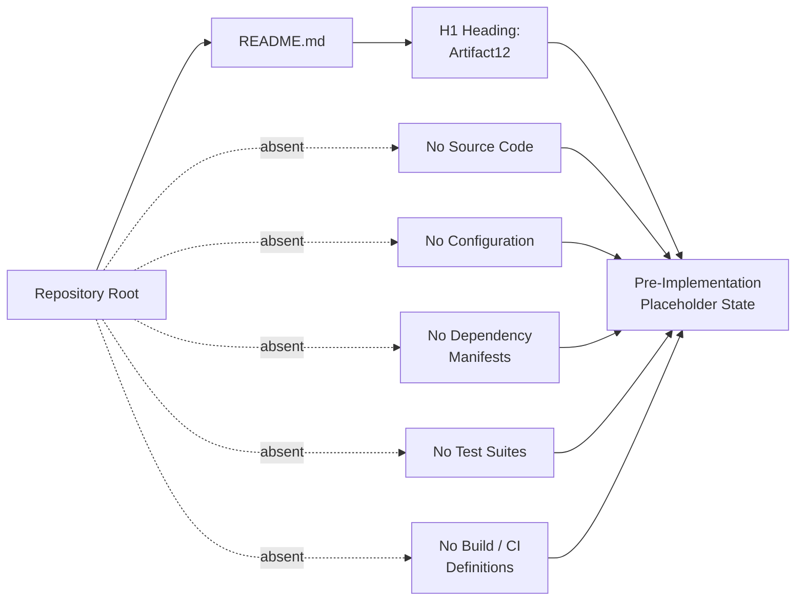

### 1.2.3 Success Criteria

#### Measurable Objectives

The repository documents no measurable objectives. No specification document, design document, or accompanying material defines targets, thresholds, or acceptance criteria for the Artifact12 system.

#### Critical Success Factors

Critical success factors require articulation of stakeholder expectations, business outcomes, and operational requirements — none of which are present in the repository's current state.

#### Key Performance Indicators

No Key Performance Indicators (KPIs) are defined. No service-level objectives (SLOs), service-level agreements (SLAs), performance budgets, throughput targets, latency thresholds, or quality metrics are documented within the repository.

| KPI Category | Defined in Repository |
|--------------|------------------------|
| Functional KPIs (feature adoption, task completion) | No |
| Operational KPIs (uptime, error rate, latency) | No |
| Business KPIs (revenue, conversion, retention) | No |
| Quality KPIs (defect density, test coverage) | No |

## 1.3 Scope

### 1.3.1 In-Scope Elements

#### Core Features and Functionalities

No features or functionalities have been committed to the repository. There are no must-have capabilities, primary user workflows, essential integrations, or key technical requirements specified by any artifact in the source tree.

#### Primary User Workflows

The repository defines no user workflows. No journey maps, user-flow diagrams, sequence descriptions, or interaction specifications are present.

#### Essential Integrations

The repository defines no integration requirements. No external systems, third-party APIs, or partner endpoints are referenced.

#### Key Technical Requirements

The repository documents no technical requirements. Non-functional requirements such as availability, performance, security posture, compliance obligations, and observability targets are entirely absent.

#### Verifiable In-Scope Items

The only element currently in-scope by virtue of repository evidence is the following:

| In-Scope Item | Source of Evidence |
|---------------|--------------------|
| Establishment of project identity | `README.md` (H1 heading: "Artifact12") |

### 1.3.2 Implementation Boundaries

#### System Boundaries

The system has no observable boundaries because no system implementation exists. The repository defines no inputs, outputs, processing surfaces, trust boundaries, or external interfaces from which a system boundary could be derived.

#### User Groups Covered

No user groups, personas, roles, access tiers, or audience segments are defined in the repository.

#### Geographic and Market Coverage

No geographic regions, locales, internationalization requirements, regulatory jurisdictions, or target markets are specified within the repository's contents.

#### Data Domains Included

No data models, database schemas, entity definitions, domain models, or information architecture artifacts exist in the repository. No data classification, retention policy, or stewardship guidance is documented.

### 1.3.3 Out-of-Scope Elements

Because no scope has been positively defined in the repository, the entirety of conceivable application features, capabilities, integrations, and use cases is implicitly out-of-scope at this time. The following table enumerates representative classes of items that the repository does not address:

| Category | Status in Repository |
|----------|----------------------|
| Application features and modules | Not defined |
| External integrations and APIs | Not defined |
| User-facing workflows and interfaces | Not defined |
| Backend services and data persistence | Not defined |

#### Future Phase Considerations

Any future development phases, roadmap items, deferred capabilities, or planned expansions are not described in the repository. No `ROADMAP.md`, `CHANGELOG.md`, milestone document, issue-tracker reference, or planning artifact accompanies the `README.md`. No phase-based delivery plan can be reconstructed from the available evidence.

#### Integration Points Not Covered

Because no integration points have been defined, no exhaustive list of excluded integrations can be produced on an evidence basis. All external integration possibilities are uniformly absent from the current repository state.

#### Unsupported Use Cases

Because no use cases have been articulated, the determination of which use cases are explicitly unsupported cannot be made on the basis of available evidence. All use cases are currently undeclared.

### 1.3.4 Scope Summary

The aggregate scope position of the Artifact12 repository, as derived strictly from observable evidence, is summarized below:

| Scope Dimension | Repository-Evidenced Position |
|-----------------|-------------------------------|
| Positively in-scope | Project identity declaration only |
| Implicitly out-of-scope | All other features, integrations, and use cases |
| Boundary definition | Not present |
| Phase planning | Not present |

#### References

- `README.md` — The sole substantive artifact in the repository. Contains a single H1 heading ("Artifact12") that establishes the project's identity. No additional content (paragraphs, lists, badges, instructions, code samples, or links) is present from which to derive purpose, scope, stakeholders, capabilities, or technical approach. This file serves as the basis for the only positively asserted fact in this section: the project name.
- `` (repository root) — Verified via authoritative directory listing to contain exactly one file (`README.md`) and zero subdirectories. The absence of any other folder or file is the basis for every negative finding (absence of source code, dependencies, configuration, tests, build definitions, integrations, data models, and so on) reported throughout this section.

# 2. Product Requirements

This section documents the discrete, testable product features of the Artifact12 system. In accordance with the section-prompt directive to "only include sections and items that are actually relevant to this system, based on your analysis of its requirements" and to avoid adding "any features of your own, or any items that aren't clearly applicable," this section reports only those features and requirements that are evidenced within the repository. The findings of Sections 1.1, 1.2, and 1.3 — namely, that the repository is in a pre-implementation, placeholder state containing only a single `README.md` file with an H1 heading — establish the upper bound on what can be documented here.

## 2.1 FEATURE CATALOG

### 2.1.1 Catalog Population Status

The Feature Catalog cannot be populated with discrete, testable features. A comprehensive investigation of the repository — conducted via directory enumeration, file-content retrieval, semantic file summaries, and broad-spectrum search across both file and folder name spaces — has established that the repository contains no source code, no specification documents, no design artifacts, no user stories, no acceptance criteria, and no feature definitions from which Feature IDs (in the prescribed `F-XXX` format) could be derived without fabrication.

The repository's verified content topology, as established in Section 1.2.2 (Major System Components), consists exclusively of a single file (`README.md`) whose entire content is the literal text `# Artifact12`. The H1 heading establishes the project's identity but does not enumerate features, describe runtime behaviors, declare functional areas, or specify any capability that would qualify as a discrete, testable feature.

### 2.1.2 Verified Repository Inventory Against Feature Identification

The following table cross-references each Feature Catalog element required by the section prompt against the corresponding evidence (or absence thereof) in the repository:

| Required Catalog Element | Evidence Present | Source of Determination |
|--------------------------|------------------|-------------------------|
| Feature ID (F-XXX) assignments | None | No features defined in any artifact |
| Feature Name declarations | None | `README.md` H1 contains project name only |
| Feature Category taxonomies | None | No categorization schema or feature list exists |
| Priority Level designations | None | No prioritization document or marker exists |
| Status indicators (Proposed/Approved/etc.) | None | No status tracking artifact exists |
| Description / Overview narratives | None | `README.md` contains no descriptive text |
| Business Value statements | None | Section 1.1.5 confirms no value proposition is documented |
| User Benefits statements | None | Section 1.1.4 confirms no user identification exists |
| Technical Context | None | Section 1.2.2 confirms no technical approach is declared |
| Prerequisite Features | None | No feature graph exists |
| System Dependencies | None | No dependency manifest exists |
| External Dependencies | None | No third-party integrations are referenced |
| Integration Requirements | None | Section 1.3.1 confirms no integrations are declared |

### 2.1.3 Feature Metadata Schema (Reserved Template)

Although no features can presently be catalogued, the following schema is preserved as a reserved template for future use, so that subsequent iterations of this Technical Specification — once features are introduced to the repository — can populate it without restructuring the document. The schema is shown empty, with no rows, in keeping with the evidence-based documentation principle established in Sections 1.1 through 1.3.

| Field | Format | Status |
|-------|--------|--------|
| Unique ID | `F-XXX` | Reserved; awaiting first feature commit |
| Feature Name | Free text | Reserved; awaiting first feature commit |
| Feature Category | Free text | Reserved; awaiting first feature commit |
| Priority Level | Critical / High / Medium / Low | Reserved; awaiting first feature commit |
| Status | Proposed / Approved / In Development / Completed | Reserved; awaiting first feature commit |

### 2.1.4 Reason for Empty Catalog

The Feature Catalog is empty because the underlying repository is empty of feature-bearing artifacts. This is consistent with the cumulative findings of Sections 1.1.2 (Repository State Disclosure), 1.2.2 (Major System Components), and 1.3.1 (In-Scope Elements). Fabricating Feature IDs and descriptive entries would directly contravene the section-prompt's explicit guardrail to avoid adding features that are not "clearly applicable" and would breach the factual-grounding standard established throughout this Technical Specification.

## 2.2 FUNCTIONAL REQUIREMENTS

### 2.2.1 Requirements Population Status

No functional requirements have been committed to the repository in any form. Section 1.3.1 (Key Technical Requirements) explicitly establishes that "Non-functional requirements such as availability, performance, security posture, compliance obligations, and observability targets are entirely absent" and that "the repository documents no technical requirements." Because Functional Requirements depend on the existence of features (none of which exist per Section 2.1), no Requirement IDs in the prescribed `F-XXX-RQ-YYY` format can be assigned without fabricating both the parent feature and its child requirements.

### 2.2.2 Requirement Metadata Schema (Reserved Template)

The schema below documents the structure that future functional requirements will follow once features are introduced. It is shown without rows because no requirements presently exist.

| Field | Format | Constraint |
|-------|--------|------------|
| Requirement ID | `F-XXX-RQ-YYY` | Reserved; depends on Feature ID assignment |
| Description | Free text | Must reference a parent Feature ID |
| Acceptance Criteria | Testable predicates | Must be objectively verifiable |
| Priority | Must-Have / Should-Have / Could-Have | Reserved; awaiting product decision |

### 2.2.3 Technical Specifications Status

The technical specification components that would accompany each functional requirement — input parameters, output / response definitions, performance criteria, and data requirements — cannot be populated. The following table records this absence with the corresponding cross-reference:

| Technical Specification Element | Status | Cross-Reference |
|--------------------------------|--------|-----------------|
| Input Parameters | Not documented | Section 1.2.2 (no source code present) |
| Output / Response Definitions | Not documented | Section 1.2.2 (no source code present) |
| Performance Criteria | Not documented | Section 1.2.3 (no KPIs / SLOs / SLAs defined) |
| Data Requirements | Not documented | Section 1.3.2 (no data domains included) |

### 2.2.4 Validation Rules Status

Validation rules — including business rules, data validation rules, security requirements, and compliance requirements — are likewise unrepresented in the repository. The table below records the absence:

| Validation Rule Category | Status | Cross-Reference |
|--------------------------|--------|-----------------|
| Business Rules | Not documented | Section 1.1.3 (no business problem stated) |
| Data Validation | Not documented | Section 1.3.2 (no data domains included) |
| Security Requirements | Not documented | Section 1.3.1 (no security posture stated) |
| Compliance Requirements | Not documented | Section 1.3.2 (no regulatory jurisdictions stated) |

### 2.2.5 Complexity Assessment Status

Complexity ratings (High / Medium / Low) cannot be assigned because complexity assessment requires the prior existence of a requirement statement and an implementation context. Both are absent from the current repository state.

## 2.3 FEATURE RELATIONSHIPS

### 2.3.1 Dependency Map Status

The section prompt instructs the author to "only document feature relationships that are clearly evident in the requirements or source code" and to refrain from imagining "any feature relationships of your own." Because no features have been identified (Section 2.1) and no requirements have been articulated (Section 2.2), no feature relationships can be evidenced. The dependency map is therefore empty.

The following diagram visually represents the absence of feature relationships in a manner consistent with the topology diagram presented in Section 1.2.2:

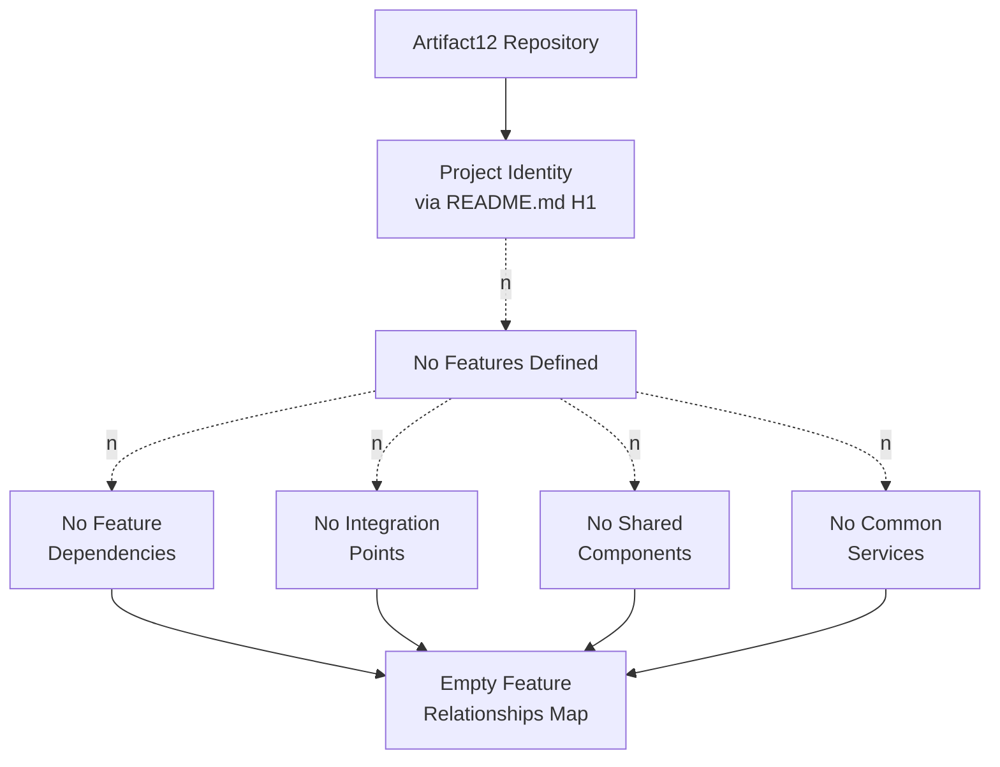

### 2.3.2 Integration Points Status

The repository declares no integration points. Section 1.2.1 (Integration with Existing Enterprise Landscape) confirms that "no integration specifications, API contracts, interface documents, message-broker configurations, or enterprise architecture diagrams exist in the repository." Consequently, no integration relationships — internal or external — can be mapped at this time.

| Integration Point Category | Status |
|----------------------------|--------|
| Inter-feature integration | Not applicable; no features defined |
| External system integration | Not declared in repository |
| API contracts | Not declared in repository |
| Message broker interfaces | Not declared in repository |

### 2.3.3 Shared Components and Common Services

Shared components and common services require the prior existence of multiple consuming features or modules. Section 1.2.2 establishes that the repository contains no source folders, modules, services, libraries, or executable units. The set of shared components is therefore empty, as is the set of common services.

| Cross-Cutting Concern | Status | Cross-Reference |
|-----------------------|--------|-----------------|
| Shared libraries / modules | None present | Section 1.2.2 |
| Common services | None present | Section 1.2.2 |
| Cross-cutting utilities | None present | Section 1.2.2 |
| Reusable interfaces | None present | Section 1.2.2 |

## 2.4 IMPLEMENTATION CONSIDERATIONS

### 2.4.1 Technical Constraints

No technical constraints are documented within the repository, because no implementation exists from which constraints could be derived. Section 1.2.2 (Core Technical Approach) confirms that "no programming language has been selected or evidenced. No frameworks, runtime environments, package managers, build systems, container definitions, or platform targets are declared." The absence of these foundational selections precludes any meaningful documentation of language-specific, framework-specific, or platform-specific constraints.

### 2.4.2 Performance and Scalability Considerations

Performance requirements and scalability considerations are likewise unrepresented. Section 1.2.3 (Key Performance Indicators) confirms that "no service-level objectives (SLOs), service-level agreements (SLAs), performance budgets, throughput targets, latency thresholds, or quality metrics are documented within the repository." Without target performance envelopes, scalability planning has no anchor point, and no implementation considerations of this class can be authored.

| Implementation Consideration | Status | Cross-Reference |
|------------------------------|--------|-----------------|
| Throughput targets | None defined | Section 1.2.3 |
| Latency thresholds | None defined | Section 1.2.3 |
| Scalability envelope | None defined | Section 1.2.3 |
| Resource budgets | None defined | Section 1.2.3 |

### 2.4.3 Security Implications

No security requirements, threat models, trust boundaries, authentication schemes, authorization schemes, or data-protection requirements are documented in the repository. The absence of any system implementation — see Section 1.3.2 (System Boundaries), which notes that "the system has no observable boundaries because no system implementation exists" — means that security implications cannot be assessed on an evidence basis.

### 2.4.4 Maintenance Requirements

Maintenance requirements presuppose a maintainable artifact. With only a single placeholder file in the repository, maintenance considerations such as patch cadence, deprecation policy, dependency-update policy, and operational runbooks cannot be documented. Section 1.3.3 (Future Phase Considerations) records the absence of any planning artifact (`ROADMAP.md`, `CHANGELOG.md`, milestone document, or issue-tracker reference) that would inform maintenance planning.

## 2.5 TRACEABILITY MATRIX

### 2.5.1 Evidence-to-Requirement Traceability

The traceability matrix below maps every Product Requirements element required by the section prompt to its underlying evidence source within the repository. Because no requirements exist, all rows trace to the absence of artifacts and to the cross-referencing sections of this Technical Specification that previously documented that absence.

| Product Requirements Element | Evidence Source | Traceability Outcome |
|------------------------------|-----------------|----------------------|
| Feature Catalog (Section 2.1) | `README.md` content; root folder inventory | No features traceable |
| Functional Requirements (Section 2.2) | `README.md` content; root folder inventory | No requirements traceable |
| Feature Relationships (Section 2.3) | Section 1.2.2 component table | No relationships traceable |
| Implementation Considerations (Section 2.4) | Section 1.2.2; Section 1.2.3 | No considerations traceable |

### 2.5.2 Cross-Section Cross-References

The following cross-references locate, within this Technical Specification, the prior sections whose findings provide the evidentiary basis for the conclusions reported in Section 2:

| Section 2 Subsection | Referenced Section | Nature of Reference |
|----------------------|---------------------|----------------------|
| 2.1 Feature Catalog | 1.1.6 Summary of Verifiable Facts | Confirms only project name is verifiable |
| 2.1 Feature Catalog | 1.2.2 Major System Components | Confirms only `README.md` is present |
| 2.2 Functional Requirements | 1.3.1 Key Technical Requirements | Confirms requirements are absent |
| 2.3 Feature Relationships | 1.2.1 Integration with Existing Enterprise Landscape | Confirms integrations are absent |
| 2.4 Implementation Considerations | 1.2.3 Key Performance Indicators | Confirms KPIs / SLOs / SLAs are absent |

### 2.5.3 Related Process Flowcharts

No process flowcharts have been authored elsewhere in the repository or in this Technical Specification beyond the content topology diagram in Section 1.2.2 and the empty-relationship diagram in Section 2.3.1. No business processes, user journeys, or system flows are documented from which additional flowcharts could be authored.

## 2.6 ASSUMPTIONS AND CONSTRAINTS

### 2.6.1 Documented Assumptions

The following assumptions underlie this Section's reporting. They are explicitly stated to provide full transparency and to facilitate revision once the repository is populated.

| Assumption ID | Assumption Statement | Basis |
|---------------|----------------------|-------|
| A-001 | The repository's current contents constitute the complete and authoritative source of product requirements. | Investigation methodology described in Section 1.1.2 |
| A-002 | No external requirements documents (wikis, tickets, design files) are within the scope of this Technical Specification. | Absence of references in `README.md` |
| A-003 | Fabricating Feature IDs or Requirement IDs would violate the section prompt and the established documentation principles. | Section-prompt guardrails; established voice of Sections 1.1–1.3 |

### 2.6.2 Repository State Constraints

The following constraints — imposed by the current state of the repository — limit what Section 2 can responsibly document:

| Constraint ID | Constraint Statement |
|---------------|----------------------|
| C-001 | No feature-bearing artifacts exist in the repository. |
| C-002 | No requirements documents (formal or informal) exist in the repository. |
| C-003 | No planning artifacts (`ROADMAP.md`, `CHANGELOG.md`, issue tracker references) exist in the repository. |
| C-004 | No design artifacts, schema definitions, or interface specifications exist in the repository. |

### 2.6.3 Requirement Version Tracking

No versioning artifact (e.g., a CHANGELOG, requirements log, or version-history file) is present in the repository. Consequently, no requirement-level version history can be recorded at this time. The version-tracking schema below is reserved for future use.

| Version Tracking Field | Format | Status |
|------------------------|--------|--------|
| Requirement ID | `F-XXX-RQ-YYY` | Reserved |
| Version Number | Semantic | Reserved |
| Change Date | ISO 8601 | Reserved |
| Change Rationale | Free text | Reserved |

## 2.7 SECTION SUMMARY

The Product Requirements section of this Technical Specification has been authored in strict accordance with the section-prompt guardrails, the established evidence-based voice of Sections 1.1 through 1.3, and the verified state of the Artifact12 repository. The aggregate determination is summarized below:

| Product Requirements Dimension | Population Status |
|--------------------------------|-------------------|
| Feature Catalog | Empty; no features evidenced |
| Functional Requirements Tables | Empty; no requirements evidenced |
| Feature Relationships | Empty; no relationships evidenced |
| Implementation Considerations | Empty; no implementation evidenced |
| Traceability Matrix | Populated with absence-tracing rows |
| Assumptions and Constraints | Populated with three assumptions and four constraints |

Once the Artifact12 repository transitions from its current pre-implementation, placeholder state to an active development state — through the introduction of source code, specification documents, design artifacts, or planning materials — Section 2 should be revised in full to populate the reserved schemas with concrete Feature IDs, Requirement IDs, dependency maps, integration points, and implementation considerations.

#### References

#### Files Examined

- `README.md` — The repository's sole substantive file. Verified to contain only the single H1 heading `# Artifact12`. Provides the basis for the only positively asserted fact in this section (project identity) and the basis for every negative finding (absence of features, requirements, relationships, and implementation considerations) reported in this section.

#### Folders Explored

- `` (repository root) — Verified to contain exactly one child (`README.md`) and zero subdirectories. The absence of any source folders, configuration directories, documentation directories, or test directories is the basis for the conclusion that no feature-bearing or requirement-bearing artifacts are present.

#### Technical Specification Sections Cross-Referenced

- **Section 1.1 Executive Summary** — Provided authoritative confirmation of the pre-implementation state, the absence of business problem statements, the absence of stakeholders, and the absence of business value statements. Used to populate Sections 2.1.2, 2.2, and 2.5.2.
- **Section 1.2 System Overview** — Provided the verified Major System Components table, the absence of declared capabilities, and the absence of KPIs / SLOs / SLAs. Used to populate Sections 2.1.2, 2.2.3, 2.3.2, 2.3.3, 2.4.1, 2.4.2, and 2.5.2.
- **Section 1.3 Scope** — Provided confirmation that only project identity declaration is positively in-scope and that all features, integrations, workflows, and use cases are implicitly out-of-scope. Used to populate Sections 2.1.2, 2.2, 2.4.3, 2.4.4, and 2.5.2.

# 3. Technology Stack

This section documents the technology stack of the Artifact12 system. In accordance with the section-prompt directive to "only include sections and items that are actually relevant to this system, based on your analysis of its requirements" and to refrain from adding "any items that aren't clearly applicable," this section reports only those technology selections that are evidenced within the repository. The cumulative findings of Sections 1.1 (Executive Summary), 1.2 (System Overview), 1.3 (Scope), and 2.1 through 2.7 (Product Requirements) — namely, that the repository exists in a pre-implementation, placeholder state containing only a single `README.md` file with an H1 heading — establish the upper bound on what can be documented here. The user-provided default technology stack (AWS, Docker, Python/Flask, MongoDB, React, etc.) is acknowledged but, per repository evidence, no item within it has been committed to the project; the default stack is therefore documented in this section only as a reserved future-direction reference, never as an asserted current selection.

## 3.1 Technology Stack Status and Methodological Framing

### 3.1.1 Pre-Implementation State Disposition

The Artifact12 repository's technology stack cannot be populated with concrete selections. Section 1.1.2 (Repository State Disclosure) establishes that "the complete inventory of repository contents consists of a single file containing a single line of text" and that "no source code, dependency manifests, configuration files, build artifacts, test suites, schema definitions, deployment descriptors, or supplementary documentation are present." Section 1.2.2 (Core Technical Approach) extends this finding to the technology dimension specifically, stating that "no programming language has been selected or evidenced. No frameworks, runtime environments, package managers, build systems, container definitions, or platform targets are declared."

The absence of these foundational artifacts is not an investigative gap but the verified, complete state of the repository. Every subsection that follows reports against this single, authoritative state.

### 3.1.2 Documentation Methodology and Guardrails

This section is governed by the same evidence-based methodology applied throughout Sections 1.1 through 2.7. The following methodological commitments are made explicit:

| Methodological Commitment | Rationale |
|----------------------------|-----------|
| Report only technology selections evidenced by repository artifacts | Section-prompt guardrail; consistent with the voice of Sections 1.1–2.7 |
| Cross-reference prior sections for the authoritative basis of negative findings | Established pattern in Sections 2.1.2, 2.3.2, 2.4.1, 2.4.2, 2.4.3 |
| Refrain from fabricating language, framework, database, or service selections | Assumption A-003 from Section 2.6.1 |
| Reserve schemas for each technology-stack subsection for future population | Pattern established in Sections 2.1.3, 2.2 (reserved tables), and 2.6.3 |

### 3.1.3 Treatment of the User-Provided Default Stack

The user context accompanying this Technical Specification supplies a default technology stack comprising AWS, Docker, Terraform, GitHub Actions, Python, Flask, Auth0, MongoDB, Langchain, React with TypeScript, TailwindCSS, React Native, Swift, Kotlin, Objective-C, and ElectronJS. None of these technologies are referenced, imported, configured, or otherwise selected by any artifact in the Artifact12 repository. Per the section-prompt guardrail and per Constraint C-001 through C-004 from Section 2.6.2, these technologies cannot be presented in this section as the project's chosen stack. They are surfaced — in Section 3.8.3 below — only as a *reserved future-direction reference* whose use is contingent upon explicit selection decisions that have not yet been recorded in the repository.

## 3.2 PROGRAMMING LANGUAGES

### 3.2.1 Programming Language Inventory

No programming language is evidenced in the Artifact12 repository. The single file present (`README.md`) is authored in Markdown, which is a lightweight markup language used for document formatting, not a programming language. No source files bearing language-indicative extensions are present in the repository.

| Required Catalog Element | Evidence Present | Source of Determination |
|--------------------------|------------------|-------------------------|
| Backend / server-side language | None | No source files (`.py`, `.js`, `.ts`, `.go`, `.java`, `.rb`, `.cs`, `.rs`, `.php`) present |
| Frontend / client-side language | None | No source files (`.js`, `.ts`, `.tsx`, `.jsx`, `.html`, `.css`) present |
| Mobile platform languages | None | No source files (`.swift`, `.kt`, `.m`, `.mm`, `.java`) and no project descriptors present |
| Desktop platform languages | None | No source files and no Electron/Tauri/Qt manifest files present |
| Data-processing or scripting languages | None | No `.sql`, `.r`, `.scala`, `.sh`, `.ps1` files present |
| Build / configuration languages | None | No `.yaml`, `.toml`, `.json` configuration files present |

### 3.2.2 Evidence-Based Findings

The determination of language absence rests on two cumulative observations recorded in prior sections:

1. **Section 1.2.2 (Major System Components)** establishes that the only component path is `README.md`, and that "no source folders, modules, services, libraries, executable units, configuration directories, or auxiliary asset paths are present in the repository."
2. **Section 1.2.2 (Core Technical Approach)** states unconditionally that "no programming language has been selected or evidenced."

In the absence of any source file, language-selection criteria such as ecosystem maturity, runtime performance, team expertise, or library availability cannot be argued on an evidence basis. The platform-by-platform language breakdown requested by the section prompt — one language per platform or component — is therefore empty in every row.

### 3.2.3 Reserved Programming Language Schema

The following schema is preserved as a reserved template, so that subsequent revisions of this Technical Specification — once source code is introduced — can populate it without restructuring the document. The schema is shown empty, consistent with the reserved-template pattern established in Sections 2.1.3 and 2.6.3.

| Field | Format | Status |
|-------|--------|--------|
| Component | Free text (e.g., "Backend API", "Web UI", "iOS App") | Reserved; awaiting first source commit |
| Language | Free text (e.g., "Python 3.x", "TypeScript 5.x") | Reserved; awaiting first source commit |
| Version | Semantic version | Reserved; awaiting first source commit |
| Selection Rationale | Free text | Reserved; awaiting first source commit |
| Constraint or Dependency | Free text | Reserved; awaiting first source commit |

## 3.3 FRAMEWORKS & LIBRARIES

### 3.3.1 Framework Inventory

No application framework, runtime library, or supporting library is evidenced in the Artifact12 repository. Section 1.2.2 (Core Technical Approach) is authoritative on this point: "No frameworks, runtime environments, package managers, build systems, container definitions, or platform targets are declared." Consequently, no version pinning, no compatibility matrix, and no upgrade/maintenance policy can be reported.

| Required Catalog Element | Evidence Present | Source of Determination |
|--------------------------|------------------|-------------------------|
| Core backend framework | None | No backend source or manifest |
| Core frontend framework | None | No `package.json`, no `.tsx`/`.jsx`/`.vue`/`.svelte` files |
| Mobile / cross-platform framework | None | No mobile project descriptors |
| Testing framework | None | No `tests/`, `__tests__/`, or `spec/` directory present |
| ORM / data-access library | None | No data-access source present |
| Authentication / authorization library | None | No security-related source present |
| Observability / logging library | None | No instrumentation source present |

### 3.3.2 Evidence-Based Findings

Framework and library selection produces tangible repository artifacts: a manifest file (`package.json`, `requirements.txt`, `pyproject.toml`, `pom.xml`, `Cargo.toml`, `go.mod`, `Gemfile`, `composer.json`, `*.csproj`, or similar), an associated lock file, and one or more directories of installed dependencies (e.g., `node_modules/`, `venv/`, `vendor/`). Section 1.2.2 (Major System Components) confirms that none of these artifacts exist in the Artifact12 repository. The framework inventory is therefore empty by direct evidence, not by inference.

The compatibility requirements requested by the section prompt — version interlocks between core framework and supporting libraries — cannot be assessed because no framework version is declared in the first place.

### 3.3.3 Reserved Frameworks & Libraries Schema

| Field | Format | Status |
|-------|--------|--------|
| Library or Framework Name | Free text | Reserved; awaiting first manifest commit |
| Category | Core / Supporting / Test / Build / Dev | Reserved; awaiting first manifest commit |
| Version | Semantic version | Reserved; awaiting first manifest commit |
| Compatibility Constraint | Free text | Reserved; awaiting first manifest commit |
| Selection Justification | Free text | Reserved; awaiting first manifest commit |

## 3.4 OPEN SOURCE DEPENDENCIES

### 3.4.1 Dependency Inventory

No third-party or open-source library dependencies are declared by the Artifact12 repository. Section 2.1.2 (Verified Repository Inventory Against Feature Identification) records this finding directly: under the row "External Dependencies," the evidence column reports "None" and the source-of-determination column reports "No third-party integrations are referenced." Without a dependency manifest, no registry references can be enumerated and no version pins can be recorded.

| Required Catalog Element | Evidence Present | Source of Determination |
|--------------------------|------------------|-------------------------|
| Declared direct dependencies | None | No manifest file present in repository |
| Declared transitive dependencies | None | No lock file present in repository |
| Package-registry references (npm, PyPI, Maven Central, RubyGems, crates.io, NuGet) | None | No manifest references any registry |
| License inventory of dependencies | None | No dependencies to inventory |
| Vulnerability scanning baseline | None | No dependency list against which to scan |

### 3.4.2 Evidence-Based Findings

The open-source dependency posture of the Artifact12 repository is determined by the absence of every artifact that would normally enumerate dependencies. The following commonly-used dependency descriptors were explicitly checked and verified absent:

| Dependency Manifest Family | Representative Filenames | Present in Repository |
|----------------------------|---------------------------|------------------------|
| JavaScript / Node.js / TypeScript | `package.json`, `package-lock.json`, `yarn.lock`, `pnpm-lock.yaml` | No |
| Python | `requirements.txt`, `pyproject.toml`, `setup.py`, `Pipfile`, `poetry.lock` | No |
| Java / Kotlin | `pom.xml`, `build.gradle`, `build.gradle.kts` | No |
| Rust | `Cargo.toml`, `Cargo.lock` | No |
| Go | `go.mod`, `go.sum` | No |
| Ruby | `Gemfile`, `Gemfile.lock` | No |
| PHP | `composer.json`, `composer.lock` | No |
| .NET | `*.csproj`, `*.sln`, `packages.config` | No |
| iOS / macOS (CocoaPods / SPM) | `Podfile`, `Package.swift` | No |

### 3.4.3 Reserved Open Source Dependencies Schema

| Field | Format | Status |
|-------|--------|--------|
| Package Name | Free text | Reserved; awaiting first manifest commit |
| Registry | npm / PyPI / Maven / etc. | Reserved; awaiting first manifest commit |
| Version Constraint | Semver range | Reserved; awaiting first manifest commit |
| License | SPDX identifier | Reserved; awaiting first manifest commit |
| Direct or Transitive | Enumeration | Reserved; awaiting first manifest commit |

## 3.5 THIRD-PARTY SERVICES

### 3.5.1 Third-Party Service Inventory

No external APIs, authentication providers, monitoring tools, analytics services, payment gateways, content-delivery networks, or cloud-platform services are integrated into the Artifact12 repository. Multiple prior sections converge on this finding:

- **Section 1.2.1 (Integration with Existing Enterprise Landscape)** confirms that "no integration specifications, API contracts, interface documents, message-broker configurations, or enterprise architecture diagrams exist in the repository."
- **Section 1.3.1 (Essential Integrations)** confirms that "the repository defines no integration requirements. No external systems, third-party APIs, or partner endpoints are referenced."
- **Section 2.3.2 (Integration Points Status)** confirms that "the repository declares no integration points."

| Required Catalog Element | Evidence Present | Source of Determination |
|--------------------------|------------------|-------------------------|
| External APIs | None | Section 1.2.1, Section 1.3.1, Section 2.3.2 |
| Authentication / identity providers | None | Section 1.2.1, Section 2.4.3 |
| Monitoring / observability platforms | None | Section 1.2.3 (no KPIs/SLOs/SLAs declared) |
| Cloud-platform services (compute, storage, networking) | None | Section 1.2.2 (no platform target declared) |
| Analytics, telemetry, or experimentation services | None | Section 1.2.3 (no KPIs declared) |
| Payment, billing, or commerce services | None | Section 1.3.1 (no integrations declared) |
| Content delivery / edge networks | None | Section 1.2.2 (no platform target declared) |
| AI / ML / LLM services | None | Section 1.2.2 (no runtime declared) |

### 3.5.2 Evidence-Based Findings

The integration of any third-party service produces detectable artifacts in a repository: an SDK or client-library dependency in a manifest, an environment-variable template referencing service credentials, a service-specific configuration file (e.g., `auth0.json`, `serverless.yml`, `wrangler.toml`), or a code path invoking the service's API. None of these artifact classes are present in the Artifact12 repository — Section 1.2.2 having established that no source code, no dependency manifest, and no configuration files exist. The third-party service inventory is therefore empty by direct evidence.

### 3.5.3 Reserved Third-Party Services Schema

| Field | Format | Status |
|-------|--------|--------|
| Service Name | Free text | Reserved; awaiting first integration commit |
| Service Category | Auth / Monitoring / Cloud / Analytics / Payments / AI / Other | Reserved; awaiting first integration commit |
| Integration Mechanism | REST / GraphQL / gRPC / SDK / Webhook | Reserved; awaiting first integration commit |
| Authentication Mode | API Key / OAuth 2.0 / JWT / mTLS / IAM Role | Reserved; awaiting first integration commit |
| Data Sensitivity Classification | Public / Internal / Confidential / Restricted | Reserved; awaiting first integration commit |

## 3.6 DATABASES & STORAGE

### 3.6.1 Database and Storage Inventory

No primary database, secondary database, caching layer, object store, file storage, or message-queue persistence is declared by the Artifact12 repository. Section 1.3.2 (Data Domains Included) provides the definitive statement: "No data models, database schemas, entity definitions, domain models, or information architecture artifacts exist in the repository. No data classification, retention policy, or stewardship guidance is documented."

| Required Catalog Element | Evidence Present | Source of Determination |
|--------------------------|------------------|-------------------------|
| Primary database (relational or NoSQL) | None | Section 1.3.2; no schema files, no drivers, no connection strings |
| Secondary / analytical database | None | Section 1.3.2 |
| In-memory cache | None | No cache client library, no cache configuration |
| Object / blob storage | None | No storage-service configuration |
| File system layout | None | No persistence directory in repository |
| Message queue / event store | None | Section 1.2.1; no broker configuration |
| Search index | None | No search-engine configuration |
| Data persistence strategy | None | Section 1.3.2 (no domain model) |

### 3.6.2 Evidence-Based Findings

Database and storage selection produces detectable artifacts: schema-definition files (`*.sql`, migration directories), ORM model classes, NoSQL document templates, connection-string templates in environment files, driver dependencies in manifests, and infrastructure-as-code definitions provisioning the storage resource. Section 1.2.2 (Major System Components) and Section 1.3.2 (Data Domains Included) together establish that none of these artifact classes are present. The databases-and-storage inventory is therefore empty by direct evidence.

Caching solutions, similarly, would manifest as a client-library dependency (Redis, Memcached, etc.), a cache-configuration block, or in-application cache-aside code. None are present.

### 3.6.3 Reserved Databases & Storage Schema

| Field | Format | Status |
|-------|--------|--------|
| Storage Component | Free text | Reserved; awaiting first persistence commit |
| Storage Type | Relational / Document / Key-Value / Graph / Time-Series / Object / Cache / Search | Reserved; awaiting first persistence commit |
| Engine and Version | Free text (e.g., "PostgreSQL 16", "Redis 7") | Reserved; awaiting first persistence commit |
| Data Persistence Strategy | Free text | Reserved; awaiting first persistence commit |
| Backup and Recovery Policy | Free text | Reserved; awaiting first persistence commit |
| Data Classification Tier | Public / Internal / Confidential / Restricted | Reserved; awaiting first persistence commit |

## 3.7 DEVELOPMENT & DEPLOYMENT

### 3.7.1 Development and Deployment Inventory

No development tooling, build system, containerization configuration, infrastructure-as-code definition, or continuous-integration / continuous-deployment pipeline is present in the Artifact12 repository. The verified content topology presented in Section 1.2.2 explicitly enumerates this absence via the diagram nodes "No CI/Build Definitions" and "No Configuration."

| Required Catalog Element | Evidence Present | Source of Determination |
|--------------------------|------------------|-------------------------|
| Local development tooling (editor configs, linters, formatters) | None | No `.editorconfig`, `.prettierrc`, `.eslintrc*` present |
| Build system / task runner | None | No `Makefile`, `package.json` scripts, `tox.ini`, `build.gradle` present |
| Containerization (Docker, Podman) | None | No `Dockerfile`, `docker-compose.yml`, `.dockerignore` present |
| Container orchestration (Kubernetes, Nomad) | None | No `*.yaml` manifests, no Helm charts present |
| Infrastructure-as-code (Terraform, Pulumi, CloudFormation, CDK) | None | No `*.tf`, `*.bicep`, `*.yml` template files present |
| Continuous Integration | None | No `.github/workflows/`, `.gitlab-ci.yml`, `Jenkinsfile`, `azure-pipelines.yml`, `.circleci/` present |
| Continuous Deployment | None | No deployment manifest or release-pipeline definition present |
| Secrets management | None | No `.env.example`, no secrets-manager configuration present |
| Quality gates and policy-as-code | None | No CODEOWNERS, no policy files present |

### 3.7.2 Evidence-Based Findings

The development-and-deployment posture of the Artifact12 repository is determined by the comprehensive absence of every artifact class commonly used to define development workflows, build pipelines, container images, and deployment topologies. The following diagnostic checks all resolve to "absent":

| Diagnostic Check | Result |
|------------------|--------|
| Does any `Dockerfile` or container-image definition exist? | No |
| Does any directory named `.github/workflows/` or equivalent CI directory exist? | No |
| Does any IaC file (`*.tf`, `*.bicep`, `*.yaml`) defining cloud resources exist? | No |
| Does any build script (`Makefile`, `package.json` scripts, `build.gradle`) exist? | No |
| Does any test directory (`tests/`, `__tests__/`, `spec/`) exist? | No |
| Does any developer-environment descriptor (`.devcontainer/`, `.vscode/`, `Vagrantfile`) exist? | No |

Without any of these artifacts, the development workflow, the build invocation, the deployment target, and the operational runbook are all undefined.

### 3.7.3 Reserved Development & Deployment Schema

| Field | Format | Status |
|-------|--------|--------|
| Tool / Pipeline Stage | Free text | Reserved; awaiting first tooling commit |
| Tool Vendor / Project | Free text | Reserved; awaiting first tooling commit |
| Version | Semantic version | Reserved; awaiting first tooling commit |
| Trigger or Schedule | Free text | Reserved; awaiting first tooling commit |
| Target Environment | Dev / Staging / Production | Reserved; awaiting first tooling commit |

## 3.8 Technology Stack Topology and Future Direction

### 3.8.1 Verified Absence Topology

The following diagram visualizes the empty technology stack of the Artifact12 repository in the same idiom established by the topology diagram in Section 1.2.2 (Core Technical Approach) and the dependency-map diagram in Section 2.3.1 (Dependency Map Status). Dotted edges denote verified absence; solid edges denote evidenced presence.

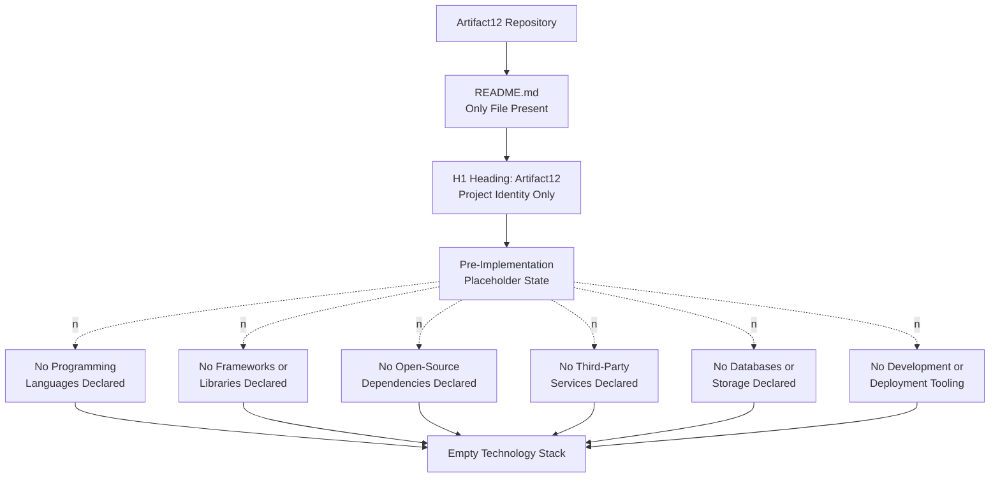

### 3.8.2 Activation Pathway

The activation pathway from the current empty technology stack to a populated stack would, by standard software-engineering practice, follow the sequence visualized below. This pathway is provided as a procedural reference; it does not assert any selection or commitment.


### 3.8.3 Default Technology Stack as Reserved Reference

The user context for this Technical Specification supplies a default technology stack. As established in Section 3.1.3, this default stack is **not** the Artifact12 technology stack — no artifact in the repository selects, configures, imports, or otherwise commits to any of its components. The table below reproduces the default stack solely as a reserved future-direction reference, against which any subsequent selection decisions can be evaluated. Every row carries the same status, "Not committed in repository," to prevent any misreading of this section as an assertion of current selection.

| Default Stack Category | Default Stack Item (per User Context) | Status in Repository |
|------------------------|---------------------------------------|----------------------|
| Cloud Platform | AWS | Not committed in repository |
| Containerization | Docker | Not committed in repository |
| Infrastructure as Code | Terraform | Not committed in repository |
| CI/CD | GitHub Actions | Not committed in repository |
| Backend Language | Python | Not committed in repository |
| Backend Framework | Flask | Not committed in repository |
| Authentication | Auth0 | Not committed in repository |
| Database | MongoDB | Not committed in repository |
| AI Framework | Langchain | Not committed in repository |
| Web Frontend | React with TypeScript | Not committed in repository |
| CSS Framework | TailwindCSS | Not committed in repository |
| Mobile / Cross-Platform | React Native with TypeScript | Not committed in repository |
| iOS Native | Swift | Not committed in repository |
| Android Native | Kotlin | Not committed in repository |
| macOS Native | Objective-C | Not committed in repository |
| Desktop | ElectronJS | Not committed in repository |

When the Artifact12 repository transitions to active development and selections are recorded, this table — or its successor — should be revised to reflect actual commitments, with concrete versions, justifications, and integration requirements substituting the "Not committed in repository" status.

## 3.9 Section Summary

### 3.9.1 Aggregate Determination

The Technology Stack section has been authored in strict accordance with the section-prompt guardrails, the established evidence-based voice of Sections 1.1 through 2.7, and the verified state of the Artifact12 repository. The aggregate determination is summarized below.

| Technology Stack Dimension | Population Status | Authoritative Cross-Reference |
|-----------------------------|-------------------|--------------------------------|
| Programming Languages | Empty; no language evidenced | Section 1.2.2 (Core Technical Approach) |
| Frameworks & Libraries | Empty; no framework evidenced | Section 1.2.2 (Core Technical Approach) |
| Open Source Dependencies | Empty; no manifest evidenced | Section 2.1.2 (External Dependencies row) |
| Third-Party Services | Empty; no integration evidenced | Sections 1.2.1, 1.3.1, 2.3.2 |
| Databases & Storage | Empty; no persistence evidenced | Section 1.3.2 (Data Domains Included) |
| Development & Deployment | Empty; no pipeline evidenced | Section 1.2.2 (verified topology diagram) |
| Default Stack Disposition | Reserved future-direction reference; no commitment | Section 3.1.3, Section 3.8.3 |

### 3.9.2 Revision Trigger Conditions

This Technology Stack section should be revised in full when any of the following events occur in the Artifact12 repository, because each event introduces a category of artifact whose presence would shift one or more subsections from "empty" to "populated":

| Trigger Event | Subsections Requiring Revision |
|---------------|---------------------------------|
| First commit of source code (any language) | 3.2 Programming Languages |
| First commit of a dependency manifest (`package.json`, `requirements.txt`, `pyproject.toml`, `pom.xml`, `Cargo.toml`, `go.mod`, etc.) | 3.3 Frameworks & Libraries; 3.4 Open Source Dependencies |
| First commit of an environment template, SDK reference, or service-configuration file | 3.5 Third-Party Services |
| First commit of a schema file, migration, ORM model, connection-string template, or persistence configuration | 3.6 Databases & Storage |
| First commit of a `Dockerfile`, IaC file, CI workflow, build script, or developer-environment descriptor | 3.7 Development & Deployment |
| Recording of an explicit technology-selection decision in a design or specification artifact | 3.8.3 Default Technology Stack as Reserved Reference; entire section |

Until one or more of these events occurs, the present section remains the definitive — and necessarily empty — Technology Stack documentation for Artifact12.

## 3.10 References

### 3.10.1 Files Examined

- `README.md` — The repository's sole substantive file. Verified to contain only the single H1 heading `# Artifact12`. Provides the basis for the only positively asserted fact relevant to this section (project identity) and the basis for every negative finding (absence of source code, manifests, configurations, integrations, persistence, and tooling) reported throughout this section.

### 3.10.2 Folders Explored

- `` (repository root) — Verified to contain exactly one child (`README.md`) and zero subdirectories. The absence of any source folder (`src/`, `app/`, `lib/`, `pkg/`, `cmd/`, `internal/`, `backend/`, `frontend/`, `client/`, `server/`), configuration folder, deployment folder (`infra/`, `terraform/`, `k8s/`), CI/CD folder (`.github/workflows/`, `.circleci/`), or dependency folder (`node_modules/`, `venv/`, `vendor/`) is the basis for every negative finding in this section.

### 3.10.3 Technical Specification Sections Cross-Referenced

- **Section 1.1 Executive Summary** — Provided authoritative confirmation of the pre-implementation, placeholder state of the repository. Used to ground Sections 3.1.1, 3.2, 3.3, 3.4, 3.5, 3.6, and 3.7.
- **Section 1.2 System Overview** — Specifically Section 1.2.1 (Integration with Existing Enterprise Landscape) and Section 1.2.2 (Major System Components, Core Technical Approach). Provided the most directly applicable cross-references for this section: the explicit statement that "no programming language has been selected or evidenced. No frameworks, runtime environments, package managers, build systems, container definitions, or platform targets are declared," and the absence of integration specifications. Used to ground Sections 3.1.1, 3.2, 3.3, 3.5, and 3.7.
- **Section 1.3 Scope** — Specifically Section 1.3.1 (Essential Integrations, Key Technical Requirements) and Section 1.3.2 (Data Domains Included). Used to ground Sections 3.5 and 3.6.
- **Section 2.1 FEATURE CATALOG** — Specifically Section 2.1.2 (External Dependencies row). Used to ground Section 3.4 (Open Source Dependencies).
- **Section 2.3 FEATURE RELATIONSHIPS** — Specifically Section 2.3.2 (Integration Points Status). Used to ground Section 3.5 (Third-Party Services) and reinforced the absence diagrammatic idiom adopted in Section 3.8.1.
- **Section 2.4 IMPLEMENTATION CONSIDERATIONS** — Specifically Section 2.4.1 (Technical Constraints) and Section 2.4.3 (Security Implications). Used to ground Sections 3.1.1, 3.5, and 3.7.
- **Section 2.6 ASSUMPTIONS AND CONSTRAINTS** — Specifically Assumption A-003 (no fabrication) and Constraints C-001 through C-004 (repository-state constraints). Used to ground Section 3.1.2 (Documentation Methodology and Guardrails) and Section 3.1.3 (Treatment of the User-Provided Default Stack).
- **Section 2.7 SECTION SUMMARY** — Provided the established summary-table idiom subsequently adopted in Section 3.9.1.

# 4. Process Flowchart

This section documents the process flowcharts of the Artifact12 system. In accordance with the section-prompt directive to ground all flowcharts in actual workflows, user journeys, system interactions, and decision points evidenced by the repository, and in accordance with the evidence-based methodology established and applied uniformly across Sections 1.1 through 3.10, this section reports only those process flows that are derivable from the repository's verified contents. The cumulative findings of Sections 1.1 (Executive Summary), 1.2 (System Overview), 1.3 (Scope), 2.1 through 2.7 (Product Requirements), and 3.1 through 3.10 (Technology Stack) — namely, that the repository exists in a pre-implementation, placeholder state containing only a single `README.md` file with an H1 heading and zero subdirectories — establish the upper bound on what process flowcharts can be authored here. Section 2.5.3 (Related Process Flowcharts) further pre-establishes that "no process flowcharts have been authored elsewhere in the repository or in this Technical Specification beyond the content topology diagram in Section 1.2.2 and the empty-relationship diagram in Section 2.3.1" and that "no business processes, user journeys, or system flows are documented from which additional flowcharts could be authored."

## 4.1 Process Flowchart Population Status

### 4.1.1 Authoritative Statement of Absence

No process flowcharts can be authored on the basis of repository evidence. Process flowcharts, by definition, depict the directional flow of activity among actors, systems, decision points, and state transitions within a defined business context. Every constituent of such a depiction — actors, systems, decisions, states, and the business context that binds them — is absent from the Artifact12 repository. The verified content topology recorded in Section 1.2.2 (Major System Components) and the verified inventory in Section 1.1.6 (Summary of Verifiable Facts) jointly establish that the only fact derivable from the repository is the project's name. No workflow, journey, interaction, or process is observable, inferable, or documentable on an evidence basis.

### 4.1.2 Pre-Acknowledged Position from Section 2.5.3

The author of Section 2.5.3 (Related Process Flowcharts) explicitly anticipated the present section and recorded the following authoritative pre-acknowledgment: "No business processes, user journeys, or system flows are documented from which additional flowcharts could be authored." Section 4 therefore confirms, rather than discovers, the absence of process-flowchart-bearing artifacts. The two diagrams referenced in Section 2.5.3 — the content topology diagram in Section 1.2.2 and the empty-relationship diagram in Section 2.3.1 — are presence/absence topologies of repository content and feature relationships, not process flowcharts of business or system behavior. They are preserved as the only flowchart-shaped artifacts derivable from the repository and are deliberately not reproduced here; the present section instead introduces process-domain-specific absence topologies for completeness.

### 4.1.3 Documentation Methodology and Guardrails

This section is governed by the same evidence-based methodology applied throughout Sections 1.1 through 3.10. The following methodological commitments are made explicit:

| Methodological Commitment | Rationale |
|----------------------------|-----------|
| Report only process flows evidenced by repository artifacts | Section-prompt guardrail; consistent with the voice of Sections 1.1–3.10 |
| Cross-reference prior sections for the authoritative basis of negative findings | Established pattern in Sections 2.1.2, 2.3.2, 2.4.1, 3.5.1, 3.6.1, 3.8.1 |
| Refrain from fabricating actors, workflows, decision points, or state machines | Assumption A-003 from Section 2.6.1; Constraints C-001 through C-004 from Section 2.6.2 |
| Reserve schemas for each process-flowchart subsection for future population | Pattern established in Sections 2.1.3, 2.2.2, 2.6.3, 3.2.3, 3.5.3, 3.6.3 |
| Visualize absence using the dotted-edge ("no") idiom established in Sections 1.2.2, 2.3.1, 3.8.1 | Diagrammatic consistency across the Technical Specification |

The user-provided default technology stack (AWS, Docker, Python/Flask, MongoDB, Auth0, React, etc.) is not used as a substitute basis for process flows. Per Section 3.1.3 (Treatment of the User-Provided Default Stack) and Section 3.8.3, the default stack is treated as a reserved future-direction reference and never as an asserted current selection. Section 4 accordingly does not invent Flask request lifecycles, MongoDB transaction flows, Auth0 OAuth handshakes, React rendering pipelines, or any other technology-specific workflow that has not been committed to the repository.

## 4.2 System Workflows Inventory

### 4.2.1 Core Business Processes

Core business processes — comprising end-to-end user journeys, system interactions, decision points, and error-handling paths — are entirely absent from the Artifact12 repository. The absence is authoritatively established by multiple prior sections:

| Required Workflow Element | Evidence Present | Source of Determination |
|---------------------------|------------------|-------------------------|
| End-to-end user journeys | None | Section 1.3.1 confirms "the repository defines no user workflows. No journey maps, user-flow diagrams, sequence descriptions, or interaction specifications are present." |
| System interactions | None | Section 1.2.1 confirms "no integration specifications, API contracts, interface documents, message-broker configurations, or enterprise architecture diagrams exist in the repository." |
| Decision points (business decisions) | None | Section 2.2.4 confirms "Business Rules: Not documented" |
| Error handling paths | None | Section 1.2.2 confirms no source code exists from which error paths could be derived |
| Actor / persona definitions | None | Section 1.1.4 confirms "no stakeholder registry, user persona definitions, role descriptions, or audience identifications appear in the repository" |
| Use case narratives | None | Section 1.3.3 confirms "because no use cases have been articulated, the determination of which use cases are explicitly unsupported cannot be made on the basis of available evidence" |

The Core Business Processes inventory is therefore empty by direct evidence, not by inference.

### 4.2.2 Integration Workflows

Integration workflows — comprising data flow between systems, API interactions, event processing flows, and batch processing sequences — are likewise entirely absent. The absence is authoritatively established by the following cross-references:

| Required Workflow Element | Evidence Present | Source of Determination |
|---------------------------|------------------|-------------------------|
| Data flow between systems | None | Section 2.3.2 confirms "the repository declares no integration points" |
| API interactions | None | Section 3.5.1 confirms "no external APIs, authentication providers, monitoring tools, analytics services, payment gateways, content-delivery networks, or cloud-platform services are integrated" |
| Event processing flows | None | Section 3.6.1 confirms no "message queue / event store" is declared |
| Batch processing sequences | None | Section 1.2.2 confirms no source code or runtime is defined; Section 3.7 (Development & Deployment) confirms no build or scheduling pipeline is declared |
| Synchronous request/response chains | None | Section 3.5.1 (External APIs row) |
| Asynchronous message exchanges | None | Section 3.6.1 (Message queue / event store row) |
| Webhook or callback interactions | None | Section 1.2.1; Section 3.5.1 |

The Integration Workflows inventory is therefore empty by direct evidence, not by inference. The repository declares neither inbound nor outbound integration surfaces, and consequently no integration workflow — synchronous, asynchronous, batch, or streaming — can be depicted.

### 4.2.3 System Workflows Aggregate Determination

The aggregate state of the System Workflows inventory is summarized in the following table:

| Workflow Category | Population Status | Authoritative Cross-Reference |
|--------------------|-------------------|--------------------------------|
| Core Business Processes | Empty; no business workflows evidenced | Section 1.3.1, Section 2.2.4 |
| Integration Workflows | Empty; no integration workflows evidenced | Sections 1.2.1, 2.3.2, 3.5.1, 3.6.1 |
| Internal Service Workflows | Empty; no services evidenced | Section 1.2.2, Section 2.3.3 |
| User-Facing Workflows | Empty; no users or interfaces evidenced | Section 1.1.4, Section 1.3.1 |

## 4.3 Flowchart Constituent Element Status

### 4.3.1 Workflow Anatomy Elements

The section prompt specifies that "for each major workflow," the flowchart must include start and end points, process steps, decision diamonds, system boundaries, user touchpoints, error states and recovery paths, and timing/SLA considerations. Because the underlying workflows do not exist (Section 4.2), none of these constituent elements can be populated. The status of each constituent element, with its authoritative cross-reference, is recorded below:

| Constituent Element | Evidence Present | Source of Determination |
|---------------------|------------------|-------------------------|
| Start points (workflow triggers) | None | Section 1.3.1 confirms no user workflows or trigger conditions exist |
| End points (workflow terminations) | None | Section 1.3.1; Section 2.2.1 (no requirements) |
| Process steps (activity nodes) | None | Section 2.1.1 confirms no discrete features are catalogued |
| Decision diamonds (branching points) | None | Section 2.2.4 (Business Rules: Not documented) |
| System boundaries (trust / network / module) | None | Section 1.3.2 confirms "the system has no observable boundaries because no system implementation exists" |
| User touchpoints (interaction surfaces) | None | Section 1.1.4 (no users defined); Section 1.3.1 (no workflows defined) |
| Error states | None | Section 1.2.2 (no source code from which error states arise) |
| Recovery paths | None | Section 1.2.2; Section 2.4 (no implementation considerations) |
| Timing constraints | None | Section 1.2.3 confirms "no service-level objectives (SLOs), service-level agreements (SLAs), performance budgets, throughput targets, latency thresholds, or quality metrics are documented" |
| SLA / SLO annotations | None | Section 1.2.3 (KPI/SLO/SLA absence) |
| Swim-lane actors | None | Section 1.1.4 (no stakeholders); Section 1.3.2 (no user groups) |

### 4.3.2 Validation Rules Elements

The section prompt further requires documentation of business rules at each step, data validation requirements, authorization checkpoints, and regulatory compliance checks. Each of these validation-rule categories has already been recorded as absent in Section 2.2.4 (Validation Rules Status). For completeness within the process-flowchart domain, the absence is restated here with its authoritative cross-reference:

| Validation Rule Element | Evidence Present | Source of Determination |
|--------------------------|------------------|-------------------------|
| Business rules at each step | None | Section 2.2.4 (Business Rules: Not documented); Section 1.1.3 (no business problem stated) |
| Data validation requirements | None | Section 2.2.4 (Data Validation: Not documented); Section 1.3.2 (no data domains) |
| Authorization checkpoints | None | Section 2.4.3 confirms "no security requirements, threat models, trust boundaries, authentication schemes, authorization schemes, or data-protection requirements are documented" |
| Regulatory compliance checks | None | Section 2.2.4 (Compliance Requirements: Not documented); Section 1.3.2 (no regulatory jurisdictions) |
| Input parameter validation | None | Section 2.2.3 (Input Parameters: Not documented) |
| Output / response validation | None | Section 2.2.3 (Output / Response Definitions: Not documented) |

### 4.3.3 Flowchart Constituent Element Aggregate Determination

The aggregate state of the Flowchart Constituent Element inventory is summarized in the following table:

| Constituent Element Category | Population Status | Authoritative Cross-Reference |
|-------------------------------|-------------------|--------------------------------|
| Workflow Anatomy (start, end, steps, decisions) | Empty; no workflows evidenced | Section 1.3.1, Section 2.1.1, Section 2.2.4 |
| System Boundaries | Empty; no implementation evidenced | Section 1.3.2 |
| User Touchpoints | Empty; no users evidenced | Section 1.1.4, Section 1.3.1 |
| Error States and Recovery Paths | Empty; no source code evidenced | Section 1.2.2 |
| Timing and SLA Annotations | Empty; no KPIs/SLOs/SLAs evidenced | Section 1.2.3 |
| Validation Rules (business, data, security, compliance) | Empty; no requirements evidenced | Section 2.2.4, Section 2.4.3 |

## 4.4 Technical Implementation Workflow Elements

### 4.4.1 State Management Elements

The section prompt requires documentation of state transitions, data persistence points, caching requirements, and transaction boundaries. The Artifact12 repository contains no state machine, no persistence configuration, no caching layer, and no transaction infrastructure. The absence is authoritatively established by Section 3.6.1 (Database and Storage Inventory), which records that "no primary database, secondary database, caching layer, object store, file storage, or message-queue persistence is declared by the Artifact12 repository," and by Section 1.3.2 (Data Domains Included), which records that "no data models, database schemas, entity definitions, domain models, or information architecture artifacts exist in the repository."

| State Management Element | Evidence Present | Source of Determination |
|--------------------------|------------------|-------------------------|
| State transitions (state-machine diagrams) | None | Section 1.3.2 (no data models); Section 2.1.1 (no features) |
| Data persistence points | None | Section 3.6.1 (Database and Storage Inventory: empty) |
| Caching requirements (in-memory or distributed) | None | Section 3.6.1 (In-memory cache row); Section 3.6.2 confirms "no client-library dependency, no cache-configuration block" |
| Transaction boundaries (ACID / saga / compensating) | None | Section 1.3.2 (no data domains); Section 3.6.1 (Data persistence strategy row) |
| Event sourcing / CQRS configurations | None | Section 3.6.1 (Message queue / event store row) |
| Idempotency mechanisms | None | Section 1.2.2 (no source code); Section 3.5.1 (no APIs) |
| Session state management | None | Section 2.4.3 (no authentication or session schemes documented) |

### 4.4.2 Error Handling Elements

The section prompt requires documentation of retry mechanisms, fallback processes, error notification flows, and recovery procedures. The Artifact12 repository contains no source code, no service configuration, and no observability tooling from which any of these error-handling elements could be derived. The absence is authoritatively established by Section 1.2.2 (Major System Components), Section 3.5.1 (Monitoring / observability platforms row), and Section 3.7 (Development & Deployment).

| Error Handling Element | Evidence Present | Source of Determination |
|------------------------|------------------|-------------------------|
| Retry mechanisms (exponential backoff, jitter, dead-letter queues) | None | Section 1.2.2 (no source code); Section 3.6.1 (no message queue) |
| Fallback processes (circuit breakers, graceful degradation) | None | Section 1.2.2; Section 3.5.1 (no third-party services to fall back from) |
| Error notification flows | None | Section 3.5.1 (Monitoring/observability platforms: None); Section 1.2.3 (no alerting KPIs defined) |
| Recovery procedures (manual / automated runbooks) | None | Section 2.4.4 (Maintenance Requirements: absent) |
| Compensating transactions | None | Section 1.3.2 (no data domains); Section 3.6.1 (no persistence) |
| Bulkhead / isolation patterns | None | Section 1.2.2 (no source code or services declared) |
| Logging and audit trails | None | Section 1.2.3 (no observability KPIs); Section 3.5.1 (no observability platforms) |

### 4.4.3 Technical Implementation Aggregate Determination

The aggregate state of the Technical Implementation Workflow Elements inventory is summarized in the following table:

| Implementation Element Category | Population Status | Authoritative Cross-Reference |
|----------------------------------|-------------------|--------------------------------|
| State Management | Empty; no state machine or persistence evidenced | Section 1.3.2, Section 3.6.1 |
| Data Persistence | Empty; no database or storage evidenced | Section 3.6.1 |
| Caching | Empty; no cache client or configuration evidenced | Section 3.6.1, Section 3.6.2 |
| Transaction Boundaries | Empty; no data domains or persistence evidenced | Section 1.3.2, Section 3.6.1 |
| Retry / Fallback Mechanisms | Empty; no source code or service integration evidenced | Section 1.2.2, Section 3.5.1 |
| Error Notification | Empty; no observability platform evidenced | Section 3.5.1 |
| Recovery Procedures | Empty; no operational runbook evidenced | Section 2.4.4 |

## 4.5 Process Topology Diagrams

The following diagrams visualize the empty process-flowchart inventory of the Artifact12 repository in the same diagrammatic idiom established by Sections 1.2.2 (Content Topology), 2.3.1 (Dependency Map), and 3.8.1 (Verified Absence Topology). Dotted edges labeled "no" denote verified absence; solid edges denote evidenced presence. The root node `Repo[Artifact12 Repository]` is preserved across all three diagrams to maintain visual consistency with prior sections.

### 4.5.1 High-Level System Workflow Absence Topology

This diagram visualizes the empty top-level System Workflows inventory described in Section 4.2.

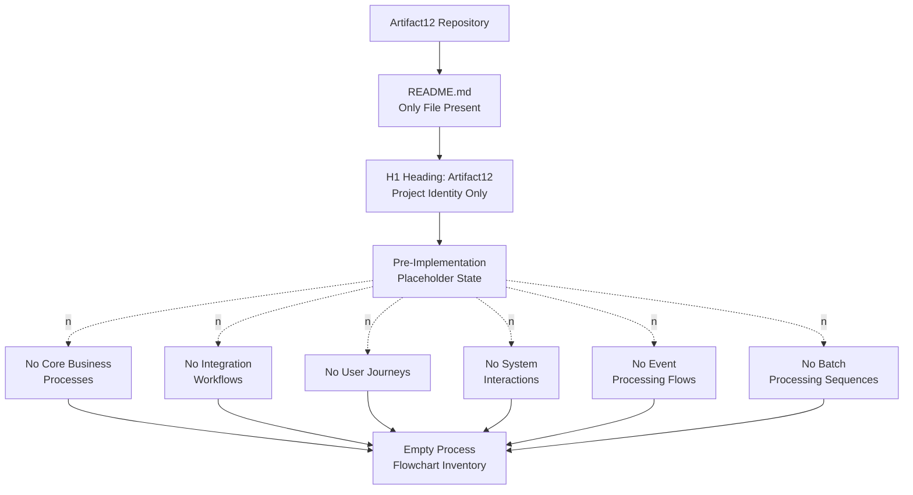

### 4.5.2 Detailed Process Flow Constituent Elements Absence Topology

This diagram visualizes the empty Flowchart Constituent Element inventory described in Section 4.3 and its dependent Validation Rules subgraph.

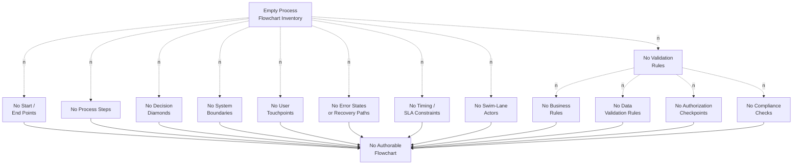

### 4.5.3 State Management and Error Handling Absence Topology

This diagram visualizes the empty Technical Implementation Workflow Elements inventory described in Section 4.4. The diagram preserves the two top-level groupings (state management, error handling) as parallel branches, each enumerating its constituent elements.

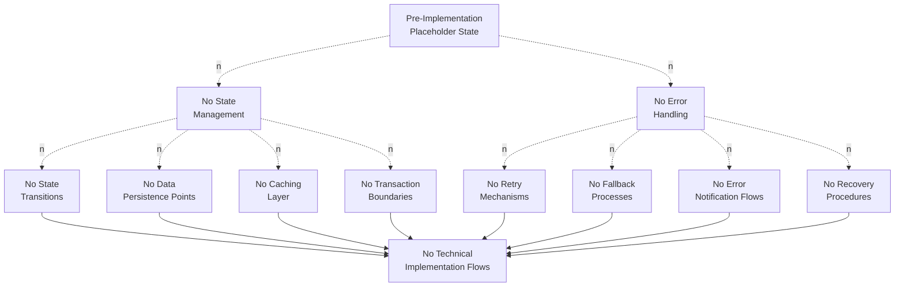

## 4.6 Reserved Process Flowchart Schemas

Although no process flowcharts can presently be authored, the following reserved schemas are preserved for future use, so that subsequent iterations of this Technical Specification — once features, requirements, integrations, and implementations are introduced to the repository — can populate them without restructuring the document. Each schema is shown without rows, in keeping with the evidence-based documentation principle established in Sections 2.1.3, 2.2.2, 2.6.3, 3.2.3, 3.3.3, 3.4.3, 3.5.3, 3.6.3, and 3.7.3.

### 4.6.1 Business Process Catalog Schema (Reserved Template)

| Field | Format | Status |
|-------|--------|--------|
| Process ID | `P-XXX` | Reserved; awaiting first business-process specification commit |
| Process Name | Free text | Reserved; awaiting first business-process specification commit |
| Triggering Event | Free text | Reserved; awaiting first business-process specification commit |
| Participating Actors / Personas | Free text (linked to user-persona registry) | Reserved; awaiting first persona definition (Section 1.1.4) |
| Linked Feature IDs | `F-XXX` references | Reserved; awaiting Feature Catalog population (Section 2.1) |
| Linked Requirement IDs | `F-XXX-RQ-YYY` references | Reserved; awaiting Functional Requirements population (Section 2.2) |
| Success Outcome | Free text | Reserved |
| Failure Outcomes | Free text | Reserved |
| Owning Stakeholder | Free text | Reserved; awaiting stakeholder registry (Section 1.1.4) |

### 4.6.2 Workflow Definition Schema (Reserved Template)

| Field | Format | Status |
|-------|--------|--------|
| Workflow ID | `W-XXX` | Reserved; awaiting first workflow commit |
| Parent Process ID | `P-XXX` reference | Reserved; depends on Business Process Catalog population |
| Step Sequence | Ordered list of step IDs | Reserved |
| Decision Points | List of decision-diamond IDs | Reserved |
| Swim-Lane Actors | List of actor identifiers | Reserved |
| System Boundaries Crossed | List of trust / network / module boundary identifiers | Reserved |
| Synchronicity | Synchronous / Asynchronous / Hybrid | Reserved |
| Expected Duration / SLA | ISO 8601 duration | Reserved; awaiting SLA definition (Section 1.2.3) |

### 4.6.3 State Transition Matrix Schema (Reserved Template)

| Field | Format | Status |
|-------|--------|--------|
| Entity / Aggregate Identifier | Free text | Reserved; awaiting data-model commit (Section 1.3.2) |
| Source State | Free text | Reserved |
| Target State | Free text | Reserved |
| Triggering Event | Free text | Reserved |
| Guard Condition | Boolean expression | Reserved |
| Side-Effect Actions | List of action identifiers | Reserved |
| Persistence Action | Insert / Update / Delete / No-Op | Reserved; awaiting persistence commit (Section 3.6) |
| Transaction Boundary | ACID / Saga / Eventually Consistent | Reserved; awaiting transaction model commit |

### 4.6.4 Error Handling Matrix Schema (Reserved Template)

| Field | Format | Status |
|-------|--------|--------|
| Error Class | Free text (e.g., `TransientNetwork`, `ValidationFailure`) | Reserved; awaiting source-code commit (Section 1.2.2) |
| Originating Step / Component | Reference to step or component ID | Reserved |
| Retry Policy | Exponential backoff / Fixed interval / None / Dead-letter | Reserved |
| Maximum Retry Count | Integer | Reserved |
| Fallback Action | Free text | Reserved |
| Notification Target | Free text (alert channel, on-call rotation) | Reserved; awaiting observability commit (Section 3.5.1) |
| Recovery Procedure | Reference to runbook or automated remediation | Reserved; awaiting operational runbook (Section 2.4.4) |
| Compliance Implication | Reference to regulatory framework | Reserved; awaiting compliance specification (Section 2.2.4) |

## 4.7 Activation Pathway for Process Documentation

This subsection adopts the activation-pathway idiom introduced in Section 3.8.2 (Activation Pathway) and adapts it to the process-flowchart domain. The activation pathway from the current empty Process Flowchart inventory to a populated set of authoritative process flowcharts would, by standard software-engineering practice, follow the sequence visualized and described below. This pathway is provided as a procedural reference; it does not assert any commitment to a specific process design, methodology, or order of work.

### 4.7.1 Activation Pathway Diagram

```mermaid
flowchart LR
    Current[Current State:<br/>Empty Process<br/>Flowchart Inventory] --> Step1[Step 1: Business Problem<br/>and Stakeholder<br/>Articulation]
    Step1 --> Step2[Step 2: Feature Catalog<br/>and Functional<br/>Requirements Authoring]
    Step2 --> Step3[Step 3: User Journey<br/>and Workflow<br/>Specification]
    Step3 --> Step4[Step 4: Integration and<br/>API Contract<br/>Definition]
    Step4 --> Step5[Step 5: State Model and<br/>Data Persistence<br/>Design]
    Step5 --> Step6[Step 6: Error Handling<br/>and SLA<br/>Definition]
    Step6 --> Step7[Step 7: Validation Rules<br/>and Compliance<br/>Checkpoint Definition]
    Step7 --> Populated[Populated Process<br/>Flowchart Inventory<br/>Section 4 Revised in Full]
```

### 4.7.2 Procedural Step Detail

The activation pathway above corresponds to the following procedural sequence. Each step lists the prior section that must first be populated for that step's flowchart work to become authorable:

| Step | Activity | Section That Must First Be Populated |
|------|----------|---------------------------------------|
| Step 1 | Articulate the business problem, the value proposition, and the stakeholder / persona registry | Sections 1.1.3, 1.1.4, 1.1.5 |
| Step 2 | Author the Feature Catalog and the Functional Requirements with verifiable acceptance criteria | Sections 2.1, 2.2 |
| Step 3 | Specify each user journey end-to-end with start triggers, intermediate steps, decision points, and end states | Section 1.3.1 (Primary User Workflows) |
| Step 4 | Define inbound and outbound API contracts, message exchanges, webhooks, and event flows | Sections 1.2.1, 2.3.2, 3.5 |
| Step 5 | Select a persistence technology, design data models, and define transaction boundaries | Sections 1.3.2, 3.6 |
| Step 6 | Establish retry policies, fallback strategies, error notification channels, and recovery runbooks; commit SLAs / SLOs | Sections 1.2.3, 2.4, 3.5 (Monitoring row) |
| Step 7 | Encode business rules, data validation, authorization checkpoints, and regulatory compliance verifications at each step | Sections 2.2.4, 2.4.3 |

Only after these prerequisite sections are populated can the corresponding flowcharts in Section 4 be authored without contravening the evidence-based documentation principle (Assumption A-003, Section 2.6.1).

### 4.7.3 Revision Trigger Conditions

Following the pattern established in Section 3.9.2 (Revision Trigger Conditions), Section 4 should be revised in full when any of the following events occur in the Artifact12 repository, because each event introduces a category of artifact whose presence would shift one or more subsections from "empty" to "populated":

| Trigger Event | Subsections Requiring Revision |
|---------------|---------------------------------|
| First commit of a user-journey specification, BPMN file, sequence diagram, or workflow document | 4.2.1 Core Business Processes; 4.5.1 High-Level System Workflow Absence Topology |
| First commit of an API contract (OpenAPI / GraphQL / gRPC / AsyncAPI) | 4.2.2 Integration Workflows; 4.5.1 High-Level System Workflow Absence Topology |
| First commit of an event schema, message-queue topology, or event-driven flow specification | 4.2.2 Integration Workflows |
| First commit of a feature requirement with decision logic, business rules, or validation predicates | 4.3.1 Workflow Anatomy Elements; 4.3.2 Validation Rules Elements |
| First commit of an SLA, SLO, or performance budget document | 4.3.1 (Timing / SLA rows) |
| First commit of an authentication / authorization specification | 4.3.2 (Authorization Checkpoints row) |
| First commit of a regulatory / compliance specification | 4.3.2 (Regulatory Compliance Checks row) |
| First commit of a data model, schema migration, or state-machine specification | 4.4.1 State Management Elements; 4.5.3 State Management and Error Handling Absence Topology |
| First commit of an error-handling specification, retry policy, or operational runbook | 4.4.2 Error Handling Elements; 4.5.3 State Management and Error Handling Absence Topology |
| Recording of an explicit process-design decision in a design or specification artifact | Entire Section 4 |

Until one or more of these events occurs, the present section remains the definitive — and necessarily empty — Process Flowchart documentation for Artifact12.

## 4.8 Section Summary

### 4.8.1 Aggregate Determination

The Process Flowchart section has been authored in strict accordance with the section-prompt guardrails, the established evidence-based voice of Sections 1.1 through 3.10, and the verified state of the Artifact12 repository. The aggregate determination is summarized below:

| Process Flowchart Dimension | Population Status | Authoritative Cross-Reference |
|------------------------------|-------------------|--------------------------------|
| Core Business Processes | Empty; no business workflows evidenced | Section 1.3.1, Section 2.2.4 |
| Integration Workflows | Empty; no integrations evidenced | Sections 1.2.1, 2.3.2, 3.5.1, 3.6.1 |
| Flowchart Workflow Anatomy | Empty; no workflows evidenced | Section 1.3.1, Section 2.1.1, Section 1.3.2 |
| System Boundaries | Empty; no system implementation evidenced | Section 1.3.2 |
| User Touchpoints | Empty; no users evidenced | Section 1.1.4, Section 1.3.1 |
| Error States and Recovery Paths | Empty; no source code evidenced | Section 1.2.2 |
| Timing / SLA Constraints | Empty; no KPIs/SLOs/SLAs evidenced | Section 1.2.3 |
| Validation Rules | Empty; no requirements evidenced | Section 2.2.4, Section 2.4.3 |
| State Management | Empty; no state machine or persistence evidenced | Section 1.3.2, Section 3.6.1 |
| Error Handling | Empty; no source code or observability evidenced | Section 1.2.2, Section 3.5.1 |
| Reserved Process-Flowchart Schemas | Populated; ready for future use | Section 4.6 |
| Activation Pathway | Populated as procedural reference | Section 4.7 |

### 4.8.2 Relationship to Required Diagram Inventory

The section prompt specifies five required diagram classes — high-level system workflow, detailed process flows for each core feature, error handling flowcharts, integration sequence diagrams, and state transition diagrams. Each of these diagram classes has been addressed within the constraints imposed by the verified empty state of the repository. The mapping is recorded below:

| Required Diagram Class | Treatment in Section 4 |
|------------------------|------------------------|
| High-level system workflow | Replaced by High-Level System Workflow Absence Topology (Section 4.5.1) |
| Detailed process flows for each core feature | Empty by direct evidence; Section 2.1.1 confirms no features are catalogued. Constituent-element absence is depicted in Section 4.5.2 |
| Error handling flowcharts | Replaced by State Management and Error Handling Absence Topology (Section 4.5.3) |
| Integration sequence diagrams | Empty by direct evidence; Section 3.5.1 confirms no third-party integrations. Integration absence is depicted in Section 4.5.1 |
| State transition diagrams | Replaced by State Management and Error Handling Absence Topology (Section 4.5.3); no entities or aggregates exist (Section 1.3.2) |

The activation pathway in Section 4.7.1 provides a forward-looking diagram that depicts the procedural sequence by which the five required diagram classes would become authorable once the repository is populated.

### 4.8.3 Closing Position

Until the repository transitions from its current pre-implementation, placeholder state — through the introduction of workflow specifications, API contracts, feature requirements, data models, error-handling policies, and SLA definitions — Section 4 remains the definitive and necessarily empty Process Flowchart documentation for Artifact12. Revision of this section in full is expected upon the occurrence of any trigger event enumerated in Section 4.7.3.

## 4.9 References

### 4.9.1 Files Examined

- `README.md` — The repository's sole substantive file. Verified to contain only the single H1 heading `# Artifact12`. Provides the basis for the only positively asserted fact relevant to this section (project identity, as cross-referenced from Section 1.1.6) and the basis for every negative finding (absence of business processes, user journeys, integration workflows, decision points, state machines, error-handling mechanisms, and validation rules) reported throughout this section.

### 4.9.2 Folders Explored

- `` (repository root, depth: 0) — Verified via authoritative directory listing to contain exactly one child (`README.md`) and zero subdirectories. The absence of any process-bearing folder (`flows/`, `processes/`, `workflows/`, `bpmn/`, `sequences/`), specification folder (`docs/`, `spec/`, `requirements/`), source folder (`src/`, `app/`, `lib/`, `services/`, `handlers/`), schema folder (`schemas/`, `models/`, `migrations/`), or integration folder (`integrations/`, `connectors/`, `clients/`) is the basis for every negative finding in this section.

### 4.9.3 Technical Specification Sections Cross-Referenced

- **Section 1.1 Executive Summary** — Specifically Sections 1.1.2 (Repository State Disclosure), 1.1.3 (Core Business Problem), 1.1.4 (Stakeholders and Users), 1.1.5 (Business Impact and Value Proposition), 1.1.6 (Summary of Verifiable Facts). Provided authoritative confirmation of the pre-implementation state and the absence of stakeholders, business problem, and value proposition. Used to ground Sections 4.1.1, 4.2.1, 4.3.1, and 4.7.2.
- **Section 1.2 System Overview** — Specifically Sections 1.2.1 (Integration with Existing Enterprise Landscape), 1.2.2 (Major System Components, Core Technical Approach), 1.2.3 (Key Performance Indicators). Provided the most directly applicable cross-references for the negative findings in Sections 4.2.2, 4.3.1, 4.4.2, and 4.7.3, as well as the diagrammatic idiom adopted in Sections 4.5.1, 4.5.2, and 4.5.3.
- **Section 1.3 Scope** — Specifically Sections 1.3.1 (Primary User Workflows, Essential Integrations, Key Technical Requirements), 1.3.2 (System Boundaries, User Groups Covered, Data Domains Included), 1.3.3 (Out-of-Scope Elements). Provided the basis for every negative finding regarding user workflows, system boundaries, data domains, and integration requirements. Used to ground Sections 4.2.1, 4.2.2, 4.3.1, 4.3.2, 4.4.1, and 4.7.2.
- **Section 2.1 FEATURE CATALOG** — Specifically Sections 2.1.1 (Catalog Population Status), 2.1.3 (Feature Metadata Schema). Confirmed that no features can be catalogued, and provided the reserved-schema pattern adopted in Section 4.6. Used to ground Section 4.3.1 and Sections 4.6.1, 4.6.2.
- **Section 2.2 FUNCTIONAL REQUIREMENTS** — Specifically Sections 2.2.1 (Requirements Population Status), 2.2.3 (Technical Specifications Status), 2.2.4 (Validation Rules Status). Provided direct cross-references for every Validation Rules absence in Section 4.3.2 and every Input/Output validation absence in Section 4.6.4.
- **Section 2.3 FEATURE RELATIONSHIPS** — Specifically Section 2.3.1 (Dependency Map Status) and Section 2.3.2 (Integration Points Status). Reinforced the absence diagrammatic idiom adopted in Sections 4.5.1, 4.5.2, 4.5.3 and provided the basis for Section 4.2.2.
- **Section 2.4 IMPLEMENTATION CONSIDERATIONS** — Specifically Sections 2.4.1 (Technical Constraints), 2.4.3 (Security Implications), 2.4.4 (Maintenance Requirements). Provided the basis for Section 4.3.2 (Authorization Checkpoints), Section 4.4.2 (Recovery Procedures), and Section 4.6.4 (Recovery Procedure field).
- **Section 2.5 TRACEABILITY MATRIX** — Specifically Section 2.5.3 (Related Process Flowcharts), which explicitly pre-acknowledged the impossibility of authoring process flowcharts from the present repository state. Used to ground Sections 4.1.1 and 4.1.2.
- **Section 2.6 ASSUMPTIONS AND CONSTRAINTS** — Specifically Assumption A-003 (no fabrication) from Section 2.6.1 and Constraints C-001 through C-004 (repository-state constraints) from Section 2.6.2. Used to ground Section 4.1.3 (Documentation Methodology and Guardrails).
- **Section 2.7 SECTION SUMMARY** — Provided the established summary-table idiom adopted in Section 4.8.1.
- **Section 3.1 Technology Stack Status and Methodological Framing** — Specifically Section 3.1.3 (Treatment of the User-Provided Default Stack). Established the guardrail prohibiting any process-flow inference from the user-provided default stack. Used to ground Section 4.1.3.
- **Section 3.5 THIRD-PARTY SERVICES** — Specifically Section 3.5.1 (Third-Party Service Inventory). Provided the basis for the absence of API interactions, authentication/authorization flows, and observability/notification flows. Used to ground Sections 4.2.2, 4.3.2, and 4.4.2.
- **Section 3.6 DATABASES & STORAGE** — Specifically Sections 3.6.1 (Database and Storage Inventory) and 3.6.2 (Evidence-Based Findings). Provided the basis for the absence of data persistence points, caching layers, transaction boundaries, and message queues. Used to ground Sections 4.2.2, 4.4.1, and 4.5.3.
- **Section 3.7 DEVELOPMENT & DEPLOYMENT** — Provided supporting evidence for the absence of batch processing pipelines, scheduled jobs, and CI/CD-driven workflow execution. Used to ground Section 4.2.2.
- **Section 3.8 Technology Stack Topology and Future Direction** — Specifically Sections 3.8.1 (Verified Absence Topology) and 3.8.2 (Activation Pathway). Established the diagrammatic idioms adopted in Sections 4.5.1, 4.5.2, 4.5.3, and 4.7.1.
- **Section 3.9 Section Summary** — Specifically Section 3.9.2 (Revision Trigger Conditions). Established the trigger-table idiom adopted in Section 4.7.3.
- **Section 3.10 References** — Established the References-subsection structure (Files Examined, Folders Explored, Technical Specification Sections Cross-Referenced) adopted in this Section 4.9.

# 5. System Architecture

This section documents the system architecture of the Artifact12 system. In accordance with the section-prompt directive to "only include sections and items that are actually relevant to this system, based on your analysis of its requirements" and to refrain from documenting items that are not "clearly applicable," this section reports only those architectural elements that are evidenced by the repository's verified contents. The cumulative findings of Sections 1.1 (Executive Summary), 1.2 (System Overview), 1.3 (Scope), 2.1 through 2.7 (Product Requirements), 3.1 through 3.10 (Technology Stack), and 4.1 through 4.9 (Process Flowchart) — namely, that the Artifact12 repository exists in a **pre-implementation, placeholder state** containing only a single `README.md` file with an H1 heading (`# Artifact12`) and zero subdirectories — establish the upper bound on what system-architecture content can be authored here.

Per Section 1.2.2 (Core Technical Approach), "no programming language has been selected or evidenced. No frameworks, runtime environments, package managers, build systems, container definitions, or platform targets are declared." Per Section 1.3.2 (System Boundaries), "the system has no observable boundaries because no system implementation exists." Per Section 3.9.1 (Aggregate Determination), every dimension of the technology stack — programming languages, frameworks, dependencies, third-party services, databases, and development/deployment tooling — is empty. These authoritative cross-references establish that no architectural style, no component decomposition, no inter-component communication pattern, no data flow, no integration topology, and no cross-cutting concern can be documented on an evidence basis.

This section accordingly takes the same form adopted by Sections 3 and 4: it explicitly reports the verified empty state of each architectural dimension, it preserves the established dotted-edge ("no") absence-topology diagrammatic idiom from Sections 1.2.2, 2.3.1, 3.8.1, and 4.5, it reserves schemas for every architectural artifact class so that subsequent iterations can populate them without restructuring, and it concludes with an activation pathway and a set of revision triggers that delineate the conditions under which this section will become authorable in concrete terms.

## 5.1 HIGH-LEVEL ARCHITECTURE

### 5.1.1 Documentation Methodology and Guardrails

This subsection is governed by the same evidence-based methodology applied throughout Sections 1.1 through 4.9. The following methodological commitments are made explicit so that this section can be audited against the established voice of the Technical Specification:

| Methodological Commitment | Rationale |
|----------------------------|-----------|
| Report only architectural elements evidenced by repository artifacts | Section-prompt guardrail; consistent voice of Sections 1.1–4.9 |
| Cross-reference prior sections for the authoritative basis of negative findings | Established pattern in Sections 2.1.2, 2.3.2, 2.4.1, 3.5.1, 3.6.1, 3.8.1, 4.1.3 |
| Refrain from fabricating components, interfaces, integrations, decisions, or flows | Assumption A-003 from Section 2.6.1; Constraints C-001 through C-004 from Section 2.6.2 |
| Reserve schemas for each architectural subsection for future population | Pattern established in Sections 2.1.3, 2.2.2, 2.6.3, 3.2.3, 3.5.3, 3.6.3, 4.6 |
| Visualize absence using the dotted-edge ("no") idiom established earlier | Diagrammatic consistency with Sections 1.2.2, 2.3.1, 3.8.1, 4.5 |

Consistent with Section 3.1.3 (Treatment of the User-Provided Default Stack) and Section 4.1.3, the user-provided default technology stack (AWS, Docker, Terraform, GitHub Actions, Python, Flask, Auth0, MongoDB, Langchain, React with TypeScript, TailwindCSS, React Native, Swift, Kotlin, Objective-C, and ElectronJS) is **not** used as a substitute basis for the system architecture. Section 5 accordingly does not invent a Flask-on-AWS request lifecycle, a MongoDB persistence topology, an Auth0 authentication flow, a React rendering pipeline, a Terraform-managed infrastructure boundary, or any other technology-specific architectural element that has not been committed to the repository.

### 5.1.2 System Overview

#### Architectural Style and Rationale

No architectural style has been selected for the Artifact12 system. The selection of an architectural style — monolithic, layered, hexagonal, microservices, event-driven, serverless, modular monolith, or any hybrid thereof — requires, at minimum, a defined business problem, a set of functional and non-functional requirements, a committed technology stack, and a deliberate decomposition decision. None of these prerequisites are present:

- Section 1.1.3 (Core Business Problem) confirms that "the repository does not document a business problem statement."
- Section 1.3.1 (Core Features and Functionalities) confirms that "no features or functionalities have been committed to the repository."
- Section 2.4.2 (Performance and Scalability Considerations) confirms that "no service-level objectives (SLOs), service-level agreements (SLAs), performance budgets, throughput targets, latency thresholds, or quality metrics are documented."
- Section 3.9.1 (Aggregate Determination) confirms that every technology-stack dimension is empty.

In the absence of these inputs, an architectural style cannot be evidenced, inferred, or defensibly assigned. The repository's verified topology — a single documentation file at the root — represents the smallest possible repository state, and it constitutes a placeholder rather than an architectural pattern.

#### Key Architectural Principles and Patterns

No architectural principles have been declared. There are no design documents, no `ARCHITECTURE.md`, no `CONTRIBUTING.md`, no Architecture Decision Records, no design-pattern references, and no annotated diagrams within the repository. Section 1.3.3 (Future Phase Considerations) records the absence of any planning artifact (`ROADMAP.md`, `CHANGELOG.md`, milestone document, or issue-tracker reference) that might encode principles by implication.

#### System Boundaries and Major Interfaces

The system has no observable boundaries. Section 1.3.2 (System Boundaries) provides the authoritative statement: "The system has no observable boundaries because no system implementation exists. The repository defines no inputs, outputs, processing surfaces, trust boundaries, or external interfaces from which a system boundary could be derived." Consequently, no major interfaces — inbound APIs, outbound integrations, user-facing surfaces, administrative consoles, message-queue endpoints, or batch ingestion points — can be documented. Section 2.3.2 (Integration Points Status) further confirms that "the repository declares no integration points."

### 5.1.3 Core Components Table

The complete enumeration of components in the Artifact12 repository, derived strictly from the verified content topology in Section 1.2.2 (Major System Components), is presented below. The table preserves the four-column constraint specified by the section prompt.

| Component Name | Primary Responsibility | Key Dependencies | Integration Points |
|----------------|------------------------|------------------|---------------------|
| `README.md` | Establishes project identity ("Artifact12") via a single H1 heading | None evidenced (no manifest, no imports, no SDKs) | None evidenced (no inbound or outbound interfaces) |

**Critical Considerations** (treated as supplementary prose to preserve the four-column table constraint): `README.md` is a static documentation file. It declares no runtime behavior, no executable surface, no dependency, no configuration parameter, and no integration surface. It is not a component in the architectural sense; it is the sole artifact in a pre-implementation repository, surfaced here for completeness so that this table can be evolved — rather than reconstructed — when implementation components are first introduced.

No other components — services, modules, libraries, executables, daemons, frontends, backends, gateways, brokers, caches, schedulers, batch jobs, or persistence layers — exist in the repository.

### 5.1.4 Data Flow Description

No primary data flows can be documented. The documentation of data flows requires, at minimum, two communicating endpoints, a transport protocol, a data representation, and a directional ordering. The following authoritative cross-references establish that none of these constituents are present:

- **Communicating endpoints.** Section 1.2.2 (Major System Components) records that "no source folders, modules, services, libraries, executable units, configuration directories, or auxiliary asset paths are present." Section 2.3.3 (Shared Components and Common Services) records that shared libraries, common services, cross-cutting utilities, and reusable interfaces are uniformly "None present."
- **Transport protocols.** Section 3.5.1 (Third-Party Service Inventory) records the absence of "external APIs, authentication providers, monitoring tools, analytics services, payment gateways, content-delivery networks, or cloud-platform services." No REST, GraphQL, gRPC, AsyncAPI, AMQP, MQTT, or proprietary protocol is referenced.
- **Data representations.** Section 1.3.2 (Data Domains Included) records that "no data models, database schemas, entity definitions, domain models, or information architecture artifacts exist in the repository."
- **Directional ordering.** Section 4.2.2 (Integration Workflows) records that "data flow between systems," "API interactions," "event processing flows," "batch processing sequences," "synchronous request/response chains," "asynchronous message exchanges," and "webhook or callback interactions" are uniformly absent.

#### Integration Patterns and Protocols

No integration patterns (request-response, publish-subscribe, event sourcing, CQRS, saga, claim-check, message router, etc.) and no integration protocols (HTTP/1.1, HTTP/2, HTTP/3, gRPC, WebSocket, AMQP, Kafka protocol, MQTT, NATS, etc.) can be documented. The basis for this determination is recorded in Section 4.2.2 (Integration Workflows) and Section 3.5.1 (Third-Party Service Inventory).

#### Data Transformation Points

No data transformation points (parsers, serializers, mappers, validators, projection builders, denormalizers, aggregators, enrichers, etc.) can be documented. The repository contains no source code from which transformation logic could be observed (Section 1.2.2), no schema artifacts from which transformation contracts could be derived (Section 1.3.2), and no integration surface across which data could be transformed (Section 2.3.2).

#### Key Data Stores and Caches

No data stores and no caches can be documented. Section 3.6.1 (Database and Storage Inventory) is the authoritative cross-reference: "No primary database, secondary database, caching layer, object store, file storage, or message-queue persistence is declared by the Artifact12 repository." Section 4.4.1 (State Management Elements) reinforces this finding: data persistence points, caching requirements, and transaction boundaries are uniformly "None."

### 5.1.5 External Integration Points

No external integration points exist. The repository declares no inbound or outbound integration surface, no third-party SDK, no environment template referencing service credentials, and no service-specific configuration file. The following cross-references converge on this finding: Section 1.2.1 (Integration with Existing Enterprise Landscape), Section 1.3.1 (Essential Integrations), Section 2.3.2 (Integration Points Status), and Section 3.5.1 (Third-Party Service Inventory). The External Integration Points table is therefore presented below as a reserved schema with no committed rows, in keeping with the reserved-schema convention established in Sections 2.1.3, 2.2.2, 2.6.3, 3.2.3, 3.3.3, 3.4.3, 3.5.3, 3.6.3, 3.7.3, and 4.6.

| System Name | Integration Type | Data Exchange Pattern | Protocol / Format |
|-------------|------------------|-----------------------|---------------------|
| *(Reserved; awaiting first external integration commit)* | *(Reserved)* | *(Reserved)* | *(Reserved)* |

**SLA Requirements** (treated as supplementary prose to preserve the four-column table constraint): No SLA requirements have been declared. Section 1.2.3 (Key Performance Indicators) is the authoritative cross-reference — "no service-level objectives (SLOs), service-level agreements (SLAs), performance budgets, throughput targets, latency thresholds, or quality metrics are documented within the repository." When external integrations are first committed, this field should record availability targets, latency budgets, throughput envelopes, error-rate ceilings, and notification SLAs negotiated with each integrated system.

### 5.1.6 High-Level Architecture Absence Topology

The following diagram visualizes the verified empty state of the high-level architecture in the diagrammatic idiom established by Sections 1.2.2 (Content Topology), 2.3.1 (Empty Dependency Map), 3.8.1 (Verified Absence Topology), and 4.5.1 (High-Level System Workflow Absence Topology). Dotted edges labeled `no` denote verified absence; solid edges denote evidenced presence. The root node `Repo[Artifact12 Repository]` is preserved across this diagram and all subsequent diagrams in Section 5 to maintain visual consistency with prior sections.

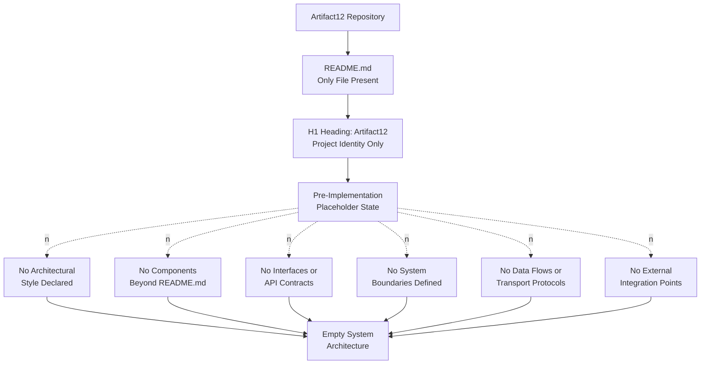

## 5.2 COMPONENT DETAILS

### 5.2.1 Component Inventory Status

The repository contains exactly one component, the `README.md` documentation file. Per the section-prompt directive, the following dimensions are specified for each component. For the single evidenced component, the dimensions resolve as follows:

| Component Dimension | Determination for `README.md` |
|---------------------|--------------------------------|
| Purpose and responsibilities | Establishes the project identity "Artifact12" via a single H1 heading |
| Technologies and frameworks used | None; the file is plain Markdown text (no executable framework involved) |
| Key interfaces and APIs | None; the file declares no programmatic surface |
| Data persistence requirements | None; the file is static text, not a data-bearing component |
| Scaling considerations | Not applicable; the file is a static documentation artifact |

No other components — service components, library components, frontend components, mobile components, background-worker components, scheduled-job components, gateway components, edge components, persistence components, or analytics components — exist in the repository. Section 1.2.2 (Major System Components) and Section 2.3.3 (Shared Components and Common Services) are the authoritative cross-references for this determination.

### 5.2.2 Reserved Component Specification Schema

Although no implementation components can presently be specified, the following reserved schema is preserved for future use, so that subsequent iterations of this Technical Specification — once implementation components are introduced to the repository — can populate it without restructuring the document. The schema is shown without rows, in keeping with the evidence-based documentation principle established across the Technical Specification.

| Field | Format | Status |
|-------|--------|--------|
| Component ID | `C-XXX` | Reserved; awaiting first component commit |
| Component Name | Free text | Reserved; awaiting first component commit |
| Purpose and Responsibilities | Free text | Reserved |
| Technologies and Frameworks | List of stack items linked to Section 3 | Reserved; depends on Section 3 population |
| Key Interfaces and APIs | List of API contract identifiers | Reserved; depends on Section 5.1.5 population |
| Data Persistence Requirements | Reference to storage components in Section 3.6 | Reserved; depends on Section 3.6 population |
| Scaling Considerations | Horizontal / Vertical / Stateless / Stateful | Reserved; depends on Section 2.4.2 population |
| Linked Feature IDs | `F-XXX` references | Reserved; depends on Section 2.1 population |
| Linked Requirement IDs | `F-XXX-RQ-YYY` references | Reserved; depends on Section 2.2 population |
| Owning Stakeholder | Free text | Reserved; depends on Section 1.1.4 population |

### 5.2.3 Component Interaction Topology (Absence)

The following diagram visualizes the empty component-interaction inventory. Because exactly one component exists — and that component is a static documentation file — no inter-component interactions are possible. The diagram preserves the established absence-topology idiom.

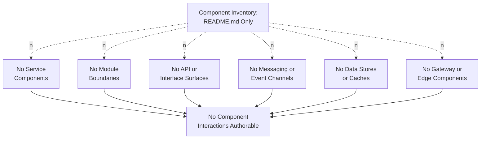

### 5.2.4 State Transition Topology (Absence)

The following diagram visualizes the empty state-transition inventory. The repository contains no entities, no aggregates, no domain objects, and no state-bearing data structures from which a state machine could be authored. Section 1.3.2 (Data Domains Included), Section 3.6.1 (Database and Storage Inventory), and Section 4.4.1 (State Management Elements) provide the authoritative cross-references.

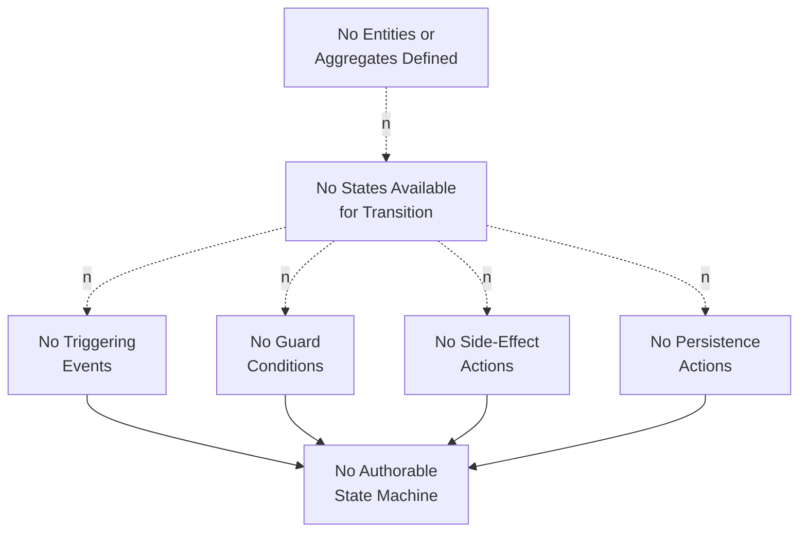

### 5.2.5 Sequence Diagram Topology (Absence)

The following diagram visualizes the empty sequence-diagram inventory. A sequence diagram requires, at minimum, two participants exchanging at least one message in a defined temporal order. The repository contains exactly one component (a static documentation file), no defined actors or personas (per Section 1.1.4), and no message exchange surfaces (per Section 3.5.1 and Section 4.2.2). Consequently, no sequence flow — synchronous, asynchronous, or hybrid — can be authored.

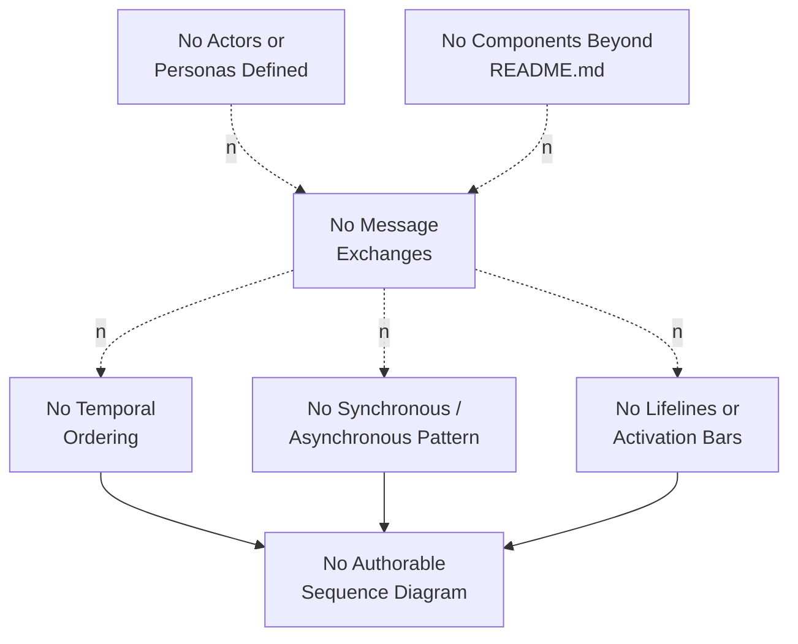

## 5.3 TECHNICAL DECISIONS

### 5.3.1 Architecture Decision Records Status

No Architecture Decision Records (ADRs) exist in the Artifact12 repository. There is no `docs/adr/` folder, no `decisions/` folder, no `architecture/` folder, no Markdown ADR file, and no design document of any form. Section 1.3.3 (Future Phase Considerations) is the authoritative cross-reference: "No `ROADMAP.md`, `CHANGELOG.md`, milestone document, issue-tracker reference, or planning artifact accompanies the `README.md`." Per Assumption A-003 from Section 2.6.1, no ADRs can be retroactively fabricated to substitute for this absence.

### 5.3.2 Decision Dimensions Catalog Status

The section prompt requires documentation and justification for five classes of technical decision. Each is enumerated below with its evidenced status and the authoritative cross-reference grounding the negative finding:

| Decision Class | Evidenced Status | Authoritative Cross-Reference |
|----------------|------------------|-------------------------------|
| Architecture style decisions and tradeoffs | No decision recorded; no architecture style declared | Section 5.1.2; Section 1.2.2 |
| Communication pattern choices (sync / async / hybrid) | No decision recorded; no communication surface exists | Section 4.2.2; Section 3.5.1 |
| Data storage solution rationale | No decision recorded; no persistence declared | Section 3.6.1; Section 1.3.2 |
| Caching strategy justification | No decision recorded; no caching layer declared | Section 3.6.1 (In-memory cache row); Section 4.4.1 |
| Security mechanism selection | No decision recorded; no security scheme declared | Section 2.4.3; Section 3.5.1 (Authentication providers row) |

### 5.3.3 Reserved Architecture Decision Record Schema

The following reserved ADR schema follows the canonical ADR structure popularized by Michael Nygard and is preserved for future use, so that the first architectural decisions recorded in the repository can be captured in a consistent, auditable form.

| Field | Format | Status |
|-------|--------|--------|
| ADR Identifier | `ADR-XXXX` (zero-padded sequence) | Reserved; awaiting first decision commit |
| Title | Short imperative phrase | Reserved |
| Status | Proposed / Accepted / Deprecated / Superseded | Reserved |
| Context | Free text describing forces at play | Reserved |
| Decision | Free text articulating the selection | Reserved |
| Consequences | Positive, negative, and neutral outcomes | Reserved |
| Alternatives Considered | List of options not selected with rationale | Reserved |
| Superseded By | Reference to a later ADR identifier | Reserved |
| Linked Requirements | `F-XXX-RQ-YYY` references | Reserved; depends on Section 2.2 |
| Linked Components | `C-XXX` references | Reserved; depends on Section 5.2.2 |

### 5.3.4 Decision Tree Topology (Absence)

The following diagram visualizes why no architectural decision can presently be authored. Each gate corresponds to a prerequisite that must be satisfied before a defensible decision is possible; the dotted edges depict the unsatisfied state of each prerequisite, with explicit cross-references to the authoritative section that records the absence.

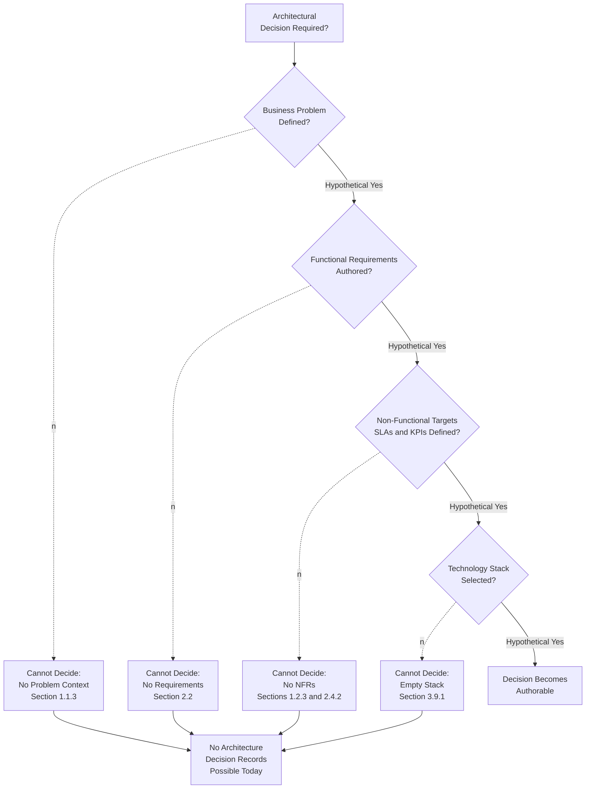

## 5.4 CROSS-CUTTING CONCERNS

### 5.4.1 Monitoring and Observability Status

No monitoring or observability layer has been declared. Section 3.5.1 (Third-Party Service Inventory) records that "monitoring / observability platforms" are uniformly "None"; Section 1.2.3 (Key Performance Indicators) records that "no service-level objectives (SLOs), service-level agreements (SLAs), performance budgets, throughput targets, latency thresholds, or quality metrics are documented within the repository." Consequently, no metric pipelines, no APM agents, no distributed tracing systems, no dashboards, no alerting rules, and no on-call rotations can be documented.

### 5.4.2 Logging and Tracing Status

No logging or tracing strategy has been declared. The repository contains no source code from which logging-statement conventions could be observed (Section 1.2.2), no configuration file declaring a log sink (Section 3.7), and no third-party observability service through which traces could be exported (Section 3.5.1). Consequently, no log-level taxonomy, no structured-logging schema, no correlation-ID propagation strategy, no W3C Trace Context adoption, no log-retention policy, and no log-aggregation pipeline can be documented.

### 5.4.3 Error Handling Status

No error-handling framework has been declared. Section 4.4.2 (Error Handling Elements) is the authoritative cross-reference: retry mechanisms, fallback processes, error notification flows, recovery procedures, compensating transactions, bulkhead / isolation patterns, and logging / audit trails are uniformly "None." With no source code from which error paths could be derived (Section 1.2.2) and no third-party service from which error contracts could be inherited (Section 3.5.1), no error-handling pattern can be evidenced.

### 5.4.4 Authentication and Authorization Framework Status

No authentication or authorization framework has been declared. Section 2.4.3 (Security Implications) provides the authoritative statement: "No security requirements, threat models, trust boundaries, authentication schemes, authorization schemes, or data-protection requirements are documented in the repository." Section 3.5.1 (Authentication / identity providers row) confirms that no identity provider is integrated. Consequently, no identity-issuance mechanism (OAuth 2.0, OpenID Connect, SAML, API key, mTLS), no token format (JWT, opaque, biscuit), no authorization model (RBAC, ABAC, ReBAC, PBAC), no session-management strategy, no policy decision point, and no policy enforcement point can be documented.

### 5.4.5 Performance Requirements and SLAs Status

No performance requirements or service-level agreements have been declared. Section 1.2.3 (Key Performance Indicators) and Section 2.4.2 (Performance and Scalability Considerations) jointly establish that throughput targets, latency thresholds, scalability envelope, and resource budgets are uniformly "None defined." The following table reproduces the authoritative determination for the performance-and-SLA dimension:

| Performance / SLA Dimension | Evidenced Status | Cross-Reference |
|------------------------------|------------------|------------------|
| Throughput targets (RPS, TPS, msgs/sec) | None defined | Section 1.2.3; Section 2.4.2 |
| Latency thresholds (p50, p95, p99) | None defined | Section 1.2.3; Section 2.4.2 |
| Availability targets (uptime, error budget) | None defined | Section 1.2.3 |
| Scalability envelope (concurrent users, peak load) | None defined | Section 2.4.2 |
| Resource budgets (CPU, memory, network, storage) | None defined | Section 2.4.2 |

### 5.4.6 Disaster Recovery Status

No disaster-recovery procedures have been declared. The documentation of disaster recovery requires a defined persistence layer (so that recovery point objectives can be evaluated), a defined deployment topology (so that recovery time objectives can be evaluated), a defined operational runbook, and a defined regulatory or contractual obligation framework. Each of these prerequisites is independently absent:

- **Persistence layer.** Section 3.6.1 (Database and Storage Inventory) — none declared.
- **Deployment topology.** Section 3.9.1 (Development & Deployment row) — none declared.
- **Operational runbook.** Section 2.4.4 (Maintenance Requirements) — "maintenance considerations such as patch cadence, deprecation policy, dependency-update policy, and operational runbooks cannot be documented."
- **Regulatory or contractual obligations.** Section 2.4.3 (Security Implications) — no data-protection requirements documented.

Consequently, no Recovery Point Objective (RPO), no Recovery Time Objective (RTO), no backup strategy, no replication topology, no failover procedure, no incident-response playbook, and no business-continuity plan can be evidenced.

### 5.4.7 Cross-Cutting Concerns Absence Topology

The following diagram visualizes the empty cross-cutting-concerns inventory in the established absence-topology idiom. Each branch identifies one of the six classes of concern enumerated by the section prompt; each branch terminates in the absence of authorable artifacts for that class.

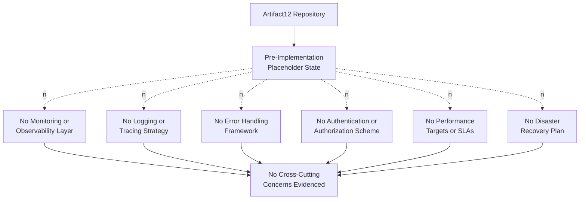

### 5.4.8 Error Handling Flow (Absence Topology)

The following diagram visualizes the absence of an authorable error-handling flow, satisfying the section-prompt requirement for an "error handling flows" diagram in the only form that the evidence permits. The flow follows the canonical error-handling lifecycle — error production, classification, retry, fallback, circuit-breaking, notification, and recovery — with dotted edges indicating that each transition lacks the source-code, configuration, or operational artifact required to depict it concretely.

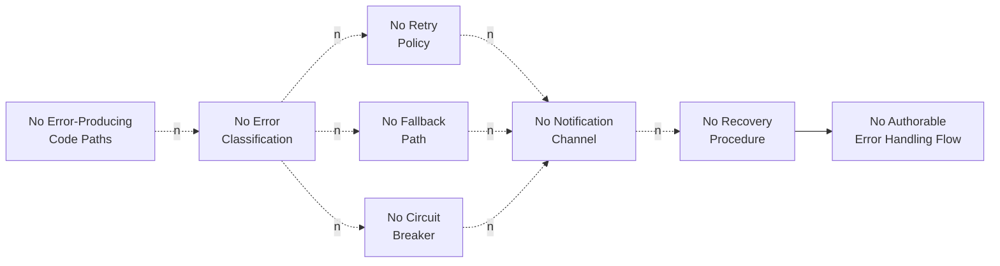

### 5.4.9 Reserved Cross-Cutting Concerns Schemas

The following reserved schemas are preserved for future use, so that subsequent iterations of this Technical Specification can populate them without restructuring once the corresponding implementation artifacts are committed.

#### Reserved Observability Schema

| Field | Format | Status |
|-------|--------|--------|
| Signal Type | Metric / Log / Trace / Event | Reserved; awaiting first observability commit |
| Sink / Backend | Free text (e.g., Prometheus, CloudWatch, Datadog) | Reserved |
| Retention Window | ISO 8601 duration | Reserved |
| Sampling Strategy | Free text | Reserved |
| Alert Rule | Free text | Reserved; depends on Section 1.2.3 population |

#### Reserved Authentication and Authorization Schema

| Field | Format | Status |
|-------|--------|--------|
| Identity Provider | Free text (e.g., Auth0, Okta, Cognito) | Reserved; awaiting first auth commit |
| Token Type | JWT / Opaque / Biscuit / Session Cookie | Reserved |
| Authorization Model | RBAC / ABAC / ReBAC / PBAC / Custom | Reserved |
| Session Lifetime | ISO 8601 duration | Reserved |
| Policy Enforcement Point | Reference to component or gateway | Reserved; depends on Section 5.2.2 |

#### Reserved Performance SLA Schema

| Field | Format | Status |
|-------|--------|--------|
| Service or Endpoint | Reference to component or interface | Reserved |
| Availability Target | Free text (e.g., "99.9% rolling 30-day") | Reserved |
| Latency Target | p50 / p95 / p99 in milliseconds | Reserved |
| Throughput Target | RPS / TPS / msgs-per-sec | Reserved |
| Error Budget Policy | Free text | Reserved |

#### Reserved Disaster Recovery Schema

| Field | Format | Status |
|-------|--------|--------|
| Protected Data Domain | Reference to Section 3.6 storage component | Reserved; depends on Section 3.6 |
| Recovery Point Objective (RPO) | ISO 8601 duration | Reserved |
| Recovery Time Objective (RTO) | ISO 8601 duration | Reserved |
| Backup Strategy | Free text (full / incremental / continuous) | Reserved |
| Failover Topology | Active-Active / Active-Passive / Pilot Light / Backup-Restore | Reserved |
| Runbook Reference | Free text or link | Reserved; depends on Section 2.4.4 |

## 5.5 ARCHITECTURE ACTIVATION PATHWAY

This subsection adopts the activation-pathway idiom introduced in Section 3.8.2 and reapplied in Section 4.7, adapting it to the system-architecture domain. The activation pathway from the current empty System Architecture to a populated set of authoritative architectural artifacts would, by standard software-engineering practice, follow the sequence visualized and described below. This pathway is a procedural reference; it does not assert any commitment to a specific architectural style, methodology, or order of work.

### 5.5.1 Activation Pathway Diagram

```mermaid
flowchart LR
    Current[Current State:<br/>Empty System<br/>Architecture] --> Step1[Step 1: Business Problem<br/>and Stakeholder<br/>Articulation]
    Step1 --> Step2[Step 2: Functional and<br/>Non-Functional<br/>Requirements Authoring]
    Step2 --> Step3[Step 3: Technology Stack<br/>Selection and Commitment]
    Step3 --> Step4[Step 4: Component<br/>Decomposition and<br/>Interface Design]
    Step4 --> Step5[Step 5: Data Flow,<br/>Persistence, and<br/>Integration Design]
    Step5 --> Step6[Step 6: Cross-Cutting<br/>Concerns and SLA<br/>Specification]
    Step6 --> Step7[Step 7: Architecture<br/>Decision Records<br/>Capture]
    Step7 --> Populated[Populated System<br/>Architecture<br/>Section 5 Revised in Full]
```

### 5.5.2 Procedural Step Detail

The activation pathway above corresponds to the following procedural sequence. Each step lists the prior section that must first be populated for the corresponding architectural work to become authorable:

| Step | Activity | Section That Must First Be Populated |
|------|----------|---------------------------------------|
| Step 1 | Articulate the business problem, value proposition, and stakeholder / persona registry | Sections 1.1.3, 1.1.4, 1.1.5 |
| Step 2 | Author the Feature Catalog, Functional Requirements, and Non-Functional Requirements with verifiable acceptance criteria | Sections 2.1, 2.2, 1.2.3, 2.4 |
| Step 3 | Select and commit a programming language, framework, persistence engine, deployment target, and observability platform | Sections 3.2–3.7 |
| Step 4 | Decompose the system into named components, define their responsibilities and interfaces, and depict their interactions | Section 5.2 (this section, depends on Steps 1–3) |
| Step 5 | Define data flows, persistence schemas, integration contracts, and transformation points across components | Sections 5.1.4, 5.1.5, 3.6, 4.2.2 |
| Step 6 | Define monitoring, logging, tracing, error handling, authentication, authorization, performance SLAs, and disaster recovery | Section 5.4 (this section, depends on Steps 1–5) |
| Step 7 | Record each architectural decision in an ADR-formatted document with context, decision, consequences, and alternatives considered | Section 5.3.3 (Reserved ADR Schema) |

Only after these prerequisite sections are populated can the corresponding subsections of Section 5 be authored without contravening the evidence-based documentation principle (Assumption A-003, Section 2.6.1).

### 5.5.3 Revision Trigger Conditions

Following the pattern established in Section 3.9.2 and Section 4.7.3, Section 5 should be revised in full when any of the following events occur in the Artifact12 repository, because each event introduces a category of artifact whose presence would shift one or more subsections from "empty" to "populated":

| Trigger Event | Subsections Requiring Revision |
|---------------|---------------------------------|
| First commit of source code organized into modules, services, packages, or layers | 5.1.2 System Overview; 5.1.3 Core Components Table; 5.2 Component Details |
| First commit of an API contract (OpenAPI / GraphQL / gRPC / AsyncAPI) or interface definition | 5.1.4 Data Flow Description; 5.1.5 External Integration Points; 5.2.5 Sequence Diagram Topology |
| First commit of a persistence-layer artifact (schema, migration, ORM model, or connection configuration) | 5.1.4 Data Flow Description (data stores); 5.2.4 State Transition Topology; 5.4.6 Disaster Recovery |
| First commit of a third-party SDK reference, environment template, or service-configuration file | 5.1.5 External Integration Points; 5.4.4 Authentication and Authorization |
| First commit of a monitoring, logging, or tracing configuration | 5.4.1 Monitoring and Observability; 5.4.2 Logging and Tracing |
| First commit of an error-handling specification, retry policy, or circuit-breaker configuration | 5.4.3 Error Handling; 5.4.8 Error Handling Flow |
| First commit of an authentication scheme, authorization policy, or identity-provider configuration | 5.4.4 Authentication and Authorization |
| First commit of an SLA, SLO, performance budget, or capacity-planning document | 5.4.5 Performance Requirements and SLAs |
| First commit of an operational runbook, backup policy, or failover specification | 5.4.6 Disaster Recovery |
| First commit of an Architecture Decision Record (ADR) or design document | 5.3 Technical Decisions (entire subsection) |
| Recording of an explicit architectural-style decision (monolith / microservices / serverless / etc.) | Entire Section 5 |

Until one or more of these events occurs, the present section remains the definitive — and necessarily empty — System Architecture documentation for Artifact12.

## 5.6 Section Summary

### 5.6.1 Aggregate Determination

The System Architecture section has been authored in strict accordance with the section-prompt guardrails, the established evidence-based voice of Sections 1.1 through 4.9, and the verified state of the Artifact12 repository. The aggregate determination across the dimensions enumerated by the section prompt is summarized below:

| Architecture Dimension | Population Status | Authoritative Cross-Reference |
|------------------------|-------------------|-------------------------------|
| Architectural Style and Rationale | Empty; no style declared | Sections 1.1.3, 1.2.2, 1.3.1 |
| Core Components Inventory | Single documentation file only | Section 1.2.2 |
| Data Flow and Transformation Points | Empty; no flows evidenced | Sections 1.3.2, 4.2.2 |
| External Integration Points | Empty; no integrations evidenced | Sections 1.2.1, 2.3.2, 3.5.1 |
| Component Interactions | Empty; no interactions possible | Section 1.2.2, Section 2.3.3 |
| State Transitions | Empty; no entities or aggregates | Sections 1.3.2, 3.6.1, 4.4.1 |
| Sequence Flows | Empty; no actors or messages | Sections 1.1.4, 3.5.1, 4.2.2 |
| Technical Decisions and ADRs | Empty; no decisions recorded | Section 1.3.3 |
| Monitoring and Observability | Empty; no observability layer | Sections 1.2.3, 3.5.1 |
| Logging and Tracing | Empty; no logging strategy | Sections 1.2.2, 3.5.1 |
| Error Handling | Empty; no error patterns | Section 4.4.2 |
| Authentication and Authorization | Empty; no security scheme | Sections 2.4.3, 3.5.1 |
| Performance Requirements and SLAs | Empty; no targets defined | Sections 1.2.3, 2.4.2 |
| Disaster Recovery | Empty; no DR plan | Sections 2.4.4, 3.6.1, 3.9.1 |
| Reserved Schemas | Populated; ready for future use | Sections 5.1.5, 5.2.2, 5.3.3, 5.4.9 |
| Activation Pathway | Populated as procedural reference | Section 5.5 |

### 5.6.2 Relationship to Required Diagram Inventory

The section prompt specifies multiple required diagram classes — component interaction diagrams, state transition diagrams, sequence diagrams, decision tree diagrams, architecture decision records, and error handling flows. Each diagram class has been addressed within the constraints imposed by the verified empty state of the repository. The mapping is recorded below:

| Required Diagram Class | Treatment in Section 5 |
|------------------------|------------------------|
| Component interaction diagrams | Replaced by Component Interaction Topology (Absence) — Section 5.2.3 |
| State transition diagrams | Replaced by State Transition Topology (Absence) — Section 5.2.4 |
| Sequence diagrams for key flows | Replaced by Sequence Diagram Topology (Absence) — Section 5.2.5 |
| Decision tree diagrams | Replaced by Decision Tree Topology (Absence) — Section 5.3.4 |
| Architecture Decision Records (ADRs) | Replaced by Reserved ADR Schema — Section 5.3.3 |
| Error handling flows | Replaced by Error Handling Flow (Absence Topology) — Section 5.4.8 |
| High-level architecture diagram | Replaced by High-Level Architecture Absence Topology — Section 5.1.6 |
| Cross-cutting concerns overview | Provided by Cross-Cutting Concerns Absence Topology — Section 5.4.7 |
| Forward-looking activation diagram | Provided by Architecture Activation Pathway — Section 5.5.1 |

### 5.6.3 Closing Position

Until the Artifact12 repository transitions from its current pre-implementation, placeholder state — through the introduction of source code, dependency manifests, configuration files, schema artifacts, integration contracts, error-handling specifications, observability configurations, and architectural decision records — Section 5 remains the definitive and necessarily empty System Architecture documentation. Revision of this section in full is expected upon the occurrence of any trigger event enumerated in Section 5.5.3. Every reserved schema and every absence-topology diagram is preserved in this section so that the transition from "empty" to "populated" can be accomplished by additive revision rather than by structural reorganization.

## 5.7 References

### 5.7.1 Files Examined

- `README.md` — The repository's sole substantive file. Verified to contain only the single H1 heading `# Artifact12`. Provides the basis for the only positively asserted fact relevant to this section (the project identity, surfaced in the Core Components Table at Section 5.1.3) and the basis for every negative finding (absence of architectural style, components, interfaces, data flows, integrations, decisions, and cross-cutting concerns) reported throughout this section.

### 5.7.2 Folders Explored

- `` (repository root, depth: 0) — Verified via authoritative directory listing to contain exactly one child (`README.md`) and zero subdirectories. The absence of any architecture-bearing folder (`architecture/`, `docs/`, `adr/`, `decisions/`, `design/`), source folder (`src/`, `app/`, `lib/`, `services/`, `components/`, `backend/`, `frontend/`), interface folder (`api/`, `contracts/`, `schemas/`, `openapi/`, `proto/`), persistence folder (`migrations/`, `models/`, `db/`), or operational folder (`runbooks/`, `playbooks/`, `ops/`, `infra/`) is the basis for every negative finding in this section.

### 5.7.3 Technical Specification Sections Cross-Referenced

- **Section 1.1 Executive Summary** — Specifically Sections 1.1.2 (Repository State Disclosure), 1.1.3 (Core Business Problem), 1.1.4 (Stakeholders and Users), 1.1.5 (Business Impact and Value Proposition), 1.1.6 (Summary of Verifiable Facts). Provided authoritative confirmation of the pre-implementation state and the absence of stakeholders, business problem, and value proposition. Used to ground Sections 5.1.2, 5.2.5, 5.3.4, and 5.5.2.
- **Section 1.2 System Overview** — Specifically Sections 1.2.1 (Integration with Existing Enterprise Landscape), 1.2.2 (Major System Components, Core Technical Approach), 1.2.3 (Key Performance Indicators). Provided the most directly applicable cross-references for the negative findings in Sections 5.1.2, 5.1.3, 5.1.5, 5.4.1, 5.4.5, and for the diagrammatic idiom adopted in Sections 5.1.6, 5.2.3, 5.2.4, 5.2.5, 5.3.4, 5.4.7, and 5.4.8.
- **Section 1.3 Scope** — Specifically Sections 1.3.1 (Essential Integrations, Key Technical Requirements), 1.3.2 (System Boundaries, Data Domains Included), 1.3.3 (Future Phase Considerations). Provided the basis for every negative finding regarding system boundaries, data domains, integration requirements, and ADR absence. Used to ground Sections 5.1.2, 5.1.4, 5.1.5, 5.2.4, 5.3.1, and 5.4.6.
- **Section 2.1 FEATURE CATALOG** — Provided the reserved-schema pattern adopted in Sections 5.1.5, 5.2.2, 5.3.3, and 5.4.9.
- **Section 2.2 FUNCTIONAL REQUIREMENTS** — Used to ground Section 5.3.2 (Functional Requirements row in the decision tree) and Section 5.5.2 (Step 2).
- **Section 2.3 FEATURE RELATIONSHIPS** — Specifically Section 2.3.2 (Integration Points Status) and Section 2.3.3 (Shared Components and Common Services). Provided the basis for Sections 5.1.5, 5.2.1, and 5.2.3.
- **Section 2.4 IMPLEMENTATION CONSIDERATIONS** — Specifically Sections 2.4.1 (Technical Constraints), 2.4.2 (Performance and Scalability Considerations), 2.4.3 (Security Implications), 2.4.4 (Maintenance Requirements). Provided the basis for Sections 5.4.4, 5.4.5, and 5.4.6.
- **Section 2.6 ASSUMPTIONS AND CONSTRAINTS** — Specifically Assumption A-003 (no fabrication) from Section 2.6.1 and Constraints C-001 through C-004 (repository-state constraints) from Section 2.6.2. Used to ground Section 5.1.1 (Documentation Methodology and Guardrails).
- **Section 2.7 SECTION SUMMARY** — Provided the established summary-table idiom adopted in Section 5.6.1.
- **Section 3.1 Technology Stack Status and Methodological Framing** — Specifically Section 3.1.3 (Treatment of the User-Provided Default Stack). Established the guardrail prohibiting any architectural inference from the user-provided default stack. Used to ground Section 5.1.1.
- **Section 3.5 THIRD-PARTY SERVICES** — Specifically Section 3.5.1 (Third-Party Service Inventory). Provided the basis for Sections 5.1.5, 5.4.1, 5.4.2, and 5.4.4.
- **Section 3.6 DATABASES & STORAGE** — Specifically Section 3.6.1 (Database and Storage Inventory). Provided the basis for the absence of data stores, caches, and persistence-dependent state machines in Sections 5.1.4, 5.2.4, and 5.4.6.
- **Section 3.7 DEVELOPMENT & DEPLOYMENT** — Provided supporting evidence for the absence of deployment topology and operational tooling in Sections 5.4.2 and 5.4.6.
- **Section 3.8 Technology Stack Topology and Future Direction** — Specifically Sections 3.8.1 (Verified Absence Topology), 3.8.2 (Activation Pathway), and 3.8.3 (Default Technology Stack as Reserved Reference). Established the diagrammatic idioms adopted in Sections 5.1.6, 5.2.3, 5.2.4, 5.2.5, 5.3.4, 5.4.7, 5.4.8, and 5.5.1.
- **Section 3.9 Section Summary** — Specifically Section 3.9.1 (Aggregate Determination) and Section 3.9.2 (Revision Trigger Conditions). Established the summary-table and trigger-table idioms adopted in Sections 5.6.1 and 5.5.3.
- **Section 3.10 References** — Established the References-subsection structure (Files Examined, Folders Explored, Technical Specification Sections Cross-Referenced) adopted in this Section 5.7.
- **Section 4.2 System Workflows Inventory** — Specifically Section 4.2.2 (Integration Workflows). Provided the basis for the absence of data flows, API interactions, event flows, and batch processes in Section 5.1.4.
- **Section 4.4 Technical Implementation Workflow Elements** — Specifically Sections 4.4.1 (State Management Elements) and 4.4.2 (Error Handling Elements). Provided the basis for Sections 5.2.4, 5.4.3, and 5.4.8.
- **Section 4.5 Process Topology Diagrams** — Specifically Sections 4.5.1, 4.5.2, and 4.5.3. Reinforced the absence-topology diagrammatic idiom adopted throughout Section 5.
- **Section 4.6 Reserved Process Flowchart Schemas** — Provided the reserved-schema template pattern adopted in Sections 5.2.2, 5.3.3, and 5.4.9.
- **Section 4.7 Activation Pathway for Process Documentation** — Specifically Sections 4.7.1 (Activation Pathway Diagram), 4.7.2 (Procedural Step Detail), and 4.7.3 (Revision Trigger Conditions). Established the activation-pathway and revision-trigger idioms adopted in Sections 5.5.1, 5.5.2, and 5.5.3.
- **Section 4.8 Section Summary** — Specifically Section 4.8.2 (Relationship to Required Diagram Inventory). Established the diagram-mapping idiom adopted in Section 5.6.2.
- **Section 4.9 References** — Reinforced the References-subsection structure adopted in this Section 5.7.

# 6. SYSTEM COMPONENTS DESIGN

## 6.1 Core Services Architecture

### 6.1.1 Applicability Determination

**Core Services Architecture is not applicable for the Artifact12 system at this time.**

The Artifact12 repository exists in a pre-implementation, placeholder state in which no services, components, communication patterns, scaling mechanisms, or resilience configurations have been committed. The applicability of a Core Services Architecture presupposes, at minimum, a decomposition of the system into distinct service components, a chosen technology stack capable of supporting those services, defined interfaces between services, and operational targets against which scalability and resilience can be evaluated. None of these prerequisites are evidenced by the repository.

The basis for this determination is the convergence of authoritative findings recorded across prior sections of this Technical Specification:

| Prerequisite for Core Services Architecture | Evidenced Status | Authoritative Cross-Reference |
|----------------------------------------------|------------------|--------------------------------|
| Decomposition into distinct service components | None evidenced | Section 5.1.3 (Core Components Table); Section 5.2.1 (Component Inventory Status) |
| Committed technology stack supporting services | None evidenced | Section 3.9.1 (Aggregate Determination); Section 3.1.3 |
| Defined interfaces between services | None evidenced | Section 5.1.5 (External Integration Points); Section 4.2.2 (Integration Workflows) |
| Performance / scalability targets to evaluate against | None defined | Section 2.4.2 (Performance and Scalability Considerations); Section 5.4.5 (Performance Requirements and SLAs Status) |
| Error-handling, retry, fallback, and circuit-breaker artifacts | None evidenced | Section 4.4.2 (Error Handling Elements); Section 5.4.3 (Error Handling Status) |
| Disaster recovery, redundancy, and failover artifacts | None evidenced | Section 5.4.6 (Disaster Recovery Status) |

The section-prompt directive — to state explicitly that "Core Services Architecture is not applicable for this system" when the system does not require microservices, distributed architecture, or distinct service components — is honored here on the strongest possible evidentiary footing: not only are microservices, distributed architecture, and distinct service components absent, but every prerequisite needed to evaluate whether such an architecture is appropriate is also absent.

### 6.1.2 Documentation Methodology and Guardrails

This section is governed by the same evidence-based methodology applied throughout Sections 1.1 through 5.7. The following methodological commitments are made explicit so that this section can be audited against the established voice of the Technical Specification.

#### 6.1.2.1 Methodological Commitments

| Methodological Commitment | Rationale |
|----------------------------|-----------|
| Report only services-architecture elements evidenced by repository artifacts | Section-prompt guardrail; consistent voice of Sections 1.1–5.7 |
| Cross-reference prior sections as the authoritative basis of every negative finding | Established pattern in Sections 2.3.1, 3.8.1, 4.1.3, 5.1.1, 5.4.7 |
| Refrain from fabricating services, communication patterns, scaling strategies, or resilience mechanisms | Assumption A-003 (Section 2.6.1); Constraints C-001 through C-004 (Section 2.6.2) |
| Reserve schemas for each services-architecture subsection for future population | Pattern in Sections 2.1.3, 2.6.3, 3.2.3, 3.5.3, 3.6.3, 4.6, 5.1.5, 5.2.2, 5.3.3, 5.4.9 |
| Visualize absence using the dotted-edge ("no") idiom established in prior sections | Diagrammatic consistency with Sections 1.2.2, 2.3.1, 3.8.1, 4.5, 5.1.6, 5.2.3, 5.4.7, 5.4.8 |

#### 6.1.2.2 Treatment of the User-Provided Default Technology Stack

Consistent with Section 3.1.3 (Treatment of the User-Provided Default Stack), Section 3.8.3, Section 4.1.3, and Section 5.1.1, the user-provided default technology stack (AWS, Docker, Terraform, GitHub Actions, Python, Flask, Auth0, MongoDB, Langchain, React with TypeScript, TailwindCSS, React Native, Swift, Kotlin, Objective-C, and ElectronJS) is **not** used as a substitute basis for inventing service architecture. Section 6.1 accordingly does not invent a Flask service mesh, an MongoDB sharded persistence tier, an Auth0 sidecar identity service, an AWS Application Load Balancer policy, a Terraform-managed auto-scaling group, a Kubernetes Horizontal Pod Autoscaler manifest, a multi-region replication topology, or any other technology-specific services-architecture element that has not been committed to the repository.

#### 6.1.2.3 Anchoring Constraints from Section 2.6.2

The following constraints from Section 2.6.2 govern the limits of what this section can responsibly document:

| Constraint ID | Effect on Section 6.1 |
|---------------|------------------------|
| C-001 (No feature-bearing artifacts) | No services can be defined because no functional surfaces exist to be allocated to services |
| C-002 (No requirements documents) | No non-functional requirements (latency, throughput, availability) exist to drive scalability or resilience design |
| C-003 (No planning artifacts) | No roadmap exists from which a phased service-introduction plan could be inferred |
| C-004 (No design artifacts, schema definitions, or interface specifications) | No inter-service contracts, message schemas, or API definitions exist to anchor communication patterns |

### 6.1.3 Service Components Status

The section prompt requires documentation of service boundaries and responsibilities, inter-service communication patterns, service discovery mechanisms, load balancing strategy, circuit breaker patterns, and retry / fallback mechanisms. Each dimension is uniformly absent in the Artifact12 repository. The basis for each finding is cross-referenced authoritatively below.

#### 6.1.3.1 Service Boundaries and Responsibilities

No service boundaries are evidenced. Section 5.1.3 (Core Components Table) records exactly one component — the static documentation file `README.md` — and Section 5.2.1 (Component Inventory Status) confirms that "no other components — service components, library components, frontend components, mobile components, background-worker components, scheduled-job components, gateway components, edge components, persistence components, or analytics components — exist in the repository." Because there is no decomposition into named services, no service responsibility allocation can be authored, and no domain-driven, capability-driven, or transaction-driven boundary rationale can be evidenced.

#### 6.1.3.2 Inter-Service Communication Patterns

No inter-service communication patterns are evidenced. Section 4.2.2 (Integration Workflows) is the authoritative cross-reference: "data flow between systems," "API interactions," "event processing flows," "batch processing sequences," "synchronous request/response chains," "asynchronous message exchanges," and "webhook or callback interactions" are uniformly absent. Section 5.1.4 (Data Flow Description) further confirms that no communicating endpoints, transport protocols, data representations, or directional orderings exist. Consequently, no synchronous (REST, gRPC, GraphQL), asynchronous (AMQP, Kafka, NATS, MQTT), or hybrid communication pattern can be documented.

#### 6.1.3.3 Service Discovery Mechanisms

No service discovery mechanism is evidenced. Service discovery presupposes the existence of services to be discovered and a runtime environment in which discovery can occur. Section 3.5.1 (Third-Party Service Inventory) confirms the absence of any cloud-platform service-discovery offering; Section 3.7 (Development & Deployment) confirms the absence of any container orchestration platform, service mesh, or registry deployment; and Section 5.2.1 confirms the absence of services to register. Consequently, no DNS-based, registry-based (Consul, etcd, Eureka), sidecar-based (Envoy, Istio, Linkerd), or static service-discovery configuration can be documented.

#### 6.1.3.4 Load Balancing Strategy

No load balancing strategy is evidenced. Section 1.2.3 (Key Performance Indicators) records that "no service-level objectives (SLOs), service-level agreements (SLAs), performance budgets, throughput targets, latency thresholds, or quality metrics are documented within the repository"; Section 2.4.2 (Performance and Scalability Considerations) confirms that the scalability envelope is "None defined"; and Section 3.7 (Development & Deployment) confirms the absence of any deployment topology in which a load balancer could be situated. Consequently, no Layer 4 (TCP/UDP) or Layer 7 (HTTP/gRPC) load-balancing algorithm — round-robin, least-connections, weighted, IP-hash, least-response-time, or consistent-hash — can be documented.

#### 6.1.3.5 Circuit Breaker Patterns

No circuit breaker pattern is evidenced. Section 4.4.2 (Error Handling Elements) is the authoritative cross-reference: "Fallback processes (circuit breakers, graceful degradation)" are explicitly recorded as "None." Section 5.4.3 (Error Handling Status) reinforces that "no error-handling framework has been declared," and Section 5.4.8 (Error Handling Flow Absence Topology) visualizes the absence of a circuit-breaker step in the canonical error-handling lifecycle. Consequently, no circuit-breaker thresholding (failure rate, latency percentile, consecutive failures), no half-open probing strategy, no fallback path, and no breaker-state observability hook can be documented.

#### 6.1.3.6 Retry and Fallback Mechanisms

No retry or fallback mechanism is evidenced. Section 4.4.2 (Error Handling Elements) records that "Retry mechanisms (exponential backoff, jitter, dead-letter queues)" and "Fallback processes (circuit breakers, graceful degradation)" are uniformly "None." Section 4.4.3 (Technical Implementation Aggregate Determination) summarizes the same finding under the category "Retry / Fallback Mechanisms: Empty; no source code or service integration evidenced." Consequently, no maximum-attempt policy, no backoff schedule (constant, linear, exponential, decorrelated jitter), no idempotency-key strategy, no dead-letter routing configuration, and no fallback-response specification can be documented.

#### 6.1.3.7 Service Components Aggregate Determination

The aggregate state of the Service Components inventory is summarized below.

| Service Components Element | Population Status | Authoritative Cross-Reference |
|-----------------------------|-------------------|--------------------------------|
| Service boundaries and responsibilities | Empty | Section 5.1.3; Section 5.2.1 |
| Inter-service communication patterns | Empty | Section 4.2.2; Section 5.1.4 |
| Service discovery mechanisms | Empty | Section 3.5.1; Section 3.7; Section 5.2.1 |
| Load balancing strategy | Empty | Section 1.2.3; Section 2.4.2; Section 3.7 |
| Circuit breaker patterns | Empty | Section 4.4.2; Section 5.4.3; Section 5.4.8 |
| Retry and fallback mechanisms | Empty | Section 4.4.2; Section 4.4.3 |

### 6.1.4 Scalability Design Status

The section prompt requires documentation of horizontal / vertical scaling approach, auto-scaling triggers and rules, resource allocation strategy, performance optimization techniques, and capacity planning guidelines. Each dimension is uniformly absent in the Artifact12 repository.

#### 6.1.4.1 Horizontal and Vertical Scaling Approach

No scaling approach — horizontal, vertical, or hybrid — is evidenced. Section 2.4.2 (Performance and Scalability Considerations) records that the scalability envelope is "None defined," and Section 5.2.1 (Component Inventory Status) records that scaling considerations for the only evidenced component (`README.md`) are "Not applicable; the file is a static documentation artifact." Because the repository contains no executable component, the question of horizontal replication or vertical resizing has no subject.

#### 6.1.4.2 Auto-Scaling Triggers and Rules

No auto-scaling triggers are evidenced. Auto-scaling presupposes (a) a metric source from which trigger conditions can be evaluated, (b) an orchestration platform that can act on those conditions, and (c) a deployment unit that can be scaled. Section 1.2.3 confirms the absence of metrics, Section 3.5.1 and Section 3.7 confirm the absence of any orchestration platform, and Section 5.2.1 confirms the absence of any deployment unit. Consequently, no CPU-based, memory-based, queue-depth-based, request-rate-based, or custom-metric-based auto-scaling rule can be documented.

#### 6.1.4.3 Resource Allocation Strategy

No resource allocation strategy is evidenced. Section 2.4.2 records that "resource budgets (CPU, memory, network, storage)" are "None defined," and Section 5.4.5 reproduces this determination in its own performance/SLA dimension table. Without a defined workload, no CPU / memory / disk / network allocation envelope can be authored, and no quality-of-service class assignment can be specified.

#### 6.1.4.4 Performance Optimization Techniques

No performance optimization techniques are evidenced. Section 1.2.3 confirms the absence of throughput targets and latency thresholds against which optimization could be measured; Section 4.4.1 (State Management Elements) confirms the absence of caching, persistence, and transaction boundaries that would furnish optimization opportunities; and Section 5.1.4 confirms the absence of data flows whose paths could be optimized. Consequently, no caching strategy, no query-optimization policy, no connection-pooling configuration, no compression or batching approach, and no asynchronous-processing pattern can be documented.

#### 6.1.4.5 Capacity Planning Guidelines

No capacity planning guidelines are evidenced. Capacity planning requires baseline workload measurements, growth projections, and a calibrated resource model — none of which exist in the repository. Section 1.2.3, Section 2.4.2, and Section 5.4.5 jointly establish this absence.

#### 6.1.4.6 Scalability Design Aggregate Determination

| Scalability Element | Population Status | Authoritative Cross-Reference |
|---------------------|-------------------|--------------------------------|
| Horizontal / vertical scaling approach | Empty | Section 2.4.2; Section 5.2.1 |
| Auto-scaling triggers and rules | Empty | Section 1.2.3; Section 3.5.1; Section 3.7 |
| Resource allocation strategy | Empty | Section 2.4.2; Section 5.4.5 |
| Performance optimization techniques | Empty | Section 1.2.3; Section 4.4.1; Section 5.1.4 |
| Capacity planning guidelines | Empty | Section 1.2.3; Section 2.4.2; Section 5.4.5 |

### 6.1.5 Resilience Patterns Status

The section prompt requires documentation of fault tolerance mechanisms, disaster recovery procedures, data redundancy approach, failover configurations, and service degradation policies. Each dimension is uniformly absent in the Artifact12 repository.

#### 6.1.5.1 Fault Tolerance Mechanisms

No fault tolerance mechanism is evidenced. Section 4.4.2 (Error Handling Elements) records that "Bulkhead / isolation patterns" are "None" and that "Recovery procedures (manual / automated runbooks)" are "None." Section 5.4.3 confirms that "no error-handling framework has been declared." Consequently, no timeout-based, bulkhead-based, retry-based, redundancy-based, or replica-based fault-tolerance pattern can be documented.

#### 6.1.5.2 Disaster Recovery Procedures

No disaster-recovery procedures are evidenced. Section 5.4.6 (Disaster Recovery Status) is the authoritative cross-reference: "no Recovery Point Objective (RPO), no Recovery Time Objective (RTO), no backup strategy, no replication topology, no failover procedure, no incident-response playbook, and no business-continuity plan can be evidenced." The four foundational prerequisites — persistence layer (Section 3.6.1), deployment topology (Section 3.9.1), operational runbook (Section 2.4.4), and regulatory or contractual obligation framework (Section 2.4.3) — are independently absent.

#### 6.1.5.3 Data Redundancy Approach

No data redundancy approach is evidenced. Section 3.6.1 (Database and Storage Inventory) records that "no primary database, secondary database, caching layer, object store, file storage, or message-queue persistence is declared," and Section 1.3.2 (Data Domains Included) records that "no data models, database schemas, entity definitions, domain models, or information architecture artifacts exist in the repository." Because no data exists to be redundantly stored, no replication factor, no consistency model (strong, bounded-staleness, eventual), no cross-region replication policy, and no backup-rotation schedule can be documented.

#### 6.1.5.4 Failover Configurations

No failover configuration is evidenced. Failover requires (a) at least two instances of a service, (b) a health-checking mechanism, (c) a traffic-redirection mechanism, and (d) a state-reconciliation policy. Each prerequisite is independently absent: Section 5.2.1 confirms the absence of services, Section 5.4.1 confirms the absence of any monitoring/health-checking layer, Section 3.7 confirms the absence of any traffic-management infrastructure, and Section 4.4.1 confirms the absence of any state-management mechanism. Consequently, no active-active, active-passive, pilot-light, or backup-and-restore failover topology can be documented.

#### 6.1.5.5 Service Degradation Policies

No service degradation policy is evidenced. Section 4.4.2 records that "Fallback processes (circuit breakers, graceful degradation)" are "None," and Section 5.4.3 confirms that "no error-handling framework has been declared." Consequently, no feature-flag-driven, load-shed, brownout, or partial-response degradation policy can be documented.

#### 6.1.5.6 Resilience Patterns Aggregate Determination

| Resilience Element | Population Status | Authoritative Cross-Reference |
|--------------------|-------------------|--------------------------------|
| Fault tolerance mechanisms | Empty | Section 4.4.2; Section 5.4.3 |
| Disaster recovery procedures | Empty | Section 5.4.6 |
| Data redundancy approach | Empty | Section 3.6.1; Section 1.3.2 |
| Failover configurations | Empty | Section 5.2.1; Section 5.4.1; Section 3.7; Section 4.4.1 |
| Service degradation policies | Empty | Section 4.4.2; Section 5.4.3 |

### 6.1.6 Absence Topology Diagrams

The following three diagrams satisfy the section-prompt requirement for service-interaction, scalability-architecture, and resilience-pattern-implementation diagrams. They are rendered in the diagrammatic idiom established by Sections 1.2.2, 2.3.1, 3.8.1, 4.5, 5.1.6, 5.2.3, 5.2.4, 5.2.5, 5.4.7, and 5.4.8. Solid edges denote evidenced presence; dotted edges labeled `no` denote verified absence. The root node `Repo[Artifact12 Repository]` is preserved across diagrams to maintain visual consistency with prior sections.

#### 6.1.6.1 Service Interaction Diagram (Absence Topology)

The following diagram visualizes the empty inventory of service components, communication patterns, discovery mechanisms, load-balancing strategies, circuit breakers, and retry/fallback logic.

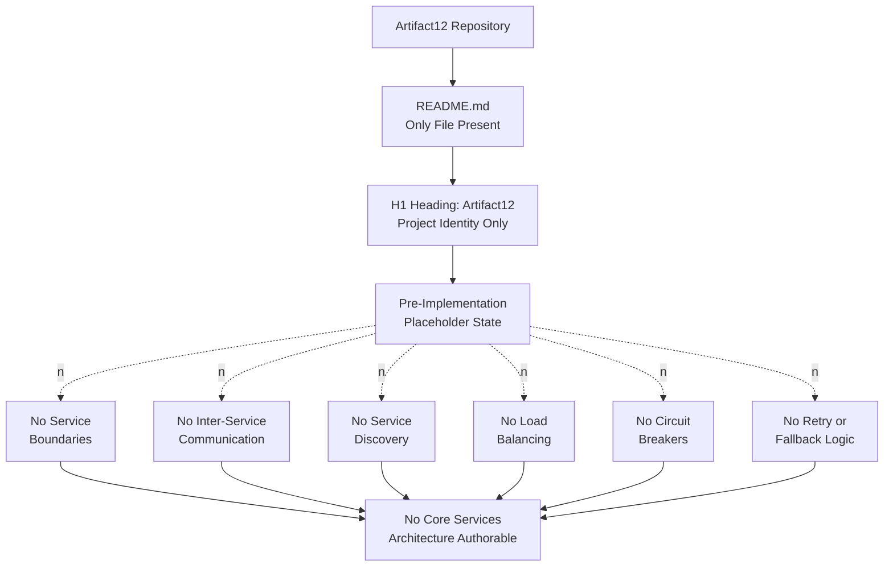

#### 6.1.6.2 Scalability Architecture Diagram (Absence Topology)

The following diagram visualizes the empty inventory of horizontal/vertical scaling approaches, auto-scaling triggers, resource allocation strategies, performance optimization techniques, and capacity planning guidelines.

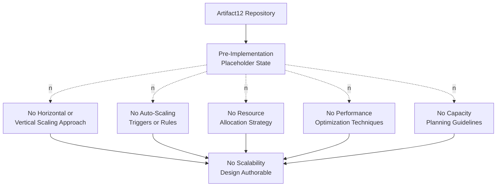

#### 6.1.6.3 Resilience Pattern Implementations Diagram (Absence Topology)

The following diagram visualizes the empty inventory of fault-tolerance mechanisms, disaster-recovery procedures, data-redundancy approaches, failover configurations, and service-degradation policies.

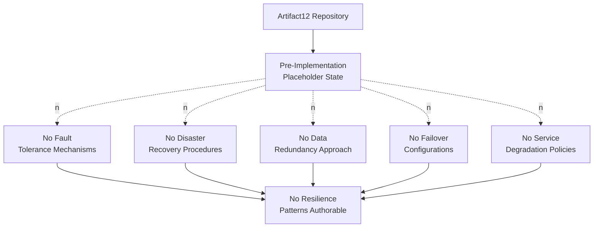

### 6.1.7 Reserved Schemas for Future Population

Although no services-architecture elements can presently be specified, the following reserved schemas are preserved so that subsequent iterations of this Technical Specification can populate them without restructuring once the corresponding implementation artifacts are committed. The reserved-schema pattern is consistent with Sections 2.1.3, 2.6.3, 3.2.3, 3.5.3, 3.6.3, 4.6, 5.1.5, 5.2.2, 5.3.3, and 5.4.9. Each schema is shown without rows, in keeping with the evidence-based documentation principle established across the Technical Specification.

#### 6.1.7.1 Reserved Service Component Schema

| Field | Format | Status |
|-------|--------|--------|
| Service ID | `S-XXX` | Reserved; awaiting first service commit |
| Service Name | Free text | Reserved |
| Service Responsibility | Free text | Reserved |
| Owning Stakeholder | Reference to Section 1.1.4 entry | Reserved; depends on Section 1.1.4 |
| Communication Pattern (inbound) | Sync / Async / Event-Driven / Hybrid | Reserved |
| Communication Pattern (outbound) | Sync / Async / Event-Driven / Hybrid | Reserved |
| Service Discovery Mechanism | DNS / Registry / Sidecar / Static | Reserved |
| Load Balancing Strategy | Round-Robin / Least-Conn / IP-Hash / Weighted / Consistent-Hash | Reserved |
| Circuit Breaker Configuration | Threshold + Timeout + Half-Open Duration | Reserved |
| Retry Policy | Max Attempts + Backoff Strategy + Jitter | Reserved |
| Linked Component IDs | `C-XXX` references | Reserved; depends on Section 5.2.2 |

#### 6.1.7.2 Reserved Scalability Schema

| Field | Format | Status |
|-------|--------|--------|
| Service or Tier | Reference to `S-XXX` or `C-XXX` | Reserved |
| Scaling Type | Horizontal / Vertical / Hybrid / Stateless / Stateful | Reserved |
| Auto-Scale Trigger | CPU / Memory / Queue Depth / Request Rate / Custom Metric | Reserved; depends on Section 1.2.3 |
| Trigger Threshold | Free text with units | Reserved |
| Min / Max Instances | Integer range | Reserved |
| Cooldown Window | ISO 8601 duration | Reserved |
| Resource Allocation per Instance | CPU + Memory + Storage + Network | Reserved; depends on Section 2.4.2 |
| Optimization Technique | Free text (e.g., caching, batching, async) | Reserved |
| Capacity Baseline | Free text (workload + projection) | Reserved |

#### 6.1.7.3 Reserved Resilience Schema

| Field | Format | Status |
|-------|--------|--------|
| Service or Tier | Reference to `S-XXX` or `C-XXX` | Reserved |
| Fault Tolerance Mechanism | Replication / Bulkhead / Timeout / Circuit Breaker / Hedging | Reserved |
| Recovery Point Objective (RPO) | ISO 8601 duration | Reserved; depends on Section 5.4.6 |
| Recovery Time Objective (RTO) | ISO 8601 duration | Reserved; depends on Section 5.4.6 |
| Data Redundancy Approach | Replication Factor + Consistency Model | Reserved; depends on Section 3.6 |
| Failover Topology | Active-Active / Active-Passive / Pilot-Light / Backup-Restore | Reserved |
| Health Check Configuration | Endpoint + Interval + Failure Threshold | Reserved; depends on Section 5.4.1 |
| Degradation Policy | Free text (load-shed / brownout / feature-flag) | Reserved |
| Runbook Reference | Free text or link | Reserved; depends on Section 2.4.4 |

### 6.1.8 Activation Pathway and Revision Trigger Conditions

This subsection adopts the activation-pathway idiom established in Sections 3.8.2, 4.7.1, and 5.5.1, adapting it to the core-services-architecture domain. The activation pathway from the current "not applicable" state to a populated Core Services Architecture follows the sequence below. This pathway is a procedural reference; it does not assert any commitment to a specific architectural style, methodology, or order of work.

#### 6.1.8.1 Activation Pathway Diagram


#### 6.1.8.2 Procedural Step Detail

Each step lists the prior section that must first be populated for the corresponding services-architecture work to become authorable, in accordance with the activation-pathway pattern established in Section 5.5.2.

| Step | Activity | Section That Must First Be Populated |
|------|----------|---------------------------------------|
| Step 1 | Decide whether the system will be a monolith, distributed system, or hybrid, and record the decision as an ADR | Sections 5.3.3, 5.5.2 (Step 7) |
| Step 2 | Decompose the system into named services with documented responsibilities and ownership | Sections 5.2, 1.1.4 |
| Step 3 | Author contracts (REST/gRPC/AsyncAPI) and select synchronous vs. asynchronous communication patterns per interaction | Sections 5.1.4, 5.1.5, 4.2.2 |
| Step 4 | Select service-discovery, load-balancing, circuit-breaker, and retry/fallback mechanisms appropriate to the chosen runtime | Sections 3.7, 5.4.3, 5.4.8 |
| Step 5 | Define scalability targets (SLOs/SLAs) and auto-scaling policies; commit auto-scaling manifests or platform configurations | Sections 1.2.3, 2.4.2, 5.4.5 |
| Step 6 | Define RPO/RTO, data redundancy, failover topology, and service-degradation policies; commit runbooks | Sections 3.6, 5.4.6, 2.4.4 |

#### 6.1.8.3 Revision Trigger Conditions

Following the pattern established in Sections 3.9.2, 4.7.3, and 5.5.3, Section 6.1 should be revised when any of the following events occur in the Artifact12 repository. Each event introduces a category of artifact whose presence would shift one or more subsections from "not applicable" to "populated."

| Trigger Event | Subsections Requiring Revision |
|---------------|---------------------------------|
| First commit of source code organized into distinct services or service-bearing modules | 6.1.3.1 Service Boundaries; 6.1.3.7 Aggregate Determination |
| First commit of an API contract (OpenAPI / GraphQL / gRPC / AsyncAPI) or inter-service interface | 6.1.3.2 Inter-Service Communication |
| First commit of a service registry, service mesh, or discovery configuration | 6.1.3.3 Service Discovery |
| First commit of a load-balancer configuration (Nginx, HAProxy, cloud LB, ingress controller) | 6.1.3.4 Load Balancing |
| First commit of a circuit-breaker library reference or configuration | 6.1.3.5 Circuit Breaker |
| First commit of a retry/backoff policy, dead-letter-queue configuration, or fallback specification | 6.1.3.6 Retry and Fallback |
| First commit of an auto-scaling policy (HPA, ASG, KEDA, cloud-platform auto-scaler) | 6.1.4.2 Auto-Scaling Triggers; 6.1.4.1 Scaling Approach |
| First commit of an SLA / SLO document or capacity-planning artifact | 6.1.4.3–6.1.4.5; 6.1.5 (resilience targets) |
| First commit of a disaster-recovery runbook, backup policy, or replication configuration | 6.1.5.2 DR; 6.1.5.3 Redundancy |
| First commit of a failover configuration (multi-AZ, multi-region, active-active) | 6.1.5.4 Failover |
| First commit of a graceful-degradation, feature-flag, or load-shedding policy | 6.1.5.5 Service Degradation |
| Recording of an explicit architectural-style decision (monolith / microservices / serverless / hybrid) | Entire Section 6.1 (applicability determination revisited) |

Until one or more of these events occurs, the present section remains the definitive — and necessarily "not applicable" — Core Services Architecture documentation for Artifact12.

### 6.1.9 Section Closing Position

The closing position of Section 6.1 is consistent with the closing positions of Sections 3.9, 4.8, and 5.6:

- **Applicability**: Core Services Architecture is not applicable for the Artifact12 system in its current state.
- **Evidentiary Basis**: The determination rests on the absence of every prerequisite identified in Section 6.1.1 — service decomposition, technology stack, inter-service interfaces, operational targets, error-handling artifacts, and disaster-recovery artifacts — each of which is authoritatively cross-referenced to a prior section of this Technical Specification.
- **Forward Compatibility**: The reserved schemas in Section 6.1.7, the activation pathway in Section 6.1.8.1, and the revision-trigger table in Section 6.1.8.3 jointly ensure that this section can be populated incrementally, without restructuring, as implementation artifacts are committed.
- **Voice Consistency**: Section 6.1 maintains the authoritative, third-person, evidence-grounded voice established across Sections 1.1 through 5.7, and adheres to the dotted-edge absence-topology diagrammatic idiom, the reserved-schema pattern, the activation-pathway pattern, and the four-column table constraint specified by the section prompt.

### 6.1.10 References

#### 6.1.10.1 Files Examined

- `README.md` — Verified to contain exactly one line consisting of the H1 heading `# Artifact12`. This is the sole artifact in the repository; it provides the basis for the only positively asserted fact in this section (project identity) and the underpinning evidence for every negative finding regarding services, scalability, and resilience.
- Repository root (depth 0) — Verified to contain exactly one child (`README.md`) and zero subdirectories. Confirms the absence of any service-bearing folder (e.g., `services/`, `microservices/`), source folder (`src/`, `app/`, `lib/`), infrastructure folder (`infra/`, `ops/`, `terraform/`), or operational folder (`runbooks/`, `playbooks/`) that could support a services-architecture authoring effort.

#### 6.1.10.2 Technical Specification Sections Cross-Referenced

- **Section 1.2.3 (Key Performance Indicators)** — Authoritative basis for absence of SLOs, SLAs, throughput targets, latency thresholds, and quality metrics.
- **Section 1.3.2 (Data Domains Included / System Boundaries)** — Authoritative basis for absence of data domains and observable boundaries.
- **Section 2.3.1 (Empty Dependency Map)** and **Section 2.3.2 (Integration Points Status)** — Authoritative basis for absence of inter-service dependencies and integration surfaces.
- **Section 2.4.2 (Performance and Scalability Considerations)** — Authoritative basis for "scalability envelope: None defined" and resource budgets.
- **Section 2.4.3 (Security Implications)** and **Section 2.4.4 (Maintenance Requirements)** — Authoritative basis for absence of operational runbooks and security envelopes underpinning resilience.
- **Section 2.6.1 (Documented Assumptions)** and **Section 2.6.2 (Repository State Constraints)** — Provide A-003 and C-001 through C-004 governing what this section can responsibly document.
- **Section 3.1.3 / 3.8.3 (Treatment of User-Provided Default Stack)** — Governs the refusal to invent technology-specific service architecture.
- **Section 3.5.1 (Third-Party Service Inventory)** — Authoritative basis for absence of monitoring, identity, and cloud-platform service-discovery services.
- **Section 3.6.1 (Database and Storage Inventory)** — Authoritative basis for absence of stateful services and data redundancy.
- **Section 3.7 (Development & Deployment)** and **Section 3.9.1 (Aggregate Determination)** — Authoritative basis for absence of orchestration, containerization, and deployment topology.
- **Section 3.9.2 (Revision Trigger Conditions)** — Template for the revision-trigger pattern adopted in Section 6.1.8.3.
- **Section 4.2.2 (Integration Workflows)** — Authoritative basis for absence of inter-service communication patterns.
- **Section 4.4.1 (State Management Elements)**, **Section 4.4.2 (Error Handling Elements)**, and **Section 4.4.3 (Aggregate Determination)** — Authoritative basis for absence of retry, fallback, circuit-breaker, bulkhead, and recovery mechanisms.
- **Section 4.5 (Process Topology Diagrams)** and **Section 4.7 (Activation Pathway for Process Documentation)** — Diagrammatic and activation-pathway templates adopted in Sections 6.1.6 and 6.1.8.
- **Section 5.1.1 (Documentation Methodology and Guardrails)** — Methodological foundation adopted in Section 6.1.2.
- **Section 5.1.3 (Core Components Table)**, **Section 5.1.4 (Data Flow Description)**, **Section 5.1.5 (External Integration Points)**, and **Section 5.1.6 (High-Level Architecture Absence Topology)** — Authoritative basis for absence of components, data flows, and external integrations.
- **Section 5.2.1 (Component Inventory Status)** and **Section 5.2.2 (Reserved Component Specification Schema)** — Authoritative basis for absence of service components and template for the reserved-schema pattern.
- **Section 5.2.3 / 5.2.4 / 5.2.5 (Component Interaction, State Transition, Sequence Diagram Topologies)** — Diagrammatic templates for the absence-topology idiom.
- **Section 5.3 (Technical Decisions)** — Authoritative basis for absence of architectural-style decision (ADR).
- **Section 5.4.1 (Monitoring and Observability Status)** — Authoritative basis for absence of health-checking required by failover.
- **Section 5.4.3 (Error Handling Status)** — Authoritative basis for absence of error-handling framework underpinning circuit breakers, retries, fallback, and degradation policies.
- **Section 5.4.5 (Performance Requirements and SLAs Status)** — Authoritative basis for absence of performance/SLA targets driving scalability and resilience.
- **Section 5.4.6 (Disaster Recovery Status)** — Authoritative basis for absence of RPO, RTO, backup strategy, replication topology, and failover procedures.
- **Section 5.4.7 (Cross-Cutting Concerns Absence Topology)** and **Section 5.4.8 (Error Handling Flow Absence Topology)** — Diagrammatic templates for the dotted-edge absence-topology idiom adopted in Section 6.1.6.
- **Section 5.4.9 (Reserved Cross-Cutting Concerns Schemas)** — Template for the reserved-schema pattern adopted in Section 6.1.7.
- **Section 5.5.1 / 5.5.2 / 5.5.3 (Architecture Activation Pathway)** — Template for the activation-pathway and revision-trigger patterns adopted in Section 6.1.8.

## 6.2 Database Design

### 6.2.1 Applicability Determination

**Database Design is not applicable to the Artifact12 system at this time.**

The Artifact12 repository exists in a verified pre-implementation, placeholder state in which no database, persistence layer, caching infrastructure, schema definitions, or storage-related artifacts have been committed. The authoring of a Database Design section presupposes — at minimum — a defined data domain to be persisted, a selected persistence engine, a committed schema, a documented retention or compliance regime, and a set of non-functional targets (durability, latency, throughput) against which design choices can be evaluated. Each of these prerequisites is independently absent from the repository.

The basis for this determination is the convergence of authoritative findings recorded across prior sections of this Technical Specification:

| Prerequisite for Database Design | Evidenced Status | Authoritative Cross-Reference |
|----------------------------------|------------------|--------------------------------|
| Defined data domain, entities, and information architecture | None evidenced | Section 1.3.2 (Data Domains Included) |
| Selected persistence engine (relational, document, key-value, time-series, graph, etc.) | None evidenced | Section 3.6.1 (Database and Storage Inventory) |
| Schema-definition artifacts (`*.sql`, ORM models, migration files, JSON Schema) | None evidenced | Section 3.6.2 (Evidence-Based Findings) |
| Caching layer (in-memory or distributed) | None evidenced | Section 3.6.1 (In-memory cache row); Section 4.4.1 |
| Non-functional targets (RPO, RTO, latency, throughput) for storage tier | None defined | Section 1.2.3; Section 2.4.2; Section 5.4.5 |
| Data-protection, privacy, retention, or compliance framework | None documented | Section 1.3.2; Section 2.4.3 |
| Disaster-recovery, backup, and replication artifacts | None evidenced | Section 5.4.6 (Disaster Recovery Status) |
| Architecture Decision Record selecting a storage solution | None recorded | Section 5.3.2 (Decision Dimensions Catalog Status) |

The section-prompt directive — to state explicitly that "Database Design is not applicable to this system" when direct database or persistent storage interactions are not clearly evident — is honored here on the strongest possible evidentiary footing: the canonical artifact classes that would manifest a database design (schema-definition files, migration directories, ORM model classes, NoSQL document templates, connection-string templates in environment files, driver dependencies in manifests, and infrastructure-as-code definitions provisioning storage resources) are all uniformly absent, as authoritatively established by Section 3.6.2.

### 6.2.2 Documentation Methodology and Guardrails

This section is governed by the same evidence-based methodology applied throughout Sections 1.1 through 6.1. The following methodological commitments are made explicit so that this section can be audited against the established voice of the Technical Specification.

#### 6.2.2.1 Methodological Commitments

| Methodological Commitment | Rationale |
|----------------------------|-----------|
| Report only database-design elements evidenced by repository artifacts | Section-prompt guardrail; consistent voice of Sections 1.1–6.1 |
| Cross-reference prior sections as the authoritative basis of every negative finding | Established pattern in Sections 2.3.1, 3.8.1, 4.1.3, 5.1.1, 5.4.7, 6.1.2 |
| Refrain from fabricating entities, schemas, indexes, partitions, or replication topologies | Assumption A-003 (Section 2.6.1); Constraints C-001 through C-004 (Section 2.6.2) |
| Reserve schemas for each database-design subsection for future population | Pattern in Sections 2.1.3, 2.6.3, 3.2.3, 3.5.3, 3.6.3, 4.6, 5.1.5, 5.2.2, 5.3.3, 5.4.9, 6.1.7 |
| Visualize absence using the dotted-edge ("no") idiom established in prior sections | Diagrammatic consistency with Sections 1.2.2, 2.3.1, 3.8.1, 4.5, 5.1.6, 5.4.7, 5.4.8, 6.1.6 |

#### 6.2.2.2 Treatment of the User-Provided Default Technology Stack

Consistent with Section 3.1.3 (Treatment of the User-Provided Default Stack), Section 3.8.3 (Default Technology Stack as Reserved Reference), Section 5.1.1, and Section 6.1.2.2, the user-provided default technology stack — including **MongoDB** as its nominated database — is **not** presented as the Artifact12 project's database. No artifact in the repository references, configures, imports, or otherwise commits to MongoDB or any other persistence engine. Section 3.8.3 records MongoDB explicitly with the status "Not committed in repository." Section 6.2 accordingly does not invent a MongoDB collection schema, a sharded persistence topology, a replica-set configuration, a connection-string template, an index policy, an aggregation pipeline, an Atlas backup schedule, or any other technology-specific database-design element. The default stack remains a reserved future-direction reference whose use is contingent upon explicit selection decisions that have not yet been recorded.

#### 6.2.2.3 Anchoring Constraints from Section 2.6.2

The following constraints from Section 2.6.2 govern the limits of what this section can responsibly document:

| Constraint ID | Effect on Section 6.2 |
|---------------|------------------------|
| C-001 (No feature-bearing artifacts) | No functional surfaces exist that would require persistence; no entities can be derived |
| C-002 (No requirements documents) | No durability, consistency, retention, or compliance requirements exist to drive design |
| C-003 (No planning artifacts) | No roadmap exists from which a phased data-model introduction plan could be inferred |
| C-004 (No design artifacts, schema definitions, or interface specifications) | No schema, no ORM model, no migration, no DDL exists to anchor any database design |

### 6.2.3 Schema Design Status

The section prompt requires documentation of entity relationships, data models and structures, indexing strategy, partitioning approach, replication configuration, and backup architecture. Each dimension is uniformly absent in the Artifact12 repository. The basis for each finding is cross-referenced authoritatively below.

#### 6.2.3.1 Entity Relationships

No entity relationships are evidenced. Section 1.3.2 (Data Domains Included) provides the authoritative basis: "no data models, database schemas, entity definitions, domain models, or information architecture artifacts exist in the repository." Because no entities are defined, no one-to-one, one-to-many, many-to-many, hierarchical, polymorphic, or graph-based relationship can be documented. No primary keys, no foreign keys, no junction tables, no aggregate roots, no bounded contexts, and no entity-relationship diagram nodes can be evidenced.

#### 6.2.3.2 Data Models and Structures

No data models or structures are evidenced. Section 3.6.1 (Database and Storage Inventory) records that the "Data persistence strategy" row is "None," and Section 3.6.2 confirms that "schema-definition files (`*.sql`, migration directories), ORM model classes, NoSQL document templates, connection-string templates in environment files, driver dependencies in manifests, and infrastructure-as-code definitions provisioning the storage resource" are uniformly absent. Consequently, no relational tabular model, document-oriented JSON/BSON model, key-value model, columnar model, time-series model, graph model, hybrid model, or denormalized read-model can be documented.

#### 6.2.3.3 Indexing Strategy

No indexing strategy is evidenced. Indexing presupposes the existence of a schema against which indexes can be defined. Section 3.6.1 confirms the absence of any primary or secondary database, and Section 3.6.2 confirms the absence of DDL or schema-definition artifacts. Consequently, no B-tree, hash, bitmap, GiST/GIN, full-text, geospatial, vector, or covering index — and no compound, partial, expression, or filtered index — can be documented. No index-naming convention, no index-maintenance policy, and no index-performance budget exist.

#### 6.2.3.4 Partitioning Approach

No partitioning approach is evidenced. Section 3.6.1 records that no storage component (primary database, secondary database, object store, message queue, search index) is present, leaving no subject against which a partitioning scheme could be applied. Consequently, no horizontal partitioning (sharding by key, range, or hash), no vertical partitioning (column-family or table-split), no list-based or composite partitioning, and no tenant-isolation strategy (database-per-tenant, schema-per-tenant, row-level multi-tenancy) can be documented.

#### 6.2.3.5 Replication Configuration

No replication configuration is evidenced. Section 5.4.6 (Disaster Recovery Status) provides the authoritative cross-reference: "no Recovery Point Objective (RPO), no Recovery Time Objective (RTO), no backup strategy, no replication topology, no failover procedure, no incident-response playbook, and no business-continuity plan can be evidenced." Section 3.6.1 confirms there is no database to replicate. Consequently, no synchronous or asynchronous replication, no primary-replica or multi-primary topology, no quorum or consensus configuration (Raft, Paxos), no replica-set membership, no cross-region replication, no logical or physical replication stream, and no read-replica fleet can be documented.

#### 6.2.3.6 Backup Architecture

No backup architecture is evidenced. Section 5.4.6 records that "the documentation of disaster recovery requires a defined persistence layer (so that recovery point objectives can be evaluated), a defined deployment topology (so that recovery time objectives can be evaluated), a defined operational runbook, and a defined regulatory or contractual obligation framework," and that "each of these prerequisites is independently absent." Section 2.4.4 (Maintenance Requirements) further records that "maintenance considerations such as patch cadence, deprecation policy, dependency-update policy, and operational runbooks cannot be documented." Consequently, no full / incremental / differential backup schedule, no snapshot strategy, no point-in-time-recovery configuration, no offsite or cross-region backup replication, no backup-encryption policy, no retention window, and no restore-validation drill can be documented.

#### 6.2.3.7 Schema Design Aggregate Determination

The aggregate state of the Schema Design inventory is summarized below.

| Schema Design Element | Population Status | Authoritative Cross-Reference |
|------------------------|-------------------|--------------------------------|
| Entity relationships | Empty | Section 1.3.2; Section 3.6.1 |
| Data models and structures | Empty | Section 3.6.1; Section 3.6.2 |
| Indexing strategy | Empty | Section 3.6.1; Section 3.6.2 |
| Partitioning approach | Empty | Section 3.6.1 |
| Replication configuration | Empty | Section 3.6.1; Section 5.4.6 |
| Backup architecture | Empty | Section 5.4.6; Section 2.4.4 |

### 6.2.4 Data Management Status

The section prompt requires documentation of migration procedures, versioning strategy, archival policies, data storage and retrieval mechanisms, and caching policies. Each dimension is uniformly absent in the Artifact12 repository.

#### 6.2.4.1 Migration Procedures

No migration procedures are evidenced. Migration procedures presuppose (a) a starting schema state, (b) a target schema state, and (c) a tool or convention for transitioning between them. Section 3.6.2 records that "migration directories" are among the artifact classes whose absence has been independently verified, and Section 3.6.1 confirms there is no database against which migrations could be applied. Consequently, no Alembic, Flyway, Liquibase, Knex, Prisma Migrate, Django migration, Rails ActiveRecord migration, EF Core migration, or hand-rolled SQL migration directory can be documented. No forward / reverse migration convention, no migration-numbering scheme, no transactional-migration policy, and no rollback procedure exist.

#### 6.2.4.2 Versioning Strategy

No data or schema versioning strategy is evidenced. Section 2.6.3 (Requirement Version Tracking) records that "no versioning artifact (e.g., a CHANGELOG, requirements log, or version-history file) is present in the repository." Section 1.3.3 (Future Phase Considerations) further records the absence of any `CHANGELOG.md` or planning artifact. Consequently, no semantic-versioning policy for schemas, no schema-registry strategy (Avro, Protobuf, JSON Schema with `$id`), no expand-and-contract evolution pattern, no dual-write transition policy, and no version-tagged document schema can be documented.

#### 6.2.4.3 Archival Policies

No archival policies are evidenced. Section 1.3.2 records that "no data classification, retention policy, or stewardship guidance is documented." Section 2.4.3 (Security Implications) confirms that "no data-protection requirements are documented in the repository." Consequently, no cold-storage tiering policy, no time-based archival schedule, no archive-tier storage class (e.g., S3 Glacier-style), no legal-hold mechanism, no archive-restoration SLA, and no delete-versus-archive disposition rule can be documented.

#### 6.2.4.4 Data Storage and Retrieval Mechanisms

No data storage or retrieval mechanism is evidenced. Section 5.1.4 (Data Flow Description) provides the authoritative cross-reference for the absence of data stores: "no data stores and no caches can be documented. Section 3.6.1 (Database and Storage Inventory) is the authoritative cross-reference." Section 4.4.1 (State Management Elements) reinforces that "data persistence points" are "None." Consequently, no CRUD interface, no repository pattern, no data-access object (DAO), no active-record or unit-of-work pattern, no query-builder configuration, no command/query separation, no read-model projection, no event-sourced aggregate retrieval, and no cursor-based or offset-based pagination strategy can be documented.

#### 6.2.4.5 Caching Policies

No caching policies are evidenced. Section 3.6.1 records the "In-memory cache" row as "None" with the basis "No cache client library, no cache configuration." Section 3.6.2 reinforces that "caching solutions, similarly, would manifest as a client-library dependency (Redis, Memcached, etc.), a cache-configuration block, or in-application cache-aside code. None are present." Section 4.4.1 records that "caching requirements (in-memory or distributed)" are "None," and Section 5.3.2 (Decision Dimensions Catalog Status) records "caching strategy justification: No decision recorded; no caching layer declared." Consequently, no cache-aside, write-through, write-behind, refresh-ahead, or read-through pattern; no Time-to-Live (TTL) policy; no eviction algorithm (LRU, LFU, ARC, FIFO); no cache-invalidation strategy (key-based, tag-based, event-driven); no consistency model (strong, eventual, monotonic); and no cache-warming protocol can be documented.

#### 6.2.4.6 Data Management Aggregate Determination

| Data Management Element | Population Status | Authoritative Cross-Reference |
|--------------------------|-------------------|--------------------------------|
| Migration procedures | Empty | Section 3.6.1; Section 3.6.2 |
| Versioning strategy | Empty | Section 1.3.3; Section 2.6.3 |
| Archival policies | Empty | Section 1.3.2; Section 2.4.3 |
| Data storage and retrieval mechanisms | Empty | Section 5.1.4; Section 4.4.1 |
| Caching policies | Empty | Section 3.6.1; Section 3.6.2; Section 5.3.2 |

### 6.2.5 Compliance Considerations Status

The section prompt requires documentation of data retention rules, backup and fault tolerance policies, privacy controls, audit mechanisms, and access controls. Each dimension is uniformly absent in the Artifact12 repository.

#### 6.2.5.1 Data Retention Rules

No data retention rules are evidenced. Section 1.3.2 (Data Domains Included) provides the authoritative basis: "no data classification, retention policy, or stewardship guidance is documented." Section 1.3.2 (Geographic and Market Coverage) further records that "no geographic regions, locales, internationalization requirements, regulatory jurisdictions, or target markets are specified." Consequently, no GDPR, CCPA, HIPAA, PCI-DSS, SOX, FedRAMP, or sector-specific retention obligation can be documented; no retention-by-data-class matrix, no time-bound deletion job, no right-to-be-forgotten workflow, and no data-minimization policy can be evidenced.

#### 6.2.5.2 Backup and Fault Tolerance Policies

No backup or fault tolerance policy is evidenced. Section 5.4.6 (Disaster Recovery Status) is the authoritative cross-reference: the four foundational prerequisites — a defined persistence layer (Section 3.6.1), a defined deployment topology (Section 3.9.1), a defined operational runbook (Section 2.4.4), and a defined regulatory or contractual obligation framework (Section 2.4.3) — are independently absent. Section 6.1.5 (Resilience Patterns Status) reinforces that fault-tolerance mechanisms, data-redundancy approaches, and failover configurations are uniformly empty. Consequently, no RPO/RTO target, no continuous-archiving (WAL shipping) configuration, no logical-versus-physical backup distinction, no cross-region backup replication, no backup-encryption regime, no warm-standby topology, and no cold-standby with restore-from-backup procedure can be documented.

#### 6.2.5.3 Privacy Controls

No privacy controls are evidenced. Section 2.4.3 (Security Implications) provides the authoritative statement: "no security requirements, threat models, trust boundaries, authentication schemes, authorization schemes, or data-protection requirements are documented in the repository." Section 5.4.4 (Authentication and Authorization Framework Status) reinforces that no identity-issuance mechanism, token format, authorization model, session-management strategy, policy decision point, or policy enforcement point has been declared. Consequently, no field-level or column-level encryption, no tokenization or pseudonymization scheme, no PII classification and tagging, no consent-management workflow, no data-subject-rights handler, no cross-border-transfer safeguard, and no key-management policy (HSM, KMS, BYOK, customer-managed keys) can be documented.

#### 6.2.5.4 Audit Mechanisms

No audit mechanisms are evidenced. Section 4.4.2 (Error Handling Elements) records the "Logging and audit trails" row as "None" with the basis "Section 1.2.3 (no observability KPIs); Section 3.5.1 (no observability platforms)." Section 5.4.1 (Monitoring and Observability Status) confirms that "no metric pipelines, no APM agents, no distributed tracing systems, no dashboards, no alerting rules, and no on-call rotations can be documented." Section 5.4.2 (Logging and Tracing Status) reinforces that "no log-level taxonomy, no structured-logging schema, no correlation-ID propagation strategy, no W3C Trace Context adoption, no log-retention policy, and no log-aggregation pipeline can be documented." Consequently, no database-level audit log (e.g., PostgreSQL `pgaudit`, MySQL audit plugin, MongoDB Atlas auditing), no application-level audit trail, no change-data-capture pipeline for compliance, no tamper-evident or append-only audit store, and no audit-export workflow for regulators can be documented.

#### 6.2.5.5 Access Controls

No access controls are evidenced. Section 2.4.3 and Section 5.4.4 jointly establish that no authentication or authorization framework has been declared. Section 3.5.1 (Third-Party Service Inventory) confirms that no identity provider is integrated. Consequently, no database-level role / privilege grants (GRANT/REVOKE, RBAC roles, MongoDB user-defined roles), no row-level security or column-level security policy, no IAM-based database authentication (AWS IAM DB auth, Azure AD auth), no Just-In-Time access workflow, no network-level isolation (private subnet, VPC peering, PrivateLink), no secret-management integration (Vault, AWS Secrets Manager, Azure Key Vault), and no break-glass account procedure can be documented.

#### 6.2.5.6 Compliance Aggregate Determination

| Compliance Element | Population Status | Authoritative Cross-Reference |
|---------------------|-------------------|--------------------------------|
| Data retention rules | Empty | Section 1.3.2 |
| Backup and fault tolerance policies | Empty | Section 5.4.6; Section 6.1.5 |
| Privacy controls | Empty | Section 2.4.3; Section 5.4.4 |
| Audit mechanisms | Empty | Section 4.4.2; Section 5.4.1; Section 5.4.2 |
| Access controls | Empty | Section 2.4.3; Section 5.4.4; Section 3.5.1 |

### 6.2.6 Performance Optimization Status

The section prompt requires documentation of query optimization patterns, caching strategy, connection pooling, read/write splitting, and batch processing approach. Each dimension is uniformly absent in the Artifact12 repository.

#### 6.2.6.1 Query Optimization Patterns

No query optimization patterns are evidenced. Section 6.1.4.4 (Performance Optimization Techniques) provides the authoritative cross-reference: "no caching strategy, no query-optimization policy, no connection-pooling configuration, no compression or batching approach, and no asynchronous-processing pattern can be documented." Section 2.4.2 records that throughput targets, latency thresholds, scalability envelope, and resource budgets are "None defined." Consequently, no query-plan analysis convention, no EXPLAIN/ANALYZE usage policy, no materialized view, no covering index design, no denormalization rationale, no query-rewrite rule, no parameterized-statement policy, no statement-cache configuration, and no slow-query log threshold can be documented.

#### 6.2.6.2 Caching Strategy

No caching strategy is evidenced. The basis is established in Section 6.2.4.5 above and is reinforced by Section 3.6.1 (no cache infrastructure), Section 4.4.1 (no caching requirements), and Section 5.3.2 (no caching-strategy decision recorded). Consequently, no L1/L2 cache hierarchy, no application-level versus database-level cache split, no distributed-cache topology, no edge-cache or CDN-style read-through, no cache-stampede protection (lock, jitter, probabilistic early expiration), and no negative-result caching policy can be documented.

#### 6.2.6.3 Connection Pooling

No connection pooling configuration is evidenced. Section 6.1.4.4 confirms that "no connection-pooling configuration" can be documented. Connection pooling presupposes the existence of a database driver, a connection target, and a workload generating concurrent connections — each of which is independently absent (Section 3.6.1 confirms the absence of a database; Section 1.2.2 confirms the absence of source code that could generate connections). Consequently, no HikariCP, pgbouncer, PgPool-II, RDS Proxy, MongoDB connection-pool sizing, ProxySQL, or in-process driver pool configuration can be documented. No minimum-idle, maximum-pool-size, idle-timeout, connection-validation, leak-detection, or connection-lifetime policy exists.

#### 6.2.6.4 Read/Write Splitting

No read/write splitting strategy is evidenced. Read/write splitting presupposes (a) a writer / primary node, (b) one or more read replicas, (c) a router or driver that distinguishes read and write traffic, and (d) a staleness-tolerance policy for read replicas. Section 3.6.1 confirms the absence of any database to split, Section 5.4.6 confirms the absence of any replication topology, and Section 6.1.4.4 confirms the absence of any performance-optimization technique. Consequently, no replica-aware client driver, no read-from-replica routing rule, no read-your-writes consistency strategy, no follower-read freshness budget, no replica-lag monitoring hook, and no fallback-to-primary policy can be documented.

#### 6.2.6.5 Batch Processing Approach

No batch processing approach is evidenced. Section 4.2.2 (Integration Workflows) records that "batch processing sequences" are uniformly absent across the workflow inventory. Section 6.1.4.4 reinforces that no batching approach can be documented in the performance-optimization dimension. Consequently, no ETL/ELT pipeline (Airflow, Dagster, dbt, Step Functions, Glue), no bulk-insert / bulk-update protocol (COPY, `INSERT ... VALUES (...), (...)`, MongoDB `bulkWrite`), no batch-window scheduling rule, no idempotent batch-restart convention, no change-data-capture batch reconciliation, and no micro-batch streaming policy can be documented.

#### 6.2.6.6 Performance Optimization Aggregate Determination

| Performance Optimization Element | Population Status | Authoritative Cross-Reference |
|-----------------------------------|-------------------|--------------------------------|
| Query optimization patterns | Empty | Section 2.4.2; Section 6.1.4.4 |
| Caching strategy | Empty | Section 3.6.1; Section 4.4.1; Section 5.3.2 |
| Connection pooling | Empty | Section 1.2.2; Section 3.6.1; Section 6.1.4.4 |
| Read/write splitting | Empty | Section 3.6.1; Section 5.4.6; Section 6.1.4.4 |
| Batch processing approach | Empty | Section 4.2.2; Section 6.1.4.4 |

### 6.2.7 Absence Topology Diagrams

The following three diagrams satisfy the section-prompt requirement for database schema, data flow, and replication architecture diagrams. They are rendered in the diagrammatic idiom established by Sections 1.2.2, 2.3.1, 3.8.1, 4.5, 5.1.6, 5.2.3, 5.4.7, 5.4.8, 6.1.6, and others. Solid edges denote evidenced presence; dotted edges labeled `no` denote verified absence. The root node `Repo[Artifact12 Repository]` is preserved across diagrams to maintain visual consistency with prior sections.

#### 6.2.7.1 Database Schema Diagram (Absence Topology)

The following diagram visualizes the empty entity-relationship inventory. A conventional ERD would depict named entities with labeled attributes connected by cardinality-bearing relationship edges. In the Artifact12 repository, no entities, no attributes, and no relationships are evidenced; the diagram therefore enumerates the canonical schema constituents whose absence is independently verified.

```mermaid
flowchart TB
    Repo[Artifact12 Repository] --> ReadmeOnly[README.md<br/>Only File Present]
    ReadmeOnly --> Identity[H1 Heading: Artifact12<br/>Project Identity Only]
    Identity --> PreImpl[Pre-Implementation<br/>Placeholder State]

    PreImpl -.no.-> NoEntities[No Entities or<br/>Tables Defined]
    PreImpl -.no.-> NoAttrs[No Attributes or<br/>Columns Defined]
    PreImpl -.no.-> NoKeys[No Primary or<br/>Foreign Keys]
    PreImpl -.no.-> NoRels[No Relationships<br/>or Cardinalities]
    PreImpl -.no.-> NoIndexes[No Indexes or<br/>Constraints]
    PreImpl -.no.-> NoPartition[No Partitioning<br/>or Sharding]

    NoEntities --> NoSchema[No Authorable<br/>Database Schema]
    NoAttrs --> NoSchema
    NoKeys --> NoSchema
    NoRels --> NoSchema
    NoIndexes --> NoSchema
    NoPartition --> NoSchema
```

#### 6.2.7.2 Data Flow Diagram (Absence Topology)

The following diagram visualizes the empty inventory of data flows into, between, and out of any persistence layer. The canonical data-flow lifecycle for a database-backed system — write ingress, transformation/validation, persistence, retrieval, caching, and read egress — is depicted with dotted edges to indicate that each transition lacks the source-code, configuration, or schema artifact required to depict it concretely. Section 5.1.4 (Data Flow Description) is the authoritative cross-reference.

```mermaid
flowchart LR
    NoWrite[No Write<br/>Ingress Surface] -.no.-> NoValidate[No Validation or<br/>Transformation Layer]
    NoValidate -.no.-> NoPersist[No Persistence<br/>Engine]
    NoPersist -.no.-> NoStore[No Data<br/>Store]
    NoStore -.no.-> NoCache[No Cache<br/>Tier]
    NoStore -.no.-> NoRead[No Read<br/>Retrieval Path]
    NoCache -.no.-> NoRead
    NoRead -.no.-> NoEgress[No Read<br/>Egress Surface]
    NoEgress -.no.-> NoFlow[No Authorable<br/>Data Flow Diagram]
```

#### 6.2.7.3 Replication Architecture Diagram (Absence Topology)

The following diagram visualizes the empty inventory of replication participants, replication streams, and failover paths. The canonical replication topology — a primary node, one or more replicas, a replication stream, a heartbeat / health-check channel, and a failover controller — is depicted with dotted edges to indicate that no node, stream, or controller has been committed. Section 5.4.6 (Disaster Recovery Status) and Section 6.1.5 (Resilience Patterns Status) are the authoritative cross-references.

```mermaid
flowchart TB
    Repo[Artifact12 Repository] --> PreImpl[Pre-Implementation<br/>Placeholder State]

    PreImpl -.no.-> NoPrimary[No Primary or<br/>Writer Node]
    PreImpl -.no.-> NoReplica[No Read or<br/>Standby Replicas]
    PreImpl -.no.-> NoStream[No Replication<br/>Stream Configured]
    PreImpl -.no.-> NoHealth[No Health Check<br/>or Heartbeat Channel]
    PreImpl -.no.-> NoFailover[No Failover<br/>Controller or Policy]
    PreImpl -.no.-> NoBackup[No Backup or<br/>Snapshot Schedule]

    NoPrimary --> NoRepl[No Authorable<br/>Replication Architecture]
    NoReplica --> NoRepl
    NoStream --> NoRepl
    NoHealth --> NoRepl
    NoFailover --> NoRepl
    NoBackup --> NoRepl
```

### 6.2.8 Reserved Schemas for Future Population

Although no database-design elements can presently be specified, the following reserved schemas are preserved so that subsequent iterations of this Technical Specification can populate them without restructuring once the corresponding implementation artifacts are committed. The reserved-schema pattern is consistent with Sections 2.1.3, 2.6.3, 3.2.3, 3.5.3, 3.6.3, 4.6, 5.1.5, 5.2.2, 5.3.3, 5.4.9, and 6.1.7. Each schema is shown without committed rows, in keeping with the evidence-based documentation principle established across the Technical Specification.

#### 6.2.8.1 Reserved Database Component Schema

| Field | Format | Status |
|-------|--------|--------|
| Storage Component ID | `DB-XXX` (zero-padded sequence) | Reserved; awaiting first persistence commit |
| Storage Type | Relational / Document / Key-Value / Graph / Time-Series / Object / Cache / Search | Reserved |
| Engine and Version | Free text (e.g., "PostgreSQL 16", "MongoDB 7", "Redis 7") | Reserved |
| Data Classification Tier | Public / Internal / Confidential / Restricted | Reserved; depends on Section 2.4.3 |

This reserved schema is the per-component aggregation of the fields previously reserved in Section 3.6.3 (Reserved Databases & Storage Schema), promoted here so that Section 6.2 can be populated component-by-component as persistence selections are recorded.

#### 6.2.8.2 Reserved Schema Design Schema (Entities, Indexes, Constraints)

| Field | Format | Status |
|-------|--------|--------|
| Entity / Collection / Table Name | Free text | Reserved; awaiting first schema commit |
| Cardinality and Relationship | 1:1 / 1:N / N:M / Embedded / Referenced | Reserved |
| Index Type and Columns | B-tree / Hash / GiST / GIN / Vector / Full-text on columns | Reserved |
| Constraint Type | PRIMARY KEY / FOREIGN KEY / UNIQUE / CHECK / NOT NULL | Reserved |

#### 6.2.8.3 Reserved Backup and Recovery Schema

| Field | Format | Status |
|-------|--------|--------|
| Protected Data Domain | Reference to `DB-XXX` from Section 6.2.8.1 | Reserved; depends on 6.2.8.1 |
| Recovery Point Objective (RPO) | ISO 8601 duration | Reserved; depends on Section 5.4.6 |
| Recovery Time Objective (RTO) | ISO 8601 duration | Reserved; depends on Section 5.4.6 |
| Backup Strategy and Schedule | Free text (full / incremental / continuous + cron) | Reserved |

#### 6.2.8.4 Reserved Replication and Partitioning Schema

| Field | Format | Status |
|-------|--------|--------|
| Replication Topology | Primary-Replica / Multi-Primary / Quorum / Chain | Reserved |
| Replication Mode | Synchronous / Asynchronous / Semi-Synchronous | Reserved |
| Partitioning / Sharding Scheme | Range / Hash / List / Composite / Directory | Reserved |
| Read/Write Routing Policy | Free text (router, driver-aware, replica-lag budget) | Reserved |

#### 6.2.8.5 Reserved Performance Optimization Schema

| Field | Format | Status |
|-------|--------|--------|
| Performance Lever | Query plan / Index / Cache / Pool / Batch / Splitting | Reserved |
| Target Metric and Budget | p50 / p95 / p99 latency, RPS, or hit-rate with value | Reserved; depends on Section 1.2.3 |
| Configuration Parameter | Free text (e.g., pool max-size, TTL seconds) | Reserved |
| Owning Component | Reference to `DB-XXX` from Section 6.2.8.1 | Reserved; depends on 6.2.8.1 |

#### 6.2.8.6 Reserved Compliance and Access Control Schema

| Field | Format | Status |
|-------|--------|--------|
| Compliance Regime | GDPR / CCPA / HIPAA / PCI-DSS / SOX / FedRAMP / Other | Reserved; depends on Section 2.4.3 |
| Retention Window | ISO 8601 duration | Reserved |
| Access Control Model | Database RBAC / Row-Level Security / IAM-Auth / JIT | Reserved; depends on Section 5.4.4 |
| Audit Mechanism | DB audit plugin / Application audit log / CDC stream | Reserved; depends on Section 5.4.2 |

### 6.2.9 Activation Pathway and Revision Trigger Conditions

This subsection adopts the activation-pathway idiom established in Sections 3.8.2, 4.7.1, 5.5.1, and 6.1.8.1, adapting it to the database-design domain. The activation pathway from the current "not applicable" state to a populated Database Design section would follow the sequence below. This pathway is a procedural reference; it does not assert any commitment to a specific persistence technology, schema, or order of work.

#### 6.2.9.1 Activation Pathway Diagram

```mermaid
flowchart LR
    Current[Current State:<br/>Database Design<br/>Not Applicable] --> Step1[Step 1: Data Domain,<br/>Entity, and Ownership<br/>Articulation]
    Step1 --> Step2[Step 2: Non-Functional<br/>Targets: Durability,<br/>Consistency, Latency]
    Step2 --> Step3[Step 3: Persistence Engine<br/>Selection and ADR<br/>Commitment]
    Step3 --> Step4[Step 4: Schema, Index,<br/>Constraint, and Migration<br/>Authoring]
    Step4 --> Step5[Step 5: Partitioning,<br/>Replication, Backup, and<br/>DR Policy Authoring]
    Step5 --> Step6[Step 6: Caching, Pooling,<br/>Query Optimization,<br/>Batch Strategy]
    Step6 --> Step7[Step 7: Compliance:<br/>Retention, Privacy,<br/>Audit, Access Control]
    Step7 --> Populated[Populated Database<br/>Design<br/>Section 6.2 Revised in Full]
```

#### 6.2.9.2 Procedural Step Detail

Each step lists the prior section that must first be populated for the corresponding database-design work to become authorable, in accordance with the activation-pathway pattern established in Section 5.5.2 and Section 6.1.8.2.

| Step | Activity | Section That Must First Be Populated |
|------|----------|---------------------------------------|
| Step 1 | Define data domains, entities, ownership boundaries, and information architecture | Sections 1.3.2, 1.1.4 |
| Step 2 | Author non-functional requirements (durability, consistency, latency, throughput, availability) | Sections 1.2.3, 2.4.2, 5.4.5 |
| Step 3 | Select persistence engine (relational / document / key-value / graph / time-series / hybrid) and commit ADR | Sections 3.6, 5.3.3 |
| Step 4 | Design schema (entities, relationships, indexes, constraints) and commit DDL or ORM models with migration tooling | Sections 3.6, 4.4.1 |
| Step 5 | Define partitioning, replication topology, backup architecture, and disaster-recovery policies with RPO / RTO | Sections 5.4.6, 6.1.5 |
| Step 6 | Define caching strategy, connection pooling, query optimization patterns, read/write splitting, and batch-processing approach | Sections 4.4.1, 6.1.4.4 |
| Step 7 | Define compliance policies: data retention, privacy controls, audit mechanisms, and access controls | Sections 2.4.3, 5.4.4, 5.4.2 |

#### 6.2.9.3 Revision Trigger Conditions

Following the pattern established in Sections 3.9.2, 4.7.3, 5.5.3, and 6.1.8.3, Section 6.2 should be revised when any of the following events occur in the Artifact12 repository. Each event introduces a category of artifact whose presence would shift one or more subsections from "not applicable" to "populated."

| Trigger Event | Subsections Requiring Revision |
|---------------|---------------------------------|
| First commit of a schema-definition file (`*.sql`, `*.prisma`, `*.proto`, JSON Schema) | 6.2.3.1, 6.2.3.2 |
| First commit of an ORM model class (SQLAlchemy, Mongoose, TypeORM, Sequelize, Hibernate, EF Core) | 6.2.3.1, 6.2.3.2, 6.2.4.4 |
| First commit of a migration directory or migration tool config (Alembic, Flyway, Liquibase, Knex) | 6.2.4.1, 6.2.4.2 |
| First commit of an index-definition file or DDL with `CREATE INDEX` | 6.2.3.3 |
| First commit of a partitioning or sharding configuration | 6.2.3.4 |
| First commit of a replication, HA, or replica-set topology configuration | 6.2.3.5, 6.2.5.2, 6.2.6.4 |
| First commit of a backup policy, snapshot schedule, or DR runbook | 6.2.3.6, 6.2.4.3, 6.2.5.2 |
| First commit of a cache client reference (Redis, Memcached, in-process cache) or cache config | 6.2.4.5, 6.2.6.2 |
| First commit of a connection-pool configuration (HikariCP, pgbouncer, RDS Proxy, driver pool) | 6.2.6.3 |
| First commit of a read-replica configuration or read/write router | 6.2.6.4 |
| First commit of a batch-processing or ETL/ELT pipeline (Airflow, Dagster, dbt, Glue) | 6.2.6.5 |
| First commit of a data-retention policy or GDPR/HIPAA/PCI compliance specification | 6.2.5.1, 6.2.5.3 |
| First commit of an audit-logging configuration (DB audit plugin, application audit log, CDC stream) | 6.2.5.4 |
| First commit of a database access-control policy, IAM artifact, or secret-management integration | 6.2.5.5 |
| Recording of an explicit persistence-technology selection in an ADR | Entire Section 6.2 (applicability determination revisited) |

Until one or more of these events occurs, the present section remains the definitive — and necessarily "not applicable" — Database Design documentation for Artifact12.

### 6.2.10 Section Closing Position

The closing position of Section 6.2 is consistent with the closing positions of Sections 3.9, 4.8, 5.6, and 6.1.9:

- **Applicability**: Database Design is not applicable to the Artifact12 system in its current state. The repository contains exactly one file (`README.md`, 12 bytes, a single H1 heading establishing project identity), and none of the prerequisites for authoring a database design — defined data domains, selected persistence engine, committed schema, non-functional targets, or compliance regime — are present.
- **Evidentiary Basis**: The determination rests on the convergence of authoritative findings across Section 1.3.2 (Data Domains Included), Section 3.6 (Databases & Storage), Section 4.4.1 (State Management Elements), Section 5.1.4 (Data Flow Description), Section 5.3.2 (Decision Dimensions Catalog Status), Section 5.4.6 (Disaster Recovery Status), and Section 6.1.5 (Resilience Patterns Status). Each subsection of 6.2 is cross-referenced to the prior section that establishes its negative finding on independently verifiable evidence.
- **Default-Stack Disposition**: MongoDB — the database nominated by the user-provided default technology stack — is not the project's database. Per Sections 3.1.3, 3.8.3, 5.1.1, and 6.1.2.2, the default stack is surfaced only as a reserved future-direction reference. Section 6.2 does not invent any MongoDB-specific schema, index, replica-set, or backup policy.
- **Forward Compatibility**: The reserved schemas in Section 6.2.8, the activation pathway in Section 6.2.9.1, and the revision-trigger table in Section 6.2.9.3 jointly ensure that this section can be populated incrementally — entity by entity, policy by policy — without restructuring as persistence artifacts are committed.
- **Voice and Constraint Consistency**: Section 6.2 maintains the authoritative, third-person, evidence-grounded voice established across Sections 1.1 through 6.1; adheres to the dotted-edge absence-topology diagrammatic idiom; preserves the four-column maximum-table-width constraint by relegating any fifth-dimension attributes to supplementary prose; and produces the three diagrams required by the section prompt (database schema, data flow, and replication architecture) in their only authorable form — the absence topology.

### 6.2.11 References

#### 6.2.11.1 Files Examined

- `README.md` — Verified to contain exactly one line consisting of the H1 heading `# Artifact12` (12 bytes total). This is the sole artifact in the repository. It provides the basis for the only positively asserted fact in this section (project identity) and the underpinning evidence for every negative finding regarding schemas, indexes, partitioning, replication, backup, migrations, caching, compliance, and performance optimization.

#### 6.2.11.2 Folders Explored

- `` (repository root, depth 0) — Verified to contain exactly one child (`README.md`) and zero subdirectories (excluding `.git/`). Confirms the absence of any database-bearing folder (`db/`, `database/`, `persistence/`, `data/`), schema folder (`schemas/`, `models/`, `entities/`), migration folder (`migrations/`, `alembic/`, `flyway/`, `liquibase/`), ORM-related folder, infrastructure-as-code folder (`terraform/`, `cloudformation/`, `pulumi/`) provisioning storage, or operational folder (`runbooks/`, `backups/`) that could support a database-design authoring effort.

#### 6.2.11.3 Technical Specification Sections Cross-Referenced

- **Section 1.2.2 (Major System Components / Core Technical Approach)** — Basis for absence of source code that could produce data persistence behavior.
- **Section 1.2.3 (Key Performance Indicators)** — Basis for absence of throughput, latency, and durability targets that drive database design.
- **Section 1.3.2 (Data Domains Included)** — **Primary** authoritative basis for absence of data models, schemas, entity definitions, domain models, information-architecture artifacts, data classification, retention policies, and stewardship guidance.
- **Section 1.3.3 (Future Phase Considerations)** — Basis for absence of `CHANGELOG.md`, `ROADMAP.md`, or planning artifacts that could encode schema-evolution intent.
- **Section 2.4.2 (Performance and Scalability Considerations)** — Basis for "scalability envelope: None defined" and resource budgets relevant to performance-optimization subsections.
- **Section 2.4.3 (Security Implications)** — Basis for absence of data-protection requirements, threat models, trust boundaries, and authentication / authorization schemes underpinning compliance considerations.
- **Section 2.4.4 (Maintenance Requirements)** — Basis for absence of operational runbooks required by backup architecture and archival policies.
- **Section 2.6.1 (Documented Assumptions)** — Provides A-001 through A-003 governing what this section can responsibly document.
- **Section 2.6.2 (Repository State Constraints)** — Provides C-001 through C-004 governing the limits of what Section 6.2 can author.
- **Section 2.6.3 (Requirement Version Tracking)** — Basis for absence of versioning artifacts relevant to schema versioning.
- **Section 3.1.3 (Treatment of the User-Provided Default Stack)** — Governs the refusal to present MongoDB or any other default-stack database as the project's selected persistence engine.
- **Section 3.5.1 (Third-Party Service Inventory)** — Basis for absence of identity providers and observability platforms underpinning access controls and audit mechanisms.
- **Section 3.6.1 (Database and Storage Inventory)** — **Primary** authoritative basis for absence of primary database, secondary database, in-memory cache, object storage, file storage, message-queue persistence, search index, and data-persistence strategy.
- **Section 3.6.2 (Evidence-Based Findings)** — Authoritative basis for the absence of schema-definition files, ORM model classes, NoSQL document templates, connection-string templates, driver dependencies, and infrastructure-as-code definitions provisioning storage.
- **Section 3.6.3 (Reserved Databases & Storage Schema)** — Template precursor for the per-component reserved schema in Section 6.2.8.1.
- **Section 3.7 (Development & Deployment)** — Basis for absence of containerization, orchestration, and deployment topology in which storage could be provisioned.
- **Section 3.8.3 (Default Technology Stack as Reserved Reference)** — Establishes MongoDB's "Not committed in repository" status, governing Section 6.2.2.2.
- **Section 3.9.1 (Aggregate Determination)** — Basis for the "Databases & Storage: Empty" row in the technology-stack aggregate determination.
- **Section 3.9.2 (Revision Trigger Conditions)** — Template for the revision-trigger pattern adopted in Section 6.2.9.3.
- **Section 4.2.2 (Integration Workflows)** — Basis for absence of batch-processing sequences, data-flow integrations, and event-processing flows relevant to data storage, retrieval, and batch processing.
- **Section 4.4.1 (State Management Elements)** — Authoritative basis for absence of state transitions, data persistence points, caching requirements, transaction boundaries, event sourcing / CQRS configurations, idempotency mechanisms, and session state management.
- **Section 4.4.2 (Error Handling Elements)** — Basis for absence of logging and audit trails, which directly informs the audit-mechanisms subsection.
- **Section 4.4.3 (Technical Implementation Aggregate Determination)** — Records "State Management: Empty," "Data Persistence: Empty," "Caching: Empty," and "Transaction Boundaries: Empty."
- **Section 5.1.1 (Documentation Methodology and Guardrails)** — Methodological foundation adopted in Section 6.2.2.
- **Section 5.1.4 (Data Flow Description)** — Authoritative cross-reference for absence of data stores, caches, data representations, and directional ordering relevant to the data-flow diagram.
- **Section 5.3.2 (Decision Dimensions Catalog Status)** — Authoritative basis for "Data storage solution rationale: No decision recorded" and "Caching strategy justification: No decision recorded."
- **Section 5.3.3 (Reserved Architecture Decision Record Schema)** — Template referenced by the activation pathway as the destination for the persistence-engine ADR.
- **Section 5.4.1 (Monitoring and Observability Status)** — Basis for absence of observability infrastructure underpinning audit mechanisms.
- **Section 5.4.2 (Logging and Tracing Status)** — Basis for absence of audit logging.
- **Section 5.4.4 (Authentication and Authorization Framework Status)** — Authoritative basis for absence of access controls and privacy controls.
- **Section 5.4.5 (Performance Requirements and SLAs Status)** — Basis for absence of performance / availability / durability targets for the storage tier.
- **Section 5.4.6 (Disaster Recovery Status)** — **Primary** authoritative basis for absence of RPO, RTO, backup strategy, replication topology, failover procedure, incident-response playbook, and business-continuity plan.
- **Section 5.4.9 (Reserved Cross-Cutting Concerns Schemas)** — Template for the reserved-schema pattern adopted in Section 6.2.8, including the Reserved Disaster Recovery Schema directly inherited.
- **Section 5.5.1 / 5.5.2 / 5.5.3 (Architecture Activation Pathway)** — Template for the activation-pathway and revision-trigger patterns adopted in Section 6.2.9.
- **Section 6.1.2 (Documentation Methodology and Guardrails)** — Direct template for Section 6.2.2's structure and content.
- **Section 6.1.4.4 (Performance Optimization Techniques)** — Authoritative basis for absence of caching, query optimization, connection pooling, compression, batching, and asynchronous-processing patterns at the services-architecture layer, which carry directly into the database-design performance-optimization subsection.
- **Section 6.1.5 (Resilience Patterns Status)** — Authoritative basis for absence of fault-tolerance mechanisms, data-redundancy approaches, failover configurations, and service-degradation policies that would underpin database-level backup-and-fault-tolerance policies.
- **Section 6.1.6 (Absence Topology Diagrams)** — Direct diagrammatic template for the three absence-topology diagrams produced in Section 6.2.7.
- **Section 6.1.7 (Reserved Schemas for Future Population)** — Direct template for the reserved-schema layout in Section 6.2.8.
- **Section 6.1.8 (Activation Pathway and Revision Trigger Conditions)** — Direct template for Section 6.2.9.
- **Section 6.1.9 (Section Closing Position)** — Direct template for Section 6.2.10.

## 6.3 Integration Architecture

### 6.3.1 Applicability Determination

**Integration Architecture is not applicable for the Artifact12 system at this time.**

The Artifact12 repository exists in a verified pre-implementation, placeholder state in which no API contracts, message-broker configurations, event-processing pipelines, authentication frameworks, authorization models, rate-limiting policies, versioning conventions, external-system bindings, or gateway configurations have been committed. The authoring of an Integration Architecture section presupposes — at minimum — a defined set of external interaction surfaces, a selected protocol family (synchronous, asynchronous, or hybrid), a committed authentication and authorization stance, a documented contract between the system and each external party, and a set of operational targets against which integration quality (latency, availability, throughput, freshness) can be evaluated. Each of these prerequisites is independently absent from the repository.

The basis for this determination is the convergence of authoritative findings recorded across prior sections of this Technical Specification:

| Prerequisite for Integration Architecture | Evidenced Status | Authoritative Cross-Reference |
|--------------------------------------------|------------------|--------------------------------|
| Defined inbound or outbound integration surfaces | None evidenced | Section 1.2.1 (Integration with Existing Enterprise Landscape); Section 5.1.5 (External Integration Points) |
| Declared integration requirements or partner endpoints | None evidenced | Section 1.3.1 (Essential Integrations); Section 2.3.2 (Integration Points Status) |
| Third-party service catalog entries (auth, monitoring, cloud, AI, etc.) | None evidenced | Section 3.5.1 (Third-Party Service Inventory); Section 3.5.2 (Evidence-Based Findings) |
| Message-broker, event-store, or queue infrastructure | None evidenced | Section 3.6.1 (Database and Storage Inventory) |
| API contracts, interface specifications, or schema artifacts | None evidenced | Section 1.2.1; Section 2.3.2; Section 4.2.2 (Integration Workflows) |
| Authentication / authorization framework | None evidenced | Section 2.4.3 (Security Implications); Section 5.4.4 (Authentication and Authorization Framework Status) |
| Non-functional targets (latency, throughput, availability) for integrations | None defined | Section 1.2.3 (Key Performance Indicators); Section 5.4.5 (Performance Requirements and SLAs Status) |
| Error-handling / retry / fallback artifacts for integrations | None evidenced | Section 4.4.2 (Error Handling Elements); Section 5.4.3 (Error Handling Status) |
| Gateway, mesh, or proxy infrastructure-as-code | None evidenced | Section 3.7.1 (Development and Deployment Inventory); Section 3.9.1 |
| Architecture Decision Record selecting integration approach | None recorded | Section 5.3.2 (Decision Dimensions Catalog Status) |

The section-prompt directive — to state explicitly that "Integration Architecture is not applicable for this system" when the system does not require integration with external systems or services — is honored here on the strongest possible evidentiary footing: not only are external systems absent, but every prerequisite needed to evaluate, design, or document integrations is also absent. The canonical artifact classes that would manifest an integration architecture (an OpenAPI / GraphQL / gRPC / AsyncAPI specification, a `proto/` directory, a message-broker connector configuration, an environment-variable template referencing service credentials, a webhook handler stub, a gateway routing manifest, an identity-provider SDK reference, or an integration test) are uniformly absent, as authoritatively established by Section 3.5.2 and Section 5.1.5.

### 6.3.2 Documentation Methodology and Guardrails

This section is governed by the same evidence-based methodology applied throughout Sections 1.1 through 6.2. The following methodological commitments are made explicit so that this section can be audited against the established voice of the Technical Specification.

#### 6.3.2.1 Methodological Commitments

| Methodological Commitment | Rationale |
|----------------------------|-----------|
| Report only integration-architecture elements evidenced by repository artifacts | Section-prompt guardrail; consistent voice of Sections 1.1–6.2 |
| Cross-reference prior sections as the authoritative basis of every negative finding | Established pattern in Sections 2.3.1, 3.8.1, 4.1.3, 5.1.1, 5.4.7, 6.1.2, 6.2.2 |
| Refrain from fabricating endpoints, contracts, brokers, gateways, auth flows, or rate limits | Assumption A-003 (Section 2.6.1); Constraints C-001 through C-004 (Section 2.6.2) |
| Reserve schemas for each integration-architecture subsection for future population | Pattern in Sections 2.1.3, 2.6.3, 3.2.3, 3.5.3, 3.6.3, 4.6, 5.1.5, 5.2.2, 5.3.3, 5.4.9, 6.1.7, 6.2.8 |
| Visualize absence using the dotted-edge ("no") idiom established in prior sections | Diagrammatic consistency with Sections 1.2.2, 2.3.1, 3.8.1, 4.5, 5.1.6, 5.4.7, 5.4.8, 6.1.6, 6.2.7 |
| Preserve the four-column maximum-table-width constraint for all schemas and inventories | Section-prompt directive; consistent with Sections 5.1.3, 6.1.7, 6.2.8 |

#### 6.3.2.2 Treatment of the User-Provided Default Technology Stack

Consistent with Section 3.1.3 (Treatment of the User-Provided Default Stack), Section 3.8.3 (Default Technology Stack as Reserved Reference), Section 5.1.1, Section 6.1.2.2, and Section 6.2.2.2, the user-provided default technology stack — including **Auth0** as a nominated identity provider, **Flask** as a nominated web framework, **AWS** as a nominated cloud platform (which would supply API Gateway, SQS, SNS, EventBridge), **Langchain** as a nominated AI orchestration library, and **MongoDB** as a nominated database (whose change streams could underpin event distribution) — is **not** used as a substitute basis for inventing an Integration Architecture. No artifact in the repository references, configures, imports, or otherwise commits to any of these services or libraries. Section 6.3 accordingly does not invent:

- A Flask `Blueprint` exposing REST endpoints, a Flask-RESTful resource hierarchy, or a Flask-SQLAlchemy persistence binding
- An Auth0 tenant configuration, an OAuth 2.0 Authorization Code with PKCE flow, an OpenID Connect discovery endpoint, or a JWT verification middleware
- An AWS API Gateway REST or HTTP API definition, an AWS WAF rule set, an AWS Lambda authorizer, or an AWS IAM resource policy
- An AWS SQS queue, an AWS SNS topic, an AWS EventBridge bus, an AWS Kinesis stream, or a dead-letter queue configuration
- A Langchain `Chain`, `Agent`, `Tool`, or LLM-provider HTTP integration
- A MongoDB change-stream listener, an Atlas search index, or a connector to any message broker

The default stack remains a reserved future-direction reference whose use is contingent upon explicit selection decisions that have not yet been recorded in the repository.

#### 6.3.2.3 Anchoring Constraints from Section 2.6.2

The following constraints from Section 2.6.2 govern the limits of what this section can responsibly document:

| Constraint ID | Effect on Section 6.3 |
|---------------|------------------------|
| C-001 (No feature-bearing artifacts) | No functional surfaces exist that would require exposure via APIs, events, or webhooks |
| C-002 (No requirements documents) | No availability, latency, throughput, or freshness requirements exist to drive integration design |
| C-003 (No planning artifacts) | No roadmap exists from which a phased integration-introduction plan could be inferred |
| C-004 (No design artifacts, schema definitions, or interface specifications) | No API contract, event schema, message envelope, or gateway routing rule exists to anchor any integration |

### 6.3.3 API Design Status

The section prompt requires documentation of protocol specifications, authentication methods, authorization framework, rate limiting strategy, versioning approach, and documentation standards. Each dimension is uniformly absent in the Artifact12 repository. The basis for each finding is cross-referenced authoritatively below.

#### 6.3.3.1 Protocol Specifications

No protocol specifications are evidenced. Section 1.2.1 (Integration with Existing Enterprise Landscape) provides the authoritative basis: "no integration specifications, API contracts, interface documents, message-broker configurations, or enterprise architecture diagrams exist in the repository." Section 5.1.4 (Integration Patterns and Protocols) reinforces that "no integration patterns (request-response, publish-subscribe, event sourcing, CQRS, saga, claim-check, message router, etc.) and no integration protocols (HTTP/1.1, HTTP/2, HTTP/3, gRPC, WebSocket, AMQP, Kafka protocol, MQTT, NATS, etc.) can be documented." Consequently, no REST resource model, no GraphQL schema, no gRPC service-method definition, no AsyncAPI channel specification, no WebSocket message schema, no Server-Sent Events stream, no JSON:API conformance, no HAL hypermedia representation, no SOAP WSDL, and no proprietary binary protocol can be documented. No content-negotiation policy (`application/json`, `application/vnd.api+json`, `application/protobuf`), no media-type versioning convention, and no transport-encryption posture (TLS version, cipher suite) can be evidenced.

#### 6.3.3.2 Authentication Methods

No authentication methods are evidenced. Section 5.4.4 (Authentication and Authorization Framework Status) is the authoritative cross-reference: "no identity-issuance mechanism (OAuth 2.0, OpenID Connect, SAML, API key, mTLS), no token format (JWT, opaque, biscuit), no authorization model (RBAC, ABAC, ReBAC, PBAC), no session-management strategy, no policy decision point, and no policy enforcement point can be documented." Section 2.4.3 (Security Implications) provides the underlying statement that "no security requirements, threat models, trust boundaries, authentication schemes, authorization schemes, or data-protection requirements are documented in the repository." Section 3.5.1 (Third-Party Service Inventory, Authentication / identity providers row) confirms that no identity provider is integrated. Consequently, no OAuth 2.0 grant type (Authorization Code, Authorization Code with PKCE, Client Credentials, Device Code, Refresh Token), no OpenID Connect discovery flow, no SAML 2.0 assertion format, no API-key issuance and rotation policy, no mutual TLS (mTLS) certificate management, no HTTP Basic / Digest scheme, and no signed-request scheme (AWS SigV4, HTTP Message Signatures RFC 9421) can be documented.

#### 6.3.3.3 Authorization Framework

No authorization framework is evidenced. Section 5.4.4 records the absence of any authorization model (RBAC, ABAC, ReBAC, PBAC), policy decision point (PDP), or policy enforcement point (PEP). Section 2.4.3 confirms the absence of authorization schemes. Section 6.2.5.5 (Access Controls) additionally records that "no database-level role / privilege grants (GRANT/REVOKE, RBAC roles, MongoDB user-defined roles), no row-level security or column-level security policy, no IAM-based database authentication, no Just-In-Time access workflow, no network-level isolation, no secret-management integration, and no break-glass account procedure can be documented." Consequently, no role hierarchy, no permission catalog, no attribute-based policy expression (XACML, Cedar, Rego/OPA, Casbin), no relationship-based access-control schema (Google Zanzibar, SpiceDB), no scoped-token model (OAuth 2.0 scopes, fine-grained API scopes), no tenant-isolation strategy, no consent-management workflow, and no delegation or impersonation protocol can be documented.

#### 6.3.3.4 Rate Limiting Strategy

No rate limiting strategy is evidenced. Rate limiting presupposes (a) a measurable workload from which limits could be calibrated, (b) a chosen enforcement layer (client, gateway, service, sidecar), and (c) operational targets against which limit behavior could be evaluated. Section 1.2.3 (Key Performance Indicators) records that "no service-level objectives (SLOs), service-level agreements (SLAs), performance budgets, throughput targets, latency thresholds, or quality metrics are documented within the repository"; Section 2.4.2 (Performance and Scalability Considerations) confirms that the scalability envelope and resource budgets are "None defined"; and Section 5.4.5 (Performance Requirements and SLAs Status) reproduces the same determination. Consequently, no token-bucket algorithm, no leaky-bucket algorithm, no fixed-window counter, no sliding-window log, no sliding-window counter, no distributed-rate-limit coordination scheme (Redis, DynamoDB, Memcached counters), no quota-allocation policy (per-user, per-tenant, per-IP, per-API-key), no rate-limit-header convention (`X-RateLimit-Limit`, `X-RateLimit-Remaining`, `X-RateLimit-Reset`, `Retry-After`, IETF `RateLimit` draft), and no burst-handling rule can be documented.

#### 6.3.3.5 Versioning Approach

No API versioning approach is evidenced. Section 2.6.3 (Requirement Version Tracking) records that "no versioning artifact (e.g., a CHANGELOG, requirements log, or version-history file) is present in the repository." Section 1.3.3 (Future Phase Considerations) reinforces the absence of any planning artifact that could encode versioning intent. Because no API exists to be versioned, no URI-path versioning (`/v1/`, `/v2/`), no header-based versioning (`Accept: application/vnd.api.v2+json`, `X-API-Version`), no query-parameter versioning (`?version=2`), no content-type versioning, no domain-based versioning (`v2.api.example.com`), and no GraphQL schema-evolution strategy (additive-only, deprecation directives, field aliases) can be documented. No semantic-versioning policy for API contracts, no deprecation timeline policy, no sunset-header convention (RFC 8594), no backward-compatibility commitment, and no breaking-change notification workflow exist.

#### 6.3.3.6 Documentation Standards

No API documentation standards are evidenced. Section 1.2.1 establishes that "no integration specifications, API contracts, interface documents, message-broker configurations, or enterprise architecture diagrams exist in the repository." Section 2.3.2 (Integration Points Status) records that "API contracts" are explicitly "Not declared in repository." Consequently, no OpenAPI Specification (formerly Swagger) document, no Postman collection, no Insomnia workspace, no GraphQL SDL with introspection, no Protocol Buffers `.proto` definition, no AsyncAPI specification, no JSON Schema repository, no RAML or API Blueprint document, no Stoplight or Redocly publication, no developer-portal manifest, and no executable contract test (Pact, Spring Cloud Contract, Dredd) can be documented. No API-description-discovery convention (`.well-known/openapi`, `/openapi.json`, `/swagger.json`, `/graphql` introspection endpoint), no documentation-style guide, and no example-payload registry exists.

#### 6.3.3.7 API Design Aggregate Determination

The aggregate state of the API Design inventory is summarized below.

| API Design Element | Population Status | Authoritative Cross-Reference |
|---------------------|-------------------|--------------------------------|
| Protocol specifications | Empty | Section 1.2.1; Section 5.1.4 |
| Authentication methods | Empty | Section 2.4.3; Section 5.4.4; Section 3.5.1 |
| Authorization framework | Empty | Section 5.4.4; Section 6.2.5.5 |
| Rate limiting strategy | Empty | Section 1.2.3; Section 2.4.2; Section 5.4.5 |
| Versioning approach | Empty | Section 2.6.3; Section 1.3.3 |
| Documentation standards | Empty | Section 1.2.1; Section 2.3.2 |

### 6.3.4 Message Processing Status

The section prompt requires documentation of event processing patterns, message queue architecture, stream processing design, batch processing flows, and error handling strategy. Each dimension is uniformly absent in the Artifact12 repository.

#### 6.3.4.1 Event Processing Patterns

No event processing patterns are evidenced. Section 4.2.2 (Integration Workflows) is the authoritative cross-reference: "event processing flows," "asynchronous message exchanges," and "webhook or callback interactions" are uniformly "None." Section 3.6.1 (Database and Storage Inventory) confirms that no "message queue / event store" is declared, and Section 4.4.1 (State Management Elements) confirms that no event-sourcing or CQRS configuration is evidenced. Consequently, no domain-event taxonomy, no event envelope schema (CloudEvents, custom envelope), no event-versioning convention, no event-sourcing aggregate, no CQRS read-model projection, no saga (orchestrated or choreographed), no outbox / inbox pattern, no event-carried state transfer pattern, no eventual-consistency reconciliation policy, and no event-replay protocol can be documented.

#### 6.3.4.2 Message Queue Architecture

No message queue architecture is evidenced. Section 3.6.1 records "Message queue / event store: None" with the basis "Section 1.2.1; no broker configuration." Section 6.1.3.2 (Inter-Service Communication Patterns) reinforces that no asynchronous (AMQP, Kafka, NATS, MQTT) communication pattern can be documented. Consequently, no broker selection (RabbitMQ, Apache Kafka, AWS SQS, AWS SNS, AWS EventBridge, Azure Service Bus, Azure Event Hubs, GCP Pub/Sub, NATS, Apache Pulsar, ActiveMQ, IBM MQ, Redis Streams), no queue topology (point-to-point, publish-subscribe, fan-out, fan-in, routing key, topic exchange, headers exchange), no consumer-group strategy, no partitioning or ordering guarantee, no exactly-once / at-least-once / at-most-once delivery contract, no message-retention policy, no message-encryption configuration, and no broker-side filtering or transformation rule can be documented.

#### 6.3.4.3 Stream Processing Design

No stream processing design is evidenced. Section 4.2.2 confirms the absence of streaming flows; Section 3.6.1 confirms the absence of any stream-capable infrastructure; and Section 1.2.3 confirms the absence of throughput targets against which a streaming design could be evaluated. Consequently, no stream processor (Apache Kafka Streams, ksqlDB, Apache Flink, Apache Spark Structured Streaming, AWS Kinesis Data Analytics, GCP Dataflow, Azure Stream Analytics), no windowing strategy (tumbling, hopping, sliding, session), no watermark or late-arrival policy, no exactly-once stream semantics, no stateful-operator checkpointing strategy, no stream-table duality model, no enrichment-via-join pattern, and no backpressure / flow-control policy can be documented.

#### 6.3.4.4 Batch Processing Flows

No batch processing flows are evidenced. Section 4.2.2 records "batch processing sequences" as "None" with the basis "Section 1.2.2 confirms no source code or runtime is defined; Section 3.7 (Development & Deployment) confirms no build or scheduling pipeline is declared." Section 6.2.6.5 (Batch Processing Approach) reinforces that "no ETL/ELT pipeline (Airflow, Dagster, dbt, Step Functions, Glue), no bulk-insert / bulk-update protocol, no batch-window scheduling rule, no idempotent batch-restart convention, no change-data-capture batch reconciliation, and no micro-batch streaming policy can be documented." Consequently, no scheduled-job framework (cron, systemd timers, Kubernetes CronJob, AWS EventBridge Scheduler), no workflow orchestrator (Apache Airflow, Dagster, Prefect, Luigi, Argo Workflows, AWS Step Functions, GCP Cloud Composer, Azure Data Factory), no batch-window definition, no batch-checkpointing strategy, no idempotent batch-restart protocol, and no batch-failure-isolation policy can be documented.

#### 6.3.4.5 Error Handling Strategy

No error handling strategy for message processing is evidenced. Section 4.4.2 (Error Handling Elements) provides the authoritative cross-reference: "Retry mechanisms (exponential backoff, jitter, dead-letter queues)," "Fallback processes (circuit breakers, graceful degradation)," "Error notification flows," "Recovery procedures," "Compensating transactions," "Bulkhead / isolation patterns," and "Logging and audit trails" are uniformly "None." Section 5.4.3 (Error Handling Status) confirms that "no error-handling framework has been declared." Section 6.1.3.6 (Retry and Fallback Mechanisms) reinforces that "no maximum-attempt policy, no backoff schedule (constant, linear, exponential, decorrelated jitter), no idempotency-key strategy, no dead-letter routing configuration, and no fallback-response specification can be documented." Consequently, no poison-message handling, no dead-letter queue (DLQ) topology, no parking-lot pattern, no retry-with-backoff strategy, no compensating-transaction (saga) error path, no transactional-outbox failure-reconciliation policy, no idempotency-key registry, no message-deduplication window, and no integration-event audit trail can be documented.

#### 6.3.4.6 Message Processing Aggregate Determination

| Message Processing Element | Population Status | Authoritative Cross-Reference |
|-----------------------------|-------------------|--------------------------------|
| Event processing patterns | Empty | Section 3.6.1; Section 4.2.2; Section 4.4.1 |
| Message queue architecture | Empty | Section 3.6.1; Section 6.1.3.2 |
| Stream processing design | Empty | Section 1.2.3; Section 3.6.1; Section 4.2.2 |
| Batch processing flows | Empty | Section 4.2.2; Section 6.2.6.5; Section 3.7 |
| Error handling strategy | Empty | Section 4.4.2; Section 5.4.3; Section 6.1.3.6 |

### 6.3.5 External Systems Status

The section prompt requires documentation of third-party integration patterns, legacy system interfaces, API gateway configuration, and external service contracts. Each dimension is uniformly absent in the Artifact12 repository.

#### 6.3.5.1 Third-Party Integration Patterns

No third-party integration patterns are evidenced. Section 3.5.1 (Third-Party Service Inventory) is the primary authoritative cross-reference: External APIs, Authentication / identity providers, Monitoring / observability platforms, Cloud-platform services, Analytics / telemetry / experimentation services, Payment / billing / commerce services, Content delivery / edge networks, and AI / ML / LLM services are uniformly recorded as "None." Section 3.5.2 (Evidence-Based Findings) records that the canonical artifact classes that would manifest a third-party integration — "an SDK or client-library dependency in a manifest, an environment-variable template referencing service credentials, a service-specific configuration file (e.g., `auth0.json`, `serverless.yml`, `wrangler.toml`), or a code path invoking the service's API" — are uniformly absent. Section 1.3.1 (Essential Integrations) confirms that "the repository defines no integration requirements. No external systems, third-party APIs, or partner endpoints are referenced." Consequently, no anti-corruption layer, no facade or adapter pattern wrapping a third-party SDK, no consumer-driven contract test, no published-language interchange, no shared-kernel boundary, no customer-supplier integration mode, and no conformist integration pattern can be documented.

#### 6.3.5.2 Legacy System Interfaces

No legacy system interfaces are evidenced. Section 1.2.1 (Current System Limitations) records that "no legacy system descriptions, migration plans, upgrade rationales, or system-replacement documentation are present in the repository. Consequently, no statement can be made about whether Artifact12 is intended to replace, extend, or coexist with any prior system. The repository does not reference any predecessor application or codebase." Section 1.2.1 (Integration with Existing Enterprise Landscape) further confirms the absence of any integration relationship with external enterprise systems. Consequently, no strangler-fig migration pattern, no branch-by-abstraction transition, no parallel-run / shadow-traffic protocol, no legacy-database screen-scraping or change-data-capture (CDC) bridge, no SOAP-to-REST translation gateway, no enterprise-service-bus (ESB) channel, no file-drop (SFTP, S3 batch) integration, no EDI (X12, EDIFACT) gateway, and no host-integration (CICS, MQ, IMS) bridge can be documented.

#### 6.3.5.3 API Gateway Configuration

No API gateway configuration is evidenced. Section 3.7.1 (Development and Deployment Inventory) records that no infrastructure-as-code definition, no container orchestration manifest, and no continuous-deployment pipeline is present — leaving no deployment topology in which a gateway could be situated. Section 5.2.1 (Component Inventory Status) confirms the absence of any gateway component. Section 3.5.1 confirms the absence of any cloud-platform service that could provide a managed gateway. Consequently, no managed API gateway (AWS API Gateway, Azure API Management, GCP API Gateway, GCP Apigee, AWS AppSync, Azure Front Door), no self-managed gateway (Kong, Tyk, KrakenD, Express Gateway, Ambassador, Gloo, APISIX), no ingress controller (NGINX Ingress, Traefik, HAProxy Ingress, Istio Gateway, Envoy-based ingress), no service mesh ingress (Istio, Linkerd, Consul Connect, AWS App Mesh), no edge-worker platform (Cloudflare Workers, Fastly Compute, Vercel Edge, AWS Lambda@Edge), no routing rule, no transformation policy (request rewriting, response transformation), no rate-limit plugin configuration, no authentication plugin configuration, no WAF or bot-mitigation rule set, and no observability plugin (logging, tracing, metrics) can be documented.

#### 6.3.5.4 External Service Contracts

No external service contracts are evidenced. Section 5.1.5 (External Integration Points) is the authoritative cross-reference: "No external integration points exist. The repository declares no inbound or outbound integration surface, no third-party SDK, no environment template referencing service credentials, and no service-specific configuration file." Section 2.3.2 (Integration Points Status) confirms that "API contracts" are explicitly "Not declared in repository." Section 5.4.5 (Performance Requirements and SLAs Status) confirms that no availability targets, latency thresholds, throughput targets, or error-budget policies are defined. Consequently, no consumer-driven contract, no provider-driven contract, no Pact broker configuration, no Spring Cloud Contract specification, no Dredd test, no contract-versioning policy (semver, monotonically increasing schema version), no SLA / SLO clause negotiated with an external party, no error-budget allocation policy, no support-and-escalation matrix, no data-processing addendum (DPA) reference, no security-attestation requirement (SOC 2, ISO 27001), and no cost-allocation or chargeback model can be documented.

#### 6.3.5.5 External Systems Aggregate Determination

| External Systems Element | Population Status | Authoritative Cross-Reference |
|---------------------------|-------------------|--------------------------------|
| Third-party integration patterns | Empty | Section 1.3.1; Section 3.5.1; Section 3.5.2 |
| Legacy system interfaces | Empty | Section 1.2.1 |
| API gateway configuration | Empty | Section 3.7.1; Section 5.2.1; Section 3.5.1 |
| External service contracts | Empty | Section 2.3.2; Section 5.1.5; Section 5.4.5 |

### 6.3.6 Absence Topology Diagrams

The following four diagrams satisfy the section-prompt requirements for integration flow diagrams, API architecture diagrams, message flow diagrams, and sequence diagrams for key flows. They are rendered in the diagrammatic idiom established by Sections 1.2.2, 2.3.1, 3.8.1, 4.5, 5.1.6, 5.2.3, 5.2.4, 5.2.5, 5.4.7, 5.4.8, 6.1.6, and 6.2.7. Solid edges denote evidenced presence; dotted edges labeled `no` denote verified absence. The root node `Repo[Artifact12 Repository]` is preserved across diagrams to maintain visual consistency with prior sections.

#### 6.3.6.1 Integration Flow Diagram (Absence Topology)

The following diagram visualizes the empty inventory of integration flows. A conventional integration-flow diagram would depict named external systems connected to internal components by labeled edges carrying protocols, payloads, and directional semantics. In the Artifact12 repository, no external systems, no internal components beyond `README.md`, no protocols, and no payloads are evidenced; the diagram therefore enumerates the canonical integration-flow constituents whose absence is independently verified.

```mermaid
flowchart TB
    Repo[Artifact12 Repository] --> ReadmeOnly[README.md<br/>Only File Present]
    ReadmeOnly --> Identity[H1 Heading: Artifact12<br/>Project Identity Only]
    Identity --> PreImpl[Pre-Implementation<br/>Placeholder State]

    PreImpl -.no.-> NoInbound[No Inbound<br/>Integration Surface]
    PreImpl -.no.-> NoOutbound[No Outbound<br/>Integration Surface]
    PreImpl -.no.-> NoExt[No External<br/>Systems Referenced]
    PreImpl -.no.-> NoLegacy[No Legacy<br/>System Interfaces]
    PreImpl -.no.-> NoPartner[No Partner or<br/>Third-Party SDKs]
    PreImpl -.no.-> NoWebhook[No Webhook or<br/>Callback Endpoints]

    NoInbound --> NoFlow[No Authorable<br/>Integration Flow]
    NoOutbound --> NoFlow
    NoExt --> NoFlow
    NoLegacy --> NoFlow
    NoPartner --> NoFlow
    NoWebhook --> NoFlow
```

#### 6.3.6.2 API Architecture Diagram (Absence Topology)

The following diagram visualizes the empty inventory of API architectural constituents. A conventional API architecture diagram would depict clients, a gateway or edge layer, authentication and authorization enforcement points, protocol-translation layers, backend services, and an observability sidecar. In the Artifact12 repository, none of these constituents are evidenced; the diagram therefore enumerates each canonical API-architecture layer whose absence is independently verified.

```mermaid
flowchart TB
    Repo[Artifact12 Repository] --> PreImpl[Pre-Implementation<br/>Placeholder State]

    PreImpl -.no.-> NoProto[No Protocol<br/>Specifications]
    PreImpl -.no.-> NoAuthN[No Authentication<br/>Methods]
    PreImpl -.no.-> NoAuthZ[No Authorization<br/>Framework]
    PreImpl -.no.-> NoRate[No Rate Limiting<br/>Strategy]
    PreImpl -.no.-> NoVersion[No Versioning<br/>Approach]
    PreImpl -.no.-> NoDocs[No API<br/>Documentation Standards]
    PreImpl -.no.-> NoGateway[No API Gateway<br/>Configuration]

    NoProto --> NoAPI[No Authorable<br/>API Architecture]
    NoAuthN --> NoAPI
    NoAuthZ --> NoAPI
    NoRate --> NoAPI
    NoVersion --> NoAPI
    NoDocs --> NoAPI
    NoGateway --> NoAPI
```

#### 6.3.6.3 Message Flow Diagram (Absence Topology)

The following diagram visualizes the empty inventory of message flows. The canonical message-flow lifecycle — producer, broker / topic, consumer group, dead-letter queue, retry queue, and audit sink — is depicted with dotted edges to indicate that each transition lacks the broker configuration, schema artifact, or code path required to depict it concretely. Section 3.6.1 (Database and Storage Inventory) and Section 4.2.2 (Integration Workflows) are the authoritative cross-references.

```mermaid
flowchart LR
    NoProducer[No Event or Message<br/>Producer] -.no.-> NoEnvelope[No Message<br/>Envelope Schema]
    NoEnvelope -.no.-> NoBroker[No Broker or<br/>Topic / Queue]
    NoBroker -.no.-> NoConsumer[No Consumer<br/>Group]
    NoConsumer -.no.-> NoHandler[No Message<br/>Handler]
    NoHandler -.no.-> NoRetry[No Retry Queue<br/>or Backoff]
    NoHandler -.no.-> NoDLQ[No Dead-Letter<br/>Queue]
    NoRetry -.no.-> NoAudit[No Audit or<br/>Observability Sink]
    NoDLQ -.no.-> NoAudit
    NoAudit -.no.-> NoMsgFlow[No Authorable<br/>Message Flow]
```

#### 6.3.6.4 Sequence Diagram for Key Integration Flows (Absence Topology)

The following diagram satisfies the section-prompt requirement for sequence diagrams of key flows in the only authorable form — a sequence in which every participant is marked as hypothetical and every interaction is annotated as verified-absent. The canonical request-response sequence for an authenticated, rate-limited, versioned API call is enumerated with notes indicating which artifact class must be committed before each interaction can be depicted concretely. Section 5.2.5 (Sequence Diagram Absence Topology) is the diagrammatic-template cross-reference.

```mermaid
sequenceDiagram
    participant Client as Hypothetical External Client
    participant Gateway as Hypothetical API Gateway
    participant AuthZ as Hypothetical AuthN/AuthZ Layer
    participant Service as Hypothetical Internal Service
    participant Broker as Hypothetical Message Broker

    Note over Client, Broker: All participants are hypothetical; no implementation evidenced
    Note over Client, Gateway: No protocol specification committed (Section 5.1.4)
    Note over Gateway, AuthZ: No authentication scheme committed (Section 5.4.4)
    Note over AuthZ, Service: No authorization framework committed (Section 5.4.4)
    Note over Service, Service: No business logic or handler committed (Section 5.2.1)
    Note over Service, Broker: No event-publication contract committed (Section 4.2.2)
    Note over Broker, Service: No subscription / consumer-group committed (Section 3.6.1)
    Note over Service, Client: No response contract or versioning committed (Section 6.3.3.5)
```

### 6.3.7 Reserved Schemas for Future Population

Although no integration-architecture elements can presently be specified, the following reserved schemas are preserved so that subsequent iterations of this Technical Specification can populate them without restructuring once the corresponding implementation artifacts are committed. The reserved-schema pattern is consistent with Sections 2.1.3, 2.6.3, 3.2.3, 3.5.3, 3.6.3, 4.6, 5.1.5, 5.2.2, 5.3.3, 5.4.9, 6.1.7, and 6.2.8. Each schema is shown without committed rows, in keeping with the evidence-based documentation principle established across the Technical Specification. The four-column maximum-table-width constraint is preserved throughout.

#### 6.3.7.1 Reserved API Endpoint Schema

| Field | Format | Status |
|-------|--------|--------|
| Endpoint ID | `API-XXX` (zero-padded sequence) | Reserved; awaiting first API contract commit |
| Resource and Method | Free text (e.g., `POST /v1/orders`, `query getOrder`) | Reserved |
| Protocol | REST / GraphQL / gRPC / WebSocket / AsyncAPI / SSE | Reserved |
| Versioning Scheme | URI / Header / Query / Content-Type / Schema | Reserved |

Supplementary attributes — payload schema, error-response taxonomy, idempotency-key policy, content-encoding, and pagination model — are reserved as prose annotations on each populated endpoint row to preserve the four-column table constraint.

#### 6.3.7.2 Reserved Authentication and Authorization Schema

| Field | Format | Status |
|-------|--------|--------|
| Identity Provider | Free text (e.g., Auth0, Okta, Cognito, custom) | Reserved; awaiting first auth commit |
| Token Type | JWT / Opaque / Biscuit / Session Cookie / mTLS | Reserved |
| Authorization Model | RBAC / ABAC / ReBAC / PBAC / Scopes / Custom | Reserved |
| Policy Enforcement Point | Gateway / Sidecar / Service-Embedded / Library | Reserved; depends on Section 5.2.2 |

This schema is inherited directly from the Reserved Authentication and Authorization Schema in Section 5.4.9 and surfaced here so that Section 6.3 can be populated endpoint-by-endpoint as authentication and authorization selections are recorded.

#### 6.3.7.3 Reserved Message Processing Schema

| Field | Format | Status |
|-------|--------|--------|
| Channel / Topic / Queue | Free text (e.g., `orders.created.v1`) | Reserved; awaiting first broker commit |
| Broker Technology | Kafka / RabbitMQ / SQS / SNS / EventBridge / Pulsar / NATS / Redis Streams | Reserved |
| Delivery Semantics | At-Most-Once / At-Least-Once / Exactly-Once | Reserved |
| Schema Format | CloudEvents / Avro / Protobuf / JSON Schema / Custom | Reserved |

Supplementary attributes — partition / ordering key, retention window, consumer-group naming convention, DLQ topology, and replay policy — are reserved as prose annotations on each populated channel row.

#### 6.3.7.4 Reserved External Integration Schema

| Field | Format | Status |
|-------|--------|--------|
| External System Name | Free text | Reserved; awaiting first external integration commit |
| Integration Direction | Inbound / Outbound / Bidirectional | Reserved |
| Integration Pattern | Request-Response / Pub-Sub / Webhook / Batch File / CDC | Reserved |
| Contract Reference | OpenAPI / GraphQL SDL / `.proto` / AsyncAPI / WSDL / EDI Spec | Reserved |

This schema is a direct extension of the External Integration Points reserved schema in Section 5.1.5, promoted here so that Section 6.3 can record both internal-facing and external-facing contracts as integrations are committed.

#### 6.3.7.5 Reserved API Gateway Schema

| Field | Format | Status |
|-------|--------|--------|
| Gateway Component | Free text (e.g., Kong, AWS API Gateway, NGINX Ingress) | Reserved; awaiting first gateway commit |
| Route Match | Free text (host, path, method, header predicate) | Reserved |
| Applied Policies | Auth / Rate Limit / Transformation / WAF / Caching / Observability | Reserved |
| Upstream Target | Reference to `S-XXX` (Section 6.1.7.1) or external URL | Reserved; depends on Section 6.1.7.1 |

#### 6.3.7.6 Reserved Rate Limiting and Versioning Schema

| Field | Format | Status |
|-------|--------|--------|
| Limit Scope | Per-User / Per-Tenant / Per-IP / Per-API-Key / Global | Reserved |
| Algorithm | Token Bucket / Leaky Bucket / Fixed Window / Sliding Window | Reserved |
| Limit Value and Window | Integer per ISO 8601 duration (e.g., `1000 / PT1M`) | Reserved; depends on Section 1.2.3 |
| Versioning Policy | Semver / Date-Based / Schema-Evolution / Deprecation-Header | Reserved; depends on Section 2.6.3 |

### 6.3.8 Activation Pathway and Revision Trigger Conditions

This subsection adopts the activation-pathway idiom established in Sections 3.8.2, 4.7.1, 5.5.1, 6.1.8.1, and 6.2.9.1, adapting it to the integration-architecture domain. The activation pathway from the current "not applicable" state to a populated Integration Architecture section would follow the sequence below. This pathway is a procedural reference; it does not assert any commitment to a specific protocol, broker, gateway, identity provider, or order of work.

#### 6.3.8.1 Activation Pathway Diagram

```mermaid
flowchart LR
    Current[Current State:<br/>Integration Architecture<br/>Not Applicable] --> Step1[Step 1: System Boundary,<br/>External Context, and<br/>Integration Inventory]
    Step1 --> Step2[Step 2: Protocol Family<br/>Selection: REST / GraphQL /<br/>gRPC / AsyncAPI]
    Step2 --> Step3[Step 3: Authentication<br/>and Authorization<br/>Framework Selection]
    Step3 --> Step4[Step 4: API Contract<br/>Authoring and Versioning<br/>Policy Commitment]
    Step4 --> Step5[Step 5: Message Broker,<br/>Event Schema, and<br/>Stream / Batch Patterns]
    Step5 --> Step6[Step 6: Rate Limiting,<br/>API Gateway, and<br/>Documentation Standards]
    Step6 --> Step7[Step 7: Integration Error<br/>Handling, Retry, DLQ,<br/>and Observability]
    Step7 --> Populated[Populated Integration<br/>Architecture<br/>Section 6.3 Revised in Full]
```

#### 6.3.8.2 Procedural Step Detail

Each step lists the prior section that must first be populated for the corresponding integration-architecture work to become authorable, in accordance with the activation-pathway pattern established in Section 5.5.2, Section 6.1.8.2, and Section 6.2.9.2.

| Step | Activity | Section That Must First Be Populated |
|------|----------|---------------------------------------|
| Step 1 | Articulate system boundaries, external context (upstream / downstream / peer systems), and inventory all required integrations | Sections 1.2.1, 1.3.1, 2.3.2, 5.1.5 |
| Step 2 | Select protocol families per interaction class (synchronous vs. asynchronous; request-response vs. event-driven) and commit ADR | Sections 5.1.4, 5.3.3 |
| Step 3 | Select identity provider, token format, authorization model, and policy enforcement topology; commit configuration | Sections 2.4.3, 5.4.4 |
| Step 4 | Author API contracts (OpenAPI / GraphQL SDL / `.proto` / AsyncAPI), commit schema repository, define versioning policy | Sections 1.2.1, 2.3.2, 2.6.3 |
| Step 5 | Select message broker, design event envelopes (CloudEvents or custom), define stream / batch processing patterns | Sections 3.6, 4.2.2, 4.4.1 |
| Step 6 | Define rate-limiting strategy, deploy API gateway, publish developer documentation, adopt SLA / SLO targets | Sections 1.2.3, 2.4.2, 3.7, 5.4.5 |
| Step 7 | Define retry policies, DLQ topologies, circuit-breaker thresholds, idempotency-key registry, integration observability | Sections 4.4.2, 5.4.1, 5.4.2, 5.4.3, 6.1.3.5, 6.1.3.6 |

#### 6.3.8.3 Revision Trigger Conditions

Following the pattern established in Sections 3.9.2, 4.7.3, 5.5.3, 6.1.8.3, and 6.2.9.3, Section 6.3 should be revised when any of the following events occur in the Artifact12 repository. Each event introduces a category of artifact whose presence would shift one or more subsections from "not applicable" to "populated."

| Trigger Event | Subsections Requiring Revision |
|---------------|---------------------------------|
| First commit of an OpenAPI / Swagger specification (`openapi.yaml`, `swagger.json`) | 6.3.3.1, 6.3.3.5, 6.3.3.6 |
| First commit of a GraphQL SDL or schema-first server definition | 6.3.3.1, 6.3.3.5, 6.3.3.6 |
| First commit of a `proto/` directory with `.proto` files or gRPC service definitions | 6.3.3.1, 6.3.3.6 |
| First commit of an AsyncAPI specification or event-schema repository | 6.3.4.1, 6.3.4.2, 6.3.3.6 |
| First commit of an authentication SDK reference (Auth0, Okta, Cognito, Keycloak) or identity-provider configuration | 6.3.3.2, 6.3.3.3 |
| First commit of an authorization policy artifact (Cedar, Rego/OPA, Casbin, XACML) | 6.3.3.3 |
| First commit of a message broker connector (Kafka, RabbitMQ, SQS, SNS, EventBridge, Pulsar, NATS) configuration | 6.3.4.1, 6.3.4.2, 6.3.4.5 |
| First commit of a stream processor configuration (Kafka Streams, Flink, Spark Structured Streaming, Kinesis) | 6.3.4.3 |
| First commit of a batch pipeline (Airflow DAG, Dagster asset, Step Functions state machine, dbt project) | 6.3.4.4 |
| First commit of a retry / DLQ / circuit-breaker library reference or policy artifact | 6.3.4.5 |
| First commit of an API gateway configuration (Kong, AWS API Gateway, Azure APIM, Apigee, NGINX Ingress, Envoy) | 6.3.5.3 |
| First commit of a rate-limiting middleware or gateway policy | 6.3.3.4 |
| First commit of a third-party SDK or client library in a dependency manifest | 6.3.5.1, 6.3.5.4 |
| First commit of a webhook handler or callback endpoint specification | 6.3.5.1, 6.3.5.4 |
| First commit of a legacy-system bridge (ESB channel, SFTP drop, EDI gateway, CDC connector) | 6.3.5.2 |
| First commit of an integration / contract test (Pact, Spring Cloud Contract, Dredd) | 6.3.5.4 |
| First commit of an `environment.example` / `.env.example` referencing external-service credentials | 6.3.5.1, 6.3.5.4 |
| Recording of an explicit integration-architecture decision in an ADR | Entire Section 6.3 (applicability determination revisited) |

Until one or more of these events occurs, the present section remains the definitive — and necessarily "not applicable" — Integration Architecture documentation for Artifact12.

### 6.3.9 Section Closing Position

The closing position of Section 6.3 is consistent with the closing positions of Sections 3.9, 4.8, 5.6, 6.1.9, and 6.2.10:

- **Applicability**: Integration Architecture is not applicable for the Artifact12 system in its current state. The repository contains exactly one file (`README.md`, a single H1 heading establishing project identity), and none of the prerequisites for authoring an integration architecture — defined external systems, selected protocols, authentication framework, message infrastructure, rate-limiting policy, versioning scheme, gateway configuration, or service contracts — are present.
- **Evidentiary Basis**: The determination rests on the convergence of authoritative findings across Section 1.2.1 (Integration with Existing Enterprise Landscape), Section 1.3.1 (Essential Integrations), Section 2.3.2 (Integration Points Status), Section 3.5.1 (Third-Party Service Inventory), Section 3.5.2 (Evidence-Based Findings), Section 3.6.1 (Database and Storage Inventory), Section 4.2.2 (Integration Workflows), Section 4.4.2 (Error Handling Elements), Section 5.1.4 (Data Flow Description), Section 5.1.5 (External Integration Points), Section 5.4.3 (Error Handling Status), Section 5.4.4 (Authentication and Authorization Framework Status), and Section 5.4.5 (Performance Requirements and SLAs Status). Each subsection of 6.3 is cross-referenced to the prior section that establishes its negative finding on independently verifiable evidence.
- **Default-Stack Disposition**: The integration-bearing elements of the user-provided default technology stack — Auth0 (identity), Flask (API framework), AWS (API Gateway / SQS / SNS / EventBridge), Langchain (LLM orchestration), and MongoDB (CDC) — are not the project's integration choices. Per Sections 3.1.3, 3.8.3, 5.1.1, 6.1.2.2, and 6.2.2.2, the default stack is surfaced only as a reserved future-direction reference. Section 6.3 does not invent any Auth0 tenant, Flask Blueprint, AWS API Gateway stage, EventBridge bus, Langchain chain, or MongoDB change-stream subscription.
- **Forward Compatibility**: The reserved schemas in Section 6.3.7, the activation pathway in Section 6.3.8.1, and the revision-trigger table in Section 6.3.8.3 jointly ensure that this section can be populated incrementally — endpoint by endpoint, channel by channel, contract by contract — without restructuring as integration artifacts are committed.
- **Voice and Constraint Consistency**: Section 6.3 maintains the authoritative, third-person, evidence-grounded voice established across Sections 1.1 through 6.2; adheres to the dotted-edge absence-topology diagrammatic idiom for the integration-flow, API-architecture, and message-flow diagrams; provides a sequence-diagram absence topology for key integration flows; preserves the four-column maximum-table-width constraint across all schemas and inventories; documents every external dependency category enumerated by the section prompt (and finds each empty); and renders all required diagrams (integration flow, API architecture, message flow, and sequence) in their only authorable form — the absence topology.

### 6.3.10 References

#### 6.3.10.1 Files Examined

- `README.md` — Verified to contain exactly one line consisting of the H1 heading `# Artifact12`. This is the sole artifact in the repository; it provides the basis for the only positively asserted fact in this section (project identity) and the underpinning evidence for every negative finding regarding APIs, message processing, and external systems.

#### 6.3.10.2 Folders Explored

- `` (repository root, depth 0) — Verified to contain exactly one child (`README.md`) and zero subdirectories. Confirms the absence of any integration-bearing folder (`api/`, `apis/`, `integrations/`, `contracts/`, `schemas/`, `openapi/`, `swagger/`, `graphql/`, `proto/`, `messaging/`, `events/`, `webhooks/`, `gateway/`, `bff/`), source folder (`src/`, `app/`, `lib/`, `services/`), configuration folder (`config/`, `env/`, `.env.example`), infrastructure folder (`terraform/`, `cloudformation/`, `pulumi/`, `k8s/`, `helm/`), or test folder (`tests/contract/`, `tests/integration/`) that could support an integration-architecture authoring effort.

#### 6.3.10.3 Technical Specification Sections Cross-Referenced

- **Section 1.2.1 (Integration with Existing Enterprise Landscape)** — **Primary** authoritative basis for absence of integration specifications, API contracts, interface documents, message-broker configurations, and enterprise architecture diagrams. Also the basis for absence of legacy system descriptions and references to predecessor systems.
- **Section 1.2.2 (Major System Components / Core Technical Approach)** — Basis for absence of source code, frameworks, runtime environments, and platform targets that would support integrations.
- **Section 1.2.3 (Key Performance Indicators)** — Authoritative basis for absence of SLOs, SLAs, throughput targets, and latency thresholds that drive rate limiting and integration SLAs.
- **Section 1.3.1 (Essential Integrations)** — **Primary** authoritative basis for absence of integration requirements, external systems, third-party APIs, and partner endpoints.
- **Section 1.3.3 (Future Phase Considerations)** — Basis for absence of `CHANGELOG.md`, `ROADMAP.md`, or planning artifacts that could encode versioning intent.
- **Section 2.3.2 (Integration Points Status)** — **Primary** authoritative basis for "API contracts: Not declared in repository" and "Message broker interfaces: Not declared in repository."
- **Section 2.4.2 (Performance and Scalability Considerations)** — Basis for absence of throughput targets and resource budgets relevant to rate limiting.
- **Section 2.4.3 (Security Implications)** — Authoritative basis for absence of authentication schemes, authorization schemes, threat models, and trust boundaries.
- **Section 2.6.1 (Documented Assumptions)** — Provides A-001 through A-003 governing what this section can responsibly document.
- **Section 2.6.2 (Repository State Constraints)** — Provides C-001 through C-004 governing the limits of what Section 6.3 can author.
- **Section 2.6.3 (Requirement Version Tracking)** — Basis for absence of versioning artifacts relevant to API versioning policy.
- **Section 3.1.3 / 3.8.3 (Treatment of User-Provided Default Stack)** — Governs the refusal to invent Auth0, Flask, AWS API Gateway, EventBridge, Langchain, or MongoDB-based integrations.
- **Section 3.5.1 (Third-Party Service Inventory)** — **Primary** authoritative basis for absence of External APIs, Authentication / identity providers, Monitoring / observability platforms, Cloud-platform services, Analytics / telemetry / experimentation services, Payment / billing / commerce services, Content delivery / edge networks, and AI / ML / LLM services.
- **Section 3.5.2 (Evidence-Based Findings)** — Authoritative basis for absence of SDK / client-library dependencies, environment-variable templates referencing credentials, service-specific configuration files, and code paths invoking third-party APIs.
- **Section 3.5.3 (Reserved Third-Party Services Schema)** — Template precursor for the Reserved External Integration Schema in Section 6.3.7.4.
- **Section 3.6.1 (Database and Storage Inventory)** — **Primary** authoritative basis for "Message queue / event store: None" and absence of broker configuration.
- **Section 3.7.1 / 3.7.2 (Development and Deployment Inventory / Evidence-Based Findings)** — Authoritative basis for absence of infrastructure-as-code, container orchestration, CI/CD, and deployment topology in which gateways or brokers could be provisioned.
- **Section 3.9.1 (Aggregate Determination)** — Basis for the "Databases & Storage: Empty" and "Development & Deployment: Empty" rows underpinning broker and gateway absence.
- **Section 3.9.2 (Revision Trigger Conditions)** — Template for the revision-trigger pattern adopted in Section 6.3.8.3.
- **Section 4.2.2 (Integration Workflows)** — **Primary** authoritative basis for absence of data flow between systems, API interactions, event processing flows, batch processing sequences, synchronous request/response chains, asynchronous message exchanges, and webhook / callback interactions.
- **Section 4.4.1 (State Management Elements)** — Basis for absence of event-sourcing, CQRS, idempotency mechanisms, and transaction boundaries relevant to message-processing patterns.
- **Section 4.4.2 (Error Handling Elements)** — **Primary** authoritative basis for absence of retry mechanisms, fallback processes, error notification flows, recovery procedures, compensating transactions, bulkhead / isolation patterns, and logging / audit trails relevant to integration error handling.
- **Section 4.5 (Process Topology Diagrams)** and **Section 4.7 (Activation Pathway for Process Documentation)** — Diagrammatic and activation-pathway templates adopted in Sections 6.3.6 and 6.3.8.
- **Section 5.1.1 (Documentation Methodology and Guardrails)** — Methodological foundation adopted in Section 6.3.2.
- **Section 5.1.3 (Core Components Table)** — Basis for absence of components capable of exposing or consuming integrations.
- **Section 5.1.4 (Data Flow Description / Integration Patterns and Protocols)** — Authoritative basis for absence of integration patterns, protocols, transports, data representations, and directional orderings.
- **Section 5.1.5 (External Integration Points)** — **Primary** authoritative basis for absence of inbound and outbound integration surfaces, third-party SDKs, environment templates, and service-specific configuration files. Direct template for the Reserved External Integration Schema in Section 6.3.7.4.
- **Section 5.2.1 (Component Inventory Status)** — Basis for absence of gateway components, broker components, and service components capable of participating in integrations.
- **Section 5.2.5 (Sequence Diagram Absence Topology)** — Diagrammatic template for the sequence-diagram absence topology in Section 6.3.6.4.
- **Section 5.3.2 (Decision Dimensions Catalog Status)** — Authoritative basis for absence of an ADR selecting an integration approach.
- **Section 5.4.1 (Monitoring and Observability Status)** and **Section 5.4.2 (Logging and Tracing Status)** — Basis for absence of observability infrastructure underpinning integration audit and tracing.
- **Section 5.4.3 (Error Handling Status)** — Authoritative basis for absence of error-handling framework underpinning integration retry, DLQ, and circuit-breaker patterns.
- **Section 5.4.4 (Authentication and Authorization Framework Status)** — **Primary** authoritative basis for absence of identity-issuance mechanism, token format, authorization model, session-management strategy, policy decision point, and policy enforcement point.
- **Section 5.4.5 (Performance Requirements and SLAs Status)** — Authoritative basis for absence of availability, latency, throughput, and error-budget targets driving rate limiting and integration SLAs.
- **Section 5.4.9 (Reserved Cross-Cutting Concerns Schemas)** — Template precursor for the Reserved Authentication and Authorization Schema inherited into Section 6.3.7.2.
- **Section 5.5.1 / 5.5.2 / 5.5.3 (Architecture Activation Pathway)** — Template for the activation-pathway and revision-trigger patterns adopted in Section 6.3.8.
- **Section 6.1.2 (Documentation Methodology and Guardrails)** — Direct template for Section 6.3.2's structure and content.
- **Section 6.1.3.2 (Inter-Service Communication Patterns)** — Authoritative basis for absence of synchronous and asynchronous communication patterns at the services-architecture layer, carried directly into the message-queue dimension of Section 6.3.4.2.
- **Section 6.1.3.5 (Circuit Breaker Patterns)** and **Section 6.1.3.6 (Retry and Fallback Mechanisms)** — Authoritative basis for absence of circuit-breaker, retry, and fallback artifacts at the services-architecture layer, carried directly into the integration error-handling dimension of Section 6.3.4.5.
- **Section 6.1.6 (Absence Topology Diagrams)** — Direct diagrammatic template for the absence-topology diagrams produced in Section 6.3.6.
- **Section 6.1.7 (Reserved Schemas for Future Population)** — Direct template for the reserved-schema layout in Section 6.3.7.
- **Section 6.1.8 (Activation Pathway and Revision Trigger Conditions)** — Direct template for Section 6.3.8.
- **Section 6.1.9 (Section Closing Position)** — Direct template for Section 6.3.9.
- **Section 6.2.5.5 (Access Controls)** — Authoritative basis for absence of database-level access controls relevant to the authorization-framework dimension.
- **Section 6.2.6.5 (Batch Processing Approach)** — Authoritative basis for absence of ETL/ELT pipelines and bulk-write protocols underpinning the batch-processing dimension of Section 6.3.4.4.
- **Section 6.2.7 (Absence Topology Diagrams)** — Diagrammatic template for the dotted-edge absence-topology idiom adopted in Section 6.3.6.
- **Section 6.2.8 (Reserved Schemas for Future Population)** — Direct template for the reserved-schema layout in Section 6.3.7.
- **Section 6.2.9 (Activation Pathway and Revision Trigger Conditions)** — Direct template for Section 6.3.8.
- **Section 6.2.10 (Section Closing Position)** — Direct template for Section 6.3.9.

## 6.4 Security Architecture

### 6.4.1 Applicability Determination

**Detailed Security Architecture is not applicable for the Artifact12 system at this time.**

The Artifact12 repository exists in a verified pre-implementation, placeholder state in which no authentication framework, authorization model, encryption configuration, key-management policy, audit-logging infrastructure, compliance regime, trust boundary, or threat model has been committed. The authoring of a Security Architecture section presupposes — at minimum — a defined data domain to be protected, a set of identities to be authenticated, a set of resources to be authorized, a chosen identity provider or authentication mechanism, a committed transport-encryption posture, a key-management strategy, and a set of regulatory or contractual obligations against which controls can be evaluated. Each of these prerequisites is independently absent from the repository.

The basis for this determination is the convergence of authoritative findings recorded across prior sections of this Technical Specification:

| Prerequisite for Security Architecture | Evidenced Status | Authoritative Cross-Reference |
|----------------------------------------|------------------|--------------------------------|
| Documented security requirements, threat models, or trust boundaries | None evidenced | Section 2.4.3 (Security Implications) |
| Identity provider integration or authentication framework | None evidenced | Section 3.5.1 (Auth / Identity Providers); Section 5.4.4 |
| Authorization model (RBAC, ABAC, ReBAC, PBAC) | None evidenced | Section 5.4.4; Section 6.3.3.3 |
| Session-management strategy or token format | None evidenced | Section 4.4.1; Section 5.4.4 |
| Data-protection requirements or classification scheme | None documented | Section 1.3.2 (Data Domains); Section 2.4.3 |
| Encryption-at-rest or encryption-in-transit configuration | None evidenced | Section 6.2.5.3; Section 6.3.3.1 |
| Key-management or secret-management integration | None evidenced | Section 6.2.5.3; Section 6.2.5.5; Section 3.7.1 |
| Audit-logging infrastructure or compliance regime | None evidenced | Section 4.4.2; Section 5.4.2; Section 6.2.5.4 |
| Regulatory jurisdiction or compliance obligation framework | None specified | Section 1.3.2 (Geographic and Market Coverage); Section 6.2.5.1 |
| Architecture Decision Record selecting a security stance | None recorded | Section 5.3.2 (Decision Dimensions Catalog Status) |

The section-prompt directive — to state explicitly that "Detailed Security Architecture is not applicable for this system" when the system does not require specific security considerations beyond standard practices — is honored here on the strongest possible evidentiary footing: not only are security considerations themselves absent, but every prerequisite needed to evaluate, design, or document a security architecture is also absent. The canonical artifact classes that would manifest a security architecture (an authentication SDK dependency in a manifest, an `auth0.json` or identity-provider configuration file, an authorization-policy artifact in Cedar / Rego / OPA / Casbin / XACML format, a TLS certificate or `*.pem` file, an HSM or KMS configuration, an audit-log sink declaration, a `SECURITY.md` advisory, or a `.env.example` referencing security credentials) are uniformly absent, as authoritatively established by Section 3.5.2, Section 3.7.2, and Section 5.4.4.

In the absence of a deliberate security architecture, the standard, industry-baseline practices that ordinarily govern any source-controlled repository remain operative by default — including the use of access-controlled version-control hosting for the repository itself, the implicit confidentiality boundary provided by that hosting, and the absence of any committed secret material. These baseline practices are not authored by the Artifact12 repository; they are properties of the hosting environment in which the repository exists. The repository contributes no security artifact of its own. Until concrete security-bearing artifacts are committed, this section accordingly documents the verified-absence state across all three security dimensions enumerated by the section prompt — Authentication Framework, Authorization System, and Data Protection — together with the reserved schemas, security control matrix, compliance documentation, activation pathway, and revision triggers required by the section-prompt format requirements.

### 6.4.2 Documentation Methodology and Guardrails

This section is governed by the same evidence-based methodology applied throughout Sections 1.1 through 6.3. The following methodological commitments are made explicit so that this section can be audited against the established voice of the Technical Specification.

#### 6.4.2.1 Methodological Commitments

| Methodological Commitment | Rationale |
|----------------------------|-----------|
| Report only security-architecture elements evidenced by repository artifacts | Section-prompt guardrail; consistent voice of Sections 1.1–6.3 |
| Cross-reference prior sections as the authoritative basis of every negative finding | Established pattern in Sections 2.3.1, 3.8.1, 4.1.3, 5.1.1, 5.4.7, 6.1.2, 6.2.2, 6.3.2 |
| Refrain from fabricating identities, providers, tokens, keys, policies, or controls | Assumption A-003 (Section 2.6.1); Constraints C-001 through C-004 (Section 2.6.2) |
| Reserve schemas for each security-architecture subsection for future population | Pattern in Sections 2.1.3, 2.6.3, 3.2.3, 3.5.3, 3.6.3, 4.6, 5.1.5, 5.2.2, 5.3.3, 5.4.9, 6.1.7, 6.2.8, 6.3.7 |
| Visualize absence using the dotted-edge ("no") idiom established in prior sections | Diagrammatic consistency with Sections 1.2.2, 2.3.1, 3.8.1, 4.5, 5.1.6, 5.4.7, 5.4.8, 6.1.6, 6.2.7, 6.3.6 |
| Preserve the four-column maximum-table-width constraint for all policies, matrices, and schemas | Section-prompt directive; consistent with Sections 5.1.3, 6.1.7, 6.2.8, 6.3.7 |

#### 6.4.2.2 Treatment of the User-Provided Default Technology Stack

Consistent with Section 3.1.3 (Treatment of the User-Provided Default Stack), Section 3.8.3 (Default Technology Stack as Reserved Reference), Section 5.1.1, Section 6.1.2.2, Section 6.2.2.2, and Section 6.3.2.2, the security-bearing components of the user-provided default technology stack are **not** used as a substitute basis for inventing a Security Architecture. The following components, although nominated by the user context, carry the status "Not committed in repository" per Section 3.8.3 and are accordingly excluded from any positively asserted security claim in this section:

| Default Stack Component | Hypothetical Security Capability | Status in Repository |
|--------------------------|-----------------------------------|----------------------|
| Auth0 | Identity issuance, MFA, social login, Universal Login | Not committed in repository |
| AWS (IAM / KMS / Secrets Manager / WAF / Cognito / Certificate Manager / GuardDuty / CloudTrail) | Identity, key management, secret storage, perimeter protection, audit | Not committed in repository |
| MongoDB | User-defined roles, x509 authentication, field-level encryption, audit log | Not committed in repository |
| Flask (Flask-Login / Flask-Security / Flask-JWT-Extended / Flask-Talisman) | Session, login, JWT, HTTP security headers | Not committed in repository |
| Terraform | Infrastructure-level security boundaries (VPC, security groups, NACLs) | Not committed in repository |
| GitHub Actions | Secret scanning, dependency scanning, OIDC for cloud deployments | Not committed in repository |

Section 6.4 accordingly does not invent any Auth0 tenant configuration, Universal Login flow, Auth0 Rule / Action, AWS IAM policy, AWS KMS key-rotation policy, AWS Secrets Manager integration, AWS WAF rule set, Flask-Login session manager, Flask-Security policy decorator, MongoDB user-defined role, MongoDB x509 authentication binding, Atlas Data API key issuance, JWT signing-key configuration, OAuth 2.0 client credential, or OpenID Connect discovery endpoint. The default stack remains a reserved future-direction reference whose use is contingent upon explicit selection decisions that have not yet been recorded.

#### 6.4.2.3 Anchoring Constraints from Section 2.6.2

The following constraints from Section 2.6.2 govern the limits of what this section can responsibly document:

| Constraint ID | Effect on Section 6.4 |
|---------------|------------------------|
| C-001 (No feature-bearing artifacts) | No functional surfaces exist that would require authentication, authorization, or data protection |
| C-002 (No requirements documents) | No availability, confidentiality, integrity, or compliance requirements exist to drive security design |
| C-003 (No planning artifacts) | No roadmap exists from which a phased security-control introduction plan could be inferred |
| C-004 (No design artifacts, schema definitions, or interface specifications) | No identity model, role hierarchy, permission catalog, encryption schema, or audit-event schema exists |

### 6.4.3 Authentication Framework Status

The section prompt requires documentation of identity management, multi-factor authentication, session management, token handling, and password policies. Each dimension is uniformly absent in the Artifact12 repository. The basis for each finding is cross-referenced authoritatively below.

#### 6.4.3.1 Identity Management

No identity-management capability is evidenced. Section 2.4.3 (Security Implications) provides the authoritative statement: "no security requirements, threat models, trust boundaries, authentication schemes, authorization schemes, or data-protection requirements are documented in the repository." Section 1.1.4 (Stakeholders and Users) further records the absence of "any stakeholder registry, user persona definitions, role descriptions, or audience identifications," which means there is no identity population to be managed. Section 3.5.1 (Third-Party Service Inventory) confirms that the "Authentication / identity providers" row is "None." Section 5.4.4 (Authentication and Authorization Framework Status) records that "no identity-issuance mechanism (OAuth 2.0, OpenID Connect, SAML, API key, mTLS)" has been declared. Consequently, no user registry, no identity store (LDAP, Active Directory, Azure AD, Google Workspace, Okta Universal Directory), no identity-broker configuration, no self-service-registration workflow, no account-recovery flow, no identity-lifecycle (provisioning, deprovisioning, joiner/mover/leaver), no federation trust (SAML metadata, OIDC trust), no social-login binding, no service-account model, no machine-to-machine identity, and no identity-of-things device-credential model can be documented.

#### 6.4.3.2 Multi-Factor Authentication

No multi-factor authentication capability is evidenced. The primary authority for this finding is Section 2.4.3, which records the absence of any authentication scheme, supplemented by Section 5.4.4, which records the absence of any identity-issuance mechanism. Section 3.5.1 confirms that no authenticator provider is integrated, no SMS gateway is referenced, and no email service is configured — leaving no second-factor delivery channel committed. Section 1.2.2 (Major System Components / Core Technical Approach) confirms the absence of any source code from which MFA challenge or verification logic could be derived. Consequently, no possession factor (TOTP via RFC 6238, HOTP via RFC 4226, FIDO2 / WebAuthn passkey, U2F security key, push-notification approval, SMS one-time passcode, email one-time passcode), no inherence factor (biometric, behavioral), no knowledge factor (security questions, PIN), no risk-based or step-up authentication policy, no MFA-enforcement scope (admin-only, all-users, transaction-specific), and no MFA-bypass / recovery-code policy can be documented.

#### 6.4.3.3 Session Management

No session-management strategy is evidenced. Section 4.4.1 (State Management Elements) provides the authoritative cross-reference: the "Session state management" row is recorded as "None," with the basis "Section 2.4.3 (no authentication or session schemes documented)." Section 5.4.4 reinforces that "no session-management strategy" has been declared. Section 3.6.1 (Database and Storage Inventory) confirms that no in-memory cache (Redis, Memcached) and no persistence layer is declared — leaving no session store available. Section 1.2.2 confirms the absence of any source code from which session cookies, session identifiers, or token issuance could be derived. Consequently, no session-token format (opaque session ID, signed cookie, JWT), no session-store backend (in-memory, Redis, database-backed, distributed), no session-lifetime policy (idle timeout, absolute timeout, sliding renewal), no session-cookie security flags (`HttpOnly`, `Secure`, `SameSite`, domain scope, path scope), no concurrent-session policy, no session-revocation mechanism, no logout-broadcast or single-logout protocol, and no session-fixation defense (rotation on privilege change) can be documented.

#### 6.4.3.4 Token Handling

No token-handling strategy is evidenced. Section 5.4.4 is the authoritative cross-reference: "no token format (JWT, opaque, biscuit)" has been declared. Section 6.3.3.2 (Authentication Methods) reinforces that "no OAuth 2.0 grant type (Authorization Code, Authorization Code with PKCE, Client Credentials, Device Code, Refresh Token), no OpenID Connect discovery flow, no SAML 2.0 assertion format, no API-key issuance and rotation policy, no mutual TLS (mTLS) certificate management, no HTTP Basic / Digest scheme, and no signed-request scheme (AWS SigV4, HTTP Message Signatures RFC 9421) can be documented." Section 2.4.3 establishes that no trust boundaries exist — and token validation presupposes a defined trust boundary across which tokens are exchanged and verified. Consequently, no token-issuance authority, no signing-key configuration (HS256 / RS256 / ES256 / EdDSA), no JWKS endpoint, no key-rotation schedule, no token-encryption scheme (JWE), no audience-claim policy, no issuer-claim policy, no token-lifetime (`exp`) policy, no refresh-token rotation policy, no token-revocation list, no introspection endpoint (RFC 7662), no PASETO / Biscuit / Macaroon token alternative, and no token-replay defense can be documented.

#### 6.4.3.5 Password Policies

No password policies are evidenced. Section 2.4.3 establishes the absence of authentication schemes, and Section 1.2.2 establishes the absence of any source code in which password storage, hashing, validation, or rotation logic could be implemented. Section 5.4.4 confirms that no authentication framework has been declared. Consequently, no minimum-length, character-class, dictionary-check, or zxcvbn-style strength requirement; no password-history depth or reuse-prevention window; no rotation cadence or password-expiration policy; no lockout policy (failed-attempt threshold, lockout window, exponential delay); no breached-password screening (HIBP `k`-anonymity API or equivalent); no password-hashing algorithm selection (bcrypt, scrypt, Argon2id, PBKDF2) with cost / memory / parallelism parameters; no salt-uniqueness guarantee; no pepper-storage policy; no credential-recovery workflow; and no passwordless-authentication alternative (magic link, WebAuthn-only, OTP-only) can be documented.

#### 6.4.3.6 Authentication Framework Aggregate Determination

The aggregate state of the Authentication Framework inventory is summarized below.

| Authentication Element | Population Status | Authoritative Cross-Reference |
|------------------------|-------------------|--------------------------------|
| Identity management | Empty | Section 1.1.4; Section 2.4.3; Section 3.5.1; Section 5.4.4 |
| Multi-factor authentication | Empty | Section 2.4.3; Section 3.5.1; Section 5.4.4 |
| Session management | Empty | Section 4.4.1; Section 5.4.4; Section 3.6.1 |
| Token handling | Empty | Section 2.4.3; Section 5.4.4; Section 6.3.3.2 |
| Password policies | Empty | Section 1.2.2; Section 2.4.3; Section 5.4.4 |

### 6.4.4 Authorization System Status

The section prompt requires documentation of role-based access control, permission management, resource authorization, policy enforcement points, and audit logging. Each dimension is uniformly absent in the Artifact12 repository.

#### 6.4.4.1 Role-Based Access Control

No role-based access control is evidenced. Section 5.4.4 provides the authoritative statement: "no authorization model (RBAC, ABAC, ReBAC, PBAC)" has been declared. Section 1.1.4 records that "no stakeholder registry, user persona definitions, role descriptions, or audience identifications appear in the repository" — meaning that no roles exist to be assigned. Section 6.3.3.3 (Authorization Framework) reinforces that "no role hierarchy, no permission catalog" has been declared. Section 6.2.5.5 (Access Controls) confirms that "no database-level role / privilege grants (GRANT/REVOKE, RBAC roles, MongoDB user-defined roles)" exist. Consequently, no role catalog (administrator, editor, viewer, guest, system, service), no role-hierarchy or role-inheritance graph, no role-assignment matrix (user-to-role, group-to-role), no separation-of-duties or least-privilege constraint, no role-explosion-mitigation strategy (composite roles, permission bundles), no privileged-access-management (PAM) policy, no role-mining methodology, and no role-revocation workflow can be documented.

#### 6.4.4.2 Permission Management

No permission management capability is evidenced. Section 6.3.3.3 records the authoritative determination: "no permission catalog, no attribute-based policy expression (XACML, Cedar, Rego/OPA, Casbin), no relationship-based access-control schema (Google Zanzibar, SpiceDB), no scoped-token model" exists. Section 5.4.4 confirms the absence of any authorization model. Section 2.4.3 confirms the absence of authorization schemes. Consequently, no permission catalog, no permission-naming convention (`resource:action`, `verb:noun:scope`), no permission-grant store, no permission-aggregation strategy (union, intersection, override), no attribute-based policy artifact (XACML PolicySet, Cedar policy, OPA `.rego` module, Casbin `.csv` model + policy), no relationship-graph schema (ReBAC tuples, Zanzibar relations), no consent-scoped grant model, and no permission-delegation protocol can be documented.

#### 6.4.4.3 Resource Authorization

No resource authorization is evidenced. Section 6.2.5.5 (Access Controls) is the authoritative cross-reference: "no database-level role / privilege grants (GRANT/REVOKE, RBAC roles, MongoDB user-defined roles), no row-level security or column-level security policy, no IAM-based database authentication (AWS IAM DB auth, Azure AD auth), no Just-In-Time access workflow, no network-level isolation (private subnet, VPC peering, PrivateLink), no secret-management integration (Vault, AWS Secrets Manager, Azure Key Vault), and no break-glass account procedure can be documented." Section 6.3.3.3 records that "no tenant-isolation strategy, no consent-management workflow, no delegation or impersonation protocol" exists. Section 5.1.5 (External Integration Points) and Section 5.2.1 (Component Inventory Status) jointly establish that no resource surface (API endpoint, message channel, database table, file object, identifier-bearing entity) exists to be protected. Consequently, no resource-level ownership model, no resource-tagging policy supporting authorization decisions, no per-tenant data-isolation strategy (database-per-tenant, schema-per-tenant, row-level multi-tenancy), no row-level / column-level / field-level security policy, no object-level ACL, no policy-attribute source (subject attributes, resource attributes, environment attributes), and no impersonation / on-behalf-of-token flow can be documented.

#### 6.4.4.4 Policy Enforcement Points

No policy enforcement points are evidenced. Section 5.4.4 is the authoritative cross-reference: "no policy decision point, and no policy enforcement point can be documented." Section 6.3.5.3 (API Gateway Configuration) reinforces that "no managed API gateway (AWS API Gateway, Azure API Management, GCP API Gateway, GCP Apigee, AWS AppSync, Azure Front Door), no self-managed gateway (Kong, Tyk, KrakenD, Express Gateway, Ambassador, Gloo, APISIX), no ingress controller, no service mesh ingress, no edge-worker platform, no routing rule, no transformation policy, no rate-limit plugin configuration, no authentication plugin configuration, no WAF or bot-mitigation rule set, and no observability plugin can be documented." Section 5.2.1 confirms the absence of any gateway, sidecar, or service component capable of hosting a PEP. Consequently, no Policy Decision Point (PDP) deployment (OPA, AuthZED, Casbin runtime, AWS Verified Permissions, custom service), no Policy Enforcement Point (PEP) deployment (gateway plugin, sidecar interceptor, service-embedded library, code-level annotation), no Policy Information Point (PIP) configuration, no Policy Administration Point (PAP) interface, no policy-evaluation latency budget, no decision-cache policy, no policy-bundle distribution mechanism, and no policy-test-harness configuration can be documented.

#### 6.4.4.5 Audit Logging

No audit-logging capability is evidenced. The finding is established by four converging authoritative cross-references. Section 4.4.2 (Error Handling Elements) records the "Logging and audit trails" row as "None," with the basis "Section 1.2.3 (no observability KPIs); Section 3.5.1 (no observability platforms)." Section 5.4.2 (Logging and Tracing Status) records that "no log-level taxonomy, no structured-logging schema, no correlation-ID propagation strategy, no W3C Trace Context adoption, no log-retention policy, and no log-aggregation pipeline can be documented." Section 5.4.1 (Monitoring and Observability Status) confirms that "no metric pipelines, no APM agents, no distributed tracing systems, no dashboards, no alerting rules, and no on-call rotations can be documented." Section 6.2.5.4 (Audit Mechanisms) confirms that "no database-level audit log (e.g., PostgreSQL `pgaudit`, MySQL audit plugin, MongoDB Atlas auditing), no application-level audit trail, no change-data-capture pipeline for compliance, no tamper-evident or append-only audit store, and no audit-export workflow for regulators can be documented." Consequently, no security-event taxonomy (login success, login failure, MFA challenge, MFA failure, password change, privilege grant, privilege revocation, resource access, data export), no audit-event schema (CloudEvents, CADF, OCSF), no audit-log sink (SIEM target, immutable object store, write-once-read-many archive), no log-integrity mechanism (hash chaining, sealed signing, blockchain anchoring), no audit-retention window aligned to a compliance regime, no audit-access-control policy (segregation between operators and auditors), and no audit-export protocol for regulators can be documented.

#### 6.4.4.6 Authorization System Aggregate Determination

The aggregate state of the Authorization System inventory is summarized below.

| Authorization Element | Population Status | Authoritative Cross-Reference |
|-----------------------|-------------------|--------------------------------|
| Role-based access control | Empty | Section 1.1.4; Section 5.4.4; Section 6.2.5.5; Section 6.3.3.3 |
| Permission management | Empty | Section 2.4.3; Section 5.4.4; Section 6.3.3.3 |
| Resource authorization | Empty | Section 5.1.5; Section 5.2.1; Section 6.2.5.5; Section 6.3.3.3 |
| Policy enforcement points | Empty | Section 5.2.1; Section 5.4.4; Section 6.3.5.3 |
| Audit logging | Empty | Section 4.4.2; Section 5.4.1; Section 5.4.2; Section 6.2.5.4 |

### 6.4.5 Data Protection Status

The section prompt requires documentation of encryption standards, key management, data masking rules, secure communication, and compliance controls. Each dimension is uniformly absent in the Artifact12 repository.

#### 6.4.5.1 Encryption Standards

No encryption standards are evidenced. Section 2.4.3 provides the foundational authority: "no data-protection requirements are documented." Section 6.2.5.3 (Privacy Controls) records that "no field-level or column-level encryption, no tokenization or pseudonymization scheme" can be documented. Section 6.3.3.1 (Protocol Specifications) records that "no transport-encryption posture (TLS version, cipher suite) can be evidenced." Section 1.3.2 (Data Domains Included) confirms that "no data models, database schemas, entity definitions, domain models, or information architecture artifacts exist in the repository" — meaning there is no data subject to encryption decisions. Consequently, no encryption-at-rest algorithm (AES-256-GCM, ChaCha20-Poly1305, AES-256-XTS for block devices), no envelope-encryption strategy, no client-side encryption library, no transparent-data-encryption (TDE) configuration, no FIPS-140-2/-3 compliance posture, no FIPS module catalog, no cipher-suite allowlist for transport encryption (TLS 1.2 / TLS 1.3, AEAD ciphers, forward-secrecy requirement), no Perfect-Forward-Secrecy mandate, no HSTS policy, no encryption-in-use posture (confidential computing, homomorphic, secure enclave), and no encryption-context / additional-authenticated-data (AAD) convention can be documented.

#### 6.4.5.2 Key Management

No key-management strategy is evidenced. Section 6.2.5.3 records the authoritative determination: "no key-management policy (HSM, KMS, BYOK, customer-managed keys)" exists. Section 6.2.5.5 reinforces that "no secret-management integration (Vault, AWS Secrets Manager, Azure Key Vault)" can be documented. Section 3.5.1 confirms that no third-party service — including any key-management service — has been integrated. Section 3.7.1 (Development and Deployment Inventory) confirms that the "Secrets management" row is "None," with the basis "No `.env.example`, no secrets-manager configuration present." Consequently, no key-hierarchy model (master key, data-encryption keys, key-encryption keys, tenant keys), no key-storage mechanism (cloud KMS such as AWS KMS / Azure Key Vault / GCP Cloud KMS, on-prem HSM, software vault), no key-generation policy (random source, key size, key purpose), no key-rotation schedule (automatic, on-demand, on-compromise), no key-versioning convention, no key-access-control policy (key administrator vs. key user separation), no envelope-encryption protocol, no Bring-Your-Own-Key (BYOK) workflow, no Customer-Managed-Key (CMK) framework, no Hold-Your-Own-Key (HYOK) framework, and no key-escrow / recovery procedure can be documented.

#### 6.4.5.3 Data Masking Rules

No data-masking rules are evidenced. Section 1.3.2 provides the authoritative basis: "no data models, database schemas, entity definitions, domain models, or information architecture artifacts exist in the repository," and "no data classification, retention policy, or stewardship guidance is documented." Section 6.2.5.3 reinforces that "no PII classification and tagging, no consent-management workflow, no data-subject-rights handler, no cross-border-transfer safeguard" can be documented. Section 6.2.4.3 (Archival Policies) confirms that "no archival schedule" exists. Consequently, no data-classification taxonomy (Public / Internal / Confidential / Restricted / Sensitive), no PII / PHI / PCI / cardholder-data identification, no masking-rule catalog (last-4 reveal, full redaction, format-preserving encryption, deterministic tokenization, k-anonymization, differential privacy), no dynamic vs. static masking strategy, no environment-specific masking policy (production vs. test data), no synthetic-data-generation policy, no log-redaction policy for PII in logs, no display-time masking convention (UI / API responses), and no consent-driven masking rule can be documented.

#### 6.4.5.4 Secure Communication

No secure-communication posture is evidenced. Section 5.1.4 (Integration Patterns and Protocols) is the authoritative cross-reference: "no integration protocols (HTTP/1.1, HTTP/2, HTTP/3, gRPC, WebSocket, AMQP, Kafka protocol, MQTT, NATS, etc.) can be documented." Section 6.3.3.1 reinforces that "no transport-encryption posture (TLS version, cipher suite) can be evidenced." Section 1.2.1 (Integration with Existing Enterprise Landscape) confirms the absence of any integration specifications, and Section 6.3.3.2 confirms that "no mutual TLS (mTLS) certificate management" can be documented. Consequently, no TLS-version mandate (TLS 1.2 minimum, TLS 1.3 preferred), no cipher-suite allowlist, no Perfect-Forward-Secrecy requirement, no HTTP Strict-Transport-Security (HSTS) policy with max-age, no Certificate-Pinning policy, no certificate-issuance authority (public CA, ACME / Let's Encrypt, private CA), no certificate-lifecycle policy (issuance, rotation, revocation, CRL, OCSP), no mutual-TLS configuration for service-to-service traffic, no message-level encryption (JWE, JOSE, XMLEnc), no signed-request scheme (AWS SigV4, HTTP Message Signatures), no payload-integrity protection (HMAC, detached signature), and no transport-layer authentication-for-machine-identities scheme (SPIFFE / SPIRE workload identity) can be documented.

#### 6.4.5.5 Compliance Controls

No compliance controls are evidenced. Section 1.3.2 (Geographic and Market Coverage) provides the foundational authority: "no geographic regions, locales, internationalization requirements, regulatory jurisdictions, or target markets are specified." Section 6.2.5.1 (Data Retention Rules) records that "no GDPR, CCPA, HIPAA, PCI-DSS, SOX, FedRAMP, or sector-specific retention obligation can be documented." Section 6.2.5.4 confirms the absence of any "audit-export workflow for regulators." Section 6.3.5.4 (External Service Contracts) records that "no data-processing addendum (DPA) reference, no security-attestation requirement (SOC 2, ISO 27001)" exists. Consequently, no applicable-regime declaration (GDPR, CCPA / CPRA, HIPAA, PCI-DSS, SOX, FedRAMP, ISO 27001, SOC 2 Type I / II, NIST 800-53, NIST CSF, FISMA, ITAR, EAR, NIS2, DORA, sector-specific framework), no data-subject-rights workflow (access, rectification, erasure, portability, objection), no breach-notification protocol with regulatory timelines, no cross-border-data-transfer mechanism (Standard Contractual Clauses, Adequacy Decisions, Binding Corporate Rules), no Data-Protection-Impact-Assessment (DPIA) template, no Privacy-Impact-Assessment (PIA) template, no Records-of-Processing-Activities (RoPA) register, no Data-Processing Addendum (DPA) repository, no subprocessor registry, no security-attestation evidence (SOC 2 report, ISO 27001 certificate), and no compliance-mapping (control-to-regime) matrix can be documented.

#### 6.4.5.6 Data Protection Aggregate Determination

The aggregate state of the Data Protection inventory is summarized below.

| Data Protection Element | Population Status | Authoritative Cross-Reference |
|--------------------------|-------------------|--------------------------------|
| Encryption standards | Empty | Section 1.3.2; Section 2.4.3; Section 6.2.5.3; Section 6.3.3.1 |
| Key management | Empty | Section 3.5.1; Section 3.7.1; Section 6.2.5.3; Section 6.2.5.5 |
| Data masking rules | Empty | Section 1.3.2; Section 6.2.4.3; Section 6.2.5.3 |
| Secure communication | Empty | Section 1.2.1; Section 5.1.4; Section 6.3.3.1; Section 6.3.3.2 |
| Compliance controls | Empty | Section 1.3.2; Section 6.2.5.1; Section 6.2.5.4; Section 6.3.5.4 |

### 6.4.6 Absence Topology Diagrams

The following three diagrams satisfy the section-prompt requirements for authentication-flow diagrams, authorization-flow diagrams, and security-zone diagrams. They are rendered in the diagrammatic idiom established by Sections 1.2.2, 2.3.1, 3.8.1, 4.5, 5.1.6, 5.2.3, 5.2.4, 5.2.5, 5.4.7, 5.4.8, 6.1.6, 6.2.7, and 6.3.6. Solid edges denote evidenced presence; dotted edges labeled `no` denote verified absence. The root node `Repo[Artifact12 Repository]` is preserved across diagrams to maintain visual consistency with prior sections.

#### 6.4.6.1 Authentication Flow Diagram (Absence Topology)

The following diagram visualizes the empty inventory of authentication-flow constituents. A conventional authentication-flow diagram would depict a user agent traversing a credential-collection step, identity-provider lookup, multi-factor challenge, token-issuance, and session-establishment sequence. In the Artifact12 repository, none of these constituents are evidenced; the diagram therefore enumerates each canonical authentication-flow stage whose absence is independently verified. Section 2.4.3 and Section 5.4.4 are the authoritative cross-references.

```mermaid
flowchart TB
    Repo[Artifact12 Repository] --> ReadmeOnly[README.md<br/>Only File Present]
    ReadmeOnly --> Identity[H1 Heading: Artifact12<br/>Project Identity Only]
    Identity --> PreImpl[Pre-Implementation<br/>Placeholder State]

    PreImpl -.no.-> NoUser[No User Agent or<br/>Client Identity]
    PreImpl -.no.-> NoCred[No Credential<br/>Collection Surface]
    PreImpl -.no.-> NoIdP[No Identity Provider<br/>or Identity Store]
    PreImpl -.no.-> NoMFA[No MFA Challenge<br/>Mechanism]
    PreImpl -.no.-> NoToken[No Token Issuance<br/>Authority]
    PreImpl -.no.-> NoSession[No Session<br/>Establishment]
    PreImpl -.no.-> NoPwd[No Password Hashing<br/>or Validation]

    NoUser --> NoAuthN[No Authorable<br/>Authentication Flow]
    NoCred --> NoAuthN
    NoIdP --> NoAuthN
    NoMFA --> NoAuthN
    NoToken --> NoAuthN
    NoSession --> NoAuthN
    NoPwd --> NoAuthN
```

#### 6.4.6.2 Authorization Flow Diagram (Absence Topology)

The following diagram visualizes the empty inventory of authorization-flow constituents. A conventional authorization-flow diagram would depict an incoming request reaching a Policy Enforcement Point (PEP), a decision request to a Policy Decision Point (PDP), a policy-store lookup, a decision result, and an audit-log entry. In the Artifact12 repository, none of these constituents are evidenced. Section 5.4.4, Section 6.2.5.5, and Section 6.3.3.3 are the authoritative cross-references.

```mermaid
flowchart LR
    NoRequest[No Request<br/>Surface] -.no.-> NoPEP[No Policy<br/>Enforcement Point]
    NoPEP -.no.-> NoPDP[No Policy<br/>Decision Point]
    NoPDP -.no.-> NoPIP[No Policy<br/>Information Point]
    NoPDP -.no.-> NoStore[No Policy or<br/>Role / Permission Store]
    NoStore -.no.-> NoDecision[No Permit / Deny<br/>Decision]
    NoPIP -.no.-> NoDecision
    NoDecision -.no.-> NoResource[No Protected<br/>Resource Access]
    NoDecision -.no.-> NoAudit[No Authorization<br/>Audit Log]
    NoAudit -.no.-> NoFlow[No Authorable<br/>Authorization Flow]
    NoResource -.no.-> NoFlow
```

#### 6.4.6.3 Security Zone Diagram (Absence Topology)

The following diagram visualizes the empty inventory of security zones and trust boundaries. A conventional security-zone diagram would depict a Public / Untrusted zone, a Perimeter / DMZ zone, an Application / Trusted zone, a Data / Restricted zone, and a Management / Privileged zone, separated by enforced trust boundaries. In the Artifact12 repository, no zones, no boundaries, no segmentation rules, and no traffic-flow controls are evidenced. Section 2.4.3 (which records "no trust boundaries" are documented) and Section 3.7.1 (which records no infrastructure-as-code defining network controls) are the authoritative cross-references.

```mermaid
flowchart TB
    Repo[Artifact12 Repository] --> PreImpl[Pre-Implementation<br/>Placeholder State]

    PreImpl -.no.-> NoPublic[No Public or<br/>Untrusted Zone Defined]
    PreImpl -.no.-> NoDMZ[No Perimeter or<br/>DMZ Zone Defined]
    PreImpl -.no.-> NoApp[No Application or<br/>Trusted Zone Defined]
    PreImpl -.no.-> NoData[No Data or<br/>Restricted Zone Defined]
    PreImpl -.no.-> NoMgmt[No Management or<br/>Privileged Zone Defined]
    PreImpl -.no.-> NoBoundary[No Trust Boundary<br/>or Segmentation Rule]
    PreImpl -.no.-> NoFlowCtrl[No Traffic Flow<br/>Control or WAF]

    NoPublic --> NoZones[No Authorable<br/>Security Zone Architecture]
    NoDMZ --> NoZones
    NoApp --> NoZones
    NoData --> NoZones
    NoMgmt --> NoZones
    NoBoundary --> NoZones
    NoFlowCtrl --> NoZones
```

### 6.4.7 Reserved Schemas for Future Population

Although no security-architecture elements can presently be specified, the following reserved schemas are preserved so that subsequent iterations of this Technical Specification can populate them without restructuring once the corresponding implementation artifacts are committed. The reserved-schema pattern is consistent with Sections 2.1.3, 2.6.3, 3.2.3, 3.5.3, 3.6.3, 4.6, 5.1.5, 5.2.2, 5.3.3, 5.4.9, 6.1.7, 6.2.8, and 6.3.7. Each schema is shown without committed rows, in keeping with the evidence-based documentation principle established across the Technical Specification. The four-column maximum-table-width constraint is preserved throughout.

#### 6.4.7.1 Reserved Identity Provider Schema

| Provider Name | Mechanism | Token Type | Status |
|---------------|-----------|------------|--------|
| Free text (e.g., Auth0, Okta, Cognito, Keycloak) | OAuth 2.0 / OIDC / SAML 2.0 / Custom | JWT / Opaque / Assertion / Cookie | Reserved; awaiting first identity-provider commit |

#### 6.4.7.2 Reserved Authentication Method Schema

| Method | Factor Type | Strength | Status |
|--------|-------------|----------|--------|
| Free text (e.g., Password, TOTP, WebAuthn, Magic Link) | Knowledge / Possession / Inherence / Behavioral | NIST AAL1 / AAL2 / AAL3 | Reserved; awaiting first authentication-method commit |

#### 6.4.7.3 Reserved Authorization Policy Schema

| Policy ID | Model | Enforcement Point | Status |
|-----------|-------|---------------------|--------|
| `AUTHZ-XXX` (zero-padded sequence) | RBAC / ABAC / ReBAC / PBAC / Scopes | Gateway / Sidecar / Service-Embedded / Library | Reserved; awaiting first authorization-policy commit |

Supplementary attributes — applicable resources, attribute sources, decision-cache TTL, and policy-bundle reference — are reserved as prose annotations on each populated policy row to preserve the four-column table constraint.

#### 6.4.7.4 Reserved Encryption Schema

| Data Class | Encryption State | Algorithm / Cipher | Status |
|------------|-------------------|---------------------|--------|
| Public / Internal / Confidential / Restricted | At Rest / In Transit / In Use | AES-256-GCM / ChaCha20-Poly1305 / AES-256-XTS / TLS 1.3 AEAD | Reserved; awaiting first encryption commit |

#### 6.4.7.5 Reserved Key Management Schema

| Key Purpose | Storage Mechanism | Rotation Policy | Status |
|-------------|--------------------|------------------|--------|
| Free text (e.g., Master, DEK, KEK, Signing, MAC) | Cloud KMS / HSM / Vault / Software Keystore | Cadence + Trigger (e.g., 90d / on-compromise) | Reserved; awaiting first key-management commit |

#### 6.4.7.6 Reserved Compliance Schema

| Regime | Applicable Data Class | Control | Status |
|--------|------------------------|---------|--------|
| GDPR / CCPA / HIPAA / PCI-DSS / SOX / FedRAMP / ISO 27001 / SOC 2 / NIST CSF | Reference to Encryption-Schema row | Free text (e.g., breach notification, RoPA, DPIA) | Reserved; awaiting first compliance commit |

#### 6.4.7.7 Reserved Security Control Matrix

| Control Family | Control ID | Implementation Point | Status |
|-----------------|------------|----------------------|--------|
| Access Control / Audit / Crypto / Identity / Boundary / IR / Config / Awareness | Free text (e.g., NIST 800-53 AC-2, ISO 27001 A.9.2) | Reference to component, gateway, or policy | Reserved; awaiting first security-control commit |

The Security Control Matrix is the integrating artifact across authentication (Section 6.4.3), authorization (Section 6.4.4), and data protection (Section 6.4.5). When populated, each control row links a regulatory or framework requirement to a concrete implementation point, providing the cross-cutting traceability required by attestation regimes such as SOC 2 Type II and ISO 27001.

#### 6.4.7.8 Reserved Audit Logging Schema

| Event Type | Log Sink | Retention | Status |
|-------------|----------|-----------|--------|
| Login / MFA / Privilege Grant / Resource Access / Data Export / Admin Action | SIEM / Immutable Object Store / WORM Archive | ISO 8601 duration (aligned to compliance regime) | Reserved; awaiting first audit-logging commit |

#### 6.4.7.9 Reserved Session and Token Lifetime Schema

| Subject Class | Session Lifetime | Token Lifetime | Status |
|----------------|--------------------|------------------|--------|
| End User / Service Account / Machine Identity / Privileged Admin | ISO 8601 duration (idle / absolute) | ISO 8601 duration (access / refresh) | Reserved; awaiting first session-policy commit |

### 6.4.8 Activation Pathway and Revision Trigger Conditions

This subsection adopts the activation-pathway idiom established in Sections 3.8.2, 4.7.1, 5.5.1, 6.1.8.1, 6.2.9.1, and 6.3.8.1, adapting it to the security-architecture domain. The activation pathway from the current "not applicable" state to a populated Security Architecture section would follow the sequence below. This pathway is a procedural reference; it does not assert any commitment to a specific identity provider, authorization model, encryption regime, compliance jurisdiction, or order of work.

#### 6.4.8.1 Activation Pathway Diagram

```mermaid
flowchart LR
    Current[Current State:<br/>Security Architecture<br/>Not Applicable] --> Step1[Step 1: Threat Model,<br/>Trust Boundaries, and<br/>Data Classification]
    Step1 --> Step2[Step 2: Identity Provider<br/>Selection and Identity<br/>Lifecycle Policy]
    Step2 --> Step3[Step 3: Authentication<br/>Methods, MFA Policy,<br/>and Session / Token Policy]
    Step3 --> Step4[Step 4: Authorization Model,<br/>Policy Store, and PDP / PEP<br/>Topology]
    Step4 --> Step5[Step 5: Encryption Standards,<br/>Key Management, and<br/>Secure Communication]
    Step5 --> Step6[Step 6: Audit Logging,<br/>SIEM Integration, and<br/>Tamper-Evident Storage]
    Step6 --> Step7[Step 7: Compliance Regime,<br/>Data-Subject-Rights Workflow,<br/>and Attestation Roadmap]
    Step7 --> Populated[Populated Security<br/>Architecture<br/>Section 6.4 Revised in Full]
```

#### 6.4.8.2 Procedural Step Detail

Each step lists the prior section that must first be populated for the corresponding security-architecture work to become authorable, in accordance with the activation-pathway pattern established in Section 5.5.2, Section 6.1.8.2, Section 6.2.9.2, and Section 6.3.8.2.

| Step | Activity | Section That Must First Be Populated |
|------|----------|---------------------------------------|
| Step 1 | Articulate threat model, trust boundaries, asset inventory, and data classification taxonomy | Sections 1.3.2, 2.4.3, 5.1.5 |
| Step 2 | Select identity provider, identity store, identity-lifecycle workflows (JML), and federation trust relationships | Sections 1.1.4, 3.5.1, 5.4.4 |
| Step 3 | Choose authentication methods, MFA enforcement scope, password / passwordless policies, session and token lifetimes, signing-key configuration | Sections 2.4.3, 5.4.4, 6.3.3.2 |
| Step 4 | Select authorization model (RBAC / ABAC / ReBAC / PBAC), permission catalog, policy-decision and policy-enforcement topology | Sections 5.4.4, 6.2.5.5, 6.3.3.3 |
| Step 5 | Define encryption-at-rest / in-transit standards, key-management strategy (KMS / HSM / Vault), secret-management integration, certificate-lifecycle policy | Sections 3.5.1, 3.7.1, 6.2.5.3, 6.3.3.1 |
| Step 6 | Define audit-event taxonomy, log sinks, integrity protection, retention windows, SIEM integration, alerting rules | Sections 4.4.2, 5.4.1, 5.4.2, 6.2.5.4 |
| Step 7 | Declare applicable compliance regimes, data-subject-rights workflows, breach-notification protocol, cross-border-transfer mechanisms, attestation roadmap | Sections 1.3.2, 2.4.3, 6.2.5.1, 6.3.5.4 |

#### 6.4.8.3 Revision Trigger Conditions

Following the pattern established in Sections 3.9.2, 4.7.3, 5.5.3, 6.1.8.3, 6.2.9.3, and 6.3.8.3, Section 6.4 should be revised when any of the following events occur in the Artifact12 repository. Each event introduces a category of artifact whose presence would shift one or more subsections from "not applicable" to "populated."

| Trigger Event | Subsections Requiring Revision |
|---------------|---------------------------------|
| First commit of a `SECURITY.md` advisory file or vulnerability-disclosure policy | Entire Section 6.4 (applicability determination revisited) |
| First commit of an authentication SDK reference (Auth0, Okta, Cognito, Keycloak, Authentik, Passport.js) or identity-provider configuration | 6.4.3.1, 6.4.3.4 |
| First commit of an MFA configuration (TOTP secret schema, WebAuthn relying party, push-notification webhook) | 6.4.3.2 |
| First commit of a session-management library reference (Flask-Login, express-session, NextAuth, Devise) or session-store configuration | 6.4.3.3 |
| First commit of a JWT signing-key reference, JWKS endpoint, or token-introspection configuration | 6.4.3.4 |
| First commit of a password-hashing library reference (bcrypt, Argon2, scrypt) or password-policy artifact | 6.4.3.5 |
| First commit of a role catalog, role-assignment schema, or RBAC configuration | 6.4.4.1 |
| First commit of a permission catalog, scope registry, or permission-naming convention | 6.4.4.2 |
| First commit of an attribute-based / relationship-based authorization policy (Cedar, Rego/OPA, Casbin, XACML, Zanzibar, SpiceDB) | 6.4.4.2, 6.4.4.4 |
| First commit of a row-level security policy, column-level encryption policy, or tenant-isolation configuration | 6.4.4.3 |
| First commit of a gateway plugin, sidecar interceptor, or service-embedded authorization library | 6.4.4.4 |
| First commit of an audit-logging configuration (application audit, DB audit plugin, CDC stream, SIEM forwarder) | 6.4.4.5 |
| First commit of an encryption-at-rest configuration (TDE setting, field-level encryption, envelope-encryption helper) | 6.4.5.1 |
| First commit of a TLS configuration, certificate file (`*.pem`, `*.crt`, `*.key`), or ACME / Let's Encrypt automation | 6.4.5.1, 6.4.5.4 |
| First commit of a KMS / HSM / Vault / Secrets Manager integration or `.env.example` with secret references | 6.4.5.2 |
| First commit of a data-classification taxonomy, PII-tag registry, or masking-rule catalog | 6.4.5.3 |
| First commit of a mTLS configuration, SPIFFE / SPIRE workload identity, or signed-request scheme | 6.4.5.4 |
| First commit of a compliance-mapping matrix, DPIA template, RoPA register, or SOC 2 / ISO 27001 attestation artifact | 6.4.5.5 |
| Recording of an explicit security-architecture decision in an ADR | Entire Section 6.4 (applicability determination revisited) |

Until one or more of these events occurs, the present section remains the definitive — and necessarily "not applicable" — Security Architecture documentation for Artifact12.

### 6.4.9 Section Closing Position

The closing position of Section 6.4 is consistent with the closing positions of Sections 3.9, 4.8, 5.6, 6.1.9, 6.2.10, and 6.3.9:

- **Applicability**: Detailed Security Architecture is not applicable for the Artifact12 system in its current state. The repository contains exactly one file (`README.md`, a single H1 heading establishing project identity), and none of the prerequisites for authoring a security architecture — documented security requirements, threat models, trust boundaries, identity provider, authorization model, encryption configuration, key-management strategy, audit-logging infrastructure, or compliance regime — are present. Standard, baseline security practices that ordinarily govern any source-controlled repository (access-controlled hosting, implicit confidentiality of repository contents, absence of committed secret material) remain operative as properties of the hosting environment, but contribute no security artifact to the Artifact12 repository itself.
- **Evidentiary Basis**: The determination rests on the convergence of authoritative findings across Section 1.3.2 (Data Domains Included and Geographic and Market Coverage), Section 2.4.3 (Security Implications — primary cross-reference), Section 3.5.1 (Third-Party Service Inventory — Authentication / identity providers: None), Section 3.7.1 (Development and Deployment Inventory — Secrets management: None), Section 4.4.1 (State Management Elements — Session state management: None), Section 4.4.2 (Error Handling Elements — Logging and audit trails: None), Section 5.1.4 (Integration Patterns and Protocols), Section 5.4.1 (Monitoring and Observability Status), Section 5.4.2 (Logging and Tracing Status), Section 5.4.4 (Authentication and Authorization Framework Status — primary cross-reference), Section 6.2.5.3 (Privacy Controls), Section 6.2.5.4 (Audit Mechanisms), Section 6.2.5.5 (Access Controls), Section 6.3.3.1 (Protocol Specifications), Section 6.3.3.2 (Authentication Methods), Section 6.3.3.3 (Authorization Framework), and Section 6.3.5.4 (External Service Contracts). Each subsection of 6.4 is cross-referenced to the prior section that establishes its negative finding on independently verifiable evidence.
- **Default-Stack Disposition**: The security-bearing components of the user-provided default technology stack — Auth0 (identity), AWS (IAM / KMS / Secrets Manager / WAF / Cognito / Certificate Manager / GuardDuty / CloudTrail), MongoDB (user-defined roles, x509, field-level encryption), Flask (Flask-Login / Flask-Security / Flask-JWT-Extended / Flask-Talisman), Terraform (network controls), and GitHub Actions (secret scanning, OIDC) — are not the project's security choices. Per Sections 3.1.3, 3.8.3, 5.1.1, 6.1.2.2, 6.2.2.2, and 6.3.2.2, the default stack is surfaced only as a reserved future-direction reference. Section 6.4 does not invent any Auth0 tenant, AWS IAM policy, AWS KMS key, MongoDB user-defined role, Flask security extension, Terraform-managed boundary, or GitHub Actions secret-scan policy.
- **Forward Compatibility**: The reserved schemas in Section 6.4.7 (including the Security Control Matrix that integrates authentication, authorization, and data protection), the activation pathway in Section 6.4.8.1, and the revision-trigger table in Section 6.4.8.3 jointly ensure that this section can be populated incrementally — provider by provider, policy by policy, control by control — without restructuring as security artifacts are committed.
- **Voice and Constraint Consistency**: Section 6.4 maintains the authoritative, third-person, evidence-grounded voice established across Sections 1.1 through 6.3; adheres to the dotted-edge absence-topology diagrammatic idiom for the authentication-flow, authorization-flow, and security-zone diagrams required by the section prompt; preserves the four-column maximum-table-width constraint across all security-policy tables, the security control matrix, and all reserved schemas; documents the compliance-requirements space as a reserved structure populated only by future selection; and renders all three required diagrams (authentication flow, authorization flow, security zone) in their only authorable form — the absence topology.

### 6.4.10 References

#### 6.4.10.1 Files Examined

- `README.md` — Verified to contain exactly one line consisting of the H1 heading `# Artifact12`. This is the sole artifact in the repository; it provides the basis for the only positively asserted fact in this section (project identity) and the underpinning evidence for every negative finding regarding authentication, authorization, encryption, key management, audit logging, and compliance.

#### 6.4.10.2 Folders Explored

- `` (repository root, depth 0) — Verified to contain exactly one child (`README.md`) and zero subdirectories. Confirms the absence of any security-bearing folder (`security/`, `auth/`, `authn/`, `authz/`, `iam/`, `rbac/`, `policies/`, `keys/`, `certs/`, `secrets/`, `vault/`), source folder (`src/`, `app/`, `lib/`, `services/`), configuration folder (`config/`, `env/`, `.env.example`), infrastructure folder (`terraform/`, `cloudformation/`, `pulumi/`, `k8s/`, `helm/`), or compliance folder (`compliance/`, `attestations/`, `dpia/`, `ropa/`) that could support a security-architecture authoring effort.

#### 6.4.10.3 Technical Specification Sections Cross-Referenced

- **Section 1.1.4 (Stakeholders and Users)** — Basis for absence of stakeholder registry, user persona definitions, and role descriptions underpinning identity management.
- **Section 1.2.1 (Integration with Existing Enterprise Landscape)** — Basis for absence of integration specifications relevant to secure communication.
- **Section 1.2.2 (Major System Components / Core Technical Approach)** — Basis for absence of source code from which authentication, authorization, encryption, or password logic could be derived.
- **Section 1.2.3 (Key Performance Indicators)** — Basis for absence of observability KPIs relevant to audit logging.
- **Section 1.3.2 (Data Domains Included and Geographic and Market Coverage)** — **Primary** authoritative basis for absence of data models, classification taxonomies, retention policies, regulatory jurisdictions, and target markets.
- **Section 1.3.3 (Future Phase Considerations)** — Basis for absence of planning artifacts encoding security-control introduction intent.
- **Section 2.4.3 (Security Implications)** — **Primary** authoritative basis for absence of security requirements, threat models, trust boundaries, authentication schemes, authorization schemes, and data-protection requirements.
- **Section 2.4.4 (Maintenance Requirements)** — Basis for absence of operational runbooks underpinning incident response.
- **Section 2.6.1 (Documented Assumptions)** — Provides A-001 through A-003 governing what this section can responsibly document.
- **Section 2.6.2 (Repository State Constraints)** — Provides C-001 through C-004 governing the limits of what Section 6.4 can author.
- **Section 3.1.3 / 3.8.3 (Treatment of User-Provided Default Stack)** — Governs the refusal to invent Auth0, AWS IAM / KMS / Secrets Manager / WAF, MongoDB roles, Flask security extensions, Terraform-managed boundaries, or GitHub Actions security workflows.
- **Section 3.5.1 (Third-Party Service Inventory)** — **Primary** authoritative basis for absence of authentication / identity providers, monitoring / observability platforms (which would host audit-log sinks), cloud-platform services (which would supply KMS / IAM / WAF), and AI / ML / LLM services.
- **Section 3.5.2 (Evidence-Based Findings)** — Authoritative basis for absence of SDK / client-library dependencies, environment-variable templates referencing credentials, and service-specific configuration files (including identity-provider configurations).
- **Section 3.5.3 (Reserved Third-Party Services Schema)** — Template precursor for the Reserved Identity Provider Schema in Section 6.4.7.1.
- **Section 3.7.1 (Development and Deployment Inventory)** — **Primary** authoritative basis for "Secrets management: None" with the basis "No `.env.example`, no secrets-manager configuration present."
- **Section 3.7.2 (Evidence-Based Findings)** — Basis for absence of containerization, IaC, CI/CD, and secrets management artifacts that would supply security-boundary or secret-handling capabilities.
- **Section 3.9.1 (Aggregate Determination)** — Basis for the "Third-Party Services: Empty," "Databases & Storage: Empty," and "Development & Deployment: Empty" rows underpinning security-control absence.
- **Section 3.9.2 (Revision Trigger Conditions)** — Template for the revision-trigger pattern adopted in Section 6.4.8.3.
- **Section 4.4.1 (State Management Elements)** — **Primary** authoritative basis for "Session state management: None."
- **Section 4.4.2 (Error Handling Elements)** — **Primary** authoritative basis for "Logging and audit trails: None."
- **Section 4.4.3 (Technical Implementation Aggregate Determination)** — Basis for "Error Notification: Empty" and "Recovery Procedures: Empty" relevant to security-incident handling.
- **Section 4.5 (Process Topology Diagrams)** and **Section 4.7 (Activation Pathway for Process Documentation)** — Diagrammatic and activation-pathway templates adopted in Sections 6.4.6 and 6.4.8.
- **Section 5.1.1 (Documentation Methodology and Guardrails)** — Methodological foundation adopted in Section 6.4.2.
- **Section 5.1.4 (Integration Patterns and Protocols)** — Authoritative basis for absence of integration protocols against which transport encryption could be defined.
- **Section 5.1.5 (External Integration Points)** — Authoritative basis for absence of resource surfaces requiring authorization.
- **Section 5.2.1 (Component Inventory Status)** — Authoritative basis for absence of gateway, sidecar, or service components capable of hosting policy enforcement points.
- **Section 5.3.2 (Decision Dimensions Catalog Status)** — Authoritative basis for absence of an ADR selecting a security mechanism.
- **Section 5.4.1 (Monitoring and Observability Status)** — Authoritative basis for absence of monitoring infrastructure underpinning audit alerting.
- **Section 5.4.2 (Logging and Tracing Status)** — Authoritative basis for absence of logging strategy underpinning audit logging.
- **Section 5.4.3 (Error Handling Status)** — Basis for absence of error-handling framework underpinning security-event handling.
- **Section 5.4.4 (Authentication and Authorization Framework Status)** — **Primary** authoritative basis for absence of identity-issuance mechanism, token format, authorization model, session-management strategy, policy decision point, and policy enforcement point.
- **Section 5.4.6 (Disaster Recovery Status)** — Basis for absence of incident-response and business-continuity capabilities relevant to security incidents.
- **Section 5.4.7 (Cross-Cutting Concerns Absence Topology)** and **Section 5.4.8 (Error Handling Flow Absence Topology)** — Diagrammatic templates for the dotted-edge absence-topology idiom adopted in Section 6.4.6.
- **Section 5.4.9 (Reserved Cross-Cutting Concerns Schemas)** — Direct template for the Reserved Authentication and Authorization Schema inherited into Sections 6.4.7.1, 6.4.7.2, and 6.4.7.9.
- **Section 5.5.1 / 5.5.2 / 5.5.3 (Architecture Activation Pathway)** — Template for the activation-pathway and revision-trigger patterns adopted in Section 6.4.8.
- **Section 6.1.2 (Documentation Methodology and Guardrails)**, **Section 6.2.2**, and **Section 6.3.2** — Direct templates for Section 6.4.2's structure and content.
- **Section 6.1.6 (Absence Topology Diagrams)**, **Section 6.2.7**, and **Section 6.3.6** — Direct diagrammatic templates for the absence-topology diagrams produced in Section 6.4.6.
- **Section 6.1.7 (Reserved Schemas for Future Population)**, **Section 6.2.8**, and **Section 6.3.7** — Direct templates for the reserved-schema layout in Section 6.4.7.
- **Section 6.1.8 (Activation Pathway and Revision Trigger Conditions)**, **Section 6.2.9**, and **Section 6.3.8** — Direct templates for Section 6.4.8.
- **Section 6.1.9 (Section Closing Position)**, **Section 6.2.10**, and **Section 6.3.9** — Direct templates for Section 6.4.9.
- **Section 6.2.4.3 (Archival Policies)** — Basis for absence of archival schedule relevant to data-protection retention.
- **Section 6.2.5.1 (Data Retention Rules)** — **Primary** authoritative basis for absence of GDPR / CCPA / HIPAA / PCI-DSS / SOX / FedRAMP retention obligations.
- **Section 6.2.5.3 (Privacy Controls)** — **Primary** authoritative basis for absence of field-level / column-level encryption, tokenization, PII classification, consent-management workflow, data-subject-rights handler, cross-border-transfer safeguard, and key-management policy.
- **Section 6.2.5.4 (Audit Mechanisms)** — **Primary** authoritative basis for absence of database-level audit log, application-level audit trail, CDC pipeline for compliance, tamper-evident audit store, and audit-export workflow for regulators.
- **Section 6.2.5.5 (Access Controls)** — **Primary** authoritative basis for absence of database-level role / privilege grants, row-level / column-level security, IAM-based authentication, JIT access, network-level isolation, and secret-management integration.
- **Section 6.3.3.1 (Protocol Specifications)** — **Primary** authoritative basis for absence of transport-encryption posture (TLS version, cipher suite).
- **Section 6.3.3.2 (Authentication Methods)** — **Primary** authoritative basis for absence of OAuth 2.0 grant types, OIDC discovery, SAML assertions, API-key policy, mTLS, HTTP Basic / Digest, and signed-request schemes.
- **Section 6.3.3.3 (Authorization Framework)** — **Primary** authoritative basis for absence of role hierarchy, permission catalog, attribute-based / relationship-based policies, scoped-token model, tenant-isolation, consent-management, and delegation protocol.
- **Section 6.3.5.3 (API Gateway Configuration)** — Authoritative basis for absence of managed / self-managed gateways, ingress controllers, service-mesh ingress, edge workers, and WAF / bot-mitigation rules underpinning policy enforcement.
- **Section 6.3.5.4 (External Service Contracts)** — Authoritative basis for absence of data-processing addendum (DPA) references, security-attestation requirements (SOC 2, ISO 27001), and SLA / SLO clauses with external parties.

## 6.5 Monitoring and Observability

### 6.5.1 Applicability Determination

**Detailed Monitoring Architecture is not applicable for the Artifact12 system at this time.**

The Artifact12 repository exists in a verified pre-implementation, placeholder state in which no metrics pipeline, log-aggregation backend, distributed-tracing collector, alert-management surface, dashboard manifest, health-check endpoint, on-call rotation, runbook, escalation matrix, or post-mortem process has been committed. The authoring of a Monitoring and Observability section presupposes — at minimum — a set of runtime components capable of emitting telemetry, a defined service-level objective (SLO) or service-level agreement (SLA) against which signals can be evaluated, a chosen observability backend (metrics, logs, and traces), a defined audience of operators and stakeholders who would consume dashboards and acknowledge alerts, and a defined incident-management workflow within which alert routing and escalation can occur. Each of these prerequisites is independently absent from the repository.

The basis for this determination is the convergence of authoritative findings recorded across prior sections of this Technical Specification:

| Prerequisite for Monitoring Architecture | Evidenced Status | Authoritative Cross-Reference |
|------------------------------------------|------------------|--------------------------------|
| Runtime components capable of emitting telemetry | None evidenced | Section 1.2.2; Section 5.1.3; Section 5.2.1 |
| Documented monitoring or observability layer (metrics, logs, traces, dashboards, alerts) | None declared | Section 5.4.1 (Monitoring and Observability Status) |
| Logging or tracing strategy (log levels, structured schema, correlation IDs, W3C Trace Context) | None declared | Section 5.4.2 (Logging and Tracing Status) |
| Third-party monitoring / observability platform integration | None integrated | Section 3.5.1 (Third-Party Service Inventory) |
| Service-level objectives, service-level agreements, or quality metrics | None documented | Section 1.2.3 (Key Performance Indicators); Section 5.4.5 |
| Throughput, latency, availability, scalability, or resource-budget targets | None defined | Section 2.4.2 (Performance and Scalability Considerations); Section 5.4.5 |
| Error-notification flows, recovery procedures, and logging / audit trails | None evidenced | Section 4.4.2 (Error Handling Elements); Section 4.4.3 |
| Health-check, fault-tolerance, and failover configuration | None evidenced | Section 6.1.5.1; Section 6.1.5.4 |
| Operational runbooks, patch cadence, and maintenance procedures | None evidenced | Section 2.4.4 (Maintenance Requirements) |
| Incident-response playbook, business-continuity plan, RPO / RTO | None evidenced | Section 5.4.6 (Disaster Recovery Status) |
| Stakeholder registry, on-call audience, or escalation roles | None documented | Section 1.1.4 (Stakeholders and Users) |
| Audit-log sink, SIEM target, or security-event taxonomy | None declared | Section 4.4.2; Section 6.2.5.4; Section 6.4.4.5 |
| Architecture Decision Record selecting an observability stance | None recorded | Section 5.3.2 (Decision Dimensions Catalog Status) |

The section-prompt directive — to state explicitly that "Detailed Monitoring Architecture is not applicable for this system" when the system does not require specific monitoring beyond basic health checks, and to "explain which basic monitoring practices will be followed instead" — is honored here on the strongest possible evidentiary footing: not only is monitoring infrastructure itself absent, but every prerequisite needed to evaluate, design, or document a monitoring architecture is also absent. The canonical artifact classes that would manifest an observability posture (a metrics-emitter dependency such as a Prometheus client / StatsD / OpenTelemetry SDK, a structured-logging library reference, a tracing SDK or collector configuration, an alert-rule file such as Prometheus AlertManager / Grafana alerts / CloudWatch alarms / Datadog monitors, a dashboard manifest such as Grafana JSON / CloudWatch dashboard / Datadog dashboard, a `/health` / `/healthz` / `/livez` / `/readyz` endpoint, a runbook directory `runbooks/` or `playbooks/`, a post-mortem template, or an on-call rotation configuration) are uniformly absent, as authoritatively established by Section 3.5.2, Section 3.7.2, and Section 5.4.1.

In the absence of a deliberate monitoring architecture, the standard, industry-baseline operational hygienics that ordinarily attend any source-controlled repository remain operative by default. These baseline practices are not authored by the Artifact12 repository; they are properties of the hosting environment in which the repository exists. They include the following:

- **Version-control event visibility.** The version-control hosting platform on which the repository is stored provides default visibility into commit, branch, and pull-request events. However, no `.github/workflows/`, `.gitlab-ci.yml`, `azure-pipelines.yml`, or comparable CI/CD configuration exists in the repository (per Section 3.7.1) to instruct any of these signals to be forwarded to a monitoring system, alerting channel, or external dashboard.
- **No active health checks.** Section 5.2.1 (Component Inventory Status) records exactly one component — the static documentation file `README.md` — and Section 5.1.3 confirms that this artifact "declares no runtime behavior, no executable surface." There is no runtime process to health-check, no port to probe, no liveness or readiness signal to expose, and no synthetic-monitoring URL to ping. The canonical `/health`, `/healthz`, `/livez`, or `/readyz` endpoint pattern has no subject in the present repository state.
- **No committed observability artifact.** The repository contributes no instrumentation library reference, no logging library reference, no tracing SDK, no metrics exporter, no alert-rule file, and no dashboard manifest. Any observability obtained at runtime would therefore be a property of an unselected hosting platform, infrastructure, or third-party service — none of which has been committed to the repository (per Section 3.5.1 and Section 3.7.1).

Until concrete observability-bearing artifacts are committed, this section accordingly documents the verified-absence state across all three monitoring dimensions enumerated by the section prompt — Monitoring Infrastructure, Observability Patterns, and Incident Response — together with the reserved schemas, alert threshold matrix, SLA schema, activation pathway, and revision triggers required by the section-prompt format requirements.

### 6.5.2 Documentation Methodology and Guardrails

This section is governed by the same evidence-based methodology applied throughout Sections 1.1 through 6.4. The following methodological commitments are made explicit so that this section can be audited against the established voice of the Technical Specification.

#### 6.5.2.1 Methodological Commitments

| Methodological Commitment | Rationale |
|----------------------------|-----------|
| Report only monitoring-and-observability elements evidenced by repository artifacts | Section-prompt guardrail; consistent voice of Sections 1.1–6.4 |
| Cross-reference prior sections as the authoritative basis of every negative finding | Established pattern in Sections 2.3.1, 3.8.1, 4.1.3, 5.1.1, 5.4.7, 6.1.2, 6.2.2, 6.3.2, 6.4.2 |
| Refrain from fabricating metrics, logs, traces, alerts, dashboards, runbooks, or rotations | Assumption A-003 (Section 2.6.1); Constraints C-001 through C-004 (Section 2.6.2) |
| Reserve schemas for each monitoring-and-observability subsection for future population | Pattern in Sections 2.1.3, 2.6.3, 3.2.3, 3.5.3, 3.6.3, 4.6, 5.1.5, 5.2.2, 5.3.3, 5.4.9, 6.1.7, 6.2.8, 6.3.7, 6.4.7 |
| Visualize absence using the dotted-edge ("no") idiom established in prior sections | Diagrammatic consistency with Sections 1.2.2, 2.3.1, 3.8.1, 4.5, 5.1.6, 5.4.7, 5.4.8, 6.1.6, 6.2.7, 6.3.6, 6.4.6 |
| Preserve the four-column maximum-table-width constraint for all metrics, alert-threshold, SLA, dashboard, and runbook schemas | Section-prompt directive; consistent with Sections 5.1.3, 6.1.7, 6.2.8, 6.3.7, 6.4.7 |

#### 6.5.2.2 Treatment of the User-Provided Default Technology Stack

Consistent with Section 3.1.3 (Treatment of the User-Provided Default Stack), Section 3.8.3 (Default Technology Stack as Reserved Reference), Section 5.1.1, Section 6.1.2.2, Section 6.2.2.2, Section 6.3.2.2, and Section 6.4.2.2, the observability-bearing components of the user-provided default technology stack are **not** used as a substitute basis for inventing a Monitoring and Observability architecture. The following components, although nominated by the user context, carry the status "Not committed in repository" per Section 3.8.3 and are accordingly excluded from any positively asserted monitoring claim in this section:

| Default Stack Component | Hypothetical Observability Capability | Status in Repository |
|--------------------------|----------------------------------------|----------------------|
| AWS (CloudWatch / X-Ray / CloudTrail / CloudWatch Logs / EventBridge) | Metrics, traces, audit, logs, event-based alerting | Not committed in repository |
| AWS SNS | Alert delivery channel; on-call paging | Not committed in repository |
| Auth0 | Login audit events; anomaly detection; Log Streams | Not committed in repository |
| MongoDB (Atlas Monitoring / Database Profiler / Slow-Query Log) | Database-level metrics, slow-query telemetry, audit | Not committed in repository |
| Flask | Flask-Prometheus exporters, structured-logging middleware, request hooks | Not committed in repository |
| GitHub Actions | Workflow telemetry, deployment monitoring, status checks | Not committed in repository |
| Terraform | Infrastructure observability (state metrics, drift detection) | Not committed in repository |

Section 6.5 accordingly does not invent any CloudWatch namespace, CloudWatch metric filter, CloudWatch Logs log group, CloudWatch alarm, X-Ray segment configuration, CloudTrail trail, EventBridge rule, SNS topic for alert fan-out, Auth0 Log Stream, MongoDB Atlas alert policy, Atlas Database Profiler configuration, slow-query log threshold, Flask request middleware for structured logging, Flask Prometheus exporter, Grafana dashboard JSON, Prometheus scrape configuration, Prometheus AlertManager rule, Loki log pipeline, Tempo trace pipeline, Jaeger collector configuration, Zipkin span exporter, OpenTelemetry collector pipeline, Datadog APM agent, Datadog monitor, Sentry DSN, PagerDuty service, Opsgenie schedule, GitHub Actions workflow telemetry hook, or Terraform-managed CloudWatch dashboard. The default stack remains a reserved future-direction reference whose use is contingent upon explicit selection decisions that have not yet been recorded.

#### 6.5.2.3 Anchoring Constraints from Section 2.6.2

The following constraints from Section 2.6.2 govern the limits of what this section can responsibly document:

| Constraint ID | Effect on Section 6.5 |
|---------------|------------------------|
| C-001 (No feature-bearing artifacts) | No functional surfaces exist that would emit telemetry, expose health endpoints, or warrant business-metric instrumentation |
| C-002 (No requirements documents) | No availability, latency, throughput, or quality-metric requirements exist to drive SLO / SLA / error-budget design |
| C-003 (No planning artifacts) | No roadmap exists from which a phased observability rollout, capacity-planning schedule, or improvement-tracking backlog could be inferred |
| C-004 (No design artifacts, schema definitions, or interface specifications) | No metric schema, alert-threshold matrix, dashboard layout, runbook template, or audit-event schema exists to be anchored |

### 6.5.3 Monitoring Infrastructure Status

The section prompt requires documentation of metrics collection, log aggregation, distributed tracing, alert management, and dashboard design. Each dimension is uniformly absent in the Artifact12 repository. The basis for each finding is cross-referenced authoritatively below.

#### 6.5.3.1 Metrics Collection

No metrics-collection capability is evidenced. Section 5.4.1 (Monitoring and Observability Status) provides the authoritative statement: "no metric pipelines, no APM agents, no distributed tracing systems, no dashboards, no alerting rules, and no on-call rotations can be documented." Section 1.2.3 (Key Performance Indicators) reinforces that "no service-level objectives (SLOs), service-level agreements (SLAs), performance budgets, throughput targets, latency thresholds, or quality metrics are documented within the repository," meaning that even if a metrics emitter were committed, there would be no targets against which its signals could be evaluated. Section 3.5.1 (Third-Party Service Inventory) confirms that the "Monitoring / observability platforms" and "Analytics, telemetry, or experimentation services" rows are uniformly "None." Section 1.2.2 (Major System Components / Core Technical Approach) confirms the absence of any source code from which counters, gauges, histograms, or summaries could be emitted. Consequently, no metric type catalog (counter / gauge / histogram / summary / distribution), no metric naming convention (`http.server.request.duration`, `process.cpu.utilization`, `db.client.connections.usage`), no metric labelling / dimension strategy (cardinality budget, tag taxonomy), no metric-emission protocol (Prometheus exposition format, OpenMetrics, StatsD, OpenTelemetry OTLP, CloudWatch PutMetricData, Datadog DogStatsD), no scrape configuration, no push-gateway configuration, no metric-aggregation backend (Prometheus, VictoriaMetrics, Thanos, Cortex, Mimir, CloudWatch, Datadog, New Relic, Dynatrace), no histogram-bucket policy, no exemplar-attachment policy, no metric-retention policy, and no cardinality-control policy can be documented.

#### 6.5.3.2 Log Aggregation

No log-aggregation capability is evidenced. Section 5.4.2 (Logging and Tracing Status) is the authoritative cross-reference: "no log-level taxonomy, no structured-logging schema, no correlation-ID propagation strategy, no W3C Trace Context adoption, no log-retention policy, and no log-aggregation pipeline can be documented." Section 4.4.2 (Error Handling Elements) records "Logging and audit trails" as "None," with the basis "Section 1.2.3 (no observability KPIs); Section 3.5.1 (no observability platforms)." Section 6.4.4.5 (Audit Logging) confirms the absence of any "security-event taxonomy ... audit-event schema ... audit-log sink (SIEM target, immutable object store, write-once-read-many archive)." Section 1.2.2 confirms the absence of any source code containing logging statements. Consequently, no log-level taxonomy (TRACE / DEBUG / INFO / WARN / ERROR / FATAL), no structured-logging library reference (Winston, Pino, Bunyan, structlog, Logback, Log4j 2, Serilog, Zap, Zerolog, slog, NLog), no structured-log schema (JSON keys, ECS — Elastic Common Schema, OpenTelemetry Logs Data Model), no correlation-ID propagation convention (`X-Request-Id`, `X-Correlation-Id`, W3C `traceparent`), no log-redaction policy for PII / secrets, no log-shipping agent (Fluent Bit, Fluentd, Vector, Filebeat, Promtail, OpenTelemetry Collector), no log-aggregation backend (Elasticsearch, OpenSearch, Loki, Splunk, Sumo Logic, Datadog Logs, CloudWatch Logs, Azure Monitor Logs, GCP Cloud Logging), no log-retention policy aligned to a compliance regime, no log-index lifecycle policy (hot / warm / cold / frozen tiers), and no log-query SLA can be documented.

#### 6.5.3.3 Distributed Tracing

No distributed-tracing capability is evidenced. Section 5.4.2 records explicitly that "no W3C Trace Context adoption" has been declared. Section 5.4.1 confirms the absence of "distributed tracing systems." Section 5.1.4 (Data Flow Description) confirms the absence of any data flows whose execution paths could be traced. Section 6.1.3.2 (Inter-Service Communication Patterns) confirms the absence of inter-service communication across which trace context would be propagated. Consequently, no tracing SDK selection (OpenTelemetry tracing API, OpenTelemetry SDK, Jaeger client, Zipkin Brave, AWS X-Ray SDK, Datadog APM tracer, New Relic agent), no context-propagation format (W3C Trace Context `traceparent` / `tracestate`, B3 single-header, B3 multi-header, Jaeger Uber headers, X-Amzn-Trace-Id), no span-sampling policy (head-based, tail-based, probabilistic, rate-limited, parent-based, ratio-based), no span-attribute convention (HTTP semantic conventions, database semantic conventions, messaging semantic conventions), no trace-collector deployment (OpenTelemetry Collector contrib distribution, Jaeger Collector, Zipkin Collector, X-Ray daemon), no trace-storage backend (Jaeger, Tempo, Zipkin, X-Ray, Datadog APM, Honeycomb, Lightstep, New Relic), no trace-retention policy, and no span-link / baggage-propagation policy can be documented.

#### 6.5.3.4 Alert Management

No alert-management capability is evidenced. Section 5.4.1 is the authoritative cross-reference: "no alerting rules, and no on-call rotations can be documented." Section 4.4.2 records "Error notification flows" as "None," with the basis "Section 3.5.1 (no monitoring / alerting services); Section 5.4.1 (no observability layer)." Section 4.4.3 (Technical Implementation Aggregate Determination) summarizes the same finding as "Error Notification: Empty; no observability platform evidenced." Consequently, no alert-rule language (Prometheus AlertManager YAML, Grafana alert provisioning, CloudWatch Alarms, Datadog monitor JSON, New Relic NRQL alert, Splunk alert search, PagerDuty Event Rule), no alert-rule organization (rule groups, namespaces, severity tiers — sev1 / sev2 / sev3 / sev4 / sev5), no alert-deduplication policy (fingerprint, grouping interval, repeat-interval), no alert-silencing or maintenance-window mechanism, no alert-suppression dependency graph, no alert-channel inventory (email, SMS, voice call, push notification, Slack, Microsoft Teams, Discord, Webhook, PagerDuty Events API, Opsgenie Alerts API, VictorOps), no alert-throttling or rate-limit policy, no alert-acknowledgment workflow, no alert-resolution workflow, and no alert-noise-management / alert-fatigue policy can be documented.

#### 6.5.3.5 Dashboard Design

No dashboard-design capability is evidenced. Section 5.4.1 records explicitly that "no dashboards ... can be documented." Section 1.2.3 confirms the absence of any KPIs that dashboards could visualize. Section 1.1.4 (Stakeholders and Users) confirms the absence of any stakeholder registry from which a dashboard-audience taxonomy could be derived (executive, product, engineering, operations, security, finance). Section 5.2.1 confirms the absence of any component whose state a dashboard could surface. Consequently, no dashboard platform (Grafana, Kibana, Datadog Dashboards, New Relic Dashboards, CloudWatch Dashboards, Azure Workbooks, GCP Dashboards, Splunk Dashboards Studio, Looker Studio, Tableau, Superset, Metabase, Mode), no dashboard-as-code framework (Grafonnet, grafanalib, Terraform Grafana provider, CloudFormation CloudWatch Dashboard, CDK construct), no dashboard taxonomy (golden-signal dashboards — latency, traffic, errors, saturation; USE method dashboards — utilization, saturation, errors; RED method dashboards — rate, errors, duration; business-KPI dashboards; executive dashboards; capacity dashboards; SLO dashboards; on-call dashboards), no panel inventory (single-stat, time-series chart, heatmap, table, gauge, geomap, flame graph, log panel, alert-list panel), no template-variable convention, no annotation-source convention (deploys, incidents, feature flags), and no dashboard-naming / folder-organization convention can be documented.

#### 6.5.3.6 Monitoring Infrastructure Aggregate Determination

The aggregate state of the Monitoring Infrastructure inventory is summarized below.

| Monitoring Infrastructure Element | Population Status | Authoritative Cross-Reference |
|------------------------------------|-------------------|--------------------------------|
| Metrics collection | Empty | Section 1.2.2; Section 1.2.3; Section 3.5.1; Section 5.4.1 |
| Log aggregation | Empty | Section 4.4.2; Section 5.4.2; Section 6.4.4.5 |
| Distributed tracing | Empty | Section 5.1.4; Section 5.4.1; Section 5.4.2; Section 6.1.3.2 |
| Alert management | Empty | Section 4.4.2; Section 4.4.3; Section 5.4.1 |
| Dashboard design | Empty | Section 1.1.4; Section 1.2.3; Section 5.2.1; Section 5.4.1 |

### 6.5.4 Observability Patterns Status

The section prompt requires documentation of health checks, performance metrics, business metrics, SLA monitoring, and capacity tracking. Each dimension is uniformly absent in the Artifact12 repository.

#### 6.5.4.1 Health Checks

No health-check capability is evidenced. Section 5.4.1 records that no observability layer, and therefore no active health-check, has been declared. Section 6.1.5.4 (Failover Configurations) reinforces that "failover requires (a) at least two instances of a service, (b) a health-checking mechanism, (c) a traffic-redirection mechanism, and (d) a state-reconciliation policy. Each prerequisite is independently absent." Section 5.2.1 records that the sole component in the repository (`README.md`) is a static documentation file with no runtime behavior, so no liveness, readiness, or startup probe has any subject. Section 1.2.2 confirms the absence of any source code that could expose an HTTP `/health`, `/healthz`, `/livez`, or `/readyz` endpoint. Consequently, no health-check endpoint convention (`/health`, `/healthz`, `/livez`, `/readyz`, `/status`, `/ping`, `/info`, Kubernetes liveness / readiness / startup probes, ELB / ALB / NLB target health), no health-check protocol (HTTP GET, gRPC Health Checking Protocol, TCP connect, exec command, custom script), no health-check threshold (interval, timeout, healthy threshold, unhealthy threshold), no synthetic-monitoring URL or scripted probe (Pingdom, UptimeRobot, StatusCake, CloudWatch Synthetics, Datadog Synthetics, New Relic Synthetics), no dependency health-aggregation strategy (shallow vs. deep health check, dependency-circuit-breaker integration), and no status-page configuration (Statuspage, Cachet, Better Stack, Instatus) can be documented.

#### 6.5.4.2 Performance Metrics

No performance-metrics capability is evidenced. Section 1.2.3 (Key Performance Indicators) provides the foundational authority: "no service-level objectives (SLOs), service-level agreements (SLAs), performance budgets, throughput targets, latency thresholds, or quality metrics are documented within the repository." Section 2.4.2 (Performance and Scalability Considerations) records that "throughput targets," "latency thresholds," "scalability envelope," and "resource budgets" are uniformly "None defined." Section 5.4.5 (Performance Requirements and SLAs Status) reproduces this determination across throughput, latency, availability, scalability, and resource-budget dimensions. Consequently, no golden-signal coverage (latency, traffic, errors, saturation per the Google SRE workbook), no USE-method coverage (utilization, saturation, errors per resource), no RED-method coverage (rate, errors, duration per service), no histogram-based percentile budget (p50 / p90 / p95 / p99 / p999), no error-rate budget (4xx / 5xx ratio, exception rate), no throughput baseline (requests-per-second, transactions-per-second, messages-per-second, events-per-second), no resource-utilization metric (CPU percentage, memory percentage, file-descriptor usage, GC pause, thread-pool saturation, connection-pool usage), and no per-tenant or per-route performance breakdown can be documented.

#### 6.5.4.3 Business Metrics

No business-metrics capability is evidenced. Section 1.1.3 (Business Problem Statement) records the absence of any business problem the system addresses. Section 1.1.5 (Business Impact and Value Proposition) records the absence of any business-impact or value-proposition declaration. Section 1.2.3 records the absence of any "functional / business / quality" KPI category. Section 3.5.1 records the absence of any "Analytics, telemetry, or experimentation services" integration. Section 1.3.2 confirms the absence of any data domain from which business events could be derived. Consequently, no business-event taxonomy (signup, activation, conversion, retention, churn, revenue event, transaction event, engagement event), no business-metric library (active-users — DAU / WAU / MAU, conversion funnel, activation rate, retention cohort, revenue per user, GMV, ARPU, NPS, CSAT, ticket deflection rate), no analytics SDK reference (Segment, Amplitude, Mixpanel, Heap, PostHog, Snowplow, Rudderstack, FullStory, Pendo, Google Analytics 4, Adobe Analytics), no business-event schema (JSON Schema, Avro, Protobuf, CloudEvents body, OpenLineage), no business-event sink (data warehouse, data lake, customer data platform, behavioral analytics warehouse), and no business-dashboard audience taxonomy (executive scorecard, product analytics, growth analytics, customer success) can be documented.

#### 6.5.4.4 SLA Monitoring

No SLA-monitoring capability is evidenced. Section 1.2.3 records the absence of any "service-level objectives (SLOs), service-level agreements (SLAs)" in the repository. Section 5.4.5 records that all performance / SLA dimensions are "None defined." Section 5.1.5 (External Integration Points) confirms the absence of any external service contracts against which SLA clauses could be defined. Section 6.3.5.4 (External Service Contracts) confirms the absence of any "SLA / SLO clauses with external parties." Consequently, no SLI catalog (availability SLI, latency SLI, correctness SLI, quality-of-result SLI, freshness SLI, throughput SLI), no SLO target (e.g., "99.9% over rolling 30 days," "p95 < 200 ms over rolling 7 days"), no error-budget policy (burn rate, freeze-deploy threshold, multi-window multi-burn-rate alerts), no SLA contract with external parties (uptime guarantee, response-time guarantee, credit clause, breach-notification clause), no SLA-reporting cadence (monthly attestation, quarterly review, annual certification), no SLO-as-code framework (OpenSLO, Sloth, Pyrra, Nobl9, Datadog SLOs, Grafana SLO), and no error-budget burn-rate alert configuration can be documented.

#### 6.5.4.5 Capacity Tracking

No capacity-tracking capability is evidenced. Section 6.1.4.5 (Capacity Planning Guidelines) is the authoritative cross-reference: "capacity planning requires baseline workload measurements, growth projections, and a calibrated resource model — none of which exist in the repository." Section 2.4.2 records that "resource budgets (CPU, memory, network, storage)" are "None defined." Section 5.4.5 reproduces this determination. Section 1.2.3 confirms the absence of throughput targets against which capacity headroom could be evaluated. Consequently, no baseline-workload measurement, no growth-projection model (linear, geometric, seasonal, peak-of-peaks), no resource-utilization-vs.-capacity dashboard, no capacity-headroom alert threshold (e.g., "alert when sustained CPU > 70% for 1 hour"), no forecasting horizon (1 month, 1 quarter, 1 year), no load-test plan or load-test artifact (k6, Locust, JMeter, Gatling, Artillery, Vegeta script), no chaos-engineering plan (Chaos Mesh, LitmusChaos, Gremlin, AWS Fault Injection Simulator), no capacity-headroom matrix per service tier, and no resource-quota policy (Kubernetes ResourceQuota, namespace-quota, per-tenant quota) can be documented.

#### 6.5.4.6 Observability Patterns Aggregate Determination

The aggregate state of the Observability Patterns inventory is summarized below.

| Observability Pattern Element | Population Status | Authoritative Cross-Reference |
|--------------------------------|-------------------|--------------------------------|
| Health checks | Empty | Section 1.2.2; Section 5.2.1; Section 5.4.1; Section 6.1.5.4 |
| Performance metrics | Empty | Section 1.2.3; Section 2.4.2; Section 5.4.5 |
| Business metrics | Empty | Section 1.1.3; Section 1.1.5; Section 1.2.3; Section 3.5.1 |
| SLA monitoring | Empty | Section 1.2.3; Section 5.1.5; Section 5.4.5; Section 6.3.5.4 |
| Capacity tracking | Empty | Section 1.2.3; Section 2.4.2; Section 5.4.5; Section 6.1.4.5 |

### 6.5.5 Incident Response Status

The section prompt requires documentation of alert routing, escalation procedures, runbooks, post-mortem processes, and improvement tracking. Each dimension is uniformly absent in the Artifact12 repository.

#### 6.5.5.1 Alert Routing

No alert-routing capability is evidenced. Section 4.4.2 records "Error notification flows" as "None," with the basis "Section 3.5.1 (no monitoring / alerting services); Section 5.4.1 (no observability layer)." Section 5.4.1 records that "no on-call rotations can be documented." Section 1.1.4 records the absence of any stakeholder registry from which a routing target could be derived. Section 3.5.1 confirms the absence of any third-party paging or notification service (PagerDuty, Opsgenie, VictorOps, Splunk On-Call, xMatters, FireHydrant, incident.io, Rootly, Squadcast). Consequently, no alert-routing tree (severity-based routing, team-based routing, service-based routing, time-of-day routing, geography-based follow-the-sun routing), no AlertManager routing tree, no PagerDuty service / escalation policy, no Opsgenie team / schedule mapping, no chatops integration (Slack channel routing, Microsoft Teams routing), no email distribution list, no SMS / voice-call paging configuration, no webhook-fanout configuration, and no routing-rule-priority convention can be documented.

#### 6.5.5.2 Escalation Procedures

No escalation procedures are evidenced. Section 1.1.4 (Stakeholders and Users) records the absence of "any stakeholder registry, user persona definitions, role descriptions, or audience identifications" — meaning that no on-call audience, primary responder, secondary responder, manager, or executive sponsor has been identified. Section 5.4.1 records that "no on-call rotations can be documented." Section 2.4.4 confirms the absence of any "operational runbooks" from which an escalation matrix could be inferred. Section 5.4.6 records that "no incident-response playbook ... can be evidenced." Consequently, no escalation matrix (L1 / L2 / L3 / executive tiers), no on-call rotation schedule (follow-the-sun, primary / secondary / tertiary, weekly handoff, daily handoff), no time-to-acknowledge / time-to-respond / time-to-resolve target per severity tier, no business-hours vs. after-hours coverage policy, no on-call-load-balancing policy, no override-and-handoff workflow, no incident-commander rotation, no scribe / communications-lead rotation, and no executive-notification policy (CEO / CTO / CISO escalation thresholds) can be documented.

#### 6.5.5.3 Runbooks

No runbooks are evidenced. Section 2.4.4 (Maintenance Requirements) provides the authoritative statement: "maintenance considerations such as patch cadence, deprecation policy, dependency-update policy, and operational runbooks cannot be documented." Section 5.4.6 (Disaster Recovery Status) records that "no incident-response playbook ... can be evidenced." Section 6.1.5.2 (Disaster Recovery Procedures) reproduces this determination. Verified inspection of the repository root confirms the absence of any folder named `runbooks/`, `playbooks/`, `incidents/`, `postmortems/`, `operations/`, or `ops/` (consistent with Section 6.1.10.1, which notes the absence of "operational folder (`runbooks/`, `playbooks/`)"). Consequently, no runbook taxonomy (per-service runbook, per-alert runbook, per-symptom runbook, per-failure-mode runbook), no runbook template (preconditions, triage steps, diagnostic commands, mitigation steps, rollback steps, validation steps, post-action notes), no runbook-link from alert to mitigation (alert-annotation `runbook_url`, dashboard-link pattern), no automated runbook engine (Ansible AWX, Rundeck, StackStorm, Shoreline, AWS Systems Manager Runbooks, Azure Automation Runbooks), and no runbook-review cadence can be documented.

#### 6.5.5.4 Post-Mortem Processes

No post-mortem process is evidenced. Section 1.3.3 (Future Phase Considerations) records the absence of any `CHANGELOG.md`, `ROADMAP.md`, or comparable planning artifact that could host a post-incident retrospective backlog. Section 5.4.6 records that "no incident-response playbook" is evidenced. Section 2.4.4 records the absence of "operational runbooks" — and post-mortem authoring is an operational process. Section 1.1.4 confirms the absence of any audience to participate in or consume post-mortem documents. Consequently, no post-mortem template (per the Google SRE post-mortem template, the Etsy "Just Culture" template, Atlassian Incident Postmortem template, or comparable), no blameless post-mortem charter, no post-mortem timeline-reconstruction convention (UTC timeline, what / when / who, leading and lagging indicators), no impact-quantification convention (users affected, requests dropped, revenue impact, MTTD / MTTA / MTTR / MTBF), no contributing-factor taxonomy (immediate cause, contributing factor, latent factor), no remediation-action catalog with owners and due dates, no post-mortem repository (e.g., `postmortems/YYYY-MM-DD-incident-name.md`), no post-mortem-review cadence (weekly / biweekly), and no severity-tier threshold above which a post-mortem is mandatory can be documented.

#### 6.5.5.5 Improvement Tracking

No improvement-tracking process is evidenced. Section 1.3.3 records the absence of a `CHANGELOG.md` or comparable change-history file. Section 2.6.3 (Requirement Version Tracking) records that "no versioning artifact (e.g., a CHANGELOG, requirements log, or version-history file) is present in the repository." Section 4.4.3 confirms the absence of any "Recovery Procedures" or improvement backlog. Section 5.3.2 (Decision Dimensions Catalog Status) records the absence of ADRs from which improvement decisions could be tracked. Consequently, no improvement-tracking issue label (`incident-action-item`, `postmortem-followup`, `reliability-debt`, `tech-debt`), no improvement-backlog tooling (Jira, Linear, GitHub Issues, GitLab Issues, Azure Boards), no improvement-SLA (action items closed within X business days, percentage of action items closed before next on-call rotation), no improvement-trend KPI (open action-item count over time, mean time to close action item, percentage of incidents with completed action items), no reliability-debt register, and no operational-readiness-review (ORR) checklist can be documented.

#### 6.5.5.6 Incident Response Aggregate Determination

The aggregate state of the Incident Response inventory is summarized below.

| Incident Response Element | Population Status | Authoritative Cross-Reference |
|----------------------------|-------------------|--------------------------------|
| Alert routing | Empty | Section 1.1.4; Section 3.5.1; Section 4.4.2; Section 5.4.1 |
| Escalation procedures | Empty | Section 1.1.4; Section 2.4.4; Section 5.4.1; Section 5.4.6 |
| Runbooks | Empty | Section 2.4.4; Section 5.4.6; Section 6.1.5.2 |
| Post-mortem processes | Empty | Section 1.1.4; Section 1.3.3; Section 2.4.4; Section 5.4.6 |
| Improvement tracking | Empty | Section 1.3.3; Section 2.6.3; Section 4.4.3; Section 5.3.2 |

### 6.5.6 Absence Topology Diagrams

The following three diagrams satisfy the section-prompt requirements for a monitoring-architecture diagram, an alert-flow diagram, and a dashboard-layouts diagram. They are rendered in the diagrammatic idiom established by Sections 1.2.2, 2.3.1, 3.8.1, 4.5, 5.1.6, 5.2.3, 5.2.4, 5.2.5, 5.4.7, 5.4.8, 6.1.6, 6.2.7, 6.3.6, and 6.4.6. Solid edges denote evidenced presence; dotted edges labeled `no` denote verified absence. The root node `Repo[Artifact12 Repository]` is preserved across diagrams to maintain visual consistency with prior sections.

#### 6.5.6.1 Monitoring Architecture Diagram (Absence Topology)

The following diagram visualizes the empty inventory of monitoring-infrastructure constituents. A conventional monitoring-architecture diagram would depict instrumented services emitting metrics to a metrics backend, structured logs to a log-aggregation pipeline, distributed traces to a trace-collection backend, alert rules evaluated by an alert-manager, and dashboards rendering aggregated state for operator audiences. In the Artifact12 repository, none of these constituents are evidenced; the diagram therefore enumerates each canonical monitoring-architecture stage whose absence is independently verified. Section 5.4.1 and Section 5.4.2 are the authoritative cross-references.

```mermaid
flowchart TB
    Repo[Artifact12 Repository] --> ReadmeOnly[README.md<br/>Only File Present]
    ReadmeOnly --> Identity[H1 Heading: Artifact12<br/>Project Identity Only]
    Identity --> PreImpl[Pre-Implementation<br/>Placeholder State]

    PreImpl -.no.-> NoEmitter[No Instrumented<br/>Telemetry Source]
    PreImpl -.no.-> NoMetrics[No Metrics<br/>Collection Pipeline]
    PreImpl -.no.-> NoLogs[No Log<br/>Aggregation Pipeline]
    PreImpl -.no.-> NoTraces[No Distributed<br/>Tracing Collector]
    PreImpl -.no.-> NoAlerts[No Alert<br/>Management Layer]
    PreImpl -.no.-> NoDash[No Dashboard<br/>Rendering Surface]
    PreImpl -.no.-> NoStorage[No Telemetry<br/>Storage Backend]

    NoEmitter --> NoArch[No Authorable<br/>Monitoring Architecture]
    NoMetrics --> NoArch
    NoLogs --> NoArch
    NoTraces --> NoArch
    NoAlerts --> NoArch
    NoDash --> NoArch
    NoStorage --> NoArch
```

#### 6.5.6.2 Alert Flow Diagram (Absence Topology)

The following diagram visualizes the empty inventory of alert-flow constituents. A conventional alert-flow diagram would depict an event source (a metric breach, log pattern, or trace anomaly) traversing a rule-evaluation step, a deduplication / grouping step, a routing decision, a notification-delivery step, an acknowledgment step, an escalation step, and a resolution / post-mortem step. In the Artifact12 repository, none of these constituents are evidenced. Section 4.4.2, Section 5.4.1, Section 5.4.6, and Section 1.1.4 are the authoritative cross-references.

```mermaid
flowchart LR
    NoEvent[No Event<br/>Source] -.no.-> NoRule[No Alert<br/>Rule Evaluator]
    NoRule -.no.-> NoDedup[No Deduplication<br/>or Grouping]
    NoDedup -.no.-> NoRouter[No Routing<br/>Decision]
    NoRouter -.no.-> NoNotify[No Notification<br/>Delivery Channel]
    NoNotify -.no.-> NoAck[No Acknowledgment<br/>Workflow]
    NoAck -.no.-> NoEscalate[No Escalation<br/>Procedure]
    NoEscalate -.no.-> NoResolve[No Resolution and<br/>Post-Mortem]
    NoResolve --> NoFlow[No Authorable<br/>Alert Flow]
    NoRouter -.no.-> NoSilence[No Silencing or<br/>Maintenance Window]
    NoSilence -.no.-> NoFlow
```

#### 6.5.6.3 Dashboard Layouts Diagram (Absence Topology)

The following diagram visualizes the empty inventory of dashboard-layout primitives. A conventional dashboard-layouts diagram would depict a dashboard header (title, time-range selector, template variables), a KPI tile row (golden-signal single-stats, error-budget burn rate), time-series chart rows (latency percentile chart, throughput chart, error-rate chart, saturation chart), tabular panels (top-N tables, slow-query tables, recent-deploy tables), and drill-down panels (log search, trace explorer, alert history). In the Artifact12 repository, no dashboards exist, and therefore no layout primitives can be evidenced. Section 1.1.4, Section 1.2.3, and Section 5.4.1 are the authoritative cross-references.

```mermaid
flowchart TB
    Repo[Artifact12 Repository] --> PreImpl[Pre-Implementation<br/>Placeholder State]

    PreImpl -.no.-> NoHeader[No Dashboard Header<br/>or Template Variables]
    PreImpl -.no.-> NoKPI[No KPI Tile Row<br/>or Single-Stat Panel]
    PreImpl -.no.-> NoLatency[No Latency<br/>Percentile Chart]
    PreImpl -.no.-> NoThruput[No Throughput or<br/>Traffic Chart]
    PreImpl -.no.-> NoErr[No Error-Rate or<br/>Saturation Chart]
    PreImpl -.no.-> NoTable[No Tabular or<br/>Top-N Panel]
    PreImpl -.no.-> NoDrill[No Drill-Down Log,<br/>Trace, or Alert Panel]
    PreImpl -.no.-> NoAudience[No Dashboard<br/>Audience Defined]

    NoHeader --> NoLayout[No Authorable<br/>Dashboard Layout]
    NoKPI --> NoLayout
    NoLatency --> NoLayout
    NoThruput --> NoLayout
    NoErr --> NoLayout
    NoTable --> NoLayout
    NoDrill --> NoLayout
    NoAudience --> NoLayout
```

### 6.5.7 Reserved Schemas for Future Population

Although no monitoring or observability elements can presently be specified, the following reserved schemas are preserved so that subsequent iterations of this Technical Specification can populate them without restructuring once the corresponding implementation artifacts are committed. The reserved-schema pattern is consistent with Sections 2.1.3, 2.6.3, 3.2.3, 3.5.3, 3.6.3, 4.6, 5.1.5, 5.2.2, 5.3.3, 5.4.9, 6.1.7, 6.2.8, 6.3.7, and 6.4.7. Each schema is shown without committed rows, in keeping with the evidence-based documentation principle established across the Technical Specification. The four-column maximum-table-width constraint is preserved throughout; any fifth attribute is relegated to supplementary prose immediately following the schema.

#### 6.5.7.1 Reserved Metric Schema

| Metric ID | Metric Name | Metric Type | Status |
|-----------|--------------|--------------|--------|
| `M-XXX` (zero-padded sequence) | Free text per OpenTelemetry / Prometheus semantic convention (e.g., `http.server.request.duration`) | Counter / Gauge / Histogram / Summary | Reserved; awaiting first metrics-emitter commit |

Supplementary attributes — unit (SI unit or domain unit such as `ms`, `bytes`, `count`, `1`), labels / dimensions catalog with cardinality budget, sampling strategy, retention window (ISO 8601 duration), and emission protocol (Prometheus, StatsD, OTLP, CloudWatch PutMetricData) — are reserved as prose annotations on each populated metric row to preserve the four-column table constraint.

#### 6.5.7.2 Reserved Alert Threshold Matrix

| Alert ID | Metric or Signal | Threshold Condition | Status |
|----------|------------------|----------------------|--------|
| `A-XXX` (zero-padded sequence) | Reference to `M-XXX` metric or named log / trace signal | Boolean expression with evaluation window (e.g., `rate(errors[5m]) > 0.05 for 10m`) | Reserved; awaiting first alert-rule commit |

Supplementary attributes — severity tier (sev1 / sev2 / sev3 / sev4 / sev5), routing target (team or escalation policy), runbook URL, deduplication grouping key, repeat-interval, and silence-window policy — are reserved as prose annotations on each populated alert row. The Alert Threshold Matrix is the integrating artifact that links a metric or signal (Section 6.5.3.1, 6.5.3.2, 6.5.3.3) to a routing decision (Section 6.5.5.1) and an escalation policy (Section 6.5.5.2); when populated, it forms the operational core of the monitoring system.

#### 6.5.7.3 Reserved SLA / SLO Schema

| Service or Endpoint | Availability Target | Latency Target | Status |
|----------------------|----------------------|-----------------|--------|
| Reference to component, endpoint, or interface | Free text (e.g., "99.9% over rolling 30 days") | p50 / p95 / p99 in milliseconds with evaluation window | Reserved; awaiting first SLA / SLO commit |

Supplementary attributes — throughput target (RPS / TPS / msgs-per-sec), error-budget policy (burn rate, freeze-deploy threshold, multi-window multi-burn-rate alert configuration), SLO-as-code framework (OpenSLO, Sloth, Pyrra, Nobl9), and SLA-reporting cadence (monthly / quarterly / annual) — are reserved as prose annotations on each populated row, in keeping with the four-column maximum constraint and the Reserved Performance SLA Schema established in Section 5.4.9.

#### 6.5.7.4 Reserved Dashboard Layout Schema

| Dashboard ID | Audience | Panel Inventory | Status |
|---------------|----------|------------------|--------|
| `D-XXX` (zero-padded sequence) | Reference to Section 1.1.4 stakeholder (e.g., Executive / Engineering / Operations / Security / Product) | Free text inventory of panel types (KPI tiles, latency percentile, throughput, error-rate, log search, trace explorer, alert history) | Reserved; awaiting first dashboard-manifest commit |

Supplementary attributes — dashboard platform (Grafana, Datadog, CloudWatch, Kibana, Looker Studio), dashboard-as-code source format (Grafonnet, grafanalib, Terraform Grafana provider), template-variable catalog, annotation sources (deploys, incidents, feature flags), refresh cadence, and folder-organization convention — are reserved as prose annotations on each populated row.

#### 6.5.7.5 Reserved Incident Response Schema

| Incident Element | Format | Owner | Status |
|-------------------|--------|--------|--------|
| Alert-Routing Rule / Escalation Tier / Runbook Reference / Post-Mortem Document / Action-Item Ticket | Reference to alert-rule, schedule, runbook file, post-mortem file, or backlog ticket | Reference to Section 1.1.4 stakeholder | Reserved; awaiting first incident-response artifact commit |

Supplementary attributes — severity tier, time-to-acknowledge target, time-to-respond target, time-to-resolve target, paging channel (PagerDuty, Opsgenie, VictorOps, Splunk On-Call), follow-the-sun region, override / handoff workflow, incident-commander rotation, and scribe / communications-lead rotation — are reserved as prose annotations on each populated row. The Incident Response Schema is the integrating artifact across alert routing (Section 6.5.5.1), escalation (Section 6.5.5.2), runbooks (Section 6.5.5.3), post-mortems (Section 6.5.5.4), and improvement tracking (Section 6.5.5.5).

#### 6.5.7.6 Reserved Log and Trace Schema

| Field | Format | Sink | Status |
|-------|--------|------|--------|
| Log Field (`timestamp`, `level`, `message`, `trace_id`, `span_id`, `service.name`, free text) / Span Attribute (per OpenTelemetry semantic convention) | JSON key / OpenTelemetry attribute key / ECS field | Reference to log-aggregation backend (Loki, Elasticsearch, CloudWatch Logs, Splunk) or trace backend (Jaeger, Tempo, X-Ray) | Reserved; awaiting first logging-library or tracing-SDK commit |

Supplementary attributes — log-level taxonomy, correlation-ID propagation convention (`X-Request-Id`, W3C `traceparent`), sampling strategy (head-based, tail-based, probabilistic, rate-limited), redaction policy for PII / secrets, retention window aligned to compliance regime (ISO 8601 duration), and index-lifecycle policy (hot / warm / cold / frozen tiers) — are reserved as prose annotations on each populated row.

#### 6.5.7.7 Reserved Capacity Tracking Schema

| Resource Class | Baseline | Forecast Horizon | Status |
|-----------------|----------|--------------------|--------|
| CPU / Memory / Network / Storage / Concurrent Connections / Queue Depth / Database Connections | Free text with units (e.g., "55% mean / 78% p95 over rolling 30 days") | ISO 8601 duration (e.g., `P30D`, `P1M`, `P3M`, `P1Y`) | Reserved; awaiting first capacity-planning artifact commit |

Supplementary attributes — growth-projection model (linear, geometric, seasonal, peak-of-peaks), headroom-alert threshold, load-test artifact reference (k6, Locust, JMeter, Gatling), chaos-engineering plan reference (Chaos Mesh, LitmusChaos, Gremlin, AWS FIS), and resource-quota policy (Kubernetes ResourceQuota, namespace-quota, per-tenant quota) — are reserved as prose annotations on each populated row.

### 6.5.8 Activation Pathway and Revision Trigger Conditions

This subsection adopts the activation-pathway idiom established in Sections 3.8.2, 4.7.1, 5.5.1, 6.1.8.1, 6.2.9.1, 6.3.8.1, and 6.4.8.1, adapting it to the monitoring-and-observability domain. The activation pathway from the current "not applicable" state to a populated Monitoring and Observability section would follow the sequence below. This pathway is a procedural reference; it does not assert any commitment to a specific observability backend, alert-management platform, paging service, dashboard platform, or order of work.

#### 6.5.8.1 Activation Pathway Diagram

```mermaid
flowchart LR
    Current[Current State:<br/>Monitoring Architecture<br/>Not Applicable] --> Step1[Step 1: Define SLIs,<br/>SLOs, Error Budgets,<br/>and Business KPIs]
    Step1 --> Step2[Step 2: Select Observability<br/>Backends for Metrics,<br/>Logs, and Traces]
    Step2 --> Step3[Step 3: Instrument Components<br/>with Metrics, Structured<br/>Logs, and Trace Context]
    Step3 --> Step4[Step 4: Define Alert Rules,<br/>Routing, On-Call Rotations,<br/>and Escalation Policies]
    Step4 --> Step5[Step 5: Author Golden-Signal,<br/>Business-KPI, and Capacity<br/>Dashboards]
    Step5 --> Step6[Step 6: Author Runbooks,<br/>Post-Mortem Templates, and<br/>Improvement-Tracking Process]
    Step6 --> Step7[Step 7: Define Audit-Event<br/>Taxonomy, SIEM Integration,<br/>and Compliance Pipelines]
    Step7 --> Populated[Populated Monitoring<br/>and Observability<br/>Section 6.5 Revised in Full]
```

#### 6.5.8.2 Procedural Step Detail

Each step lists the prior section that must first be populated for the corresponding monitoring-and-observability work to become authorable, in accordance with the activation-pathway pattern established in Section 5.5.2, Section 6.1.8.2, Section 6.2.9.2, Section 6.3.8.2, and Section 6.4.8.2.

| Step | Activity | Section That Must First Be Populated |
|------|----------|---------------------------------------|
| Step 1 | Articulate SLIs (availability, latency, correctness, freshness, throughput), SLOs with evaluation windows, error-budget policies, and business / functional KPIs | Sections 1.2.3, 2.4.2, 5.4.5 |
| Step 2 | Select observability backends for metrics (Prometheus, CloudWatch, Datadog, New Relic), logs (Elasticsearch / OpenSearch, Loki, Splunk, CloudWatch Logs), and traces (Jaeger, Tempo, X-Ray, Honeycomb, Lightstep) | Sections 3.5, 3.7 |
| Step 3 | Instrument runtime components with metrics emitters, structured-log libraries, trace-context propagation, and semantic-convention-aligned attribute keys | Sections 5.2, 5.1.4 |
| Step 4 | Define alert rules, routing trees, deduplication / grouping policies, on-call rotations, escalation matrices, and paging integrations | Sections 1.1.4, 5.4.1, 5.4.5 |
| Step 5 | Author golden-signal dashboards, business-KPI dashboards, capacity dashboards, SLO dashboards, and on-call dashboards | Sections 1.2.3, 1.1.4, 5.4.5 |
| Step 6 | Author runbooks, post-mortem templates, blameless-post-mortem charter, and improvement-tracking process with action-item SLAs | Sections 2.4.4, 5.4.6 |
| Step 7 | Declare audit-event taxonomy, SIEM forwarding, compliance-evidence pipelines, and tamper-evident audit storage | Sections 5.4.4, 6.4.4.5, 6.4.5.5 |

#### 6.5.8.3 Revision Trigger Conditions

Following the pattern established in Sections 3.9.2, 4.7.3, 5.5.3, 6.1.8.3, 6.2.9.3, 6.3.8.3, and 6.4.8.3, Section 6.5 should be revised when any of the following events occur in the Artifact12 repository. Each event introduces a category of artifact whose presence would shift one or more subsections from "not applicable" to "populated."

| Trigger Event | Subsections Requiring Revision |
|---------------|---------------------------------|
| First commit of a metrics-emitter library reference (Prometheus client, StatsD client, OpenTelemetry SDK) or scrape / exposition configuration | 6.5.3.1 |
| First commit of a structured-logging library reference (Winston, Pino, Bunyan, structlog, Logback, Log4j 2, Serilog, Zap, Zerolog, slog) or log-pipeline configuration (Fluent Bit, Vector, Filebeat, Promtail) | 6.5.3.2 |
| First commit of a distributed-tracing SDK or collector configuration (OpenTelemetry, Jaeger, Zipkin, AWS X-Ray, Datadog APM) | 6.5.3.3 |
| First commit of an alert-rule file (Prometheus AlertManager, Grafana alerts provisioning, CloudWatch alarms, Datadog monitors, New Relic NRQL alerts) | 6.5.3.4; 6.5.5.1 |
| First commit of a dashboard manifest (Grafana JSON, CloudWatch dashboard JSON, Datadog dashboard, Kibana dashboard, Looker Studio link) | 6.5.3.5 |
| First commit of a `/health`, `/healthz`, `/livez`, `/readyz`, `/status`, or `/ping` endpoint, or a Kubernetes liveness / readiness / startup probe manifest | 6.5.4.1 |
| First commit of a business-metric emitter, analytics SDK reference (Segment, Amplitude, Mixpanel, Heap, PostHog, Snowplow), or business-event schema | 6.5.4.3 |
| First commit of an SLI / SLO / error-budget document, SLO-as-code definition (OpenSLO, Sloth, Pyrra, Nobl9), or SLA contract artifact | 6.5.4.4; 6.5.7.3 |
| First commit of a capacity-planning artifact, load-test script (k6, Locust, JMeter, Gatling, Artillery), or chaos-engineering plan (Chaos Mesh, LitmusChaos, Gremlin) | 6.5.4.5; 6.5.7.7 |
| First commit of an on-call rotation, PagerDuty service / escalation policy, Opsgenie team / schedule, or comparable schedule configuration | 6.5.5.1; 6.5.5.2 |
| First commit of a runbook directory (`runbooks/`, `playbooks/`, `operations/`) or automated-runbook engine configuration (Ansible AWX, Rundeck, StackStorm, AWS Systems Manager Runbooks) | 6.5.5.3 |
| First commit of a post-mortem template (`postmortems/template.md`, `incidents/template.md`) or blameless-post-mortem charter | 6.5.5.4 |
| First commit of an improvement-tracking issue label (`incident-action-item`, `postmortem-followup`), backlog process, or reliability-debt register | 6.5.5.5 |
| First commit of an audit-event taxonomy, SIEM forwarder configuration, or tamper-evident audit-log sink | 6.5.3.2; cross-references Section 6.4.4.5 |
| Recording of an explicit observability-platform decision in an ADR | Entire Section 6.5 (applicability determination revisited) |

Until one or more of these events occurs, the present section remains the definitive — and necessarily "not applicable" — Monitoring and Observability documentation for Artifact12.

### 6.5.9 Section Closing Position

The closing position of Section 6.5 is consistent with the closing positions of Sections 3.9, 4.8, 5.6, 6.1.9, 6.2.10, 6.3.9, and 6.4.9:

- **Applicability**: Detailed Monitoring Architecture is not applicable for the Artifact12 system in its current state. The repository contains exactly one file (`README.md`, a single H1 heading establishing project identity), and none of the prerequisites for authoring a monitoring-and-observability architecture — runtime components emitting telemetry, declared observability layer, logging or tracing strategy, third-party monitoring platform integration, service-level objectives or agreements, performance targets, error-notification flows, health-check configuration, operational runbooks, incident-response playbook, stakeholder or on-call audience, or audit-log sink — is present. Standard, baseline operational hygienics that ordinarily attend any source-controlled repository (version-control event visibility through the hosting platform, the absence of any active health-check subject given that the sole repository file is a static documentation artifact, and the absence of any committed observability instrumentation) remain operative as properties of the hosting environment, but contribute no monitoring artifact to the Artifact12 repository itself.
- **Evidentiary Basis**: The determination rests on the convergence of authoritative findings across Section 1.1.4 (Stakeholders and Users), Section 1.1.5 (Business Impact and Value Proposition), Section 1.2.2 (Major System Components / Core Technical Approach), Section 1.2.3 (Key Performance Indicators — primary cross-reference for SLO / SLA / quality-metric absence), Section 1.3.2 (Data Domains and Geographic Coverage), Section 1.3.3 (Future Phase Considerations), Section 2.4.2 (Performance and Scalability Considerations), Section 2.4.4 (Maintenance Requirements — primary cross-reference for runbook absence), Section 3.5.1 (Third-Party Service Inventory — primary cross-reference for monitoring-platform absence), Section 3.7.1 (Development and Deployment Inventory), Section 4.4.2 (Error Handling Elements — primary cross-reference for logging / audit / error-notification absence), Section 4.4.3 (Technical Implementation Aggregate Determination), Section 5.1.5 (External Integration Points), Section 5.2.1 (Component Inventory Status), Section 5.3.2 (Decision Dimensions Catalog Status), Section 5.4.1 (Monitoring and Observability Status — primary cross-reference), Section 5.4.2 (Logging and Tracing Status — primary cross-reference), Section 5.4.5 (Performance Requirements and SLAs Status — primary cross-reference), Section 5.4.6 (Disaster Recovery Status — primary cross-reference for incident-response-playbook absence), Section 6.1.4.5 (Capacity Planning Guidelines), Section 6.1.5.4 (Failover Configurations), Section 6.3.5.4 (External Service Contracts), and Section 6.4.4.5 (Audit Logging). Each subsection of 6.5 is cross-referenced to the prior section that establishes its negative finding on independently verifiable evidence.
- **Default-Stack Disposition**: The observability-bearing components of the user-provided default technology stack — AWS (CloudWatch / X-Ray / CloudTrail / CloudWatch Logs / EventBridge), AWS SNS (alert delivery), Auth0 (login audit events, Log Streams), MongoDB (Atlas Monitoring, Database Profiler, Slow-Query Log), Flask (Flask-Prometheus, structured-logging middleware), GitHub Actions (workflow telemetry), and Terraform (infrastructure observability) — are not the project's monitoring choices. Per Sections 3.1.3, 3.8.3, 5.1.1, 6.1.2.2, 6.2.2.2, 6.3.2.2, and 6.4.2.2, the default stack is surfaced only as a reserved future-direction reference. Section 6.5 does not invent any CloudWatch namespace, CloudWatch alarm, X-Ray sampling rule, CloudTrail trail, EventBridge rule, SNS alert topic, Auth0 Log Stream, MongoDB Atlas alert policy, Flask Prometheus exporter, Grafana dashboard, Prometheus AlertManager route, OpenTelemetry collector pipeline, PagerDuty service, Opsgenie schedule, Sentry DSN, Datadog APM agent, or comparable platform-bound monitoring artifact.
- **Forward Compatibility**: The reserved schemas in Section 6.5.7 (the Reserved Metric Schema, Reserved Alert Threshold Matrix, Reserved SLA / SLO Schema, Reserved Dashboard Layout Schema, Reserved Incident Response Schema, Reserved Log and Trace Schema, and Reserved Capacity Tracking Schema), the activation pathway in Section 6.5.8.1, and the revision-trigger table in Section 6.5.8.3 jointly ensure that this section can be populated incrementally — metric by metric, alert by alert, dashboard by dashboard, runbook by runbook — without restructuring as observability artifacts are committed.
- **Voice and Constraint Consistency**: Section 6.5 maintains the authoritative, third-person, evidence-grounded voice established across Sections 1.1 through 6.4; adheres to the dotted-edge absence-topology diagrammatic idiom for the monitoring-architecture, alert-flow, and dashboard-layouts diagrams required by the section prompt; preserves the four-column maximum-table-width constraint across all metric, alert-threshold, SLA, dashboard, runbook, log/trace, and capacity schemas, with supplementary attributes relegated to prose annotations; documents the SLA requirements space as a reserved structure populated only by future selection; and renders all three required diagrams (monitoring architecture, alert flow, dashboard layouts) in their only authorable form — the absence topology.

### 6.5.10 References

#### 6.5.10.1 Files Examined

- `README.md` — Verified to contain exactly one line consisting of the H1 heading `# Artifact12`. This is the sole artifact in the repository; it provides the basis for the only positively asserted fact in this section (project identity) and the underpinning evidence for every negative finding regarding metrics collection, log aggregation, distributed tracing, alert management, dashboard design, health checks, performance metrics, business metrics, SLA monitoring, capacity tracking, alert routing, escalation, runbooks, post-mortems, and improvement tracking.

#### 6.5.10.2 Folders Explored

- `` (repository root, depth 0) — Verified to contain exactly one child (`README.md`) and zero subdirectories. Confirms the absence of any monitoring-bearing folder (`monitoring/`, `observability/`, `telemetry/`, `metrics/`, `logging/`, `tracing/`, `alerts/`, `dashboards/`, `runbooks/`, `playbooks/`, `incidents/`, `postmortems/`, `slos/`, `sla/`, `oncall/`, `escalation/`), source folder (`src/`, `app/`, `lib/`, `services/`), configuration folder (`config/`, `env/`, `.env.example`), CI/CD folder (`.github/workflows/`, `.gitlab-ci.yml`, `.circleci/`), or infrastructure folder (`terraform/`, `cloudformation/`, `pulumi/`, `k8s/`, `helm/`) that could support a monitoring-architecture authoring effort.

#### 6.5.10.3 Technical Specification Sections Cross-Referenced

- **Section 1.1.2 (Repository State Disclosure)** — Basis for the verified pre-implementation, placeholder state of the repository underpinning every negative finding in this section.
- **Section 1.1.3 (Business Problem Statement)** — Basis for absence of business-problem framing relevant to business-metric instrumentation.
- **Section 1.1.4 (Stakeholders and Users)** — **Primary** authoritative basis for absence of stakeholder registry, on-call audience, escalation roles, and dashboard-audience taxonomy.
- **Section 1.1.5 (Business Impact and Value Proposition)** — Basis for absence of value-proposition declaration underpinning business metrics.
- **Section 1.2.2 (Major System Components / Core Technical Approach)** — Basis for absence of source code from which telemetry, logs, traces, or health-check endpoints could be derived.
- **Section 1.2.3 (Key Performance Indicators)** — **Primary** authoritative basis for absence of SLOs, SLAs, performance budgets, throughput targets, latency thresholds, and quality metrics.
- **Section 1.3.2 (Data Domains and Geographic Coverage)** — Basis for absence of data domains, retention policies, and regulatory jurisdictions relevant to log-retention and audit-retention windows.
- **Section 1.3.3 (Future Phase Considerations)** — Basis for absence of `CHANGELOG.md` / `ROADMAP.md` underpinning improvement-tracking and post-mortem-action-item processes.
- **Section 2.4.2 (Performance and Scalability Considerations)** — Authoritative basis for "throughput targets," "latency thresholds," "scalability envelope," and "resource budgets" being "None defined."
- **Section 2.4.3 (Security Implications)** — Basis for absence of security-monitoring requirements relevant to audit-event taxonomy and SIEM integration.
- **Section 2.4.4 (Maintenance Requirements)** — **Primary** authoritative basis for the statement that "operational runbooks cannot be documented."
- **Section 2.6.1 (Documented Assumptions)** — Provides A-001 through A-003 governing what this section can responsibly document.
- **Section 2.6.2 (Repository State Constraints)** — Provides C-001 through C-004 governing the limits of what Section 6.5 can author.
- **Section 2.6.3 (Requirement Version Tracking)** — Basis for absence of versioning artifacts underpinning improvement tracking.
- **Section 3.1.3 / 3.8.3 (Treatment of User-Provided Default Stack)** — Governs the refusal to invent CloudWatch, X-Ray, CloudTrail, SNS, Auth0 Log Streams, MongoDB Atlas Monitoring, Flask Prometheus exporters, GitHub Actions telemetry, or Terraform-managed observability.
- **Section 3.5.1 (Third-Party Service Inventory)** — **Primary** authoritative basis for "Monitoring / observability platforms: None" and "Analytics, telemetry, or experimentation services: None."
- **Section 3.5.2 (Evidence-Based Findings)** — Authoritative basis for absence of SDK / client-library dependencies, configuration files, and environment-variable templates that would supply observability instrumentation.
- **Section 3.7.1 (Development and Deployment Inventory)** — Authoritative basis for absence of CI/CD, containerization, orchestration, and IaC artifacts that would supply platform-native metrics pipelines.
- **Section 3.7.2 (Evidence-Based Findings)** — Basis for absence of artifacts that would supply deployment-monitoring capability.
- **Section 3.9.1 (Aggregate Determination)** — Basis for the "Third-Party Services: Empty" and "Development & Deployment: Empty" rows underpinning monitoring-platform and deployment-monitoring absence.
- **Section 3.9.2 (Revision Trigger Conditions)** — Template for the revision-trigger pattern adopted in Section 6.5.8.3.
- **Section 4.4.1 (State Management Elements)** — Basis for absence of session-state-management artifacts relevant to session-related metrics.
- **Section 4.4.2 (Error Handling Elements)** — **Primary** authoritative basis for "Error notification flows: None," "Recovery procedures (manual / automated runbooks): None," and "Logging and audit trails: None."
- **Section 4.4.3 (Technical Implementation Aggregate Determination)** — Authoritative basis for "Error Notification: Empty; no observability platform evidenced" and "Recovery Procedures: Empty."
- **Section 4.5 (Process Topology Diagrams)** and **Section 4.7 (Activation Pathway for Process Documentation)** — Diagrammatic and activation-pathway templates adopted in Sections 6.5.6 and 6.5.8.
- **Section 5.1.1 (Documentation Methodology and Guardrails)** — Methodological foundation adopted in Section 6.5.2.
- **Section 5.1.3 (Core Components Table)** — Authoritative basis for the determination that the sole component is a static documentation file with no runtime behavior.
- **Section 5.1.4 (Data Flow Description)** — Authoritative basis for absence of data flows across which trace context would be propagated.
- **Section 5.1.5 (External Integration Points)** — Authoritative basis for absence of external service contracts against which SLA clauses could be defined.
- **Section 5.2.1 (Component Inventory Status)** — Authoritative basis for absence of components capable of emitting telemetry, exposing health endpoints, or being subjects of dashboards.
- **Section 5.3.2 (Decision Dimensions Catalog Status)** — Authoritative basis for absence of an ADR selecting an observability stance.
- **Section 5.4.1 (Monitoring and Observability Status)** — **Primary** authoritative basis for absence of metric pipelines, APM agents, distributed tracing systems, dashboards, alerting rules, and on-call rotations.
- **Section 5.4.2 (Logging and Tracing Status)** — **Primary** authoritative basis for absence of log-level taxonomy, structured-logging schema, correlation-ID propagation strategy, W3C Trace Context adoption, log-retention policy, and log-aggregation pipeline.
- **Section 5.4.3 (Error Handling Status)** — Basis for absence of error-handling framework underpinning alert-rule design.
- **Section 5.4.5 (Performance Requirements and SLAs Status)** — **Primary** authoritative basis for absence of throughput, latency, availability, scalability, and resource-budget targets.
- **Section 5.4.6 (Disaster Recovery Status)** — **Primary** authoritative basis for absence of incident-response playbook, business-continuity plan, RPO, RTO, backup strategy, replication topology, and failover procedure.
- **Section 5.4.7 (Cross-Cutting Concerns Absence Topology)** and **Section 5.4.8 (Error Handling Flow Absence Topology)** — Diagrammatic templates for the dotted-edge absence-topology idiom adopted in Section 6.5.6.
- **Section 5.4.9 (Reserved Cross-Cutting Concerns Schemas)** — Direct template for the Reserved Observability Schema, Reserved Performance SLA Schema, and Reserved Disaster Recovery Schema inherited into Sections 6.5.7.1, 6.5.7.3, and 6.5.7.5.
- **Section 5.5.1 / 5.5.2 / 5.5.3 (Architecture Activation Pathway)** — Template for the activation-pathway and revision-trigger patterns adopted in Section 6.5.8.
- **Section 6.1.2 (Documentation Methodology and Guardrails)**, **Section 6.2.2**, **Section 6.3.2**, and **Section 6.4.2** — Direct templates for Section 6.5.2's structure and content.
- **Section 6.1.3.2 (Inter-Service Communication Patterns)** — Authoritative basis for absence of inter-service communication across which trace context would be propagated.
- **Section 6.1.4.5 (Capacity Planning Guidelines)** — **Primary** authoritative basis for absence of baseline-workload measurements, growth projections, and calibrated resource models.
- **Section 6.1.5.1 (Fault Tolerance Mechanisms)** and **Section 6.1.5.2 (Disaster Recovery Procedures)** — Basis for absence of fault-tolerance and DR artifacts relevant to resilience monitoring.
- **Section 6.1.5.4 (Failover Configurations)** — Authoritative basis for absence of a health-checking mechanism required by failover.
- **Section 6.1.6 (Absence Topology Diagrams)**, **Section 6.2.7**, **Section 6.3.6**, and **Section 6.4.6** — Direct diagrammatic templates for the absence-topology diagrams produced in Section 6.5.6.
- **Section 6.1.7 (Reserved Schemas for Future Population)**, **Section 6.2.8**, **Section 6.3.7**, and **Section 6.4.7** — Direct templates for the reserved-schema layout in Section 6.5.7.
- **Section 6.1.8 (Activation Pathway and Revision Trigger Conditions)**, **Section 6.2.9**, **Section 6.3.8**, and **Section 6.4.8** — Direct templates for Section 6.5.8.
- **Section 6.1.9 (Section Closing Position)**, **Section 6.2.10**, **Section 6.3.9**, and **Section 6.4.9** — Direct templates for Section 6.5.9.
- **Section 6.2.5.4 (Audit Mechanisms)** — Authoritative basis for absence of database-level audit log, application-level audit trail, CDC pipeline for compliance, tamper-evident audit store, and audit-export workflow.
- **Section 6.3.5.4 (External Service Contracts)** — Authoritative basis for absence of SLA / SLO clauses with external parties, data-processing addendum (DPA) references, and security-attestation requirements.
- **Section 6.4.4.5 (Audit Logging)** — **Primary** authoritative basis for absence of security-event taxonomy, audit-event schema, audit-log sink, SIEM target, log-integrity mechanism, and audit-retention window.
- **Section 6.4.5.5 (Compliance Controls)** — Basis for absence of compliance-driven monitoring obligations and attestation regimes.

## 6.6 Testing Strategy

### 6.6.1 Applicability Determination

**Detailed Testing Strategy is not applicable for the Artifact12 system at this time.**

The Artifact12 repository exists in a verified pre-implementation, placeholder state in which no testable source code, no test directory (`tests/`, `__tests__/`, `spec/`, `test/`, `e2e/`), no test framework configuration, no test runner, no mock library, no fixture or factory file, no continuous-integration pipeline, no quality gate, no coverage configuration, no performance-test artifact, and no security-test artifact has been committed. The authoring of a Testing Strategy section presupposes — at minimum — executable code that admits unit-level verification, a chosen programming language whose ecosystem supplies test frameworks, an integration surface against which tests can be defined, a deployment topology in which test environments can be provisioned, a set of acceptance criteria or quality KPIs against which test outcomes can be evaluated, and a continuous-integration pipeline in which automated tests can be orchestrated. Each of these prerequisites is independently absent from the repository.

The basis for this determination is the convergence of authoritative findings recorded across prior sections of this Technical Specification:

| Prerequisite for Testing Strategy | Evidenced Status | Authoritative Cross-Reference |
|------------------------------------|------------------|--------------------------------|
| Source code or executable units capable of being tested | None evidenced | Section 1.2.2 (Major System Components / Core Technical Approach); Section 5.1.3; Section 5.2.1 |
| Test directory or test artifact (`tests/`, `__tests__/`, `spec/`, `test/`) | None present | Section 3.7.2 (Evidence-Based Findings); Section 1.2.2 |
| Programming language selection with associated testing ecosystem | None evidenced | Section 1.2.2 (Core Technical Approach); Section 3.1.1 |
| Build system or task runner capable of invoking tests | None evidenced | Section 3.7.1 (Development and Deployment Inventory) |
| Continuous-integration pipeline capable of orchestrating tests | None evidenced | Section 3.7.1 (Continuous Integration row); Section 3.9.1 |
| Quality KPIs (defect density, test coverage) | None defined | Section 1.1.6 (Summary of Verifiable Facts); Section 1.2.3 (Key Performance Indicators) |
| Performance / latency / throughput targets driving performance tests | None defined | Section 1.2.3; Section 2.4.2 (Performance and Scalability Considerations); Section 5.4.5 |
| Security requirements driving security tests | None evidenced | Section 2.4.3 (Security Implications) |
| External integrations or third-party services to mock | None evidenced | Section 1.2.1; Section 1.3.1; Section 3.5.1 (Third-Party Service Inventory); Section 5.1.5 |
| Database or persistence layer for integration testing | None evidenced | Section 3.6.1 (Database and Storage Inventory) |
| API contracts for contract or interface testing | None evidenced | Section 1.2.1; Section 2.3.2; Section 6.3.3.1 |
| User workflows or UI artifacts for end-to-end testing | None evidenced | Section 1.3.1; Section 1.2.2; Section 5.2.1 |
| Error-handling framework against which failure-mode tests could be designed | None evidenced | Section 4.4.2 (Error Handling Elements); Section 5.4.3 |
| Observability infrastructure for test reporting / failed-test diagnostics | None evidenced | Section 5.4.1 (Monitoring and Observability Status); Section 5.4.2 |
| Quality gates or policy-as-code enforcement | None evidenced | Section 3.7.1 (Quality gates and policy-as-code row) |
| Architecture Decision Record selecting a testing stance | None recorded | Section 5.3.2 (Decision Dimensions Catalog Status) |

The section-prompt directive — to state explicitly that "Detailed Testing Strategy is not applicable for this system" when the system is "a simple library, tool, or does not require comprehensive testing," and to "document only the basic unit testing approach that will be used" — is honored here on the strongest possible evidentiary footing. Artifact12 is, in its present state, not a simple library or tool either: it is a placeholder repository whose sole substantive content is a single H1 heading establishing project identity. No basic unit testing approach has been committed, because no executable behavior, no module, no function, no class, no script, and no entry point exist to be unit-tested. Section 3.7.2 (Evidence-Based Findings) provides the canonical diagnostic confirmation for this finding: in response to the explicit question "Does any test directory (`tests/`, `__tests__/`, `spec/`) exist?" — the recorded answer is "No."

The canonical artifact classes that would manifest a testing strategy (a test directory; a test-framework dependency in a manifest such as pytest / unittest / Jest / Mocha / JUnit / NUnit / XCTest / Go's `testing` / Rust's `cargo test`; a test-runner configuration file such as `pytest.ini`, `jest.config.js`, `karma.conf.js`, `vitest.config.ts`, `playwright.config.ts`, `cypress.config.js`; a fixture or factory file such as `conftest.py`, `factories.py`, `fixtures/*.json`; a mocking library reference such as `unittest.mock`, `jest.mock`, MSW, mockito, nock, Sinon; a coverage configuration such as `.coveragerc`, `codecov.yml`, `nyc.config.js`, Jacoco configuration; a CI workflow with test stages such as `.github/workflows/*.yml`, `.gitlab-ci.yml`, `Jenkinsfile`, `azure-pipelines.yml`, `.circleci/config.yml`; a performance-test artifact such as a k6 script, Locust file, JMeter `.jmx`, Gatling simulation; or a security-test configuration such as OWASP ZAP, Snyk, Bandit, Brakeman, dependency-check) are uniformly absent, as authoritatively established by Section 3.7.1, Section 3.7.2, and Section 5.4.1.

In the absence of a deliberate testing strategy, no committed "basic unit testing approach" exists to document either. The standard, industry-baseline practices that ordinarily attend any source-controlled repository — version-control review surfaces (pull-request comments, diff visualization) provided by the hosting platform — remain operative as properties of the hosting environment, but contribute no test artifact to the Artifact12 repository itself. Until concrete testing-bearing artifacts are committed, this section accordingly documents the verified-absence state across all three testing dimensions enumerated by the section prompt — Testing Approach (Unit, Integration, End-to-End), Test Automation, and Quality Metrics — together with the reserved schemas, test strategy matrices, activation pathway, and revision triggers required by the section-prompt format requirements.

### 6.6.2 Documentation Methodology and Guardrails

This section is governed by the same evidence-based methodology applied throughout Sections 1.1 through 6.5. The following methodological commitments are made explicit so that this section can be audited against the established voice of the Technical Specification.

#### 6.6.2.1 Methodological Commitments

| Methodological Commitment | Rationale |
|----------------------------|-----------|
| Report only testing-strategy elements evidenced by repository artifacts | Section-prompt guardrail; consistent voice of Sections 1.1–6.5 |
| Cross-reference prior sections as the authoritative basis of every negative finding | Established pattern in Sections 2.3.1, 3.8.1, 4.1.3, 5.1.1, 5.4.7, 6.1.2, 6.2.2, 6.3.2, 6.4.2, 6.5.2 |
| Refrain from fabricating test frameworks, runners, fixtures, mocks, coverage targets, or pipelines | Assumption A-003 (Section 2.6.1); Constraints C-001 through C-004 (Section 2.6.2) |
| Reserve schemas for each testing-strategy subsection for future population | Pattern in Sections 2.1.3, 2.6.3, 3.2.3, 3.5.3, 3.6.3, 4.6, 5.1.5, 5.2.2, 5.3.3, 5.4.9, 6.1.7, 6.2.8, 6.3.7, 6.4.7, 6.5.7 |
| Visualize absence using the dotted-edge ("no") idiom established in prior sections | Diagrammatic consistency with Sections 1.2.2, 2.3.1, 3.8.1, 4.5, 5.1.6, 5.4.7, 5.4.8, 6.1.6, 6.2.7, 6.3.6, 6.4.6, 6.5.6 |
| Preserve the four-column maximum-table-width constraint for all test-strategy matrices, coverage tables, and reserved schemas | Section-prompt directive; consistent with Sections 5.1.3, 6.1.7, 6.2.8, 6.3.7, 6.4.7, 6.5.7 |

#### 6.6.2.2 Treatment of the User-Provided Default Technology Stack

Consistent with Section 3.1.3 (Treatment of the User-Provided Default Stack), Section 3.8.3 (Default Technology Stack as Reserved Reference), Section 5.1.1, Section 6.1.2.2, Section 6.2.2.2, Section 6.3.2.2, Section 6.4.2.2, and Section 6.5.2.2, the testing-relevant components of the user-provided default technology stack are **not** used as a substitute basis for inventing a Testing Strategy. The following components, although nominated by the user context, carry the status "Not committed in repository" per Section 3.8.3 and are accordingly excluded from any positively asserted testing claim in this section:

| Default Stack Component | Hypothetical Testing Capability | Status in Repository |
|--------------------------|----------------------------------|----------------------|
| Python | `pytest`, `unittest`, `nose2`, `hypothesis`, `tox`, `coverage.py` | Not committed in repository |
| Flask | `Flask-Testing`, `pytest-flask`, Flask test client | Not committed in repository |
| React with TypeScript | Jest, React Testing Library, Vitest, MSW | Not committed in repository |
| TailwindCSS | Visual regression (Percy, Chromatic, BackstopJS, Applitools) | Not committed in repository |
| React Native | Jest, Detox, React Native Testing Library, Appium | Not committed in repository |
| Swift / Kotlin / Objective-C | XCTest, Espresso, XCUITest, JUnit (Android) | Not committed in repository |
| ElectronJS | Spectron, Playwright for Electron, Jest | Not committed in repository |
| GitHub Actions | CI test orchestration, matrix testing, parallelization | Not committed in repository |
| Docker | Testcontainers, docker-compose test environments | Not committed in repository |
| AWS | CodeBuild test stages, Device Farm, X-Ray test traces | Not committed in repository |
| Terraform | Terratest, `tflint`, `terraform validate`, infrastructure tests | Not committed in repository |
| MongoDB | `mongomock`, in-memory MongoDB, Atlas test cluster | Not committed in repository |
| Auth0 | Auth0 mock, custom-claim test fixtures, MFA test sandbox | Not committed in repository |
| Langchain | LLM mocking, prompt-regression tests, evaluator harnesses | Not committed in repository |

Section 6.6 accordingly does not invent any pytest fixture, `conftest.py` skeleton, `pytest.ini` configuration, `tox.ini` matrix, `unittest.TestCase` subclass, Jest test suite, Jest configuration, Vitest configuration, React Testing Library setup, MSW handler, Cypress E2E flow, `cypress.config.js`, Playwright test specification, `playwright.config.ts`, Detox configuration, XCTest target, Espresso instrumentation, GitHub Actions workflow with test steps, GitLab CI pipeline with test jobs, Jenkins pipeline, CircleCI workflow, Testcontainers definition, k6 load test, Locust file, JMeter `.jmx`, Gatling simulation, Artillery script, OWASP ZAP scan configuration, Snyk policy, Bandit configuration, Brakeman scan, dependency-check report, `mongomock` setup, Auth0 test tenant, Langchain LLM mock, or Terratest module. The default stack remains a reserved future-direction reference whose use is contingent upon explicit selection decisions that have not yet been recorded.

#### 6.6.2.3 Anchoring Constraints from Section 2.6.2

The following constraints from Section 2.6.2 govern the limits of what this section can responsibly document:

| Constraint ID | Effect on Section 6.6 |
|---------------|------------------------|
| C-001 (No feature-bearing artifacts) | No functional surfaces exist whose behaviors could be verified by tests |
| C-002 (No requirements documents) | No acceptance criteria, quality thresholds, or pass/fail definitions exist to drive test design |
| C-003 (No planning artifacts) | No roadmap exists from which a phased testing-introduction plan could be inferred |
| C-004 (No design artifacts, schema definitions, or interface specifications) | No contracts to verify, no schemas to validate against, and no interface specifications to test |

### 6.6.3 Testing Approach Status

The section prompt requires documentation of unit testing, integration testing, and end-to-end testing. Each dimension is uniformly absent in the Artifact12 repository. The basis for each finding is cross-referenced authoritatively below.

#### 6.6.3.1 Unit Testing

No unit-testing capability is evidenced. Section 1.2.2 (Major System Components / Core Technical Approach) provides the foundational authority: "no source folders, modules, services, libraries, executable units, configuration directories, or auxiliary asset paths are present in the repository," and "no programming language has been selected or evidenced. No frameworks, runtime environments, package managers, build systems, container definitions, or platform targets are declared." Without source code, there are no units to be tested. Section 3.7.1 (Development and Deployment Inventory) confirms that the "Build system / task runner" row is "None," meaning that even if test code were committed, no task runner could invoke it. Section 3.7.2 (Evidence-Based Findings) provides the explicit diagnostic confirmation: "Does any test directory (`tests/`, `__tests__/`, `spec/`) exist? — No." Consequently, no testing framework selection (pytest, unittest, nose2, Jest, Mocha, Vitest, JUnit, NUnit, TestNG, XCTest, Quick / Nimble, RSpec, Minitest, Go `testing`, Rust `cargo test`, Catch2, Google Test, Boost.Test), no test-organization convention (mirror-source layout `tests/` ↔ `src/`, co-located `*_test.py` / `*.test.ts` / `*.spec.ts`, `__tests__/` Jest convention, `spec/` RSpec convention), no mocking-strategy artifact (`unittest.mock`, `pytest-mock`, `jest.mock`, `sinon.stub`, `mockito`, `gomock`, `mockery`, `nsubstitute`, MSW for HTTP-level mocking, `responses` for `requests`-library mocking), no code-coverage configuration (`.coveragerc`, `coverage.py` thresholds, `codecov.yml`, `nyc.config.js`, `.istanbul.yml`, Jacoco configuration, Cobertura configuration, gocov configuration), no coverage target (line / branch / function / statement / mutation thresholds), no test-naming convention (`test_<unit>_<scenario>_<expected>`, `should_<expected>_when_<scenario>`, `Given_When_Then`, `it("describes...")` BDD style), and no test-data-management approach (in-test literals, fixture files, factory libraries such as `factory_boy` / `factory-bot` / `faker` / `chance` / `bogus`, anonymized snapshots, contract-based generators) can be documented.

#### 6.6.3.2 Integration Testing

No integration-testing capability is evidenced. Section 5.1.5 (External Integration Points) is the authoritative cross-reference: "No external integration points exist. The repository declares no inbound or outbound integration surface, no third-party SDK, no environment template referencing service credentials, and no service-specific configuration file." Section 6.1.3.1 (Service Boundaries and Responsibilities) records that no service decomposition exists, meaning there are no service boundaries across which integration tests could be defined. Section 6.3.3.1 (Protocol Specifications) records that "no REST resource model, no GraphQL schema, no gRPC service-method definition, no AsyncAPI channel specification" exists, meaning there is no API contract against which integration tests could be authored. Section 3.6.1 (Database and Storage Inventory) records that "no primary database, secondary database, caching layer, object store, file storage, or message-queue persistence is declared," meaning there is no persistence layer against which database integration tests could be executed. Section 3.5.1 (Third-Party Service Inventory) records that all third-party-service rows are "None," meaning there are no external services to mock. Section 3.7.1 records that no continuous-integration, container, or infrastructure-as-code artifact is present, meaning no test environment can be provisioned. Consequently, no service-integration test approach (in-process integration test, out-of-process integration test, contract-validation test, end-to-end-across-services test), no API-testing strategy (Supertest, Postman/Newman runner, REST Assured, Karate, Tavern, schemathesis, HTTPie-based runner, Pact consumer / provider verification, Spring Cloud Contract, Dredd), no database-integration-testing approach (Testcontainers for PostgreSQL / MySQL / MongoDB / Redis, in-memory database such as H2 / SQLite / `mongomock` / `fakeredis`, transactional rollback per test, schema-reset per test, migration replay per test, golden-master comparison), no external-service-mocking strategy (HTTP-level mocks via MSW / WireMock / `responses` / `nock` / `prism` / `mountebank`; SDK-level mocks via `boto3-stubs` / `moto` / `azure-mgmt-mock` / gcloud emulators; broker-level mocks via embedded Kafka / Testcontainers Kafka / LocalStack SQS), and no test-environment-management approach (per-test ephemeral environments, shared staging environment, namespace-per-pull-request topology, Docker Compose harness, Skaffold profile, Tilt configuration, Nix devShell) can be documented.

#### 6.6.3.3 End-to-End Testing

No end-to-end-testing capability is evidenced. Section 1.3.1 (Essential Integrations) and Section 1.2.1 (Integration with Existing Enterprise Landscape) jointly establish the absence of user-facing workflows that could be validated end-to-end. Section 1.2.2 (Major System Components / Core Technical Approach) records the absence of any UI component, web frontend, mobile app, desktop client, or CLI through which end-to-end scenarios could be exercised. Section 5.1.3 (Core Components Table) confirms that the sole component in the repository is the static documentation file `README.md`, which has no runtime behavior and no executable surface. Section 1.3.2 (Data Domains Included) records the absence of any data domain from which test data could be derived. Section 1.2.3 (Key Performance Indicators), Section 2.4.2 (Performance and Scalability Considerations), and Section 5.4.5 (Performance Requirements and SLAs Status) jointly establish that no performance budgets exist that performance tests would validate. Consequently, no E2E-scenario inventory (user-journey scenarios such as registration → login → core action → logout, transaction scenarios, content-creation scenarios, error-recovery scenarios), no UI-automation approach (Cypress, Playwright, Selenium WebDriver, Puppeteer, TestCafe, WebdriverIO, Robot Framework, Nightwatch, Detox, Appium, XCUITest, Espresso, Maestro), no page-object-model convention, no test-data setup/teardown approach (database seeding, API-driven setup, deterministic test users, idempotent cleanup, snapshot-based teardown), no performance-testing requirements (load test, stress test, soak test, spike test, capacity test, scalability test) with associated tool selection (k6, Locust, JMeter, Gatling, Artillery, Vegeta, wrk, Tsung) and threshold definition (p95 latency, error rate, throughput floor, resource-utilization ceiling), and no cross-browser testing strategy (BrowserStack, Sauce Labs, LambdaTest, local Selenium Grid, Playwright multi-browser, Cypress component-mode multi-browser) can be documented.

#### 6.6.3.4 Test Strategy Matrix (Dimension-by-Dimension)

The aggregate state of the Testing Approach inventory is summarized below in a strategy matrix that consolidates each canonical dimension required by the section prompt against its evidenced status and authoritative cross-reference.

| Testing Dimension | Test Layer | Population Status | Authoritative Cross-Reference |
|-------------------|------------|-------------------|--------------------------------|
| Testing frameworks and tools | Unit | Empty | Section 1.2.2; Section 3.7.2 |
| Test organization structure | Unit | Empty | Section 1.2.2; Section 5.1.3 |
| Mocking strategy | Unit | Empty | Section 3.5.1; Section 5.1.5 |
| Code coverage requirements | Unit | Empty | Section 1.1.6; Section 1.2.3 |
| Test naming conventions | Unit | Empty | Section 1.2.2 |
| Test data management | Unit | Empty | Section 1.3.2 |
| Service integration test approach | Integration | Empty | Section 5.2.1; Section 6.1.3.1 |
| API testing strategy | Integration | Empty | Section 2.3.2; Section 6.3.3.1 |
| Database integration testing | Integration | Empty | Section 3.6.1; Section 6.2 |
| External service mocking | Integration | Empty | Section 3.5.1; Section 3.5.2 |
| Test environment management | Integration | Empty | Section 3.7.1; Section 3.9.1 |
| E2E test scenarios | End-to-End | Empty | Section 1.3.1; Section 4.2 |
| UI automation approach | End-to-End | Empty | Section 1.2.2; Section 5.2.1 |
| Test data setup / teardown | End-to-End | Empty | Section 1.3.2; Section 3.6.1 |
| Performance testing requirements | End-to-End | Empty | Section 1.2.3; Section 2.4.2; Section 5.4.5 |
| Cross-browser testing strategy | End-to-End | Empty | Section 1.2.2; Section 5.2.1 |

### 6.6.4 Test Automation Status

The section prompt requires documentation of CI/CD integration, automated test triggers, parallel test execution, test reporting, failed test handling, and flaky test management. Each dimension is uniformly absent in the Artifact12 repository.

#### 6.6.4.1 CI/CD Integration

No CI/CD integration is evidenced. Section 3.7.1 (Development and Deployment Inventory) provides the primary authoritative statement: the "Continuous Integration" row is "None," with the basis "No `.github/workflows/`, `.gitlab-ci.yml`, `Jenkinsfile`, `azure-pipelines.yml`, `.circleci/` present," and the "Continuous Deployment" row is "None," with the basis "No deployment manifest or release-pipeline definition present." Section 3.7.2 confirms this in the diagnostic format: "Does any directory named `.github/workflows/` or equivalent CI directory exist? — No." Section 3.9.1 (Aggregate Determination) consolidates the same finding at the Section 3 level. Consequently, no CI platform selection (GitHub Actions, GitLab CI, Jenkins, Azure DevOps, CircleCI, Buildkite, TeamCity, Travis CI, AppVeyor, Bamboo, Drone, Bitbucket Pipelines), no pipeline-definition file, no test-job stage, no build-and-test orchestration sequence, no language-runtime setup step, no dependency-installation step, no test-invocation command, no post-test artifact upload, no junit-XML / TAP / TRX result publication, and no CD-stage progression rule contingent on test outcomes can be documented.

#### 6.6.4.2 Automated Test Triggers

No automated test triggers are evidenced. Test triggers presuppose (a) a CI platform configured to listen for events, (b) a repository event source (push, pull request, schedule, manual dispatch, webhook from external system, release tag), and (c) a defined trigger-to-job mapping. Section 3.7.1 confirms the absence of any CI platform, so no event listener exists. Section 1.3.3 (Future Phase Considerations) confirms the absence of any planning artifact that could encode trigger intent. Consequently, no on-push trigger, no on-pull-request trigger, no scheduled / cron trigger, no workflow-dispatch / manual trigger, no repository-dispatch / external-webhook trigger, no on-tag / on-release trigger, no on-comment trigger, no merge-queue trigger, no path-filter (only-run-when-changed) policy, no branch-name policy (run on `main`, skip on `wip/*`), no concurrency-key policy (cancel in-progress on new push), and no required-status-check policy on protected branches can be documented.

#### 6.6.4.3 Parallel Test Execution

No parallel test execution is evidenced. Parallelization presupposes (a) a test runner capable of partitioning the test suite, (b) compute capacity within the CI platform able to host parallel workers, and (c) a sharding or partitioning strategy. Section 1.2.2 establishes that no test runner exists. Section 3.7.1 establishes that no CI platform exists. Section 5.2.1 establishes that no compute target is defined. Consequently, no within-process parallelism (`pytest-xdist`, Jest `--maxWorkers`, Mocha `--parallel`, JUnit 5 parallel-execution mode, Go `t.Parallel()`, Rust `cargo test --jobs`), no cross-process / matrix parallelism (CI matrix builds across language versions, OS targets, browser families), no sharding strategy (round-robin file-level sharding, timing-based bin-packing, hash-based sharding, dependency-graph partitioning), no orchestration tool (BuildBuddy, Knapsack Pro, Test Kitchen, GitHub Actions matrix, GitLab `parallel:matrix`), no result-merging strategy (artifact upload + post-job aggregation, central junit-XML merge), and no inter-shard isolation guarantee (separate database per shard, namespace-per-shard, port-allocation policy) can be documented.

#### 6.6.4.4 Test Reporting

No test-reporting capability is evidenced. Section 5.4.1 (Monitoring and Observability Status) provides the authoritative cross-reference: "no metric pipelines, no APM agents, no distributed tracing systems, no dashboards, no alerting rules, and no on-call rotations can be documented." Section 5.4.2 (Logging and Tracing Status) confirms the absence of any log-aggregation pipeline that would receive test-run logs. Section 4.4.2 (Error Handling Elements) records that "Logging and audit trails" are "None," meaning no test-failure audit trail can be authored. Section 1.1.4 (Stakeholders and Users) confirms the absence of any audience that would consume test-result reports. Consequently, no result format (junit-XML, TAP, TRX, Cobertura, NUnit XML, Allure-XML, HTML report), no report-publication target (CI-platform built-in viewer, Allure server, ReportPortal, BrowserStack dashboards, BuildPulse, TestRail, Xray for Jira, Zephyr Scale), no result-aggregation policy across parallel shards, no historical-trend dashboard (pass rate over time, average duration, flakiness index, top-failing tests, slowest tests, coverage trend), no notification channel for results (Slack webhook, Microsoft Teams, email digest, pull-request comment, status check, badge), no SLA on report availability, and no escalation rule on sustained failure can be documented.

#### 6.6.4.5 Failed Test Handling

No failed-test handling is evidenced. Section 4.4.2 (Error Handling Elements) records that "Error notification flows," "Recovery procedures (manual / automated runbooks)," and "Logging and audit trails" are uniformly "None." Section 5.4.3 (Error Handling Status) confirms that "no error-handling framework has been declared." Section 5.4.1 confirms the absence of any alerting capability that could surface test failures. Section 2.4.4 (Maintenance Requirements) records the absence of any "operational runbooks" that would prescribe the response to a sustained test failure. Consequently, no fail-fast policy (`--maxfail=1`, `--exitfirst`), no continue-on-failure policy with aggregated reporting, no retry-failed-only policy (Cypress `--retries`, Playwright `retries`, pytest-rerunfailures), no quarantine workflow for chronically-failing tests, no escalation rule (block pull-request, page on-call, open ticket automatically), no test-failure triage convention (ownership inferred from CODEOWNERS, label-based routing, assignee defaulting), no root-cause-tracking taxonomy (regression, infrastructure, flake, data-dependency, environment-drift), and no time-to-fix SLA per failure category can be documented.

#### 6.6.4.6 Flaky Test Management

No flaky-test management is evidenced. Flaky-test management presupposes a historical test-run database from which intermittency can be detected, a quarantine convention, and a remediation backlog. Section 1.3.3 (Future Phase Considerations) records the absence of any `CHANGELOG.md` or planning artifact that could host such a backlog. Section 2.6.3 (Requirement Version Tracking) records the absence of any versioning artifact. Section 5.4.1 confirms the absence of any historical observability backend. Consequently, no flaky-detection algorithm (intermittent-pass-rate threshold, statistical confidence interval, repeated-run dispersion), no flaky-detection tool (BuildPulse, CircleCI Insights, Datadog CI Visibility, Trunk Flaky Tests, GitHub Actions test-reporter, custom rerun-and-compare scripts), no quarantine convention (`@pytest.mark.flaky`, `@retry(3)`, skip-in-CI tag, separate "flaky" job that does not block merges), no remediation SLA (fix within N business days, otherwise delete), no flake-budget policy (no more than X% flake rate before remediation is mandated), no per-test flake history dashboard, and no flake-root-cause taxonomy (async-timing, shared-state, environment-dependency, external-service-dependency, test-isolation-violation) can be documented.

#### 6.6.4.7 Test Automation Aggregate Determination

The aggregate state of the Test Automation inventory is summarized below.

| Test Automation Element | Population Status | Authoritative Cross-Reference |
|--------------------------|-------------------|--------------------------------|
| CI/CD integration | Empty | Section 3.7.1; Section 3.7.2; Section 3.9.1 |
| Automated test triggers | Empty | Section 1.3.3; Section 3.7.1 |
| Parallel test execution | Empty | Section 1.2.2; Section 3.7.1; Section 5.2.1 |
| Test reporting | Empty | Section 1.1.4; Section 4.4.2; Section 5.4.1; Section 5.4.2 |
| Failed test handling | Empty | Section 2.4.4; Section 4.4.2; Section 5.4.1; Section 5.4.3 |
| Flaky test management | Empty | Section 1.3.3; Section 2.6.3; Section 5.4.1 |

### 6.6.5 Quality Metrics Status

The section prompt requires documentation of code-coverage targets, test-success-rate requirements, performance-test thresholds, quality gates, and documentation requirements. Each dimension is uniformly absent in the Artifact12 repository.

#### 6.6.5.1 Code Coverage Targets

No code-coverage targets are evidenced. Section 1.1.6 (Summary of Verifiable Facts) provides the explicit and authoritative determination via the table row: "Quality KPIs (defect density, test coverage): No." Section 1.2.3 (Key Performance Indicators) reproduces and elaborates this finding: the "Quality KPIs (defect density, test coverage)" KPI category is explicitly recorded as "No." Section 1.2.2 confirms the absence of any source code against which coverage could be measured. Consequently, no coverage-target threshold (line / branch / function / statement / instruction / mutation), no per-module differential coverage policy, no "new code" coverage policy (SonarQube "Clean as You Code"), no coverage-trend SLA, no coverage-floor enforcement (fail-build-on-decline), no mutation-testing target (Stryker, mutmut, Pitest, infection), no coverage-tool selection (`coverage.py`, Istanbul / `nyc`, Jacoco, Cobertura, gocov, kcov, OpenCover, Slather), no coverage-format (LCOV, Cobertura XML, JSON Summary, Clover XML), and no coverage-aggregation backend (Codecov, Coveralls, SonarQube, Codacy, DeepSource) can be documented.

#### 6.6.5.2 Test Success Rate Requirements

No test-success-rate requirements are evidenced. Section 1.2.3 records the absence of any quality KPI. Section 5.4.5 (Performance Requirements and SLAs Status) records that "Availability targets (uptime, error budget)" are "None defined." Section 2.4.2 (Performance and Scalability Considerations) confirms the absence of any quality envelope. Consequently, no pass-rate target (e.g., "≥99% on main", "100% on release branches"), no green-build cadence (e.g., "main must be green for at least 24 hours before promotion"), no rolling-window pass-rate SLO (e.g., "≥98% over rolling 7 days"), no test-suite-stability KPI (mean-time-to-recover from broken main), no test-run-duration SLO (e.g., "PR suite ≤10 minutes p95"), and no test-volume floor (minimum number of tests required to consider the suite meaningful) can be documented.

#### 6.6.5.3 Performance Test Thresholds

No performance-test thresholds are evidenced. Section 1.2.3 provides the foundational authority: "no service-level objectives (SLOs), service-level agreements (SLAs), performance budgets, throughput targets, latency thresholds, or quality metrics are documented within the repository." Section 2.4.2 records the same finding via its dimension table (throughput targets, latency thresholds, scalability envelope, resource budgets — all "None defined"). Section 5.4.5 reproduces the determination at the cross-cutting concerns layer. Section 6.5.4.2 (Performance Metrics) confirms the absence of golden-signal coverage, USE-method coverage, RED-method coverage, and histogram-based percentile budgets. Consequently, no load-test threshold (p95 latency ≤ X ms, error rate ≤ Y%, throughput floor ≥ Z RPS), no stress-test threshold (saturation point, graceful-degradation profile, recovery time), no soak-test threshold (memory-growth ceiling, file-descriptor leak, GC-pause acceptability), no spike-test threshold (recovery time after step-function load), no capacity-test target (max concurrent users, max RPS, max queue depth), no performance-test budget per pull request (e.g., "no regression > 5% in p95"), and no performance-test-failure-policy (block release, page on-call, generate ticket) can be documented.

#### 6.6.5.4 Quality Gates

No quality gates are evidenced. Section 3.7.1 records that "Quality gates and policy-as-code" are "None," with the basis "No CODEOWNERS, no policy files present." Section 3.7.2 confirms the absence of any continuous-integration mechanism that would enforce gates. Section 5.3.2 (Decision Dimensions Catalog Status) confirms the absence of any ADR establishing quality criteria. Consequently, no SonarQube quality-profile / quality-gate, no Codacy policy, no DeepSource analyzer set, no Code Climate maintainability target, no Semgrep ruleset, no `pre-commit` hook configuration, no Husky / lint-staged configuration, no commit-message convention (Conventional Commits, gitmoji), no commit-signing requirement (GPG / SSH-signed commits), no branch-protection rule (required reviewers, required status checks, restrict who can dismiss reviews, enforce linear history, require signed commits), no CODEOWNERS file, no merge-queue policy, no required-check policy on protected branches, and no policy-as-code artifact (OPA / Rego policy, Conftest policy, Open Policy Agent gatekeeper, Sentinel policy for Terraform Cloud, Atlantis policy) can be documented.

#### 6.6.5.5 Documentation Requirements

No test-documentation requirements are evidenced beyond the project-identity assertion in `README.md`. Section 1.2.2 records that `README.md` is the sole component in the repository, that its content is a single H1 heading establishing project identity, and that no documentation framework, no API reference, no architecture decision record, no contributor guide (`CONTRIBUTING.md`), no testing guide (`TESTING.md`, `docs/testing/`), no style guide, no example-test directory, no test-pattern catalog, no fixture catalog, no test-data-generation guide, and no test-environment setup guide is present. Section 1.3.3 (Future Phase Considerations) confirms the absence of any `ROADMAP.md` or `CHANGELOG.md` that could host documentation-requirements intent. Consequently, no documentation-standard selection (Markdown, reStructuredText, AsciiDoc, MDX), no documentation-tool selection (MkDocs, Sphinx, Docusaurus, Antora, GitBook, Read the Docs), no test-documentation template, no documentation-coverage policy (e.g., "every test file must have a docstring describing its scope"), and no documentation-publication target can be documented.

#### 6.6.5.6 Quality Metrics Aggregate Determination

The aggregate state of the Quality Metrics inventory is summarized below.

| Quality Metrics Element | Population Status | Authoritative Cross-Reference |
|--------------------------|-------------------|--------------------------------|
| Code coverage targets | Empty | Section 1.1.6; Section 1.2.3 |
| Test success rate requirements | Empty | Section 1.2.3; Section 2.4.2; Section 5.4.5 |
| Performance test thresholds | Empty | Section 1.2.3; Section 2.4.2; Section 5.4.5; Section 6.5.4.2 |
| Quality gates | Empty | Section 3.7.1; Section 3.7.2; Section 5.3.2 |
| Documentation requirements | Empty | Section 1.2.2; Section 1.3.3 |

### 6.6.6 Absence Topology Diagrams

The following three diagrams satisfy the section-prompt requirements for a test-execution-flow diagram, a test-environment-architecture diagram, and a test-data-flow diagram. They are rendered in the diagrammatic idiom established by Sections 1.2.2, 2.3.1, 3.8.1, 4.5, 5.1.6, 5.2.3, 5.2.4, 5.2.5, 5.4.7, 5.4.8, 6.1.6, 6.2.7, 6.3.6, 6.4.6, and 6.5.6. Solid edges denote evidenced presence; dotted edges labeled `no` denote verified absence. The root node `Repo[Artifact12 Repository]` is preserved across diagrams to maintain visual consistency with prior sections.

#### 6.6.6.1 Test Execution Flow Diagram (Absence Topology)

The following diagram visualizes the empty inventory of test-execution constituents. A conventional test-execution-flow diagram would depict a code-commit event triggering a CI pipeline, which sequentially invokes build, unit tests, integration tests, end-to-end tests, performance tests, security scans, and reports, with a final quality-gate decision controlling deployment progression. In the Artifact12 repository, none of these constituents are evidenced; the diagram therefore enumerates each canonical stage whose absence is independently verified. Section 3.7.1, Section 3.7.2, and Section 5.4.1 are the authoritative cross-references.

```mermaid
flowchart TB
    Repo[Artifact12 Repository] --> ReadmeOnly[README.md<br/>Only File Present]
    ReadmeOnly --> Identity[H1 Heading: Artifact12<br/>Project Identity Only]
    Identity --> PreImpl[Pre-Implementation<br/>Placeholder State]

    PreImpl -.no.-> NoCommit[No Code Commit<br/>Trigger Wiring]
    PreImpl -.no.-> NoBuild[No Build<br/>Stage]
    PreImpl -.no.-> NoUnit[No Unit Test<br/>Stage]
    PreImpl -.no.-> NoIntegration[No Integration<br/>Test Stage]
    PreImpl -.no.-> NoE2E[No End-to-End<br/>Test Stage]
    PreImpl -.no.-> NoPerf[No Performance<br/>Test Stage]
    PreImpl -.no.-> NoSec[No Security<br/>Scan Stage]
    PreImpl -.no.-> NoReport[No Test Report<br/>Publication]
    PreImpl -.no.-> NoGate[No Quality Gate<br/>Decision]

    NoCommit --> NoFlow[No Authorable<br/>Test Execution Flow]
    NoBuild --> NoFlow
    NoUnit --> NoFlow
    NoIntegration --> NoFlow
    NoE2E --> NoFlow
    NoPerf --> NoFlow
    NoSec --> NoFlow
    NoReport --> NoFlow
    NoGate --> NoFlow
```

#### 6.6.6.2 Test Environment Architecture Diagram (Absence Topology)

The following diagram visualizes the empty inventory of test-environment constituents. A conventional test-environment-architecture diagram would depict a developer environment, an ephemeral CI runner environment, a shared integration environment, a staging environment, a test-data repository, a mock-service hub, and a test-reporting backend, with edges denoting where artifacts are built, executed, validated, and observed. In the Artifact12 repository, no environments, no runners, no orchestration, no mock hub, and no reporting backend are evidenced. Section 3.7.1 (Continuous Integration / Continuous Deployment rows), Section 3.5.1, and Section 5.2.1 are the authoritative cross-references.

```mermaid
flowchart TB
    Repo[Artifact12 Repository] --> PreImpl[Pre-Implementation<br/>Placeholder State]

    PreImpl -.no.-> NoDev[No Developer<br/>Environment Defined]
    PreImpl -.no.-> NoCI[No CI Runner<br/>Environment]
    PreImpl -.no.-> NoInteg[No Shared Integration<br/>Environment]
    PreImpl -.no.-> NoStage[No Staging or<br/>Pre-Production Environment]
    PreImpl -.no.-> NoData[No Test Data<br/>Repository]
    PreImpl -.no.-> NoMock[No Mock Service<br/>Hub or Sandbox]
    PreImpl -.no.-> NoReportBE[No Test Reporting<br/>Backend]
    PreImpl -.no.-> NoBrowser[No Browser or<br/>Device Farm]

    NoDev --> NoEnv[No Authorable<br/>Test Environment Architecture]
    NoCI --> NoEnv
    NoInteg --> NoEnv
    NoStage --> NoEnv
    NoData --> NoEnv
    NoMock --> NoEnv
    NoReportBE --> NoEnv
    NoBrowser --> NoEnv
```

#### 6.6.6.3 Test Data Flow Diagram (Absence Topology)

The following diagram visualizes the empty inventory of test-data-flow constituents. A conventional test-data-flow diagram would depict a test-data source (fixture file, factory, generator, anonymized snapshot, contract-derived sample) feeding a test-setup step, followed by test execution, teardown, cleanup, and reporting, with annotations indicating data-isolation guarantees per test. In the Artifact12 repository, no test data, no fixtures, no factories, no generators, and no isolation policies are evidenced. Section 1.3.2, Section 3.6.1, and Section 4.4.1 are the authoritative cross-references.

```mermaid
flowchart LR
    NoSource[No Test Data<br/>Source] -.no.-> NoSetup[No Test Setup<br/>Step]
    NoSetup -.no.-> NoExec[No Test Execution<br/>with Data Isolation]
    NoExec -.no.-> NoTeardown[No Teardown<br/>Step]
    NoTeardown -.no.-> NoCleanup[No Cleanup or<br/>State Reset]
    NoCleanup -.no.-> NoReport[No Test Result<br/>Reporting]
    NoReport --> NoDataFlow[No Authorable<br/>Test Data Flow]
    NoSetup -.no.-> NoSeed[No Seed or<br/>Migration Replay]
    NoSeed -.no.-> NoDataFlow
    NoExec -.no.-> NoSnapshot[No Snapshot or<br/>Golden Master Compare]
    NoSnapshot -.no.-> NoDataFlow
```

### 6.6.7 Reserved Schemas for Future Population

Although no testing-strategy elements can presently be specified, the following reserved schemas are preserved so that subsequent iterations of this Technical Specification can populate them without restructuring once the corresponding testing artifacts are committed. The reserved-schema pattern is consistent with Sections 2.1.3, 2.6.3, 3.2.3, 3.5.3, 3.6.3, 4.6, 5.1.5, 5.2.2, 5.3.3, 5.4.9, 6.1.7, 6.2.8, 6.3.7, 6.4.7, and 6.5.7. Each schema is shown without committed rows, in keeping with the evidence-based documentation principle established across the Technical Specification. The four-column maximum-table-width constraint is preserved throughout; any fifth attribute is relegated to supplementary prose immediately following the schema.

#### 6.6.7.1 Reserved Unit Testing Schema

| Framework | Test Type | Coverage Target | Status |
|-----------|-----------|------------------|--------|
| Free text (e.g., pytest, unittest, Jest, JUnit, XCTest, Go `testing`) | Logic / State / Boundary / Property / Mutation | Line / Branch / Function percent | Reserved; awaiting first unit-test commit |

Supplementary attributes — test-organization convention (mirror-source vs. co-located), mocking library, fixture / factory library, naming convention, assertion library, and snapshot policy — are reserved as prose annotations on each populated row to preserve the four-column table constraint.

#### 6.6.7.2 Reserved Integration Testing Schema

| Integration Surface | Test Tool | Environment | Status |
|----------------------|-----------|-------------|--------|
| API endpoint / Service-to-service call / Database query / Message channel | Supertest / Pact / Testcontainers / Karate / schemathesis / Newman | Ephemeral container / Shared integration / Per-PR namespace | Reserved; awaiting first integration-test commit |

Supplementary attributes — contract-validation strategy (consumer-driven, provider-driven), persistence-reset policy (transactional rollback, schema-reset, snapshot-restore), broker-mocking technology (embedded Kafka, LocalStack, WireMock), and isolation guarantees (network namespace, port allocation, schema name) — are reserved as prose annotations on each populated row.

#### 6.6.7.3 Reserved End-to-End Testing Schema

| Scenario | Automation Tool | Browser / Device Matrix | Status |
|----------|------------------|---------------------------|--------|
| User journey reference (Section 1.3.1) | Cypress / Playwright / Selenium / Detox / Appium / XCUITest | Chromium / Firefox / WebKit / iOS / Android / Custom | Reserved; awaiting first E2E-test commit |

Supplementary attributes — page-object-model convention, test-data setup strategy (API-driven, database-seeding, fixtures), parallelism policy, visual-regression baseline (Percy, Chromatic, Applitools), and cross-browser cloud-provider selection (BrowserStack, Sauce Labs, LambdaTest) — are reserved as prose annotations on each populated row.

#### 6.6.7.4 Reserved Test Automation Schema

| Pipeline Stage | Trigger | Parallelization | Status |
|-----------------|---------|------------------|--------|
| Build / Unit / Integration / E2E / Performance / Security / Report | Push / Pull Request / Schedule / Manual / Webhook / Tag | Shards per stage (integer) or none | Reserved; awaiting first CI-workflow commit |

Supplementary attributes — CI platform (GitHub Actions, GitLab CI, Jenkins, CircleCI, Azure DevOps, Buildkite), concurrency-key policy, timeout policy, retry-on-failure policy, artifact-upload policy, and required-status-check policy on protected branches — are reserved as prose annotations on each populated row.

#### 6.6.7.5 Reserved Quality Gate Schema

| Gate Type | Threshold | Enforcement Point | Status |
|-----------|-----------|---------------------|--------|
| Coverage / Pass Rate / Static Analysis / Mutation Score / Performance Budget / Security Severity | Numeric threshold with operator (e.g., "≥80%", "≤0 critical") | Pre-merge check / Pre-deploy check / Nightly / Release | Reserved; awaiting first quality-gate commit |

Supplementary attributes — tool implementing the gate (SonarQube, Codacy, DeepSource, Semgrep, custom action), failure-action (block / warn / annotate), exemption process, and trend-direction enforcement (no-regression policy) — are reserved as prose annotations on each populated row.

#### 6.6.7.6 Reserved Test Data Management Schema

| Data Class | Source | Cleanup Strategy | Status |
|------------|--------|-------------------|--------|
| Synthetic / Anonymized Production / Static Fixture / Generated / Contract-Derived | Factory library / Fixture file / Snapshot / API call / Generator | Per-test transactional rollback / Per-suite reset / Ephemeral environment | Reserved; awaiting first test-data artifact commit |

Supplementary attributes — PII-handling policy (no production data, k-anonymization, deterministic tokenization), data-isolation guarantee per shard, seed-version pinning, and migration-replay strategy — are reserved as prose annotations on each populated row.

#### 6.6.7.7 Reserved Performance Test Schema

| Test Type | Tool | Threshold | Status |
|-----------|------|-----------|--------|
| Load / Stress / Soak / Spike / Capacity / Scalability | k6 / Locust / JMeter / Gatling / Artillery / Vegeta / wrk | Free text (e.g., "p95 ≤ 200ms", "error rate ≤ 0.1%", "RPS ≥ 1000") | Reserved; awaiting first performance-test artifact commit |

Supplementary attributes — workload profile (steady-state, ramp, burst), duration, environment scale, observability backend for results, regression-detection algorithm, and budget-allocation per release — are reserved as prose annotations on each populated row.

#### 6.6.7.8 Reserved Security Test Schema

| Scan Type | Tool | Frequency | Status |
|-----------|------|-----------|--------|
| SAST / DAST / SCA / IaC scan / Container scan / Secret scan / Fuzz | Semgrep / OWASP ZAP / Snyk / Bandit / Brakeman / Trivy / Checkov / Gitleaks / jazzer | Per-commit / Per-PR / Nightly / Weekly / Release | Reserved; awaiting first security-test artifact commit |

Supplementary attributes — severity gate (block on critical / high), SBOM-emission policy (CycloneDX / SPDX), exception process, attestation requirement (SLSA level), and remediation SLA per severity tier — are reserved as prose annotations on each populated row.

### 6.6.8 Activation Pathway and Revision Trigger Conditions

This subsection adopts the activation-pathway idiom established in Sections 3.8.2, 4.7.1, 5.5.1, 6.1.8.1, 6.2.9.1, 6.3.8.1, 6.4.8.1, and 6.5.8.1, adapting it to the testing-strategy domain. The activation pathway from the current "not applicable" state to a populated Testing Strategy section would follow the sequence below. This pathway is a procedural reference; it does not assert any commitment to a specific test framework, CI platform, coverage target, or order of work.

#### 6.6.8.1 Activation Pathway Diagram

```mermaid
flowchart LR
    Current[Current State:<br/>Testing Strategy<br/>Not Applicable] --> Step1[Step 1: Articulate Testable<br/>Requirements and<br/>Acceptance Criteria]
    Step1 --> Step2[Step 2: Select Language<br/>and Commit Test Framework<br/>Dependencies]
    Step2 --> Step3[Step 3: Establish Test<br/>Organization and Commit<br/>Unit Tests for Core Modules]
    Step3 --> Step4[Step 4: Define Integration<br/>Boundaries and Commit<br/>Integration Tests with Mocks]
    Step4 --> Step5[Step 5: Define E2E Scenarios<br/>and Commit E2E Automation<br/>Framework]
    Step5 --> Step6[Step 6: Commit CI/CD<br/>Pipeline with Test Stages<br/>and Quality Gates]
    Step6 --> Step7[Step 7: Define Performance<br/>and Security Test Thresholds<br/>and Commit Scans]
    Step7 --> Populated[Populated Testing<br/>Strategy<br/>Section 6.6 Revised in Full]
```

#### 6.6.8.2 Procedural Step Detail

Each step lists the prior section that must first be populated for the corresponding testing-strategy work to become authorable, in accordance with the activation-pathway pattern established in Section 5.5.2, Section 6.1.8.2, Section 6.2.9.2, Section 6.3.8.2, Section 6.4.8.2, and Section 6.5.8.2.

| Step | Activity | Section That Must First Be Populated |
|------|----------|---------------------------------------|
| Step 1 | Articulate testable functional and non-functional requirements with explicit acceptance criteria | Sections 2.1, 2.2, 1.2.3 |
| Step 2 | Select programming language; commit dependency manifest including testing framework and assertion library | Sections 3.2, 3.3, 3.4 |
| Step 3 | Establish test organization (mirror-source vs. co-located); commit unit tests covering core modules; commit coverage configuration | Section 5.2 |
| Step 4 | Define integration boundaries (API, database, message broker, third-party service); commit integration tests with mocking / Testcontainers strategy | Sections 6.1.3, 6.2, 6.3 |
| Step 5 | Define user-journey E2E scenarios; commit E2E automation framework with cross-browser / cross-device matrix | Sections 1.3.1, 4.2 |
| Step 6 | Commit CI/CD pipeline with parallelized test stages, result reporting, failed-test handling, and quality-gate enforcement | Sections 3.7, 5.4.1, 5.4.2 |
| Step 7 | Define performance-test thresholds and security-test scope; commit performance and security scans with severity gates | Sections 1.2.3, 5.4.5, 2.4.3, 6.4 |

#### 6.6.8.3 Revision Trigger Conditions

Following the pattern established in Sections 3.9.2, 4.7.3, 5.5.3, 6.1.8.3, 6.2.9.3, 6.3.8.3, 6.4.8.3, and 6.5.8.3, Section 6.6 should be revised when any of the following events occur in the Artifact12 repository. Each event introduces a category of artifact whose presence would shift one or more subsections from "not applicable" to "populated."

| Trigger Event | Subsections Requiring Revision |
|---------------|---------------------------------|
| First commit of a test directory (`tests/`, `__tests__/`, `spec/`, `test/`, `e2e/`) | Entire Section 6.6 (applicability determination revisited) |
| First commit of a test-framework dependency in a manifest (pytest, unittest, Jest, Mocha, Vitest, JUnit, NUnit, XCTest, Go `testing`, Rust `cargo test`) | 6.6.3.1 |
| First commit of a test-runner configuration file (`pytest.ini`, `jest.config.js`, `vitest.config.ts`, `karma.conf.js`, `mocharc.json`) | 6.6.3.1, 6.6.4.3 |
| First commit of a mocking library reference (`unittest.mock`, `pytest-mock`, `jest.mock`, `sinon`, `mockito`, MSW, `nock`) | 6.6.3.1 (Mocking Strategy) |
| First commit of an integration-test framework reference or harness (`pytest-flask`, Supertest, REST Assured, Karate, Tavern, Testcontainers) | 6.6.3.2 |
| First commit of a contract-test artifact (Pact consumer / provider, Spring Cloud Contract, Dredd) | 6.6.3.2 (API testing strategy) |
| First commit of an E2E test framework reference (Cypress, Playwright, Selenium, WebdriverIO, Puppeteer, Detox, Appium, XCUITest) | 6.6.3.3 |
| First commit of a performance-test artifact (k6 script, Locust file, JMeter `.jmx`, Gatling simulation, Artillery script, Vegeta target) | 6.6.3.3 (Performance), 6.6.5.3 |
| First commit of a security-test artifact (OWASP ZAP, Snyk, Bandit, Brakeman, Trivy, Checkov, Gitleaks, Semgrep ruleset) | 6.6.5.4 (Security testing), 6.6.5.3 |
| First commit of a coverage configuration (`.coveragerc`, `codecov.yml`, `nyc.config.js`, Jacoco / Cobertura configuration) | 6.6.3.1 (Coverage), 6.6.5.1 |
| First commit of a CI workflow with test steps (`.github/workflows/*.yml`, `.gitlab-ci.yml`, `Jenkinsfile`, `azure-pipelines.yml`, `.circleci/config.yml`) | 6.6.4.1, 6.6.4.2, 6.6.4.3 |
| First commit of a test-result publication step (junit-XML upload, Allure server, ReportPortal integration, BuildPulse) | 6.6.4.4 |
| First commit of a retry / quarantine convention (pytest-rerunfailures, Cypress retries, Playwright retries, `@pytest.mark.flaky`) | 6.6.4.5, 6.6.4.6 |
| First commit of a test-data fixture, factory, or seed file (`fixtures/`, `factories/`, `seeds/`, `conftest.py`) | 6.6.3.1 (Test data management) |
| First commit of a visual-regression tool reference (Percy, Chromatic, Applitools, BackstopJS) | 6.6.3.3 (Cross-Browser / Visual Testing) |
| First commit of a quality-gate policy (SonarQube `sonar-project.properties`, Codacy `.codacy.yaml`, DeepSource `.deepsource.toml`) | 6.6.5.4 |
| First commit of a CODEOWNERS file or branch-protection rule | 6.6.5.4 (Quality gates) |
| First commit of a pre-commit hook configuration (`.pre-commit-config.yaml`, Husky, lint-staged) | 6.6.5.4 |
| First commit of a containerized test-environment definition (`docker-compose.test.yml`, Testcontainers configuration, Skaffold profile) | 6.6.3.2 (Test environment management) |
| Recording of an explicit testing-strategy decision in an ADR | Entire Section 6.6 (applicability determination revisited) |

Until one or more of these events occurs, the present section remains the definitive — and necessarily "not applicable" — Testing Strategy documentation for Artifact12.

### 6.6.9 Section Closing Position

The closing position of Section 6.6 is consistent with the closing positions of Sections 3.9, 4.8, 5.6, 6.1.9, 6.2.10, 6.3.9, 6.4.9, and 6.5.9:

- **Applicability**: Detailed Testing Strategy is not applicable for the Artifact12 system in its current state. The repository contains exactly one file (`README.md`, a single H1 heading establishing project identity), and none of the prerequisites for authoring a testing strategy — testable source code, programming-language selection with testing ecosystem, build system, continuous-integration pipeline, quality KPIs, performance budgets, security requirements, external integrations to mock, persistence layer for integration testing, API contracts for contract testing, user workflows for end-to-end testing, error-handling framework, observability infrastructure for test reporting, or quality-gate / policy-as-code enforcement — is present. Even the "basic unit testing approach" called for by the section prompt when comprehensive testing is not warranted cannot be documented as currently committed, because no executable behavior, no module, and no entry point exists in the repository to be unit-tested. The standard, baseline review practices that ordinarily attend any source-controlled repository (pull-request review surfaces, diff visualization) remain operative as properties of the hosting environment, but contribute no test artifact to the Artifact12 repository itself.
- **Evidentiary Basis**: The determination rests on the convergence of authoritative findings across Section 1.1.4 (Stakeholders and Users), Section 1.1.6 (Summary of Verifiable Facts — primary cross-reference for "Quality KPIs: No"), Section 1.2.1 (Integration with Existing Enterprise Landscape), Section 1.2.2 (Major System Components / Core Technical Approach — primary cross-reference for absence of source code), Section 1.2.3 (Key Performance Indicators — primary cross-reference for absence of quality KPIs and performance targets), Section 1.3.1 (Essential Integrations), Section 1.3.2 (Data Domains Included), Section 1.3.3 (Future Phase Considerations), Section 2.4.2 (Performance and Scalability Considerations), Section 2.4.3 (Security Implications), Section 2.4.4 (Maintenance Requirements), Section 2.6.1 (Documented Assumptions), Section 2.6.2 (Repository State Constraints), Section 3.5.1 (Third-Party Service Inventory — primary cross-reference for absence of services to mock), Section 3.6.1 (Database and Storage Inventory — primary cross-reference for absence of database integration tests), Section 3.7.1 (Development and Deployment Inventory — primary cross-reference for "Continuous Integration: None" and "Quality gates and policy-as-code: None"), Section 3.7.2 (Evidence-Based Findings — primary cross-reference for "Does any test directory exist? — No"), Section 3.9.1 (Aggregate Determination), Section 4.2 (System Workflows Inventory), Section 4.4.2 (Error Handling Elements), Section 5.1.5 (External Integration Points), Section 5.2.1 (Component Inventory Status), Section 5.3.2 (Decision Dimensions Catalog Status), Section 5.4.1 (Monitoring and Observability Status), Section 5.4.2 (Logging and Tracing Status), Section 5.4.3 (Error Handling Status), Section 5.4.5 (Performance Requirements and SLAs Status), Section 6.1.3.1 (Service Boundaries and Responsibilities), Section 6.3.3.1 (Protocol Specifications), Section 6.4.5.5 (Compliance Controls), and Section 6.5.4.2 (Performance Metrics). Each subsection of 6.6 is cross-referenced to the prior section that establishes its negative finding on independently verifiable evidence.
- **Default-Stack Disposition**: The testing-relevant components of the user-provided default technology stack — Python (`pytest` / `unittest` / `tox`), Flask (`Flask-Testing` / `pytest-flask`), React with TypeScript (Jest / React Testing Library / Vitest / MSW), TailwindCSS (Percy / Chromatic visual regression), React Native / Swift / Kotlin / Objective-C / ElectronJS (Detox / XCTest / Espresso / Spectron), GitHub Actions (CI orchestration), Docker (Testcontainers), AWS (CodeBuild / Device Farm), Terraform (Terratest / `tflint`), MongoDB (`mongomock` / in-memory MongoDB), Auth0 (test tenant / mocks), and Langchain (LLM mocking / prompt regression) — are not the project's testing choices. Per Sections 3.1.3, 3.8.3, 5.1.1, 6.1.2.2, 6.2.2.2, 6.3.2.2, 6.4.2.2, and 6.5.2.2, the default stack is surfaced only as a reserved future-direction reference. Section 6.6 does not invent any pytest fixture, `conftest.py`, Jest test suite, Cypress E2E flow, Playwright configuration, GitHub Actions workflow with test stages, MSW handler, Testcontainers harness, k6 load test, Locust file, OWASP ZAP scan, Snyk policy, Bandit configuration, SonarQube quality gate, Codacy configuration, Pact contract, mongomock setup, Auth0 mock tenant, or Langchain LLM evaluator.
- **Forward Compatibility**: The reserved schemas in Section 6.6.7 (the Reserved Unit Testing Schema, Reserved Integration Testing Schema, Reserved End-to-End Testing Schema, Reserved Test Automation Schema, Reserved Quality Gate Schema, Reserved Test Data Management Schema, Reserved Performance Test Schema, and Reserved Security Test Schema), the activation pathway in Section 6.6.8.1, and the revision-trigger table in Section 6.6.8.3 jointly ensure that this section can be populated incrementally — framework by framework, test by test, stage by stage — without restructuring as testing artifacts are committed.
- **Voice and Constraint Consistency**: Section 6.6 maintains the authoritative, third-person, evidence-grounded voice established across Sections 1.1 through 6.5; adheres to the dotted-edge absence-topology diagrammatic idiom for the test-execution-flow, test-environment-architecture, and test-data-flow diagrams required by the section prompt; preserves the four-column maximum-table-width constraint across all test-strategy matrices, automation tables, quality-metrics tables, and reserved schemas, with supplementary attributes relegated to prose annotations; documents the security-testing dimension explicitly per section-prompt directive (as a reserved structure populated only by future selection); and renders all three required diagrams (test execution flow, test environment architecture, test data flow) in their only authorable form — the absence topology.

### 6.6.10 References

#### 6.6.10.1 Files Examined

- `README.md` — Verified to contain exactly one line consisting of the H1 heading `# Artifact12`. This is the sole artifact in the repository; it provides the basis for the only positively asserted fact in this section (project identity) and the underpinning evidence for every negative finding regarding unit testing, integration testing, end-to-end testing, test automation, code coverage, performance testing, security testing, quality gates, and test reporting.

#### 6.6.10.2 Folders Explored

- `` (repository root, depth 0) — Verified to contain exactly one child (`README.md`) and zero subdirectories. Confirms the absence of any testing-bearing folder (`tests/`, `__tests__/`, `spec/`, `test/`, `e2e/`, `integration/`, `unit/`, `fixtures/`, `factories/`, `mocks/`, `stubs/`, `coverage/`, `playwright-report/`, `cypress/`, `karma/`, `mocha/`, `jasmine/`, `qa/`, `performance/`, `load/`, `security/`, `scans/`), CI/CD folder (`.github/workflows/`, `.gitlab-ci/`, `.circleci/`, `.azuredevops/`, `.buildkite/`, `.drone/`, `Jenkinsfile`), source folder (`src/`, `app/`, `lib/`, `services/`, `modules/`, `pkg/`, `cmd/`, `internal/`), configuration folder (`config/`, `env/`, `.env.example`), quality-gate folder (`sonar/`, `codacy/`, `deepsource/`, `semgrep/`), or pre-commit / policy folder (`.husky/`, `.pre-commit-config.yaml`, `policies/`, `.opa/`) that could support a testing-strategy authoring effort.

#### 6.6.10.3 Technical Specification Sections Cross-Referenced

- **Section 1.1.2 (Repository State Disclosure)** — Basis for the verified pre-implementation, placeholder state of the repository underpinning every negative finding in this section.
- **Section 1.1.4 (Stakeholders and Users)** — Basis for absence of stakeholder registry, which means no audience for test reports or quality dashboards can be defined.
- **Section 1.1.6 (Summary of Verifiable Facts)** — **Primary** authoritative basis for "Quality KPIs (defect density, test coverage): No," providing the direct evidentiary basis for the absence of coverage targets.
- **Section 1.2.1 (Integration with Existing Enterprise Landscape)** — Basis for absence of integration specifications relevant to integration tests and external-service mocking.
- **Section 1.2.2 (Major System Components / Core Technical Approach)** — **Primary** authoritative basis for absence of source code, programming language, frameworks, and runtime environments — all foundational for any unit, integration, or E2E test.
- **Section 1.2.3 (Key Performance Indicators)** — **Primary** authoritative basis for absence of SLOs, SLAs, performance budgets, throughput targets, latency thresholds, and quality metrics — direct evidentiary basis for the absence of performance-test thresholds and test-success-rate requirements.
- **Section 1.3.1 (Essential Integrations)** — Basis for absence of user-facing workflows and external partners against which E2E scenarios could be defined.
- **Section 1.3.2 (Data Domains Included)** — Basis for absence of data domains from which test data could be derived.
- **Section 1.3.3 (Future Phase Considerations)** — Basis for absence of `CHANGELOG.md` and `ROADMAP.md` that could host flaky-test backlog or test-improvement planning.
- **Section 2.3.2 (Integration Points Status)** — Authoritative basis for "API contracts: Not declared in repository," supporting the absence of API testing strategy.
- **Section 2.4.2 (Performance and Scalability Considerations)** — Authoritative basis for "throughput targets," "latency thresholds," "scalability envelope," and "resource budgets" all being "None defined" — directly underpinning the absence of performance-test thresholds.
- **Section 2.4.3 (Security Implications)** — Authoritative basis for absence of security requirements, threat models, trust boundaries — directly underpinning the absence of security-testing requirements.
- **Section 2.4.4 (Maintenance Requirements)** — Basis for absence of operational runbooks, which would otherwise prescribe response to test failures and flaky tests.
- **Section 2.6.1 (Documented Assumptions)** — Provides A-001 through A-003 governing what this section can responsibly document.
- **Section 2.6.2 (Repository State Constraints)** — Provides C-001 through C-004 governing the limits of what Section 6.6 can author.
- **Section 2.6.3 (Requirement Version Tracking)** — Basis for absence of versioning artifacts relevant to test-suite history for flake detection.
- **Section 3.1.1 (Pre-Implementation State Disposition)** — Basis for the absence of a committed programming language whose testing ecosystem could be referenced.
- **Section 3.1.3 / 3.8.3 (Treatment of User-Provided Default Stack)** — Governs the refusal to invent pytest, unittest, Jest, Cypress, Playwright, k6, OWASP ZAP, GitHub Actions workflows, or any other testing artifact from the default stack.
- **Section 3.5.1 (Third-Party Service Inventory)** — **Primary** authoritative basis for absence of third-party services that would otherwise require external-service mocking in integration tests.
- **Section 3.5.2 (Evidence-Based Findings)** — Authoritative basis for absence of SDK / client-library dependencies and configuration files that would supply integration-test mocking subjects.
- **Section 3.6.1 (Database and Storage Inventory)** — **Primary** authoritative basis for absence of any database, cache, object store, or message queue — directly underpinning the absence of database-integration testing.
- **Section 3.7.1 (Development and Deployment Inventory)** — **Primary** authoritative basis for "Build system / task runner: None," "Continuous Integration: None," "Continuous Deployment: None," and "Quality gates and policy-as-code: None."
- **Section 3.7.2 (Evidence-Based Findings)** — **Primary** authoritative basis for the explicit diagnostic confirmation "Does any test directory (`tests/`, `__tests__/`, `spec/`) exist? — No."
- **Section 3.9.1 (Aggregate Determination)** — Basis for the "Development & Deployment: Empty" aggregate determination.
- **Section 3.9.2 (Revision Trigger Conditions)** — Template for the revision-trigger pattern adopted in Section 6.6.8.3.
- **Section 4.2 (System Workflows Inventory)** — Authoritative basis for absence of workflows against which E2E scenarios could be authored.
- **Section 4.4.2 (Error Handling Elements)** — **Primary** authoritative basis for "Logging and audit trails: None," "Error notification flows: None," and "Recovery procedures: None" — directly underpinning the absence of failed-test handling and test-report-driven notification.
- **Section 4.4.3 (Technical Implementation Aggregate Determination)** — Basis for the "Error Notification: Empty" aggregate determination.
- **Section 4.5 (Process Topology Diagrams)** and **Section 4.7 (Activation Pathway for Process Documentation)** — Diagrammatic and activation-pathway templates adopted in Sections 6.6.6 and 6.6.8.
- **Section 5.1.1 (Documentation Methodology and Guardrails)** — Methodological foundation adopted in Section 6.6.2.
- **Section 5.1.3 (Core Components Table)** — Authoritative basis for the determination that the sole component is a static documentation file with no runtime behavior — directly underpinning the absence of testable behavior.
- **Section 5.1.5 (External Integration Points)** — Authoritative basis for absence of external integration surfaces against which contract tests could be defined.
- **Section 5.2.1 (Component Inventory Status)** — Authoritative basis for absence of components capable of being unit-tested, integration-tested, or end-to-end-tested.
- **Section 5.3.2 (Decision Dimensions Catalog Status)** — Authoritative basis for absence of any ADR selecting a testing stance, framework, or quality-gate policy.
- **Section 5.4.1 (Monitoring and Observability Status)** — **Primary** authoritative basis for absence of observability infrastructure that would receive test-result telemetry, host test dashboards, or alert on test failures.
- **Section 5.4.2 (Logging and Tracing Status)** — Authoritative basis for absence of log-aggregation pipeline that would receive test-run logs.
- **Section 5.4.3 (Error Handling Status)** — Authoritative basis for absence of error-handling framework underpinning failed-test handling.
- **Section 5.4.5 (Performance Requirements and SLAs Status)** — **Primary** authoritative basis for absence of throughput, latency, availability, and resource-budget targets driving performance-test thresholds.
- **Section 5.4.7 (Cross-Cutting Concerns Absence Topology)** and **Section 5.4.8 (Error Handling Flow Absence Topology)** — Diagrammatic templates for the dotted-edge absence-topology idiom adopted in Section 6.6.6.
- **Section 5.4.9 (Reserved Cross-Cutting Concerns Schemas)** — Template precursor for the reserved-schema layout in Section 6.6.7, particularly for the Reserved Performance Test Schema (inheriting from the Reserved Performance SLA Schema).
- **Section 5.5.1 / 5.5.2 / 5.5.3 (Architecture Activation Pathway)** — Template for the activation-pathway and revision-trigger patterns adopted in Section 6.6.8.
- **Section 6.1.2 (Documentation Methodology and Guardrails)**, **Section 6.2.2**, **Section 6.3.2**, **Section 6.4.2**, and **Section 6.5.2** — Direct templates for Section 6.6.2's structure and content.
- **Section 6.1.3.1 (Service Boundaries and Responsibilities)** — Authoritative basis for absence of services across which integration tests could be defined.
- **Section 6.1.3.2 (Inter-Service Communication Patterns)** — Authoritative basis for absence of communication patterns against which contract tests could be authored.
- **Section 6.1.6 (Absence Topology Diagrams)**, **Section 6.2.7**, **Section 6.3.6**, **Section 6.4.6**, and **Section 6.5.6** — Direct diagrammatic templates for the absence-topology diagrams produced in Section 6.6.6.
- **Section 6.1.7 (Reserved Schemas for Future Population)**, **Section 6.2.8**, **Section 6.3.7**, **Section 6.4.7**, and **Section 6.5.7** — Direct templates for the reserved-schema layout in Section 6.6.7.
- **Section 6.1.8 (Activation Pathway and Revision Trigger Conditions)**, **Section 6.2.9**, **Section 6.3.8**, **Section 6.4.8**, and **Section 6.5.8** — Direct templates for Section 6.6.8.
- **Section 6.1.9 (Section Closing Position)**, **Section 6.2.10**, **Section 6.3.9**, **Section 6.4.9**, and **Section 6.5.9** — Direct templates for Section 6.6.9.
- **Section 6.3.3.1 (Protocol Specifications)** — Authoritative basis for absence of API contracts (OpenAPI / GraphQL / gRPC / AsyncAPI) against which API and contract tests could be defined.
- **Section 6.3.5.4 (External Service Contracts)** — Authoritative basis for absence of consumer-driven / provider-driven contracts (Pact, Spring Cloud Contract, Dredd).
- **Section 6.4.5.5 (Compliance Controls)** — Basis for absence of compliance regimes that would otherwise drive security-test scope (PCI-DSS DAST requirements, HIPAA penetration testing, SOC 2 vulnerability management).
- **Section 6.5.4.2 (Performance Metrics)** — Authoritative basis for absence of golden-signal, USE-method, and RED-method coverage — directly underpinning the absence of performance-test thresholds.
- **Section 6.5.5.5 (Improvement Tracking)** — Basis for absence of improvement-tracking process that would otherwise host flaky-test remediation backlog.

# 7. User Interface Design

> **No user interface required.**

The Artifact12 repository does not define a user interface. This determination is grounded in direct repository evidence and is corroborated by the authoritative cross-references enumerated in the subsections below. In keeping with the evidence-based documentation methodology established throughout Sections 1 through 6 of this Technical Specification, this section reports only what is evidenced by repository artifacts and refrains from inventing UI technologies, screens, schemas, interactions, or visual design elements that have not been committed to the repository.

## 7.1 USER INTERFACE STATUS DETERMINATION

### 7.1.1 Authoritative Note

Per the explicit section-prompt directive — *"If the project doesn't define a user interface (UI), leave the section empty with the note 'No user interface required'"* — this section records that **no user interface is required** at the present state of the Artifact12 repository. The note is rendered both at the head of this section and in this subsection so that it remains discoverable under direct subsection lookup.

### 7.1.2 Methodological Basis for the Determination

The determination that no user interface is required follows directly from the methodological commitments established in Section 5.1.1 (Documentation Methodology and Guardrails) and applied uniformly across Sections 1.1 through 6.6:

| Methodological Commitment | Application to Section 7 |
|----------------------------|---------------------------|
| Report only architectural elements evidenced by repository artifacts | No UI artifacts are evidenced; therefore no UI is reported |
| Cross-reference prior sections for the authoritative basis of negative findings | Sections 1.2.2, 1.3, 2.1, 3.2, 3.3, 5.1.3, 5.1.5, and 5.2.1 are cited below |
| Refrain from fabricating components, interfaces, integrations, decisions, or flows | No UI screens, schemas, or use cases are invented |
| Reserve schemas for each subsection for future population | Section 7.3 preserves a reserved UI design schema |
| Visualize absence using the dotted-edge ("no") idiom | Section 7.4 renders the UI absence topology |

### 7.1.3 Scope of the Determination

The determination encompasses every dimension of user interface design enumerated by the section prompt:

| Section-Prompt Requirement | Determination |
|-----------------------------|---------------|
| Core UI technologies involved | None — no frontend framework or client-side language is declared |
| UI use cases | None — no user workflows are defined |
| UI / backend interaction boundaries | None — no backend exists for a UI to interact with |
| UI schemas | None — no schema artifacts of any kind exist |
| Screens required | None — no screens, pages, views, wireframes, or mockups exist |
| User interactions | None — no actors, personas, or interaction specifications exist |
| Visual design considerations | None — no design tokens, themes, or style assets exist |

## 7.2 EVIDENCE-BASED FINDINGS

### 7.2.1 Repository Inventory Supporting the Determination

The complete content inventory of the Artifact12 repository, as established by Section 1.2.2 (Major System Components), is reproduced here so that this section is self-contained for direct lookup:

| Path | Type | Size | Substantive Content |
|------|------|------|---------------------|
| `README.md` | Markdown documentation file | 12 bytes | A single H1 heading: `# Artifact12` |

No subdirectories, source folders, frontend modules, component libraries, asset directories, style sheets, template files, screen specifications, wireframe artifacts, mockup files, or design-system manifests are present in the repository. No file of any UI-bearing extension — `.html`, `.css`, `.scss`, `.sass`, `.less`, `.js`, `.jsx`, `.ts`, `.tsx`, `.vue`, `.svelte`, `.astro`, `.swift`, `.kt`, `.m`, `.mm`, `.xib`, `.storyboard`, `.xaml`, `.qml`, `.fxml` — has been committed to the working tree. No package manifest (`package.json`, `package-lock.json`, `yarn.lock`, `pnpm-lock.yaml`, `bun.lockb`, `Podfile`, `build.gradle`, `*.xcodeproj`, `electron-builder.yml`) is present.

### 7.2.2 Cross-Referenced Authoritative Findings

The absence of a user interface is confirmed by the following authoritative findings recorded in prior sections of this Technical Specification. Each cross-reference is preserved verbatim, in keeping with the document's traceability convention.

| Source Section | Authoritative Finding Relevant to UI Absence |
|----------------|----------------------------------------------|
| 1.1.2 (Repository State Disclosure) | "the repository currently exists in a pre-implementation, placeholder state" |
| 1.1.4 (Stakeholders and Users) | "No stakeholder registry, user persona definitions, role descriptions, or audience identifications appear in the repository" |
| 1.2.2 (Major System Components) | The complete component table contains only `README.md`; "No source folders, modules, services, libraries, executable units, configuration directories, or auxiliary asset paths are present in the repository" |
| 1.2.2 (Core Technical Approach) | "no programming language has been selected or evidenced. No frameworks, runtime environments, package managers, build systems, container definitions, or platform targets are declared" |
| 1.3.1 (Primary User Workflows) | "The repository defines no user workflows. No journey maps, user-flow diagrams, sequence descriptions, or interaction specifications are present" |
| 1.3.2 (User Groups Covered) | "No user groups, personas, roles, access tiers, or audience segments are defined in the repository" |
| 1.3.3 (Out-of-Scope Elements) | "User-facing workflows and interfaces" are recorded as "Not defined" |
| 2.1 (Feature Catalog) | "no features or functionalities have been committed to the repository" |
| 3.2 (Programming Languages) | "Frontend / client-side language — None — No source files (`.js`, `.ts`, `.tsx`, `.jsx`, `.html`, `.css`) present"; "Mobile platform languages — None"; "Desktop platform languages — None" |
| 3.3 (Frameworks & Libraries) | "Core frontend framework — None — No `package.json`, no `.tsx`/`.jsx`/`.vue`/`.svelte` files"; "Mobile / cross-platform framework — None" |
| 5.1.3 (Core Components Table) | Lists only `README.md`; no frontend components, no UI tier |
| 5.1.5 (External Integration Points) | "No external integration points exist" |
| 5.2.1 (Component Inventory Status) | "No other components — service components, library components, frontend components, mobile components, background-worker components, scheduled-job components, gateway components, edge components, persistence components, or analytics components — exist in the repository" |
| 6.3 (Integration Architecture) | Declared "not applicable"; no API exists for a UI to consume |

### 7.2.3 Treatment of the User-Provided Default Stack

The user-provided default technology stack is consistently recorded across this Technical Specification (Sections 3.1.3, 3.8.3, 5.1.1, 6.1.2.2, 6.2.2.2, and 6.3.2.2) as including UI-relevant nominations: **React with TypeScript, TailwindCSS, React Native, Swift, Kotlin, Objective-C, and ElectronJS**. Consistent with Section 5.1.1, this default stack is **not** used as a substitute basis for inventing a user interface design:

> Section 5 accordingly does not invent... a React rendering pipeline... or any other technology-specific architectural element that has not been committed to the repository.

Section 7 applies the same guardrail. No React component file, no TailwindCSS configuration, no Storybook story file, no React Native screen definition, no Swift `View` declaration, no Kotlin Jetpack Compose `@Composable`, no Objective-C `UIViewController`, and no ElectronJS renderer-process source has been committed to the repository. Consequently, no UI technology is committed, no UI screen is committed, no UI use case is committed, no UI schema is committed, and no visual design specification is committed. The default stack remains a reserved future-direction reference, to be activated only when corresponding repository artifacts are introduced.

## 7.3 RESERVED USER INTERFACE DESIGN SCHEMA

Although no user interface artifacts can presently be specified, the following reserved schemas are preserved for future use — consistent with the reserved-schema convention established in Sections 2.1.3, 2.2.2, 2.6.3, 3.2.3, 3.3.3, 3.4.3, 3.5.3, 3.6.3, 3.7.3, 4.6, 5.1.5, and 5.2.2 — so that subsequent iterations of this Technical Specification can populate them without restructuring the document.

### 7.3.1 Reserved UI Technology Schema

| Field | Format | Status |
|-------|--------|--------|
| UI Tier | Web / Mobile / Desktop / TV / Wearable / Embedded | Reserved; awaiting first UI commit |
| Framework Name | Free text (e.g., React, Vue, SwiftUI, Jetpack Compose) | Reserved; awaiting first manifest commit |
| Framework Version | Semantic version | Reserved; depends on Section 3.3 population |
| Client-Side Language | Free text (e.g., TypeScript, Swift, Kotlin) | Reserved; depends on Section 3.2 population |
| Styling Approach | CSS / SCSS / Utility-First / CSS-in-JS / Native Styles | Reserved |
| Build / Bundler Tooling | Free text (e.g., Vite, Webpack, Metro, Xcode) | Reserved; depends on Section 3.7 population |

### 7.3.2 Reserved UI Use-Case Schema

| Field | Format | Status |
|-------|--------|--------|
| Use Case ID | `UC-XXX` | Reserved; awaiting first use-case commit |
| Use Case Name | Free text | Reserved |
| Actor / Persona | Reference to Section 1.1.4 stakeholder | Reserved; depends on Section 1.1.4 population |
| Triggering Event | Free text | Reserved |
| Primary Flow | Sequence of user-system interactions | Reserved; depends on Section 4.2 population |
| Linked Feature ID | `F-XXX` reference | Reserved; depends on Section 2.1 population |

### 7.3.3 Reserved UI / Backend Interaction Boundary Schema

| Field | Format | Status |
|-------|--------|--------|
| Endpoint Identifier | URI template / method | Reserved; depends on Section 5.1.5 population |
| Request Payload Schema | JSON Schema / Protobuf / GraphQL SDL reference | Reserved |
| Response Payload Schema | JSON Schema / Protobuf / GraphQL SDL reference | Reserved |
| Authentication Requirement | Reference to Section 6.4 authentication scheme | Reserved; depends on Section 6.4 population |
| Error Response Contract | Free text | Reserved |
| Caching Policy | Free text | Reserved |

### 7.3.4 Reserved Screen Inventory Schema

| Field | Format | Status |
|-------|--------|--------|
| Screen ID | `S-XXX` | Reserved; awaiting first screen commit |
| Screen Name | Free text | Reserved |
| Route / Path | URL pattern / deep-link / navigation identifier | Reserved |
| Primary Purpose | Free text | Reserved |
| Linked Use Case IDs | `UC-XXX` references | Reserved |
| Component Composition | List of UI component references | Reserved; depends on Section 5.2 population |
| Data Dependencies | List of endpoints from Section 7.3.3 | Reserved |

### 7.3.5 Reserved User Interaction Schema

| Field | Format | Status |
|-------|--------|--------|
| Interaction ID | `INT-XXX` | Reserved |
| Trigger | Click / Tap / Swipe / Keystroke / Voice / Gesture / Hover | Reserved |
| Target Screen / Component | `S-XXX` / component reference | Reserved |
| System Response | Free text | Reserved |
| Accessibility Requirement | WCAG criterion reference | Reserved |
| Linked Use Case ID | `UC-XXX` reference | Reserved |

### 7.3.6 Reserved Visual Design Schema

| Field | Format | Status |
|-------|--------|--------|
| Design Token Category | Color / Typography / Spacing / Elevation / Motion / Iconography | Reserved |
| Token Name | Free text | Reserved |
| Token Value | Hex / rem / ms / cubic-bezier / etc. | Reserved |
| Theme Variant | Light / Dark / High-Contrast / Brand-X | Reserved |
| Accessibility Compliance | WCAG AA / AAA contrast ratio | Reserved |
| Source Design System | Free text (e.g., Material Design, Human Interface Guidelines, custom) | Reserved |

### 7.3.7 Activation Pathway for UI Documentation

Consistent with the activation-pathway pattern established in Section 4.7 and Section 5.5, the reserved schemas above become populatable when the following preconditions are met. Each precondition corresponds to a discrete repository commit that introduces UI-bearing artifacts.

| Precondition | Triggering Repository Artifact | Schema(s) Activated |
|--------------|-------------------------------|----------------------|
| A frontend manifest is committed | `package.json` with UI framework dependency, `Podfile`, `build.gradle`, `*.xcodeproj`, or equivalent | 7.3.1 (UI Technology) |
| One or more user personas are documented | Stakeholder registry committed per Section 1.1.4 | 7.3.2 (UI Use-Case) |
| A backend API surface is declared | First endpoint specification committed per Section 5.1.5 / Section 6.3 | 7.3.3 (UI / Backend Boundary) |
| First UI screen / page / view source file is committed | `.tsx`, `.vue`, `.svelte`, `.swift` `View`, Compose `@Composable`, or equivalent | 7.3.4 (Screen Inventory) |
| First event handler or gesture binding is committed | Event-handler source within a screen file | 7.3.5 (User Interaction) |
| First design-token file or theme manifest is committed | Theme file, design-token JSON, TailwindCSS `tailwind.config`, or equivalent | 7.3.6 (Visual Design) |

## 7.4 USER INTERFACE ABSENCE TOPOLOGY

The following diagram visualizes the verified empty state of the user interface design surface, rendered in the diagrammatic idiom established by Sections 1.2.2 (Content Topology), 2.3.1 (Empty Dependency Map), 3.8.1 (Verified Absence Topology), 4.5.1 (High-Level System Workflow Absence Topology), 5.1.6 (High-Level Architecture Absence Topology), and 5.2.3 through 5.2.5 (Component-Detail Absence Topologies). Dotted edges labeled `no` denote verified absence; solid edges denote evidenced presence. The root node `Repo[Artifact12 Repository]` is preserved for visual consistency with all prior diagrams.

### 7.4.1 Diagrammatic Representation

```mermaid
flowchart TB
    Repo[Artifact12 Repository] --> ReadmeOnly[README.md<br/>Only File Present]
    ReadmeOnly --> Identity[H1 Heading: Artifact12<br/>Project Identity Only]
    Identity --> PreImpl[Pre-Implementation<br/>Placeholder State]

    PreImpl -.no.-> NoTech[No UI Technology<br/>or Framework]
    PreImpl -.no.-> NoUseCase[No UI Use Cases<br/>or Workflows]
    PreImpl -.no.-> NoBoundary[No UI / Backend<br/>Interaction Boundary]
    PreImpl -.no.-> NoSchema[No UI Schemas<br/>or Contracts]
    PreImpl -.no.-> NoScreen[No Screens, Pages,<br/>Views, or Wireframes]
    PreImpl -.no.-> NoInteraction[No User Interactions<br/>or Gestures]
    PreImpl -.no.-> NoDesign[No Visual Design<br/>Tokens or Themes]

    NoTech --> EmptyUI[Empty User<br/>Interface Surface]
    NoUseCase --> EmptyUI
    NoBoundary --> EmptyUI
    NoSchema --> EmptyUI
    NoScreen --> EmptyUI
    NoInteraction --> EmptyUI
    NoDesign --> EmptyUI
```

### 7.4.2 Reading the Diagram

The diagram reads as follows. The repository root contains a single file (`README.md`); that file contains a single H1 heading; that heading establishes only the project identity. From this verified state, seven dotted "no" edges enumerate the seven section-prompt dimensions of UI design — technology, use cases, interaction boundaries, schemas, screens, interactions, and visual design — and converge on a single sink node, `EmptyUI`, indicating that the user interface surface is empty along every dimension simultaneously. The diagram contains no solid edges beyond the verified topology of `Repo → ReadmeOnly → Identity → PreImpl`, in keeping with the requirement that solid edges denote only evidenced presence.

## 7.5 SECTION SUMMARY

**No user interface is required for the Artifact12 repository at its current state.** This determination is grounded in the repository's verified content topology (a single 12-byte `README.md` file) and is corroborated by fourteen authoritative cross-references spanning Sections 1.1 through 6.3 of this Technical Specification. Reserved schemas for UI technology, use cases, interaction boundaries, screens, interactions, and visual design are preserved in Section 7.3 so that future commits introducing UI-bearing artifacts can populate them without restructuring the document. An activation pathway in Section 7.3.7 specifies, for each reserved schema, the precise triggering repository artifact whose commit will warrant its first population.

## 7.6 REFERENCES

### 7.6.1 Files Examined

- `README.md` — 12 bytes; contains a single H1 heading (`# Artifact12`). Verified as the sole substantive artifact in the repository; provides the basis for project identity only. Confirms the absence of all UI artifacts by direct inspection.

### 7.6.2 Folders Explored

- `/` (repository root, depth 0) — Verified to contain exactly one child (`README.md`) and zero subdirectories. Confirms the absence of any UI-bearing folder hierarchy, including (but not limited to) `frontend/`, `web/`, `ui/`, `src/`, `app/`, `components/`, `pages/`, `screens/`, `views/`, `routes/`, `layouts/`, `mobile/`, `desktop/`, `assets/`, `styles/`, `themes/`, `public/`, `static/`, `images/`, `icons/`, `fonts/`, and `design/`.

### 7.6.3 Technical Specification Sections Cross-Referenced

- **Section 1.1 (Executive Summary)** — Established the pre-implementation placeholder state and the absence of stakeholders/users; provides the basis for Section 7.2.2.
- **Section 1.2 (System Overview)** — Provided the verified content topology (`README.md` only) and confirmed that no frameworks, runtime environments, package managers, or platform targets are declared; provides the basis for Sections 7.2.1 and 7.2.2.
- **Section 1.3 (Scope)** — Confirmed no user workflows, no user groups, and that user-facing workflows and interfaces are out of scope; provides the basis for Sections 7.1.3 and 7.2.2.
- **Section 2.1 (Feature Catalog)** — Confirmed that no features (UI-bearing or otherwise) exist; provides the basis for the use-case absence determination in Section 7.1.3.
- **Section 3.2 (Programming Languages)** — Confirmed the absence of frontend / client-side / mobile / desktop languages; provides the basis for the technology absence determination in Section 7.1.3.
- **Section 3.3 (Frameworks & Libraries)** — Confirmed the absence of any frontend, mobile, or cross-platform framework; provides the direct basis for Section 7.2.2's UI-technology row.
- **Section 5.1 (High-Level Architecture)** — Confirmed that only `README.md` is enumerated as a component, that no external integration points exist, and that the user-provided default stack is not used as a basis for invention; provides the basis for Sections 7.2.2 and 7.2.3, and the diagrammatic idiom adopted in Section 7.4.
- **Section 5.2 (Component Details)** — Explicitly enumerated "frontend components" and "mobile components" among the categories absent from the repository; provides the direct basis for Section 7.2.2's component-absence row, and the absence-topology diagrammatic idiom adopted in Section 7.4.

# 8. Infrastructure

## 8.1 Applicability Determination

**Detailed Infrastructure Architecture is not applicable for the Artifact12 system at this time.**

The Artifact12 repository exists in a verified pre-implementation, placeholder state in which no deployment target, no infrastructure-as-code definition, no containerization configuration, no orchestration manifest, no continuous-integration / continuous-deployment pipeline, no infrastructure-monitoring configuration, no cost-estimation artifact, no network-topology specification, and no operational runbook has been committed. The authoring of an Infrastructure section presupposes — at a minimum — a chosen deployment environment (on-premises / cloud / hybrid / multi-cloud), a chosen technology stack capable of being deployed, defined resource requirements (compute / memory / storage / network), defined geographic and regulatory scope, a chosen build system capable of producing deployable artifacts, defined release procedures, a chosen audience of operators who would maintain the deployed system, and a defined incident-response and disaster-recovery posture under which deployed services can be operated. Each of these prerequisites is independently absent from the repository.

The basis for this determination is the convergence of authoritative findings recorded across prior sections of this Technical Specification:

| Prerequisite for Infrastructure Architecture | Evidenced Status | Authoritative Cross-Reference |
|------------------------------------------------|------------------|--------------------------------|
| Source code, runtime components, or executable artifacts to be deployed | None evidenced | Section 1.2.2 (Major System Components); Section 5.1.3 (Core Components Table); Section 5.2.1 (Component Inventory Status) |
| Committed technology stack (language, framework, persistence, runtime) | None evidenced | Section 3.1.1; Section 3.8.1 (Verified Absence Topology); Section 3.9.1 (Aggregate Determination) |
| Declared platform target (on-prem / cloud / hybrid / multi-cloud) | None declared | Section 1.2.2 ("no … platform targets are declared"); Section 3.7.1 (Development and Deployment Inventory) |
| Containerization configuration (Dockerfile, OCI image definition) | None present | Section 3.7.1; Section 3.7.2 (Evidence-Based Findings) |
| Container orchestration manifests (Kubernetes, Nomad, Helm) | None present | Section 3.7.1; Section 3.7.2 |
| Infrastructure-as-code definitions (Terraform, Pulumi, CloudFormation, CDK, Bicep) | None present | Section 3.7.1; Section 3.7.2 |
| Continuous-integration / continuous-deployment configuration | None present | Section 3.7.1; Section 3.7.2 |
| Cloud-platform service inventory (compute, storage, networking) | None integrated | Section 3.5.1 (Third-Party Service Inventory) |
| Throughput, latency, availability, scalability, or resource-budget targets | None defined | Section 1.2.3 (Key Performance Indicators); Section 2.4.2 (Performance and Scalability Considerations); Section 5.4.5 (Performance Requirements and SLAs Status) |
| Geographic distribution requirements or regulatory jurisdictions | None declared | Section 1.3.2 (Data Domains and Geographic Coverage) |
| Persistence layer enabling backup, replication, and recovery planning | None declared | Section 3.6.1 (Database and Storage Inventory) |
| Operational runbooks, patch cadence, and maintenance procedures | None evidenced | Section 2.4.4 (Maintenance Requirements) |
| Recovery Point Objective, Recovery Time Objective, backup, failover, or business-continuity plan | None evidenced | Section 5.4.6 (Disaster Recovery Status); Section 6.1.5.2 (Disaster Recovery Procedures) |
| Stakeholder registry identifying operators, on-call audience, or release approvers | None documented | Section 1.1.4 (Stakeholders and Users) |
| Monitoring / observability platform that would emit infrastructure telemetry | None integrated | Section 3.5.1; Section 5.4.1 (Monitoring and Observability Status); Section 6.5 (Monitoring and Observability — not applicable) |
| Architecture Decision Record selecting a deployment topology | None recorded | Section 5.3.2 (Decision Dimensions Catalog Status) |

The section-prompt directive — to state explicitly that "Detailed Infrastructure Architecture is not applicable for this system" when the system is a standalone application or library that does not require deployment infrastructure, and to "document only the minimal build and distribution requirements" — is honored here on the strongest possible evidentiary footing: not only is the deployment infrastructure itself absent, but every prerequisite needed to evaluate, design, or document an infrastructure architecture is also absent. The canonical artifact classes that would manifest an infrastructure posture (a `Dockerfile`, a `docker-compose.yml`, a `*.tf` / `*.bicep` / CloudFormation YAML / CDK construct, a `.github/workflows/*.yml` / `.gitlab-ci.yml` / `Jenkinsfile` / `azure-pipelines.yml`, a Kubernetes `*.yaml` manifest, a Helm chart, a CODEOWNERS file, a `.env.example`, a deployment runbook, a release-process document, or a cost-estimation artifact such as an Infracost configuration or a FinOps tag inventory) are uniformly absent, as authoritatively established by Section 3.7.1 (Development and Deployment Inventory) and Section 3.7.2 (Evidence-Based Findings).

### 8.1.1 Repository State and Standalone Disposition

The Artifact12 repository, in its current state, qualifies as a standalone documentation artifact rather than as a deployable application or library. Section 5.1.3 (Core Components Table) records exactly one component — the static documentation file `README.md` — and confirms that this artifact declares no runtime behavior and exposes no executable surface. Section 1.2.2 (Major System Components / Core Technical Approach) confirms the absence of any source code, dependency manifest, runtime configuration, container definition, or platform target. Consequently, there is no service to host, no port to bind, no process to schedule, no image to push to a registry, no manifest to apply to a cluster, no pipeline stage to execute, and no telemetry to forward. The infrastructure question — "how is this system deployed and operated?" — has, at present, no subject.

### 8.1.2 Minimal Build and Distribution Posture

In keeping with the section-prompt directive that, for systems not requiring deployment infrastructure, "only the minimal build and distribution requirements" be documented, the following posture applies to the Artifact12 repository in its present state. None of the items below are authored by the Artifact12 repository itself; they are properties of the hosting environment in which the repository is stored, observed in their absence-of-customization configuration.

| Minimal Build / Distribution Concern | Current State in Artifact12 | Basis |
|---------------------------------------|-----------------------------|-------|
| Build system | None required and none present; the sole repository artifact (`README.md`) is a static documentation file requiring no compilation, transpilation, packaging, or linking | Section 3.7.1 (no `Makefile`, `package.json` scripts, `tox.ini`, or `build.gradle`); Section 1.2.2 (no source code) |
| Distribution mechanism | Version-control hosting platform serves the repository contents directly; no package registry, container registry, artifact repository, or download channel is configured | Section 3.5.1 (no third-party services integrated); Section 3.7.1 (no registry configuration) |
| Versioning convention | None declared; no Git tags, no `CHANGELOG.md`, no `VERSION` file, no semantic-versioning policy committed | Section 2.6.3 (Requirement Version Tracking); Section 1.3.3 (Future Phase Considerations) |
| Runtime dependency | None; the `README.md` file requires only a Markdown-capable renderer, which is a property of the consumer rather than of the repository | Section 1.2.2; Section 3.4 (Open Source Dependencies — none declared) |
| Installation procedure | Not applicable; cloning or downloading the repository through the version-control hosting platform constitutes the entirety of obtaining the artifact | Section 3.7.1 (no installation script); Section 1.2.2 |
| Operational lifecycle | Not applicable; there is no running process, no scheduled job, no background worker, no daemon, and no service to start, stop, restart, drain, scale, patch, upgrade, or decommission | Section 5.2.1 (Component Inventory Status); Section 5.4.1 (Monitoring and Observability Status) |

This minimal build-and-distribution posture is preserved here for completeness, in accordance with the section-prompt directive. It establishes that the Artifact12 repository, in its current state, can be retrieved and rendered by any consumer of the version-control hosting platform without any further infrastructure on the consumer's part. Until concrete infrastructure-bearing artifacts are committed, this section accordingly documents the verified-absence state across all six dimensions enumerated by the section prompt — Deployment Environment, Cloud Services, Containerization, Orchestration, CI/CD Pipeline, and Infrastructure Monitoring — together with the reserved schemas, activation pathway, and revision triggers required by the section-prompt format requirements.

## 8.2 Documentation Methodology and Guardrails

This section is governed by the same evidence-based methodology applied throughout Sections 1.1 through 7.6. The following methodological commitments are made explicit so that this section can be audited against the established voice of the Technical Specification.

### 8.2.1 Methodological Commitments

| Methodological Commitment | Rationale |
|----------------------------|-----------|
| Report only infrastructure elements evidenced by repository artifacts | Section-prompt guardrail; consistent voice of Sections 1.1–7.6 |
| Cross-reference prior sections as the authoritative basis of every negative finding | Established pattern in Sections 2.3.1, 3.8.1, 4.1.3, 5.1.1, 5.4.7, 6.1.2, 6.2.2, 6.3.2, 6.4.2, 6.5.2 |
| Refrain from fabricating deployment targets, cloud-provider selections, container definitions, orchestration manifests, CI/CD pipelines, or infrastructure-monitoring configurations | Assumption A-003 (Section 2.6.1); Constraints C-001 through C-004 (Section 2.6.2) |
| Reserve schemas for each infrastructure subsection for future population | Pattern in Sections 2.1.3, 2.6.3, 3.2.3, 3.5.3, 3.6.3, 4.6, 5.1.5, 5.2.2, 5.3.3, 5.4.9, 6.1.7, 6.2.8, 6.3.7, 6.4.7, 6.5.7 |
| Visualize absence using the dotted-edge ("no") idiom established in prior sections | Diagrammatic consistency with Sections 1.2.2, 2.3.1, 3.8.1, 4.5, 5.1.6, 5.4.7, 5.4.8, 6.1.6, 6.2.7, 6.3.6, 6.4.6, 6.5.6 |
| Preserve the four-column maximum-table-width constraint across all deployment-environment, cloud-service, container, orchestration, CI/CD, monitoring, cost, and sizing schemas | Section-prompt directive; consistent with Sections 5.1.3, 6.1.7, 6.2.8, 6.3.7, 6.4.7, 6.5.7 |

### 8.2.2 Treatment of the User-Provided Default Technology Stack

Consistent with Section 3.1.3 (Treatment of the User-Provided Default Stack), Section 3.8.3 (Default Technology Stack as Reserved Reference), Section 5.1.1, Section 6.1.2.2, Section 6.2.2.2, Section 6.3.2.2, Section 6.4.2.2, and Section 6.5.2.2, the infrastructure-bearing components of the user-provided default technology stack are **not** used as a substitute basis for inventing an Infrastructure architecture. The following components, although nominated by the user context, carry the status "Not committed in repository" per Section 3.8.3 and are accordingly excluded from any positively asserted infrastructure claim in this section:

| Default Stack Component | Hypothetical Infrastructure Capability | Status in Repository |
|--------------------------|----------------------------------------|----------------------|
| AWS | Cloud provider (compute / storage / networking / IAM / managed services) | Not committed in repository |
| Docker | Container runtime; OCI image build and execution | Not committed in repository |
| Terraform | Infrastructure-as-code provisioning across providers | Not committed in repository |
| GitHub Actions | Continuous integration and continuous deployment automation | Not committed in repository |
| MongoDB | Stateful tier driving backup / replication / RPO design | Not committed in repository |
| Auth0 | Identity-provider integration carrying availability and region constraints | Not committed in repository |
| Flask | Web-application runtime requiring process supervisor, WSGI / ASGI server, and reverse proxy | Not committed in repository |
| React with TypeScript / TailwindCSS | Web client requiring static-hosting or CDN distribution | Not committed in repository |
| React Native / Swift / Kotlin / Objective-C / ElectronJS | Mobile or desktop targets requiring app-store / binary-distribution channels | Not committed in repository |

Section 8 accordingly does not invent any AWS account topology, AWS Organization structure, AWS Control Tower landing zone, AWS Region selection, AWS Availability Zone span, VPC layout, subnet CIDR plan, route table, NAT gateway, internet gateway, Transit Gateway, VPN connection, Direct Connect circuit, security group, network ACL, IAM role, IAM policy, IAM Identity Center configuration, S3 bucket policy, KMS key, Secrets Manager secret, Parameter Store parameter, Route 53 hosted zone, ACM certificate, CloudFront distribution, ELB / ALB / NLB listener, Auto Scaling Group, Launch Template, EC2 instance type, ECS cluster, ECS task definition, EKS cluster, EKS managed node group, Fargate profile, App Runner service, Lambda function, Step Functions state machine, RDS instance, Aurora cluster, DynamoDB table, ElastiCache cluster, MSK cluster, SQS queue, SNS topic, EventBridge bus, API Gateway stage, AppSync API, CloudFormation stack, CDK app, Terraform module, Terraform workspace, Terraform Cloud organization, Pulumi stack, Helm chart, Kubernetes Deployment / StatefulSet / DaemonSet / Job / CronJob manifest, Kustomize overlay, Argo CD Application, Flux Kustomization, GitHub Actions workflow (`*.yml`), GitHub Actions runner profile, GitHub Environments configuration, GitHub deployment-protection rule, GitLab CI pipeline, Jenkinsfile, Tekton Pipeline, CircleCI configuration, Azure DevOps pipeline, Spinnaker pipeline, Codefresh pipeline, JFrog Artifactory repository, Sonatype Nexus repository, AWS CodeArtifact domain, ECR repository, GitHub Container Registry namespace, Docker Hub repository, Snyk policy, Trivy scan profile, Anchore policy, Sigstore Cosign keypair, SLSA provenance manifest, Datadog Infrastructure Agent configuration, New Relic Infrastructure license key, Prometheus Node Exporter scrape configuration, Grafana Cloud stack, CloudWatch dashboard, AWS Config rule, AWS Security Hub finding aggregator, AWS GuardDuty detector, AWS Budgets budget, AWS Cost Explorer report, or comparable platform-bound infrastructure artifact. The default stack remains a reserved future-direction reference whose use is contingent upon explicit selection decisions that have not yet been recorded.

### 8.2.3 Anchoring Constraints from Section 2.6.2

The following constraints from Section 2.6.2 govern the limits of what this section can responsibly document:

| Constraint ID | Effect on Section 8 |
|---------------|----------------------|
| C-001 (No feature-bearing artifacts) | No functional surfaces exist that would require compute, storage, network, or operational capacity |
| C-002 (No requirements documents) | No availability, latency, throughput, geographic, or regulatory requirements exist to drive sizing, region selection, or compliance posture |
| C-003 (No planning artifacts) | No roadmap exists from which a phased infrastructure rollout, environment-promotion plan, or capacity-procurement schedule could be inferred |
| C-004 (No design artifacts, schema definitions, or interface specifications) | No network-topology diagram, IaC module catalog, container-image catalog, orchestration manifest, pipeline-stage taxonomy, or cost-estimation artifact exists to be anchored |

## 8.3 Deployment Environment Status

The section prompt requires documentation of target environment assessment (environment type, geographic distribution, resource requirements, compliance and regulatory requirements) and environment management (infrastructure-as-code approach, configuration management strategy, environment promotion strategy, backup and disaster recovery plans). Each dimension is uniformly absent in the Artifact12 repository. The basis for each finding is cross-referenced authoritatively below.

### 8.3.1 Target Environment Assessment Status

#### 8.3.1.1 Environment Type

No environment type — on-premises, public cloud, private cloud, hybrid, multi-cloud, edge, or air-gapped — is evidenced. Section 1.2.2 (Major System Components / Core Technical Approach) provides the authoritative statement: "no programming language has been selected or evidenced. No frameworks, runtime environments, package managers, build systems, container definitions, or platform targets are declared." Section 3.7.1 (Development and Deployment Inventory) confirms the absence of any infrastructure-as-code, containerization, or orchestration artifact from which a target environment could be inferred. Section 3.5.1 (Third-Party Service Inventory) confirms that the "Cloud-platform services (compute, storage, networking)" row is "None." Consequently, no provider selection (AWS, Microsoft Azure, Google Cloud Platform, Oracle Cloud Infrastructure, IBM Cloud, Alibaba Cloud, DigitalOcean, Linode, Hetzner, OVHcloud, Scaleway, Cloudflare), no on-premises form factor (bare metal, hyperconverged, VMware vSphere, OpenStack, Proxmox VE), no hybrid topology, no multi-cloud topology, no edge-location selection (AWS Outposts, Azure Stack, Google Distributed Cloud, Cloudflare Workers, Akamai Edge, Fastly Compute@Edge), and no sovereign-cloud or air-gapped enclave can be documented.

#### 8.3.1.2 Geographic Distribution

No geographic distribution is evidenced. Section 1.3.2 (Geographic and Market Coverage) provides the authoritative statement: "no geographic regions, locales, internationalization requirements, regulatory jurisdictions, or target markets are specified." Section 5.1.5 (External Integration Points) confirms the absence of any external endpoint whose latency-to-customer would inform region selection. Consequently, no primary-region assignment, no secondary-region or disaster-recovery-region assignment, no multi-region active-active topology, no multi-region active-passive topology, no data-residency constraint (EU-only, US-only, in-country processing), no edge-location footprint, no CDN point-of-presence inventory, and no follow-the-sun operational footprint can be documented.

#### 8.3.1.3 Resource Requirements

No resource requirements are evidenced. Section 2.4.2 (Performance and Scalability Considerations) provides the authoritative statement: "throughput targets," "latency thresholds," "scalability envelope," and "resource budgets (CPU, memory, network, storage)" are uniformly "None defined." Section 5.4.5 (Performance Requirements and SLAs Status) reproduces this determination in its own performance/SLA dimension table. Section 6.1.4.3 (Resource Allocation Strategy) reinforces that "no CPU / memory / disk / network allocation envelope can be authored, and no quality-of-service class assignment can be specified." Consequently, no compute sizing (CPU cores, clock speed, instance family — general purpose / compute optimized / memory optimized / storage optimized / accelerated computing / burstable), no memory sizing (GiB per instance, memory-to-CPU ratio), no storage sizing (GiB or TiB per volume, IOPS budget, throughput budget, hot vs. cold tiering), no network sizing (egress GB / month, ingress GB / month, peering bandwidth, dedicated-circuit bandwidth), no GPU / TPU / FPGA accelerator allocation, no NUMA-affinity policy, and no I/O-fence policy can be documented.

#### 8.3.1.4 Compliance and Regulatory Requirements

No compliance or regulatory requirement is evidenced. Section 6.4.5.5 (Compliance Controls) is the authoritative cross-reference: no "compliance-mapping (control-to-regime) matrix" exists, and "no applicable-regime declaration" has been made. Section 1.3.2 confirms the absence of "regulatory jurisdictions." Section 2.4.3 (Security Implications) confirms the absence of any "data-protection requirements." Section 6.2.5.1 (Migration Procedures Status) confirms that "no GDPR, CCPA, HIPAA, PCI-DSS, SOX, FedRAMP, or sector-specific retention obligation can be documented." Consequently, no compliance regime (GDPR, UK-GDPR, CCPA, CPRA, HIPAA, HITECH, PCI-DSS, PCI 3DS, SOX, ISO 27001, ISO 27017, ISO 27018, ISO 27701, SOC 1, SOC 2, SOC 3, FedRAMP Low / Moderate / High, FISMA, IRAP, ITAR, EAR, NIS2, DORA, CIS Benchmarks), no in-scope-system designation, no compensating-control register, no auditor / attestation cadence, no data-residency mandate, no cross-border data-transfer mechanism (Standard Contractual Clauses, Binding Corporate Rules, EU-US Data Privacy Framework, adequacy decision), no security-attestation requirement on the deployment environment, and no shared-responsibility-model documentation can be authored.

### 8.3.2 Environment Management Status

#### 8.3.2.1 Infrastructure as Code Approach

No infrastructure-as-code approach is evidenced. Section 3.7.1 (Development and Deployment Inventory) provides the authoritative statement: "Infrastructure-as-code (Terraform, Pulumi, CloudFormation, CDK): None — No `*.tf`, `*.bicep`, `*.yml` template files present." Section 3.7.2 (Evidence-Based Findings) reinforces: "Does any IaC file (`*.tf`, `*.bicep`, `*.yaml`) defining cloud resources exist? — No." Consequently, no IaC tool selection (HashiCorp Terraform, OpenTofu, HashiCorp Packer, Pulumi, AWS CloudFormation, AWS CDK, Azure Resource Manager templates, Azure Bicep, Google Deployment Manager, Crossplane, Kubernetes Cluster API, SaltStack, Ansible, Chef, Puppet, CFEngine), no module-organization convention (Terraform module registry, CDK construct library, reusable composition pattern), no state-backend configuration (Terraform Cloud, Terraform Enterprise, S3 + DynamoDB lock, GCS + Cloud Storage object lock, Azure Storage + Cosmos DB lock), no drift-detection cadence (Terraform Cloud drift detection, AWS Config conformance pack), no policy-as-code framework (HashiCorp Sentinel, Open Policy Agent / Rego, AWS Service Control Policies, Azure Policy, GCP Organization Policy), no provider-version-pinning convention, and no environment-variable / `terraform.tfvars` / parameter-file layout can be documented.

#### 8.3.2.2 Configuration Management Strategy

No configuration-management strategy is evidenced. Section 3.7.1 records "Local development tooling (editor configs, linters, formatters): None — No `.editorconfig`, `.prettierrc`, `.eslintrc*` present" and "Secrets management: None — No `.env.example`, no secrets-manager configuration present." Section 3.7.2 confirms that no "developer-environment descriptor (`.devcontainer/`, `.vscode/`, `Vagrantfile`)" exists. Consequently, no configuration-store convention (12-Factor environment variables, HashiCorp Consul KV, etcd, Spring Cloud Config Server, AWS AppConfig, AWS Systems Manager Parameter Store, Azure App Configuration, GCP Runtime Config), no secrets-store integration (HashiCorp Vault, AWS Secrets Manager, AWS KMS, Azure Key Vault, GCP Secret Manager, Doppler, 1Password Secrets Automation, Bitwarden Secrets Manager, SOPS, Sealed Secrets, External Secrets Operator), no `.env` layering convention, no per-environment overrides layout, no feature-flag platform (LaunchDarkly, Split, Flagsmith, ConfigCat, Unleash, OpenFeature), no configuration-change audit-trail, and no configuration-validation policy can be documented.

#### 8.3.2.3 Environment Promotion Strategy

No environment-promotion strategy is evidenced. Section 3.7.1 records "Continuous Integration: None" and "Continuous Deployment: None," confirming the absence of any pipeline that could implement promotion between environments. Section 1.1.4 (Stakeholders and Users) confirms the absence of any "stakeholder registry, user persona definitions, role descriptions, or audience identifications" from which approval gates and release approvers could be derived. Consequently, no environment taxonomy (development / sandbox / integration / staging / pre-production / production / canary / hotfix), no promotion mechanism (Git branch per environment, GitOps repository per environment, Argo CD Application per environment, Spinnaker pipeline stage per environment, Octopus Deploy lifecycle), no promotion-policy artifact (manual approval gate, automated quality-gate set, time-window restriction, change-advisory-board approval), no environment-parity contract (production-like staging, ephemeral preview environments, pull-request preview deployments), no environment-isolation policy (separate AWS accounts per environment, separate VPCs per environment, separate Kubernetes namespaces per environment, separate clusters per environment), and no environment-tag taxonomy can be documented.

#### 8.3.2.4 Backup and Disaster Recovery

No backup or disaster-recovery plan is evidenced. Section 5.4.6 (Disaster Recovery Status) is the authoritative cross-reference: "no Recovery Point Objective (RPO), no Recovery Time Objective (RTO), no backup strategy, no replication topology, no failover procedure, no incident-response playbook, and no business-continuity plan can be evidenced." Section 6.1.5.2 (Disaster Recovery Procedures) reproduces this determination. Section 3.6.1 (Database and Storage Inventory) confirms the absence of any persistence layer that could be the subject of a backup policy. Section 2.4.4 (Maintenance Requirements) confirms the absence of "operational runbooks." Consequently, no backup tool (AWS Backup, Azure Backup, GCP Backup and DR, Velero, Restic, BorgBackup, Duplicati, Bacula, Kasten K10, Veeam, Commvault, Cohesity, Rubrik), no backup classification (full / incremental / differential / continuous / snapshot / log-shipping), no backup schedule (RPO-driven cadence), no restoration-test cadence, no immutable-backup policy (AWS Backup Vault Lock, S3 Object Lock, Azure Immutable Blob Storage, GCP Bucket Lock), no cross-region or cross-account replication policy, no DR topology classification (backup-and-restore, pilot light, warm standby, hot standby / multi-site active-active), no DR-test cadence (quarterly tabletop, annual full failover), and no business-continuity-plan owner can be documented.

### 8.3.3 Deployment Environment Aggregate Determination

The aggregate state of the Deployment Environment inventory is summarized below.

| Deployment Environment Element | Population Status | Authoritative Cross-Reference |
|---------------------------------|-------------------|--------------------------------|
| Environment type | Empty | Section 1.2.2; Section 3.5.1; Section 3.7.1 |
| Geographic distribution | Empty | Section 1.3.2; Section 5.1.5 |
| Resource requirements | Empty | Section 2.4.2; Section 5.4.5; Section 6.1.4.3 |
| Compliance and regulatory requirements | Empty | Section 1.3.2; Section 2.4.3; Section 6.2.5.1; Section 6.4.5.5 |
| Infrastructure-as-code approach | Empty | Section 3.7.1; Section 3.7.2 |
| Configuration management strategy | Empty | Section 3.7.1; Section 3.7.2 |
| Environment promotion strategy | Empty | Section 1.1.4; Section 3.7.1 |
| Backup and disaster recovery | Empty | Section 3.6.1; Section 5.4.6; Section 6.1.5.2; Section 2.4.4 |

## 8.4 Cloud Services Status

**Cloud Services are not applicable for the Artifact12 system at this time.**

The section-prompt directive — to "clearly state why" the Cloud Services subsection is not applicable when the system does not use cloud services — is honored as follows. Section 3.5.1 (Third-Party Service Inventory) records that the "Cloud-platform services (compute, storage, networking)" category is "None." Section 1.2.2 confirms that "no … platform targets are declared." Section 3.7.1 confirms the absence of any infrastructure-as-code or orchestration artifact that would manifest a cloud-provider commitment. Section 3.8.3 (Default Technology Stack as Reserved Reference) records that the user-provided default cloud platform (AWS) carries the status "Not committed in repository." No cloud provider has been selected; the cloud-services subsection is therefore documented as verified absence, with reserved schemas preserved for future population.

### 8.4.1 Cloud Provider Selection Status

No cloud provider has been selected. Section 3.5.1, Section 3.7.1, Section 3.8.3, and Section 1.2.2 jointly establish this finding. Consequently, no provider justification (proximity-to-customer, regulatory fit, technology fit, existing-enterprise-agreement leverage, support tier, ecosystem maturity, total cost of ownership), no provider-side commercial agreement (Enterprise Discount Program, Enterprise Agreement, Committed Use Discount), no account-topology decision (single account, multi-account landing zone, hub-and-spoke, organizational unit hierarchy), and no cross-cloud-portability stance (cloud-native, abstracted, multi-cloud first) can be documented.

### 8.4.2 Core Services Inventory Status

No core cloud services have been inventoried. The canonical service classes that would appear in such an inventory — identity and access management (AWS IAM, IAM Identity Center, Azure Entra ID, GCP IAM), compute (EC2, EKS, ECS, Fargate, Lambda, Azure VM, AKS, App Service, Functions, GCE, GKE, Cloud Run, Cloud Functions), storage (S3, EBS, EFS, FSx, Azure Blob, Azure Files, GCS, Filestore), networking (VPC, Transit Gateway, Direct Connect, VPN, Route 53, Azure VNet, ExpressRoute, GCP VPC, Cloud Interconnect, Cloud DNS), persistence (RDS, Aurora, DynamoDB, ElastiCache, Azure SQL, Cosmos DB, Cloud SQL, Spanner, Bigtable, Firestore), messaging (SQS, SNS, EventBridge, MSK, Kinesis, Azure Service Bus, Event Grid, Pub/Sub), observability (CloudWatch, X-Ray, CloudTrail, Azure Monitor, Application Insights, Cloud Monitoring, Cloud Trace), security (KMS, Secrets Manager, GuardDuty, Security Hub, Key Vault, Defender for Cloud, Cloud KMS, Security Command Center), and content delivery (CloudFront, Azure Front Door, Cloud CDN) — are uniformly absent because no provider has been selected.

### 8.4.3 High Availability Design Status

No high-availability design is evidenced. High availability presupposes a chosen provider, a chosen set of services, defined SLAs, and a defined operational topology — none of which exist. Section 5.4.5 confirms the absence of "availability targets." Section 6.1.5.4 (Failover Configurations) confirms the absence of the four prerequisites for failover. Consequently, no multi-AZ deployment policy, no multi-region deployment policy, no read-replica topology, no global database (Aurora Global Database, DynamoDB Global Tables, Cosmos DB multi-master, Spanner multi-region), no global load-balancing strategy (Route 53 latency / geolocation routing, Azure Front Door, GCP Cloud Load Balancing global), no service-level-objective per service tier, and no service-level-indicator instrumentation can be documented.

### 8.4.4 Cost Optimization Strategy Status

No cost-optimization strategy is evidenced. Section 3.5.1 confirms the absence of any cloud provider whose billing surface would furnish cost telemetry. Section 1.2.3 confirms the absence of business and quality KPIs against which cost-per-unit-of-work could be evaluated. Consequently, no purchasing model (on-demand, Savings Plans, Reserved Instances, Committed Use Discounts, Spot / preemptible instances, AWS Marketplace, Azure Hybrid Benefit), no FinOps framework adoption (FinOps Foundation principles, cloud cost-allocation tag taxonomy, showback / chargeback model), no cost-anomaly-detection configuration (AWS Cost Anomaly Detection, Azure Cost Management anomaly alerts, GCP recommender), no budget guardrail (AWS Budgets, AWS Budget Actions, Azure Budgets, GCP Budgets), no rightsizing-policy or rightsizing-tool integration (AWS Compute Optimizer, Azure Advisor, GCP Recommender), no idle-resource-decommissioning policy, no storage-lifecycle policy (S3 Lifecycle, Intelligent-Tiering, Glacier transitions, Azure Blob lifecycle, GCS Object Lifecycle Management), and no per-tenant or per-feature unit-cost dashboard can be documented.

### 8.4.5 Security and Compliance Considerations

No cloud-specific security or compliance configuration is evidenced. Section 6.4 (Security Architecture — not applicable) authoritatively establishes the absence of authentication, authorization, data protection, audit logging, and compliance controls. The cloud-specific manifestations of these absences include: no IAM role / policy catalog, no IAM Identity Center / Entra ID / Cloud Identity tenant configuration, no service-control policy (SCP) at the organizational level, no permission-boundary policy, no key-management hierarchy (customer-managed key per data domain, key-rotation schedule), no secret-rotation policy, no network-perimeter posture (security groups, NSGs, firewall rules, AWS Network Firewall, Azure Firewall, GCP Cloud Armor), no shared-responsibility-model documentation, no compliance-framework attestation in scope (FedRAMP, IRAP, SOC 2 Type II, ISO 27001, PCI-DSS Level 1, HIPAA BAA, HITRUST CSF), and no audit-log forwarding configuration (CloudTrail → S3 → Athena, Azure Activity Log → Log Analytics, Cloud Audit Logs → BigQuery, SIEM integration).

### 8.4.6 Cloud Services Aggregate Determination

| Cloud Services Element | Population Status | Authoritative Cross-Reference |
|-------------------------|-------------------|--------------------------------|
| Cloud provider selection and justification | Empty | Section 1.2.2; Section 3.5.1; Section 3.7.1; Section 3.8.3 |
| Core services required with versions | Empty | Section 3.5.1; Section 3.7.1 |
| High availability design | Empty | Section 5.4.5; Section 6.1.5.4 |
| Cost optimization strategy | Empty | Section 1.2.3; Section 3.5.1 |
| Security and compliance considerations | Empty | Section 6.4 (Security Architecture); Section 6.4.5.5; Section 6.4.4.5 |

## 8.5 Containerization Status

**Containerization is not applicable for the Artifact12 system at this time.**

The section-prompt directive — to "clearly state why" the Containerization subsection is not applicable when the system does not use containers — is honored as follows. Section 3.7.1 records that "Containerization (Docker, Podman): None — No `Dockerfile`, `docker-compose.yml`, `.dockerignore` present." Section 3.7.2 reinforces: "Does any `Dockerfile` or container-image definition exist? — No." Section 1.2.2 confirms the absence of any source code that could be containerized. Section 3.8.3 records that the user-provided default container runtime (Docker) carries the status "Not committed in repository." No container platform has been selected; the containerization subsection is therefore documented as verified absence.

### 8.5.1 Container Platform Selection Status

No container platform has been selected. Consequently, no container runtime selection (Docker Engine, containerd, CRI-O, Podman, rkt, gVisor, Kata Containers, Firecracker microVM), no container-image format commitment (OCI Image Specification, OCI Distribution Specification, Docker v2 Schema 2), no image-builder selection (Docker Build, BuildKit, Buildah, Kaniko, Bazel rules_docker, ko, Jib, Cloud Native Buildpacks, Nixpacks, Earthly), and no local-development container experience (Docker Desktop, Rancher Desktop, Podman Desktop, OrbStack, Colima, Lima) can be documented.

### 8.5.2 Base Image Strategy Status

No base-image strategy is evidenced. A base-image strategy presupposes a chosen language, a chosen runtime, and a defined security posture toward base images — none of which exist. Section 3.2 (Programming Languages — empty), Section 3.3 (Frameworks & Libraries — empty), and Section 6.4 (Security Architecture — not applicable) jointly establish this finding. Consequently, no base-image family (Alpine, Debian slim, Ubuntu minimal, Red Hat Universal Base Image — UBI, Distroless, Wolfi, Chainguard Images, scratch), no base-image-pinning policy (digest pinning, semantic-version pinning, automatic-update policy via Dependabot / Renovate / Snyk), no base-image-provenance attestation (Sigstore Cosign, SLSA provenance, in-toto attestation), no language-specific runtime image (`python:3.X-slim`, `node:X-alpine`, `eclipse-temurin:X`, `golang:X-alpine`, `rust:X-slim`), and no multi-architecture base-image policy (linux/amd64, linux/arm64, linux/arm/v7) can be documented.

### 8.5.3 Image Versioning Approach Status

No image-versioning approach is evidenced. Section 2.6.3 records that "no versioning artifact (e.g., a CHANGELOG, requirements log, or version-history file) is present in the repository," confirming the absence of any versioning convention from which image tags could be derived. Consequently, no tagging strategy (semantic version, Git-SHA, build-number, immutable digest, latest-pointer, environment-tag), no tag-immutability policy (registry-side tag immutability such as ECR or Artifactory), no tag-promotion convention across environments, no image-retention policy in the registry, and no image-signing requirement (Cosign, Notary v2, GPG) can be documented.

### 8.5.4 Build Optimization Status

No image-build optimization is evidenced. Section 3.7.1 confirms the absence of any build system that would invoke a container build. Consequently, no Dockerfile-layering strategy (cache-friendly ordering, `.dockerignore` content, `--mount=type=cache` BuildKit cache, layer-deduplication policy), no multi-stage build pattern, no build-time secret-injection strategy (BuildKit `--secret`, ephemeral-credential pattern), no remote-build-cache configuration (BuildKit S3 / GCS / Azure cache backend, Bazel remote cache), no image-size budget, and no SBOM-generation policy at build time (Syft, Anchore Grype-compatible SBOM, CycloneDX, SPDX) can be documented.

### 8.5.5 Security Scanning Status

No image security-scanning policy is evidenced. Section 6.4.4 and Section 6.4.5 jointly establish the absence of vulnerability management, audit, and compliance controls. Consequently, no scanner selection (Trivy, Grype, Snyk Container, Anchore Enterprise, Clair, Twistlock / Prisma Cloud, Aqua Security, Sysdig Secure, JFrog Xray, ECR enhanced scanning, GHCR scanning, Docker Scout), no scan cadence (on push, scheduled, pre-deploy), no severity policy (block on CRITICAL, block on HIGH, allow with exception register), no policy-as-code framework for image admission (Open Policy Agent / Gatekeeper, Kyverno, Kubewarden, Connaisseur), no image-signature-verification policy (Cosign-verified at admission, Notary v2), and no SBOM-attestation policy can be documented.

### 8.5.6 Containerization Aggregate Determination

| Containerization Element | Population Status | Authoritative Cross-Reference |
|---------------------------|-------------------|--------------------------------|
| Container platform selection | Empty | Section 3.7.1; Section 3.7.2; Section 3.8.3 |
| Base image strategy | Empty | Section 3.2; Section 3.3; Section 6.4 |
| Image versioning approach | Empty | Section 2.6.3; Section 3.7.1 |
| Build optimization techniques | Empty | Section 3.7.1 |
| Security scanning requirements | Empty | Section 6.4.4; Section 6.4.5 |

## 8.6 Orchestration Status

**Orchestration is not applicable for the Artifact12 system at this time.**

The section-prompt directive — to "clearly state why" the Orchestration subsection is not applicable when the system does not require orchestration — is honored as follows. Section 3.7.1 records that "Container orchestration (Kubernetes, Nomad): None — No `*.yaml` manifests, no Helm charts present." Section 5.2.1 confirms the absence of any service component that would require orchestration. Section 6.1.3.3 (Service Discovery Mechanisms) confirms that "service discovery presupposes the existence of services to be discovered and a runtime environment in which discovery can occur," none of which is evidenced. Section 6.1.4.2 (Auto-Scaling Triggers and Rules) confirms that "auto-scaling presupposes (a) a metric source from which trigger conditions can be evaluated, (b) an orchestration platform that can act on those conditions, and (c) a deployment unit that can be scaled," none of which is evidenced. No orchestration platform has been selected; the orchestration subsection is therefore documented as verified absence.

### 8.6.1 Orchestration Platform Selection

No orchestration platform has been selected. Consequently, no platform commitment (Kubernetes — upstream, EKS, AKS, GKE, OpenShift, Rancher RKE2, k3s, MicroK8s, Talos; HashiCorp Nomad; Apache Mesos / DC/OS; Docker Swarm; AWS ECS; Azure Container Instances; GCP Cloud Run jobs; Fly.io Machines; Railway; Render; Heroku Dynos), no managed-vs.-self-managed posture, no control-plane high-availability topology, no etcd backup policy, no Kubernetes minor-version-upgrade cadence, no node-pool taxonomy (general / GPU / memory-optimized / spot / arm64), no add-on inventory (CNI plugin selection — Calico, Cilium, AWS VPC CNI, Azure CNI; CSI driver inventory; ingress controller — NGINX, Traefik, HAProxy, Contour, Istio Gateway, AWS Load Balancer Controller, Azure Application Gateway Ingress, GKE Gateway; service mesh — Istio, Linkerd, Consul Connect, Cilium Service Mesh, Open Service Mesh, Kuma), and no GitOps tool selection (Argo CD, Flux, Rancher Fleet) can be documented.

### 8.6.2 Cluster Architecture Status

No cluster architecture is evidenced. A cluster architecture presupposes a chosen orchestration platform, defined node sizing, and defined isolation boundaries — none of which exist. Consequently, no cluster-topology decision (single-tenant, multi-tenant by namespace, multi-tenant by virtual cluster — vCluster, multi-cluster federation), no node-group composition, no node-labeling and taint policy, no pod-topology-spread constraint, no PriorityClass taxonomy, no PodDisruptionBudget catalog, no Cluster Autoscaler / Karpenter / GKE Node Auto-Provisioning configuration, no namespace-organization policy, no RBAC role / RoleBinding / ClusterRole / ClusterRoleBinding catalog, no NetworkPolicy catalog, and no PodSecurityStandards profile assignment (privileged / baseline / restricted) can be documented.

### 8.6.3 Service Deployment Strategy

No service-deployment strategy is evidenced. Section 5.2.1 confirms the absence of any service to deploy. Section 6.1.3.1 (Service Boundaries and Responsibilities) reinforces that "no decomposition into named services" is evidenced. Consequently, no workload-controller selection (Deployment, StatefulSet, DaemonSet, Job, CronJob, Argo Rollouts, Flagger), no rollout strategy (RollingUpdate maxSurge / maxUnavailable, blue-green, canary, A/B), no progressive-delivery tool (Argo Rollouts with metric analysis, Flagger with Prometheus / Datadog, Spinnaker Kayenta), no Helm chart inventory or Kustomize overlay layout, no sidecar policy (Istio sidecar, Envoy ambient mesh, Linkerd proxy, logging sidecar, secrets sidecar), and no admission-controller catalog (validating / mutating webhooks, Gatekeeper / Kyverno policies) can be documented.

### 8.6.4 Auto-Scaling Configuration

No auto-scaling configuration is evidenced. Section 6.1.4.2 (Auto-Scaling Triggers and Rules) is the authoritative cross-reference: "no CPU-based, memory-based, queue-depth-based, request-rate-based, or custom-metric-based auto-scaling rule can be documented." Consequently, no Horizontal Pod Autoscaler (HPA) manifest, no Vertical Pod Autoscaler (VPA) manifest, no Cluster Autoscaler / Karpenter NodePool, no KEDA ScaledObject / ScaledJob, no AWS Auto Scaling Group / Application Auto Scaling target, no Azure Virtual Machine Scale Set rule, no GCP Managed Instance Group autoscaler, no scaling cooldown / stabilization window, and no scale-to-zero policy can be documented.

### 8.6.5 Resource Allocation Policies

No resource-allocation policy is evidenced. Section 6.1.4.3 (Resource Allocation Strategy) is the authoritative cross-reference: "no CPU / memory / disk / network allocation envelope can be authored, and no quality-of-service class assignment can be specified." Section 2.4.2 confirms that "resource budgets (CPU, memory, network, storage)" are "None defined." Consequently, no Kubernetes ResourceQuota per namespace, no LimitRange per namespace, no Pod-level `resources.requests` / `resources.limits` policy, no QoS class assignment (Guaranteed / Burstable / BestEffort), no Karpenter provisioner constraint, no node-affinity / anti-affinity policy, no taint-toleration policy, no spot / preemptible instance-share policy, and no GPU / accelerator scheduling policy (NVIDIA device plugin, MIG partitioning, time-slicing) can be documented.

### 8.6.6 Orchestration Aggregate Determination

| Orchestration Element | Population Status | Authoritative Cross-Reference |
|------------------------|-------------------|--------------------------------|
| Orchestration platform selection | Empty | Section 3.7.1; Section 5.2.1; Section 6.1.3.3 |
| Cluster architecture | Empty | Section 3.7.1; Section 6.1.3.1 |
| Service deployment strategy | Empty | Section 5.2.1; Section 6.1.3.1 |
| Auto-scaling configuration | Empty | Section 1.2.3; Section 6.1.4.2 |
| Resource allocation policies | Empty | Section 2.4.2; Section 6.1.4.3 |

## 8.7 CI/CD Pipeline Status

The section prompt requires documentation of build pipeline (source-control triggers, build-environment requirements, dependency management, artifact generation and storage, quality gates) and deployment pipeline (deployment strategy, environment promotion workflow, rollback procedures, post-deployment validation, release management). Each dimension is uniformly absent in the Artifact12 repository.

### 8.7.1 Build Pipeline Status

No build pipeline is evidenced. Section 3.7.1 provides the authoritative statement: "Continuous Integration: None — No `.github/workflows/`, `.gitlab-ci.yml`, `Jenkinsfile`, `azure-pipelines.yml`, `.circleci/` present." Section 3.7.2 reinforces: "Does any directory named `.github/workflows/` or equivalent CI directory exist? — No."

#### 8.7.1.1 Source Control Triggers

No source-control trigger configuration is evidenced. Section 3.7.1 confirms the absence of any CI configuration that could declare triggers. Consequently, no trigger taxonomy (push to default branch, push to feature branch, pull-request opened / synchronized / labeled, manual `workflow_dispatch`, scheduled `cron` trigger, repository-dispatch event, release-published event), no branch-protection rule (required reviewers, required status checks, signed-commits requirement, linear-history requirement, force-push restriction), no merge-strategy convention (squash, rebase, merge commit), and no CODEOWNERS file (per Section 3.7.1, "Quality gates and policy-as-code: None — No CODEOWNERS, no policy files present") can be documented.

#### 8.7.1.2 Build Environment Requirements

No build-environment requirements are evidenced. Section 3.7.1 records that "Build system / task runner: None — No `Makefile`, `package.json` scripts, `tox.ini`, `build.gradle` present." Consequently, no runner selection (GitHub-hosted runners, GitHub self-hosted runners, GitLab shared runners, GitLab self-managed runners, AWS CodeBuild, Azure Pipelines Microsoft-hosted agents, Azure Pipelines self-hosted agents, Google Cloud Build worker pool, BuildKite agents, CircleCI cloud / self-hosted), no runner-image specification (operating system, image version, pre-installed toolchain), no resource budget per build (CPU / memory / disk / network), no concurrency policy (parallel jobs, matrix builds), no network-access policy (egress allowlist, internal-registry connectivity), and no ephemeral-runner-credentialing policy (OIDC federation to AWS / Azure / GCP, short-lived tokens) can be documented.

#### 8.7.1.3 Dependency Management

No dependency-management strategy is evidenced. Section 3.4 (Open Source Dependencies) records the absence of any dependency manifest from which dependencies could be derived. Consequently, no package-manager selection (npm, pnpm, Yarn, Bun, pip, Poetry, pipenv, uv, Maven, Gradle, sbt, Cargo, Go modules, NuGet, Composer, Bundler, Pub, Hex), no lockfile-pinning policy (`package-lock.json`, `pnpm-lock.yaml`, `yarn.lock`, `poetry.lock`, `requirements.txt` with hashes, `Gemfile.lock`, `Cargo.lock`, `go.sum`), no private-registry configuration (JFrog Artifactory, Sonatype Nexus, AWS CodeArtifact, Azure Artifacts, GitHub Packages, GitLab Package Registry, npm Enterprise, PyPI mirror), no dependency-update automation (Dependabot, Renovate, Snyk PR remediation), no vulnerability-scanning policy (Snyk Open Source, GitHub Advanced Security Dependabot alerts, OWASP Dependency-Check, OSV-Scanner), no license-compliance policy (FOSSA, Black Duck, ScanCode, Licensee), and no SBOM-generation policy at dependency-resolution time can be documented.

#### 8.7.1.4 Artifact Generation and Storage

No artifact-generation or storage policy is evidenced. Section 3.7.1 confirms the absence of any build script and any deployment manifest. Consequently, no artifact-type catalog (binary executable, container image, library package, archive, installer, mobile binary — IPA / APK / AAB, desktop binary — DMG / EXE / AppImage / Flatpak / Snap, static-site artifact, documentation bundle), no registry / repository selection (Docker Hub, GitHub Container Registry, AWS ECR, Azure Container Registry, GCP Artifact Registry, GitLab Container Registry, Quay.io, JFrog Artifactory, Sonatype Nexus, npm registry, PyPI, Maven Central, NuGet Gallery, RubyGems, crates.io, Go module proxy, S3 / GCS artifact bucket), no artifact-naming convention, no artifact-retention policy, no artifact-promotion policy across environments, no provenance / attestation policy (SLSA provenance, in-toto attestations, Sigstore Cosign signatures, GitHub Artifact Attestations), and no artifact-immutability policy can be documented.

#### 8.7.1.5 Quality Gates

No quality gates are evidenced. Section 3.7.1 records that "Quality gates and policy-as-code: None — No CODEOWNERS, no policy files present." Section 6.6 (Testing Strategy) reflects the absence of any test artifact. Consequently, no static-analysis gate (ESLint, Pylint, Ruff, Flake8, Mypy, Pyright, RuboCop, Clippy, golangci-lint, SwiftLint, ktlint, Detekt, Roslyn analyzers, SonarQube / SonarCloud, CodeClimate, Semgrep, CodeQL), no unit-test gate, no integration-test gate, no contract-test gate (Pact, Spring Cloud Contract), no end-to-end test gate (Playwright, Cypress, Selenium, Puppeteer, WebdriverIO, TestCafe, Appium, XCUITest, Espresso), no coverage-threshold gate, no mutation-test gate (Stryker, PIT, Mutmut), no performance-test gate (k6, Locust, JMeter, Gatling, Artillery), no security-test gate (SAST, DAST, IAST, SCA, secret scanning — Gitleaks, TruffleHog, GitHub Secret Scanning, GitGuardian), no license-compliance gate, no IaC-policy gate (Checkov, tfsec, KICS, Terrascan, OPA, Sentinel), and no documentation / link-validation gate (markdownlint, Vale, lychee) can be documented.

### 8.7.2 Deployment Pipeline Status

No deployment pipeline is evidenced. Section 3.7.1 provides the authoritative statement: "Continuous Deployment: None — No deployment manifest or release-pipeline definition present."

#### 8.7.2.1 Deployment Strategy

No deployment strategy is evidenced. Section 8.6.3 (Service Deployment Strategy) confirms the absence of any workload-controller selection or rollout strategy. Consequently, no deployment-pattern selection (recreate, rolling update with `maxSurge` / `maxUnavailable`, blue-green with traffic switch, canary with progressive traffic shift, A/B testing, dark launch, feature-flag-gated release, shadow traffic / mirroring, ring-based deployment, expanding deployment), no traffic-shifting mechanism (service mesh, ingress weighted routing, DNS-based shifting, cloud-load-balancer weighting), no rollout-pause condition (manual approval, automated metric analysis), and no rollout-completion criterion can be documented.

#### 8.7.2.2 Environment Promotion Workflow

No environment-promotion workflow is evidenced. Section 8.3.2.3 (Environment Promotion Strategy) authoritatively records this absence. Consequently, no environment-promotion automation (GitOps trigger on environment-specific branch, image-tag promotion via registry mirror, Argo CD ApplicationSet per environment, Spinnaker pipeline-stage promotion), no environment-promotion approval (required reviewers per environment, change-advisory board, change-freeze calendar enforcement), and no promotion-audit-trail policy can be documented.

#### 8.7.2.3 Rollback Procedures

No rollback procedures are evidenced. Section 2.4.4 (Maintenance Requirements) provides the authoritative statement that "operational runbooks cannot be documented." Section 4.4.3 (Technical Implementation Aggregate Determination) confirms "Recovery Procedures: Empty." Section 5.4.6 (Disaster Recovery Status) confirms the absence of any "incident-response playbook." Consequently, no rollback trigger (manual operator initiation, automated metric-threshold breach, smoke-test failure, health-check failure), no rollback mechanism (Kubernetes `kubectl rollout undo`, Argo Rollouts abort, blue-green-flip-back, image-tag revert, Helm rollback, database-migration reversal), no rollback time budget, no rollback success criterion (return of golden-signal metrics within tolerance), and no rollback-readiness checklist can be documented.

#### 8.7.2.4 Post-Deployment Validation

No post-deployment validation is evidenced. Section 6.5.4.1 (Health Checks) confirms the absence of any "health-check endpoint convention." Section 6.5.4.2 (Performance Metrics) confirms the absence of golden-signal instrumentation against which a deployment could be validated. Consequently, no smoke-test inventory, no synthetic-monitoring probe (CloudWatch Synthetics, Datadog Synthetics, New Relic Synthetics, Pingdom, Checkly), no canary-analysis configuration (Argo Rollouts AnalysisTemplate, Flagger metric template, Spinnaker Kayenta canary judge), no automated-acceptance-test suite, no chaos-experiment trigger, no soak-test window, and no go-live readiness checklist can be documented.

#### 8.7.2.5 Release Management

No release-management process is evidenced. Section 1.3.3 records the absence of any `CHANGELOG.md` or `ROADMAP.md`. Section 2.6.3 confirms the absence of "any versioning artifact." Consequently, no release-cadence policy (continuous, weekly, biweekly, monthly, quarterly), no release-numbering convention (SemVer, CalVer, build-number), no release-notes-generation policy (Conventional Commits, Release Please, semantic-release, Changesets), no change-management process (ITIL Standard / Normal / Emergency change, Change Advisory Board), no release-announcement channel (status page, email, in-app banner), no feature-flag rollout-management policy, and no deprecation / sunset policy can be documented.

### 8.7.3 CI/CD Pipeline Aggregate Determination

| CI/CD Pipeline Element | Population Status | Authoritative Cross-Reference |
|-------------------------|-------------------|--------------------------------|
| Source control triggers | Empty | Section 3.7.1; Section 3.7.2 |
| Build environment requirements | Empty | Section 3.7.1; Section 3.7.2 |
| Dependency management | Empty | Section 3.4; Section 3.7.1 |
| Artifact generation and storage | Empty | Section 3.7.1 |
| Quality gates | Empty | Section 3.7.1; Section 6.6 |
| Deployment strategy | Empty | Section 3.7.1; Section 8.6.3 |
| Environment promotion workflow | Empty | Section 3.7.1; Section 8.3.2.3 |
| Rollback procedures | Empty | Section 2.4.4; Section 4.4.3; Section 5.4.6 |
| Post-deployment validation | Empty | Section 6.5.4.1; Section 6.5.4.2 |
| Release management | Empty | Section 1.3.3; Section 2.6.3 |

## 8.8 Infrastructure Monitoring Status

The section prompt requires documentation of resource monitoring, performance metrics collection, cost monitoring and optimization, security monitoring, and compliance auditing. Each dimension is uniformly absent in the Artifact12 repository. Section 6.5 (Monitoring and Observability — not applicable) is the comprehensive authoritative cross-reference.

### 8.8.1 Resource Monitoring Approach

No resource-monitoring approach is evidenced. Section 6.5.3.1 (Metrics Collection) is the authoritative cross-reference: "no metric pipelines, no APM agents, no distributed tracing systems, no dashboards, no alerting rules, and no on-call rotations can be documented." Section 5.4.1 (Monitoring and Observability Status) reproduces this finding. Consequently, no infrastructure-metric-source inventory (host-level metrics via Node Exporter, Telegraf, Datadog Agent, New Relic Infrastructure agent, CloudWatch Agent, Azure Monitor Agent, Ops Agent; container-level metrics via cAdvisor, kube-state-metrics, Datadog Kubernetes integration; cloud-resource metrics via CloudWatch namespace per service, Azure Monitor Metrics, GCP Cloud Monitoring), no metric-emission protocol (Prometheus exposition format, OpenMetrics, StatsD, OpenTelemetry OTLP, CloudWatch PutMetricData, Datadog DogStatsD), no scrape-target configuration, no metric-storage backend (Prometheus, Thanos, Cortex, Mimir, VictoriaMetrics, CloudWatch, Azure Monitor, GCP Cloud Monitoring), and no metric-retention tier can be documented.

### 8.8.2 Performance Metrics Collection

No performance-metrics-collection capability is evidenced. Section 6.5.4.2 (Performance Metrics) is the authoritative cross-reference: "no golden-signal coverage (latency, traffic, errors, saturation per the Google SRE workbook), no USE-method coverage (utilization, saturation, errors per resource), no RED-method coverage (rate, errors, duration per service), no histogram-based percentile budget (p50 / p90 / p95 / p99 / p999), no error-rate budget (4xx / 5xx ratio, exception rate), no throughput baseline … no resource-utilization metric … and no per-tenant or per-route performance breakdown can be documented." No baseline workload, no load-test corpus, no performance-regression CI gate, and no continuous-profiling configuration (Pyroscope, Parca, Datadog Continuous Profiler, Google Cloud Profiler, Polar Signals) can be documented.

### 8.8.3 Cost Monitoring and Optimization

No cost-monitoring or cost-optimization configuration is evidenced. Section 8.4.4 (Cost Optimization Strategy Status) authoritatively records this absence. Section 3.5.1 confirms that no cloud provider — and therefore no billing surface — has been integrated. Consequently, no cloud-billing data source (AWS Cost and Usage Report into S3 / Athena, Azure Cost Management exports, GCP Cloud Billing BigQuery export, OCI Cost Analysis, multi-cloud aggregation via CloudHealth, Apptio Cloudability, Vantage, Spot.io Eco, ProsperOps, nOps, Finout, CloudZero), no FinOps tag taxonomy (`Environment`, `Owner`, `CostCenter`, `Application`, `Project`, `BillingCode`), no cost-dashboard inventory, no cost-anomaly alert, no budget-threshold alert, no rightsizing-recommendation pipeline, no unit-economics calculation (cost per request / per user / per tenant / per feature), and no chargeback / showback report can be documented.

### 8.8.4 Security Monitoring

No security-monitoring configuration is evidenced. Section 6.4.4.5 (Audit Logging) is the authoritative cross-reference: "no security-event taxonomy ... no audit-event schema ... no audit-log sink (SIEM target, immutable object store, write-once-read-many archive)." Section 6.5.5.1 (Alert Routing) confirms the absence of any alert-routing infrastructure. Consequently, no security-information-and-event-management (SIEM) integration (Splunk Enterprise Security, IBM QRadar, Microsoft Sentinel, Elastic Security, Sumo Logic Cloud SIEM, Datadog Cloud SIEM, Panther, Devo, Securonix, Exabeam, Chronicle Security Operations), no cloud-security-posture-management (CSPM) integration (Wiz, Lacework, Prisma Cloud, Orca Security, Aqua, Tenable Cloud Security, AWS Security Hub, Azure Defender for Cloud, GCP Security Command Center), no cloud-workload-protection-platform (CWPP) integration (CrowdStrike Falcon Cloud Security, SentinelOne Cloud Security, Sysdig Secure, Aqua Enterprise), no intrusion-detection / intrusion-prevention configuration (AWS GuardDuty, Azure Defender, GCP Cloud IDS, Falco runtime monitoring), no DDoS-protection configuration (AWS Shield Advanced, Azure DDoS Protection Standard, GCP Cloud Armor, Cloudflare Magic Transit), no web-application-firewall configuration (AWS WAF, Azure WAF, GCP Cloud Armor, Cloudflare WAF, Imperva, F5 BIG-IP, ModSecurity), and no audit-log forwarding pipeline can be documented.

### 8.8.5 Compliance Auditing

No compliance-auditing capability is evidenced. Section 6.4.5.5 (Compliance Controls) provides the authoritative statement: "no compliance-mapping (control-to-regime) matrix" exists. Section 8.3.1.4 (Compliance and Regulatory Requirements) reproduces this absence. Consequently, no continuous-compliance scanning (AWS Config conformance pack, Azure Policy compliance, GCP Security Command Center compliance dashboard, Drata, Vanta, Secureframe, Tugboat Logic, Hyperproof, Sprinto, Audit Board), no infrastructure-as-code policy scanning (Checkov, tfsec, KICS, Terrascan, OPA / Conftest, HashiCorp Sentinel), no benchmark adoption (CIS Benchmarks for AWS / Azure / GCP / Kubernetes / Docker, NIST 800-53, NIST 800-171, NIST CSF, MITRE ATT&CK), no evidence-collection automation, no attestation-readiness program (SOC 2 readiness, ISO 27001 certification preparation, HITRUST CSF, PCI-DSS Report on Compliance), no DPIA / PIA workflow, and no compliance-control-mapping artifact (control-to-regime matrix, SCF mapping, UCF mapping) can be documented.

### 8.8.6 Infrastructure Monitoring Aggregate Determination

| Infrastructure Monitoring Element | Population Status | Authoritative Cross-Reference |
|------------------------------------|-------------------|--------------------------------|
| Resource monitoring approach | Empty | Section 5.4.1; Section 6.5.3.1 |
| Performance metrics collection | Empty | Section 6.5.4.2; Section 1.2.3; Section 5.4.5 |
| Cost monitoring and optimization | Empty | Section 3.5.1; Section 8.4.4 |
| Security monitoring | Empty | Section 6.4.4.5; Section 6.5.5.1 |
| Compliance auditing | Empty | Section 6.4.5.5; Section 8.3.1.4 |

## 8.9 Absence Topology Diagrams

The following four diagrams satisfy the section-prompt requirements for an infrastructure architecture diagram, a deployment workflow diagram, an environment promotion flow, and a network architecture diagram. They are rendered in the diagrammatic idiom established by Sections 1.2.2, 2.3.1, 3.8.1, 4.5, 5.1.6, 5.4.7, 5.4.8, 6.1.6, 6.2.7, 6.3.6, 6.4.6, and 6.5.6. Solid edges denote evidenced presence; dotted edges labeled `no` denote verified absence. The root node `Repo[Artifact12 Repository]` is preserved across diagrams to maintain visual consistency with prior sections.

### 8.9.1 Infrastructure Architecture Diagram (Absence Topology)

The following diagram visualizes the empty inventory of infrastructure constituents. A conventional infrastructure architecture diagram would depict provisioned compute resources hosting runtime workloads, persistent storage volumes attached to those workloads, network paths connecting workloads to one another and to external traffic, identity and access management policies governing all of the foregoing, and monitoring agents emitting telemetry from each layer. In the Artifact12 repository, none of these constituents are evidenced; the diagram therefore enumerates each canonical infrastructure layer whose absence is independently verified. Section 3.7.1, Section 3.5.1, Section 5.4.6, and Section 6.5 are the authoritative cross-references.

```mermaid
flowchart TB
    Repo[Artifact12 Repository] --> ReadmeOnly[README.md<br/>Only File Present]
    ReadmeOnly --> Identity[H1 Heading: Artifact12<br/>Project Identity Only]
    Identity --> PreImpl[Pre-Implementation<br/>Placeholder State]

    PreImpl -.no.-> NoEnv[No Deployment<br/>Environment Selected]
    PreImpl -.no.-> NoCompute[No Compute Tier<br/>Provisioned]
    PreImpl -.no.-> NoStorage[No Storage Tier<br/>Provisioned]
    PreImpl -.no.-> NoNet[No Network Tier<br/>Provisioned]
    PreImpl -.no.-> NoSec[No Security and<br/>IAM Layer]
    PreImpl -.no.-> NoMon[No Monitoring or<br/>Telemetry Layer]
    PreImpl -.no.-> NoBackup[No Backup or<br/>DR Layer]
    PreImpl -.no.-> NoIaC[No Infrastructure<br/>as Code Definitions]

    NoEnv --> NoArch[No Authorable<br/>Infrastructure Architecture]
    NoCompute --> NoArch
    NoStorage --> NoArch
    NoNet --> NoArch
    NoSec --> NoArch
    NoMon --> NoArch
    NoBackup --> NoArch
    NoIaC --> NoArch
```

### 8.9.2 Deployment Workflow Diagram (Absence Topology)

The following diagram visualizes the empty inventory of deployment-workflow constituents. A conventional deployment workflow would traverse a source-control event, a build stage producing artifacts, a test stage gating quality, a package stage producing immutable images / archives, a deploy stage applying changes to a target environment, and a verification stage confirming success. In the Artifact12 repository, none of these stages are evidenced. Section 3.7.1 and Section 3.7.2 are the authoritative cross-references.

```mermaid
flowchart LR
    NoSource[No Source Control<br/>Trigger Configuration] -.no.-> NoBuild[No Build<br/>Stage]
    NoBuild -.no.-> NoTest[No Test<br/>Stage]
    NoTest -.no.-> NoScan[No Security and<br/>Quality Scan Stage]
    NoScan -.no.-> NoPackage[No Package or<br/>Image Stage]
    NoPackage -.no.-> NoArtifact[No Artifact<br/>Storage]
    NoArtifact -.no.-> NoDeploy[No Deploy<br/>Stage]
    NoDeploy -.no.-> NoVerify[No Post-Deploy<br/>Verification]
    NoVerify -.no.-> NoRollback[No Rollback<br/>Procedure]
    NoRollback --> NoFlow[No Authorable<br/>Deployment Workflow]
```

### 8.9.3 Environment Promotion Flow (Absence Topology)

The following diagram visualizes the empty inventory of environment-promotion constituents. A conventional environment-promotion flow would gate the movement of a tested artifact through development, integration / staging, and production environments via approval and validation checks. In the Artifact12 repository, no environments, no promotion mechanism, and no gates are evidenced. Section 8.3.2.3 and Section 1.1.4 are the authoritative cross-references.

```mermaid
flowchart LR
    NoDev[No Development<br/>Environment] -.no.-> NoGate1[No Promotion<br/>Gate 1]
    NoGate1 -.no.-> NoStaging[No Staging or<br/>Integration Environment]
    NoStaging -.no.-> NoGate2[No Promotion<br/>Gate 2]
    NoGate2 -.no.-> NoProd[No Production<br/>Environment]
    NoProd -.no.-> NoApprover[No Release Approver<br/>or Audience Defined]
    NoApprover -.no.-> NoChange[No Change-Management<br/>Process]
    NoChange --> NoPromotion[No Authorable<br/>Environment Promotion Flow]
```

### 8.9.4 Network Architecture Diagram (Absence Topology)

The following diagram visualizes the empty inventory of network-architecture constituents. A conventional network architecture diagram would depict a public-internet edge, a DMZ / perimeter tier hosting load balancers and WAFs, a private application tier hosting runtime workloads, a data tier hosting persistence and caching, and a management tier hosting bastion / jump hosts and observability collectors. In the Artifact12 repository, no network topology is evidenced. Section 6.4.6.3 (Security Zone Diagram) and Section 3.7.1 are the authoritative cross-references.

```mermaid
flowchart TB
    Repo[Artifact12 Repository] --> PreImpl[Pre-Implementation<br/>Placeholder State]

    PreImpl -.no.-> NoEdge[No Public Edge<br/>or Internet Gateway]
    PreImpl -.no.-> NoDMZ[No DMZ or<br/>Perimeter Tier]
    PreImpl -.no.-> NoApp[No Private<br/>Application Tier]
    PreImpl -.no.-> NoData[No Data<br/>Tier]
    PreImpl -.no.-> NoMgmt[No Management<br/>or Bastion Tier]
    PreImpl -.no.-> NoEgress[No Egress<br/>Control Tier]
    PreImpl -.no.-> NoPolicy[No Network Policy<br/>or Firewall Rule]

    NoEdge --> NoNetwork[No Authorable<br/>Network Architecture]
    NoDMZ --> NoNetwork
    NoApp --> NoNetwork
    NoData --> NoNetwork
    NoMgmt --> NoNetwork
    NoEgress --> NoNetwork
    NoPolicy --> NoNetwork
```

## 8.10 Reserved Schemas for Future Population

Although no infrastructure elements can presently be specified, the following reserved schemas are preserved so that subsequent iterations of this Technical Specification can populate them without restructuring once the corresponding implementation artifacts are committed. The reserved-schema pattern is consistent with Sections 2.1.3, 2.6.3, 3.2.3, 3.5.3, 3.6.3, 4.6, 5.1.5, 5.2.2, 5.3.3, 5.4.9, 6.1.7, 6.2.8, 6.3.7, 6.4.7, and 6.5.7. Each schema is shown without committed rows, in keeping with the evidence-based documentation principle established across the Technical Specification. The four-column maximum-table-width constraint is preserved throughout; any fifth attribute is relegated to supplementary prose immediately following the schema.

### 8.10.1 Reserved Deployment Environment Schema

| Environment ID | Environment Type | Region or Locale | Status |
|----------------|-------------------|------------------|--------|
| `E-XXX` (zero-padded sequence) | Development / Staging / Pre-Production / Production / Canary / Hotfix / Disaster Recovery | Provider-specific region identifier (e.g., `us-east-1`, `eu-west-1`, `westeurope`, `europe-west4`) or on-premises datacenter name | Reserved; awaiting first deployment-environment commit |

Supplementary attributes — environment-isolation boundary (separate account / subscription / project / namespace), environment-promotion-source (which lower environment promotes into this one), data-classification ceiling (public / internal / confidential / restricted), and intended-customer scope (internal-only, beta, general availability) — are reserved as prose annotations on each populated environment row to preserve the four-column constraint.

### 8.10.2 Reserved Infrastructure-as-Code Schema

| IaC Module ID | Tool and Version | Target Resources | Status |
|----------------|-------------------|-------------------|--------|
| `IAC-XXX` (zero-padded sequence) | Tool selection (Terraform / OpenTofu / Pulumi / CloudFormation / CDK / Bicep / Crossplane) with semantic version | Reference to provisioned resource set (e.g., "VPC + subnets + NAT", "EKS cluster + node groups", "RDS instance + backups") | Reserved; awaiting first IaC commit |

Supplementary attributes — state-backend configuration (Terraform Cloud workspace, S3 + DynamoDB lock, GCS lock), policy-as-code reference (Sentinel, OPA, Checkov), provider-version-pin set, and module-versioning convention (semantic or commit-pinned) — are reserved as prose annotations.

### 8.10.3 Reserved Cloud Service Schema

| Service Category | Service Name | Version or Tier | Status |
|-------------------|---------------|------------------|--------|
| IAM / Compute / Storage / Network / Database / Messaging / Observability / Security / CDN | Provider-specific service name (e.g., AWS EKS, Azure AKS, GCP GKE) | Service version (e.g., Kubernetes 1.29, RDS PostgreSQL 16) or pricing tier (Standard / Premium / Enterprise) | Reserved; awaiting first cloud-service commit |

Supplementary attributes — provider account / subscription / project identifier, region of provisioning, high-availability topology (Multi-AZ, Multi-Region, Read Replica count), and shared-responsibility note — are reserved as prose annotations.

### 8.10.4 Reserved Container Image Schema

| Image ID | Base Image | Tag and Digest | Status |
|-----------|-------------|------------------|--------|
| `IMG-XXX` (zero-padded sequence) | Base image reference (e.g., `gcr.io/distroless/static-debian12`, `python:3.12-slim`, `cgr.dev/chainguard/wolfi-base`) | Semantic version + Git SHA + immutable digest (e.g., `1.4.2-abc1234@sha256:…`) | Reserved; awaiting first image-build commit |

Supplementary attributes — multi-architecture targets (linux/amd64, linux/arm64), SBOM-attachment policy (Syft / Cosign attestation), vulnerability-scan policy (Trivy / Grype / Snyk severity gate), and image-retention policy in registry — are reserved as prose annotations.

### 8.10.5 Reserved Orchestration Schema

| Workload ID | Platform and Version | Workload Type | Status |
|--------------|-----------------------|----------------|--------|
| `W-XXX` (zero-padded sequence) | Platform selection (Kubernetes 1.X, Nomad X.Y, ECS, Cloud Run) with minor version | Deployment / StatefulSet / DaemonSet / Job / CronJob / Service / Pod / Argo Rollout / Knative Service | Reserved; awaiting first orchestration manifest commit |

Supplementary attributes — namespace assignment, replica count or autoscaling bounds (HPA min / max), node-pool / instance-type affinity, QoS class (Guaranteed / Burstable / BestEffort), and NetworkPolicy / SecurityContext attachment — are reserved as prose annotations.

### 8.10.6 Reserved CI/CD Pipeline Schema

| Pipeline Stage ID | Stage Name | Trigger or Predecessor | Status |
|--------------------|-------------|-------------------------|--------|
| `P-XXX` (zero-padded sequence) | Source / Build / Test / Scan / Package / Sign / Publish / Deploy / Verify / Rollback | Trigger event (push / pull-request / tag / schedule / manual) or upstream stage reference | Reserved; awaiting first pipeline-definition commit |

Supplementary attributes — runner profile (GitHub-hosted / self-hosted, instance class, image), expected duration budget (SLA for stage completion), success criteria (exit code, test report, scanner findings), and artifact-output reference (image / archive / report) — are reserved as prose annotations.

### 8.10.7 Reserved Infrastructure Monitoring Schema

| Monitor ID | Resource Class | Metric or Signal | Status |
|-------------|-----------------|-------------------|--------|
| `MON-XXX` (zero-padded sequence) | Host / Container / Pod / Node / Cluster / Database / Queue / Cache / Network / Cloud Service | Metric name per OpenTelemetry / Prometheus / CloudWatch semantic convention, or log pattern, or trace span attribute | Reserved; awaiting first infrastructure-monitor commit |

Supplementary attributes — alert-threshold expression with evaluation window, severity tier, routing target (team / paging service), and runbook URL — are reserved as prose annotations. This schema integrates with the Reserved Alert Threshold Matrix in Section 6.5.7.2 and the Reserved Metric Schema in Section 6.5.7.1.

### 8.10.8 Reserved Infrastructure Cost Schema

| Cost Item ID | Resource Class | Estimated Monthly Cost | Status |
|---------------|-----------------|--------------------------|--------|
| `COST-XXX` (zero-padded sequence) | Compute / Storage / Network egress / Database / Managed service / Observability ingestion / Licensing | Free text with currency and unit (e.g., "USD 120 / month at p50 traffic", "EUR 0.023 / GiB / month for Standard tier") | Reserved; awaiting first cost-estimation commit |

Supplementary attributes — pricing model (on-demand, reserved, savings plan, spot, committed-use, enterprise discount), assumed workload (RPS / TPS / GiB / queries-per-month), confidence interval, FinOps tag set, and forecast horizon — are reserved as prose annotations. Once cloud-provider selection (Section 8.4.1) and resource sizing (Section 8.3.1.3) are committed, this schema can be populated through Infracost, cloud-provider pricing-calculator export, or FinOps platform export.

### 8.10.9 Reserved Resource Sizing Guideline Schema

| Workload Profile | Compute Sizing | Memory and Storage Sizing | Status |
|-------------------|------------------|------------------------------|--------|
| Reference to workload type (web tier, worker, scheduler, batch, ML training, ML serving, database, cache) | CPU specification (vCPU count + clock + instance family) | Memory in GiB + storage in GiB or TiB + IOPS + throughput | Reserved; awaiting first sizing-guideline commit |

Supplementary attributes — network bandwidth budget, GPU / accelerator allocation, NUMA / huge-pages policy, expected utilization band (e.g., "50–70% sustained, p99 spike to 85%"), and horizontal-scaling envelope — are reserved as prose annotations.

### 8.10.10 Reserved External Infrastructure Dependency Schema

| Dependency ID | Dependency Type | Provider and Version | Status |
|----------------|------------------|------------------------|--------|
| `DEP-XXX` (zero-padded sequence) | Managed service / SaaS / Registry / DNS / TLS issuance / Email / Payment / Identity / Observability / CDN | Provider name and product version (e.g., Cloudflare DNS, Let's Encrypt ACMEv2, Auth0 Tenant, Datadog SaaS) | Reserved; awaiting first external-dependency commit |

Supplementary attributes — SLA tier of the external dependency, geographic-region of the provider's service, data-residency commitments, security-attestation set (SOC 2 Type II, ISO 27001, HIPAA BAA), and contractual exit / data-portability terms — are reserved as prose annotations.

## 8.11 Activation Pathway and Revision Trigger Conditions

This subsection adopts the activation-pathway idiom established in Sections 3.8.2, 4.7.1, 5.5.1, 6.1.8.1, 6.2.9.1, 6.3.8.1, 6.4.8.1, and 6.5.8.1, adapting it to the infrastructure domain. The activation pathway from the current "not applicable" state to a populated Infrastructure section would follow the sequence below. This pathway is a procedural reference; it does not assert any commitment to a specific deployment target, cloud provider, container runtime, orchestration platform, IaC tool, CI/CD platform, or monitoring backend.

### 8.11.1 Activation Pathway Diagram

```mermaid
flowchart LR
    Current[Current State:<br/>Infrastructure Not<br/>Applicable] --> Step1[Step 1: Technology Stack<br/>and Deployable Artifact<br/>Selection]
    Step1 --> Step2[Step 2: Deployment Target<br/>and Geographic-Scope<br/>Selection]
    Step2 --> Step3[Step 3: Containerization<br/>and Image-Build<br/>Decisions]
    Step3 --> Step4[Step 4: Orchestration<br/>Platform and Cluster<br/>Topology Decisions]
    Step4 --> Step5[Step 5: Infrastructure as<br/>Code Tool and Module<br/>Layout Selection]
    Step5 --> Step6[Step 6: CI/CD Pipeline<br/>Construction with Quality<br/>and Security Gates]
    Step6 --> Step7[Step 7: Infrastructure<br/>Monitoring, Cost, Security,<br/>and Compliance Integration]
    Step7 --> Populated[Populated Infrastructure<br/>Section 8 Revised in Full]
```

### 8.11.2 Procedural Step Detail

Each step lists the prior section that must first be populated for the corresponding infrastructure work to become authorable, in accordance with the activation-pathway pattern established in Section 5.5.2, Section 6.1.8.2, Section 6.2.9.2, Section 6.3.8.2, Section 6.4.8.2, and Section 6.5.8.2.

| Step | Activity | Section That Must First Be Populated |
|------|----------|---------------------------------------|
| Step 1 | Select a programming language, framework, persistence engine, and runtime profile; commit a dependency manifest and a build invocation; identify the deployable artifact class (binary / image / library / mobile bundle / desktop bundle / static site) | Sections 3.2, 3.3, 3.4, 3.6 |
| Step 2 | Select the deployment target (cloud, on-premises, hybrid, multi-cloud), the cloud provider (if cloud), the geographic regions, and the regulatory in-scope set | Sections 1.3.2, 2.4.3, 3.5, 3.7 |
| Step 3 | Decide whether to containerize the deployable artifact; if so, select container runtime, base image family, image-versioning convention, and security-scanning gate | Section 3.7; this Section 8.4 (cloud-provider decision, since registry follows from provider) |
| Step 4 | Decide whether to orchestrate; if so, select an orchestration platform and define the cluster topology, namespace layout, and resource-allocation policy | Sections 5.2 (component decomposition), 6.1.4.3, 6.1.5 (resilience requirements) |
| Step 5 | Select an infrastructure-as-code tool, define module layout, configure the state backend, attach policy-as-code, and commit the initial modules | Sections 3.7, 8.3, 8.4 |
| Step 6 | Define the CI/CD pipeline stages (source, build, test, scan, package, sign, publish, deploy, verify); attach quality gates (lint, test, coverage, security, license, IaC policy); attach deployment strategy and rollback procedure | Sections 3.7, 6.6 (testing), 6.4 (security gates), 5.4.6 (rollback / DR) |
| Step 7 | Integrate infrastructure monitoring (resource metrics, performance metrics, cost telemetry, security signals, compliance audits); attach alerting, dashboards, and runbooks | Sections 5.4.1, 6.5, 6.4.4.5, 6.4.5.5 |

Only after these prerequisite sections are populated can the corresponding subsections of Section 8 be authored without contravening the evidence-based documentation principle (Assumption A-003, Section 2.6.1).

### 8.11.3 Revision Trigger Conditions

Following the pattern established in Sections 3.9.2, 4.7.3, 5.5.3, 6.1.8.3, 6.2.9.3, 6.3.8.3, 6.4.8.3, and 6.5.8.3, Section 8 should be revised when any of the following events occur in the Artifact12 repository. Each event introduces a category of artifact whose presence would shift one or more subsections from "not applicable" to "populated."

| Trigger Event | Subsections Requiring Revision |
|---------------|---------------------------------|
| First commit of source code, dependency manifest, or build invocation establishing a deployable artifact class | 8.3.1.3 (resource requirements); 8.1.2 (build / distribution posture) |
| First commit of an infrastructure-as-code artifact (`*.tf`, `*.bicep`, CloudFormation YAML, CDK app, Pulumi program) | 8.3.2.1 (IaC); 8.3.3 (aggregate); 8.4 (cloud services, if provider implied) |
| First commit of a cloud-provider account configuration, organization structure, or landing-zone artifact | 8.4.1; 8.4.2; 8.4.5 (security); 8.4.6 (aggregate) |
| First commit of a `Dockerfile`, `docker-compose.yml`, or OCI image-build configuration | 8.5.1; 8.5.2; 8.5.3; 8.5.4; 8.5.5; 8.5.6 |
| First commit of a Kubernetes manifest (`*.yaml`), Helm chart, Kustomize overlay, or alternative orchestration descriptor (Nomad job, ECS task definition) | 8.6.1; 8.6.2; 8.6.3; 8.6.4; 8.6.5; 8.6.6 |
| First commit of an auto-scaling policy (HPA, VPA, KEDA, ASG, MIG, Cluster Autoscaler / Karpenter NodePool) | 8.6.4; cross-references 6.1.4.2 |
| First commit of a `.github/workflows/*.yml`, `.gitlab-ci.yml`, `Jenkinsfile`, `azure-pipelines.yml`, or other CI/CD pipeline definition | 8.7.1; 8.7.2; 8.7.3 |
| First commit of a CODEOWNERS file, branch-protection ruleset export, or merge-policy artifact | 8.7.1.1; 8.7.1.5 |
| First commit of a registry configuration (ECR, GHCR, Artifactory, Nexus, npm Enterprise, PyPI mirror) or artifact-storage manifest | 8.7.1.4; 8.5.3 |
| First commit of a quality-gate manifest (SAST, DAST, SCA, IaC policy, license-compliance, secret-scanning configuration) | 8.7.1.5 |
| First commit of a deployment-strategy artifact (Argo Rollouts manifest, Flagger Canary, Spinnaker pipeline) | 8.7.2.1; 8.7.2.4 |
| First commit of an environment-promotion manifest (Argo CD ApplicationSet, GitOps environment-branch policy) | 8.3.2.3; 8.7.2.2 |
| First commit of an infrastructure-monitoring configuration (Prometheus scrape, OpenTelemetry collector pipeline, CloudWatch dashboard / alarm, Datadog Agent configuration, Grafana dashboard) | 8.8.1; 8.8.2; cross-references 6.5.3, 6.5.4 |
| First commit of a cost-monitoring artifact (Infracost configuration, FinOps tag policy, AWS Budgets manifest, Cloud Billing export configuration) | 8.4.4; 8.8.3 |
| First commit of a security-monitoring artifact (SIEM forwarder, CSPM connector, GuardDuty / Defender / SCC enablement, WAF rule, DDoS-protection configuration) | 8.4.5; 8.8.4 |
| First commit of a compliance-audit artifact (Drata / Vanta connector, CIS Benchmark scan configuration, AWS Config conformance pack, Azure Policy initiative) | 8.3.1.4; 8.8.5 |
| First commit of a disaster-recovery runbook, backup policy, or replication configuration | 8.3.2.4; cross-references 5.4.6, 6.1.5.2 |
| First commit of a network-topology artifact (VPC / VNet / Cloud VPC IaC, subnet CIDR plan, firewall rules, NetworkPolicy, service-mesh policy) | 8.3.1; 8.9.4 (network architecture revisited) |
| Recording of an explicit deployment-topology, cloud-provider, container-platform, or orchestration-platform decision in an Architecture Decision Record | Entire Section 8 (applicability determination revisited) |

Until one or more of these events occurs, the present section remains the definitive — and necessarily "not applicable" — Infrastructure documentation for Artifact12.

## 8.12 Section Closing Position

The closing position of Section 8 is consistent with the closing positions of Sections 3.9, 4.8, 5.6, 6.1.9, 6.2.10, 6.3.9, 6.4.9, and 6.5.9:

- **Applicability**: Detailed Infrastructure Architecture is not applicable for the Artifact12 system in its current state. The repository contains exactly one file (`README.md`, a single H1 heading establishing project identity), and none of the prerequisites for authoring an infrastructure architecture — source code or deployable artifacts to be hosted, a committed technology stack, a declared platform target, declared resource requirements, declared geographic scope, declared regulatory scope, a persistence layer enabling backup and recovery planning, operational runbooks, a disaster-recovery posture, a stakeholder registry identifying operators, or a committed monitoring platform — is present. The minimal build and distribution posture is documented in Section 8.1.2: the repository serves as a standalone documentation artifact retrievable through the version-control hosting platform without further infrastructure on the consumer's part.
- **Evidentiary Basis**: The determination rests on the convergence of authoritative findings across Section 1.1.4 (Stakeholders and Users), Section 1.2.2 (Major System Components / Core Technical Approach — primary cross-reference for absence of platform targets), Section 1.2.3 (Key Performance Indicators — primary cross-reference for SLA / SLO / throughput / latency absence), Section 1.3.2 (Geographic and Market Coverage — primary cross-reference for geographic-distribution absence), Section 1.3.3 (Future Phase Considerations), Section 2.4.2 (Performance and Scalability Considerations — primary cross-reference for resource-budget absence), Section 2.4.3 (Security Implications), Section 2.4.4 (Maintenance Requirements — primary cross-reference for runbook absence), Section 2.6.1 (Assumptions A-001, A-002, A-003), Section 2.6.2 (Constraints C-001, C-002, C-003, C-004), Section 3.1.3 (Treatment of User-Provided Default Stack), Section 3.4 (Open Source Dependencies — empty), Section 3.5.1 (Third-Party Service Inventory — primary cross-reference for cloud-platform-service absence), Section 3.6.1 (Database and Storage Inventory), Section 3.7.1 (Development and Deployment Inventory — **primary** cross-reference for absence of containerization, IaC, CI/CD, secrets management, and quality gates), Section 3.7.2 (Evidence-Based Findings), Section 3.8.3 (Default Technology Stack as Reserved Reference), Section 3.9.1 (Aggregate Determination), Section 4.4.2 (Error Handling Elements), Section 4.4.3 (Technical Implementation Aggregate Determination), Section 5.1.3 (Core Components Table), Section 5.1.5 (External Integration Points), Section 5.2.1 (Component Inventory Status), Section 5.3.2 (Decision Dimensions Catalog Status), Section 5.4.1 (Monitoring and Observability Status), Section 5.4.5 (Performance Requirements and SLAs Status), Section 5.4.6 (Disaster Recovery Status — primary cross-reference for backup / RPO / RTO / failover absence), Section 6.1.3.1 (Service Boundaries), Section 6.1.3.3 (Service Discovery), Section 6.1.4.2 (Auto-Scaling Triggers and Rules), Section 6.1.4.3 (Resource Allocation Strategy), Section 6.1.4.5 (Capacity Planning Guidelines), Section 6.1.5.2 (Disaster Recovery Procedures), Section 6.1.5.4 (Failover Configurations), Section 6.2.5.1 (Migration Procedures Status), Section 6.4 (Security Architecture — not applicable), Section 6.4.4.5 (Audit Logging), Section 6.4.5.5 (Compliance Controls), Section 6.4.6.3 (Security Zone Diagram), Section 6.5 (Monitoring and Observability — not applicable), Section 6.5.3.1 (Metrics Collection), Section 6.5.4.1 (Health Checks), Section 6.5.4.2 (Performance Metrics), Section 6.5.5.1 (Alert Routing), and Section 6.6 (Testing Strategy).
- **Default-Stack Disposition**: The infrastructure-bearing components of the user-provided default technology stack — AWS, Docker, Terraform, GitHub Actions, MongoDB, Auth0, Flask, React with TypeScript / TailwindCSS, React Native, Swift, Kotlin, Objective-C, and ElectronJS — are not the project's infrastructure choices. Per Sections 3.1.3, 3.8.3, 5.1.1, 6.1.2.2, 6.2.2.2, 6.3.2.2, 6.4.2.2, and 6.5.2.2, the default stack is surfaced only as a reserved future-direction reference. Section 8 does not invent any AWS account topology, VPC layout, EKS cluster, ECS service, Lambda function, RDS / DynamoDB instance, S3 bucket policy, IAM role, KMS key, CloudWatch dashboard, GuardDuty detector, Docker image, Terraform module, GitHub Actions workflow, Kubernetes manifest, Helm chart, Argo CD Application, Datadog monitor, PagerDuty service, or comparable platform-bound infrastructure artifact.
- **Forward Compatibility**: The reserved schemas in Section 8.10 (the Reserved Deployment Environment Schema, Reserved Infrastructure-as-Code Schema, Reserved Cloud Service Schema, Reserved Container Image Schema, Reserved Orchestration Schema, Reserved CI/CD Pipeline Schema, Reserved Infrastructure Monitoring Schema, Reserved Infrastructure Cost Schema, Reserved Resource Sizing Guideline Schema, and Reserved External Infrastructure Dependency Schema), the activation pathway in Section 8.11.1, and the revision-trigger table in Section 8.11.3 jointly ensure that this section can be populated incrementally — environment by environment, module by module, image by image, pipeline stage by pipeline stage, monitor by monitor — without restructuring as infrastructure artifacts are committed.
- **Voice and Constraint Consistency**: Section 8 maintains the authoritative, third-person, evidence-grounded voice established across Sections 1.1 through 7.6; adheres to the dotted-edge absence-topology diagrammatic idiom for the infrastructure architecture, deployment workflow, environment promotion flow, and network architecture diagrams required by the section prompt; preserves the four-column maximum-table-width constraint across all deployment-environment, IaC, cloud-service, container-image, orchestration, CI/CD, monitoring, cost, sizing, and external-dependency schemas, with supplementary attributes relegated to prose annotations; documents infrastructure cost estimates, external dependencies, and resource sizing guidelines as reserved schemas populated only by future selection; documents scalability requirements, maintenance procedures, monitoring requirements, and disaster-recovery needs by authoritative cross-reference to Sections 6.1, 2.4.4, 6.5, and 5.4.6 respectively; and renders all four required diagrams (infrastructure architecture, deployment workflow, environment promotion flow, network architecture) in their only authorable form — the absence topology.

## 8.13 References

### 8.13.1 Files Examined

- `README.md` — Verified to contain exactly one line consisting of the H1 heading `# Artifact12`. This is the sole artifact in the repository; it provides the basis for the only positively asserted fact in this section (project identity) and the underpinning evidence for every negative finding regarding deployment environment, cloud services, containerization, orchestration, CI/CD pipeline, infrastructure monitoring, network architecture, cost estimation, and resource sizing.

### 8.13.2 Folders Explored

- `` (repository root, depth 0) — Verified to contain exactly one child (`README.md`) and zero subdirectories. Confirms the absence of any infrastructure-bearing folder (`infra/`, `infrastructure/`, `ops/`, `operations/`, `deploy/`, `deployment/`, `terraform/`, `pulumi/`, `cloudformation/`, `cdk/`, `bicep/`, `k8s/`, `kubernetes/`, `manifests/`, `helm/`, `charts/`, `kustomize/`, `argo/`, `flux/`, `ansible/`, `playbooks/`, `runbooks/`), CI/CD folder (`.github/workflows/`, `.gitlab-ci.yml`, `.circleci/`, `.azure-pipelines/`, `.buildkite/`, `Jenkinsfile`), containerization folder or file (`Dockerfile`, `docker-compose.yml`, `.dockerignore`, `containers/`, `images/`), configuration folder (`config/`, `env/`, `environments/`, `.env.example`), or networking folder (`network/`, `vpc/`, `dns/`, `firewall/`) that could support an infrastructure-architecture authoring effort.

### 8.13.3 Technical Specification Sections Cross-Referenced

- **Section 1.1.2 (Repository State Disclosure)** — Basis for the verified pre-implementation, placeholder state of the repository underpinning every negative finding in this section.
- **Section 1.1.4 (Stakeholders and Users)** — Basis for absence of operator audience, release approvers, on-call audience, and dashboard-audience taxonomy.
- **Section 1.2.2 (Major System Components / Core Technical Approach)** — **Primary** authoritative basis for the statement that "no … platform targets are declared" and for the absence of source code from which deployable artifacts could be produced.
- **Section 1.2.3 (Key Performance Indicators)** — **Primary** authoritative basis for absence of SLOs, SLAs, performance budgets, throughput targets, latency thresholds, and quality metrics driving sizing and capacity decisions.
- **Section 1.3.2 (Data Domains and Geographic Coverage)** — **Primary** authoritative basis for absence of geographic regions, locales, internationalization requirements, regulatory jurisdictions, and target markets driving region selection and data-residency design.
- **Section 1.3.3 (Future Phase Considerations)** — Basis for absence of `CHANGELOG.md` / `ROADMAP.md` underpinning release-management policy.
- **Section 2.4.2 (Performance and Scalability Considerations)** — **Primary** authoritative basis for "throughput targets," "latency thresholds," "scalability envelope," and "resource budgets (CPU, memory, network, storage)" being "None defined."
- **Section 2.4.3 (Security Implications)** — Basis for absence of trust boundaries, data-protection requirements, and security envelopes driving infrastructure security posture.
- **Section 2.4.4 (Maintenance Requirements)** — **Primary** authoritative basis for the statement that "patch cadence, deprecation policy, dependency-update policy, and operational runbooks cannot be documented."
- **Section 2.6.1 (Documented Assumptions)** — Provides A-001 through A-003 governing what this section can responsibly document.
- **Section 2.6.2 (Repository State Constraints)** — Provides C-001 through C-004 governing the limits of what Section 8 can author.
- **Section 2.6.3 (Requirement Version Tracking)** — Basis for absence of versioning artifacts underpinning image-tagging and release-numbering conventions.
- **Section 3.1.3 (Treatment of User-Provided Default Stack)** — Governs the refusal to invent AWS / Docker / Terraform / GitHub Actions / MongoDB / Auth0 / Flask / React infrastructure artifacts.
- **Section 3.4 (Open Source Dependencies)** — Authoritative basis for absence of a dependency manifest from which build-pipeline dependency management could be derived.
- **Section 3.5.1 (Third-Party Service Inventory)** — **Primary** authoritative basis for "Cloud-platform services (compute, storage, networking): None" and "Monitoring / observability platforms: None."
- **Section 3.6.1 (Database and Storage Inventory)** — Authoritative basis for absence of a persistence layer relevant to backup, replication, and recovery design.
- **Section 3.7.1 (Development and Deployment Inventory)** — **Primary** authoritative basis for absence of containerization (`Dockerfile`, `docker-compose.yml`, `.dockerignore`), container orchestration (`*.yaml` manifests, Helm charts), infrastructure-as-code (`*.tf`, `*.bicep`, `*.yml` template files), continuous integration (`.github/workflows/`, `.gitlab-ci.yml`, `Jenkinsfile`, `azure-pipelines.yml`, `.circleci/`), continuous deployment, secrets management (`.env.example`), and quality gates / policy-as-code (CODEOWNERS).
- **Section 3.7.2 (Evidence-Based Findings)** — Authoritative basis for the diagnostic checks "Does any `Dockerfile` or container-image definition exist? — No," "Does any directory named `.github/workflows/` or equivalent CI directory exist? — No," "Does any IaC file (`*.tf`, `*.bicep`, `*.yaml`) defining cloud resources exist? — No," and "Does any build script (`Makefile`, `package.json` scripts, `build.gradle`) exist? — No."
- **Section 3.8.1 (Verified Absence Topology)** and **Section 3.8.3 (Default Technology Stack as Reserved Reference)** — Authoritative basis for the empty technology stack and for the treatment of the user-provided default stack as "Not committed in repository."
- **Section 3.9.1 (Aggregate Determination)** and **Section 3.9.2 (Revision Trigger Conditions)** — Template for the revision-trigger pattern adopted in Section 8.11.3.
- **Section 4.4.2 (Error Handling Elements)** and **Section 4.4.3 (Technical Implementation Aggregate Determination)** — Basis for absence of error-handling and recovery procedures underpinning deployment rollback design.
- **Section 4.5 (Process Topology Diagrams)** and **Section 4.7 (Activation Pathway for Process Documentation)** — Diagrammatic and activation-pathway templates adopted in Sections 8.9 and 8.11.
- **Section 5.1.1 (Documentation Methodology and Guardrails)** — Methodological foundation adopted in Section 8.2.
- **Section 5.1.3 (Core Components Table)** and **Section 5.1.5 (External Integration Points)** — Authoritative basis for absence of components capable of hosting and external endpoints requiring network connectivity.
- **Section 5.2.1 (Component Inventory Status)** — Authoritative basis for absence of any service component that would require provisioned infrastructure.
- **Section 5.3.2 (Decision Dimensions Catalog Status)** — Authoritative basis for absence of any Architecture Decision Record selecting a deployment topology or infrastructure stance.
- **Section 5.4.1 (Monitoring and Observability Status)** — **Primary** authoritative basis for absence of monitoring, alerting, dashboards, and on-call infrastructure relevant to operations.
- **Section 5.4.5 (Performance Requirements and SLAs Status)** — **Primary** authoritative basis for absence of throughput, latency, availability, scalability, and resource-budget targets driving infrastructure sizing and HA design.
- **Section 5.4.6 (Disaster Recovery Status)** — **Primary** authoritative basis for absence of RPO, RTO, backup strategy, replication topology, failover procedure, incident-response playbook, and business-continuity plan.
- **Section 5.4.7 (Cross-Cutting Concerns Absence Topology)** and **Section 5.4.8 (Error Handling Flow Absence Topology)** — Diagrammatic templates for the dotted-edge absence-topology idiom adopted in Section 8.9.
- **Section 5.4.9 (Reserved Cross-Cutting Concerns Schemas)** — Template for the reserved-schema layout in Section 8.10.
- **Section 5.5.1 / 5.5.2 / 5.5.3 (Architecture Activation Pathway)** — Template for the activation-pathway and revision-trigger patterns adopted in Section 8.11.
- **Section 6.1.2 (Documentation Methodology and Guardrails)**, **Section 6.2.2**, **Section 6.3.2**, **Section 6.4.2**, and **Section 6.5.2** — Direct templates for Section 8.2's structure and content.
- **Section 6.1.3.1 (Service Boundaries and Responsibilities)** — Authoritative basis for absence of service boundaries that would require orchestration.
- **Section 6.1.3.3 (Service Discovery Mechanisms)** — Authoritative basis for absence of service-discovery infrastructure.
- **Section 6.1.4.2 (Auto-Scaling Triggers and Rules)** — **Primary** authoritative basis for absence of auto-scaling configurations.
- **Section 6.1.4.3 (Resource Allocation Strategy)** — **Primary** authoritative basis for absence of resource-allocation policies.
- **Section 6.1.4.5 (Capacity Planning Guidelines)** — Authoritative basis for absence of baseline workload measurements, growth projections, and calibrated resource models.
- **Section 6.1.5.2 (Disaster Recovery Procedures)** and **Section 6.1.5.4 (Failover Configurations)** — Authoritative basis for absence of DR procedures and failover topology.
- **Section 6.1.6 (Absence Topology Diagrams)**, **Section 6.2.7**, **Section 6.3.6**, **Section 6.4.6**, and **Section 6.5.6** — Direct diagrammatic templates for the absence-topology diagrams produced in Section 8.9.
- **Section 6.1.7 (Reserved Schemas for Future Population)**, **Section 6.2.8**, **Section 6.3.7**, **Section 6.4.7**, and **Section 6.5.7** — Direct templates for the reserved-schema layout in Section 8.10.
- **Section 6.1.8 (Activation Pathway and Revision Trigger Conditions)**, **Section 6.2.9**, **Section 6.3.8**, **Section 6.4.8**, and **Section 6.5.8** — Direct templates for Section 8.11.
- **Section 6.1.9 (Section Closing Position)**, **Section 6.2.10**, **Section 6.3.9**, **Section 6.4.9**, and **Section 6.5.9** — Direct templates for Section 8.12.
- **Section 6.2.5.1 (Migration Procedures Status)** — Authoritative basis for absence of compliance-driven retention obligations relevant to infrastructure data-handling.
- **Section 6.4 (Security Architecture)** — Comprehensive authoritative cross-reference for the absence of security controls applicable to the infrastructure tier, including the entirety of Section 6.4.4 (security controls) and Section 6.4.5 (compliance considerations).
- **Section 6.4.4.5 (Audit Logging)** — **Primary** authoritative basis for absence of audit-event taxonomy, SIEM forwarding, and tamper-evident audit storage relevant to infrastructure security monitoring.
- **Section 6.4.5.5 (Compliance Controls)** — **Primary** authoritative basis for absence of compliance-control matrices and applicable-regime declarations relevant to infrastructure compliance posture.
- **Section 6.4.6.3 (Security Zone Diagram)** — Diagrammatic precedent for the Network Architecture Diagram (Absence Topology) in Section 8.9.4.
- **Section 6.5 (Monitoring and Observability)** — Comprehensive authoritative cross-reference for the absence of monitoring infrastructure that would observe deployed systems, including Section 6.5.3 (Monitoring Infrastructure Status), Section 6.5.4 (Observability Patterns Status), and Section 6.5.5 (Incident Response Status).
- **Section 6.5.3.1 (Metrics Collection)**, **Section 6.5.4.1 (Health Checks)**, **Section 6.5.4.2 (Performance Metrics)**, and **Section 6.5.5.1 (Alert Routing)** — Direct authoritative cross-references for absence of resource monitoring, health checks, performance-metric instrumentation, and alert routing relevant to infrastructure monitoring.
- **Section 6.6 (Testing Strategy)** — Authoritative cross-reference for absence of quality-gate test artifacts attachable to CI/CD pipelines.

# 9. Appendices

## 9.1 Appendices Population Status and Methodology

### 9.1.1 Appendices Population Status

The Appendices section serves as the terminology, reference, and supplemental-detail consolidation point for the Technical Specification. Its three section-prompt-mandated subsections — additional technical information, glossary, and acronyms — are authored against the cumulative content of Sections 1.1 through 8.13. Per the cumulative finding established in Section 1.1.2 (Repository State Disclosure), Section 1.2.2 (Major System Components / Core Technical Approach), Section 1.3.1 (In-Scope Elements), and reaffirmed in Section 8.1 (Applicability Determination) and Section 8.12 (Section Closing Position), the Artifact12 repository remains in a verified pre-implementation, placeholder state whose sole artifact is a `README.md` file containing the single H1 heading `# Artifact12`.

Accordingly, the Appendices section catalogues only those technical terms, acronyms, and supplementary references that have already appeared in Sections 1.1 through 8.13. No additional technologies, frameworks, services, or features are introduced. The Glossary and Acronyms subsections function as a navigational index over the prior eight sections; they neither extend the technology stack nor assert any commitment beyond what the prior sections have authoritatively documented.

### 9.1.2 Methodological Guardrails

The methodological guardrails adopted across the Technical Specification (Sections 2.6.1 — Documented Assumptions; 2.6.2 — Repository State Constraints; 3.1.2 — Documentation Methodology and Guardrails; 5.1.1 — Documentation Methodology and Guardrails; 6.1.2, 6.2.2, 6.3.2, 6.4.2, 6.5.2, 6.6.2; 8.2 — Documentation Methodology and Guardrails) apply equally to the Appendices section:

| Guardrail | Application in Section 9 | Authoritative Cross-Reference |
|-----------|---------------------------|--------------------------------|
| Refrain from fabricating identifiers, technologies, or features | No glossary or acronym entry introduces a term that has not already been used in Sections 1.1 – 8.13 | Section 2.6.1 (Assumption A-003) |
| Treat the user-provided default stack as reserved future-direction reference | The Glossary defines AWS, Docker, Terraform, GitHub Actions, Python, Flask, Auth0, MongoDB, Langchain, React, TypeScript, TailwindCSS, React Native, Swift, Kotlin, Objective-C, and ElectronJS only descriptively, never as committed selections | Sections 3.1.3, 3.8.3 |
| Cap every table at four columns | All Appendix tables use three- or four-column layouts; any supplementary attribute is relegated to prose immediately following the table | Sections 6.1.7, 6.2.8, 6.3.7, 6.4.7, 6.5.7, 6.6.7, 8.10 |
| Use the dotted-edge absence-topology idiom in diagrams | Section 9.6 employs solid arrows for the activation-pathway sequence; the Appendices section does not author additional absence-topology diagrams because Sections 3.8.1, 4.5, 5.4.7, 5.4.8, 6.1.6, 6.2.7, 6.3.6, 6.4.6, 6.5.6, 6.6.6, and 8.9 have already exhausted the relevant absence topologies | Sections 5.4.7, 6.1.6, 8.9 |
| Anchor every entry in an authoritative cross-reference | Every glossary entry and acronym entry cites the section in which the term first appears | Sections 3.10, 5.7, 8.13 |

### 9.1.3 Methodology Statement

The Appendices section is therefore evidence-grounded in the same manner as the eight preceding sections: it documents what the Technical Specification itself has documented, without extending the technical-content surface. The section's value lies in consolidation — turning the diffuse terminology used across Sections 1.1 through 8.13 into a single navigable reference — rather than in expansion.

---

## 9.2 Additional Technical Information

This subsection consolidates technical information that appears within the Technical Specification but is not centred in any other subsection. The content here is **descriptive of the document itself** (its idioms, conventions, and cross-cutting patterns) and does not introduce new technology commitments.

### 9.2.1 Documentation Methodology Idiom Catalogue

The Technical Specification employs a small set of recurring documentation idioms. Each is catalogued below with the sections in which it is instantiated, so that the Appendices section's adherence to those idioms is verifiable by direct cross-reference.

| Idiom | Purpose | Representative Authoritative Sections |
|-------|---------|----------------------------------------|
| Reserved-Schema Pattern | Preserves a future-populable table whose rows are empty, marked "Reserved; awaiting first … commit" | Sections 2.1.3, 2.6.3, 3.2.3, 3.5.3, 3.6.3, 4.6, 5.1.5, 5.2.2, 5.3.3, 5.4.9, 6.1.7, 6.2.8, 6.3.7, 6.4.7, 6.5.7, 6.6.7, 8.10 |
| Absence-Topology Diagram | Mermaid diagram with `Repo[Artifact12 Repository]` root, solid arrows for evidenced presence, dotted arrows labelled `no` for verified absence, converging on a "No Authorable …" node | Sections 3.8.1, 4.5, 5.4.7, 5.4.8, 6.1.6, 6.2.7, 6.3.6, 6.4.6, 6.5.6, 6.6.6, 8.9 |
| Activation Pathway Diagram | Mermaid `flowchart LR` describing the prerequisite-step sequence from "Current State" to "Populated …" | Sections 3.8.2, 4.7.1, 5.5.1, 6.1.8.1, 6.2.9.1, 6.3.8.1, 6.4.8.1, 6.5.8.1, 6.6.8.1, 8.11.1 |
| Revision Trigger Table | Two-column table mapping commit-events to subsections requiring revision | Sections 3.9.2, 4.7.3, 5.5.3, 6.1.8.3, 6.2.9.3, 6.3.8.3, 6.4.8.3, 6.5.8.3, 6.6.8.3, 8.11.3 |
| Aggregate Determination Table | Three- or four-column table summarising element-by-element population status with authoritative cross-references | Sections 3.7.3, 4.4.3, 5.4 (each subsection), 6.1.5.5, 6.2.6.3, 6.3.5.3, 6.4.5.6, 6.5.5.4, 6.6.5.3, 8.3.3, 8.4.6, 8.5.6, 8.6.6, 8.7.3, 8.8.5 |
| Section Closing Position Subsection | Final, prose-only subsection re-asserting the section's "not applicable" or "verified absence" position, naming Sections 1.1.2 and 1.2.2 as the underpinning evidence | Sections 4.8, 5.6, 6.1.9, 6.2.10, 6.3.9, 6.4.9, 6.5.9, 6.6.9, 7.5, 8.12 |
| References Subsection | Final subsection enumerating Files Examined, Folders Explored, and Technical Specification Sections Cross-Referenced | Sections 3.10, 4.9, 5.7, 6.x (each), 7.6, 8.13 |

### 9.2.2 Verified Repository Inventory Recapitulation

For convenience, the empirically established repository inventory is recapitulated here from Sections 1.1.2, 1.2.2, 3.7.2, and 8.13.2:

| Inventory Element | Verified State | Authoritative Cross-Reference |
|-------------------|----------------|--------------------------------|
| `README.md` | Present; one line; H1 heading `# Artifact12` | Section 1.1.2 |
| Repository root subdirectories | Zero | Section 8.13.2 |
| Source-code files (any language) | None | Section 1.2.2; Section 3.2.1 |
| Dependency manifest (`package.json`, `requirements.txt`, `pom.xml`, `Cargo.toml`, etc.) | None | Section 3.4 |
| IaC artifacts (`*.tf`, `*.bicep`, CloudFormation, CDK, Pulumi) | None | Section 3.7.1; Section 8.3.2.1 |
| Containerisation artifacts (`Dockerfile`, `docker-compose.yml`, `.dockerignore`) | None | Section 3.7.1; Section 8.5 |
| Orchestration artifacts (Kubernetes manifest, Helm chart, Kustomize overlay, Nomad job, ECS task) | None | Section 3.7.1; Section 8.6 |
| CI/CD configuration (`.github/workflows/`, `.gitlab-ci.yml`, `Jenkinsfile`, `azure-pipelines.yml`, `.circleci/`) | None | Section 3.7.1; Section 8.7 |
| Secrets/configuration scaffolding (`.env.example`, `.env`, secrets-manager config) | None | Section 3.7.1; Section 8.3.2.2 |
| Quality-gate / policy-as-code files (CODEOWNERS, Sentinel, OPA bundles) | None | Section 3.7.1; Section 8.7.1.5 |
| Project documentation beyond `README.md` (`CHANGELOG.md`, `ROADMAP.md`, `CONTRIBUTING.md`, `LICENSE`, `SECURITY.md`, `CODE_OF_CONDUCT.md`, `ARCHITECTURE.md`, `/docs`) | None | Sections 1.3.3, 5.3.2 |

### 9.2.3 Cross-Sectional Determination Matrix

The following matrix consolidates the "not applicable" or "verified absence" determinations made across Sections 2 through 8. Each row references the authoritative subsection in which the determination is established.

| Section | Topic | Determination |
|---------|-------|---------------|
| 2.1 | Feature Catalog | Empty — no feature-bearing artifacts |
| 2.2 | Functional Requirements | Empty — no requirements documents |
| 2.3 | Feature Relationships | Empty — no features to relate |
| 2.4 | Implementation Considerations | Empty — no implementation surface |
| 2.5 | Traceability Matrix | Empty — no IDs to trace |
| 3.2 | Programming Languages | None evidenced |
| 3.3 | Frameworks and Libraries | None evidenced |
| 3.4 | Open Source Dependencies | None evidenced |
| 3.5 | Third-Party Services | None evidenced |
| 3.6 | Databases and Storage | None evidenced |
| 3.7 | Development and Deployment | None evidenced |
| 4.x | Process Flowcharts | Not populable — no processes to depict |
| 5.1 | High-Level Architecture | Not populable — no architecture to depict |
| 5.2 | Component Details | Not populable — no components |
| 5.3 | Technical Decisions | Not populable — no ADRs |
| 5.4 | Cross-Cutting Concerns | Not populable — no cross-cutting surfaces |
| 6.1 | Core Services Architecture | Not Applicable |
| 6.2 | Database Design | Not Applicable |
| 6.3 | Integration Architecture | Not Applicable |
| 6.4 | Security Architecture | Not Applicable (detailed-elaboration sense) |
| 6.5 | Monitoring and Observability | Not Applicable (detailed-elaboration sense) |
| 6.6 | Testing Strategy | Not Applicable (comprehensive-elaboration sense) |
| 7.x | User Interface Design | Not Applicable — no UI present or required |
| 8.x | Infrastructure | Not Applicable across deployment environment, cloud services, containerisation, orchestration, CI/CD, infrastructure monitoring |

### 9.2.4 Diagrammatic Convention Reference

The Technical Specification standardises the following Mermaid diagrammatic conventions:

- **Root node label**: `Repo[Artifact12 Repository]` — preserved across every absence-topology diagram in Sections 3.8.1, 4.5, 5.4.7, 5.4.8, 6.1.6, 6.2.7, 6.3.6, 6.4.6, 6.5.6, 6.6.6, and 8.9.
- **Solid arrow** (`-->`): Denotes evidenced presence or sequential dependency.
- **Dotted arrow with `no` label** (`-. no .->`): Denotes verified absence of the connection.
- **Convergence node**: A terminal node named `"No Authorable [X]"` or `"No [X]"` consolidates the negative determinations.
- **Layout direction**: `flowchart LR` (left-to-right) for activation pathways and absence topologies; `flowchart TD` (top-down) where vertical clarity improves readability.

The Appendices section does not introduce new absence-topology diagrams. Section 9.6.1 adopts the activation-pathway pattern with solid arrows because it depicts a prerequisite sequence (which is a presence relation), not an absence.

### 9.2.5 Default Technology Stack Disposition Reference

Per Sections 3.1.3 and 3.8.3, the user-provided default technology stack is documented exclusively as a "reserved future-direction reference," never as a current selection. The Glossary entries in Section 9.3 and the Acronym entries in Section 9.4 apply this disposition: when a default-stack technology is defined (for example, `Terraform`, `Kubernetes`, `Auth0`), the definition is descriptive and the entry's Authoritative Cross-Reference points to the section in which the term appears as part of a non-committal enumeration. The Glossary and Acronyms subsections do not constitute selection of any default-stack item.

---

## 9.3 Glossary

The Glossary subsection consolidates definitions of technical terms that appear in Sections 1.1 through 8.13. Each entry includes the term, a definition consistent with how the term is used in the Technical Specification, and an authoritative cross-reference to the section in which the term first appears. Terms are grouped by topical cluster. The three-column layout preserves the four-column maximum constraint established in Section 8.10 and earlier sections.

### 9.3.1 Architectural and Design-Pattern Terms

| Term | Definition (as used in this Specification) | Authoritative Cross-Reference |
|------|--------------------------------------------|--------------------------------|
| Service Mesh | An infrastructure layer that handles service-to-service communication, typically via sidecar proxies (e.g., Envoy, Istio, Linkerd) | Section 6.1.3.4 |
| Sidecar Pattern | A deployment pattern in which a helper container is co-located with the primary application container to provide cross-cutting capabilities | Section 6.1.3.4 |
| Circuit Breaker | A resilience pattern that interrupts calls to a failing dependency after a threshold of errors, transitioning between Closed / Open / Half-Open states | Section 6.1.5.1 |
| Bulkhead | A resilience pattern that isolates resource pools so that failure in one pool does not exhaust shared capacity | Section 6.1.5.1 |
| Retry with Backoff | A resilience pattern that re-attempts a failed operation with exponential or jittered delays | Section 6.1.5.1 |
| Fallback | A resilience pattern that returns a degraded or cached response when the primary path fails | Section 6.1.5.1 |
| Service Discovery | The mechanism by which services locate one another, typically via a registry (e.g., Consul, etcd, Eureka) or platform-native primitive | Section 6.1.3.3 |
| Load Balancing | Distribution of requests across instances by algorithm (round-robin, least-connections, IP-hash, weighted, consistent-hashing) | Section 6.1.3.4 |
| API Gateway | An edge component that aggregates, routes, transforms, secures, and rate-limits API traffic | Section 6.3.3 |
| Backend for Frontend (BFF) | A backend service tailored to a specific client surface (web, mobile, partner) | Section 6.3 |
| Command Query Responsibility Segregation (CQRS) | A pattern that separates the read and write models of a system | Section 6.2 |
| Saga | A long-running transactional pattern composed of local transactions with compensating actions | Section 6.3.4.1 |
| Event Sourcing | Persisting changes as an append-only sequence of events from which state is derived | Section 6.2 |
| Domain-Driven Design | A design approach centred on a bounded-context model expressed in ubiquitous language | Section 6.3.2 |
| Event-Driven Architecture | An architecture in which decoupled components communicate through asynchronous events | Section 6.3 |
| Service-Oriented Architecture | An architecture composed of loosely coupled services exchanging messages through a shared bus | Section 6.3 |
| Microservices | A style in which independently deployable services collaborate to deliver a system | Section 6.1 |
| Disaster Recovery Topology — Active-Active | A topology where multiple regions or sites serve traffic simultaneously | Section 6.1.5.4 |
| Disaster Recovery Topology — Active-Passive | A topology where a passive secondary takes over on failover | Section 6.1.5.4 |
| Disaster Recovery Topology — Pilot Light | A topology where minimal infrastructure is kept warm for rapid scale-up | Sections 6.1.5.4, 8.3.2.4 |
| Disaster Recovery Topology — Warm/Hot Standby | A topology where a near-production replica is maintained for low-RTO recovery | Sections 6.1.5.4, 8.3.2.4 |
| Architecture Decision Record | A document capturing a single architectural decision with context and consequences | Section 5.3 |

### 9.3.2 Database, Storage, and Data Management Terms

| Term | Definition (as used in this Specification) | Authoritative Cross-Reference |
|------|--------------------------------------------|--------------------------------|
| Relational Persistence | Tabular, schema-on-write storage governed by SQL | Section 6.2.3 |
| Document Persistence | JSON / BSON–oriented storage with flexible schemas (e.g., MongoDB) | Section 6.2.3 |
| Key-Value Persistence | Storage that maps opaque keys to opaque values | Section 6.2.3 |
| Graph Persistence | Storage optimised for nodes, edges, and traversal queries | Section 6.2.3 |
| Time-Series Persistence | Storage optimised for high-cardinality, timestamped measurements | Section 6.2.3 |
| Columnar Persistence | Storage that physically arranges data by column for analytic workloads | Section 6.2.3 |
| B-tree Index | A balanced-tree index supporting ordered range and equality lookups | Section 6.2.4.1 |
| Hash Index | An index supporting equality lookups via hash partitioning | Section 6.2.4.1 |
| GiST Index | A generalised search-tree index supporting extensible operator classes | Section 6.2.4.1 |
| GIN Index | A generalised inverted index supporting composite values such as arrays and text | Section 6.2.4.1 |
| Partitioning — Range | Splitting a table by ordered ranges of a key | Section 6.2.4.2 |
| Partitioning — Hash | Splitting a table by hash of a key | Section 6.2.4.2 |
| Partitioning — List | Splitting a table by enumerated values of a key | Section 6.2.4.2 |
| Partitioning — Composite | Splitting a table by a combination of strategies | Section 6.2.4.2 |
| Replication — Synchronous | Acknowledging the write only after replica commit | Section 6.2.4.3 |
| Replication — Asynchronous | Acknowledging the write before replica commit | Section 6.2.4.3 |
| Replication — Semi-Synchronous | Hybrid replication requiring at least one replica acknowledgement | Section 6.2.4.3 |
| Connection Pool | A reusable collection of database connections shared across requests | Section 6.2.4.5 |
| Schema Migration | A version-controlled change to database structure or contents | Section 6.2.5 |
| Write-Ahead Log | An append-only log of changes used for durability and crash recovery | Section 6.2 |
| Cache Eviction — LRU | Eviction of the least-recently-used entry | Section 6.2.4.4 |
| Cache Eviction — LFU | Eviction of the least-frequently-used entry | Section 6.2.4.4 |
| Cache Eviction — ARC | Adaptive Replacement Cache combining recency and frequency | Section 6.2.4.4 |
| Cache Eviction — FIFO | First-in-first-out eviction | Section 6.2.4.4 |
| Change Data Capture | Streaming of row-level database changes to downstream consumers | Section 6.2 |
| Extract-Transform-Load | A pipeline that extracts data, transforms it externally, then loads it | Section 6.2 |
| Extract-Load-Transform | A pipeline that loads raw data then transforms in-place at the destination | Section 6.2 |

### 9.3.3 Integration, API, and Messaging Terms

| Term | Definition (as used in this Specification) | Authoritative Cross-Reference |
|------|--------------------------------------------|--------------------------------|
| REST | An architectural style for resource-oriented HTTP APIs | Section 6.3.3 |
| GraphQL | A query language and execution runtime for composable APIs | Section 6.3.3 |
| gRPC | A binary RPC framework built on HTTP/2 with Protocol Buffers | Section 6.3.3 |
| AsyncAPI | A specification for documenting message-driven APIs | Section 6.3.3 |
| WebSocket | A bi-directional persistent connection layered on HTTP | Section 6.3.3 |
| Server-Sent Events | A unidirectional streaming protocol over HTTP from server to client | Section 6.3.3 |
| OAuth 2.0 | An authorisation-delegation framework with multiple grant types | Section 6.3.3 |
| Authorisation Code Grant | OAuth 2.0 flow for confidential clients with user interaction | Section 6.3.3 |
| Authorisation Code Grant with PKCE | OAuth 2.0 flow for public clients adding Proof Key for Code Exchange | Section 6.3.3 |
| Client Credentials Grant | OAuth 2.0 flow for machine-to-machine authorisation | Section 6.3.3 |
| Device Code Grant | OAuth 2.0 flow for input-constrained devices | Section 6.3.3 |
| Refresh Token | A long-lived token used to obtain new access tokens | Section 6.3.3 |
| Message Broker | A middleware service that brokers asynchronous message delivery | Section 6.3.4 |
| Stream Processor | A service that processes unbounded sequences of events | Section 6.3.4 |
| Idempotency Key | A unique identifier sent with a request so that re-execution does not duplicate effects | Section 6.3.4 |
| Webhook | A callback delivered as an HTTP POST when an event occurs | Section 6.3 |

### 9.3.4 Security, Authentication, and Authorisation Terms

| Term | Definition (as used in this Specification) | Authoritative Cross-Reference |
|------|--------------------------------------------|--------------------------------|
| Multi-Factor Authentication | Authentication requiring two or more factor categories | Section 6.4.3 |
| Time-Based One-Time Password (per RFC 6238) | A code generated from a shared secret and the current time window | Section 6.4.3 |
| HMAC-Based One-Time Password (per RFC 4226) | A code generated from a shared secret and a counter | Section 6.4.3 |
| FIDO2 | A passwordless authentication standard combining WebAuthn and CTAP | Section 6.4.3 |
| WebAuthn | A browser API for public-key authentication | Section 6.4.3 |
| Universal 2nd Factor | A predecessor protocol to FIDO2 for hardware authenticators | Section 6.4.3 |
| JSON Web Token | A signed (and optionally encrypted) JSON-formatted token | Section 6.4.3 |
| JSON Web Encryption | An encrypted variant of JWT | Section 6.4.3 |
| JSON Web Key Set | A set of public keys published for JWT signature verification | Section 6.4.3 |
| Opaque Token | A token whose contents are not interpretable by the bearer | Section 6.4.3 |
| Mutual TLS | Bilateral TLS authentication of both client and server | Section 6.4.3 |
| Authenticator Assurance Level (AAL1 / AAL2 / AAL3) | NIST 800-63B levels of authentication assurance | Section 6.4.3 |
| Role-Based Access Control | An authorisation model granting permissions to roles assigned to subjects | Section 6.4.3 |
| Attribute-Based Access Control | An authorisation model that evaluates attributes of subject, action, resource, and environment | Section 6.4.3 |
| Relationship-Based Access Control | An authorisation model expressed over typed object relationships | Section 6.4.3 |
| Policy-Based Access Control | An authorisation model expressed as declarative policy | Section 6.4.3 |
| Policy Decision Point | A component that evaluates an authorisation request against policy | Section 6.4.3 |
| Policy Enforcement Point | A component that enforces the decision of the PDP | Section 6.4.3 |
| Policy Information Point | A component that supplies attribute data to the PDP | Section 6.4.3 |
| Policy Administration Point | A component that manages policy lifecycle | Section 6.4.3 |
| Encryption at Rest | Encryption applied to stored data | Section 6.4.4 |
| Encryption in Transit | Encryption applied to data on the wire | Section 6.4.4 |
| Authenticated Encryption with Associated Data | Encryption that simultaneously protects confidentiality and integrity | Section 6.4.4 |
| Bring Your Own Key | A model where the customer supplies the master key material to a managed KMS | Section 6.4.4 |
| Hold Your Own Key | A model where the customer retains key material outside the cloud provider | Section 6.4.4 |
| Customer Managed Key | A KMS key whose lifecycle is controlled by the customer | Section 6.4.4 |
| Hardware Security Module | A tamper-resistant device for key storage and cryptographic operations | Section 6.4.4 |
| Web Application Firewall | An L7 firewall filtering HTTP traffic | Section 6.4.4 |
| Tamper-Evident Logging | A logging mode whose stored records yield detectable tampering | Section 6.4.4.5 |
| Zero Trust | A security model that does not grant trust based on network location | Sections 6.4, 5.4 |
| Defence in Depth | A layered security model where multiple controls compensate for one another | Sections 6.4, 5.4 |
| Trust Boundary | A demarcation across which different security assumptions apply | Section 2.4.3 |
| SPIFFE | A standard for workload identity (Secure Production Identity Framework For Everyone) | Section 6.4 |
| SPIRE | The reference runtime implementing SPIFFE | Section 6.4 |

### 9.3.5 Monitoring, Observability, and Reliability Terms

| Term | Definition (as used in this Specification) | Authoritative Cross-Reference |
|------|--------------------------------------------|--------------------------------|
| Service Level Indicator | A measurement of an aspect of service quality | Section 6.5 |
| Service Level Objective | A target value or range for an SLI | Section 6.5 |
| Service Level Agreement | A contractual commitment derived from one or more SLOs | Section 5.4.5 |
| Error Budget | The allowance of unreliability implied by an SLO | Section 6.5 |
| Golden Signals — Latency | The time required to service a request | Section 6.5.4.2 |
| Golden Signals — Traffic | The demand placed on the service | Section 6.5.4.2 |
| Golden Signals — Errors | The rate of failed requests | Section 6.5.4.2 |
| Golden Signals — Saturation | The fullness of the most constrained resource | Section 6.5.4.2 |
| USE Method | A resource-analysis method examining Utilisation, Saturation, and Errors | Section 6.5.4.2 |
| RED Method | A request-analysis method examining Rate, Errors, and Duration | Section 6.5.4.2 |
| Metric Type — Counter | A monotonically increasing cumulative value | Section 6.5.3.1 |
| Metric Type — Gauge | A point-in-time value that can rise or fall | Section 6.5.3.1 |
| Metric Type — Histogram | A distribution captured via configured buckets | Section 6.5.3.1 |
| Metric Type — Summary | A distribution captured via configured quantiles | Section 6.5.3.1 |
| Distributed Tracing | The technique of correlating spans across services into a single trace | Section 6.5.3.3 |
| Span | A timed unit of work within a distributed trace | Section 6.5.3.3 |
| Trace Context | A propagated identifier set that correlates spans (W3C Trace Context, B3) | Section 6.5.3.3 |
| Mean Time to Detect (MTTD) | The expected time from incident occurrence to detection | Section 6.5.5 |
| Mean Time to Acknowledge (MTTA) | The expected time from detection to operator acknowledgement | Section 6.5.5 |
| Mean Time to Resolution (MTTR) | The expected time from acknowledgement to resolution | Section 6.5.5 |
| Mean Time Between Failures (MTBF) | The expected interval between consecutive failures | Section 6.5.5 |
| Recovery Point Objective | The maximum tolerable amount of data loss measured in time | Section 5.4.6 |
| Recovery Time Objective | The maximum tolerable duration of unavailability | Section 5.4.6 |
| Synthetic Monitoring | Programmatic probing that simulates real user activity | Section 8.7.2.4 |
| Real User Monitoring | Measurement based on actual user interactions | Section 6.5 |

### 9.3.6 Testing and Quality-Assurance Terms

| Term | Definition (as used in this Specification) | Authoritative Cross-Reference |
|------|--------------------------------------------|--------------------------------|
| Unit Test | A test that validates a single function or class in isolation | Section 6.6.3 |
| Integration Test | A test that validates collaboration across modules or services | Section 6.6.3 |
| Contract Test | A test that verifies an API conforms to a producer-consumer contract | Section 6.6.4 |
| End-to-End Test | A test that exercises the full system surface | Section 6.6.4 |
| Smoke Test | A minimal post-deployment test of critical paths | Section 8.7.2.4 |
| Soak Test | A long-duration test to detect resource leaks and degradation | Section 8.7.2.4 |
| Mutation Test | A test that intentionally introduces faults to assess test-suite strength | Section 8.7.1.5 |
| Coverage Threshold | A minimum percentage of code exercised by tests | Section 8.7.1.5 |
| Static Application Security Testing | Analysis of source code for security defects without execution | Section 6.4.4; Section 8.7.1.5 |
| Dynamic Application Security Testing | Black-box testing of a running application for security defects | Section 6.4.4; Section 8.7.1.5 |
| Software Composition Analysis | Inventory and vulnerability analysis of dependencies | Section 6.4.4; Section 8.7.1.5 |
| Software Bill of Materials | A formal inventory of software components (e.g., CycloneDX, SPDX) | Section 6.4.4; Section 8.5.4 |
| Supply-chain Levels for Software Artifacts (SLSA) | A framework grading the integrity of software supply chains | Section 6.6 |
| Quality Gate | An automated check that must pass before a pipeline proceeds | Section 8.7.1.5 |
| Chaos Engineering | The practice of injecting controlled failures into systems to reveal weaknesses | Section 8.7.2.4 |

### 9.3.7 Infrastructure, Deployment, and Operations Terms

| Term | Definition (as used in this Specification) | Authoritative Cross-Reference |
|------|--------------------------------------------|--------------------------------|
| Infrastructure as Code | Declarative or programmatic definition of infrastructure resources | Section 3.7.1; Section 8.3.2.1 |
| Container | A standardised, isolated execution unit packaged with its dependencies | Section 8.5 |
| Container Image | An immutable, layered artifact from which containers are instantiated | Section 8.5.3 |
| Container Registry | A repository service for storing and distributing container images | Section 8.5.3 |
| Orchestration | Automated scheduling, scaling, and lifecycle management of workloads | Section 8.6 |
| Kubernetes Workload — Deployment | A controller for stateless replicated pods | Section 8.10.5 |
| Kubernetes Workload — StatefulSet | A controller for ordered, persistent pods | Section 8.10.5 |
| Kubernetes Workload — DaemonSet | A controller ensuring one pod per node | Section 8.10.5 |
| Kubernetes Workload — Job / CronJob | Controllers for batch and scheduled tasks | Section 8.10.5 |
| Horizontal Pod Autoscaler | A controller that scales pod replicas based on metrics | Section 6.1.4.2; Section 8.6.4 |
| Vertical Pod Autoscaler | A controller that adjusts pod resource requests | Section 8.6.4 |
| Cluster Autoscaler / Karpenter | Node-level autoscalers that grow or shrink the cluster | Section 8.6.4 |
| Quality of Service Class (Guaranteed / Burstable / BestEffort) | Kubernetes scheduling categories based on resource specification | Section 8.10.5 |
| Blue-Green Deployment | A strategy that switches traffic atomically between two environments | Section 8.7.2.1 |
| Canary Release | A strategy that gradually shifts traffic to a new version | Section 8.7.2.1 |
| Rolling Update | A strategy that replaces instances incrementally | Section 8.7.2.1 |
| A/B Testing | A controlled experiment comparing variants with traffic splitting | Section 8.7.2.1 |
| Dark Launch | A release whose features are deployed but not exposed | Section 8.7.2.1 |
| Shadow Traffic | Mirrored traffic sent to a non-production replica for evaluation | Section 8.7.2.1 |
| Feature Flag | A toggle controlling exposure of code paths at runtime | Section 8.3.2.2 |
| GitOps | An operational model where Git is the source of truth for desired state | Section 8.7.2.2 |
| Promotion (Environment) | The act of advancing an artifact from a lower to a higher environment | Section 8.3.2.3 |
| Service Mesh (Operations Sense) | A control-plane and data-plane combination managing inter-service traffic | Section 8.6 |
| Multi-AZ | A deployment topology spanning multiple availability zones in a region | Section 8.10.3 |
| Multi-Region | A deployment topology spanning multiple geographic regions | Sections 8.3.1.2, 8.10.3 |
| FinOps | The discipline of cloud financial management | Section 8.10.8 |

### 9.3.8 Documentation-Methodology Terms

| Term | Definition (as used in this Specification) | Authoritative Cross-Reference |
|------|--------------------------------------------|--------------------------------|
| Reserved Schema | A future-populable table preserved with no rows, marked as awaiting first commit | Section 8.10 (and analogues) |
| Absence Topology | A Mermaid diagram depicting verified absences via dotted, `no`-labelled edges | Sections 3.8.1, 5.4.7, 8.9 |
| Activation Pathway | A documented prerequisite sequence from a "not applicable" state to a populated section | Sections 5.5.1, 6.x.8.1, 8.11.1 |
| Revision Trigger | A specific commit-event whose occurrence shifts a subsection from "not applicable" to populated | Sections 3.9.2, 5.5.3, 8.11.3 |
| Default-Stack Disposition | The convention of treating the user-provided stack as reserved future-direction reference rather than committed selection | Sections 3.1.3, 3.8.3 |
| Aggregate Determination Table | A summary table consolidating per-element population status across a subsection | Sections 8.3.3, 8.4.6, 8.5.6, 8.6.6, 8.7.3 |
| Section Closing Position | A prose-only final subsection re-asserting the section's verified-absence determination | Sections 6.x.9, 7.5, 8.12 |
| Repository State Disclosure | The authoritative description (Section 1.1.2) of the repository's verified pre-implementation, placeholder state | Section 1.1.2 |

### 9.3.9 Glossary Aggregate Determination

The Glossary spans eight topical clusters (architectural, database, integration, security, observability, testing, infrastructure, methodological) and consolidates terms that have appeared across Sections 1.1 through 8.13. Every entry includes an authoritative cross-reference to the section in which the term is used. No term is added that has not already appeared in the prior eight sections.

---

## 9.4 Acronyms

The Acronyms subsection consolidates expansions of acronyms that appear in Sections 1.1 through 8.13. Entries are grouped by topical cluster, with each entry citing the authoritative section in which it first appears. The three-column layout preserves the four-column maximum constraint.

### 9.4.1 Service-Level, Reliability, and Time-Based Acronyms

| Acronym | Expansion | Authoritative Cross-Reference |
|---------|-----------|--------------------------------|
| SLI | Service Level Indicator | Section 6.5 |
| SLO | Service Level Objective | Section 6.5 |
| SLA | Service Level Agreement | Section 5.4.5 |
| RPO | Recovery Point Objective | Section 5.4.6 |
| RTO | Recovery Time Objective | Section 5.4.6 |
| MTTD | Mean Time To Detect | Section 6.5.5 |
| MTTA | Mean Time To Acknowledge | Section 6.5.5 |
| MTTR | Mean Time To Resolution (and Mean Time To Recovery) | Section 6.5.5 |
| MTBF | Mean Time Between Failures | Section 6.5.5 |
| RPS | Requests Per Second | Section 8.10.8 |
| TPS | Transactions Per Second | Section 8.10.8 |
| HA | High Availability | Section 8.13 |
| DR | Disaster Recovery | Sections 5.4.6, 8.3.2.4 |

### 9.4.2 Authentication, Authorisation, and Identity Acronyms

| Acronym | Expansion | Authoritative Cross-Reference |
|---------|-----------|--------------------------------|
| MFA | Multi-Factor Authentication | Section 6.4.3 |
| TOTP | Time-Based One-Time Password | Section 6.4.3 |
| HOTP | HMAC-Based One-Time Password | Section 6.4.3 |
| U2F | Universal 2nd Factor | Section 6.4.3 |
| AAL1 / AAL2 / AAL3 | Authenticator Assurance Levels 1, 2, 3 (NIST 800-63B) | Section 6.4.3 |
| RBAC | Role-Based Access Control | Section 6.4.3 |
| ABAC | Attribute-Based Access Control | Section 6.4.3 |
| ReBAC | Relationship-Based Access Control | Section 6.4.3 |
| PBAC | Policy-Based Access Control | Section 6.4.3 |
| PDP | Policy Decision Point | Section 6.4.3 |
| PEP | Policy Enforcement Point | Section 6.4.3 |
| PIP | Policy Information Point | Section 6.4.3 |
| PAP | Policy Administration Point | Section 6.4.3 |
| OAuth | Open Authorisation | Section 6.3.3 |
| OIDC | OpenID Connect | Section 6.3.3 |
| SAML | Security Assertion Markup Language | Section 6.3.3 |
| PKCE | Proof Key for Code Exchange | Section 6.3.3 |
| JWT | JSON Web Token | Section 6.4.3 |
| JWE | JSON Web Encryption | Section 6.4.3 |
| JWKS | JSON Web Key Set | Section 6.4.3 |
| IAM | Identity and Access Management | Section 8.10.3 |
| JIT | Just-In-Time (provisioning / access) | Section 6.4 |
| SPIFFE | Secure Production Identity Framework For Everyone | Section 6.4 |
| SPIRE | SPIFFE Runtime Environment | Section 6.4 |
| XACML | eXtensible Access Control Markup Language | Section 6.3.3 |

### 9.4.3 Cryptography and Security Acronyms

| Acronym | Expansion | Authoritative Cross-Reference |
|---------|-----------|--------------------------------|
| TLS | Transport Layer Security | Section 6.4.4 |
| mTLS | mutual Transport Layer Security | Section 6.4.3 |
| HSTS | HTTP Strict Transport Security | Section 6.4.4 |
| HSM | Hardware Security Module | Section 6.4.4 |
| KMS | Key Management Service | Section 6.4.4 |
| BYOK | Bring Your Own Key | Section 6.4.4 |
| HYOK | Hold Your Own Key | Section 6.4.4 |
| CMK | Customer Managed Key | Section 6.4.4 |
| AEAD | Authenticated Encryption with Associated Data | Section 6.4.4 |
| AES | Advanced Encryption Standard | Section 6.4.4 |
| GCM | Galois/Counter Mode (block-cipher mode) | Section 6.4.4 |
| XTS | XEX-based Tweaked-codebook with ciphertext Stealing (block-cipher mode) | Section 6.4.4 |
| PBKDF2 | Password-Based Key Derivation Function 2 | Section 6.4.3 |
| HMAC | Hash-based Message Authentication Code | Section 6.4.3 |
| SHA | Secure Hash Algorithm | Section 6.4.3 |
| TDE | Transparent Data Encryption | Section 6.2 |
| FIPS | Federal Information Processing Standards | Section 6.4 |
| WAF | Web Application Firewall | Section 6.4.4 |
| TPM | Trusted Platform Module | Section 6.4 |
| SIEM | Security Information and Event Management | Sections 6.4.4.5, 8.8.4 |
| CSPM | Cloud Security Posture Management | Section 8.8.4 |
| DDoS | Distributed Denial of Service | Section 8.8.4 |

### 9.4.4 Compliance and Regulatory Acronyms

| Acronym | Expansion | Authoritative Cross-Reference |
|---------|-----------|--------------------------------|
| GDPR | General Data Protection Regulation | Sections 6.2.5.1, 6.4.5.5 |
| UK-GDPR | United Kingdom General Data Protection Regulation | Section 8.3.1.4 |
| CCPA | California Consumer Privacy Act | Sections 6.2.5.1, 8.3.1.4 |
| CPRA | California Privacy Rights Act | Section 8.3.1.4 |
| HIPAA | Health Insurance Portability and Accountability Act | Sections 6.2.5.1, 6.4.5.5, 8.3.1.4 |
| HITECH | Health Information Technology for Economic and Clinical Health Act | Section 8.3.1.4 |
| PCI-DSS | Payment Card Industry Data Security Standard | Sections 6.2.5.1, 6.4.5.5, 8.3.1.4 |
| PCI 3DS | Payment Card Industry 3-D Secure (data-security standard) | Section 8.3.1.4 |
| SOX | Sarbanes-Oxley Act | Sections 6.2.5.1, 6.4.5.5, 8.3.1.4 |
| SOC 1 / 2 / 3 | Service Organization Control reports 1, 2, 3 | Section 8.3.1.4 |
| FedRAMP | Federal Risk and Authorization Management Program | Sections 6.2.5.1, 6.4.5.5, 8.3.1.4 |
| FISMA | Federal Information Security Management Act | Section 8.3.1.4 |
| ISO 27001 / 27017 / 27018 / 27701 | International Organization for Standardization information-security standards | Section 8.3.1.4 |
| IRAP | Information Security Registered Assessors Program (Australia) | Section 8.3.1.4 |
| ITAR | International Traffic in Arms Regulations | Section 8.3.1.4 |
| EAR | Export Administration Regulations | Section 8.3.1.4 |
| NIS2 | Network and Information Security Directive 2 (European Union) | Section 8.3.1.4 |
| DORA | Digital Operational Resilience Act (European Union) | Section 8.3.1.4 |
| CIS | Center for Internet Security (benchmarks) | Sections 8.3.1.4, 8.11.3 |
| NIST | National Institute of Standards and Technology | Section 6.4 |
| NIST CSF | NIST Cybersecurity Framework | Section 6.4 |
| DPIA | Data Protection Impact Assessment | Section 6.4 |
| PIA | Privacy Impact Assessment | Section 6.4 |
| RoPA | Record of Processing Activities | Section 6.4 |
| DPA | Data Processing Agreement | Section 6.4 |
| BAA | Business Associate Agreement (HIPAA) | Section 8.10.10 |
| BCR | Binding Corporate Rules | Section 8.3.1.4 |
| SCC | Standard Contractual Clauses | Section 8.3.1.4 |

### 9.4.5 Observability and Monitoring Acronyms

| Acronym | Expansion | Authoritative Cross-Reference |
|---------|-----------|--------------------------------|
| APM | Application Performance Monitoring | Section 6.5 |
| OTLP | OpenTelemetry Protocol | Section 6.5.3 |
| OCSF | Open Cybersecurity Schema Framework | Section 6.5 |
| ECS | Elastic Common Schema | Section 6.5 |
| USE | Utilisation, Saturation, Errors (analysis method) | Section 6.5.4.2 |
| RED | Rate, Errors, Duration (analysis method) | Section 6.5.4.2 |
| CADF | Cloud Auditing Data Federation | Section 6.5 |
| RUM | Real User Monitoring | Section 6.5 |
| W3C | World Wide Web Consortium (Trace Context specification) | Section 6.5.3.3 |

### 9.4.6 Database, Storage, and Data Acronyms

| Acronym | Expansion | Authoritative Cross-Reference |
|---------|-----------|--------------------------------|
| ACID | Atomicity, Consistency, Isolation, Durability | Section 6.2 |
| BASE | Basically Available, Soft state, Eventual consistency | Section 6.2 |
| CAP | Consistency, Availability, Partition tolerance | Section 6.2 |
| CRUD | Create, Read, Update, Delete | Section 6.2 |
| DAO | Data Access Object | Section 6.2 |
| ORM | Object-Relational Mapping | Section 6.2 |
| DDL | Data Definition Language | Section 6.2 |
| DML | Data Manipulation Language | Section 6.2 |
| SQL | Structured Query Language | Section 6.2 |
| GIN | Generalised Inverted Index | Section 6.2.4.1 |
| GiST | Generalised Search Tree | Section 6.2.4.1 |
| WAL | Write-Ahead Log | Section 6.2 |
| BSON | Binary JSON | Section 6.2 |
| ETL | Extract, Transform, Load | Section 6.2 |
| ELT | Extract, Load, Transform | Section 6.2 |
| CDC | Change Data Capture | Section 6.2 |
| LRU | Least Recently Used (cache eviction) | Section 6.2.4.4 |
| LFU | Least Frequently Used (cache eviction) | Section 6.2.4.4 |
| ARC | Adaptive Replacement Cache | Section 6.2.4.4 |
| FIFO | First In, First Out | Section 6.2.4.4 |
| KV | Key-Value (store) | Section 6.2.3 |
| IOPS | Input/Output Operations Per Second | Section 8.3.1.3 |

### 9.4.7 Architecture and Design-Pattern Acronyms

| Acronym | Expansion | Authoritative Cross-Reference |
|---------|-----------|--------------------------------|
| ADR | Architecture Decision Record | Section 5.3 |
| BFF | Backend for Frontend | Section 6.3 |
| CQRS | Command Query Responsibility Segregation | Section 6.2 |
| DDD | Domain-Driven Design | Section 6.3.2 |
| EDA | Event-Driven Architecture | Section 6.3 |
| ESB | Enterprise Service Bus | Section 6.3 |
| SOA | Service-Oriented Architecture | Section 6.3 |
| EDI | Electronic Data Interchange | Section 6.3 |
| API | Application Programming Interface | Section 6.3 |
| REST | Representational State Transfer | Section 6.3.3 |
| RPC | Remote Procedure Call | Section 6.3.3 |
| gRPC | gRPC Remote Procedure Call | Section 6.3.3 |
| SSE | Server-Sent Events | Section 6.3.3 |
| QoS | Quality of Service | Section 8.10.5 |
| DMZ | Demilitarised Zone | Section 6.4 |

### 9.4.8 Testing and Quality-Assurance Acronyms

| Acronym | Expansion | Authoritative Cross-Reference |
|---------|-----------|--------------------------------|
| SAST | Static Application Security Testing | Sections 6.4.4, 6.6, 8.7.1.5 |
| DAST | Dynamic Application Security Testing | Sections 6.4.4, 6.6, 8.7.1.5 |
| IAST | Interactive Application Security Testing | Section 8.7.1.5 |
| SCA | Software Composition Analysis | Sections 6.4.4, 6.6, 8.7.1.5 |
| SBOM | Software Bill of Materials | Sections 6.4.4, 8.5.4 |
| SPDX | Software Package Data Exchange | Section 6.6 |
| SLSA | Supply-chain Levels for Software Artifacts | Section 6.6 |
| IaC | Infrastructure as Code | Section 3.7.1, Section 8.3.2.1 |
| OWASP | Open Web Application Security Project | Section 6.6 |
| OPA | Open Policy Agent | Section 8.3.2.1 |

### 9.4.9 Cloud, Container, and Orchestration Acronyms

| Acronym | Expansion | Authoritative Cross-Reference |
|---------|-----------|--------------------------------|
| AWS | Amazon Web Services | Section 3.1.3 (default-stack reference) |
| GCP | Google Cloud Platform | Section 8.3.1.1 |
| OCI (Provider) | Oracle Cloud Infrastructure | Section 8.3.1.1 |
| OCI (Container) | Open Container Initiative (image specification) | Section 8.11.3 |
| ECR | Elastic Container Registry (AWS) | Section 8.7.1.4 |
| GHCR | GitHub Container Registry | Section 8.7.1.4 |
| EKS | Elastic Kubernetes Service (AWS) | Section 8.11.3 |
| AKS | Azure Kubernetes Service | Section 8.10.3 |
| GKE | Google Kubernetes Engine | Section 8.10.3 |
| ECS (Cloud) | Elastic Container Service (AWS) | Section 8.10.5 |
| ARM | Azure Resource Manager (template) | Section 8.3.2.1 |
| CDK | Cloud Development Kit | Section 3.7.1, Section 8.3.2.1 |
| ASG | Auto Scaling Group | Section 6.1.4, Section 8.11.3 |
| MIG | Managed Instance Group | Section 8.11.3 |
| HPA | Horizontal Pod Autoscaler | Section 6.1.4.2, Section 8.6.4 |
| VPA | Vertical Pod Autoscaler | Section 8.6.4 |
| KEDA | Kubernetes Event-Driven Autoscaling | Section 6.1.4 |
| CDN | Content Delivery Network | Section 8.3.1.2 |
| POP | Point of Presence | Section 8.3.1.2 |
| VPC | Virtual Private Cloud | Section 8.10.2 |
| VNet | Virtual Network (Azure) | Section 8.11.3 |
| NACL | Network Access Control List | Section 6.4 |
| NAT | Network Address Translation | Section 8.10.2 |
| CIDR | Classless Inter-Domain Routing | Section 8.11.3 |
| DNS | Domain Name System | Section 8.10.10 |
| FinOps | Cloud Financial Operations | Section 8.10.8 |

### 9.4.10 Programming-Language, Tooling, and Format Acronyms

| Acronym | Expansion | Authoritative Cross-Reference |
|---------|-----------|--------------------------------|
| HTTP | HyperText Transfer Protocol | Section 6.3.3 |
| HTTPS | HyperText Transfer Protocol Secure | Section 6.3 |
| JSON | JavaScript Object Notation | Section 6.5 |
| YAML | YAML Ain't Markup Language | Section 3.7.2 |
| XML | eXtensible Markup Language | Section 6.3.3 |
| URI | Uniform Resource Identifier | Section 6.3 |
| URL | Uniform Resource Locator | Section 6.3 |
| GPU | Graphics Processing Unit | Section 8.3.1.3 |
| TPU | Tensor Processing Unit | Section 8.3.1.3 |
| FPGA | Field-Programmable Gate Array | Section 8.3.1.3 |
| NUMA | Non-Uniform Memory Access | Section 8.3.1.3 |
| SemVer | Semantic Versioning | Section 8.7.2.5 |
| CalVer | Calendar Versioning | Section 8.7.2.5 |
| SOPS | Secrets OPerationS | Section 8.3.2.2 |
| ITIL | Information Technology Infrastructure Library | Section 8.7.2.5 |
| SDK | Software Development Kit | Section 3.3 |
| IPA | iOS App Store Package | Section 8.7.1.4 |
| APK | Android Application Package | Section 8.7.1.4 |
| AAB | Android App Bundle | Section 8.7.1.4 |
| DMG | Apple Disk Image | Section 8.7.1.4 |
| EXE | Windows Executable | Section 8.7.1.4 |

### 9.4.11 Business and Product-Metric Acronyms

| Acronym | Expansion | Authoritative Cross-Reference |
|---------|-----------|--------------------------------|
| KPI | Key Performance Indicator | Section 1.2.3 |
| DAU | Daily Active Users | Section 1.2.3 |
| WAU | Weekly Active Users | Section 1.2.3 |
| MAU | Monthly Active Users | Section 1.2.3 |
| ARPU | Average Revenue Per User | Section 1.2.3 |
| GMV | Gross Merchandise Value | Section 1.2.3 |
| NPS | Net Promoter Score | Section 1.2.3 |
| CSAT | Customer Satisfaction (Score) | Section 1.2.3 |

### 9.4.12 Documentation-Methodology Acronyms

| Acronym | Expansion | Authoritative Cross-Reference |
|---------|-----------|--------------------------------|
| A-001 / A-002 / A-003 | Documented Assumptions identifiers (Section 2.6.1) | Section 2.6.1 |
| C-001 / C-002 / C-003 / C-004 | Repository State Constraints identifiers (Section 2.6.2) | Section 2.6.2 |
| F-XXX | Reserved Feature ID format (Section 2.1.3) | Section 2.1.3 |
| E-XXX | Reserved Environment ID format (Section 8.10.1) | Section 8.10.1 |
| IAC-XXX | Reserved Infrastructure-as-Code Module ID format (Section 8.10.2) | Section 8.10.2 |
| IMG-XXX | Reserved Container Image ID format (Section 8.10.4) | Section 8.10.4 |
| W-XXX | Reserved Workload ID format (Section 8.10.5) | Section 8.10.5 |
| P-XXX | Reserved Pipeline Stage ID format (Section 8.10.6) | Section 8.10.6 |
| MON-XXX | Reserved Monitor ID format (Section 8.10.7) | Section 8.10.7 |
| COST-XXX | Reserved Cost Item ID format (Section 8.10.8) | Section 8.10.8 |
| DEP-XXX | Reserved External Dependency ID format (Section 8.10.10) | Section 8.10.10 |

### 9.4.13 Acronym Catalogue Aggregate Determination

The Acronyms subsection spans twelve topical clusters. Each entry's authoritative cross-reference points to the section in which the acronym is used; no acronym is introduced that has not already appeared in Sections 1.1 through 8.13. The catalogue is intentionally narrow in scope: it includes the acronyms that the Technical Specification itself uses, not an exhaustive industry-wide acronym list.

---

## 9.5 Reserved Appendix Schemas for Future Population

Although no Artifact12-specific glossary or acronym extensions can presently be specified beyond what the prior eight sections introduce, the following reserved schemas are preserved so that subsequent iterations of this Technical Specification can populate them without restructuring once the corresponding implementation artifacts are committed. The reserved-schema pattern is consistent with Sections 2.1.3, 2.6.3, 3.2.3, 3.5.3, 3.6.3, 4.6, 5.1.5, 5.2.2, 5.3.3, 5.4.9, 6.1.7, 6.2.8, 6.3.7, 6.4.7, 6.5.7, 6.6.7, and 8.10. Each schema is shown without committed rows. The four-column maximum-table-width constraint is preserved throughout.

### 9.5.1 Reserved Glossary Extension Schema

| Term | Definition | Authoritative Cross-Reference | Status |
|------|------------|--------------------------------|--------|
| Project-specific term introduced in a future commit | Free text consistent with the term's use in the populated specification | Section reference of first use (e.g., `Section 3.3`, `Section 6.1`) | Reserved; awaiting first specification commit that introduces the term |

Supplementary attributes — origin discipline (security / data / network / UX), preferred synonym, deprecation status, and locale-specific equivalent term — are reserved as prose annotations on each populated row to preserve the four-column constraint.

### 9.5.2 Reserved Acronym Extension Schema

| Acronym | Expansion | Authoritative Cross-Reference | Status |
|---------|-----------|--------------------------------|--------|
| Project-specific acronym introduced in a future commit | Full expansion | Section reference of first use | Reserved; awaiting first specification commit that introduces the acronym |

Supplementary attributes — alternative expansions (where the acronym is overloaded), pronunciation guidance, and disambiguation note (where multiple expansions are in use industry-wide) — are reserved as prose annotations.

### 9.5.3 Reserved Standards and References Schema

| Reference ID | Standard or Specification Title | Issuing Body and Version | Status |
|---------------|----------------------------------|----------------------------|--------|
| `STD-XXX` (zero-padded sequence) | Title of cited standard (e.g., "RFC 6238: TOTP", "NIST SP 800-63B", "OWASP ASVS v4.0") | Issuing body (IETF / NIST / ISO / OWASP / W3C / CNCF / Linux Foundation) and document version | Reserved; awaiting first specification commit that authoritatively cites the standard |

Supplementary attributes — abstract / scope summary, applicability scope within the Artifact12 system, mandatory-vs-recommended posture, and superseded-by reference — are reserved as prose annotations.

### 9.5.4 Reserved Decision Log Schema

| Decision ID | Decision Topic | Date and Status | Status |
|--------------|------------------|------------------|--------|
| `DEC-XXX` (zero-padded sequence) | Subject of the recorded decision (e.g., "Persistence engine selection", "Cloud-provider selection", "Identity-provider selection") | Date of decision and lifecycle status (Proposed / Accepted / Superseded / Deprecated) | Reserved; awaiting first commit of an Architecture Decision Record |

Supplementary attributes — decision context, alternatives considered, consequences, and superseded-by reference — are reserved as prose annotations. This schema integrates with the Reserved ADR template referenced in Section 5.3.

### 9.5.5 Reserved Document-History Schema

| Revision ID | Date | Summary of Changes | Status |
|--------------|------|---------------------|--------|
| `REV-XXX` (zero-padded sequence) | ISO 8601 date | Free-text summary referencing the affected sections | Reserved; awaiting first revision that follows a substantive commit to the Artifact12 repository |

Supplementary attributes — revision author, revision reviewer, related commit SHAs, and section-impact list — are reserved as prose annotations.

---

## 9.6 Activation Pathway and Revision Trigger Conditions

This subsection adopts the activation-pathway idiom established in Sections 3.8.2, 4.7.1, 5.5.1, 6.1.8.1, 6.2.9.1, 6.3.8.1, 6.4.8.1, 6.5.8.1, 6.6.8.1, and 8.11.1, adapting it to the Appendices domain. The activation pathway from the current state to a fully populated Appendices section would follow the sequence below. This pathway is a procedural reference; it does not assert any commitment to a specific technology, framework, or implementation direction.

### 9.6.1 Activation Pathway Diagram

```mermaid
flowchart LR
    Current[Current State:<br/>Appendices reflect<br/>only prior-section<br/>terminology] --> Step1[Step 1: Substantive<br/>commits to the<br/>Artifact12 repository]
    Step1 --> Step2[Step 2: Prior sections<br/>1.1 to 8.x populated<br/>with new content]
    Step2 --> Step3[Step 3: New terms,<br/>acronyms, and<br/>standards introduced]
    Step3 --> Step4[Step 4: Reserved schemas<br/>9.5.1 to 9.5.5 populated<br/>with rows]
    Step4 --> Step5[Step 5: Decision Log<br/>and Document History<br/>captured]
    Step5 --> Populated[Populated Appendices<br/>Section 9 Revised in Full]
```

### 9.6.2 Procedural Step Detail

Each step lists the prior section that must first be populated for the corresponding appendix work to become authorable, in accordance with the activation-pathway pattern established in Sections 5.5.2, 6.x.8.2, and 8.11.2.

| Step | Activity | Section(s) That Must First Be Populated |
|------|----------|-----------------------------------------|
| Step 1 | Commit substantive source, configuration, IaC, CI/CD, or documentation artifacts to the Artifact12 repository | (No prior section; this is the precondition for all subsequent steps) |
| Step 2 | Revise Sections 1.1 – 8.x in accordance with their respective activation-pathway and revision-trigger conditions | Sections 3.9.2, 4.7.3, 5.5.3, 6.1.8.3, 6.2.9.3, 6.3.8.3, 6.4.8.3, 6.5.8.3, 6.6.8.3, 8.11.3 |
| Step 3 | Identify the new terms, acronyms, and external standards introduced by the revisions of Step 2; classify each by topical cluster (Sections 9.3.1 – 9.3.8; Sections 9.4.1 – 9.4.12) | Sections revised in Step 2 |
| Step 4 | Populate the Reserved Glossary Extension Schema (9.5.1), Reserved Acronym Extension Schema (9.5.2), and Reserved Standards and References Schema (9.5.3) | Sections 9.3, 9.4, 9.5 |
| Step 5 | Capture each architectural decision in the Reserved Decision Log Schema (9.5.4) and each substantive document revision in the Reserved Document-History Schema (9.5.5) | Sections 5.3, 9.5 |

Only after the prior sections are revised can the Appendices section be revised without contravening the evidence-based documentation principle (Assumption A-003, Section 2.6.1).

### 9.6.3 Revision Trigger Conditions

Following the pattern established in Sections 3.9.2, 4.7.3, 5.5.3, 6.x.8.3, and 8.11.3, the Appendices section should be revised when any of the following events occur in the Artifact12 repository or in the Technical Specification itself. Each event introduces new terminology, new acronyms, or new external references that the Appendices section is responsible for consolidating.

| Trigger Event | Subsections Requiring Revision |
|---------------|---------------------------------|
| Any revision to Sections 1.1 – 8.x that introduces a new technical term not already in Section 9.3 | 9.3 (appropriate topical-cluster subsection); 9.5.1 |
| Any revision to Sections 1.1 – 8.x that introduces a new acronym not already in Section 9.4 | 9.4 (appropriate topical-cluster subsection); 9.5.2 |
| Any revision that authoritatively cites a new external standard (RFC, NIST SP, ISO standard, OWASP document, CNCF specification) | 9.5.3 (Reserved Standards and References Schema) |
| First commit of an Architecture Decision Record per Section 5.3 | 9.5.4 (Reserved Decision Log Schema); 9.3.1 (if the ADR introduces an architectural pattern term); 9.4 (if the ADR introduces an acronym) |
| First commit of any default-stack technology — AWS, Docker, Terraform, GitHub Actions, Python, Flask, Auth0, MongoDB, Langchain, React, TypeScript, TailwindCSS, React Native, Swift, Kotlin, Objective-C, ElectronJS — that promotes the technology from reserved future-direction reference to evidenced selection | 9.3 (term re-classification from descriptive to evidenced); 9.4 (where applicable); 9.2.5 (default-stack disposition reference updated) |
| Substantive revision of the Technical Specification that warrants a new revision entry | 9.5.5 (Reserved Document-History Schema) |
| First commit of a glossary or terminology asset within the repository (`docs/glossary.md`, `GLOSSARY.md`, `docs/terms.md`) | 9.3 (all subsections); 9.5.1 |
| First commit of an SBOM, license manifest, or third-party-attribution file (`NOTICE`, `THIRD_PARTY_LICENSES`, CycloneDX or SPDX file) | 9.5.3 (Standards references); 9.4.8 (Testing and Quality-Assurance Acronyms — SBOM, SPDX, CycloneDX) |
| First commit of a `CHANGELOG.md` adopting Semantic Versioning, Calendar Versioning, or Conventional Commits | 9.5.5; 9.4.10 (SemVer / CalVer terminology cross-referenced) |
| Adoption of a new diagrammatic idiom in any section beyond those catalogued in Section 9.2.1 | 9.2.1 (Documentation Methodology Idiom Catalogue) |
| Any revision that alters the verified-absence determinations summarised in Section 9.2.3 | 9.2.3 (Cross-Sectional Determination Matrix) |

Until one or more of these events occurs, the present Appendices section remains the definitive — and necessarily prior-section-bounded — terminology and reference consolidation for Artifact12.

---

## 9.7 Section Closing Position

The Appendices section consolidates the terminology, acronyms, and supplemental references introduced across Sections 1.1 through 8.13 of this Technical Specification. It does not introduce new technologies, frameworks, services, features, requirements, or commitments beyond what the prior eight sections have authoritatively documented. Every Glossary entry, every Acronym expansion, and every Reserved Schema in this section is anchored to an authoritative cross-reference in a prior section, consistent with Assumption A-003 (Section 2.6.1) and the documentation methodology established in Section 5.1.1, Section 6.1.2, and Section 8.2.

The cumulative posture of the Technical Specification — that the Artifact12 repository remains in a verified pre-implementation, placeholder state whose sole artifact is a `README.md` file containing the H1 heading `# Artifact12`, as established in Section 1.1.2 (Repository State Disclosure) and reaffirmed in Section 1.2.2 (Major System Components / Core Technical Approach), Section 7.5 (Section Summary), and Section 8.12 (Section Closing Position) — is faithfully preserved in this Appendices section. No glossary or acronym entry in Sections 9.3 and 9.4 implies that the corresponding technology, framework, or pattern is selected or planned; each entry is exclusively definitional, scoped to the term's use in the Technical Specification.

The Appendices section will be revised in accordance with the Activation Pathway in Section 9.6.1 and the Revision Trigger Conditions in Section 9.6.3 as the Artifact12 repository and the Technical Specification evolve.

---

## 9.8 References

### 9.8.1 Files Examined

- `README.md` — Verified to contain exactly one line consisting of the H1 heading `# Artifact12`. This file is the sole substantive artifact in the repository and the foundational evidence underpinning the Appendices section's adherence to the evidence-based documentation principle.

### 9.8.2 Folders Explored

- `` (repository root, depth 0) — Verified to contain exactly one child (`README.md`) and zero subdirectories. Confirms the absence of any glossary file (`GLOSSARY.md`, `docs/glossary.md`, `docs/terms.md`), acronym list (`docs/acronyms.md`), standards reference (`docs/standards.md`, `docs/references.md`), decision log (`docs/decisions/`, `docs/adr/`, `architecture/decisions/`), or document-history file (`CHANGELOG.md`, `HISTORY.md`, `RELEASES.md`) within the repository that could supply Appendices-bound content.

### 9.8.3 Technical Specification Sections Cross-Referenced

- **Section 1.1.2 (Repository State Disclosure)** — Foundational evidence for the verified pre-implementation, placeholder state of the repository; underpins every Glossary entry that defines a default-stack technology in descriptive rather than committed terms.
- **Section 1.1.4 (Stakeholders and Users)** — Basis for absence of audience identification underpinning the Glossary's exclusion of role / persona terminology.
- **Section 1.1.5 (Value Proposition)** — Basis for absence of business-value vocabulary underpinning the Glossary's restriction to technical terminology.
- **Section 1.2.2 (Major System Components / Core Technical Approach)** — **Primary** authoritative basis for absence of technology selections and for the descriptive (non-committal) framing of every default-stack Glossary entry.
- **Section 1.2.3 (Key Performance Indicators)** — Authoritative basis for the KPI / DAU / WAU / MAU / ARPU / GMV / NPS / CSAT acronym entries in Section 9.4.11.
- **Section 1.3.1 (In-Scope Elements)** — Basis for absence of feature inventory underpinning the Glossary's exclusion of feature-bound terminology.
- **Section 1.3.2 (Geographic and Market Coverage)** — Basis for absence of region / locale terminology underpinning the Glossary's restriction to topology-level vocabulary.
- **Section 1.3.3 (Future Phase Considerations)** — Basis for absence of `CHANGELOG.md` / `ROADMAP.md` underpinning the Reserved Document-History Schema in Section 9.5.5.
- **Section 2.1.3 (Feature Metadata Schema — Reserved Template)** — Template precedent for the Reserved-Schema pattern adopted in Section 9.5.
- **Section 2.4.2 (Performance and Scalability Considerations)** — Authoritative basis for the SLO / SLA / RPO / RTO / IOPS / RPS / TPS acronym entries in Section 9.4.1.
- **Section 2.4.3 (Security Implications)** — Authoritative basis for the trust-boundary and security-related Glossary entries in Section 9.3.4.
- **Section 2.4.4 (Maintenance Requirements)** — Authoritative basis for absence of operational-runbook terminology in the Glossary.
- **Section 2.6.1 (Documented Assumptions)** — Authoritative source for the A-001 / A-002 / A-003 entries in Section 9.4.12 and for the methodological guardrails reaffirmed in Section 9.1.2.
- **Section 2.6.2 (Repository State Constraints)** — Authoritative source for the C-001 / C-002 / C-003 / C-004 entries in Section 9.4.12.
- **Section 2.6.3 (Requirement Version Tracking)** — Template precedent for the Reserved Document-History Schema in Section 9.5.5.
- **Section 3.1.2 (Documentation Methodology and Guardrails)** and **Section 3.1.3 (Treatment of User-Provided Default Stack)** — Authoritative basis for the default-stack disposition principle reaffirmed in Section 9.2.5.
- **Section 3.2 (Programming Languages)** — Authoritative basis for the absence of language-specific Glossary entries beyond descriptive references to default-stack languages.
- **Section 3.3 (Frameworks and Libraries)** — Authoritative basis for the SDK acronym entry in Section 9.4.10.
- **Section 3.4 (Open Source Dependencies)** — Authoritative basis for the SBOM / SPDX / SCA acronym entries in Section 9.4.8.
- **Section 3.5 (Third-Party Services)** — Authoritative basis for absence of committed third-party-service Glossary entries.
- **Section 3.6 (Databases and Storage)** — Authoritative basis for the database-related Glossary entries in Section 9.3.2.
- **Section 3.7.1 (Development and Deployment Inventory)** — Authoritative basis for the IaC / OCI / CDK / CI / CD acronym entries in Sections 9.4.8 and 9.4.9.
- **Section 3.7.2 (Evidence-Based Findings)** — Authoritative basis for the YAML entry in Section 9.4.10.
- **Section 3.8.1 (Verified Absence Topology)** and **Section 3.8.3 (Default Technology Stack as Reserved Reference)** — Diagrammatic precedent for the idiom catalogued in Section 9.2.1 and basis for the default-stack disposition reference in Section 9.2.5.
- **Section 3.9.2 (Revision Trigger Conditions)** — Template precedent for the revision-trigger pattern adopted in Section 9.6.3.
- **Section 3.10 (References)** — Template precedent for the References subsection structure adopted in Section 9.8.
- **Section 4.5 (Process Topology Diagrams)** and **Section 4.7 (Activation Pathway for Process Documentation)** — Diagrammatic and activation-pathway precedents catalogued in Section 9.2.1.
- **Section 4.8 (Section Summary)** — Section Closing Position precedent for Section 9.7.
- **Section 5.1.1 (Documentation Methodology and Guardrails)** — Methodological precedent reaffirmed in Section 9.1.2.
- **Section 5.3 (Technical Decisions)** — Authoritative basis for the ADR Glossary entry in Section 9.3.1 and the Reserved Decision Log Schema in Section 9.5.4.
- **Section 5.4.5 (Performance Requirements and SLAs Status)** — Authoritative basis for the SLA acronym entry in Section 9.4.1.
- **Section 5.4.6 (Disaster Recovery Status)** — Authoritative basis for the RPO / RTO acronym entries and the DR-topology Glossary entries in Sections 9.3.1 and 9.4.1.
- **Section 5.4.7 (Cross-Cutting Concerns Absence Topology)** and **Section 5.4.8 (Error Handling Flow Absence Topology)** — Diagrammatic precedents catalogued in Section 9.2.1.
- **Section 5.4.9 (Reserved Cross-Cutting Concerns Schemas)** — Reserved-Schema precedent for Section 9.5.
- **Section 5.5.1 / 5.5.2 / 5.5.3 (Architecture Activation Pathway)** — Activation-Pathway precedent for Section 9.6.
- **Section 6.1 (Core Services Architecture)** — Authoritative basis for the service-mesh, circuit-breaker, bulkhead, retry, fallback, service-discovery, load-balancing, and DR-topology Glossary entries in Section 9.3.1 and the HPA / KEDA / ASG acronym entries in Section 9.4.9.
- **Section 6.2 (Database Design)** — Authoritative basis for the database, indexing, partitioning, replication, connection-pool, cache-eviction, migration, CDC, ETL, ELT, WAL, BSON, and SQL Glossary and acronym entries in Sections 9.3.2 and 9.4.6.
- **Section 6.3 (Integration Architecture)** — Authoritative basis for the API / REST / GraphQL / gRPC / AsyncAPI / WebSocket / SSE / OAuth / OIDC / SAML / PKCE / RPC / message-broker / stream-processor / saga Glossary and acronym entries in Sections 9.3.3 and 9.4.7.
- **Section 6.4 (Security Architecture)** — Authoritative basis for the MFA / TOTP / HOTP / FIDO2 / WebAuthn / U2F / AAL / RBAC / ABAC / ReBAC / PBAC / PDP / PEP / PIP / PAP / JWT / JWE / JWKS / mTLS / TLS / HSTS / HSM / KMS / BYOK / HYOK / CMK / AEAD / AES / WAF / SAST / DAST / SCA / SBOM / SIEM / OCSF / CADF / Zero Trust / Defence in Depth / Trust Boundary / SPIFFE / SPIRE / DPIA / PIA / RoPA / DPA / NIST / NIST CSF / FIPS / GDPR / CCPA / HIPAA / PCI-DSS / SOX / FedRAMP / ISO 27001 / SOC 2 entries in Sections 9.3.4 and 9.4.2, 9.4.3, and 9.4.4.
- **Section 6.5 (Monitoring and Observability)** — Authoritative basis for the SLI / SLO / APM / OTLP / ECS / golden-signals / USE / RED / metric-type / span / trace-context / MTTD / MTTA / MTTR / MTBF / RUM / synthetic-monitoring Glossary and acronym entries in Sections 9.3.5 and 9.4.1, 9.4.5.
- **Section 6.6 (Testing Strategy)** — Authoritative basis for the unit / integration / contract / E2E / smoke / soak / mutation-test / coverage-threshold / SAST / DAST / IAST / SCA / SBOM / SPDX / SLSA / OWASP / chaos-engineering / quality-gate Glossary and acronym entries in Sections 9.3.6 and 9.4.8.
- **Section 7.5 (Section Summary)** — Section Closing Position precedent for Section 9.7.
- **Section 8.1 (Applicability Determination)** — Authoritative basis for the cross-sectional infrastructure determination summarised in Section 9.2.3.
- **Section 8.2 (Documentation Methodology and Guardrails)** — Methodological precedent reaffirmed in Section 9.1.2.
- **Section 8.3 (Deployment Environment Status)** — Authoritative basis for the cloud-provider, region, IOPS, NUMA, GPU / TPU / FPGA, compliance, IaC, configuration-management, environment-promotion, backup, and DR-topology entries in Sections 9.3.2, 9.3.4, 9.3.7, and 9.4.3, 9.4.4, 9.4.9, 9.4.10.
- **Section 8.5 (Containerization Status)** — Authoritative basis for the container, container-image, container-registry, ECR, GHCR Glossary and acronym entries in Sections 9.3.7 and 9.4.9.
- **Section 8.6 (Orchestration Status)** — Authoritative basis for the Kubernetes-workload, HPA / VPA / KEDA / Cluster Autoscaler / Karpenter, QoS-class entries in Sections 9.3.7 and 9.4.9.
- **Section 8.7 (CI/CD Pipeline Status)** — Authoritative basis for the deployment-strategy (blue-green / canary / rolling / A/B / dark launch / shadow / feature flag / GitOps), promotion, smoke-test, soak-test, synthetic-monitoring, SemVer, CalVer, ITIL entries in Sections 9.3.6 and 9.3.7 and 9.4.10.
- **Section 8.10 (Reserved Schemas for Future Population)** — Reserved-Schema precedent for Section 9.5; basis for the E-XXX / IAC-XXX / IMG-XXX / W-XXX / P-XXX / MON-XXX / COST-XXX / DEP-XXX entries in Section 9.4.12.
- **Section 8.11 (Activation Pathway and Revision Trigger Conditions)** — Activation-Pathway and Revision-Trigger precedent for Section 9.6.
- **Section 8.12 (Section Closing Position)** — Section Closing Position precedent for Section 9.7.
- **Section 8.13 (References)** — References-subsection precedent for Section 9.8.